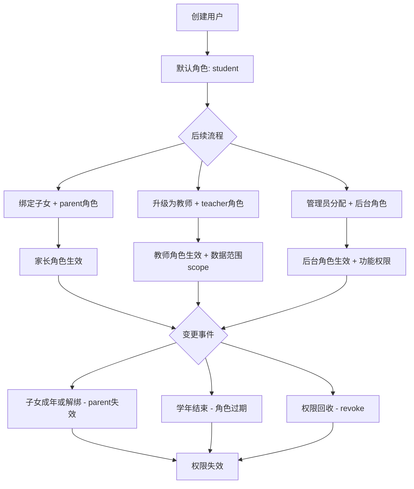
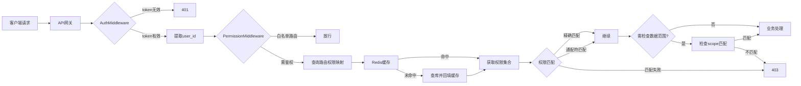
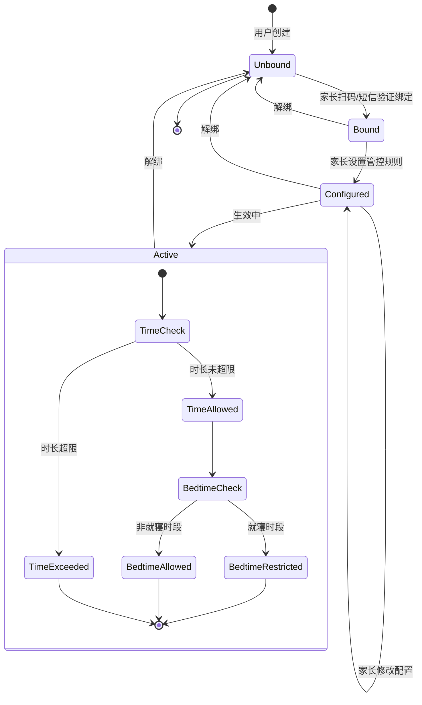

# 用户权限管理 - 详细设计

> 版本：v1.0  
> 日期：2026-06-25  
> 状态：初稿  
> 负责人：待分配  
> 关联模块：用户账号体系、API网关、客户端、教师端、家长中心、内容运营后台

---

## 1. 概述

### 1.1 设计目标

PrimeTop 项目的权限管理涵盖两个层面：

1. **系统级权限**（客户端运行时权限）
   - 操作系统权限：相机、麦克风、存储、通知、定位等
   - 生命周期：运行时动态申请、拒绝后优雅降级
   - 目标：符合未成年人保护法规，提供适龄化文案

2. **业务级权限**（RBAC 权限系统）
   - 功能权限：不同角色可访问的功能模块、API 接口
   - 数据权限：不同角色可查看/操作的数据范围（如教师只看本班学生）
   - 内容权限：按学段、学科、会员等级控制内容可见性
   - 设备权限：家长端对子女设备的时长管控、功能开关

### 1.2 核心原则

| 原则 | 说明 |
|------|------|
| **默认拒绝** | 未明确授权的访问一律拒绝 |
| **最小权限** | 角色只授予完成工作所需的最低权限 |
| **集中管理** | 权限策略在服务端集中存储与校验 |
| **优雅降级** | 权限被拒绝时提供替代方案，不阻塞核心流程 |
| **可观测性** | 所有权限操作可追踪，用于审计和问题排查 |
| **合规审计** | 记录权限变更历史，支持安全审查 |

### 1.3 适用范围

| 端 | 权限类型 | 说明 |
|---|---|---|
| 客户端（学生） | 系统权限 + 业务权限 | 运行时权限申请 + 功能开关 + 数据范围 |
| 客户端（家长） | 系统权限 + 业务权限 + 设备管控 | 额外获得对子女数据的只读访问权和设备管控权 |
| 教师端 | 业务权限 + 数据权限 | 按班级、学科控制可管理的学生数据 |
| 管理后台（Web） | 业务权限 + 数据权限 | 按角色（运营/内容/管理员）控制后台功能 |
| API 网关 | 接口权限 | 统一鉴权、接口级别访问控制 |

---

## 2. 数据结构设计

### 2.1 数据库表结构

#### 2.1.1 角色定义表 (roles)

```sql
CREATE TABLE roles (
    id          BIGINT PRIMARY KEY AUTO_INCREMENT COMMENT '角色ID',
    code        VARCHAR(64) NOT NULL UNIQUE COMMENT '角色编码，如 teacher、student',
    name        VARCHAR(128) NOT NULL COMMENT '角色名称，如 任课教师',
    category    VARCHAR(32) NOT NULL COMMENT '角色分类: platform/education/user',
    description TEXT COMMENT '角色描述',
    is_system   TINYINT(1) NOT NULL DEFAULT 0 COMMENT '是否系统内置角色(不可删除)',
    status      TINYINT(1) NOT NULL DEFAULT 1 COMMENT '1-启用 0-禁用',
    created_at  DATETIME NOT NULL DEFAULT CURRENT_TIMESTAMP,
    updated_at  DATETIME NOT NULL DEFAULT CURRENT_TIMESTAMP ON UPDATE CURRENT_TIMESTAMP,
    INDEX idx_category (category),
    INDEX idx_status (status)
) ENGINE=InnoDB DEFAULT CHARSET=utf8mb4 COMMENT='角色定义表';
```

**TypeScript 类型定义：**

```typescript
// types/role.ts

export enum RoleCategory {
  PLATFORM = 'platform',    // 平台侧角色
  EDUCATION = 'education',  // 教育侧角色
  USER = 'user',            // 用户侧角色
}

export interface Role {
  id: number;
  code: string;           // 角色编码
  name: string;           // 角色名称
  category: RoleCategory;
  description?: string;
  is_system: boolean;
  status: 0 | 1;
  created_at: string;
  updated_at: string;
}
```

#### 2.1.2 权限定义表 (permissions)

```sql
CREATE TABLE permissions (
    id          BIGINT PRIMARY KEY AUTO_INCREMENT COMMENT '权限ID',
    code        VARCHAR(128) NOT NULL UNIQUE COMMENT '权限编码，如 student:read:class',
    name        VARCHAR(128) NOT NULL COMMENT '权限名称，如 查看学生(班级)',
    module      VARCHAR(64) NOT NULL COMMENT '所属模块，如 student/class/ai',
    action      VARCHAR(32) NOT NULL COMMENT '操作类型: create/read/update/delete/approve/export',
    resource    VARCHAR(128) NOT NULL COMMENT '资源标识，如 *, own, class, school',
    description TEXT COMMENT '权限描述',
    created_at  DATETIME NOT NULL DEFAULT CURRENT_TIMESTAMP,
    INDEX idx_module (module),
    INDEX idx_action (action)
) ENGINE=InnoDB DEFAULT CHARSET=utf8mb4 COMMENT='权限定义表';
```

**TypeScript 类型定义：**

```typescript
// types/permission.ts

export enum PermissionAction {
  CREATE = 'create',
  READ = 'read',
  UPDATE = 'update',
  DELETE = 'delete',
  APPROVE = 'approve',
  EXPORT = 'export',
  MANAGE = 'manage',
}

export enum PermissionResource {
  ALL = '*',           // 全部资源
  OWN = 'own',         // 仅自己创建的
  CLASS = 'class',     // 班级范围
  GRADE = 'grade',     // 年级范围
  SCHOOL = 'school',   // 学校范围
  CHILDREN = 'children', // 家长的子女范围
}

export interface Permission {
  id: number;
  code: string;                    // 权限编码：module:action:resource
  name: string;
  module: string;                  // 所属模块
  action: PermissionAction;
  resource: PermissionResource;
  description?: string;
  created_at: string;
}
```

#### 2.1.3 角色-权限关联表 (role_permissions)

```sql
CREATE TABLE role_permissions (
    id             BIGINT PRIMARY KEY AUTO_INCREMENT,
    role_id        BIGINT NOT NULL COMMENT '角色ID',
    permission_id  BIGINT NOT NULL COMMENT '权限ID',
    created_at     DATETIME NOT NULL DEFAULT CURRENT_TIMESTAMP,
    UNIQUE KEY uk_role_perm (role_id, permission_id),
    INDEX idx_role (role_id)
) ENGINE=InnoDB DEFAULT CHARSET=utf8mb4 COMMENT='角色-权限关联表';
```

**TypeScript 类型定义：**

```typescript
// types/role_permission.ts

export interface RolePermission {
  id: number;
  role_id: number;
  permission_id: number;
  created_at: string;
}
```

#### 2.1.4 用户-角色关联表 (user_roles)

```sql
CREATE TABLE user_roles (
    id          BIGINT PRIMARY KEY AUTO_INCREMENT,
    user_id     BIGINT NOT NULL COMMENT '用户ID',
    role_id     BIGINT NOT NULL COMMENT '角色ID',
    scope       JSON DEFAULT NULL COMMENT '数据范围，如 {"school_id":1,"class_ids":[3,4],"subject_ids":[2]}',
    granted_by  BIGINT COMMENT '授权人ID（NULL表示系统自动分配）',
    status      TINYINT(1) NOT NULL DEFAULT 1 COMMENT '1-生效 0-失效',
    expires_at  DATETIME COMMENT '过期时间，NULL表示永不过期',
    created_at  DATETIME NOT NULL DEFAULT CURRENT_TIMESTAMP,
    updated_at  DATETIME NOT NULL DEFAULT CURRENT_TIMESTAMP ON UPDATE CURRENT_TIMESTAMP,
    UNIQUE KEY uk_user_role (user_id, role_id),
    INDEX idx_user (user_id),
    INDEX idx_status (status),
    INDEX idx_expires (expires_at)
) ENGINE=InnoDB DEFAULT CHARSET=utf8mb4 COMMENT='用户-角色关联表';
```

**TypeScript 类型定义：**

```typescript
// types/user_role.ts

export interface DataScope {
  school_id?: number;
  class_ids?: number[];
  grade_ids?: number[];
  subject_ids?: number[];
  children_user_ids?: number[];  // 家长的子女ID列表
  family_id?: string;
  academic_year?: string;
}

export interface UserRole {
  id: number;
  user_id: number;
  role_id: number;
  scope?: DataScope;
  granted_by?: number;
  status: 0 | 1;
  expires_at?: string;
  created_at: string;
  updated_at: string;
}
```

#### 2.1.5 角色继承表 (role_inheritance)

```sql
CREATE TABLE role_inheritance (
    id              BIGINT PRIMARY KEY AUTO_INCREMENT,
    parent_role_id  BIGINT NOT NULL COMMENT '父角色ID',
    child_role_id   BIGINT NOT NULL COMMENT '子角色ID',
    created_at      DATETIME NOT NULL DEFAULT CURRENT_TIMESTAMP,
    UNIQUE KEY uk_inherit (parent_role_id, child_role_id),
    INDEX idx_parent (parent_role_id),
    INDEX idx_child (child_role_id)
) ENGINE=InnoDB DEFAULT CHARSET=utf8mb4 COMMENT='角色继承关系表';
```

**TypeScript 类型定义：**

```typescript
// types/role_inheritance.ts

export interface RoleInheritance {
  id: number;
  parent_role_id: number;
  child_role_id: number;
  created_at: string;
}
```

#### 2.1.6 权限变更审计日志 (permission_audit_log)

```sql
CREATE TABLE permission_audit_log (
    id              BIGINT PRIMARY KEY AUTO_INCREMENT,
    operator_id     BIGINT NOT NULL COMMENT '操作人ID',
    target_user_id  BIGINT COMMENT '目标用户ID（用户角色变更时填写）',
    action_type     VARCHAR(32) NOT NULL COMMENT '操作类型: grant_role/revoke_role/grant_perm/revoke_perm/modify_scope',
    role_id         BIGINT COMMENT '角色ID',
    permission_id   BIGINT COMMENT '权限ID',
    old_value       JSON COMMENT '变更前值',
    new_value       JSON COMMENT '变更后值',
    reason          VARCHAR(512) COMMENT '变更原因',
    ip_address      VARCHAR(45) COMMENT '操作IP',
    created_at      DATETIME NOT NULL DEFAULT CURRENT_TIMESTAMP,
    INDEX idx_operator (operator_id),
    INDEX idx_target (target_user_id),
    INDEX idx_created (created_at)
) ENGINE=InnoDB DEFAULT CHARSET=utf8mb4 COMMENT='权限变更审计日志';
```

**TypeScript 类型定义：**

```typescript
// types/permission_audit_log.ts

export enum AuditActionType {
  GRANT_ROLE = 'grant_role',
  REVOKE_ROLE = 'revoke_role',
  GRANT_PERM = 'grant_perm',
  REVOKE_PERM = 'revoke_perm',
  MODIFY_SCOPE = 'modify_scope',
}

export interface PermissionAuditLog {
  id: number;
  operator_id: number;
  target_user_id?: number;
  action_type: AuditActionType;
  role_id?: number;
  permission_id?: number;
  old_value?: any;
  new_value?: any;
  reason?: string;
  ip_address?: string;
  created_at: string;
}
```

#### 2.1.7 家长-子女绑定关系 (parent_child_bindings)

```sql
CREATE TABLE parent_child_bindings (
    id              BIGINT PRIMARY KEY AUTO_INCREMENT,
    parent_user_id  BIGINT NOT NULL COMMENT '家长用户ID',
    child_user_id   BIGINT NOT NULL COMMENT '子女用户ID',
    relation        VARCHAR(16) NOT NULL DEFAULT 'parent' COMMENT '关系: parent/guardian',
    
    -- 家长管控配置
    daily_time_limit_min   INT DEFAULT NULL COMMENT '每日使用时长限制(分钟)，NULL不限',
    allowed_subjects       JSON DEFAULT NULL COMMENT '允许使用的学科ID列表，NULL不限',
    allowed_features       JSON DEFAULT NULL COMMENT '允许使用的功能列表，NULL不限',
    bedtime_start          TIME DEFAULT NULL COMMENT '就寝时间开始，如 21:00',
    bedtime_end            TIME DEFAULT NULL COMMENT '就寝时间结束，如 07:00',
    
    -- 状态
    status       TINYINT(1) NOT NULL DEFAULT 1 COMMENT '1-生效 0-已解绑',
    bind_method  VARCHAR(32) NOT NULL COMMENT '绑定方式: sms_verify/qr_scan/manual',
    bind_at      DATETIME NOT NULL DEFAULT CURRENT_TIMESTAMP,
    unbind_at    DATETIME COMMENT '解绑时间',
    unbind_reason VARCHAR(256) COMMENT '解绑原因',
    
    UNIQUE KEY uk_parent_child (parent_user_id, child_user_id),
    INDEX idx_child (child_user_id),
    INDEX idx_parent (parent_user_id)
) ENGINE=InnoDB DEFAULT CHARSET=utf8mb4 COMMENT='家长-子女绑定关系';
```

**TypeScript 类型定义：**

```typescript
// types/parent_child_binding.ts

export enum BindMethod {
  SMS_VERIFY = 'sms_verify',
  QR_SCAN = 'qr_scan',
  MANUAL = 'manual',
}

export enum RelationType {
  PARENT = 'parent',
  GUARDIAN = 'guardian',
}

export interface ParentChildBinding {
  id: number;
  parent_user_id: number;
  child_user_id: number;
  relation: RelationType;
  
  // 家长管控配置
  daily_time_limit_min?: number;
  allowed_subjects?: number[];
  allowed_features?: string[];
  bedtime_start?: string;  // HH:mm:ss
  bedtime_end?: string;    // HH:mm:ss
  
  // 状态
  status: 0 | 1;
  bind_method: BindMethod;
  bind_at: string;
  unbind_at?: string;
  unbind_reason?: string;
}
```

#### 2.1.8 家长管控操作日志 (parental_control_log)

```sql
CREATE TABLE parental_control_log (
    id              BIGINT PRIMARY KEY AUTO_INCREMENT,
    parent_user_id  BIGINT NOT NULL,
    child_user_id   BIGINT NOT NULL,
    action          VARCHAR(64) NOT NULL COMMENT '操作: set_time_limit/set_bedtime/set_subjects/force_logout',
    old_value       JSON COMMENT '变更前',
    new_value       JSON COMMENT '变更后',
    ip_address      VARCHAR(45),
    created_at      DATETIME NOT NULL DEFAULT CURRENT_TIMESTAMP,
    INDEX idx_parent_child (parent_user_id, child_user_id),
    INDEX idx_created (created_at)
) ENGINE=InnoDB DEFAULT CHARSET=utf8mb4 COMMENT='家长管控操作日志';
```

#### 2.1.9 教师任教关系 (teacher_assignments)

```sql
CREATE TABLE teacher_assignments (
    id              BIGINT PRIMARY KEY AUTO_INCREMENT,
    teacher_user_id BIGINT NOT NULL COMMENT '教师用户ID',
    school_id       BIGINT NOT NULL COMMENT '学校ID',
    class_id        BIGINT NOT NULL COMMENT '班级ID',
    subject_id      BIGINT NOT NULL COMMENT '学科ID',
    role            VARCHAR(32) NOT NULL DEFAULT 'teacher' COMMENT '角色: teacher/head_teacher',
    academic_year   VARCHAR(16) NOT NULL COMMENT '学年，如 2025-2026',
    status          TINYINT(1) NOT NULL DEFAULT 1 COMMENT '1-在任 0-离任',
    created_at      DATETIME NOT NULL DEFAULT CURRENT_TIMESTAMP,
    updated_at      DATETIME NOT NULL DEFAULT CURRENT_TIMESTAMP ON UPDATE CURRENT_TIMESTAMP,
    UNIQUE KEY uk_assignment (teacher_user_id, class_id, subject_id, academic_year),
    INDEX idx_teacher (teacher_user_id),
    INDEX idx_class (class_id),
    INDEX idx_school (school_id)
) ENGINE=InnoDB DEFAULT CHARSET=utf8mb4 COMMENT='教师任教关系表';
```

**TypeScript 类型定义：**

```typescript
// types/teacher_assignment.ts

export enum TeacherRole {
  TEACHER = 'teacher',
  HEAD_TEACHER = 'head_teacher',
}

export interface TeacherAssignment {
  id: number;
  teacher_user_id: number;
  school_id: number;
  class_id: number;
  subject_id: number;
  role: TeacherRole;
  academic_year: string;
  status: 0 | 1;
  created_at: string;
  updated_at: string;
}
```

### 2.2 Redis 缓存结构

| 缓存键 | 类型 | TTL | 说明 |
|--------|------|-----|------|
| `perm:user:{user_id}` | Set | 300s | 用户权限编码集合 |
| `perm:roles:{user_id}` | JSON | 300s | 用户角色列表（含 scope） |
| `perm:role:{role_id}` | Set | 300s | 角色权限编码集合 |
| `perm:gates:{user_id}` | JSON | 300s | 用户功能开关配置 |
| `perm:parent:{child_user_id}` | JSON | 300s | 子女的家长管控配置 |

---

## 3. API 接口设计

### 3.1 权限检查接口

#### 3.1.1 获取当前用户权限列表

**接口地址：** `GET /api/v1/auth/permissions`

**请求头：**
```
Authorization: Bearer {jwt_token}
```

**响应示例：**

```json
{
  "code": 0,
  "message": "success",
  "data": {
    "user_id": 10086,
    "roles": [
      {
        "role_id": 10,
        "role_code": "teacher",
        "role_name": "任课教师",
        "scope": {
          "school_id": 1,
          "class_ids": [3, 4],
          "subject_ids": [2]
        }
      }
    ],
    "permissions": [
      "class:read:own",
      "student:read:class",
      "assignment:create:class",
      "report:read:class"
    ],
    "features": {
      "ai_chat_daily_limit": 30,
      "photo_search_daily_limit": 20,
      "can_export_report": false,
      "can_manage_parental_control": false
    }
  }
}
```

**TypeScript 接口定义：**

```typescript
// api/types/auth.ts

export interface AuthPermissionsResponse {
  code: number;
  message: string;
  data: {
    user_id: number;
    roles: RoleInfo[];
    permissions: string[];
    features: FeatureConfig;
  };
}

export interface RoleInfo {
  role_id: number;
  role_code: string;
  role_name: string;
  scope?: DataScope;
}

export interface FeatureConfig {
  ai_chat_daily_limit?: number;
  photo_search_daily_limit?: number;
  can_export_report?: boolean;
  can_manage_parental_control?: boolean;
}
```

#### 3.1.2 检查单个权限

**接口地址：** `POST /api/v1/auth/check-permission`

**请求体：**

```json
{
  "permission": "student:read:class",
  "resource_context": {
    "class_id": 3
  }
}
```

**响应示例：**

```json
{
  "code": 0,
  "message": "success",
  "data": {
    "allowed": true,
    "reason": null,
    "matched_scope": {
      "class_ids": [3, 4],
      "school_id": 1
    }
  }
}
```

**TypeScript 接口定义：**

```typescript
// api/types/auth.ts

export interface CheckPermissionRequest {
  permission: string;
  resource_context?: Record<string, any>;
}

export interface CheckPermissionResponse {
  code: number;
  message: string;
  data: {
    allowed: boolean;
    reason?: string;
    matched_scope?: DataScope;
  };
}
```

#### 3.1.3 批量检查权限

**接口地址：** `POST /api/v1/auth/check-permissions`

**请求体：**

```json
{
  "permissions": [
    {
      "permission": "student:read:class",
      "resource_context": {"class_id": 3}
    },
    {
      "permission": "report:export:school",
      "resource_context": {"school_id": 1}
    },
    {
      "permission": "content:question:create",
      "resource_context": {}
    }
  ]
}
```

**响应示例：**

```json
{
  "code": 0,
  "message": "success",
  "data": {
    "results": [
      {
        "permission": "student:read:class",
        "allowed": true
      },
      {
        "permission": "report:export:school",
        "allowed": false,
        "reason": "role_not_authorized"
      },
      {
        "permission": "content:question:create",
        "allowed": false,
        "reason": "role_not_authorized"
      }
    ]
  }
}
```

### 3.2 功能开关接口

#### 3.2.1 获取功能开关配置

**接口地址：** `GET /api/v1/auth/feature-gates`

**响应示例：**

```json
{
  "code": 0,
  "message": "success",
  "data": {
    "tabs": {
      "home": {"visible": true, "badge": null},
      "ai_chat": {"visible": true, "badge": null},
      "sync_course": {"visible": true, "badge": null},
      "mistake": {"visible": true, "badge": "3"},
      "profile": {"visible": true, "badge": null}
    },
    "features": {
      "photo_search": {
        "enabled": true,
        "daily_limit": 20,
        "daily_used": 5
      },
      "ai_chat": {
        "enabled": true,
        "daily_limit": 30,
        "daily_used": 12
      },
      "voice_input": {"enabled": true},
      "essay_review": {
        "enabled": true,
        "monthly_limit": 5,
        "monthly_used": 2
      },
      "mistake_review": {"enabled": true},
      "study_plan": {"enabled": true},
      "parental_control": {
        "enabled": false,
        "reason": "not_parent_role"
      },
      "english_oral": {"enabled": true},
      "pinyin_learning": {
        "enabled": false,
        "reason": "grade_not_applicable"
      }
    },
    "membership": {
      "tier": "monthly",
      "expires_at": "2026-06-19T23:59:59Z",
      "features_unlocked": [
        "unlimited_ai_chat",
        "full_analysis",
        "essay_review_unlimited"
      ]
    }
  }
}
```

**TypeScript 接口定义：**

```typescript
// api/types/feature_gates.ts

export interface FeatureGatesResponse {
  code: number;
  message: string;
  data: {
    tabs: Record<string, TabConfig>;
    features: Record<string, FeatureGate>;
    membership: MembershipInfo;
  };
}

export interface TabConfig {
  visible: boolean;
  badge?: string | null;
}

export interface FeatureGate {
  enabled: boolean;
  reason?: string;
  daily_limit?: number;
  daily_used?: number;
  monthly_limit?: number;
  monthly_used?: number;
}

export interface MembershipInfo {
  tier: string;
  expires_at: string;
  features_unlocked: string[];
}
```

### 3.3 角色管理接口（管理后台）

#### 3.3.1 获取角色列表

**接口地址：** `GET /api/v1/admin/roles`

**请求参数：**

| 参数 | 类型 | 必填 | 说明 |
|------|------|------|------|
| category | string | 否 | 角色分类：platform/education/user |
| page | number | 否 | 页码，默认 1 |
| page_size | number | 否 | 每页数量，默认 20 |

**响应示例：**

```json
{
  "code": 0,
  "message": "success",
  "data": {
    "total": 6,
    "page": 1,
    "page_size": 20,
    "items": [
      {
        "id": 1,
        "code": "super_admin",
        "name": "超级管理员",
        "category": "platform",
        "description": "拥有所有权限",
        "is_system": true,
        "status": 1,
        "user_count": 2,
        "permission_count": 45,
        "created_at": "2026-01-01T00:00:00Z"
      }
    ]
  }
}
```

#### 3.3.2 创建自定义角色

**接口地址：** `POST /api/v1/admin/roles`

**请求体：**

```json
{
  "code": "content_reviewer",
  "name": "内容审核员",
  "category": "platform",
  "description": "负责审核用户上传内容和AI输出内容",
  "permission_ids": [15, 16, 17, 28]
}
```

**响应示例：**

```json
{
  "code": 0,
  "message": "success",
  "data": {
    "id": 20,
    "code": "content_reviewer",
    "name": "内容审核员",
    "category": "platform",
    "description": "负责审核用户上传内容和AI输出内容",
    "is_system": false,
    "status": 1,
    "permission_count": 4,
    "created_at": "2026-06-25T10:00:00Z"
  }
}
```

#### 3.3.3 更新角色权限

**接口地址：** `PUT /api/v1/admin/roles/{role_id}/permissions`

**请求体：**

```json
{
  "permission_ids": [15, 16, 17, 28, 29],
  "reason": "新增内容审核导出权限"
}
```

**响应示例：**

```json
{
  "code": 0,
  "message": "success",
  "data": {
    "role_id": 20,
    "permission_ids": [15, 16, 17, 28, 29],
    "permission_count": 5,
    "updated_at": "2026-06-25T10:05:00Z"
  }
}
```

#### 3.3.4 为用户分配角色

**接口地址：** `POST /api/v1/admin/users/{user_id}/roles`

**请求体：**

```json
{
  "role_id": 5,
  "scope": {
    "school_id": 1,
    "class_ids": [3, 4]
  },
  "expires_at": "2026-08-31T23:59:59Z",
  "reason": "2025-2026学年教师授权"
}
```

**响应示例：**

```json
{
  "code": 0,
  "message": "success",
  "data": {
    "id": 1001,
    "user_id": 123,
    "role_id": 5,
    "scope": {
      "school_id": 1,
      "class_ids": [3, 4]
    },
    "granted_by": 1,
    "status": 1,
    "expires_at": "2026-08-31T23:59:59Z",
    "created_at": "2026-06-25T10:10:00Z"
  }
}
```

#### 3.3.5 撤销用户角色

**接口地址：** `DELETE /api/v1/admin/users/{user_id}/roles/{role_id}`

**请求参数：**

| 参数 | 类型 | 必填 | 说明 |
|------|------|------|------|
| reason | string | 是 | 撤销原因 |

**响应示例：**

```json
{
  "code": 0,
  "message": "success",
  "data": {
    "revoked": true,
    "role_id": 5,
    "reason": "离职",
    "revoked_at": "2026-06-25T10:15:00Z"
  }
}
```

### 3.4 家长管控接口

#### 3.4.1 绑定子女

**接口地址：** `POST /api/v1/parent/bind-child`

**请求体：**

```json
{
  "bind_method": "qr_scan",
  "child_user_id": 10087,
  "relation": "parent"
}
```

**响应示例：**

```json
{
  "code": 0,
  "message": "success",
  "data": {
    "id": 500,
    "parent_user_id": 10086,
    "child_user_id": 10087,
    "relation": "parent",
    "status": 1,
    "bind_method": "qr_scan",
    "bind_at": "2026-06-25T10:20:00Z"
  }
}
```

#### 3.4.2 获取家长管控配置

**接口地址：** `GET /api/v1/parent/control-config/{child_user_id}`

**响应示例：**

```json
{
  "code": 0,
  "message": "success",
  "data": {
    "child_user_id": 10087,
    "controlled": true,
    "daily_limit_min": 120,
    "today_usage_min": 45,
    "bedtime_start": "21:00:00",
    "bedtime_end": "07:00:00",
    "allowed_subjects": [1, 2, 3],
    "restricted_features": ["ai_chat"]
  }
}
```

#### 3.4.3 更新家长管控配置

**接口地址：** `PUT /api/v1/parent/control-config/{child_user_id}`

**请求体：**

```json
{
  "daily_time_limit_min": 120,
  "bedtime_start": "21:00",
  "bedtime_end": "07:00",
  "allowed_subjects": [1, 2, 3],
  "allowed_features": ["photo_search", "essay_review"]
}
```

**响应示例：**

```json
{
  "code": 0,
  "message": "success",
  "data": {
    "updated": true,
    "child_user_id": 10087,
    "updated_at": "2026-06-25T10:25:00Z"
  }
}
```

---

## 4. 核心代码实现

### 4.1 后端实现 (Node.js + TypeScript)

#### 4.1.1 权限服务核心类

```typescript
// services/permission.service.ts

import { Redis } from 'ioredis';
import { PermissionRepository } from '../repositories/permission.repository';
import { RoleRepository } from '../repositories/role.repository';
import { UserRepository } from '../repositories/user.repository';
import { 
  PermissionCheckResult, 
  CheckPermissionRequest,
  DataScope 
} from '../types/permission';

export class PermissionService {
  private redis: Redis;
  private permRepo: PermissionRepository;
  private roleRepo: RoleRepository;
  private userRepo: UserRepository;

  constructor(redis: Redis) {
    this.redis = redis;
    this.permRepo = new PermissionRepository();
    this.roleRepo = new RoleRepository();
    this.userRepo = new UserRepository();
  }

  /**
   * 检查用户是否拥有指定权限
   */
  async check(
    userId: number,
    permissionCode: string,
    resourceContext?: Record<string, any>
  ): Promise<PermissionCheckResult> {
    // 1. 获取用户权限集
    const permissions = await this.getUserPermissions(userId);

    // 2. 精确匹配
    if (permissions.has(permissionCode)) {
      return this.checkDataScope(userId, permissionCode, resourceContext);
    }

    // 3. 通配符匹配 (user:read:* 可覆盖 user:read:class)
    const [module, action] = permissionCode.split(':');
    const wildcard = `${module}:${action}:*`;
    if (permissions.has(wildcard)) {
      return { allowed: true, matched_scope: { scope: '*' } };
    }

    // 4. 权限不足
    return { allowed: false, reason: 'permission_denied' };
  }

  /**
   * 批量检查权限
   */
  async checkMany(
    userId: number,
    requests: CheckPermissionRequest[]
  ): Promise<PermissionCheckResult[]> {
    const permissions = await this.getUserPermissions(userId);
    const results: PermissionCheckResult[] = [];

    for (const req of requests) {
      if (permissions.has(req.permission)) {
        const result = await this.checkDataScope(userId, req.permission, req.resource_context);
        results.push(result);
      } else {
        const [module, action] = req.permission.split(':');
        const wildcard = `${module}:${action}:*`;
        if (permissions.has(wildcard)) {
          results.push({ allowed: true, matched_scope: { scope: '*' } });
        } else {
          results.push({ allowed: false, reason: 'permission_denied' });
        }
      }
    }

    return results;
  }

  /**
   * 获取用户权限集合
   */
  async getUserPermissions(userId: number): Promise<Set<string>> {
    // 先查缓存
    const cacheKey = `perm:user:${userId}`;
    const cached = await this.redis.smembers(cacheKey);
    if (cached.length > 0) {
      return new Set(cached);
    }

    // 缓存未命中，从数据库加载
    const permissions = await this.loadAndCachePermissions(userId);
    return permissions;
  }

  /**
   * 从数据库加载权限并缓存
   */
  private async loadAndCachePermissions(userId: number): Promise<Set<string>> {
    // 1. 查询用户所有角色
    const userRoles = await this.userRepo.getUserRoles(userId);
    const allPermissions = new Set<string>();

    for (const userRole of userRoles) {
      if (userRole.status !== 1) continue;

      // 2. 获取角色直接权限
      const rolePerms = await this.getRolePermissions(userRole.role_id);
      rolePerms.forEach(p => allPermissions.add(p));

      // 3. 获取继承权限（递归）
      const inherited = await this.getInheritedPermissions(userRole.role_id);
      inherited.forEach(p => allPermissions.add(p));
    }

    // 4. 缓存用户权限
    const cacheKey = `perm:user:${userId}`;
    await this.redis.sadd(cacheKey, ...Array.from(allPermissions));
    await this.redis.expire(cacheKey, 300); // 5 分钟

    return allPermissions;
  }

  /**
   * 获取角色权限
   */
  async getRolePermissions(roleId: number): Promise<string[]> {
    const cacheKey = `perm:role:${roleId}`;
    const cached = await this.redis.smembers(cacheKey);
    if (cached.length > 0) {
      return cached;
    }

    const permissions = await this.permRepo.getByRoleId(roleId);
    const codes = permissions.map(p => p.code);

    await this.redis.sadd(cacheKey, ...codes);
    await this.redis.expire(cacheKey, 300);

    return codes;
  }

  /**
   * 递归获取继承权限
   */
  private async getInheritedPermissions(
    roleId: number,
    visited: Set<number> = new Set()
  ): Promise<string[]> {
    if (visited.has(roleId)) return [];
    visited.add(roleId);

    const parentRoles = await this.roleRepo.getParentRoles(roleId);
    const allPermissions: string[] = [];

    for (const parent of parentRoles) {
      const perms = await this.getRolePermissions(parent.id);
      allPermissions.push(...perms);
      allPermissions.push(...await this.getInheritedPermissions(parent.id, visited));
    }

    return allPermissions;
  }

  /**
   * 检查数据范围
   */
  private async checkDataScope(
    userId: number,
    permissionCode: string,
    resourceContext?: Record<string, any>
  ): Promise<PermissionCheckResult> {
    // 解析权限编码中的范围级别
    const parts = permissionCode.split(':');
    const scopeLevel = parts[2]; // class/grade/school/own/*

    if (scopeLevel === '*' || scopeLevel === 'own') {
      return { allowed: true };
    }

    if (!resourceContext) {
      return { allowed: false, reason: 'missing_context' };
    }

    // 获取用户的数据范围
    const userRoles = await this.getUserRoles(userId);
    for (const userRole of userRoles) {
      const scope = userRole.scope;
      if (!scope) continue;

      // 按范围级别检查
      if (scopeLevel === 'class' && scope.class_ids) {
        const targetId = resourceContext.class_id;
        if (targetId && scope.class_ids.includes(targetId)) {
          return { allowed: true, matched_scope: scope };
        }
      }

      if (scopeLevel === 'grade' && scope.grade_ids) {
        const targetId = resourceContext.grade_id;
        if (targetId && scope.grade_ids.includes(targetId)) {
          return { allowed: true, matched_scope: scope };
        }
      }

      if (scopeLevel === 'school' && scope.school_id) {
        const targetId = resourceContext.school_id;
        if (targetId && targetId === scope.school_id) {
          return { allowed: true, matched_scope: scope };
        }
      }

      if (scopeLevel === 'children' && scope.children_user_ids) {
        const targetId = resourceContext.target_user_id;
        if (targetId && scope.children_user_ids.includes(targetId)) {
          return { allowed: true, matched_scope: scope };
        }
      }
    }

    return { allowed: false, reason: 'data_scope_denied' };
  }

  /**
   * 获取用户角色列表
   */
  async getUserRoles(userId: number): Promise<any[]> {
    const cacheKey = `perm:roles:${userId}`;
    const cached = await this.redis.get(cacheKey);
    if (cached) {
      return JSON.parse(cached);
    }

    const userRoles = await this.userRepo.getUserRoles(userId);
    await this.redis.setex(cacheKey, 300, JSON.stringify(userRoles));

    return userRoles;
  }

  /**
   * 使缓存失效
   */
  async invalidateUser(userId: number): Promise<void> {
    const keys = [
      `perm:user:${userId}`,
      `perm:roles:${userId}`,
      `perm:gates:${userId}`,
    ];
    await this.redis.del(...keys);
  }

  async invalidateRole(roleId: number): Promise<void> {
    await this.redis.del(`perm:role:${roleId}`);
    // 需要异步扫描关联用户并清除缓存
  }
}
```

#### 4.1.2 权限中间件 (Express)

```typescript
// middleware/permission.middleware.ts

import { Request, Response, NextFunction } from 'express';
import { PermissionService } from '../services/permission.service';
import { ROUTE_PERMISSIONS } from '../config/route-permissions';

// 扩展 Express Request 类型
declare global {
  namespace Express {
    interface Request {
      user?: {
        id: number;
        role_code?: string;
      };
      dataScope?: any;
    }
  }
}

/**
 * 权限校验中间件工厂
 */
export function requirePermission(permissionCode: string) {
  return async (req: Request, res: Response, next: NextFunction) => {
    try {
      if (!req.user) {
        return res.status(401).json({
          code: 'TOKEN_INVALID',
          message: '未登录或 token 无效',
        });
      }

      const permService = req.app.get('permissionService') as PermissionService;

      // 构建资源上下文
      const resourceContext = buildResourceContext(req);

      // 执行权限检查
      const result = await permService.check(
        req.user.id,
        permissionCode,
        resourceContext
      );

      if (!result.allowed) {
        return res.status(403).json({
          code: 'PERMISSION_DENIED',
          message: `无权访问: ${permissionCode}`,
          reason: result.reason,
        });
      }

      // 将匹配的数据范围注入 request
      if (result.matched_scope) {
        req.dataScope = result.matched_scope;
      }

      next();
    } catch (error) {
      console.error('权限检查失败:', error);
      res.status(500).json({
        code: 'INTERNAL_ERROR',
        message: '权限检查失败',
      });
    }
  };
}

/**
 * 路由权限配置中间件
 * 根据 ROUTE_PERMISSIONS 配置自动校验
 */
export function routePermissionMiddleware(
  req: Request,
  res: Response,
  next: NextFunction
) {
  const routeKey = `${req.method}:${req.route.path}`;
  const requiredPermission = ROUTE_PERMISSIONS[routeKey];

  // 白名单路由直接放行
  if (!requiredPermission) {
    return next();
  }

  // 动态注入权限检查
  const checkPerm = requirePermission(requiredPermission);
  checkPerm(req, res, next);
}

/**
 * 根据请求构建资源上下文
 */
function buildResourceContext(req: Request): Record<string, any> {
  const context: Record<string, any> = {};

  // 从路径参数提取
  if (req.params.class_id) context.class_id = parseInt(req.params.class_id);
  if (req.params.school_id) context.school_id = parseInt(req.params.school_id);
  if (req.params.student_id) context.student_user_id = parseInt(req.params.student_id);
  if (req.params.id) context.id = parseInt(req.params.id);

  // 从查询参数提取
  if (req.query.class_id) context.class_id = parseInt(req.query.class_id as string);

  return context;
}
```

#### 4.1.3 家长管控服务

```typescript
// services/parental-control.service.ts

import { ParentChildBindingRepository } from '../repositories/parent-child-binding.repository';
import { LearningRecordService } from './learning-record.service';
import { ParentChildBinding } from '../types/parent-child-binding';

export class ParentalControlService {
  private bindingRepo: ParentChildBindingRepository;
  private learningService: LearningRecordService;

  constructor() {
    this.bindingRepo = new ParentChildBindingRepository();
    this.learningService = new LearningRecordService();
  }

  /**
   * 检查家长是否有权访问子女数据
   */
  async checkAccessAllowed(parentUserId: number, childUserId: number): Promise<boolean> {
    const binding = await this.bindingRepo.getActiveBinding(parentUserId, childUserId);
    return binding !== null;
  }

  /**
   * 检查子女当前是否在允许使用时间内
   */
  async checkTimeRestriction(childUserId: number): Promise<{ allowed: boolean; reason?: string }> {
    const binding = await this.getAnyActiveBinding(childUserId);
    if (!binding) return { allowed: true }; // 未绑定家长，不限制

    // 就寝时间检查
    const now = new Date();
    const currentTime = now.toTimeString().slice(0, 8); // HH:mm:ss

    if (binding.bedtime_start && binding.bedtime_end) {
      if (this.isInBedtime(currentTime, binding.bedtime_start, binding.bedtime_end)) {
        return { allowed: false, reason: 'bedtime_restriction' };
      }
    }

    // 每日时长检查
    if (binding.daily_time_limit_min) {
      const todayUsage = await this.getTodayUsage(childUserId);
      if (todayUsage >= binding.daily_time_limit_min) {
        return { allowed: false, reason: 'daily_limit_exceeded' };
      }
    }

    return { allowed: true };
  }

  /**
   * 检查子女是否被允许使用某功能
   */
  async checkFeatureAllowed(childUserId: number, featureCode: string): Promise<boolean> {
    const binding = await this.getAnyActiveBinding(childUserId);
    if (!binding || !binding.allowed_features) {
      return true; // 未限制
    }
    return binding.allowed_features.includes(featureCode);
  }

  /**
   * 获取子女的家长管控状态
   */
  async getControlStatus(childUserId: number): Promise<any> {
    const binding = await this.getAnyActiveBinding(childUserId);
    if (!binding) {
      return { controlled: false };
    }

    const timeCheck = await this.checkTimeRestriction(childUserId);

    return {
      controlled: true,
      time_allowed: timeCheck.allowed,
      time_reason: timeCheck.reason,
      daily_limit_min: binding.daily_time_limit_min,
      today_usage_min: await this.getTodayUsage(childUserId),
      bedtime_start: binding.bedtime_start,
      bedtime_end: binding.bedtime_end,
      allowed_subjects: binding.allowed_subjects,
      restricted_features: binding.allowed_features,
    };
  }

  /**
   * 更新家长管控配置
   */
  async updateControlConfig(
    parentUserId: number,
    childUserId: number,
    config: Partial<ParentChildBinding>
  ): Promise<boolean> {
    // 验证绑定关系
    const binding = await this.bindingRepo.getActiveBinding(parentUserId, childUserId);
    if (!binding) {
      throw new Error('未绑定该子女');
    }

    // 更新配置
    await this.bindingRepo.update(binding.id, config);

    // 记录操作日志
    await this.logControlAction(parentUserId, childUserId, 'update_config', config);

    return true;
  }

  /**
   * 判断当前时间是否在就寝时段内
   */
  private isInBedtime(now: string, start: string, end: string): boolean {
    if (start <= end) {
      // 不跨午夜，如 12:00 ~ 14:00
      return now >= start && now <= end;
    } else {
      // 跨午夜，如 21:00 ~ 次日 07:00
      return now >= start || now <= end;
    }
  }

  /**
   * 获取今日使用时长（分钟）
   */
  private async getTodayUsage(childUserId: number): Promise<number> {
    return await this.learningService.getTodayDuration(childUserId);
  }

  /**
   * 获取子女的一条有效绑定
   */
  private async getAnyActiveBinding(childUserId: number): Promise<ParentChildBinding | null> {
    return await this.bindingRepo.getByChildUserId(childUserId);
  }

  /**
   * 记录管控操作日志
   */
  private async logControlAction(
    parentUserId: number,
    childUserId: number,
    action: string,
    newValue: any
  ): Promise<void> {
    // 实现日志记录逻辑
  }
}
```

### 4.2 前端实现 (Flutter + Dart)

#### 4.2.1 权限状态管理 (Riverpod)

```dart
// lib/core/auth/permission_provider.dart

import 'package:flutter_riverpod/flutter_riverpod.dart';
import 'package:dio/dio.dart';

/// 权限状态模型
class PermissionState {
  final Set<String> permissions;
  final Map<String, FeatureGate> features;
  final List<UserRoleInfo> roles;
  final bool isLoading;
  final String? error;

  const PermissionState({
    this.permissions = const {},
    this.features = const {},
    this.roles = const [],
    this.isLoading = false,
    this.error,
  });

  bool hasPermission(String code) => permissions.contains(code);

  bool isFeatureEnabled(String featureCode) {
    final gate = features[featureCode];
    return gate?.enabled ?? false;
  }

  bool hasRole(String roleCode) =>
      roles.any((r) => r.code == roleCode);

  PermissionState copyWith({
    Set<String>? permissions,
    Map<String, FeatureGate>? features,
    List<UserRoleInfo>? roles,
    bool? isLoading,
    String? error,
  }) {
    return PermissionState(
      permissions: permissions ?? this.permissions,
      features: features ?? this.features,
      roles: roles ?? this.roles,
      isLoading: isLoading ?? this.isLoading,
      error: error,
    );
  }
}

/// 功能开关模型
class FeatureGate {
  final bool enabled;
  final int? dailyLimit;
  final int? dailyUsed;
  final int? monthlyLimit;
  final int? monthlyUsed;
  final String? reason;

  const FeatureGate({
    required this.enabled,
    this.dailyLimit,
    this.dailyUsed,
    this.monthlyLimit,
    this.monthlyUsed,
    this.reason,
  });

  bool get isLimited => dailyLimit != null || monthlyLimit != null;
  
  bool get isExhausted =>
      (dailyLimit != null && dailyUsed != null && dailyUsed! >= dailyLimit!) ||
      (monthlyLimit != null && monthlyUsed != null && monthlyUsed! >= monthlyLimit!);
  
  int get dailyRemaining => (dailyLimit ?? 0) - (dailyUsed ?? 0);
  int get monthlyRemaining => (monthlyLimit ?? 0) - (monthlyUsed ?? 0);
}

/// 用户角色信息
class UserRoleInfo {
  final int roleId;
  final String code;
  final String name;
  final Map<String, dynamic>? scope;

  const UserRoleInfo({
    required this.roleId,
    required this.code,
    required this.name,
    this.scope,
  });
}

/// API 客户端 Provider
final apiClientProvider = Provider<Dio>((ref) {
  final dio = Dio(BaseOptions(
    baseUrl: 'https://api.primetop.com',
    connectTimeout: const Duration(seconds: 10),
  ));
  return dio;
});

/// 权限 Provider
final permissionProvider =
    StateNotifierProvider<PermissionNotifier, PermissionState>(
  (ref) => PermissionNotifier(ref.read(apiClientProvider)),
);

class PermissionNotifier extends StateNotifier<PermissionState> {
  final Dio _dio;

  PermissionNotifier(this._dio)
      : super(const PermissionState(isLoading: true));

  /// 登录后加载权限
  Future<void> loadPermissions() async {
    state = state.copyWith(isLoading: true, error: null);
    try {
      final response = await _dio.get('/api/v1/auth/permissions');
      final data = response.data['data'];

      state = PermissionState(
        permissions: Set<String>.from(data['permissions'] ?? []),
        features: _parseFeatures(data['features'] ?? {}),
        roles: _parseRoles(data['roles'] ?? []),
        isLoading: false,
      );
    } catch (e) {
      state = state.copyWith(
        isLoading: false,
        error: e.toString(),
      );
    }
  }

  /// 刷新功能开关
  Future<void> refreshFeatureGates() async {
    try {
      final response = await _dio.get('/api/v1/auth/feature-gates');
      final data = response.data['data'];
      state = state.copyWith(
        features: _parseFeatures(data['features'] ?? {}),
      );
    } catch (_) {}
  }

  /// 登出时清除
  void clear() {
    state = const PermissionState();
  }

  Map<String, FeatureGate> _parseFeatures(Map<String, dynamic> json) {
    return json.map((key, value) => MapEntry(
          key,
          FeatureGate(
            enabled: value['enabled'] ?? false,
            dailyLimit: value['daily_limit'],
            dailyUsed: value['daily_used'],
            monthlyLimit: value['monthly_limit'],
            monthlyUsed: value['monthly_used'],
            reason: value['reason'],
          ),
        ));
  }

  List<UserRoleInfo> _parseRoles(List json) {
    return json
        .map((r) => UserRoleInfo(
              roleId: r['role_id'],
              code: r['role_code'],
              name: r['role_name'],
              scope: r['scope'],
            ))
        .toList();
  }
}

/// 权限检查 Widget
class PermissionGuard extends ConsumerWidget {
  final String permission;
  final Widget child;
  final Widget? fallback;

  const PermissionGuard({
    super.key,
    required this.permission,
    required this.child,
    this.fallback,
  });

  @override
  Widget build(BuildContext context, WidgetRef ref) {
    final perms = ref.watch(permissionProvider);
    if (perms.hasPermission(permission)) {
      return child;
    }
    return fallback ?? const SizedBox.shrink();
  }
}

/// 功能开关 Widget
class FeatureGateGuard extends ConsumerWidget {
  final String featureCode;
  final Widget child;
  final Widget? fallback;

  const FeatureGateGuard({
    super.key,
    required this.featureCode,
    required this.child,
    this.fallback,
  });

  @override
  Widget build(BuildContext context, WidgetRef ref) {
    final perms = ref.watch(permissionProvider);
    if (perms.isFeatureEnabled(featureCode)) {
      return child;
    }
    return fallback ?? const SizedBox.shrink();
  }
}

/// 功能限额展示 Widget
class FeatureLimitWidget extends ConsumerWidget {
  final String featureCode;
  final VoidCallback? onExhausted;

  const FeatureLimitWidget({
    super.key,
    required this.featureCode,
    this.onExhausted,
  });

  @override
  Widget build(BuildContext context, WidgetRef ref) {
    final perms = ref.watch(permissionProvider);
    final gate = perms.features[featureCode];

    if (gate == null || !gate.enabled) {
      return const SizedBox.shrink();
    }

    if (gate.isExhausted && onExhausted != null) {
      return ElevatedButton(
        onPressed: onExhausted,
        child: const Text('额度已用完，开通会员解锁'),
      );
    }

    if (gate.isLimited) {
      final remaining = gate.monthlyRemaining > 0 
          ? gate.monthlyRemaining 
          : gate.dailyRemaining;
      
      return Text('剩余次数: $remaining');
    }

    return const SizedBox.shrink();
  }
}
```

#### 4.2.2 权限错误处理

```dart
// lib/core/auth/permission_error_handler.dart

import 'package:flutter/material.dart';
import 'package:dio/dio.dart';

class PermissionErrorHandler {
  static void handle(DioException error, BuildContext context) {
    if (error.response?.statusCode == null) return;

    final code = error.response?.data?['detail']?['code'] as String?;

    switch (code) {
      case 'PERMISSION_DENIED':
      case 'ROLE_NOT_AUTHORIZED':
      case 'DATA_SCOPE_DENIED':
        _showPermissionDeniedDialog(context);
        break;

      case 'FEATURE_DISABLED':
        _showFeatureLockedDialog(context);
        break;

      case 'DAILY_LIMIT_EXCEEDED':
      case 'MONTHLY_LIMIT_EXCEEDED':
        _showLimitExceededDialog(context, code);
        break;

      case 'BEDTIME_RESTRICTED':
        _showBedtimeDialog(context);
        break;

      case 'TOKEN_EXPIRED':
        // 自动刷新 token，由 Dio interceptor 处理
        break;

      case 'TOKEN_INVALID':
        _navigateToLogin(context);
        break;

      case 'ROLE_EXPIRED':
        _showRoleExpiredDialog(context);
        break;

      default:
        if (error.response?.statusCode == 403) {
          _showPermissionDeniedDialog(context);
        } else if (error.response?.statusCode == 401) {
          _navigateToLogin(context);
        }
    }
  }

  static void _showPermissionDeniedDialog(BuildContext context) {
    showDialog(
      context: context,
      builder: (ctx) => AlertDialog(
        title: const Text('无访问权限'),
        content: const Text('您没有权限执行此操作，请联系管理员。'),
        actions: [
          TextButton(
            onPressed: () => Navigator.pop(ctx),
            child: const Text('确定'),
          ),
        ],
      ),
    );
  }

  static void _showLimitExceededDialog(BuildContext context, String code) {
    final isDaily = code == 'DAILY_LIMIT_EXCEEDED';
    showDialog(
      context: context,
      builder: (ctx) => AlertDialog(
        title: Text(isDaily ? '今日额度已用完' : '本月额度已用完'),
        content: const Text('开通会员可解锁更多额度，享受无限使用。'),
        actions: [
          TextButton(
            onPressed: () => Navigator.pop(ctx),
            child: const Text('稍后再说'),
          ),
          FilledButton(
            onPressed: () {
              Navigator.pop(ctx);
              Navigator.pushNamed(context, '/membership');
            },
            child: const Text('开通会员'),
          ),
        ],
      ),
    );
  }

  static void _showBedtimeDialog(BuildContext context) {
    showDialog(
      context: context,
      builder: (ctx) => AlertDialog(
        title: const Text('休息时间到了 🌙'),
        content: const Text('家长已设置就寝时间，请好好休息，明天继续学习吧！'),
        actions: [
          TextButton(
            onPressed: () {
              Navigator.pop(ctx);
              Navigator.popUntil(context, (route) => route.isFirst);
            },
            child: const Text('好的'),
          ),
        ],
      ),
    );
  }

  static void _navigateToLogin(BuildContext context) {
    Navigator.pushNamedAndRemoveUntil(
      context,
      '/login',
      (route) => false,
    );
  }

  static void _showFeatureLockedDialog(BuildContext context) {
    showDialog(
      context: context,
      builder: (ctx) => AlertDialog(
        title: const Text('功能暂未开放'),
        content: const Text('此功能暂未开放，敬请期待。'),
        actions: [
          TextButton(
            onPressed: () => Navigator.pop(ctx),
            child: const Text('确定'),
          ),
        ],
      ),
    );
  }

  static void _showRoleExpiredDialog(BuildContext context) {
    showDialog(
      context: context,
      builder: (ctx) => AlertDialog(
        title: const Text('角色已过期'),
        content: const Text('您的角色已过期，请联系管理员续期。'),
        actions: [
          TextButton(
            onPressed: () => Navigator.pop(ctx),
            child: const Text('确定'),
          ),
        ],
      ),
    );
  }
}
```

#### 4.2.3 使用示例

```dart
// lib/features/home/widgets/home_feature_grid.dart

import 'package:flutter/material.dart';
import 'package:flutter_riverpod/flutter_riverpod.dart';
import 'package:go_router/go_router.dart';

import '../../../../core/auth/permission_provider.dart';
import 'feature_card.dart';

class HomeFeatureGrid extends ConsumerWidget {
  const HomeFeatureGrid({super.key});

  @override
  Widget build(BuildContext context, WidgetRef ref) {
    return GridView.count(
      crossAxisCount: 4,
      shrinkWrap: true,
      physics: const NeverScrollableScrollPhysics(),
      children: [
        // 拍题答疑
        FeatureGateGuard(
          featureCode: 'photo_search',
          child: FeatureCard(
            icon: Icons.camera_alt,
            label: '拍题答疑',
            trailing: FeatureLimitWidget(
              featureCode: 'photo_search',
              onExhausted: () => context.push('/membership'),
            ),
            onTap: () => context.push('/photo-search'),
          ),
        ),

        // AI 辅导
        FeatureGateGuard(
          featureCode: 'ai_chat',
          child: FeatureCard(
            icon: Icons.chat_bubble,
            label: 'AI 辅导',
            trailing: FeatureLimitWidget(
              featureCode: 'ai_chat',
              onExhausted: () => context.push('/membership'),
            ),
            onTap: () => context.push('/ai-chat'),
          ),
        ),

        // 家长中心 - 只有家长角色可见
        PermissionGuard(
          permission: 'parental_control:access',
          child: FeatureCard(
            icon: Icons.family_restroom,
            label: '家长中心',
            onTap: () => context.push('/parent-center'),
          ),
        ),

        // 错题本
        FeatureGateGuard(
          featureCode: 'mistake_review',
          child: FeatureCard(
            icon: Icons.bookmark_outline,
            label: '错题本',
            badge: ref.watch(permissionProvider).roles.any((r) => r.code == 'student') 
                ? '3' 
                : null,
            onTap: () => context.push('/mistake-book'),
          ),
        ),

        // 同步课堂
        FeatureGateGuard(
          featureCode: 'sync_course',
          child: FeatureCard(
            icon: Icons.video_library_outlined,
            label: '同步课堂',
            onTap: () => context.push('/sync-course'),
          ),
        ),

        // 拼音识字 - 仅低年级启用
        FeatureGateGuard(
          featureCode: 'pinyin_learning',
          child: FeatureCard(
            icon: Icons.spellcheck,
            label: '拼音识字',
            onTap: () => context.push('/pinyin'),
          ),
        ),

        // 作文辅导
        FeatureGateGuard(
          featureCode: 'essay_review',
          child: FeatureCard(
            icon: Icons.edit_note_outlined,
            label: '作文辅导',
            trailing: FeatureLimitWidget(
              featureCode: 'essay_review',
              onExhausted: () => context.push('/membership'),
            ),
            onTap: () => context.push('/essay-review'),
          ),
        ),

        // 学情报告
        FeatureGateGuard(
          featureCode: 'study_report',
          child: FeatureCard(
            icon: Icons.bar_chart_outlined,
            label: '学情报告',
            onTap: () => context.push('/study-report'),
          ),
        ),
      ],
    );
  }
}
```

### 4.3 系统权限管理 (Flutter - 相机、麦克风等)

#### 4.3.1 权限枚举定义

```dart
// lib/core/permissions/app_permissions.dart

/// 系统权限类型
enum AppPermission {
  camera('camera', '相机', '用于拍照搜题和上传图片'),
  microphone('microphone', '麦克风', '用于语音提问和背诵检测'),
  photoRead('photo_read', '相册读取', '用于从相册选择图片'),
  photoWrite('photo_write', '相册保存', '用于保存学习报告到相册'),
  notification('notification', '通知', '用于接收学习提醒和消息推送'),
  storage('storage', '存储', '用于缓存离线学习资源'),
  clipboard('clipboard', '剪贴板', '用于粘贴题目文本');

  const AppPermission(this.key, this.displayName, this.purpose);

  final String key;
  final String displayName;
  final String purpose;

  /// 权限所属功能模块
  List<String> get featureModules => switch (this) {
    AppPermission.camera => ['拍照搜题', '作文辅导'],
    AppPermission.microphone => ['语音提问', '背诵检测', '口语陪练'],
    AppPermission.photoRead => ['拍照搜题', '作文辅导', '个人中心'],
    AppPermission.photoWrite => ['学习报告', '分享'],
    AppPermission.notification => ['学习提醒', '推送消息'],
    AppPermission.storage => ['离线缓存', '资源下载'],
    AppPermission.clipboard => ['AI辅导', '拍题答疑'],
  };
}

/// 权限授权状态
enum PermissionStatus {
  /// 尚未请求过（首次）
  notDetermined,

  /// 已授权
  granted,

  /// 已拒绝，但可以再次弹出系统对话框
  denied,

  /// 已永久拒绝（用户勾选"不再询问"并拒绝）
  permanentlyDenied,

  /// 仅在使用期间授权（iOS 14+ 精确位置等）
  grantedForUsage,

  /// 受限（家长控制等）
  restricted,

  /// 该平台不支持此权限
  notSupported;
}

/// 权限请求结果
class PermissionResult {
  final AppPermission permission;
  final PermissionStatus status;
  final bool isFromUserAction;
  final Duration requestDuration;
  final DateTime timestamp;

  const PermissionResult({
    required this.permission,
    required this.status,
    required this.isFromUserAction,
    required this.requestDuration,
    required this.timestamp,
  });

  /// 是否可以继续执行功能
  bool get canProceed => status == PermissionStatus.granted
      || status == PermissionStatus.grantedForUsage;

  Map<String, dynamic> toAnalyticsMap() => {
    'permission': permission.key,
    'status': status.name,
    'from_user_action': isFromUserAction,
    'duration_ms': requestDuration.inMilliseconds,
    'timestamp': timestamp.toIso8601String(),
  };
}
```

#### 4.3.2 权限管理器实现

```dart
// lib/core/permissions/permission_manager.dart

import 'dart:async';
import 'package:flutter/widgets.dart';
import 'package:permission_handler/permission_handler.dart';
import 'package:riverpod_annotation/riverpod_annotation.dart';
import 'package:collection/collection.dart';

import 'app_permissions.dart';

part 'permission_manager.g.dart';

@riverpod
class PermissionManager extends _$PermissionManager {
  final Map<AppPermission, int> _sessionRequestCount = {};
  final List<PermissionResult> _requestHistory = [];

  @override
  FutureOr<PermissionStatus> build(AppPermission permission) async {
    return await _checkStatus(permission);
  }

  /// 查询单个权限当前状态
  Future<PermissionStatus> _checkStatus(AppPermission permission) async {
    final status = await _mapToPermissionStatus(permission);
    return status;
  }

  /// 请求单个权限
  Future<PermissionResult> request(
    AppPermission permission, {
    required BuildContext context,
    bool fromUserAction = true,
  }) async {
    final stopwatch = Stopwatch()..start();

    // 1. 先检查当前状态
    var status = await _checkStatus(permission);
    if (status == PermissionStatus.granted) {
      return PermissionResult(
        permission: permission,
        status: status,
        isFromUserAction: fromUserAction,
        requestDuration: stopwatch.elapsed,
        timestamp: DateTime.now(),
      );
    }

    // 2. 判断是否已永久拒绝
    if (status == PermissionStatus.permanentlyDenied) {
      // 直接引导到设置页
      _logger.info('权限已永久拒绝: ${permission.key}, 引导设置页');
      final opened = await openAppSettings();
      // 等待用户从设置页返回后重新检查
      if (opened) {
        await _waitForSettingsReturn();
        status = await _checkStatus(permission);
      }
      final result = PermissionResult(
        permission: permission,
        status: status,
        isFromUserAction: fromUserAction,
        requestDuration: stopwatch.elapsed,
        timestamp: DateTime.now(),
      );
      _recordResult(result);
      return result;
    }

    // 3. 展示 Rationale 说明
    if (fromUserAction && context.mounted) {
      final shouldRequest = await _showRationaleDialog(
        context: context,
        permission: permission,
      );
      if (!shouldRequest) {
        return PermissionResult(
          permission: permission,
          status: PermissionStatus.denied,
          isFromUserAction: fromUserAction,
          requestDuration: stopwatch.elapsed,
          timestamp: DateTime.now(),
        );
      }
    }

    // 4. 调用系统权限请求
    final resultStatus = await _requestPermission(permission);
    stopwatch.stop();

    final result = PermissionResult(
      permission: permission,
      status: resultStatus,
      isFromUserAction: fromUserAction,
      requestDuration: stopwatch.elapsed,
      timestamp: DateTime.now(),
    );

    // 5. 记录结果
    _recordResult(result);

    // 6. 如果被拒绝，展示降级引导
    if (!result.canProceed && context.mounted) {
      _showDenialGuidance(context: context, permission: permission, result: result);
    }

    return result;
  }

  /// 映射到 permission_handler 的 Permission
  Future<PermissionStatus> _mapToPermissionStatus(AppPermission permission) async {
    final perm = _mapToPermission(permission);
    final status = await perm.status;

    return switch (status) {
      PermissionStatus.denied => PermissionStatus.denied,
      PermissionStatus.granted => PermissionStatus.granted,
      PermissionStatus.permanentlyDenied => PermissionStatus.permanentlyDenied,
      PermissionStatus.limited => PermissionStatus.restricted,
      PermissionStatus.provisional => PermissionStatus.grantedForUsage,
      _ => PermissionStatus.notDetermined,
    };
  }

  /// 请求权限
  Future<PermissionStatus> _requestPermission(AppPermission permission) async {
    final perm = _mapToPermission(permission);
    final status = await perm.request();
    return await _mapToPermissionStatus(permission);
  }

  /// 映射到 permission_handler 的 Permission
  Permission _mapToPermission(AppPermission permission) {
    return switch (permission) {
      AppPermission.camera => Permission.camera,
      AppPermission.microphone => Permission.microphone,
      AppPermission.photoRead => Permission.photos,
      AppPermission.photoWrite => Permission.photos,
      AppPermission.notification => Permission.notification,
      AppPermission.storage => Permission.storage,
      AppPermission.clipboard => Permission.unknown, // 剪贴板无需请求
    };
  }

  /// 展示 Rationale 对话框
  Future<bool> _showRationaleDialog({
    required BuildContext context,
    required AppPermission permission,
  }) async {
    return await showDialog<bool>(
      context: context,
      barrierDismissible: false,
      builder: (ctx) => _PermissionRationaleDialog(
        permission: permission,
        message: _getRationaleText(permission),
        featureModules: permission.featureModules,
      ),
    ) ?? false;
  }

  /// 获取 Rationale 文案
  String _getRationaleText(AppPermission permission) {
    // 根据用户学段返回适龄化文案
    // 这里简化为固定文案，实际应根据学段动态调整
    return switch (permission) {
      AppPermission.camera => '需要用相机拍下你的题目，点击"允许"就能拍照啦！',
      AppPermission.microphone => '需要麦克风来听你读课文和背单词，请点击"允许"',
      AppPermission.photoRead => '需要访问相册来选择题目图片，请允许',
      AppPermission.photoWrite => '需要保存学习报告图片到相册，请允许',
      AppPermission.notification => '开启通知可以收到学习提醒，不错过每日任务！',
      AppPermission.storage => '需要存储空间来缓存学习内容，请允许',
      AppPermission.clipboard => '需要读取剪贴板中的题目文本',
    };
  }

  /// 展示拒绝引导
  void _showDenialGuidance({
    required BuildContext context,
    required AppPermission permission,
    required PermissionResult result,
  }) {
    // 根据权限类型展示不同的降级策略
    final fallbackMessage = _getFallbackMessage(permission);
    final fallbackActions = _getFallbackActions(permission);

    if (fallbackActions.isNotEmpty) {
      ScaffoldMessenger.of(context).showSnackBar(
        SnackBar(
          content: Text(fallbackMessage),
          duration: const Duration(seconds: 5),
          action: SnackBarAction(
            label: fallbackActions.first.label,
            onPressed: () => context.push(fallbackActions.first.route),
          ),
        ),
      );
    } else {
      _showPermissionGuideCard(
        context: context,
        permission: permission,
        guideText: _getGuideText(permission),
      );
    }
  }

  String _getFallbackMessage(AppPermission permission) {
    return switch (permission) {
      AppPermission.camera => '没有相机权限也没关系，你可以手动输入或从相册选择题目图片',
      AppPermission.microphone => '没有麦克风权限，你可以用打字的方式提问',
      AppPermission.photoRead => '无法访问相册，你可以直接拍照或手动输入',
      AppPermission.photoWrite => '无法保存到相册，报告已生成，你可以截图保存',
      _ => '权限未开启，部分功能可能受限',
    };
  }

  List<FallbackAction> _getFallbackActions(AppPermission permission) {
    return switch (permission) {
      AppPermission.camera => [
          FallbackAction(label: '手动输入', route: '/ai-tutor?type=text'),
          FallbackAction(label: '从相册选择', route: '/ai-tutor?type=photo_library'),
        ],
      AppPermission.microphone => [
          FallbackAction(label: '文字输入', route: '/ai-tutor?type=text'),
        ],
      AppPermission.photoRead => [
          FallbackAction(label: '拍照', route: '/ai-tutor?type=camera'),
          FallbackAction(label: '手动输入', route: '/ai-tutor?type=text'),
        ],
      _ => [],
    };
  }

  String _getGuideText(AppPermission permission) {
    return switch (permission) {
      AppPermission.camera => '如需使用拍照搜题，请在系统设置中开启相机权限',
      AppPermission.microphone => '如需使用语音功能，请在系统设置中开启麦克风权限',
      AppPermission.photoRead => '如需从相册选题，请在系统设置中开启相册权限',
      AppPermission.photoWrite => '如需保存报告到相册，请在设置中开启权限',
      _ => '请前往系统设置开启所需权限',
    };
  }

  /// 展示权限引导卡片
  void _showPermissionGuideCard({
    required BuildContext context,
    required AppPermission permission,
    required String guideText,
  }) {
    showModalBottomSheet(
      context: context,
      isDismissible: true,
      shape: const RoundedRectangleBorder(
        borderRadius: BorderRadius.vertical(top: Radius.circular(20)),
      ),
      builder: (ctx) => Padding(
        padding: const EdgeInsets.all(24),
        child: Column(
          mainAxisSize: MainAxisSize.min,
          children: [
            Icon(_getPermissionIcon(permission), size: 48,
                 color: Theme.of(ctx).disabledColor),
            const SizedBox(height: 16),
            Text(
              '${permission.displayName}权限未开启',
              style: Theme.of(ctx).textTheme.titleMedium,
            ),
            const SizedBox(height: 8),
            Text(guideText, textAlign: TextAlign.center,
                 style: Theme.of(ctx).textTheme.bodyMedium),
            const SizedBox(height: 24),
            SizedBox(
              width: double.infinity,
              child: FilledButton.icon(
                onPressed: () {
                  Navigator.of(ctx).pop();
                  openAppSettings();
                },
                icon: const Icon(Icons.settings_outlined),
                label: const Text('前往设置开启'),
              ),
            ),
          ],
        ),
      ),
    );
  }

  IconData _getPermissionIcon(AppPermission permission) {
    return switch (permission) {
      AppPermission.camera => Icons.camera_alt_outlined,
      AppPermission.microphone => Icons.mic_outlined,
      AppPermission.photoRead || AppPermission.photoWrite => Icons.photo_library_outlined,
      AppPermission.notification => Icons.notifications_outlined,
      AppPermission.storage => Icons.folder_outlined,
      AppPermission.clipboard => Icons.content_paste_outlined,
    };
  }

  /// 等待用户从系统设置页返回
  Future<void> _waitForSettingsReturn() async {
    final completer = Completer<void>();
    late WidgetsBindingObserver observer;

    observer = _AppResumeObserver(() {
      WidgetsBinding.instance.removeObserver(observer);
      completer.complete();
    });

    WidgetsBinding.instance.addObserver(observer);

    // 超时 30 秒自动继续
    return completer.future.timeout(
      const Duration(seconds: 30),
      onTimeout: () {
        WidgetsBinding.instance.removeObserver(observer);
      },
    );
  }

  /// 记录请求结果
  void _recordResult(PermissionResult result) {
    _requestHistory.add(result);
    // TODO: 发送到埋点服务
  }

  /// 获取请求历史
  List<PermissionResult> getRequestHistory({AppPermission? filter}) {
    if (filter != null) {
      return _requestHistory.where((r) => r.permission == filter).toList();
    }
    return List.unmodifiable(_requestHistory);
  }

  /// 清除历史
  void clearHistory() {
    _requestHistory.clear();
  }
}

class FallbackAction {
  final String label;
  final String route;

  const FallbackAction({
    required this.label,
    required this.route,
  });
}

class _AppResumeObserver extends WidgetsBindingObserver {
  final VoidCallback onResumed;

  _AppResumeObserver(this.onResumed);

  @override
  void didChangeAppLifecycleState(AppLifecycleState state) {
    if (state == AppLifecycleState.resumed) {
      onResumed();
    }
  }
}
```

#### 4.3.3 Rationale 对话框组件

```dart
// lib/core/permissions/widgets/permission_rationale_dialog.dart

import 'package:flutter/material.dart';
import '../app_permissions.dart';

class _PermissionRationaleDialog extends StatelessWidget {
  final AppPermission permission;
  final String message;
  final List<String> featureModules;

  const _PermissionRationaleDialog({
    required this.permission,
    required this.message,
    required this.featureModules,
  });

  @override
  Widget build(BuildContext context) {
    final theme = Theme.of(context);

    return AlertDialog(
      shape: RoundedRectangleBorder(
        borderRadius: BorderRadius.circular(16),
      ),
      title: Row(
        children: [
          Icon(_getPermissionIcon(), size: 28, color: theme.primaryColor),
          const SizedBox(width: 12),
          Text('需要${permission.displayName}权限'),
        ],
      ),
      content: Column(
        mainAxisSize: MainAxisSize.min,
        crossAxisAlignment: CrossAxisAlignment.start,
        children: [
          Text(message, style: theme.textTheme.bodyMedium),
          const SizedBox(height: 16),
          Text(
            '将用于：',
            style: theme.textTheme.labelMedium?.copyWith(
              color: theme.colorScheme.onSurfaceVariant,
            ),
          ),
          const SizedBox(height: 8),
          ...featureModules.map(
            (m) => Padding(
              padding: const EdgeInsets.symmetric(vertical: 2),
              child: Row(
                children: [
                  Icon(Icons.check_circle_outline, size: 16,
                       color: theme.colorScheme.primary),
                  const SizedBox(width: 8),
                  Text(m, style: theme.textTheme.bodySmall),
                ],
              ),
            ),
          ),
        ],
      ),
      actions: [
        TextButton(
          onPressed: () => Navigator.of(context).pop(false),
          child: const Text('暂不'),
        ),
        FilledButton(
          onPressed: () => Navigator.of(context).pop(true),
          child: const Text('去授权'),
        ),
      ],
    );
  }

  IconData _getPermissionIcon() => switch (permission) {
    AppPermission.camera => Icons.camera_alt_outlined,
    AppPermission.microphone => Icons.mic_outlined,
    AppPermission.photoRead || AppPermission.photoWrite => Icons.photo_library_outlined,
    AppPermission.notification => Icons.notifications_outlined,
    AppPermission.storage => Icons.folder_outlined,
    AppPermission.clipboard => Icons.content_paste_outlined,
  };
}
```

---

## 5. 状态流转

### 5.1 用户角色授权生命周期



### 5.2 权限校验流程



### 5.3 家长管控状态机



---

## 6. 错误处理

### 6.1 错误码定义

| 错误码 | HTTP Status | 说明 | 客户端处理 |
|--------|-------------|------|------------|
| `PERMISSION_DENIED` | 403 | 无访问权限 | 提示无权限，引导联系管理员 |
| `ROLE_NOT_AUTHORIZED` | 403 | 角色未授权此操作 | 提示需要特定角色 |
| `DATA_SCOPE_DENIED` | 403 | 数据范围越权 | 提示无权访问此数据 |
| `FEATURE_DISABLED` | 403 | 功能未开启 | 展示功能锁定页面 |
| `DAILY_LIMIT_EXCEEDED` | 429 | 每日限额已用完 | 展示剩余额度，引导开通会员 |
| `MONTHLY_LIMIT_EXCEEDED` | 429 | 每月限额已用完 | 展示剩余额度，引导开通会员 |
| `BEDTIME_RESTRICTED` | 403 | 就寝时间限制 | 展示就寝提示，引导明日再来 |
| `TOKEN_EXPIRED` | 401 | Token 过期 | 自动刷新 token |
| `TOKEN_INVALID` | 401 | Token 无效 | 跳转登录页 |
| `ROLE_EXPIRED` | 403 | 角色已过期 | 提示联系管理员续期 |
| `ACCOUNT_SUSPENDED` | 403 | 账号被封禁 | 提示联系客服 |
| `CONCURRENT_LOGIN_LIMIT` | 401 | 设备登录数超限 | 提示踢出其他设备 |
| `PERMANENTLY_DENIED` | 403 | 系统权限永久拒绝 | 引导前往系统设置开启 |

### 6.2 后端错误响应格式

```typescript
// types/error.ts

export interface ErrorResponse {
  code: string;
  message: string;
  details?: {
    field?: string;
    permission?: string;
    reason?: string;
    [key: string]: any;
  };
}

// 示例：权限不足
{
  "code": "PERMISSION_DENIED",
  "message": "无权访问此资源",
  "details": {
    "permission": "student:read:school",
    "reason": "role_not_authorized",
    "required_role": "grade_leader"
  }
}

// 示例：额度超限
{
  "code": "DAILY_LIMIT_EXCEEDED",
  "message": "今日使用次数已达上限",
  "details": {
    "feature": "ai_chat",
    "daily_limit": 30,
    "daily_used": 30,
    "reset_time": "2026-06-26T00:00:00Z"
  }
}
```

### 6.3 后端统一错误处理中间件

```typescript
// middleware/error.middleware.ts

import { Request, Response, NextFunction } from 'express';

export function errorHandler(
  err: any,
  req: Request,
  res: Response,
  next: NextFunction
) {
  console.error('Error:', err);

  // 自定义错误
  if (err.code) {
    return res.status(err.statusCode || 500).json({
      code: err.code,
      message: err.message,
      details: err.details,
    });
  }

  // JWT 错误
  if (err.name === 'JsonWebTokenError') {
    return res.status(401).json({
      code: 'TOKEN_INVALID',
      message: 'Token 无效',
    });
  }

  if (err.name === 'TokenExpiredError') {
    return res.status(401).json({
      code: 'TOKEN_EXPIRED',
      message: 'Token 已过期',
    });
  }

  // 数据库错误
  if (err.name === 'SequelizeValidationError') {
    return res.status(400).json({
      code: 'VALIDATION_ERROR',
      message: '参数验证失败',
      details: {
        field: err.errors?.[0]?.path,
        message: err.errors?.[0]?.message,
      },
    });
  }

  // 默认错误
  res.status(500).json({
    code: 'INTERNAL_ERROR',
    message: '服务器内部错误',
  });
}
```

---

## 7. 初始化数据

### 7.1 系统内置角色初始化 SQL

```sql
-- 插入系统内置角色
INSERT INTO roles (code, name, category, description, is_system, status) VALUES
-- 平台侧角色
('super_admin', '超级管理员', 'platform', '拥有所有权限', 1, 1),
('platform_admin', '平台管理员', 'platform', '用户管理、系统配置', 1, 1),
('ops_admin', '运营管理员', 'platform', '运营活动、数据看板', 1, 1),
('content_editor', '内容编辑', 'platform', '教材、题库、知识点管理', 1, 1),
('cs_staff', '客服人员', 'platform', '工单、用户反馈处理', 1, 1),
('data_analyst', '数据分析师', 'platform', '只读数据看板', 1, 1),

-- 教育侧角色
('school_admin', '学校管理员', 'education', '教师管理、全校数据', 1, 1),
('grade_leader', '年级组长', 'education', '年级数据', 1, 1),
('teacher', '任课教师', 'education', '班级管理、学科教学', 1, 1),

-- 用户侧角色
('student', '学生', 'user', '普通学生用户', 1, 1),
('parent', '家长', 'user', '家长用户', 1, 1),
('guest', '访客', 'user', '未登录访客', 1, 1);
```

### 7.2 权限初始化 SQL

```sql
-- 插入权限定义
INSERT INTO permissions (code, name, module, action, resource, description) VALUES
-- 用户管理
('user:manage:*', '用户管理(全部)', 'user', 'manage', '*', '管理所有用户'),
('user:read:*', '用户读取(全部)', 'user', 'read', '*', '读取所有用户信息'),

-- 角色管理
('role:manage:*', '角色管理(全部)', 'role', 'manage', '*', '管理所有角色'),
('role:read:*', '角色读取(全部)', 'role', 'read', '*', '读取所有角色信息'),

-- 内容管理
('content:textbook:*', '教材管理(全部)', 'content', '*', 'textbook', '管理教材'),
('content:question:*', '题库管理(全部)', 'content', '*', 'question', '管理题库'),
('content:knowledge:*', '知识点管理(全部)', 'content', '*', 'knowledge', '管理知识点'),

-- AI 管理
('ai:prompt:*', 'Prompt管理(全部)', 'ai', '*', 'prompt', '管理 AI Prompt'),
('ai:model:*', '模型管理(全部)', 'ai', '*', 'model', '管理 AI 模型'),

-- 审计
('audit:read:*', '审计日志读取(全部)', 'audit', 'read', '*', '读取审计日志'),

-- 运营
('operation:activity:*', '活动管理(全部)', 'operation', '*', 'activity', '管理运营活动'),

-- 反馈
('feedback:read:*', '反馈读取(全部)', 'feedback', 'read', '*', '读取用户反馈'),

-- 数据看板
('dashboard:read:*', '数据看板(全部)', 'dashboard', 'read', '*', '读取数据看板'),
('dashboard:export:*', '数据导出(全部)', 'dashboard', 'export', '*', '导出数据'),

-- 系统配置
('system:config:*', '系统配置(全部)', 'system', '*', 'config', '管理系统配置'),

-- 教师端权限
('class:read:own', '查看班级(自己的)', 'class', 'read', 'own', '查看自己负责的班级'),
('class:manage:school', '管理班级(全校)', 'class', 'manage', 'school', '管理全校班级'),
('class:manage:grade', '管理班级(年级)', 'class', 'manage', 'grade', '管理年级班级'),
('student:read:class', '查看学生(班级)', 'student', 'read', 'class', '查看班级学生'),
('student:read:grade', '查看学生(年级)', 'student', 'read', 'grade', '查看年级学生'),
('student:read:school', '查看学生(全校)', 'student', 'read', 'school', '查看全校学生'),
('assignment:create:class', '布置作业(班级)', 'assignment', 'create', 'class', '给班级布置作业'),
('report:read:class', '查看报告(班级)', 'report', 'read', 'class', '查看班级学情报告'),
('report:read:grade', '查看报告(年级)', 'report', 'read', 'grade', '查看年级学情报告'),
('report:read:school', '查看报告(全校)', 'report', 'read', 'school', '查看全校学情报告'),
('report:export:school', '导出报告(全校)', 'report', 'export', 'school', '导出全校报告'),
('teacher:manage:school', '管理教师(全校)', 'teacher', 'manage', 'school', '管理全校教师'),

-- 家长端权限
('parental_control:access', '家长管控访问', 'parental_control', 'read', '*', '访问家长管控功能'),
('child_data:read:children', '查看子女数据', 'child_data', 'read', 'children', '查看子女学习数据'),

-- 学生端功能权限
('photo_search:access', '拍题答疑', 'photo_search', 'read', 'own', '使用拍照搜题功能'),
('ai_chat:access', 'AI辅导', 'ai_chat', 'read', 'own', '使用 AI 辅导功能'),
('mistake_review:access', '错题本', 'mistake_review', 'read', 'own', '访问错题本'),
('sync_course:access', '同步课堂', 'sync_course', 'read', 'own', '观看同步课程'),
('essay_review:access', '作文辅导', 'essay_review', 'read', 'own', '使用作文辅导功能'),
('study_report:access', '学情报告', 'study_report', 'read', 'own', '查看学情报告');
```

### 7.3 角色-权限关联 SQL

```sql
-- 超级管理员：所有权限
INSERT INTO role_permissions (role_id, permission_id)
SELECT r.id, p.id
FROM roles r
CROSS JOIN permissions p
WHERE r.code = 'super_admin';

-- 平台管理员
INSERT INTO role_permissions (role_id, permission_id)
SELECT r.id, p.id
FROM roles r
JOIN permissions p ON p.code IN (
  'user:manage:*', 'user:read:*',
  'role:manage:*', 'role:read:*',
  'ai:prompt:*', 'ai:model:*',
  'audit:read:*', 'dashboard:read:*',
  'dashboard:export:*', 'system:config:*',
  'feedback:read:*'
)
WHERE r.code = 'platform_admin';

-- 运营管理员
INSERT INTO role_permissions (role_id, permission_id)
SELECT r.id, p.id
FROM roles r
JOIN permissions p ON p.code IN (
  'user:read:*',
  'operation:activity:*',
  'dashboard:read:*',
  'dashboard:export:*',
  'feedback:read:*'
)
WHERE r.code = 'ops_admin';

-- 内容编辑
INSERT INTO role_permissions (role_id, permission_id)
SELECT r.id, p.id
FROM roles r
JOIN permissions p ON p.code IN (
  'content:textbook:*',
  'content:question:*',
  'content:knowledge:*',
  'ai:prompt:*'
)
WHERE r.code = 'content_editor';

-- 客服人员
INSERT INTO role_permissions (role_id, permission_id)
SELECT r.id, p.id
FROM roles r
JOIN permissions p ON p.code IN (
  'user:read:*',
  'feedback:read:*'
)
WHERE r.code = 'cs_staff';

-- 数据分析师
INSERT INTO role_permissions (role_id, permission_id)
SELECT r.id, p.id
FROM roles r
JOIN permissions p ON p.code IN (
  'dashboard:read:*',
  'dashboard:export:*',
  'user:read:*'
)
WHERE r.code = 'data_analyst';

-- 学校管理员
INSERT INTO role_permissions (role_id, permission_id)
SELECT r.id, p.id
FROM roles r
JOIN permissions p ON p.code IN (
  'class:manage:school',
  'student:read:school',
  'class:read:own',
  'report:read:school',
  'report:read:class',
  'teacher:manage:school'
)
WHERE r.code = 'school_admin';

-- 年级组长
INSERT INTO role_permissions (role_id, permission_id)
SELECT r.id, p.id
FROM roles r
JOIN permissions p ON p.code IN (
  'class:manage:grade',
  'student:read:grade',
  'class:read:own',
  'report:read:grade',
  'report:read:class'
)
WHERE r.code = 'grade_leader';

-- 任课教师
INSERT INTO role_permissions (role_id, permission_id)
SELECT r.id, p.id
FROM roles r
JOIN permissions p ON p.code IN (
  'class:read:own',
  'student:read:class',
  'assignment:create:class',
  'report:read:class'
)
WHERE r.code = 'teacher';

-- 学生
INSERT INTO role_permissions (role_id, permission_id)
SELECT r.id, p.id
FROM roles r
JOIN permissions p ON p.code IN (
  'photo_search:access',
  'ai_chat:access',
  'mistake_review:access',
  'sync_course:access',
  'essay_review:access',
  'study_report:access'
)
WHERE r.code = 'student';

-- 家长
INSERT INTO role_permissions (role_id, permission_id)
SELECT r.id, p.id
FROM roles r
JOIN permissions p ON p.code IN (
  'parental_control:access',
  'child_data:read:children',
  'photo_search:access',
  'ai_chat:access',
  'mistake_review:access',
  'essay_review:access',
  'study_report:access'
)
WHERE r.code = 'parent';
```

### 7.4 角色继承关系 SQL

```sql
-- 学校管理员继承年级组长和教师
INSERT INTO role_inheritance (parent_role_id, child_role_id)
SELECT p.id, c.id
FROM roles p
JOIN roles c ON c.code IN ('grade_leader', 'teacher')
WHERE p.code = 'school_admin';

-- 年级组长继承教师
INSERT INTO role_inheritance (parent_role_id, child_role_id)
SELECT p.id, c.id
FROM roles p
JOIN roles c ON c.code = 'teacher'
WHERE p.code = 'grade_leader';
```

---

## 8. 与其他模块的集成

### 8.1 集成清单

| 模块 | 集成方式 | 说明 |
|------|----------|------|
| 用户账号体系 | 事件监听 | 监听用户注册事件，自动分配默认角色 |
| API 网关 | 中间件 | AuthMiddleware + PermissionMiddleware 串联 |
| 家长中心 | 服务调用 | ParentalControlService 检查绑定关系和管控配置 |
| 教师端 | 数据范围 | 教师 API 自动追加 scope 过滤 |
| 内容运营后台 | 路由守卫 | 后台路由声明所需权限，中间件统一校验 |
| 支付与会员订阅 | 功能开关 | 会员等级影响功能开关配置（如 daily_limit） |
| 学情分析 | 数据范围 | 家长/教师查看学情时按 scope 过滤 |
| 错题整理 | 数据范围 | 家长查看子女错题，教师查看班级错题 |
| 学习记录 | 数据范围 | 家长/教师查看学习记录时按 scope 过滤 |
| 客户端 | 状态管理 | Riverpod PermissionProvider 管理权限状态 |
| 埋点系统 | 日志上报 | 权限请求、越权尝试上报到分析系统 |

### 8.2 事件订阅示例（后端）

```typescript
// events/permission.event-handler.ts

import { EventEmitter } from 'events';
import { PermissionService } from '../services/permission.service';
import { UserRepository } from '../repositories/user.repository';

class PermissionEventHandler {
  private eventEmitter: EventEmitter;
  private permissionService: PermissionService;
  private userRepo: UserRepository;

  constructor() {
    this.eventEmitter = new EventEmitter();
    this.permissionService = new PermissionService(getRedis());
    this.userRepo = new UserRepository();
    this.setupListeners();
  }

  private setupListeners() {
    // 用户注册事件
    this.eventEmitter.on('user:registered', async (event: UserRegisteredEvent) => {
      await this.onUserRegistered(event);
    });

    // 用户删除事件
    this.eventEmitter.on('user:deleted', async (event: UserDeletedEvent) => {
      await this.onUserDeleted(event);
    });

    // 会员变更事件
    this.eventEmitter.on('membership:changed', async (event: MembershipChangedEvent) => {
      await this.onMembershipChanged(event);
    });
  }

  private async onUserRegistered(event: UserRegisteredEvent) {
    // 新用户注册，自动分配默认角色
    const defaultRole = await this.userRepo.getDefaultRole(event.userType || 'student');
    if (defaultRole) {
      await this.userRepo.assignRole(event.userId, defaultRole.id);
    }
  }

  private async onUserDeleted(event: UserDeletedEvent) {
    // 用户注销，清除所有角色和缓存
    await this.userRepo.revokeAllRoles(event.userId);
    await this.permissionService.invalidateUser(event.userId);
  }

  private async onMembershipChanged(event: MembershipChangedEvent) {
    // 会员等级变更，刷新功能开关缓存
    await this.permissionService.invalidateUser(event.userId);
  }
}

export const permissionEventHandler = new PermissionEventHandler();
```

### 8.3 前端应用生命周期集成

```dart
// lib/main.dart

import 'package:flutter/material.dart';
import 'package:flutter_riverpod/flutter_riverpod.dart';
import 'package:permission_handler/permission_handler.dart';

import 'core/auth/permission_provider.dart';
import 'core/permissions/permission_manager.dart';

class MyApp extends ConsumerStatefulWidget {
  const MyApp({super.key});

  @override
  ConsumerState<MyApp> createState() => _MyAppState();
}

class _MyAppState extends ConsumerState<MyApp> with WidgetsBindingObserver {
  @override
  void initState() {
    super.initState();
    WidgetsBinding.instance.addObserver(this);
    
    // 应用启动时初始化
    _initializeApp();
  }

  @override
  void dispose() {
    WidgetsBinding.instance.removeObserver(this);
    super.dispose();
  }

  @override
  void didChangeAppLifecycleState(AppLifecycleState state) {
    super.didChangeAppLifecycleState(state);
    
    // 应用回到前台时刷新权限
    if (state == AppLifecycleState.resumed) {
      ref.read(permissionProvider.notifier).refreshFeatureGates();
    }
  }

  Future<void> _initializeApp() async {
    // 1. 检查用户是否已登录
    final isLoggedIn = await _checkLoginStatus();
    
    if (isLoggedIn) {
      // 2. 加载业务权限
      await ref.read(permissionProvider.notifier).loadPermissions();
      
      // 3. 请求必要通知权限
      await _requestNotificationPermission();
    }
  }

  Future<bool> _checkLoginStatus() async {
    // 实现登录状态检查
    return true;
  }

  Future<void> _requestNotificationPermission() async {
    final status = await Permission.notification.status;
    if (status.isDenied) {
      await Permission.notification.request();
    }
  }

  @override
  Widget build(BuildContext context) {
    return MaterialApp(
      title: 'PrimeTop',
      theme: ThemeData(
        colorScheme: ColorScheme.fromSeed(seedColor: Colors.blue),
        useMaterial3: true,
      ),
      home: const HomeScreen(),
    );
  }
}
```

---

## 9. 测试要点

### 9.1 后端单元测试（Jest）

```typescript
// tests/services/permission.service.test.ts

import { PermissionService } from '../../src/services/permission.service';

describe('PermissionService', () => {
  let service: PermissionService;
  let mockRedis: any;

  beforeEach(() => {
    mockRedis = {
      smembers: jest.fn(),
      sadd: jest.fn(),
      expire: jest.fn(),
    };
    service = new PermissionService(mockRedis);
  });

  describe('check', () => {
    it('应该允许精确匹配的权限', async () => {
      mockRedis.smembers.mockResolvedValue([
        'student:read:class',
        'report:read:class',
      ]);

      const result = await service.check(1, 'student:read:class', {
        class_id: 3,
      });

      expect(result.allowed).toBe(true);
    });

    it('应该允许通配符匹配的权限', async () => {
      mockRedis.smembers.mockResolvedValue(['user:read:*', 'dashboard:read:*']);

      const result = await service.check(1, 'user:read:*');

      expect(result.allowed).toBe(true);
    });

    it('应该拒绝不存在的权限', async () => {
      mockRedis.smembers.mockResolvedValue(['student:read:class']);

      const result = await service.check(1, 'student:read:school');

      expect(result.allowed).toBe(false);
      expect(result.reason).toBe('permission_denied');
    });
  });

  describe('checkDataScope', () => {
    it('应该允许匹配的数据范围', async () => {
      mockRedis.get.mockResolvedValue(
        JSON.stringify([
          { scope: { class_ids: [3, 4], school_id: 1 } },
        ])
      );

      const result = await service.check(1, 'student:read:class', {
        class_id: 3,
      });

      expect(result.allowed).toBe(true);
    });

    it('应该拒绝不匹配的数据范围', async () => {
      mockRedis.get.mockResolvedValue(
        JSON.stringify([
          { scope: { class_ids: [3, 4], school_id: 1 } },
        ])
      );

      const result = await service.check(1, 'student:read:class', {
        class_id: 5,
      });

      expect(result.allowed).toBe(false);
      expect(result.reason).toBe('data_scope_denied');
    });
  });
});
```

### 9.2 前端单元测试（Flutter）

```dart
// test/core/permission_provider_test.dart

import 'package:flutter_test/flutter_test.dart';
import 'package:flutter_riverpod/flutter_riverpod.dart';
import 'package:mockito/mockito.dart';
import 'package:mockito/annotations.dart';

import 'package:primetop/core/auth/permission_provider.dart';

@GenerateMocks([Dio])
import 'permission_provider_test.mocks.dart';

void main() {
  late MockDio mockDio;
  late PermissionNotifier notifier;

  setUp(() {
    mockDio = MockDio();
    notifier = PermissionNotifier(mockDio);
  });

  group('PermissionNotifier', () {
    test('应该成功加载权限', () async {
      when(mockDio.get('/api/v1/auth/permissions')).thenAnswer(
        (_) async => Response(
          data: {
            'code': 0,
            'data': {
              'permissions': ['photo_search:access', 'ai_chat:access'],
              'features': {
                'photo_search': {'enabled': true, 'daily_limit': 20, 'daily_used': 5},
                'ai_chat': {'enabled': true, 'daily_limit': 30, 'daily_used': 12},
              },
              'roles': [
                {'role_id': 10, 'role_code': 'student', 'role_name': '学生'},
              ],
            },
          },
          statusCode: 200,
          requestOptions: RequestOptions(path: ''),
        ),
      );

      await notifier.loadPermissions();

      expect(notifier.state.isLoading, false);
      expect(notifier.state.hasPermission('photo_search:access'), true);
      expect(notifier.state.isFeatureEnabled('photo_search'), true);
      expect(notifier.state.hasRole('student'), true);
    });

    test('应该正确检查功能限额', () async {
      final state = PermissionState(
        features: {
          'photo_search': const FeatureGate(
            enabled: true,
            dailyLimit: 20,
            dailyUsed: 20,
          ),
        },
      );

      final gate = state.features['photo_search']!;
      expect(gate.isLimited, true);
      expect(gate.isExhausted, true);
      expect(gate.dailyRemaining, 0);
    });
  });

  group('PermissionGuard', () => {
    test('有权限时应该显示子组件', () {
      const state = PermissionState(permissions: {'photo_search:access'});
      
      final container = ProviderContainer(
        overrides: [
          permissionProvider.overrideWith((ref) => state),
        ],
      );

      testWidgets('渲染子组件', (tester) async {
        await tester.pumpWidget(
          ProviderScope(
            parent: container,
            child: const MaterialApp(
              home: PermissionGuard(
                permission: 'photo_search:access',
                child: Text('Allowed'),
              ),
            ),
          ),
        );

        expect(find.text('Allowed'), findsOneWidget);
      });
    });

    test('无权限时应该隐藏子组件', () {
      const state = PermissionState(permissions: {});
      
      final container = ProviderContainer(
        overrides: [
          permissionProvider.overrideWith((ref) => state),
        ],
      );

      testWidgets('不渲染子组件', (tester) async {
        await tester.pumpWidget(
          ProviderScope(
            parent: container,
            child: const MaterialApp(
              home: PermissionGuard(
                permission: 'photo_search:access',
                child: Text('Allowed'),
              ),
            ),
          ),
        );

        expect(find.text('Allowed'), findsNothing);
      });
    });
  });
}
```

### 9.3 集成测试清单

| 测试场景 | 方法 | 预期结果 |
|----------|------|----------|
| 注册后自动获得 student 角色 | 注册新用户 → 查询角色 | 含 student 角色 |
| 管理员授权教师角色 | POST /admin/users/{id}/roles | 返回 200，角色生效 |
| 普通用户无法访问管理后台 | GET /admin/users (student token) | 返回 403 |
| 教师只能查看本班学生 | GET /students (teacher token) | 仅返回 scope 内班级的学生 |
| 家长只能查看子女数据 | GET /children/{id}/report | 仅返回绑定子女的报告 |
| 角色过期后权限失效 | 等角色 expires_at 过期 → 调用 API | 返回 403 |
| 权限变更后缓存刷新 | 修改角色权限 → 重新请求 | 新权限立即生效 |
| 就寝时间拦截 | 在 bedtime 时段内请求 AI 问答 | 返回 403 |
| 每日限额耗尽 | AI 问答超过 daily_limit | 返回 429 |
| 系统权限被拒 | 拒绝相机权限后访问拍照功能 | 展示降级引导 |
| 权限继承生效 | school_admin 访问 teacher 接口 | 通过继承允许访问 |
| 越权尝试日志记录 | 多次访问无权限接口 | 记录到 audit_log |

---

## 10. 部署与运维

### 10.1 Redis 配置要求

```bash
# redis.conf 配置建议

# 内存配置
maxmemory 1gb
maxmemory-policy allkeys-lru

# 持久化
save 900 1
save 300 10
save 60 10000

# 慢查询日志
slowlog-log-slower-than 10000
slowlog-max-len 128

# 客户端连接
maxclients 10000

# 超时设置
timeout 300
```

### 10.2 监控指标

| 指标 | 说明 | 阈值 |
|------|------|------|
| `perm_check_latency` | 单次权限检查延迟 | < 2ms (缓存命中) |
| `perm_batch_check_latency` | 批量权限检查延迟 | < 10ms (10个权限) |
| `perm_cache_hit_rate` | 权限缓存命中率 | > 99% |
| `perm_denied_rate` | 权限拒绝率 | < 1% (正常流量) |
| `perm_scope_filter_time` | 数据范围过滤耗时 | < 5ms |
| `parent_control_check_latency` | 家长管控检查延迟 | < 10ms |
| `redis_memory_usage` | Redis 内存使用率 | < 80% |
| `redis_slowlog_length` | Redis 慢查询数量 | < 10 |

### 10.3 告警规则

```yaml
# prometheus/alerts.yml

groups:
  - name: permission_alerts
    rules:
      - alert: HighPermissionCheckLatency
        expr: histogram_quantile(0.99, rate(perm_check_latency_bucket[5m])) > 0.002
        for: 5m
        labels:
          severity: warning
        annotations:
          summary: "权限检查延迟过高"
          description: "P99 延迟 > 2ms，当前值: {{ $value }}s"

      - alert: LowPermissionCacheHitRate
        expr: rate(perm_cache_hits[5m]) / rate(perm_cache_total[5m]) < 0.99
        for: 10m
        labels:
          severity: warning
        annotations:
          summary: "权限缓存命中率过低"
          description: "当前命中率: {{ $value }}"

      - alert: HighPermissionDeniedRate
        expr: rate(perm_denied_total[5m]) / rate(perm_check_total[5m]) > 0.01
        for: 5m
        labels:
          severity: info
        annotations:
          summary: "权限拒绝率异常"
          description: "当前拒绝率: {{ $value }}"
```

---

## 11. 后续扩展

| 阶段 | 扩展项 | 说明 |
|------|--------|------|
| V1.5 | ABAC 属性鉴权 | 在 RBAC 基础上增加属性条件（如时间段、设备类型、IP 段） |
| V2.0 | 多租户隔离 | 学校/机构级别的数据隔离和权限隔离 |
| V2.0 | 权限委托 | 教师临时委托权限给代课教师（带过期时间） |
| V2.0 | 操作审批流 | 高危操作需上级审批（如删除大量题目） |
| V2.0 | 权限模板 | 预定义常用角色模板，支持一键套用 |
| V2.5 | 动态权限策略 | 支持基于规则的动态权限（如通过考试解锁新功能） |
| V3.0 | 跨平台统一权限 | Web、iOS、Android 端权限策略统一管理 |

---

## 12. 附录

### 12.1 完整角色列表

| 角色编码 | 角色名称 | 分类 | 系统内置 | 说明 |
|----------|----------|------|----------|------|
| super_admin | 超级管理员 | platform | ✓ | 拥有所有权限 |
| platform_admin | 平台管理员 | platform | ✓ | 用户管理、系统配置 |
| ops_admin | 运营管理员 | platform | ✓ | 运营活动、数据看板 |
| content_editor | 内容编辑 | platform | ✓ | 教材、题库、知识点管理 |
| cs_staff | 客服人员 | platform | ✓ | 工单、用户反馈处理 |
| data_analyst | 数据分析师 | platform | ✓ | 只读数据看板 |
| school_admin | 学校管理员 | education | ✓ | 教师管理、全校数据 |
| grade_leader | 年级组长 | education | ✓ | 年级数据 |
| teacher | 任课教师 | education | ✓ | 班级管理、学科教学 |
| student | 学生 | user | ✓ | 普通学生用户 |
| parent | 家长 | user | ✓ | 家长用户 |
| guest | 访客 | user | ✓ | 未登录访客 |

### 12.2 完整权限编码列表

**用户管理**
- `user:manage:*` - 用户管理(全部)
- `user:read:*` - 用户读取(全部)

**角色管理**
- `role:manage:*` - 角色管理(全部)
- `role:read:*` - 角色读取(全部)

**内容管理**
- `content:textbook:*` - 教材管理(全部)
- `content:question:*` - 题库管理(全部)
- `content:knowledge:*` - 知识点管理(全部)

**AI 管理**
- `ai:prompt:*` - Prompt管理(全部)
- `ai:model:*` - 模型管理(全部)

**审计**
- `audit:read:*` - 审计日志读取(全部)

**运营**
- `operation:activity:*` - 活动管理(全部)

**反馈**
- `feedback:read:*` - 反馈读取(全部)

**数据看板**
- `dashboard:read:*` - 数据看板(全部)
- `dashboard:export:*` - 数据导出(全部)

**系统配置**
- `system:config:*` - 系统配置(全部)

**教师端**
- `class:read:own` - 查看班级(自己的)
- `class:manage:school` - 管理班级(全校)
- `class:manage:grade` - 管理班级(年级)
- `student:read:class` - 查看学生(班级)
- `student:read:grade` - 查看学生(年级)
- `student:read:school` - 查看学生(全校)
- `assignment:create:class` - 布置作业(班级)
- `report:read:class` - 查看报告(班级)
- `report:read:grade` - 查看报告(年级)
- `report:read:school` - 查看报告(全校)
- `report:export:school` - 导出报告(全校)
- `teacher:manage:school` - 管理教师(全校)

**家长端**
- `parental_control:access` - 家长管控访问
- `child_data:read:children` - 查看子女数据

**学生端**
- `photo_search:access` - 拍题答疑
- `ai_chat:access` - AI辅导
- `mistake_review:access` - 错题本
- `sync_course:access` - 同步课堂
- `essay_review:access` - 作文辅导
- `study_report:access` - 学情报告

### 12.3 参考文献

- RFC 7519 - JSON Web Token (JWT)
- NIST SP 800-162 - Guide to Attribute Based Access Control (ABAC) Definition and Considerations
- OWASP Top 10 - Broken Access Control
- Flutter permission_handler package
- Redis caching best practices

---

**文档结束**