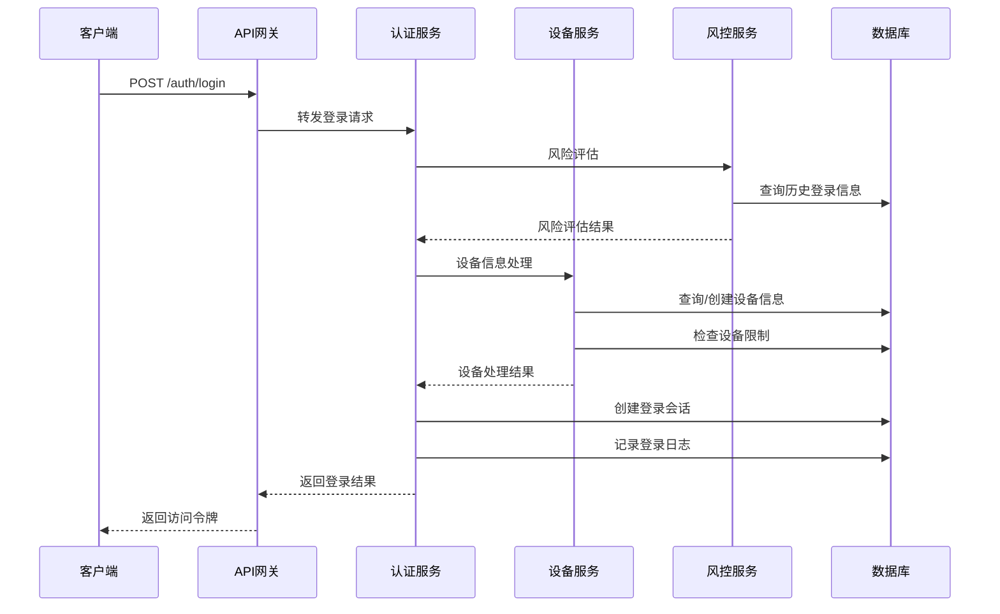
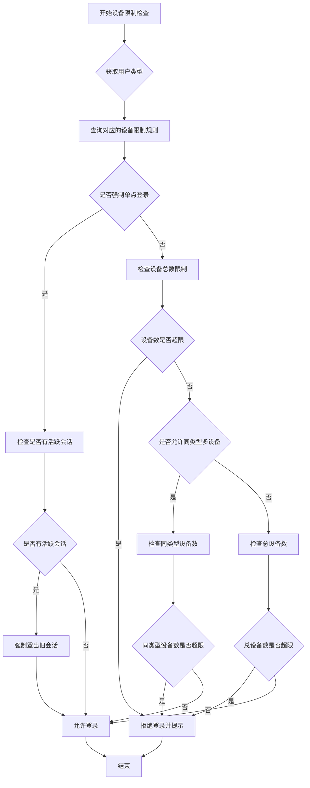
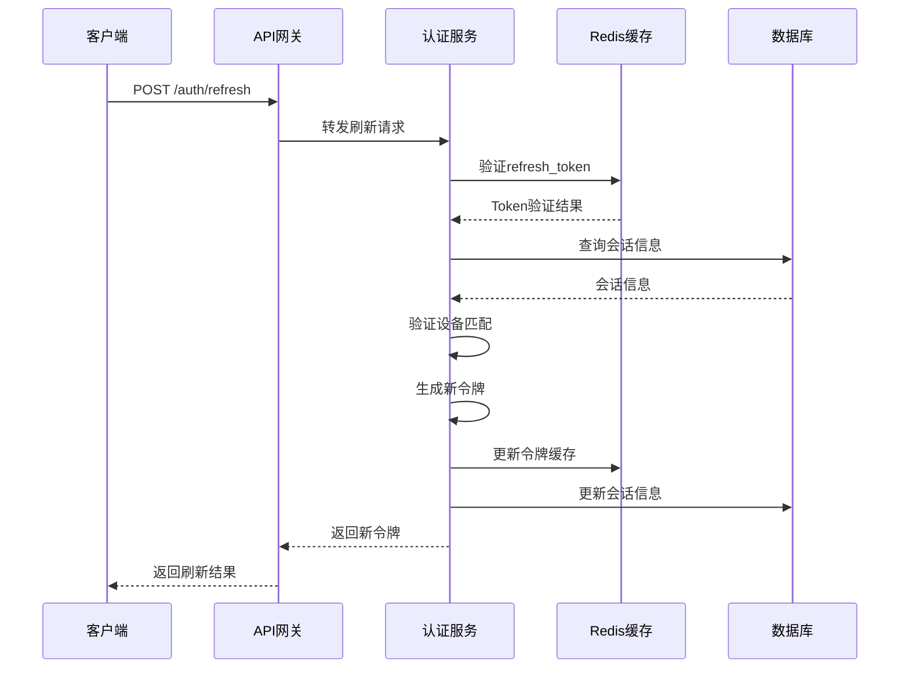
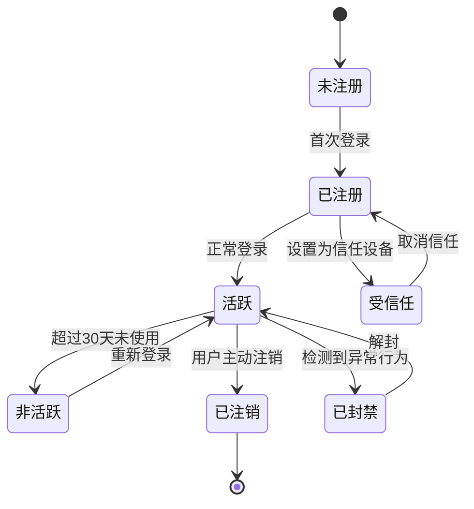
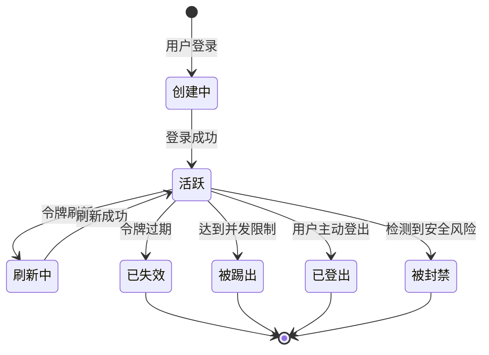

# 用户设备管理与多端登录策略 - 详细设计

## 1. 模块概述

### 1.1 功能定位

用户设备管理与多端登录策略模块是 PrimeTop 系统的基础安全和管理模块，负责管理用户在不同设备上的登录状态、设备信息、会话管理以及跨设备数据同步。该模块确保用户可以安全地在多个设备上使用应用，同时防止未授权访问和账号被盗用。

### 1.2 设计目标

1. 支持用户在多个设备上同时登录使用
2. 提供设备级别的安全控制和访问管理
3. 实现跨设备的学习数据同步和状态一致性
4. 防止异常登录和账号安全风险
5. 为家长控制提供设备级别的管理能力
6. 支持设备指纹识别和风控策略

### 1.3 适用场景

- 学生在手机、平板、电脑等多个设备上学习
- 家长在手机上监控孩子学习情况
- 教师在电脑端查看班级数据
- 同一账号在不同设备间切换使用
- 异常登录检测和安全防护

## 2. 数据结构定义

### 2.1 设备信息表 (user_device)

```sql
CREATE TABLE user_device (
    id BIGINT PRIMARY KEY AUTO_INCREMENT,
    user_id BIGINT NOT NULL COMMENT '用户ID',
    device_id VARCHAR(64) NOT NULL COMMENT '设备唯一标识',
    device_name VARCHAR(100) COMMENT '设备名称',
    device_type TINYINT NOT NULL COMMENT '设备类型: 1-iOS, 2-Android, 3-Web, 4-小程序',
    device_model VARCHAR(100) COMMENT '设备型号',
    os_version VARCHAR(50) COMMENT '操作系统版本',
    app_version VARCHAR(20) COMMENT 'APP版本',
    device_fingerprint VARCHAR(128) COMMENT '设备指纹',
    is_active TINYINT DEFAULT 1 COMMENT '是否活跃: 0-否, 1-是',
    is_trusted TINYINT DEFAULT 0 COMMENT '是否受信任设备: 0-否, 1-是',
    last_login_time DATETIME COMMENT '最后登录时间',
    last_active_time DATETIME COMMENT '最后活跃时间',
    login_count INT DEFAULT 0 COMMENT '登录次数',
    first_login_time DATETIME COMMENT '首次登录时间',
    ip_address VARCHAR(50) COMMENT 'IP地址',
    location VARCHAR(100) COMMENT '地理位置',
    extra_info JSON COMMENT '额外信息',
    created_at DATETIME DEFAULT CURRENT_TIMESTAMP,
    updated_at DATETIME DEFAULT CURRENT_TIMESTAMP ON UPDATE CURRENT_TIMESTAMP,
    deleted_at DATETIME COMMENT '软删除时间',
    
    UNIQUE KEY uk_user_device (user_id, device_id),
    KEY idx_user_id (user_id),
    KEY idx_device_id (device_id),
    KEY idx_last_active (last_active_time),
    KEY idx_is_active (is_active)
) ENGINE=InnoDB DEFAULT CHARSET=utf8mb4 COMMENT='用户设备信息表';
```

### 2.2 登录会话表 (user_session)

```sql
CREATE TABLE user_session (
    id BIGINT PRIMARY KEY AUTO_INCREMENT,
    user_id BIGINT NOT NULL COMMENT '用户ID',
    device_id VARCHAR(64) NOT NULL COMMENT '设备ID',
    session_id VARCHAR(128) NOT NULL COMMENT '会话ID',
    access_token VARCHAR(256) NOT NULL COMMENT '访问令牌',
    refresh_token VARCHAR(256) COMMENT '刷新令牌',
    token_type VARCHAR(20) DEFAULT 'Bearer' COMMENT '令牌类型',
    expires_in INT COMMENT '访问令牌过期时间(秒)',
    refresh_expires_in INT COMMENT '刷新令牌过期时间(秒)',
    scope VARCHAR(100) COMMENT '权限范围',
    login_type TINYINT COMMENT '登录方式: 1-手机验证码, 2-密码, 3-第三方, 4-生物识别',
    login_ip VARCHAR(50) COMMENT '登录IP',
    login_location VARCHAR(100) COMMENT '登录地理位置',
    user_agent TEXT COMMENT '用户代理信息',
    status TINYINT DEFAULT 1 COMMENT '状态: 0-已失效, 1-活跃, 2-被踢出',
    last_active_time DATETIME COMMENT '最后活跃时间',
    created_at DATETIME DEFAULT CURRENT_TIMESTAMP,
    updated_at DATETIME DEFAULT CURRENT_TIMESTAMP ON UPDATE CURRENT_TIMESTAMP,
    expired_at DATETIME COMMENT '过期时间',
    
    UNIQUE KEY uk_session_id (session_id),
    UNIQUE KEY uk_access_token (access_token),
    KEY idx_user_id (user_id),
    KEY idx_device_id (device_id),
    KEY idx_status (status),
    KEY idx_expired_at (expired_at)
) ENGINE=InnoDB DEFAULT CHARSET=utf8mb4 COMMENT='用户登录会话表';
```

### 2.3 设备登录日志表 (device_login_log)

```sql
CREATE TABLE device_login_log (
    id BIGINT PRIMARY KEY AUTO_INCREMENT,
    user_id BIGINT NOT NULL COMMENT '用户ID',
    device_id VARCHAR(64) NOT NULL COMMENT '设备ID',
    session_id VARCHAR(128) COMMENT '会话ID',
    login_time DATETIME DEFAULT CURRENT_TIMESTAMP COMMENT '登录时间',
    logout_time DATETIME COMMENT '登出时间',
    login_type TINYINT COMMENT '登录方式',
    login_result TINYINT COMMENT '登录结果: 0-失败, 1-成功',
    fail_reason VARCHAR(200) COMMENT '失败原因',
    ip_address VARCHAR(50) COMMENT 'IP地址',
    location VARCHAR(100) COMMENT '地理位置',
    device_info JSON COMMENT '设备信息',
    risk_level TINYINT DEFAULT 0 COMMENT '风险等级: 0-正常, 1-低风险, 2-中风险, 3-高风险',
    risk_factors JSON COMMENT '风险因子',
    
    KEY idx_user_id (user_id),
    KEY idx_device_id (device_id),
    KEY idx_login_time (login_time),
    KEY idx_login_result (login_result),
    KEY idx_risk_level (risk_level)
) ENGINE=InnoDB DEFAULT CHARSET=utf8mb4 COMMENT='设备登录日志表';
```

### 2.4 设备限制规则表 (device_limit_rule)

```sql
CREATE TABLE device_limit_rule (
    id BIGINT PRIMARY KEY AUTO_INCREMENT,
    rule_name VARCHAR(100) NOT NULL COMMENT '规则名称',
    user_type TINYINT COMMENT '用户类型: 1-普通用户, 2-会员用户',
    max_devices INT DEFAULT 3 COMMENT '最大设备数',
    max_concurrent INT DEFAULT 2 COMMENT '最大并发登录数',
    allow_same_type TINYINT DEFAULT 1 COMMENT '是否允许同类型多设备: 0-否, 1-是',
    force_single_login TINYINT DEFAULT 0 COMMENT '是否强制单点登录: 0-否, 1-是',
    priority INT DEFAULT 0 COMMENT '优先级',
    is_enabled TINYINT DEFAULT 1 COMMENT '是否启用',
    created_at DATETIME DEFAULT CURRENT_TIMESTAMP,
    updated_at DATETIME DEFAULT CURRENT_TIMESTAMP ON UPDATE CURRENT_TIMESTAMP,
    
    KEY idx_user_type (user_type),
    KEY idx_is_enabled (is_enabled)
) ENGINE=InnoDB DEFAULT CHARSET=utf8mb4 COMMENT='设备限制规则表';
```

## 3. API 接口设计

### 3.1 设备管理接口

#### 3.1.1 获取用户设备列表

```http
GET /api/v1/devices
Authorization: Bearer {access_token}
```

**请求参数：**
无

**响应示例：**
```json
{
  "code": 200,
  "message": "success",
  "data": {
    "total": 3,
    "devices": [
      {
        "device_id": "ios_abc123def456",
        "device_name": "iPhone 13 Pro",
        "device_type": 1,
        "device_model": "iPhone14,3",
        "os_version": "iOS 16.0",
        "app_version": "1.0.0",
        "is_active": true,
        "is_trusted": true,
        "is_current": true,
        "last_login_time": "2024-01-15 10:30:00",
        "last_active_time": "2024-01-15 14:25:30",
        "login_count": 156
      }
    ]
  }
}
```

#### 3.1.2 注销设备

```http
DELETE /api/v1/devices/{device_id}
Authorization: Bearer {access_token}
```

**请求参数：**
- device_id: 设备ID

**响应示例：**
```json
{
  "code": 200,
  "message": "设备注销成功",
  "data": null
}
```

#### 3.1.3 设置设备信任状态

```http
PUT /api/v1/devices/{device_id}/trust
Authorization: Bearer {access_token}
Content-Type: application/json
```

**请求体：**
```json
{
  "is_trusted": true
}
```

**响应示例：**
```json
{
  "code": 200,
  "message": "设备信任状态设置成功",
  "data": null
}
```

### 3.2 登录管理接口

#### 3.2.1 用户登录

```http
POST /api/v1/auth/login
Content-Type: application/json
```

**请求体：**
```json
{
  "phone": "13800138000",
  "verification_code": "123456",
  "device_info": {
    "device_id": "ios_abc123def456",
    "device_name": "iPhone 13 Pro",
    "device_type": 1,
    "device_model": "iPhone14,3",
    "os_version": "iOS 16.0",
    "app_version": "1.0.0",
    "device_fingerprint": "fp_xxx123"
  },
  "login_type": 1
}
```

**响应示例：**
```json
{
  "code": 200,
  "message": "登录成功",
  "data": {
    "user_id": 123456,
    "access_token": "eyJhbGciOiJIUzI1NiIsInR5cCI6IkpXVCJ9...",
    "refresh_token": "eyJhbGciOiJIUzI1NiIsInR5cCI6IkpXVCJ9...",
    "expires_in": 7200,
    "refresh_expires_in": 604800,
    "device_info": {
      "device_id": "ios_abc123def456",
      "is_new_device": false,
      "is_trusted": true,
      "max_devices": 3,
      "current_devices": 2
    }
  }
}
```

#### 3.2.2 刷新令牌

```http
POST /api/v1/auth/refresh
Content-Type: application/json
```

**请求体：**
```json
{
  "refresh_token": "eyJhbGciOiJIUzI1NiIsInR5cCI6IkpXVCJ9...",
  "device_id": "ios_abc123def456"
}
```

**响应示例：**
```json
{
  "code": 200,
  "message": "令牌刷新成功",
  "data": {
    "access_token": "eyJhbGciOiJIUzI1NiIsInR5cCI6IkpXVCJ9...",
    "refresh_token": "eyJhbGciOiJIUzI1NiIsInR5cCI6IkpXVCJ9...",
    "expires_in": 7200,
    "refresh_expires_in": 604800
  }
}
```

#### 3.2.3 退出登录

```http
POST /api/v1/auth/logout
Authorization: Bearer {access_token}
Content-Type: application/json
```

**请求体：**
```json
{
  "device_id": "ios_abc123def456",
  "session_id": "session_abc123"
}
```

**响应示例：**
```json
{
  "code": 200,
  "message": "退出登录成功",
  "data": null
}
```

### 3.3 安全验证接口

#### 3.3.1 新设备验证

```http
POST /api/v1/auth/verify-new-device
Content-Type: application/json
```

**请求体：**
```json
{
  "phone": "13800138000",
  "verification_code": "123456",
  "device_info": {
    "device_id": "android_new789",
    "device_name": "Xiaomi Mi 11",
    "device_type": 2,
    "device_fingerprint": "fp_new789"
  }
}
```

**响应示例：**
```json
{
  "code": 200,
  "message": "新设备验证成功",
  "data": {
    "require_verification": false,
    "security_question": null,
    "trust_period": 30
  }
}
```

## 4. 核心业务流程

### 4.1 用户登录流程



### 4.2 设备限制检查流程



### 4.3 令牌刷新流程



## 5. 关键代码示例

### 5.1 设备管理服务核心代码

```java
@Service
public class DeviceManagementService {
    
    @Autowired
    private UserDeviceMapper userDeviceMapper;
    
    @Autowired
    private UserSessionMapper userSessionMapper;
    
    @Autowired
    private DeviceLimitRuleMapper deviceLimitRuleMapper;
    
    @Autowired
    private RiskControlService riskControlService;
    
    /**
     * 处理登录时的设备信息
     */
    public DeviceLoginResult handleLoginDevice(Long userId, DeviceInfo deviceInfo, 
                                               String loginIp, String location) {
        // 1. 设备风险评估
        RiskAssessmentResult riskResult = riskControlService.assessLoginRisk(
            userId, deviceInfo, loginIp, location);
        
        // 2. 查询或创建设备信息
        UserDevice device = userDeviceMapper.findByUserIdAndDeviceId(
            userId, deviceInfo.getDeviceId());
        
        boolean isNewDevice = (device == null);
        if (isNewDevice) {
            // 检查设备限制
            DeviceLimitCheckResult limitCheck = checkDeviceLimit(userId, deviceInfo);
            if (!limitCheck.isAllowed()) {
                throw new DeviceLimitExceededException(limitCheck.getReason());
            }
            
            // 创建新设备
            device = createNewDevice(userId, deviceInfo, loginIp, location);
        } else {
            // 更新设备信息
            updateDeviceInfo(device, deviceInfo, loginIp, location);
        }
        
        // 3. 处理会话管理
        UserSession session = handleSessionManagement(userId, device, deviceInfo);
        
        return DeviceLoginResult.builder()
                .device(device)
                .session(session)
                .isNewDevice(isNewDevice)
                .isTrusted(device.getIsTrusted())
                .riskLevel(riskResult.getRiskLevel())
                .build();
    }
    
    /**
     * 检查设备限制
     */
    private DeviceLimitCheckResult checkDeviceLimit(Long userId, DeviceInfo deviceInfo) {
        // 获取用户类型和对应的限制规则
        UserType userType = getUserType(userId);
        DeviceLimitRule rule = deviceLimitRuleMapper.findByUserType(userType);
        
        if (rule == null) {
            rule = getDefaultLimitRule();
        }
        
        // 统计当前活跃设备数
        int activeDeviceCount = userDeviceMapper.countActiveDevices(userId);
        
        // 检查总设备数限制
        if (activeDeviceCount >= rule.getMaxDevices()) {
            return DeviceLimitCheckResult.notAllowed("已达到最大设备数限制");
        }
        
        // 如果不允许同类型多设备，检查同类型设备数
        if (!rule.getAllowSameType()) {
            int sameTypeCount = userDeviceMapper.countActiveDevicesByType(
                userId, deviceInfo.getDeviceType());
            if (sameTypeCount > 0) {
                return DeviceLimitCheckResult.notAllowed("不允许同类型设备同时登录");
            }
        }
        
        // 检查并发登录数限制
        int concurrentSessions = userSessionMapper.countActiveSessions(userId);
        if (concurrentSessions >= rule.getMaxConcurrent()) {
            // 如果强制单点登录，踢出旧会话
            if (rule.getForceSingleLogin()) {
                kickOutOldestSession(userId);
            } else {
                return DeviceLimitCheckResult.notAllowed("已达到最大并发登录数");
            }
        }
        
        return DeviceLimitCheckResult.allowed();
    }
    
    /**
     * 处理会话管理
     */
    private UserSession handleSessionManagement(Long userId, UserDevice device, 
                                               DeviceInfo deviceInfo) {
        String sessionId = generateSessionId();
        String accessToken = generateAccessToken(userId, sessionId);
        String refreshToken = generateRefreshToken(userId, sessionId);
        
        UserSession session = UserSession.builder()
                .userId(userId)
                .deviceId(device.getDeviceId())
                .sessionId(sessionId)
                .accessToken(accessToken)
                .refreshToken(refreshToken)
                .tokenType("Bearer")
                .expiresIn(7200) // 2小时
                .refreshExpiresIn(604800) // 7天
                .status(1) // 活跃状态
                .lastActiveTime(new Date())
                .createdAt(new Date())
                .expiredAt(calculateExpireTime(7200))
                .build();
        
        userSessionMapper.insert(session);
        
        // 更新设备最后活跃时间
        device.setLastActiveTime(new Date());
        device.setLoginCount(device.getLoginCount() + 1);
        userDeviceMapper.updateById(device);
        
        return session;
    }
    
    /**
     * 踢出最旧的会话
     */
    private void kickOutOldestSession(Long userId) {
        UserSession oldestSession = userSessionMapper.findOldestActiveSession(userId);
        if (oldestSession != null) {
            oldestSession.setStatus(2); // 被踢出状态
            userSessionMapper.updateById(oldestSession);
            
            // 发送推送通知
            sendKickedOutNotification(oldestSession.getUserId(), 
                                    oldestSession.getDeviceId());
        }
    }
}
```

### 5.2 风控服务核心代码

```java
@Service
public class RiskControlService {
    
    @Autowired
    private DeviceLoginLogMapper deviceLoginLogMapper;
    
    @Autowired
    private UserDeviceMapper userDeviceMapper;
    
    /**
     * 评估登录风险
     */
    public RiskAssessmentResult assessLoginRisk(Long userId, DeviceInfo deviceInfo, 
                                               String loginIp, String location) {
        List<RiskFactor> riskFactors = new ArrayList<>();
        int riskScore = 0;
        
        // 1. 检查是否为新设备
        UserDevice existingDevice = userDeviceMapper.findByUserIdAndDeviceId(
            userId, deviceInfo.getDeviceId());
        if (existingDevice == null) {
            riskFactors.add(RiskFactor.NEW_DEVICE);
            riskScore += 30;
        } else if (!existingDevice.getIsTrusted()) {
            riskFactors.add(RiskFactor.UNTRUSTED_DEVICE);
            riskScore += 20;
        }
        
        // 2. 检查IP地址异常
        if (isAbnormalIp(userId, loginIp)) {
            riskFactors.add(RiskFactor.ABNORMAL_IP);
            riskScore += 40;
        }
        
        // 3. 检查地理位置异常
        if (isAbnormalLocation(userId, location)) {
            riskFactors.add(RiskFactor.ABNORMAL_LOCATION);
            riskScore += 35;
        }
        
        // 4. 检查登录时间异常
        if (isAbnormalLoginTime(userId)) {
            riskFactors.add(RiskFactor.ABNORMAL_TIME);
            riskScore += 15;
        }
        
        // 5. 检查频繁登录
        if (isFrequentLogin(userId, deviceInfo.getDeviceId())) {
            riskFactors.add(RiskFactor.FREQUENT_LOGIN);
            riskScore += 25;
        }
        
        // 6. 检查设备指纹异常
        if (isDeviceFingerprintChanged(userId, deviceInfo)) {
            riskFactors.add(RiskFactor.FINGERPRINT_CHANGED);
            riskScore += 50;
        }
        
        // 计算风险等级
        RiskLevel riskLevel = calculateRiskLevel(riskScore);
        
        // 记录风险评估日志
        recordRiskAssessment(userId, deviceInfo, riskScore, riskLevel, riskFactors);
        
        return RiskAssessmentResult.builder()
                .riskScore(riskScore)
                .riskLevel(riskLevel)
                .riskFactors(riskFactors)
                .requireAdditionalVerification(riskScore >= 60)
                .build();
    }
    
    /**
     * 检查IP地址是否异常
     */
    private boolean isAbnormalIp(Long userId, String currentIp) {
        // 获取用户最近的登录IP
        List<String> recentIps = deviceLoginLogMapper.findRecentLoginIps(
            userId, 5); // 最近5次登录
        
        if (recentIps.isEmpty()) {
            return false; // 首次登录不算异常
        }
        
        // 检查当前IP是否在最近登录IP的地理位置范围内
        String currentLocation = ipLocationService.getLocation(currentIp);
        for (String recentIp : recentIps) {
            String recentLocation = ipLocationService.getLocation(recentIp);
            if (isSameLocationArea(currentLocation, recentLocation)) {
                return false; // 在同一地理区域内，不算异常
            }
        }
        
        return true; // IP地理位置异常
    }
    
    /**
     * 检查是否频繁登录
     */
    private boolean isFrequentLogin(Long userId, String deviceId) {
        // 检查最近1小时内的登录次数
        int loginCountInLastHour = deviceLoginLogMapper.countLoginsInTimeRange(
            userId, deviceId, 
            DateUtils.addHours(new Date(), -1), 
            new Date());
        
        // 检查最近10分钟内的失败登录次数
        int failedLoginCount = deviceLoginLogMapper.countFailedLoginsInTimeRange(
            userId, deviceId, 
            DateUtils.addMinutes(new Date(), -10), 
            new Date());
        
        return loginCountInLastHour > 10 || failedLoginCount > 3;
    }
    
    /**
     * 计算风险等级
     */
    private RiskLevel calculateRiskLevel(int riskScore) {
        if (riskScore >= 80) {
            return RiskLevel.HIGH;
        } else if (riskScore >= 60) {
            return RiskLevel.MEDIUM;
        } else if (riskScore >= 30) {
            return RiskLevel.LOW;
        } else {
            return RiskLevel.NORMAL;
        }
    }
}
```

### 5.3 令牌刷新服务

```java
@Service
public class TokenRefreshService {
    
    @Autowired
    private RedisTemplate<String, Object> redisTemplate;
    
    @Autowired
    private UserSessionMapper userSessionMapper;
    
    @Autowired
    private JwtTokenProvider jwtTokenProvider;
    
    /**
     * 刷新访问令牌
     */
    public TokenRefreshResult refreshAccessToken(String refreshToken, String deviceId) {
        // 1. 验证refresh_token
        if (!jwtTokenProvider.validateToken(refreshToken)) {
            throw new InvalidTokenException("刷新令牌无效或已过期");
        }
        
        // 2. 从令牌中提取用户信息
        Claims claims = jwtTokenProvider.getClaimsFromToken(refreshToken);
        Long userId = claims.get("user_id", Long.class);
        String sessionId = claims.get("session_id", String.class);
        
        // 3. 查询会话信息
        UserSession session = userSessionMapper.findBySessionId(sessionId);
        if (session == null || session.getStatus() != 1) {
            throw new SessionNotFoundException("会话不存在或已失效");
        }
        
        // 4. 验证设备匹配
        if (!session.getDeviceId().equals(deviceId)) {
            throw new DeviceMismatchException("设备不匹配");
        }
        
        // 5. 验证refresh_token是否匹配
        if (!session.getRefreshToken().equals(refreshToken)) {
            throw new TokenMismatchException("刷新令牌不匹配");
        }
        
        // 6. 检查会话是否过期
        if (session.getExpiredAt().before(new Date())) {
            session.setStatus(0); // 标记为已失效
            userSessionMapper.updateById(session);
            throw new SessionExpiredException("会话已过期");
        }
        
        // 7. 生成新令牌
        String newAccessToken = jwtTokenProvider.generateAccessToken(
            userId, sessionId, session.getScope());
        String newRefreshToken = jwtTokenProvider.generateRefreshToken(
            userId, sessionId);
        
        // 8. 更新会话信息
        session.setAccessToken(newAccessToken);
        session.setRefreshToken(newRefreshToken);
        session.setLastActiveTime(new Date());
        session.setExpiredAt(calculateExpireTime(session.getExpiresIn()));
        userSessionMapper.updateById(session);
        
        // 9. 更新Redis缓存
        updateTokenCache(userId, sessionId, newAccessToken, newRefreshToken);
        
        return TokenRefreshResult.builder()
                .accessToken(newAccessToken)
                .refreshToken(newRefreshToken)
                .expiresIn(session.getExpiresIn())
                .refreshExpiresIn(session.getRefreshExpiresIn())
                .build();
    }
    
    /**
     * 更新令牌缓存
     */
    private void updateTokenCache(Long userId, String sessionId, 
                                   String accessToken, String refreshToken) {
        String accessTokenKey = "access_token:" + sessionId;
        String refreshTokenKey = "refresh_token:" + sessionId;
        
        // 设置访问令牌缓存（2小时）
        redisTemplate.opsForValue().set(accessTokenKey, accessToken, 2, TimeUnit.HOURS);
        
        // 设置刷新令牌缓存（7天）
        redisTemplate.opsForValue().set(refreshTokenKey, refreshToken, 7, TimeUnit.DAYS);
        
        // 更新用户会话集合
        String userSessionsKey = "user_sessions:" + userId;
        redisTemplate.opsForSet().add(userSessionsKey, sessionId);
        redisTemplate.expire(userSessionsKey, 7, TimeUnit.DAYS);
    }
}
```

## 6. 状态流转设计

### 6.1 设备状态流转



### 6.2 会话状态流转



## 7. 错误处理机制

### 7.1 错误码定义

```java
public enum DeviceErrorCode {
    // 设备相关错误 (10000-10099)
    DEVICE_NOT_FOUND(10001, "设备不存在"),
    DEVICE_LIMIT_EXCEEDED(10002, "已达到设备数量限制"),
    DEVICE_TYPE_NOT_ALLOWED(10003, "不允许该类型设备登录"),
    DEVICE_FINGERPRINT_MISMATCH(10004, "设备指纹不匹配"),
    DEVICE_BLOCKED(10005, "设备已被封禁"),
    
    // 会话相关错误 (10100-10199)
    SESSION_NOT_FOUND(10101, "会话不存在"),
    SESSION_EXPIRED(10102, "会话已过期"),
    SESSION_INVALID(10103, "会话无效"),
    SESSION_KICKED_OUT(10104, "会话已被踢出"),
    CONCURRENT_LOGIN_LIMIT(10105, "已达到并发登录限制"),
    
    // 令牌相关错误 (10200-10299)
    TOKEN_INVALID(10201, "令牌无效"),
    TOKEN_EXPIRED(10202, "令牌已过期"),
    TOKEN_MISMATCH(10203, "令牌不匹配"),
    REFRESH_TOKEN_INVALID(10204, "刷新令牌无效"),
    
    // 风控相关错误 (10300-10399)
    HIGH_RISK_LOGIN(10301, "登录风险过高，请进行安全验证"),
    ABNORMAL_IP(10302, "IP地址异常"),
    ABNORMAL_LOCATION(10303, "地理位置异常"),
    FREQUENT_LOGIN(10304, "登录过于频繁，请稍后再试"),
    
    // 验证相关错误 (10400-10499)
    VERIFICATION_CODE_INVALID(10401, "验证码无效"),
    VERIFICATION_CODE_EXPIRED(10402, "验证码已过期"),
    SECURITY_QUESTION_WRONG(10403, "安全问题答案错误");
    
    private final int code;
    private final String message;
    
    // 构造函数和getter方法
}
```

### 7.2 异常处理

```java
@RestControllerAdvice
public class DeviceExceptionHandler {
    
    /**
     * 处理设备限制异常
     */
    @ExceptionHandler(DeviceLimitExceededException.class)
    public ResponseEntity<ErrorResponse> handleDeviceLimitExceeded(
            DeviceLimitExceededException ex) {
        ErrorResponse response = ErrorResponse.builder()
                .code(DeviceErrorCode.DEVICE_LIMIT_EXCEEDED.getCode())
                .message(ex.getMessage())
                .timestamp(System.currentTimeMillis())
                .build();
        
        return ResponseEntity.status(HttpStatus.FORBIDDEN).body(response);
    }
    
    /**
     * 处理会话异常
     */
    @ExceptionHandler(SessionException.class)
    public ResponseEntity<ErrorResponse> handleSessionException(
            SessionException ex) {
        ErrorResponse response = ErrorResponse.builder()
                .code(ex.getErrorCode())
                .message(ex.getMessage())
                .timestamp(System.currentTimeMillis())
                .build();
        
        return ResponseEntity.status(HttpStatus.UNAUTHORIZED).body(response);
    }
    
    /**
     * 处理高风险登录异常
     */
    @ExceptionHandler(HighRiskLoginException.class)
    public ResponseEntity<ErrorResponse> handleHighRiskLogin(
            HighRiskLoginException ex) {
        ErrorResponse response = ErrorResponse.builder()
                .code(DeviceErrorCode.HIGH_RISK_LOGIN.getCode())
                .message(ex.getMessage())
                .requireAdditionalVerification(true)
                .verificationMethods(ex.getAvailableMethods())
                .timestamp(System.currentTimeMillis())
                .build();
        
        return ResponseEntity.status(HttpStatus.FORBIDDEN).body(response);
    }
}
```

## 8. 安全机制设计

### 8.1 设备指纹生成

```java
@Service
public class DeviceFingerprintService {
    
    /**
     * 生成设备指纹
     */
    public String generateFingerprint(DeviceInfo deviceInfo) {
        // 收集设备特征信息
        String deviceData = collectDeviceCharacteristics(deviceInfo);
        
        // 使用SHA-256哈希生成指纹
        return DigestUtils.sha256Hex(deviceData);
    }
    
    /**
     * 收集设备特征信息
     */
    private String collectDeviceCharacteristics(DeviceInfo deviceInfo) {
        StringBuilder sb = new StringBuilder();
        
        // 设备基本信息
        sb.append(deviceInfo.getDeviceType()).append("|");
        sb.append(deviceInfo.getDeviceModel()).append("|");
        sb.append(deviceInfo.getOsVersion()).append("|");
        
        // 硬件信息
        sb.append(deviceInfo.getCpuInfo()).append("|");
        sb.append(deviceInfo.getMemorySize()).append("|");
        sb.append(deviceInfo.getScreenResolution()).append("|");
        
        // 网络信息
        sb.append(deviceInfo.getNetworkType()).append("|");
        sb.append(deviceInfo.getCarrier()).append("|");
        
        // 应用信息
        sb.append(deviceInfo.getAppVersion()).append("|");
        sb.append(deviceInfo.getAppBundleId()).append("|");
        
        return sb.toString();
    }
    
    /**
     * 验证设备指纹是否匹配
     */
    public boolean verifyFingerprint(String storedFingerprint, DeviceInfo deviceInfo) {
        String currentFingerprint = generateFingerprint(deviceInfo);
        return storedFingerprint.equals(currentFingerprint);
    }
}
```

### 8.2 令牌安全设计

```java
@Service
public class JwtTokenProvider {
    
    @Value("${jwt.secret}")
    private String jwtSecret;
    
    @Value("${jwt.access-token-expiration}")
    private int accessTokenExpiration;
    
    @Value("${jwt.refresh-token-expiration}")
    private int refreshTokenExpiration;
    
    /**
     * 生成访问令牌
     */
    public String generateAccessToken(Long userId, String sessionId, String scope) {
        Date now = new Date();
        Date expiryDate = new Date(now.getTime() + accessTokenExpiration * 1000);
        
        return Jwts.builder()
                .setSubject(String.valueOf(userId))
                .claim("session_id", sessionId)
                .claim("scope", scope)
                .claim("token_type", "access")
                .setIssuedAt(now)
                .setExpiration(expiryDate)
                .signWith(SignatureAlgorithm.HS256, jwtSecret)
                .compact();
    }
    
    /**
     * 生成刷新令牌
     */
    public String generateRefreshToken(Long userId, String sessionId) {
        Date now = new Date();
        Date expiryDate = new Date(now.getTime() + refreshTokenExpiration * 1000);
        
        return Jwts.builder()
                .setSubject(String.valueOf(userId))
                .claim("session_id", sessionId)
                .claim("token_type", "refresh")
                .setIssuedAt(now)
                .setExpiration(expiryDate)
                .signWith(SignatureAlgorithm.HS256, jwtSecret)
                .compact();
    }
    
    /**
     * 验证令牌
     */
    public boolean validateToken(String token) {
        try {
            Jwts.parser().setSigningKey(jwtSecret).parseClaimsJws(token);
            return true;
        } catch (JwtException | IllegalArgumentException ex) {
            return false;
        }
    }
    
    /**
     * 从令牌中获取用户ID
     */
    public Long getUserIdFromToken(String token) {
        Claims claims = getClaimsFromToken(token);
        return Long.valueOf(claims.getSubject());
    }
}
```

## 9. 性能优化策略

### 9.1 缓存策略

```java
@Service
public class DeviceCacheService {
    
    @Autowired
    private RedisTemplate<String, Object> redisTemplate;
    
    private static final String DEVICE_INFO_KEY_PREFIX = "device_info:";
    private static final String USER_DEVICES_KEY_PREFIX = "user_devices:";
    private static final String SESSION_INFO_KEY_PREFIX = "session_info:";
    
    /**
     * 缓存设备信息
     */
    public void cacheDeviceInfo(String deviceId, UserDevice device) {
        String key = DEVICE_INFO_KEY_PREFIX + deviceId;
        redisTemplate.opsForValue().set(key, device, 24, TimeUnit.HOURS);
    }
    
    /**
     * 获取缓存的设备信息
     */
    public UserDevice getCachedDeviceInfo(String deviceId) {
        String key = DEVICE_INFO_KEY_PREFIX + deviceId;
        return (UserDevice) redisTemplate.opsForValue().get(key);
    }
    
    /**
     * 缓存用户设备列表
     */
    public void cacheUserDevices(Long userId, List<UserDevice> devices) {
        String key = USER_DEVICES_KEY_PREFIX + userId;
        redisTemplate.opsForValue().set(key, devices, 1, TimeUnit.HOURS);
    }
    
    /**
     * 获取缓存的用户设备列表
     */
    public List<UserDevice> getCachedUserDevices(Long userId) {
        String key = USER_DEVICES_KEY_PREFIX + userId;
        return (List<UserDevice>) redisTemplate.opsForValue().get(key);
    }
    
    /**
     * 使设备缓存失效
     */
    public void evictDeviceCache(String deviceId) {
        String key = DEVICE_INFO_KEY_PREFIX + deviceId;
        redisTemplate.delete(key);
    }
    
    /**
     * 使用缓存加载设备信息
     */
    public UserDevice loadDeviceInfoWithCache(String deviceId, 
                                               Function<String, UserDevice> loader) {
        // 先尝试从缓存获取
        UserDevice cachedDevice = getCachedDeviceInfo(deviceId);
        if (cachedDevice != null) {
            return cachedDevice;
        }
        
        // 缓存未命中，从数据库加载
        UserDevice device = loader.apply(deviceId);
        
        // 写入缓存
        if (device != null) {
            cacheDeviceInfo(deviceId, device);
        }
        
        return device;
    }
}
```

### 9.2 数据库优化

```sql
-- 为常用查询字段添加索引
CREATE INDEX idx_user_device_user_id ON user_device(user_id);
CREATE INDEX idx_user_device_device_id ON user_device(device_id);
CREATE INDEX idx_user_device_last_active ON user_device(last_active_time);
CREATE INDEX idx_user_session_user_id ON user_session(user_id);
CREATE INDEX idx_user_session_device_id ON user_session(device_id);
CREATE INDEX idx_user_session_status ON user_session(status);
CREATE INDEX idx_user_session_expired_at ON user_session(expired_at);

-- 分区表设计（按月分区登录日志）
CREATE TABLE device_login_log (
    -- 字段定义
    login_time DATETIME NOT NULL,
    -- 其他字段
) PARTITION BY RANGE (YEAR(login_time) * 100 + MONTH(login_time)) (
    PARTITION p202401 VALUES LESS THAN (202402),
    PARTITION p202402 VALUES LESS THAN (202403),
    -- 继续添加分区
    PARTITION p_future VALUES LESS THAN MAXVALUE
);
```

## 10. 监控与告警

### 10.1 关键指标监控

```java
@Component
public class DeviceMetrics {
    
    private final MeterRegistry meterRegistry;
    
    /**
     * 记录登录成功次数
     */
    public void recordLoginSuccess(String deviceType) {
        Counter.builder("device.login.success")
                .tag("device_type", deviceType)
                .register(meterRegistry)
                .increment();
    }
    
    /**
     * 记录登录失败次数
     */
    public void recordLoginFailure(String deviceType, String reason) {
        Counter.builder("device.login.failure")
                .tag("device_type", deviceType)
                .tag("reason", reason)
                .register(meterRegistry)
                .increment();
    }
    
    /**
     * 记录令牌刷新次数
     */
    public void recordTokenRefresh() {
        Counter.builder("device.token.refresh")
                .register(meterRegistry)
                .increment();
    }
    
    /**
     * 记录活跃设备数
     */
    public void recordActiveDevices(int count) {
        Gauge.builder("device.active.count", () -> count)
                .register(meterRegistry);
    }
    
    /**
     * 记录高风险登录次数
     */
    public void recordHighRiskLogin(String riskFactor) {
        Counter.builder("device.login.high_risk")
                .tag("risk_factor", riskFactor)
                .register(meterRegistry)
                .increment();
    }
}
```

### 10.2 告警规则配置

```yaml
# Prometheus告警规则配置
groups:
  - name: device_management_alerts
    rules:
      # 高风险登录告警
      - alert: HighRiskLoginSpike
        expr: rate(device_login_high_risk[5m]) > 10
        for: 5m
        labels:
          severity: warning
        annotations:
          summary: "高风险登录激增"
          description: "过去5分钟内高风险登录次数超过阈值"
      
      # 登录失败率告警
      - alert: HighLoginFailureRate
        expr: |
          (
            rate(device_login_failure[5m]) / 
            (rate(device_login_success[5m]) + rate(device_login_failure[5m]))
          ) > 0.3
        for: 10m
        labels:
          severity: critical
        annotations:
          summary: "登录失败率过高"
          description: "登录失败率超过30%"
      
      # 设备异常告警
      - alert: AbnormalDeviceActivity
        expr: rate(device_abnormal_activity[5m]) > 5
        for: 5m
        labels:
          severity: warning
        annotations:
          summary: "设备异常活跃"
          description: "检测到异常设备活动模式"
```

## 11. 家长控制相关设计

### 11.1 家长设备管理

```sql
CREATE TABLE parent_device_control (
    id BIGINT PRIMARY KEY AUTO_INCREMENT,
    parent_id BIGINT NOT NULL COMMENT '家长ID',
    student_id BIGINT NOT NULL COMMENT '学生ID',
    device_id VARCHAR(64) NOT NULL COMMENT '设备ID',
    allowed_time_start TIME COMMENT '允许使用开始时间',
    allowed_time_end TIME COMMENT '允许使用结束时间',
    max_daily_minutes INT COMMENT '每日最大使用时长(分钟)',
    allowed_subjects JSON COMMENT '允许使用的学科',
    blocked_features JSON COMMENT '屏蔽的功能',
    is_monitored TINYINT DEFAULT 1 COMMENT '是否监控',
    created_at DATETIME DEFAULT CURRENT_TIMESTAMP,
    updated_at DATETIME DEFAULT CURRENT_TIMESTAMP ON UPDATE CURRENT_TIMESTAMP,
    
    UNIQUE KEY uk_parent_student_device (parent_id, student_id, device_id),
    KEY idx_student_id (student_id),
    KEY idx_device_id (device_id)
) ENGINE=InnoDB DEFAULT CHARSET=utf8mb4 COMMENT='家长设备控制表';
```

### 11.2 家长监控接口

```java
@RestController
@RequestMapping("/api/v1/parent/device")
public class ParentDeviceController {
    
    /**
     * 获取孩子的设备列表
     */
    @GetMapping("/student/{student_id}/devices")
    public Result<List<StudentDeviceInfo>> getStudentDevices(
            @PathVariable Long student_id) {
        // 验证家长权限
        validateParentAccess(student_id);
        
        // 获取孩子的设备列表
        List<StudentDeviceInfo> devices = deviceService.getStudentDevices(student_id);
        
        return Result.success(devices);
    }
    
    /**
     * 设置设备使用限制
     */
    @PostMapping("/student/{student_id}/device/{device_id}/limits")
    public Result<Void> setDeviceLimits(
            @PathVariable Long student_id,
            @PathVariable String device_id,
            @RequestBody DeviceLimitRequest request) {
        // 验证家长权限
        validateParentAccess(student_id);
        
        // 设置设备限制
        deviceService.setDeviceLimits(student_id, device_id, request);
        
        return Result.success();
    }
    
    /**
     * 获取设备使用记录
     */
    @GetMapping("/student/{student_id}/device/{device_id}/usage")
    public Result<List<DeviceUsageRecord>> getDeviceUsage(
            @PathVariable Long student_id,
            @PathVariable String device_id,
            @RequestParam String start_date,
            @RequestParam String end_date) {
        // 验证家长权限
        validateParentAccess(student_id);
        
        // 获取使用记录
        List<DeviceUsageRecord> records = deviceService.getDeviceUsage(
            student_id, device_id, start_date, end_date);
        
        return Result.success(records);
    }
}
```

## 12. 部署与配置

### 12.1 配置文件示例

```yaml
# application.yml
device:
  management:
    # 设备限制配置
    limits:
      default:
        max-devices: 3
        max-concurrent: 2
        allow-same-type: true
        force-single-login: false
      vip:
        max-devices: 5
        max-concurrent: 3
        allow-same-type: true
        force-single-login: false
    
    # 令牌配置
    token:
      access-token-expiration: 7200  # 2小时
      refresh-token-expiration: 604800  # 7天
    
    # 风控配置
    risk-control:
      enabled: true
      high-risk-threshold: 80
      medium-risk-threshold: 60
      low-risk-threshold: 30
      
      # IP检查配置
      ip-check:
        enabled: true
        same-location-radius: 500  # 同一地理位置半径(km)
      
      # 时间检查配置
      time-check:
        enabled: true
        abnormal-hours: [0, 1, 2, 3, 4, 5]  # 异常登录时间段
      
      # 频次检查配置
      frequency-check:
        enabled: true
        max-login-per-hour: 10
        max-failed-login: 3
    
    # 缓存配置
    cache:
      device-info-ttl: 86400  # 24小时
      user-devices-ttl: 3600  # 1小时
      session-info-ttl: 7200  # 2小时
```

### 12.2 数据库初始化脚本

```sql
-- 插入默认设备限制规则
INSERT INTO device_limit_rule (rule_name, user_type, max_devices, max_concurrent, 
                               allow_same_type, force_single_login, priority, is_enabled) 
VALUES 
('普通用户限制', 1, 3, 2, 1, 0, 1, 1),
('VIP用户限制', 2, 5, 3, 1, 0, 2, 1),
('教师用户限制', 3, 2, 1, 0, 0, 1, 1);

-- 创建设备管理相关的存储过程
DELIMITER //
CREATE PROCEDURE clean_expired_sessions()
BEGIN
    -- 清理过期会话
    UPDATE user_session 
    SET status = 0 
    WHERE expired_at < NOW() AND status = 1;
    
    -- 清理长时间非活跃设备
    UPDATE user_device 
    SET is_active = 0 
    WHERE last_active_time < DATE_SUB(NOW(), INTERVAL 30 DAY) AND is_active = 1;
    
    -- 记录清理日志
    INSERT INTO system_log (log_type, log_message, created_at)
    VALUES ('DEVICE_CLEAN', '清理过期会话和非活跃设备', NOW());
END //
DELIMITER ;

-- 创建定时任务清理过期数据（需要事件调度器支持）
CREATE EVENT IF NOT EXISTS clean_expired_sessions_event
ON SCHEDULE EVERY 1 HOUR
DO CALL clean_expired_sessions();
```

## 13. 测试策略

### 13.1 单元测试示例

```java
@SpringBootTest
class DeviceManagementServiceTest {
    
    @Autowired
    private DeviceManagementService deviceManagementService;
    
    @MockBean
    private RiskControlService riskControlService;
    
    @Test
    void testHandleLoginDevice_NewDevice() {
        // 准备测试数据
        Long userId = 123456L;
        DeviceInfo deviceInfo = createMockDeviceInfo("new_device_001");
        
        when(riskControlService.assessLoginRisk(any(), any(), any(), any()))
            .thenReturn(RiskAssessmentResult.normal());
        
        // 执行测试
        DeviceLoginResult result = deviceManagementService.handleLoginDevice(
            userId, deviceInfo, "192.168.1.1", "北京");
        
        // 验证结果
        assertNotNull(result);
        assertTrue(result.isNewDevice());
        assertNotNull(result.getDevice());
        assertNotNull(result.getSession());
        assertEquals("new_device_001", result.getDevice().getDeviceId());
    }
    
    @Test
    void testHandleLoginDevice_DeviceLimitExceeded() {
        // 准备测试数据
        Long userId = 123456L;
        DeviceInfo deviceInfo = createMockDeviceInfo("exceeding_device_001");
        
        when(riskControlService.assessLoginRisk(any(), any(), any(), any()))
            .thenReturn(RiskAssessmentResult.normal());
        
        // 模拟设备数量超限
        when(userDeviceMapper.countActiveDevices(userId)).thenReturn(5);
        
        // 执行测试并验证异常
        assertThrows(DeviceLimitExceededException.class, () -> {
            deviceManagementService.handleLoginDevice(
                userId, deviceInfo, "192.168.1.1", "北京");
        });
    }
    
    @Test
    void testTokenRefresh_Success() {
        // 准备测试数据
        String refreshToken = "valid_refresh_token";
        String deviceId = "test_device_001";
        
        // 执行测试
        TokenRefreshResult result = tokenRefreshService.refreshAccessToken(
            refreshToken, deviceId);
        
        // 验证结果
        assertNotNull(result);
        assertNotNull(result.getAccessToken());
        assertNotNull(result.getRefreshToken());
        assertTrue(result.getExpiresIn() > 0);
    }
}
```

### 13.2 集成测试场景

```java
@SpringBootTest(webEnvironment = WebEnvironment.RANDOM_PORT)
@AutoConfigureMockMvc
class DeviceManagementIntegrationTest {
    
    @Autowired
    private MockMvc mockMvc;
    
    @Test
    void testCompleteLoginFlow() throws Exception {
        // 1. 发送登录请求
        String loginRequest = """
            {
                "phone": "13800138000",
                "verification_code": "123456",
                "device_info": {
                    "device_id": "integration_test_001",
                    "device_name": "Test Device",
                    "device_type": 1,
                    "device_model": "TestModel",
                    "os_version": "iOS 16.0",
                    "app_version": "1.0.0"
                }
            }
            """;
        
        MvcResult loginResult = mockMvc.perform(post("/api/v1/auth/login")
                .contentType(MediaType.APPLICATION_JSON)
                .content(loginRequest))
                .andExpect(status().isOk())
                .andReturn();
        
        // 2. 解析登录响应
        String loginResponse = loginResult.getResponse().getContentAsString();
        JSONObject loginJson = new JSONObject(loginResponse);
        String accessToken = loginJson.getJSONObject("data").getString("access_token");
        String deviceId = loginJson.getJSONObject("data").getJSONObject("device_info")
                            .getString("device_id");
        
        // 3. 使用访问令牌调用受保护的接口
        mockMvc.perform(get("/api/v1/devices")
                .header("Authorization", "Bearer " + accessToken))
                .andExpect(status().isOk())
                .andExpect(jsonPath("$.data.devices").isArray())
                .andExpect(jsonPath("$.data.devices[0].device_id").value(deviceId));
        
        // 4. 测试令牌刷新
        String refreshToken = loginJson.getJSONObject("data").getString("refresh_token");
        String refreshRequest = String.format("""
            {
                "refresh_token": "%s",
                "device_id": "%s"
            }
            """, refreshToken, deviceId);
        
        mockMvc.perform(post("/api/v1/auth/refresh")
                .contentType(MediaType.APPLICATION_JSON)
                .content(refreshRequest))
                .andExpect(status().isOk())
                .andExpect(jsonPath("$.data.access_token").exists());
        
        // 5. 测试退出登录
        mockMvc.perform(post("/api/v1/auth/logout")
                .header("Authorization", "Bearer " + accessToken)
                .contentType(MediaType.APPLICATION_JSON)
                .content(String.format("{\"device_id\": \"%s\"}", deviceId)))
                .andExpect(status().isOk());
    }
}
```

## 14. 总结

本详细设计文档全面描述了 PrimeTop 系统中用户设备管理与多端登录策略的设计方案，包括：

1. **完整的数据结构设计**：定义了设备信息、登录会话、登录日志、限制规则等核心数据表
2. **丰富的API接口设计**：提供了设备管理、登录管理、安全验证等完整的RESTful接口
3. **详细的业务流程设计**：通过时序图和流程图展示了登录、设备限制检查、令牌刷新等核心流程
4. **实用的代码示例**：提供了Java实现的关键业务逻辑代码，便于开发人员直接参考
5. **完善的状态流转设计**：清晰定义了设备和会话的状态变化过程
6. **健全的错误处理机制**：定义了完整的错误码体系和异常处理策略
7. **多层次的安全设计**：包括设备指纹、令牌安全、风控策略等安全机制
8. **全面的性能优化策略**：提供了缓存策略和数据库优化方案
9. **完善的监控告警体系**：定义了关键指标和告警规则
10. **贴心的家长控制功能**：支持家长对孩子设备的监控和限制

该设计方案能够有效支持用户在多设备上的安全登录和使用，为 PrimeTop 系统提供了稳定可靠的设备管理基础。