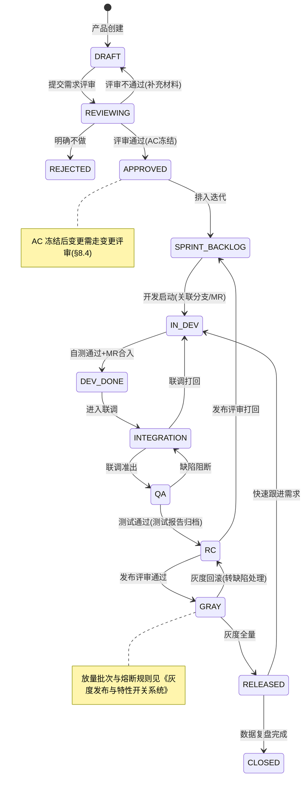
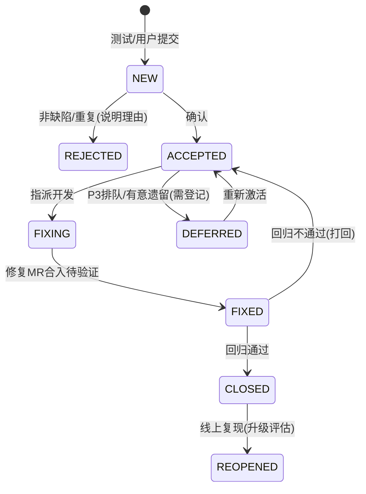

# 研发协作流程与工程规范 - 详细设计

> 来源：原设计文档 §14「项目实施建议」（14.1 团队角色建议 / 14.2 研发流程建议）。
> 本文将原文 8 步研发流程建议细化为可直接落地的协作流程、数据结构、接口与工具规范，覆盖：需求生命周期、迭代节奏、技术评审、Git 提交、代码评审、前后端与 AI 联调、缺陷管理、发布治理、线上问题响应与复盘。

## 1. 模块概述

### 1.1 定位与目标

| 项 | 说明 |
| --- | --- |
| 问题域 | 多角色（产品/设计/移动端/服务端/AI/教研/测试/运营）跨端协作的流程秩序，需求从提出到上线复盘的全生命周期管理 |
| 目标 | 1) 任何时刻能回答"这个需求/缺陷现在在哪一步、卡在谁手里"；2) 关键变更（支付、安全、AI 行为）必经评审与门禁；3) 发布可灰度、可回滚、可追溯 |
| 不覆盖 | CI/CD 流水线自动化细节（见《CI-CD流水线与自动化构建发布系统-详细设计.md》）、测试体系本身（见《测试策略与质量保障体系-详细设计.md》）、代码分层规范（见《服务端代码分层规范与通用开发模板-详细设计.md》） |

### 1.2 与其他文档的关系

- 分支模型、版本号：引用《CI-CD流水线与自动化构建发布系统》§2、§7，本文不重复定义。
- 契约测试与 Mock：联调流程引用《服务端接口文档自动化与契约测试规范》《服务端-API Mock服务与契约驱动前后端并行开发支撑平台》。
- 灰度发布执行：引用《灰度发布与特性开关系统-详细设计.md》，本文定义"何时允许灰度"的治理规则。
- 线上排障：引用《排障根因分析与系统故障复盘引擎-详细设计.md》，本文定义响应流程与角色分工。
- 埋点与指标：数据复盘引用《数据埋点与关键指标系统-详细设计.md》。

## 2. 角色与职责矩阵（RACI）

对原设计 §14.1 的 8 个角色扩展出 RACI 矩阵（R=执行，A=最终负责，C=被咨询，I=被通知）。关键流程的 RACI 是流程裁决依据：出现争议时，A 拥有决策权。

| 流程节点 | 产品经理 | UI/UX | 移动端 | 服务端 | AI工程师 | 内容教研 | 测试 | 运营 |
| --- | --- | --- | --- | --- | --- | --- | --- | --- |
| 需求评审 | A/R | C | C | C | C | C | C | C |
| 技术评审 | C | I | R | A/R | R | I | C | I |
| 接口契约定稿 | C | I | C | A/R | C | I | C | I |
| 内容生产验收 | C | I | I | I | I | A/R | C | C |
| 代码评审（移动端） | I | I | A/R | C | C | I | I | I |
| 代码评审（服务端/AI） | I | I | C | A/R | R | I | I | I |
| 联调准入确认 | C | I | R | R | R | I | A | I |
| 发布评审 | C | I | C | C | C | I | C | A |
| 灰度放量决策 | C | I | I | C | C | I | C | A |
| 线上 P0 响应 | I | I | R | R | R | I | C | A |
| 数据复盘 | R | I | I | C | C | C | C | A |

补充规则：

1. 支付、会员、隐私合规相关需求，服务端负责人与平台管理员为共同 A（双签）。
2. AI 输出策略（Prompt、答案管控、安全过滤）变更，AI 工程师为 A，内容教研为强制 C。
3. 未成年人保护相关需求（防沉迷、内容分级），法务/合规角色为 C（如无专职，由平台管理员兼任）。

## 3. 需求生命周期管理

### 3.1 需求单数据结构

```json
{
  "id": "REQ-2026-0814-0037",
  "title": "错题本支持按错误原因筛选",
  "type": "FEATURE",
  "priority": "P1",
  "source": "PRODUCT_ROADMAP",
  "sourceRef": "docs/design/xxx.md#6.6",
  "objective": "提升错题复习针对性，预期错题复习完成率 +5%",
  "acceptanceCriteria": [
    "AC1: 错题列表支持按 6 类错因标签多选筛选",
    "AC2: 筛选结果支持导出 PDF",
    "AC3: 筛选状态在会话内保持"
  ],
  "scope": {
    "modules": ["错题服务", "客户端-错题本页面"],
    "outOfScope": ["错因自动打标优化"]
  },
  "state": "IN_DEV",
  "sprintId": "SPR-2026-09",
  "owner": {"product": "PM-zhang", "dev": ["SVR-li", "APP-wang"], "qa": "QA-chen"},
  "contractIds": ["API-contract-1024"],
  "metrics": [{"key": "wrong_question_review_rate", "baseline": 0.42, "target": 0.47}],
  "linkedDefects": ["DEF-2026-0812-0091"],
  "updatedAt": "2026-08-14T03:12:00Z",
  "version": 7
}
```

字段说明：

| 字段 | 必填 | 约束 |
| --- | --- | --- |
| `type` | 是 | 枚举：`FEATURE` / `OPTIMIZE` / `TECH_DEBT` / `COMPLIANCE`（合规需求不可降级砍掉） |
| `priority` | 是 | `P0` 阻塞发布 / `P1` 本迭代必须 / `P2` 尽量 / `P3` 排队；映射原设计 §10 优先级体系 |
| `sourceRef` | FEATURE 必填 | 指向设计文档（docs/design 或 docs2 细化文档）章节锚点，保证"文档驱动"可追溯 |
| `acceptanceCriteria` | 是 | ≥1 条，可测试的语言描述；无 AC 的需求不得进入 `APPROVED` |
| `metrics` | 建议 | 需求上线后数据复盘的量化依据，key 必须已注册于埋点指标体系 |
| `version` | 是 | 乐观锁版本号，并发状态流转时用于冲突检测 |

### 3.2 需求状态机



状态流转守卫（服务端强校验，不满足返回错误码见 §11）：

| 流转 | 守卫条件 |
| --- | --- |
| → `APPROVED` | `acceptanceCriteria` 非空；`sourceRef` 合法；技术类需求已有技术评审记录 |
| → `IN_DEV` | 已关联 Git 分支（命名 `{reqId|feature/...}`）；接口类需求已关联契约 ID |
| → `DEV_DONE` | 关联 MR 全部合入且 CI 绿；单测覆盖率不低于门禁（新代码 ≥70%） |
| → `QA` | 联调准出单签署（测试 A 签字）；冒烟用例 100% 通过 |
| → `RC` | 测试报告归档；P0/P1 缺陷清零，P2 有遗留需发布评审确认 |
| → `GRAY` | 发布评审通过（§8）；灰度计划（批次、观察指标、回滚阈值）已填写 |
| → `CLOSED` | 灰度全量 ≥7 天且核心指标无退化；复盘记录已归档 |

### 3.3 需求管理 API（内部平台接口）

需求跟踪采用自建轻量服务（挂在管理后台域），接口供管理后台、CI 机器人、IM 机器人调用。

| 方法 | 路径 | 说明 |
| --- | --- | --- |
| POST | `/api/v1/requirements` | 创建需求单（PM） |
| GET | `/api/v1/requirements?state=&sprintId=&owner=&priority=` | 分页查询（通用分页规范） |
| GET | `/api/v1/requirements/{id}` | 详情（含流转历史） |
| PATCH | `/api/v1/requirements/{id}` | 编辑（仅 `DRAFT`/`APPROVED` 前状态可编辑 AC，AC 变更记入变更记录） |
| POST | `/api/v1/requirements/{id}/transitions` | 状态流转 `{target, actor, note}`，服务端执行守卫校验 |
| POST | `/api/v1/requirements/{id}/links` | 关联契约/缺陷/分支/ MR |
| GET | `/api/v1/sprints/{id}/burndown` | 迭代燃尽数据 |

流转接口关键实现（Spring 风格，状态机表驱动）：

```java
@Service
public class RequirementStateMachine {

    // 流转 -> 守卫集合（全部通过才允许流转）
    private final Map<Transition, List<Guard>> guards = Map.of(
        Transition.to(APPROVED), List.of(
            req -> !req.getAcceptanceCriteria().isEmpty(),
            req -> refValidator.exists(req.getSourceRef()),
            req -> req.getType() != Type.TECH_FEATURE
                   || techReviewRepo.existsPassed(req.getId())
        ),
        Transition.to(QA), List.of(
            req -> integrationSignOffRepo.isSigned(req.getId()),
            req -> smokeClient.passRate(req.getId()) == 1.0
        ),
        Transition.to(GRAY), List.of(
            req -> releaseReviewRepo.isApproved(req.getId()),
            req -> grayPlanValidator.valid(req.getGrayPlan())
        )
    );

    @Transactional
    public Requirement transit(Long id, ReqState target, String actor, String note) {
        Requirement req = requirementRepo.findWithLock(id); // SELECT ... FOR UPDATE
        Transition t = Transition.of(req.getState(), target)
            .orElseThrow(() -> new BizException(ErrCode.REQ_TRANSITION_INVALID,
                Map.of("from", req.getState(), "to", target)));
        guards.getOrDefault(t, List.of()).forEach(g -> g.check(req)); // 抛 GuardViolatedException
        req.setState(target);
        req.setUpdatedAt(Instant.now());
        historyRepo.save(RequirementHistory.of(req, t, actor, note));
        eventBus.publish(ReqStateChangedEvent.of(req)); // 触发 IM 通知/看板刷新/webhook
        return req;
    }
}
```

## 4. 迭代节奏与版本火车

### 4.1 双周迭代日历

固定"版本火车"（Release Train），错过本班次的 P2/P3 需求顺延下迭代，禁止临时加塞（加塞走 §8.4 变更评审）。

| 周次 | 周一 | 周二 | 周三 | 周四 | 周五 |
| --- | --- | --- | --- | --- | --- |
| W1 | 迭代规划会（排定 SPRINT_BACKLOG） | 技术评审/契约定稿截止 | — | — | 周会+风险刷新 |
| W2 | — | — | 代码冻结（DEV_DONE 截止） | 联调准出+提测 | 测试+发布评审 |
| W3(=下个W1) | 灰度启动 | — | — | — | 数据复盘会（上迭代） |

关键时间点：

1. **契约定稿截止（W1 周二）**：接口契约冻结后前端即可基于 Mock 并行开发。
2. **代码冻结（W2 周三 18:00）**：之后合入主干仅限缺陷修复，MR 标题必须带 `fix:` 且关联缺陷 ID。
3. **发布评审（W2 周五）**：见 §8。
4. **变更冻结期**：开学季高峰（8 月末—9 月中）、大促、重大考试日（高考 6 月 6-9 日）为冻结期，仅允许 P0 修复发布。

### 4.2 迭代容量规划

- 迭代容量按"人日 × 历史吞吐系数 0.7"估算，预留 20% 缺陷修复与线上支持 buffer。
- P0 需求占用不超过迭代容量 40%，避免突发需求挤占联调与测试时间。
- 内容教研的生产任务（题库、教材章节）单独按内容产能排期，不走研发迭代，但上线联动（内容生效开关）须在需求单登记。

## 5. 技术评审规范

### 5.1 评审触发条件

| 变更类型 | 是否必须技术评审 |
| --- | --- |
| 新服务/新表/新外部依赖 | 必须 |
| 涉及金钱（订单、支付、积分、发票） | 必须（双 A 签） |
| 涉及未成年人数据、隐私合规 | 必须（合规 C） |
| AI 行为策略（Prompt 模板、答案管控规则、安全过滤阈值） | 必须 |
| 既有模块内小改动（无新表/新依赖） | 免评审，走代码评审把关 |

### 5.2 评审单模板与产出

技术评审记录挂到需求单（`techReviewRepo`），最低必含：

```markdown
## 技术评审：REQ-xxx
1. 方案概述（3 句话以内）
2. 影响的模块/服务清单（对应 docs2 细化文档）
3. 数据模型变更（DDL 摘要 + 数据迁移方案 + 回滚方案）
4. 接口契约 ID 与 Mock 完成时间承诺
5. 容量与性能预估（QPS、Token 成本、存储增量）
6. 降级与开关方案（功能开关 key、降级行为）
7. 监控与告警项（新增指标/日志关键字）
8. 评审结论：通过 / 有条件通过（列出条件）/ 不通过
```

评审不通过的常见硬伤清单（评审人直接按此打回）：无回滚方案、无功能开关、直接 `DROP/ALTER` 生产表、Prompt 变更无 A/B 对照方案、涉及未成年人数据但未走合规咨询。

## 6. Git 提交规范

分支模型沿用《CI-CD流水线与自动化构建发布系统》§2（主干开发 + 短生命周期特性分支 + release 分支）。本文补充提交规范与本地钩子。

### 6.1 Conventional Commits

格式：`<type>(<scope>): <subject> [#REQ-xxx | #DEF-xxx]`

| type | 用途 |
| --- | --- |
| `feat` | 新功能（必须关联 REQ） |
| `fix` | 缺陷修复（必须关联 DEF） |
| `refactor` / `perf` / `test` / `docs` / `chore` / `build` / `ci` | 常规含义 |

示例：`feat(wrong-question): 错因多选筛选与PDF导出 #REQ-2026-0814-0037`

### 6.2 commit-msg 钩子（服务端仓库预装）

```bash
#!/usr/bin/env bash
# .git/hooks/commit-msg —— 也可由 CI 在流水线首阶段统一复检
msg_file="$1"
msg=$(head -n1 "$msg_file")

pattern='^(feat|fix|refactor|perf|test|docs|chore|build|ci|revert)\([a-z0-9-]+\): .{1,72} #(REQ|DEF)-[0-9]{4}-[0-9]{4}-[0-9]{4}$'
plain='^(chore|docs|ci|merge).{0,80}$'

if ! echo "$msg" | grep -qE "$pattern" && ! echo "$msg" | grep -qE "$plain"; then
  echo "❌ 提交信息不符合规范"
  echo "   格式: type(scope): subject #REQ-2026-MMDD-XXXX"
  echo "   示例: feat(wrong-question): 错因筛选 #REQ-2026-0814-0037"
  exit 1
fi
```

CI 侧同样校验（质量门禁第一关），并在 MR 上自动回填需求单关联（`POST /api/v1/requirements/{id}/links`）。

## 7. 代码评审规范

### 7.1 必审范围与评审人规则

| 变更 | 最低评审要求 |
| --- | --- |
| 一般业务代码 | 1 名同方向工程师 Approve |
| 支付/订单/积分/发票 | 2 名 Approve，其中 1 名为该域 Owner |
| AI Prompt/安全过滤/答案管控 | 2 名 Approve，其中 1 名 AI 工程师 + 内容教研 review 留痕 |
| 数据库 DDL / 数据迁移脚本 | 1 名 DBA/服务端 Owner + 迁移脚本双人复核 |
| 依赖升级（含大模型 SDK） | 1 名 Owner，附 changelog 风险摘要 |

### 7.2 MR 模板与门禁

MR 描述模板（仓库 `.gitlab/merge_request_templates/default.md`）：

```markdown
## 关联
- 需求/缺陷：#REQ-xxx / #DEF-xxx（二选一必填）
- 契约：contract-xxx（接口变更必填）
## 变更说明
（做了什么、为什么、影响面）
## 自测
- [ ] 本地跑通 AC 对应用例
- [ ] 新增/修改单测已覆盖核心分支（新代码覆盖率 ≥70%）
- [ ] 弱网/异常路径自测（涉及客户端时）
## 风险与开关
- 功能开关 key：feat_xxx（默认 ）
- 回滚方式：
## 截图/录屏（UI 变更必贴）
```

硬性门禁（CI 未过禁止合入，Admin 不得豁免，绕过需走 §8.4 变更评审并留痕）：

1. 流水线全绿（构建、静态扫描、单测、契约测试）。
2. 提交信息校验通过（§6.2）。
3. 代码owner规则校验（CODEOWNERS）。

### 7.3 评审 SLA 与度量

- 评审响应 SLA：工作时间段 4 小时内首次响应；代码冻结日 2 小时。
- 评审看板度量（管理后台）：MR 平均滞留时长、一次通过率、评审意见密度；连续两周评审滞留 Top1 的评审人由迭代会协调分担。
- 评审意见分级：`[blocker]` 必须解决才能 Approve；`[suggestion]` 可创建 TECH_DEBT 需求跟进，不阻塞合入。

## 8. 发布治理

### 8.1 发布评审（Release Review）

每迭代发布前 24 小时召开（W2 周四），逐需求过 check list：

| 检查项 | 责任人 |
| --- | --- |
| RC 测试报告归档，P0/P1 清零 | 测试 |
| 数据库迁移脚本已在预生产执行并验证回滚 | 服务端 |
| 功能开关清单与默认值确认（新功能默认关闭/白名单） | 各端负责人 |
| 灰度计划：批次 1%→5%→20%→50%→100%，每批观察 ≥2h，观察指标与回滚阈值 | 服务端 + 运营 |
| AI 行为变更的 A/B 结论与兜底策略 | AI 工程师 |
| 内容生效清单（教材/题库数据包版本） | 内容教研 |
| 客服 FAQ 与预警话术更新 | 运营 |
| 监控大盘新增告警项已验证触发 | 服务端 |

评审结论记录入 `release_ticket`，任一项不满足 → 打回 `RC`。

### 8.2 灰度放量与熔断

灰度执行细节（批次编排、开关联动）见《灰度发布与特性开关系统》，治理侧约束：

1. 放量推进条件：崩溃率 < 基线 +0.05pp、核心接口错误率 <0.1%、灰度组 P1 以上反馈清零。
2. 熔断：任一观察指标越限 → 自动暂停放量并告警，值班工程师 30 分钟内决定回滚或修复前进。
3. 支付类变更灰度批次强制 1%→5%→20%→50%→100%，不允许跳批。

### 8.3 回滚原则

- 客户端：热修（代码推送，见《客户端-Flutter代码推送热更新》）优先于发版；涉及原生能力的走商店加急。
- 服务端：镜像回滚 + 迁移脚本回滚脚本配套；DDL 遵循"先加后删、分两版执行"（本版只加新列/新表，旧列删除放 N+2 版），保证无状态回滚可行。

### 8.4 变更评审（中途加塞/AC 变更/门禁豁免）

统一走 `ChangeReview`：提出人填写影响面 → 对应 A 角色批准（支付双 A）→ 自动广播到迭代群 → 状态机放行。所有豁免记录永久可审计。

## 9. 缺陷管理流程

### 9.1 缺陷单数据结构

```json
{
  "id": "DEF-2026-0812-0091",
  "title": "灰度包在 Android 8.0 上启动崩溃",
  "severity": "P0",
  "env": "GRAY/1%",
  "reqId": "REQ-2026-0814-0037",
  "reproSteps": ["1. ...", "2. ..."],
  "expected": "正常进入首页",
  "actual": "启动闪退，日志见 SNT-9981",
  "state": "FIXING",
  "assignee": "APP-wang",
  "sla": {"respondBy": "2026-08-12T10:30:00Z", "resolveBy": "2026-08-12T22:30:00Z"},
  "rootCause": null,
  "fixMrIds": [8841],
  "regressionCases": ["TC-LOGIN-003"]
}
```

### 9.2 严重等级与 SLA

| 等级 | 定义 | 响应 | 解决 | 发布约束 |
| --- | --- | --- | --- | --- |
| P0 | 线线崩溃/资金错误/数据丢失/安全泄露/未成年人保护失效 | 30 分钟 | 24 小时 | 立即热修或回滚，全量暂停 |
| P1 | 核心功能不可用（拍题、AI 问答、支付主流程） | 4 小时 | 3 天 | 阻断 RC→GRAY |
| P2 | 次要功能异常有替代路径 | 24 小时 | 本迭代或下迭代 | 遗留需发布评审确认 |
| P3 | 体验/文案/优化建议 | 48 小时 | 排队 | 不阻断 |

### 9.3 缺陷状态机



规则：`CLOSED` 必须挂回归用例（新增或既有），回归用例纳入冒烟集的由测试决定；P0/P1 的 `rootCause` 必填且关联复盘记录（§10.3）。

## 10. 联调、线上响应与复盘

### 10.1 前后端与 AI 联调流程

契约先行（在 `DRAFT→SPRINT_BACKLOG` 期间完成）：

1. 契约定稿（W1 周二截止）→ 发布到 Mock 平台，客户端立即对接 Mock。
2. 联调环境（`dev-sprint` 泳道）按迭代部署，环境隔离见《服务端-全链路流量染色与多环境泳道隔离路由体系》。
3. AI 联调约定：Prompt 版本固定为迭代内冻结版本；AI 工程师提供金样本集（input→期望要点），联调用例断言"要点命中"而非全文匹配。
4. 联调准出（W2 周三）：客户端提测单附自测录屏 + AC 对照结果，测试 A 签署后需求流转 `QA`。

### 10.2 线上问题响应（P0 为例）

```
告警/反馈触发 → 值班群自动拉起应急会审（≤10min）
  ├─ 判定影响面：崩溃/资金/安全/未成年人 → 立即止血（回滚/开关关闭/限流降级）
  ├─ 止血后建 DEF(P0)，进入修复流程（豁免评审、直接走紧急发布通道）
  └─ 24h 内出根因初报，3 个工作日内复盘会
```

详细根因分析方法见《排障根因分析与系统故障复盘引擎》。

### 10.3 复盘（Blameless）

复盘记录结构（挂迭代或缺陷）：

```json
{
  "retroId": "RETRO-2026-08-014",
  "type": "SPRINT_REVIEW | INCIDENT | METRIC_REVIEW",
  "refId": "SPR-2026-09 | DEF-xxx | REQ-xxx",
  "timeline": ["T+0min 告警触发", "T+8min 决策回滚", "..."],
  "rootCause": "...",
  "impact": {"users": 1200, "durationMin": 35, "fundImpact": 0},
  "whatWentWell": ["告警 1 分钟内触达"],
  "whatWentWrong": ["迁移脚本未在预生产验证回滚"],
  "actionItems": [
    {"item": "迁移脚本强制预生产演练门禁", "owner": "SVR-li", "due": "2026-08-28", "state": "OPEN", "reqId": "REQ-2026-0828-0002"}
  ]
}
```

复盘 action item 必须转化为需求单（TECH_DEBT/COMPLIANCE）或流程规范修订（本文件 PR），不接受"口头改进"。迭代数据复盘（活跃/留存/付费/AI 成本/学习效果五维，对应原设计 §14.2 第 8 步）在 W3 周五复盘会评审，指标口径引用《数据埋点与关键指标系统》。

## 11. 错误处理与错误码

流程服务本身按《服务端统一业务异常码与错误分类体系》规范，本域错误码段 `417xx`：

| 错误码 | 场景 | HTTP | 客户端处理 |
| --- | --- | --- | --- |
| 41701 `REQ_TRANSITION_INVALID` | 非法状态流转 | 409 | 提示当前状态与允许的目标状态 |
| 41702 `REQ_GUARD_VIOLATED` | 守卫未满足（如无 AC 转 APPROVED） | 422 | 返回未满足守卫清单 |
| 41703 `REQ_VERSION_CONFLICT` | 乐观锁冲突 | 409 | 提示刷新后重试 |
| 41704 `REQ_ID_DANGLING` | commit/MR 引用的 REQ/DEF 不存在 | 422 | CI 门禁失败，列出非法提交 |
| 41705 `RELEASE_GATE_FAILED` | 发布评审项缺失 | 422 | 列出未满足检查项 |
| 41706 `CHANGE_FREEZE_WINDOW` | 冻结期内发布请求 | 403 | 提示冻结窗口与紧急通道入口 |
| 41707 `REVIEW_APPROVAL_INSUFFICIENT` | Approve 数量/角色不满足 | 403 | 列出还差的角色 |

Webhook/机器人调用失败重试：指数退避 3 次（1m/5m/30m），仍失败落死信表由每日巡检任务重放。

## 12. 数据库设计（流程域核心表）

```sql
CREATE TABLE req_ticket (
  id            VARCHAR(32) PRIMARY KEY,          -- REQ-2026-0814-0037
  title         VARCHAR(128) NOT NULL,
  type          VARCHAR(16)  NOT NULL,            -- FEATURE/OPTIMIZE/TECH_DEBT/COMPLIANCE
  priority      VARCHAR(4)   NOT NULL,            -- P0~P3
  source        VARCHAR(32)  NOT NULL,
  source_ref    VARCHAR(512),                     -- 设计文档锚点
  content       JSON         NOT NULL,            -- objective/AC/scope/metrics 等
  state         VARCHAR(24)  NOT NULL,
  sprint_id     VARCHAR(32),
  version       INT          NOT NULL DEFAULT 1,  -- 乐观锁
  created_by    VARCHAR(64)  NOT NULL,
  created_at    TIMESTAMP    NOT NULL DEFAULT CURRENT_TIMESTAMP,
  updated_at    TIMESTAMP    NOT NULL DEFAULT CURRENT_TIMESTAMP ON UPDATE CURRENT_TIMESTAMP,
  KEY idx_sprint_state (sprint_id, state),
  KEY idx_state_priority (state, priority)
);

CREATE TABLE req_state_history (       -- 流转审计
  id           BIGINT PRIMARY KEY AUTO_INCREMENT,
  req_id       VARCHAR(32) NOT NULL,
  from_state   VARCHAR(24) NOT NULL,
  to_state     VARCHAR(24) NOT NULL,
  actor        VARCHAR(64) NOT NULL,
  note         VARCHAR(512),
  created_at   TIMESTAMP NOT NULL DEFAULT CURRENT_TIMESTAMP,
  KEY idx_req (req_id, created_at)
);

CREATE TABLE req_link (                -- 需求↔分支/MR/契约/缺陷 关联
  id           BIGINT PRIMARY KEY AUTO_INCREMENT,
  req_id       VARCHAR(32) NOT NULL,
  link_type    VARCHAR(16) NOT NULL,   -- BRANCH/MR/CONTRACT/DEFECT/DOC
  link_ref     VARCHAR(128) NOT NULL,
  created_by   VARCHAR(64) NOT NULL,
  UNIQUE KEY uk_req_link (req_id, link_type, link_ref)
);

CREATE TABLE defect_ticket ( LIKE 命名同 req_ticket 模式,
  severity     VARCHAR(4) NOT NULL,
  req_id       VARCHAR(32),
  env          VARCHAR(32),
  sla_respond_by TIMESTAMP, sla_resolve_by TIMESTAMP,
  root_cause   TEXT, retro_id VARCHAR(32),
  state        VARCHAR(24) NOT NULL,
  KEY idx_sev_state (severity, state)
);

CREATE TABLE release_ticket (
  id           VARCHAR(32) PRIMARY KEY,  -- REL-2026-09-01
  sprint_id    VARCHAR(32) NOT NULL,
  checklist    JSON NOT NULL,            -- §8.1 各项及签署人
  gray_plan    JSON NOT NULL,
  decision     VARCHAR(16) NOT NULL,     -- APPROVED/REJECTED
  decided_by   VARCHAR(64) NOT NULL,
  created_at   TIMESTAMP NOT NULL DEFAULT CURRENT_TIMESTAMP
);

CREATE TABLE retro_record (
  id           VARCHAR(32) PRIMARY KEY,
  type         VARCHAR(24) NOT NULL,
  ref_id       VARCHAR(32) NOT NULL,
  content      JSON NOT NULL,
  created_at   TIMESTAMP NOT NULL DEFAULT CURRENT_TIMESTAMP
);
```

流程数据保留策略：`CLOSED` 需求与缺陷归档 3 年（审计要求），复盈权限仅团队内部可见。

## 13. 落地路线（MVP 建议）

1. **第 1 步（MVP 前）**：先落地"需求状态机 + Conventional Commits + MR 模板 + CODEOWNERS"四件套，工具用现成 GitLab（Issue 当需求单、Label 当状态）+ 钩子脚本，不急着自建流程服务。
2. **第 2 步（V1.0）**：把 GitLab Issue 与管理后台打通（webhook 双向同步 §3.3 接口），实现状态守卫自动化与燃尽图。
3. **第 3 步（V1.5+）**：发布评审/灰度放量/冻结窗口接入《灰度发布与特性开关系统》执行链路，实现"治理规则代码化"。
4. 自建流程服务上线前，本文 §3.3 接口即为契约，先以 GitLab API 适配层实现。

## 14. 跨模块引用索引

- 《CI-CD流水线与自动化构建发布系统-详细设计》—— 分支模型、流水线、版本号、回滚执行
- 《服务端接口文档自动化与契约测试规范-详细设计》《服务端-API Mock服务…》—— 契约先行
- 《灰度发布与特性开关系统-详细设计》—— 灰度批次执行与熔断
- 《测试策略与质量保障体系-详细设计》—— 测试准入准出、AI 输出测试
- 《数据埋点与关键指标系统-详细设计》—— 复盘指标口径
- 《排障根因分析与系统故障复盘引擎-详细设计》—— 根因分析
- 《服务端审计日志与操作追溯系统-详细设计》—— 流程操作审计
- 《服务端-用户反馈数据深度分析与产品改进智能推荐引擎-详细设计》—— 反馈进入需求池
