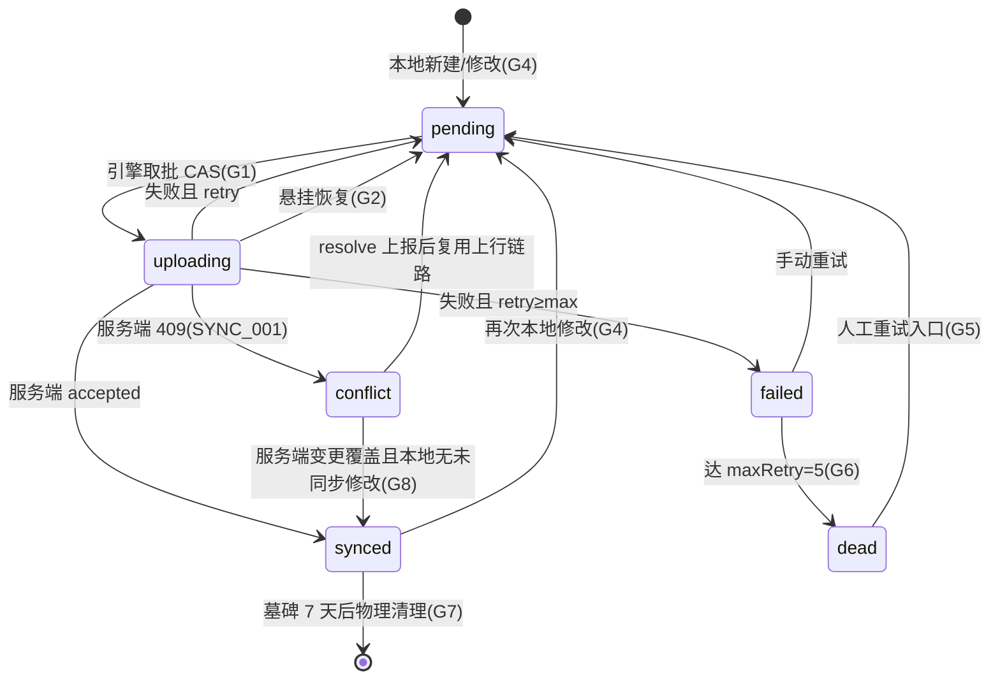

# 离线缓存与数据同步 - 详细设计

> 模块负责人：待定 | 版本：1.1 | 更新日期：2026-08-19

## 1. 概述

### 1.1 背景

PrimeTop 作为面向 K12 学生的移动端 APP，使用场景集中在家庭、学校、通勤等环境。网络状况复杂（WiFi/4G/5G/弱网/无网），需要一套完善的离线缓存与数据同步机制保障学习体验连续性。

### 1.2 设计目标

| 目标 | 指标 |
|------|------|
| 离线基础可用 | 无网时仍可浏览已缓存教材、查看错题本、阅读历史对话 |
| 弱网体验流畅 | 弱网(3G/EDGE)下首屏加载 < 4s，核心操作不阻塞 |
| 数据最终一致 | 网络恢复后 30s 内完成增量同步，数据不丢失 |
| 冲突可处理 | 多端并发修改（如手机+平板）采用明确冲突策略 |
| 存储可控 | 本地缓存上限可配，LRU 淘汰，不影响设备存储 |

### 1.3 适用范围

- 客户端：Flutter (Android / iOS)
- 数据类型：学习记录、错题、对话历史、教材章节、用户配置、会员状态
- 同步方向：双向（客户端 ↔ 服务端）

---

## 2. 数据分类与离线策略矩阵

### 2.1 数据分类

根据数据特征和离线需求，将所有本地数据分为四类：

| 分类 | 说明 | 离线可读 | 离线可写 | 同步方向 |
|------|------|----------|----------|----------|
| **A-只读缓存** | 教材章节、知识点、题目模板、静态资源 | ✅ | ❌ | 服务端→客户端 |
| **B-可写可同步** | 学习记录、错题、笔记、学习计划进度 | ✅ | ✅ | 双向 |
| **C-状态镜像** | 用户配置、会员状态、教材版本选择 | ✅ | ⚠️ 有限 | 双向（低频） |
| **D-临时数据** | AI 流式响应缓冲区、图片裁剪临时文件 | ⚠️ 部分 | ✅ | 仅上传 |

### 2.2 各模块离线策略

| 模块 | 数据类型 | 分类 | 离线策略 |
|------|----------|------|----------|
| AI 智能辅导 | 对话历史 | B | 本地缓存历史对话，新对话排队等待网络 |
| AI 智能辅导 | 流式响应 | D | 本地缓冲已接收 token，断网保留已生成部分 |
| 拍照搜题 | 拍摄图片 | D | 本地暂存，网络恢复后自动上传 OCR |
| 拍照搜题 | 解析结果 | A | 已查看的解析缓存到本地 |
| 同步课堂 | 教材章节 | A | 预下载当前及下一章节内容 |
| 同步课堂 | 学习进度 | B | 本地记录，恢复后同步 |
| 错题本 | 错题记录 | B | 本地增删改，恢复后双向同步 |
| 错题本 | 错题图片 | D | 本地暂存，恢复后上传 |
| 学情分析 | 统计数据 | A | 缓存最近一份报告，离线展示旧数据 |
| 学习规划 | 计划与任务 | B | 本地可完成/跳过任务，恢复后同步 |
| 用户设置 | 偏好/配置 | C | 本地可改，恢复后同步（以最新为准） |
| 会员状态 | 权益信息 | C | 缓存会员状态，过期时间到后强制校验 |

---

## 3. 本地存储架构

### 3.1 存储技术选型

| 存储需求 | 技术方案 | 说明 |
|----------|----------|------|
| 结构化数据 | **SQLite (sqflite)** | 学习记录、错题、对话、计划等 |
| KV 配置 | **SharedPreferences** | 用户设置、会员缓存、同步元数据 |
| 文件缓存 | **文件系统 + 管理器** | 图片、语音、教材资源包 |
| 大文本缓存 | **Hive (可选)** | AI 对话全文、教材 HTML 片段 |

### 3.2 SQLite 数据库设计

#### 3.2.1 核心表结构

```sql
-- 同步元数据表：记录每条数据的同步状态
CREATE TABLE sync_metadata (
    id              TEXT PRIMARY KEY,          -- 数据唯一ID (UUID)
    entity_type     TEXT NOT NULL,             -- 实体类型: mistake, learning_record, plan_task, conversation, note
    entity_id       TEXT NOT NULL,             -- 实体业务ID
    local_version   INTEGER NOT NULL DEFAULT 1,
    server_version  INTEGER,                   -- NULL = 尚未同步
    sync_status     TEXT NOT NULL DEFAULT 'pending',
        -- pending:    待同步（新建或修改后）
        -- synced:     已同步
        -- conflict:   冲突待处理
        -- uploading:  正在上传
        -- failed:     同步失败（含重试次数）
    created_at      TEXT NOT NULL,             -- ISO 8601
    updated_at      TEXT NOT NULL,             -- ISO 8601
    retry_count     INTEGER NOT NULL DEFAULT 0,
    last_sync_at    TEXT,
    payload_hash    TEXT                       -- 数据摘要，用于变更检测
);

CREATE INDEX idx_sync_status ON sync_metadata(sync_status);
CREATE INDEX idx_sync_entity ON sync_metadata(entity_type, entity_id);
CREATE INDEX idx_sync_updated ON sync_metadata(updated_at);

-- 操作日志表：记录离线期间的写操作，用于有序重放
CREATE TABLE operation_log (
    id              INTEGER PRIMARY KEY AUTOINCREMENT,
    entity_type     TEXT NOT NULL,
    entity_id       TEXT NOT NULL,
    operation       TEXT NOT NULL,             -- INSERT, UPDATE, DELETE
    timestamp       TEXT NOT NULL,             -- 客户端时间 ISO 8601
    sequence        INTEGER NOT NULL,          -- 单调递增序列号
    payload         TEXT,                      -- JSON 序列化的完整数据
    sync_status     TEXT NOT NULL DEFAULT 'pending',
    FOREIGN KEY (entity_type, entity_id) REFERENCES sync_metadata(entity_type, entity_id)
);

CREATE INDEX idx_oplog_sync ON operation_log(sync_status, sequence);

-- 错题本地表
CREATE TABLE local_mistake (
    id              TEXT PRIMARY KEY,          -- UUID
    user_id         TEXT NOT NULL,
    question_id     TEXT,
    subject         TEXT NOT NULL,
    chapter_id      TEXT,
    knowledge_point TEXT,
    mistake_type    TEXT,                      -- 概念不清/审题错误/计算失误/方法错误
    image_paths     TEXT,                      -- JSON array of local paths
    ocr_text        TEXT,
    my_answer       TEXT,
    correct_answer  TEXT,
    analysis        TEXT,                      -- AI 解析缓存
    status          TEXT NOT NULL DEFAULT 'active',
        -- active:     待订正
        -- corrected:  已订正
        -- mastered:   已掌握
        -- archived:   已归档
    review_count    INTEGER NOT NULL DEFAULT 0,
    next_review_at  TEXT,                      -- 遗忘曲线下次复习时间
    created_at      TEXT NOT NULL,
    updated_at      TEXT NOT NULL
);

-- 学习记录本地表
CREATE TABLE local_learning_record (
    id              TEXT PRIMARY KEY,
    user_id         TEXT NOT NULL,
    session_type    TEXT NOT NULL,             -- ai_chat, photo_question, sync_study, mistake_review, plan_task, essay
    subject         TEXT,
    chapter_id      TEXT,
    knowledge_point TEXT,
    duration_sec    INTEGER NOT NULL DEFAULT 0,
    detail          TEXT,                      -- JSON: 记录详情（题目ID、对话ID等）
    started_at      TEXT NOT NULL,
    ended_at        TEXT,
    synced          INTEGER NOT NULL DEFAULT 0 -- 0=未同步, 1=已同步
);

-- 对话历史本地表
CREATE TABLE local_conversation (
    id              TEXT PRIMARY KEY,
    user_id         TEXT NOT NULL,
    title           TEXT,
    subject         TEXT,
    created_at      TEXT NOT NULL,
    updated_at      TEXT NOT NULL
);

CREATE TABLE local_conversation_message (
    id              TEXT PRIMARY KEY,
    conversation_id TEXT NOT NULL,
    role            TEXT NOT NULL,             -- user, assistant, system
    content         TEXT NOT NULL,
    message_type    TEXT NOT NULL DEFAULT 'text', -- text, image, voice
    attachment_path TEXT,                      -- 本地附件路径
    tokens_used     INTEGER,
    created_at      TEXT NOT NULL,
    FOREIGN KEY (conversation_id) REFERENCES local_conversation(id)
);

-- 学习计划任务本地表
CREATE TABLE local_plan_task (
    id              TEXT PRIMARY KEY,
    user_id         TEXT NOT NULL,
    plan_id         TEXT NOT NULL,
    task_type       TEXT NOT NULL,             -- chapter_study, exercise, mistake_review, essay,背诵
    title           TEXT NOT NULL,
    subject         TEXT,
    chapter_id      TEXT,
    scheduled_date  TEXT NOT NULL,
    duration_min    INTEGER,
    status          TEXT NOT NULL DEFAULT 'pending',
        -- pending, in_progress, completed, skipped
    completed_at    TEXT,
    synced          INTEGER NOT NULL DEFAULT 0,
    created_at      TEXT NOT NULL,
    updated_at      TEXT NOT NULL
);

-- 教材章节缓存表
CREATE TABLE cached_chapter (
    id              TEXT PRIMARY KEY,
    textbook_id     TEXT NOT NULL,
    subject         TEXT NOT NULL,
    grade           TEXT NOT NULL,
    semester        TEXT NOT NULL,             -- 上/下
    chapter_number  INTEGER NOT NULL,
    section_number  INTEGER,
    title           TEXT NOT NULL,
    content_html    TEXT,                      -- 章节正文 HTML
    knowledge_points TEXT,                     -- JSON array
    resources       TEXT,                      -- JSON: 附带的图片/语音资源清单
    cached_at       TEXT NOT NULL,
    expires_at      TEXT,                      -- 缓存过期时间
    size_bytes      INTEGER
);

-- 文件缓存注册表
CREATE TABLE cached_file (
    id              INTEGER PRIMARY KEY AUTOINCREMENT,
    url             TEXT NOT NULL UNIQUE,
    local_path      TEXT NOT NULL,
    mime_type       TEXT,
    size_bytes      INTEGER,
    category        TEXT NOT NULL,             -- textbook_image, mistake_photo, voice, avatar, other
    access_count    INTEGER NOT NULL DEFAULT 0,
    last_accessed   TEXT NOT NULL,
    downloaded_at   TEXT NOT NULL,
    expires_at      TEXT
);

CREATE INDEX idx_cached_file_url ON cached_file(url);
CREATE INDEX idx_cached_file_category ON cached_file(category, last_accessed);
```

### 3.3 本地存储管理器

```dart
/// 本地存储管理器 - 统一管理 SQLite / SharedPreferences / 文件缓存
class LocalStorageManager {
  static LocalStorageManager? _instance;
  static LocalStorageManager get instance => _instance!;

  late Database _db;
  late SharedPreferences _prefs;
  late FileCacheManager _fileCache;

  /// 初始化
  static Future<void> init() async {
    _instance = LocalStorageManager._();
    await _instance!._initInternal();
  }

  Future<void> _initInternal() async {
    // 打开数据库
    final dbPath = await getDatabasesPath();
    _db = await openDatabase(
      join(dbPath, 'primetop.db'),
      version: 1,
      onCreate: _onCreate,
      onUpgrade: _onUpgrade,
    );

    // 初始化 KV 存储
    _prefs = await SharedPreferences.getInstance();

    // 初始化文件缓存
    final cacheDir = await getApplicationCacheDirectory();
    _fileCache = FileCacheManager(baseDir: cacheDir.path);
  }

  Database get db => _db;
  SharedPreferences get prefs => _prefs;
  FileCacheManager get fileCache => _fileCache;
}
```

---

## 4. 同步引擎设计

### 4.1 同步架构总览

```
┌───────────────────────────────────────────────┐
│                   Flutter APP                  │
│                                                │
│  ┌─────────┐  ┌─────────┐  ┌───────────────┐ │
│  │ 错题模块 │  │ 学习模块 │  │ 对话模块      │ │
│  └────┬────┘  └────┬────┘  └──────┬────────┘ │
│       │            │              │            │
│       ▼            ▼              ▼            │
│  ┌──────────────────────────────────────────┐ │
│  │         SyncableRepository<T>            │ │
│  │  (统一的可同步数据仓库基类)               │ │
│  │  - 本地 CRUD                              │ │
│  │  - 变更检测 & 操作日志                    │ │
│  │  - 同步状态管理                           │ │
│  └──────────────────┬───────────────────────┘ │
│                     │                          │
│  ┌──────────────────▼───────────────────────┐ │
│  │            SyncEngine                     │ │
│  │  - 网络状态监听                           │ │
│  │  - 同步调度器                             │ │
│  │  - 冲突解决器                             │ │
│  │  - 重试 & 退避                            │ │
│  └──────────────────┬───────────────────────┘ │
│                     │                          │
│  ┌──────────────────▼───────────────────────┐ │
│  │         NetworkLayer (Dio)                │ │
│  │  - 请求队列                               │ │
│  │  - 连接状态检测                           │ │
│  │  - 离线拦截                               │ │
│  └──────────────────────────────────────────┘ │
└───────────────────────────────────────────────┘
```

### 4.2 SyncEngine 核心

```dart
/// 同步引擎 - 负责调度所有数据同步
class SyncEngine {
  final ConnectivityService _connectivity;
  final SyncApiClient _apiClient;
  final SyncMetadataDao _metadataDao;
  final OperationLogDao _opLogDao;

  final _syncController = StreamController<SyncEvent>.broadcast();
  Stream<SyncEvent> get syncEvents => _syncController.stream;

  Timer? _periodicTimer;
  bool _isSyncing = false;

  /// 同步配置
  static const _config = SyncConfig(
    periodicInterval: Duration(seconds: 30),    // 定期同步间隔
    maxRetryCount: 5,                            // 最大重试次数
    batchSize: 50,                               // 每批上传条数
    backoffBase: Duration(seconds: 2),           // 退避基数
    conflictStrategy: ConflictStrategy.serverWins, // 默认冲突策略
  );

  /// 启动同步引擎
  void start() {
    // 监听网络状态
    _connectivity.onStatusChange.listen((status) {
      if (status == NetworkStatus.online) {
        _triggerSync(reason: 'network_restored');
      }
    });

    // 定期同步
    _periodicTimer = Timer.periodic(_config.periodicInterval, (_) {
      if (_connectivity.isOnline && !_isSyncing) {
        _triggerSync(reason: 'periodic');
      }
    });

    // APP 从后台恢复时触发
    WidgetsBinding.instance.addObserver(AppLifecycleObserver(
      onResume: () => _triggerSync(reason: 'app_resumed'),
    ));
  }

  /// 手动触发同步
  Future<SyncResult> syncNow() async {
    return _triggerSync(reason: 'manual');
  }

  /// 核心同步流程
  Future<SyncResult> _triggerSync({required String reason}) async {
    if (_isSyncing) {
      return SyncResult.skipped('sync_in_progress');
    }

    if (!_connectivity.isOnline) {
      return SyncResult.skipped('offline');
    }

    _isSyncing = true;
    _syncController.add(SyncStarted(reason: reason));

    try {
      // Phase 1: 上传本地变更
      final uploadResult = await _uploadChanges();

      // Phase 2: 下载服务端变更
      final downloadResult = await _downloadChanges();

      // Phase 3: 处理冲突
      final conflictResult = await _resolveConflicts();

      // Phase 4: 清理已同步的操作日志
      await _cleanupSyncedLogs();

      final result = SyncResult.success(
        uploaded: uploadResult.count,
        downloaded: downloadResult.count,
        conflicts: conflictResult.count,
      );

      _syncController.add(SyncCompleted(result));
      return result;
    } catch (e, st) {
      _syncController.add(SyncFailed(error: e, stackTrace: st));
      return SyncResult.failed(e.toString());
    } finally {
      _isSyncing = false;
    }
  }

  /// Phase 1: 上传本地变更
  Future<_BatchResult> _uploadChanges() async {
    final pendingOps = await _opLogDao.getPendingOperations(
      limit: _config.batchSize,
    );

    if (pendingOps.isEmpty) return _BatchResult(count: 0);

    int successCount = 0;
    final failedOps = <OperationLog>[];

    for (final op in pendingOps) {
      try {
        await _opLogDao.markStatus(op.id, 'uploading');

        switch (op.operation) {
          case 'INSERT':
            await _apiClient.createEntity(
              entityType: op.entityType,
              entityId: op.entityId,
              payload: op.payload!,
              clientTimestamp: op.timestamp,
              sequence: op.sequence,
            );
            break;
          case 'UPDATE':
            await _apiClient.updateEntity(
              entityType: op.entityType,
              entityId: op.entityId,
              payload: op.payload!,
              clientTimestamp: op.timestamp,
              sequence: op.sequence,
            );
            break;
          case 'DELETE':
            await _apiClient.deleteEntity(
              entityType: op.entityType,
              entityId: op.entityId,
              clientTimestamp: op.timestamp,
              sequence: op.sequence,
            );
            break;
        }

        await _opLogDao.markStatus(op.id, 'synced');
        await _metadataDao.updateSyncStatus(
          op.entityType, op.entityId, 'synced',
        );
        successCount++;
      } on ConflictException catch (e) {
        await _metadataDao.updateSyncStatus(
          op.entityType, op.entityId, 'conflict',
        );
        await _opLogDao.markStatus(op.id, 'conflict');
        // 冲突会在 Phase 3 统一处理
      } catch (e) {
        await _opLogDao.incrementRetry(op.id);
        final retryCount = await _opLogDao.getRetryCount(op.id);
        if (retryCount >= _config.maxRetryCount) {
          await _opLogDao.markStatus(op.id, 'failed');
        } else {
          await _opLogDao.markStatus(op.id, 'pending');
          failedOps.add(op);
        }
      }
    }

    return _BatchResult(count: successCount);
  }

  /// Phase 2: 下载服务端变更
  Future<_BatchResult> _downloadChanges() async {
    // 获取每个实体类型的最后同步时间
    final lastSyncTimes = await _metadataDao.getLastSyncTimes();

    int downloadCount = 0;

    for (final entry in lastSyncTimes.entries) {
      final entityType = entry.key;
      final lastSync = entry.value;

      try {
        final response = await _apiClient.getChanges(
          entityType: entityType,
          since: lastSync,
          limit: _config.batchSize,
        );

        for (final entity in response.entities) {
          await _applyServerChange(entityType, entity);
          downloadCount++;
        }

        await _metadataDao.updateLastSyncTime(
          entityType, response.serverTimestamp,
        );
      } catch (e) {
        // 下载失败不阻塞其他类型，下次重试
        continue;
      }
    }

    return _BatchResult(count: downloadCount);
  }

  /// Phase 3: 冲突解决
  Future<_BatchResult> _resolveConflicts() async {
    final conflicts = await _metadataDao.getConflicts();
    if (conflicts.isEmpty) return _BatchResult(count: 0);

    int resolvedCount = 0;
    for (final conflict in conflicts) {
      final strategy = _getConflictStrategy(conflict.entityType);

      switch (strategy) {
        case ConflictStrategy.serverWins:
          await _resolveWithServerData(conflict);
          break;
        case ConflictStrategy.clientWins:
          await _resolveWithClientData(conflict);
          break;
        case ConflictStrategy.merge:
          await _resolveWithMerge(conflict);
          break;
      }
      resolvedCount++;
    }

    return _BatchResult(count: resolvedCount);
  }

  /// 根据实体类型获取冲突策略
  ConflictStrategy _getConflictStrategy(String entityType) {
    switch (entityType) {
      case 'mistake':
        return ConflictStrategy.merge;      // 错题：合并（保留双方修改）
      case 'plan_task':
        return ConflictStrategy.serverWins; // 计划任务：服务端优先
      case 'learning_record':
        return ConflictStrategy.clientWins; // 学习记录：客户端优先（时间更准）
      case 'conversation':
        return ConflictStrategy.merge;      // 对话：合并消息
      default:
        return _config.conflictStrategy;
    }
  }
}
```

### 4.3 SyncableRepository 基类

```dart
/// 可同步数据仓库 - 所有需要同步的模块继承此基类
abstract class SyncableRepository<T extends SyncableEntity> {
  final Database _db;
  final SyncEngine _syncEngine;
  final OperationLogDao _opLogDao;

  String get entityType;
  String get tableName;

  T fromMap(Map<String, dynamic> map);
  Map<String, dynamic> toMap(T entity);

  /// 本地创建
  Future<T> create(T entity) async {
    final id = entity.id ?? const Uuid().v4();
    final now = DateTime.now().toIso8601String();

    final entityWithMeta = entity.copyWith(id: id, createdAt: now, updatedAt: now);
    final map = toMap(entityWithMeta);

    await _db.insert(tableName, map);
    await _recordOperation('INSERT', id, map);
    _notifySyncEngine();

    return entityWithMeta;
  }

  /// 本地更新
  Future<void> update(T entity) async {
    final now = DateTime.now().toIso8601String();
    final entityWithMeta = entity.copyWith(updatedAt: now);
    final map = toMap(entityWithMeta);

    await _db.update(
      tableName, map,
      where: 'id = ?', whereArgs: [entity.id],
    );
    await _recordOperation('UPDATE', entity.id!, map);
    _notifySyncEngine();
  }

  /// 本地删除
  Future<void> delete(String id) async {
    await _db.delete(tableName, where: 'id = ?', whereArgs: [id]);
    await _recordOperation('DELETE', id, null);
    _notifySyncEngine();
  }

  /// 查询本地数据
  Future<List<T>> queryLocal({
    String? where,
    List<Object?>? whereArgs,
    String? orderBy,
    int? limit,
  }) async {
    final results = await _db.query(
      tableName,
      where: where,
      whereArgs: whereArgs,
      orderBy: orderBy,
      limit: limit,
    );
    return results.map(fromMap).toList();
  }

  /// 记录操作日志
  Future<void> _recordOperation(
    String operation, String entityId, Map<String, dynamic>? payload,
  ) async {
    final sequence = await _opLogDao.nextSequence();

    // 更新同步元数据
    await _db.insert('sync_metadata', {
      'id': const Uuid().v4(),
      'entity_type': entityType,
      'entity_id': entityId,
      'local_version': await _getLocalVersion(entityId) + 1,
      'sync_status': 'pending',
      'created_at': DateTime.now().toIso8601String(),
      'updated_at': DateTime.now().toIso8601String(),
      'payload_hash': payload != null ? _hashPayload(payload) : null,
    }, conflictAlgorithm: ConflictAlgorithm.replace);

    // 记录操作日志
    await _db.insert('operation_log', {
      'entity_type': entityType,
      'entity_id': entityId,
      'operation': operation,
      'timestamp': DateTime.now().toIso8601String(),
      'sequence': sequence,
      'payload': payload != null ? jsonEncode(payload) : null,
      'sync_status': 'pending',
    });
  }

  /// 通知同步引擎
  void _notifySyncEngine() {
    // 标记有新变更，下次同步周期会处理
    _syncEngine.markDirty();
  }

  String _hashPayload(Map<String, dynamic> payload) {
    final bytes = utf8.encode(jsonEncode(payload));
    return sha256.convert(bytes).toString().substring(0, 16);
  }
}
```

---

## 5. 同步 API 设计

### 5.1 服务端同步接口

#### 5.1.1 上传变更

```
POST /api/v1/sync/upload
Authorization: Bearer <jwt>
Content-Type: application/json

Request:
{
  "operations": [
    {
      "entity_type": "mistake",
      "entity_id": "uuid-xxx",
      "operation": "INSERT",
      "sequence": 1001,
      "client_timestamp": "2026-05-19T08:30:00Z",
      "payload": {
        "subject": "math",
        "chapter_id": "ch-7-3",
        "mistake_type": "计算失误",
        "my_answer": "x = 5",
        "correct_answer": "x = -5"
      }
    }
  ],
  "last_sequence": 1000
}

Response 200:
{
  "results": [
    {
      "entity_type": "mistake",
      "entity_id": "uuid-xxx",
      "status": "accepted",
      "server_version": 42
    }
  ],
  "server_timestamp": "2026-05-19T08:30:01Z"
}

Response 409 (Conflict):
{
  "results": [
    {
      "entity_type": "mistake",
      "entity_id": "uuid-yyy",
      "status": "conflict",
      "server_version": 39,
      "server_data": { ... },
      "conflict_fields": ["status", "review_count"]
    }
  ]
}
```

#### 5.1.2 下载变更

```
GET /api/v1/sync/download?entity_types=mistake,plan_task&since=2026-05-19T08:00:00Z&limit=50
Authorization: Bearer <jwt>

Response 200:
{
  "changes": [
    {
      "entity_type": "mistake",
      "entity_id": "uuid-zzz",
      "operation": "UPDATE",
      "server_version": 43,
      "timestamp": "2026-05-19T08:25:00Z",
      "data": {
        "status": "corrected",
        "review_count": 2,
        "next_review_at": "2026-05-22T08:00:00Z"
      }
    }
  ],
  "has_more": true,
  "server_timestamp": "2026-05-19T08:30:01Z"
}
```

#### 5.1.3 冲突解决

```
POST /api/v1/sync/resolve
Authorization: Bearer <jwt>
Content-Type: application/json

Request:
{
  "resolutions": [
    {
      "entity_type": "mistake",
      "entity_id": "uuid-yyy",
      "strategy": "client_wins",
      "merged_data": {
        "status": "active",
        "review_count": 3,
        "my_answer": "x = 5",
        "correct_answer": "x = -5"
      }
    }
  ]
}

Response 200:
{
  "resolved": [
    {
      "entity_type": "mistake",
      "entity_id": "uuid-yyy",
      "server_version": 44
    }
  ]
}
```

### 5.2 批量操作 API

```
POST /api/v1/sync/batch
Authorization: Bearer <jwt>
Content-Type: application/json

Request:
{
  "operations": [
    {"op": "upload", "entity_type": "learning_record", ...},
    {"op": "download", "entity_type": "mistake", "since": "..."}
  ]
}
```

---

## 6. 冲突解决策略

### 6.1 冲突检测

冲突发生在以下场景：客户端修改了某条数据，但服务端版本号已变更（其他端已修改并同步）。

```dart
/// 冲突检测逻辑（服务端侧）
///
/// 客户端上传时携带 local_version，
/// 服务端对比 current_version:
///   - local_version == current_version → 无冲突，直接写入
///   - local_version < current_version → 冲突，返回 409 + 服务端数据
class ConflictDetector {
  SyncCheckResult check({
    required int clientVersion,
    required int serverVersion,
  }) {
    if (clientVersion == serverVersion) {
      return SyncCheckResult.noConflict;
    }
    if (clientVersion > serverVersion) {
      // 异常：客户端版本高于服务端（时钟回拨等）
      return SyncCheckResult.anomaly;
    }
    return SyncCheckResult.conflict(
      serverVersion: serverVersion,
    );
  }
}
```

### 6.2 各实体冲突策略

| 实体类型 | 策略 | 合并逻辑 |
|----------|------|----------|
| `mistake` (错题) | **合并** | 保留两端的 `review_count` 最大值；`status` 取最高级（mastered > corrected > active）；自定义字段以最新 `updated_at` 为准 |
| `learning_record` (学习记录) | **客户端优先** | 学习记录由客户端产生（时长、时间戳），服务端只聚合统计 |
| `plan_task` (计划任务) | **服务端优先** | 计划由服务端生成，客户端只修改完成状态；冲突时取服务端 |
| `conversation` (对话) | **合并** | 消息追加型数据，不修改已有消息，冲突仅发生在标题修改 |
| `user_settings` (用户配置) | **字段级合并** | 每个设置项独立比较，以最新 `updated_at` 为准 |
| `note` (笔记) | **客户端优先** | 笔记是用户手动编辑，以最新修改为准 |

### 6.3 错题合并详细逻辑

```dart
class MistakeConflictResolver {
  /// 合并错题冲突
  ///
  /// 规则：
  /// 1. status: 取两端进度最高级（mastered > corrected > active，进度只进不退）；
  ///    若任一端已归档（archived）则归档优先——显式归档=删除意图，对齐规则 5
  /// 2. review_count: 取两端最大值（复习次数只累加不丢失）
  /// 3. next_review_at: 取较早者（宁可提前复习，不可漏复习；
  ///    重算权威归间隔重复引擎，见 §15 契约 9）
  /// 4. 内容字段（mistake_type/my_answer/ocr_text/image_paths/knowledge_point/
  ///    chapter_id 等）：Last-Writer-Wins，以 updated_at 较新一端为准
  /// 5. DELETE vs UPDATE: 删除胜（避免已删数据复活）；archived 同样视为删除意图
  /// 6. correct_answer/analysis/question_id/subject 为服务端权威字段，
  ///    客户端不参与裁决，直接采用服务端值
  Future<MistakeMergeResult> resolve({
    required LocalMistake local,
    required ServerMistake server,
  }) async {
    // R6: 服务端权威字段直接采用
    final correctAnswer = server.correctAnswer;
    final analysis = server.analysis;

    // R1: status 合并（归档优先 / 进度最高级）
    final mergedStatus = _mergeStatus(local.status, server.status);

    // R2: 复习次数取最大
    final mergedReviewCount = math.max(local.reviewCount, server.reviewCount);

    // R3: 下次复习时间取较早者（保守策略）
    final mergedNextReview = _earlierOrNull(
      local.nextReviewAt, server.nextReviewAt,
    );

    // R4: 内容字段以 updated_at 较新一端为基
    final contentBase = local.updatedAt.isAfter(server.updatedAt)
        ? local
        : server;

    final merged = LocalMistake(
      id: server.id, // 客户端 UUID 预分配，两端 ID 一致（见 §10.2）
      questionId: server.questionId,
      subject: server.subject,
      chapterId: contentBase.chapterId,
      knowledgePoint: contentBase.knowledgePoint,
      mistakeType: contentBase.mistakeType,
      // 图片取并集：本地 path 与服务端 url 双态，展示层优先本地命中；
      // 本地新增未上传图片由 D 类暂存队列在合并后补传
      imagePaths: _unionImages(local.imagePaths, server.imagePaths),
      ocrText: contentBase.ocrText,
      myAnswer: contentBase.myAnswer,
      correctAnswer: correctAnswer,
      analysis: analysis,
      status: mergedStatus,
      reviewCount: mergedReviewCount,
      nextReviewAt: mergedNextReview,
      createdAt: _earlierOrNull(local.createdAt, server.createdAt) ?? local.createdAt,
      updatedAt: DateTime.now().toIso8601String(),
    );

    return MistakeMergeResult(
      entity: merged,
      strategy: 'merge',
      baseServerVersion: server.version,
      conflictFields: _diffFields(local, server),
    );
  }

  /// R1 实现：任一端归档 → 归档；否则取进度最高级
  String _mergeStatus(String a, String b) {
    if (a == 'archived' || b == 'archived') return 'archived';
    const rank = {'active': 1, 'corrected': 2, 'mastered': 3};
    return rank[a]! >= rank[b]! ? a : b;
  }

  String? _earlierOrNull(String? a, String? b) {
    if (a == null) return b;
    if (b == null) return a;
    return a.compareTo(b) <= 0 ? a : b; // ISO 8601 字典序即时间序
  }

  List<String> _unionImages(List<String> local, List<String> server) {
    final set = <String>{...server, ...local};
    return set.toList()..sort();
  }

  /// 产出冲突字段清单，供冲突 UI 展示与埋点
  List<String> _diffFields(LocalMistake local, ServerMistake server) {
    final fields = <String>[];
    if (local.status != server.status) fields.add('status');
    if (local.reviewCount != server.reviewCount) fields.add('review_count');
    if (local.myAnswer != server.myAnswer) fields.add('my_answer');
    if (local.mistakeType != server.mistakeType) fields.add('mistake_type');
    return fields;
  }
}

/// 合并结果：baseServerVersion 用于 resolve 接口 CAS（守卫 G9）
class MistakeMergeResult {
  final LocalMistake entity;
  final String strategy; // merge | client_wins | server_wins
  final int baseServerVersion;
  final List<String> conflictFields;
  MistakeMergeResult({
    required this.entity,
    required this.strategy,
    required this.baseServerVersion,
    required this.conflictFields,
  });
}
```

合并结果落库与上报（业务表与元数据同事务，见 §10.3）：

```dart
Future<void> applyMerge(MistakeMergeResult result, SyncApiClient api) async {
  // 1. 本地落库：业务表 + 同步元数据同事务
  await _db.transaction((txn) async {
    await txn.insert('local_mistake', result.entity.toMap(),
        conflictAlgorithm: ConflictAlgorithm.replace);
    await txn.update(
      'sync_metadata',
      {
        'sync_status': 'pending',
        'updated_at': DateTime.now().toIso8601String(),
      },
      where: "entity_type = 'mistake' AND entity_id = ?",
      whereArgs: [result.entity.id],
    );
  });

  // 2. 上报服务端（对齐《多端数据同步》POST /api/v1/sync/resolve-conflict）
  //    strategy=merge + merged_data + base_server_version
  await api.resolveConflict(
    entityType: 'mistake',
    entityId: result.entity.id,
    resolution: 'merge',
    mergedData: result.entity.toSyncMap(),
    baseServerVersion: result.baseServerVersion,
  );

  // 3. 成功后元数据转 synced（失败留在 pending，由引擎按状态机重试）
}
```

### 6.4 对话合并逻辑

对话为追加型（append-only）数据：消息只增不改，冲突仅发生在会话元信息（标题/学科标签）。合并 = 消息集合并集 + 元信息 LWW：

```dart
class ConversationConflictResolver {
  /// 对话合并：消息按 ID 去重取并集，元信息 LWW
  ConversationMerge resolve({
    required LocalConversation local,
    required ServerConversation server,
  }) {
    // 1. 消息并集：以消息 ID 去重（客户端 UUID 预分配保证跨端不撞）
    final mergedMessages = <String, ChatMessage>{};
    for (final m in server.messages) {
      mergedMessages[m.id] = m;
    }
    for (final m in local.messages) {
      mergedMessages[m.id] = m; // 同 ID 消息内容不可变，覆盖等价
    }

    // 2. 排序：created_at 字典序，同刻并列以 ID 稳定排序
    final ordered = mergedMessages.values.toList()
      ..sort((a, b) {
        final c = a.createdAt.compareTo(b.createdAt);
        return c != 0 ? c : a.id.compareTo(b.id);
      });

    // 3. 元信息（标题/学科标签）LWW
    final base = local.updatedAt.isAfter(server.updatedAt) ? local : server;

    return ConversationMerge(
      title: base.title,
      subject: base.subject,
      messages: ordered,
    );
  }
}
```

约束说明：

- **消息体不可变是合并安全的前提**：任何端不允许 UPDATE 已有消息（role=system 的纠错内容由服务端追加新消息实现，不修改原文）。该约束由 `SyncableRepository.update()` 校验——conversation 实体仅允许修改 title/subject 白名单字段。
- 流式生成中断的消息（D 类）本地标记 `interrupted=true`，**不参与同步**；恢复网络后由用户选择重发提问，不自动续传（对齐 E2E 弱网离线文档 §5.3）。

### 6.5 用户设置字段级合并

`user_settings` 属 C 类状态镜像：字段值与**字段级时间戳向量**存于 SharedPreferences，结构为 `{"values": {...}, "fieldTs": {field: iso8601}}`。合并规则：逐字段 Last-Writer-Wins。

```dart
class UserSettingsMerger {
  /// 字段级 LWW 合并
  Map<String, dynamic> merge(
    Map<String, dynamic> local,
    Map<String, dynamic> server,
  ) {
    final localValues = local['values'] as Map<String, dynamic>;
    final localTs = local['fieldTs'] as Map<String, dynamic>;
    final serverValues = server['values'] as Map<String, dynamic>;
    final serverTs = server['fieldTs'] as Map<String, dynamic>;

    final mergedValues = {...serverValues};
    final mergedTs = {...serverTs};

    for (final field in localValues.keys) {
      final lt = localTs[field] as String? ?? '';
      final st = serverTs[field] as String? ?? '';
      if (lt.compareTo(st) >= 0) {
        // 本地该字段更新（或服务端缺失该字段时间戳）
        mergedValues[field] = localValues[field];
        mergedTs[field] = lt;
      }
    }
    return {'values': mergedValues, 'fieldTs': mergedTs};
  }
}
```

注意：服务端须同步返回字段级时间戳；若服务端仅支持实体级 updated_at，则退化为整体 LWW，并埋点 `settings_degraded_merge` 标记（用于推动服务端补齐字段级时间戳）。

### 6.6 计划任务：服务端优先与完成态例外

plan_task 权威在服务端（《服务端-多源学习任务统一调度与优先级仲裁引擎》），本地为镜像+离线补写。冲突裁决规则：

| 冲突场景 | 裁决 | 说明 |
|----------|------|------|
| 服务端重排/改期 vs 本地仅改 status | 服务端内容字段 + 本地完成态 | 完成事实不可回退 |
| 服务端已删除该任务 vs 本地已完成/跳过 | 任务删除生效，完成事实转写 | 完成事件写入学习记录（时长/题目），不随任务删除丢失 |
| 双端都改 status | completed > skipped > in_progress > pending | 与错题 R1 同构，进度只进不退 |
| 本地 skipped vs 服务端改期 | 服务端新任务生效 + 本地 skip 理由保留 | skip 需填 reason（对齐任务调度引擎），转写为 skip 事件上报 |

```dart
class PlanTaskConflictResolver {
  Future<ResolvedPlanTask> resolve({
    required LocalPlanTask local,
    required ServerPlanTask? server, // null = 服务端已删除
  }) async {
    if (server == null) {
      // 服务端已删除：完成/跳过事实转写为事件，本地任务移除
      if (local.status == 'completed' || local.status == 'skipped') {
        await _eventQueue.enqueue(TaskOutcomeEvent(
          taskId: local.id,
          outcome: local.status,
          completedAt: local.completedAt,
          reason: local.skipReason,
        ));
      }
      return ResolvedPlanTask.deleted();
    }

    final mergedStatus = _mergeStatus(local.status, server.status);
    return ResolvedPlanTask(
      // 内容字段全部以服务端为准，仅保留合并后的完成态
      task: server.toLocal().copyWith(
        status: mergedStatus,
        completedAt: mergedStatus == 'completed'
            ? (local.completedAt ?? server.completedAt)
            : server.completedAt,
      ),
    );
  }

  String _mergeStatus(String a, String b) {
    const rank = {'pending': 1, 'in_progress': 2, 'skipped': 3, 'completed': 4};
    return rank[a]! >= rank[b]! ? a : b;
  }
}
```

### 6.7 冲突兜底与人工介入

自动规则无法覆盖的场景（载荷字段缺失/未注册实体类型/合并校验失败）进入人工兜底：

| 项 | 规则 |
|----|------|
| 冲突 UI | 三选项对齐《多端数据同步与冲突解决策略》§5.4：use_mine / use_theirs / merge（字段级勾选） |
| 双版本快照 | conflict_snapshot 表保留 local/server 双版本 JSON，保留 7 天 |
| 超时默认 | 冲突挂起 72h 未处理 → 自动 serverWins；**用户数据类例外**：mistake/note 超时自动 merge；埋点 conflict_auto_resolved |
| 冲突风暴 | 单轮同步冲突 > 20 条 → 批量处理页（默认全部 serverWins，可勾选保留本地），禁止逐条弹窗 |
| 幂等 | resolve 上报携带 base_server_version，服务端 CAS；版本再变返回新 409 → 重新进入冲突流程（守卫 G9） |

```sql
-- 冲突快照表（v1.1 新增）
CREATE TABLE conflict_snapshot (
    id              INTEGER PRIMARY KEY AUTOINCREMENT,
    entity_type     TEXT NOT NULL,
    entity_id       TEXT NOT NULL,
    local_payload   TEXT NOT NULL,               -- JSON
    server_payload  TEXT NOT NULL,               -- JSON
    server_version  INTEGER NOT NULL,
    created_at      TEXT NOT NULL,
    resolved_at     TEXT,                        -- 解决时间；NULL=待处理
    resolution      TEXT                         -- use_mine/use_theirs/merge/auto_server
);
CREATE INDEX idx_conflict_pending ON conflict_snapshot(resolved_at IS NULL, created_at);
```

---

## 7. 缓存淘汰与存储治理

### 7.1 存储配额矩阵

| 缓存类别 | 存储 | 默认配额 | 超额策略 | 保护集 |
|----------|------|----------|----------|--------|
| 教材章节正文 | cached_chapter | 200 MB | LRU 淘汰，当前学期章节保底 | 当前学习章节 |
| 教材图片/语音 | cached_file(textbook_image/voice) | 500 MB | LRU 淘汰 | 当前章节资源清单内 |
| 错题图片 | cached_file(mistake_photo) | 300 MB | LRU 淘汰 | 未同步（D 类暂存）永不淘汰 |
| 头像/装饰 | cached_file(avatar) | 50 MB | LRU 淘汰 | — |
| 其他 | cached_file(other) | 100 MB | LRU 淘汰 | — |
| 业务数据 | local_* 业务表 | 不设上限 | **不参与淘汰（红线）** | 全部 |
| 同步队列 | operation_log | 10000 条（对齐 SYNC_009） | 满时降频采样 learning_record | mistake/note/plan_task 状态类不丢弃 |

- 总配额默认约 1.15 GB，用户可在「设置→存储管理」调整（256 MB ~ 4 GB）；低端机（≤4 GB RAM）默认整体降至 50%。
- 配额变更即时生效：收缩时立即触发一轮淘汰至新配额以下。

### 7.2 LRU 淘汰算法

以 last_accessed 为主序，access_count 作次级权重（访问一次折算 24h「年轻度」，封顶 30 天）：

```
timeoff = julianday(now) - julianday(last_accessed)      -- 距今访问间隔(天)
young   = MIN(access_count, 30) * 1.0                     -- 访问次数折算
 eviction_score = timeoff - young                          -- 升序,最小者最先淘汰
```

```dart
class CacheEvictionEngine {
  final Database _db;

  /// 淘汰到配额以下。targetBytes = quota * 0.9（留 10% 缓冲，避免频繁触发）
  Future<EvictionReport> evictToQuota({
    required String category,
    required int quotaBytes,
  }) async {
    final target = (quotaBytes * 0.9).floor();
    final current = await _sumSize(category);
    if (current <= target) return EvictionReport.evicted(0, 0);

    // protected_urls 为淘汰前刷新的临时保护集表（见下文说明）
    final candidates = await _db.rawQuery('''
      SELECT id, local_path, size_bytes
      FROM cached_file
      WHERE category = ?
        AND url NOT IN (SELECT url FROM protected_urls)
      ORDER BY (julianday('now') - julianday(last_accessed)
                - MIN(access_count, 30) * 1.0) ASC
      LIMIT 200
    ''', [category]);

    int freed = 0, count = 0;
    for (final c in candidates) {
      if (current - freed <= target) break;
      final file = File(c['local_path'] as String);
      if (await file.exists()) await file.delete();
      await _db.delete('cached_file', where: 'id = ?', whereArgs: [c['id']]);
      freed += c['size_bytes'] as int;
      count++;
    }
    return EvictionReport.evicted(count, freed);
  }
}
```

**保护集（protected_urls）**来源：当前学习章节 resources 清单、当前个性化学习流引用资源、D 类待上传文件。每次淘汰前由内存保护集同步进临时表，保护集内存缓存由章节切换/学习流生成事件驱动刷新。

**红线**：保护集内资源、未同步的 D 类暂存文件（错题照片等）任何情况下不淘汰。

### 7.3 存储压力三级响应

| 级别 | 触发条件 | 动作 |
|------|----------|------|
| 🟢 正常 | 缓存占用 < 80% 配额 且 系统可用空间 > 1 GB | 全功能 |
| 🟠 预警 | ≥ 80% 配额 或 系统可用空间 500 MB~1 GB | 停止全部预下载；淘汰阈值提前到 0.85；设置页展示存储建议（非弹窗） |
| 🔴 告急 | ≥ 95% 配额 或 系统可用空间 < 500 MB 或系统存储告急广播 | 暂停 A 类缓存一切写入；紧急淘汰至 70%；弹窗引导清理（仅缓存类，明确告知「不会影响学习记录」）；D 类待上传文件与 B 类业务写入不受影响 |

### 7.4 章节缓存过期与续期

- `expires_at` 由服务端下发（资源包元数据），默认 30 天；章节被访问即本地续期（+30 天，上限 90 天），续期无需上报服务端。
- **会员专属章节**：expires_at ≤ 会员权益到期时间（服务端下发时钳制），到期后客户端强制失效并锁定（C3 红线），本地续期不得突破。
- 教材版本切换事件（学段升迁链路）：全量失效该 textbook_id 的 cached_chapter 行及关联 cached_file。
- 失效清理为**惰性**：读取时发现过期 → 删除行+文件并返回未命中；每日凌晨低峰批量扫描补齐（复用《客户端-应用生命周期与后台任务调度》维护窗口）。

### 7.5 A 类缓存一致性

- **校验**：cached_chapter 以服务端下发的 version_hash（内容语义版本，排除 updated_at 类非语义字段抖动）为准；命中缓存时请求携带 version 参数，服务端 304 则零传输续期。
- **失效驱动**：服务端内容变更事件（经《服务端-教育资源包管理与离线内容分发服务》失效回调/推送通道）→ 客户端删除对应缓存行；推送丢失时由章节打开时的 version_hash 校验兜底，弱网下降级为直接使用缓存并标记 stale 横幅。

---

## 8. 预下载策略（磁盘级离线包）

### 8.1 触发矩阵

| 触发点 | 预取范围 | 条件 | 优先级 |
|--------|----------|------|--------|
| 章节打开 | 下一章节（同教材相邻） | 网络可用 | P1 |
| 学习规划生成/每日任务下发 | 明日任务关联章节+题目资源 | WiFi（默认） | P0 |
| 晚间充电+WiFi（22:00-24:00 窗口） | 明日计划全量资源 | 充电中+WiFi+闲时 | P2（批量） |
| 手动 | 资源包管理页勾选 | 用户显式操作，蜂窝亦可（二次确认+流量提示） | P0（用户显式） |

### 8.2 优先级与调度

```
priority = P_base - waited_hours × 2 + isTomorrowTask × 30
P_base: 用户显式=100 / 明日任务=80 / 下一章节=60 / 关联资源=40 / 兴趣推测=20
```

- 调度器并发 2；单任务下载超时 60s、重试 2 次（指数退避），失败不阻塞后续任务；
- 带宽限速：默认 2 MB/s，夜间批量 4 MB/s，请求标记 background 优先级（对齐《客户端网络请求治理与弱网适配方案》QoS 分级），避免挤占前台学习请求；
- 电量 < 20% 且未充电 → 全部暂停，恢复后断点续传（下载器与《客户端文件上传服务与断点续传机制》同源实现）。

### 8.3 网络与分龄约束

- 默认仅 WiFi 预下载；蜂窝预下载需用户在设置中显式开启；
- **未成年人（≤14 岁）蜂窝预下载默认关闭**，开启需家长门授权（purpose=download.cellular，对齐《服务端-统一家长门与监护人授权核验引擎》）；
- 单包 > 50 MB 自动拆分分片，失败按分片粒度重试。

### 8.4 与资源包差分更新的衔接

包级（教材资源）差分更新（哈希差分/分块合并）权威归《学习资源包增量更新与差分合并引擎》；本节仅负责触发时机、优先级与磁盘落地校验（size_bytes 与资源清单核对，不一致整包重下）。**记录级增量**（错题/任务/记录/设置）不走资源包通道，走本文 §4/§5 同步协议。

---

## 9. 状态机设计

### 9.1 sync_metadata.sync_status 状态机

（v1.1 增补终态 dead，对齐 E2E 弱网离线文档 SYNC_007 死信语义；v1.0 DDL 注释中五态扩为六态）



### 9.2 转移守卫表

| 守卫 | 规则 | 违反后果 |
|------|------|----------|
| G1 | pending → uploading 必须走 CAS（UPDATE ... WHERE sync_status='pending'），防双引擎/双 isolate 重复取批 | 重复上传由服务端幂等兜底（§10.1），客户端计数偏差埋点 |
| G2 | App 启动扫描 uploading 超过 10 分钟的记录 → 回退 pending | 悬挂记录永不重传，队列积压 |
| G3 | uploading 期间本地再次修改该实体被拒（UI 提示稍后自动同步），或转为新 pending 版本排队 | 版本歧义 |
| G4 | synced 后再次本地写 → sync_status=pending 且 local_version+1 | 修改静默丢失 |
| G5 | dead 为人工终态：自动流程永不读取/重试 dead；仅「同步诊断页→重试」可回 pending | 死信风暴（反复失败占用批次） |
| G6 | failed 且 retry_count ≥ 5 → dead，同步诊断页红点+埋点 | 无限重试耗电 |
| G7 | DELETE 操作 synced 后：operation_log 物理删除；sync_metadata 保留墓碑 7 天（防其他端下载通道拉回已删数据） | 已删数据「复活」 |
| G8 | 下载变更时本地存在 pending/conflict 的同 ID 实体 → 跳过应用并登记 conflict | 离线修改被盲覆盖 |
| G9 | resolve 上报必须携带 base_server_version，服务端 CAS；版本再变返回新 409 → 重新走冲突流程 | 合并结果覆盖他人更新 |
| G10 | 同实体多条操作按 sequence 升序上传；服务端检测 sequence 回退拒绝整批（SYNC_003） | 乱序执行（先改后删变成先删后改） |

### 9.3 冲突快照生命周期

conflict_snapshot：created → resolved（use_mine / use_theirs / merge / auto_server）→ 保留 7 天 → 物理删除；未解决超 72h 自动裁决（默认 serverWins，mistake/note 为 merge），埋点 conflict_auto_resolved。

---

## 10. 幂等与并发控制

### 10.1 服务端幂等键

- 幂等键三元组 **(device_id, entity_id, sequence)**，服务端上行接口对该三元组建唯一索引；重复请求返回首次结果（SYNC_002 语义=成功，客户端标记 synced）。
- 客户端网络层对 /sync/* 的 POST **禁止自动重试重发**（对齐《客户端网络请求治理与弱网适配方案》豁免清单）；重发仅由同步引擎状态机驱动，保证 sequence 不变，服务端幂等去重。

### 10.2 客户端 UUID 预分配

INSERT 场景 ID 全部客户端预生成（UUID v4），服务端不改写 ID，避免「上传后 ID 重映射」造成下载通道与本地上行通道各认一个 ID 的双 ID 歧义。local_mistake.id 即服务端 mistake.id。

### 10.3 三表同事务（修正 v1.0 缺陷）

v1.0 §4.3 `_recordOperation` 中业务表 insert 与 sync_metadata / operation_log 三次独立写入未包事务：崩溃时会出现「业务已写、日志缺失」，该修改永远无法同步。v1.1 修正为单事务：

```dart
Future<T> create(T entity) async {
  final id = entity.id ?? const Uuid().v4();
  final now = DateTime.now().toIso8601String();
  final withMeta = entity.copyWith(id: id, createdAt: now, updatedAt: now);

  await _db.transaction((txn) async {
    await txn.insert(tableName, toMap(withMeta));           // 1. 业务表
    await _writeSyncMeta(txn, 'INSERT', id, toMap(withMeta)); // 2+3. 元数据+操作日志
  });
  _syncEngine.markDirty();
  return withMeta;
}

/// sync_metadata upsert + operation_log 插入（同事务、同 sequence）
Future<void> _writeSyncMeta(
  DatabaseExecutor txn, String operation, String id, Map<String, dynamic> map,
) async {
  final seq = await _nextSequence(txn); // SELECT MAX(sequence)+1，事务内单调
  await txn.insert('sync_metadata', { /* ...同 v1.0 字段... */ },
      conflictAlgorithm: ConflictAlgorithm.replace);
  await txn.insert('operation_log', { /* ... */ 'sequence': seq });
}
```

### 10.4 上传中杀进程

- 服务端单操作单事务，无 executing 中间态；
- 客户端 uploading 悬挂由 G2 恢复重传，服务端幂等键去重 → **至少一次投递 + 幂等 = 恰好一次效果**。

### 10.5 多 isolate 并发写

- SQLite 开启 WAL；sqflite 写操作串行化（单写者队列）；
- operation_log.sequence 在 DAO 事务内 `SELECT MAX(sequence)+1` 生成，保证严格单调；
- 后台 isolate（预下载/淘汰）不写业务表，仅写 cached_file。

### 10.6 删除后重建

同 entity_id 删除后再次创建：INSERT 复用 ID，sequence 继续单调递增；服务端按 sequence 顺序执行 DELETE → INSERT，终态正确。墓碑（G7）防止下载通道把 DELETE 拉回旧数据。

### 10.7 下载与上传固定顺序

单轮同步严格 Phase1 上传 → Phase2 下载（§4.2），不可倒置：先下载会把服务端旧态写入本地，产生中间态 UI 闪变与 conflict 误报。实时 WS 触发的增量同步同样走完整 Phase 顺序。

---

## 11. 错误处理与重试

### 11.1 错误码映射（权威定义见 E2E 弱网离线文档 §11.1，本表为客户端动作映射）

| 错误码 | 场景 | 客户端动作 | 是否重试 |
|--------|------|-----------|----------|
| SYNC_001 版本冲突 | 上传 409 | 标记 conflict，Phase 3 处理 | 否（走冲突流程） |
| SYNC_002 幂等重复 | 上行重发 | 视为成功，标记 synced | — |
| SYNC_003 批次部分失败/乱序 | 批量上传 | 拆批重试失败项，sequence 校验 | 是 |
| SYNC_004 频率超限 | 上行过频 | 固定退避 30s | 是（固定） |
| SYNC_005 设备未注册 | 403 | 重新注册设备（《用户设备管理与多端登录策略》流程）后重试 | 是 |
| SYNC_006 实体不存在 | UPDATE/DELETE 目标缺失 | 本地标记已删除 + synced | 否 |
| SYNC_007 载荷格式错误 | 版本不兼容等 | 标记 dead，同步诊断页可见 | 人工 |
| SYNC_008 存储空间不足 | 服务端拒收（配额） | 提示清理（§7.3），队列保留 | 是（清理后） |
| SYNC_009 离线队列已满 | 本地入队时 | 降频采样 learning_record，状态类不丢 | — |
| SYNC_010 服务端不可用 | 5xx/超时 | 指数退避 | 是 |

### 11.2 退避算法

```dart
Duration backoffFor(int retryCount, String errorCode) {
  if (errorCode == 'SYNC_004') return const Duration(seconds: 30);
  final base = math.min(2 * math.pow(2, retryCount), 600); // 2s 起，封顶 10min
  final jitter = base * 0.2 * (Random().nextDouble() * 2 - 1); // ±20% 抖动
  return Duration(milliseconds: ((base + jitter) * 1000).round());
}
```

### 11.3 死信治理

- dead 记录进入「设置→同步诊断」：展示实体类型/错误/重试次数，支持单条重试、全部重试、导出诊断日志（自动脱敏，不含题目原文与答案）；
- dead 上限 500 条，超出丢弃最老并埋点 dead_dropped（触发日报告警）；
- 版本升级修复兼容性问题后，由发版 changelog 标记触发一次全量 dead 自动重试。

---

## 12. 降级矩阵

| 编号 | 故障 | 表现 | 降级动作 | 恢复条件 | 红线 |
|------|------|------|----------|----------|------|
| D1 | 同步服务 5xx | 上传持续失败 | 本地全功能可用，队列继续累积，退避重试 | 服务端恢复 | 绝不本地丢弃用户数据 |
| D2 | 同步接口超时 | 批次卡住 | 15s 超时中止本批；已成功条目不回滚 | — | 单类型失败不阻塞其他实体类型 |
| D3 | 存储压力 | 写入失败/系统告急 | 三级响应（§7.3） | 空间释放 | B 类业务数据永不淘汰 |
| D4 | 时钟异常 | client_version > server_version（anomaly） | 该实体全量重拉（以服务端为准），埋点 clock_anomaly | — | 不盲写覆盖服务端 |
| D5 | 登录态失效 | 401 | 引擎暂停，不弹登录框打断学习；前台激活时引导重登 | 重登后先 /sync/status 对账再增量 | 不丢队列 |
| D6 | WS 实时通道断连 | 变更感知延迟 | 依赖 30s 周期同步兜底（WS 仅加速，不作正确性依赖） | WS 重连 | — |
| D7 | 本地数据库损坏 | 打开失败 | 每日自动备份副本恢复；仍失败 → 重建库+全量下载，上传队列从备份导入 | — | 备份每日一份、保留 3 份轮转 |
| D8 | 会员过期 | 会员章节仍缓存 | A 类会员内容只读并按 expires_at 清理 | 复购 | 错题等用户数据不受影响 |
| D9 | 低端机/后台受限 | 同步卡顿/进程被杀 | 批量 50→25、禁预下载、gzip 压缩、前台窗口同步 | — | — |
| D10 | 冲突风暴 | 单轮冲突 > 20 | 批量处理页一次裁决（默认 serverWins），禁止逐条弹窗 | — | mistake/note 默认 merge 保用户数据 |

---

## 13. 监控与埋点

### 13.1 客户端埋点事件

| 事件 | 触发 | 关键参数 |
|------|------|----------|
| sync_started / sync_completed / sync_failed | 对齐 E2E 弱网离线文档 §12.1 | trigger_type、pushed/pulled/conflicts、duration_ms、error_code |
| sync_conflict_resolved | 冲突解决完成 | entity_type、strategy（merge/use_mine/use_theirs/auto_server） |
| conflict_auto_resolved | 72h 超时自动裁决 | entity_type、default_strategy |
| cache_evicted | 淘汰执行 | category、count、freed_bytes、trigger（quota/pressure/manual） |
| storage_pressure | 进入橙/红级 | level、available_mb |
| prefetch_completed | 预下载完成 | trigger、priority、size_bytes、success |
| dead_dropped | 死信溢出丢弃 | count |

### 13.2 指标与告警阈值

| 指标 | 口径 | 阈值 | 级别 |
|------|------|------|------|
| 同步成功率（7 日） | sync_completed / (completed + failed) | < 98% | P2 |
| 队列积压 P95 | 客户端上报 pending 数 | > 500 条 | P2 |
| 冲突率 | conflict / uploaded | > 5% 连续 3 天 | P3（排查冲突规则） |
| 单轮同步时长 P95 | duration_ms | > 30s | P3 |
| 死信总量 | dead 记录数（客户端上报聚合） | > 0 | 日报 |
| 缓存命中率 | 本地命中 / 读取请求 | < 60% | P3（预下载策略调优） |
| 离线使用占比 | offline_mode_entered 会话占比 | 产品观察指标 | — |

服务端指标（变更日志写入速率 / pull 延迟等）以《多端数据同步与冲突解决策略》与 E2E 文档 §12.2 为准，本文不重复定义。

---

## 14. 安全与合规

| 编号 | 红线 |
|------|------|
| C1 | 本地 SQLite 全库 SQLCipher 加密（AES-256），密钥经 Keychain（iOS）/Keystore（Android）保管，不落普通 SharedPreferences |
| C2 | 账号退出/切换：B/C/D 类数据全清（含图片缓存文件）；A 类教材缓存可保留，但重新登录鉴权通过前不可用 |
| C3 | 离线会员内容：expires_at 客户端强校验，到期即锁；本地续期不得突破会员权益到期时间（对齐《客户端-功能门控与会员权益客户端决策引擎》） |
| C4 | 错题图片/对话内容属未成年人个人信息：缓存文件不得写入系统相册；iOS 设置 isExcludedFromBackup，Android 配置 dataExtractionRules 排除云备份 |
| C5 | 防沉迷离线不豁免：离线使用时长本地照常累计（本地时钟 + 防回拨校验），网络恢复后对账上报；离线期间到达每日上限 → 强制休息页 |
| C6 | 缓存的 AIGC 内容保留标识与水印，不因离线展示而剥离 |
| C7 | 上行载荷全程 TLS；payload_hash 随操作上传供服务端校验防篡改；诊断日志导出自动脱敏（不含题目原文与答案） |
| C8 | 账户注销：注销确认后本地全量清除并回执；再次登录按新用户全量拉取 |

---

## 15. 契约对齐

| # | 契约 | 裁决 |
|---|------|------|
| 1 | 同步协议路径与游标 | 服务端协议权威归《多端数据同步与冲突解决策略》：/api/v1/sync/push、/sync/pull?since_revision、/sync/resolve-conflict、WS /sync/ws。本文 §5 的 upload/download/resolve 为 v1.0 草案命名，客户端实现按多端文档路径调用；载荷结构（operations/results/conflict 字段）以本文 §5 为准。§5.1.2 的 since=时间戳**废弃**，统一改用 revision 单调游标（时间戳存在长事务乱序与多节点时钟偏差问题），服务端 pull 响应同时返回 next_revision 与 server_timestamp |
| 2 | 错误码 | SYNC_001~SYNC_010 字符串码权威归 E2E 弱网离线文档 §11.1；本文 §11.1 仅为客户端动作映射，不新设错误码段 |
| 3 | 与《客户端本地持久层与数据管理》 | Hive 为通用业务缓存/Repository 层权威；本文 SQLite（sync_metadata/operation_log/local_*/conflict_snapshot）为同步域专属存储；FileCacheManager 实现归持久层文档，本文 §7 只定义配额与淘汰策略 |
| 4 | 与《客户端网络请求治理与弱网适配方案》 | HTTP 层超时/重试/QoS 治理归该文档；同步语义重试归本文状态机。/sync/* POST 列入网络层自动重试豁免清单（重发必须由引擎按 sequence 幂等语义驱动） |
| 5 | 与《端到端流程设计-弱网离线学习与数据同步恢复完整链路》 | 端到端场景（地铁通勤/多端冲突/长离线恢复）权威归 E2E 文档；本文提供模块级实现细节；埋点事件名与 Phase 顺序（先上传后下载）两边保持一致 |
| 6 | 与《学习资源包增量更新与差分合并引擎》 | 包级（教材资源）差分更新归该引擎；记录级（错题/任务/记录/设置）增量归本文协议 |
| 7 | 与《服务端-教育资源包管理与离线内容分发服务》 | 资源清单、version_hash、失效事件下发归服务端；预下载触发时机与磁盘落地管理归本文 §8 |
| 8 | 与《客户端-学习内容预加载策略与智能预渲染引擎》 | 内存级预渲染归该文档，磁盘级离线包归本文 §8；预渲染未命中回退磁盘缓存，磁盘未命中走网络 |
| 9 | 与《间隔重复算法与遗忘曲线复习调度引擎》 | next_review_at 计算（含合并后按 max(review_count) 重算）权威归该引擎；本文 §6.3 R3 的「取较早者」仅为引擎不可用时的保守兜底 |
| 10 | 与《服务端-多源学习任务统一调度与优先级仲裁引擎》 | plan_task 权威在服务端，本地为镜像+离线补写；完成/跳过状态按 §6.6 例外规则合并，最终以服务端 task.completed/skip 事件回执为准 |
| 11 | 与《用户设备管理与多端登录策略》 | device_id 生成、注册时序、多端登录策略归该文档；本文消费 device_id 作幂等键成分与 exclude_device 参数 |
| 12 | 与《客户端-用户偏好设置与学习环境个性化系统》 | 设置项 schema 与默认值归该文档；本文 §6.5 仅定义字段级合并协议（values+fieldTs 结构），存储管理页入口共用 |

---

## 16. 验收场景

| # | 场景 | 预期 |
|---|------|------|
| 1 | 断网浏览已缓存章节/错题本/历史对话 | 全部可读，无白屏；页面顶部离线横幅 |
| 2 | 离线新增错题（含拍照），恢复网络 | 30s 内自动上传成功，服务端可见，图片补传完成 |
| 3 | 离线完成任务，期间服务端已重排计划 | 服务端新计划生效，完成事实保留（不回退为 pending） |
| 4 | 双端同一错题：一端订正、一端复习 2 次 | 合并 status=corrected、review_count=max，两端最终一致 |
| 5 | 一端删除错题、另一端修改 | 删除胜；修改端同步后本地移除，数据不「复活」 |
| 6 | AI 流式回答中段断网 | 已生成部分保留并标记「生成中断」；恢复后不自动续传，引导重发 |
| 7 | 会员过期后打开缓存会员章节 | 提示并锁定；免费章节与错题本不受影响 |
| 8 | 缓存占用达 95% | 预下载停止 + 清理引导；清理后功能自动恢复 |
| 9 | textbook_image 超配额 | LRU 淘汰最久未访问图片；当前章节资源不被淘汰 |
| 10 | 上传批次中杀 App，重启 | uploading 悬挂 10min 内回 pending 自动重传，服务端无重复记录 |
| 11 | 网络抖动致同一操作重发 | 服务端 SYNC_002 幂等忽略，本地标记 synced，数据唯一 |
| 12 | 设备时钟回拨 1 小时后同步 | version anomaly 检出，该实体全量重拉，数据不丢失，埋点 clock_anomaly |
| 13 | 退出账号换号登录 | 前号 B/C/D 数据全清；A 类缓存保留但鉴权前不可用 |
| 14 | 教材版本切换 | 旧版本章节缓存全量失效，新版本按需下载 |
| 15 | 弱网（400ms RTT / 10% 丢包）批量同步 | 重试后批次成功率 ≥ 99%，期间 UI 不阻塞 |
| 16 | 长离线 7 天（队列 500 条）后恢复 | 按 50/批上传，全程 UI 可用，零丢失 |
| 17 | 单轮同步产生 25 条冲突 | 批量裁决页一次处理，默认 serverWins（mistake 为 merge），不逐条弹窗 |
| 18 | 卸载重装登录 | 全量重拉错题/记录/计划，数据完整；本地无残留队列 |

---

## 17. 维护记录

| 版本 | 日期 | 说明 |
|------|------|------|
| v1.0 | 2026-05-19 | 初稿（§1-§6.2 完整，§6.3 中途截断） |
| v1.1 | 2026-08-19 | 补全烂尾文档：原 862 行截断于 §6.3 MistakeConflictResolver 注释处（围栏 21 奇）。补齐 §6.3-§6.7（错题六规则合并 / 对话集合并 / 设置字段级 LWW / 计划任务完成态例外 / 冲突人工兜底与 conflict_snapshot 表）；新增 §7 缓存淘汰与存储治理（五类配额矩阵 / LRU+保护集 / 三级压力响应 / 章节过期续期 / A 类一致性）、§8 预下载策略（四触发矩阵 / 优先级公式 / 分龄蜂窝管控 / 与资源包差分边界）、§9 六态状态机与守卫 G1-G10、§10 幂等并发七场景、§11 错误映射与退避死信、§12 降级矩阵 D1-D10、§13 监控埋点、§14 合规 C1-C8、§15 契约对齐 12 项、§16 验收 18 条。修复 v1.0 缺陷：① §4.3 三表写入未包事务（§10.3 给出修正实现）；② sync_status 缺 dead 终态；③ §5 接口路径与时间戳游标和《多端数据同步与冲突解决策略》不一致，已按 §15 契约 1 收敛 |