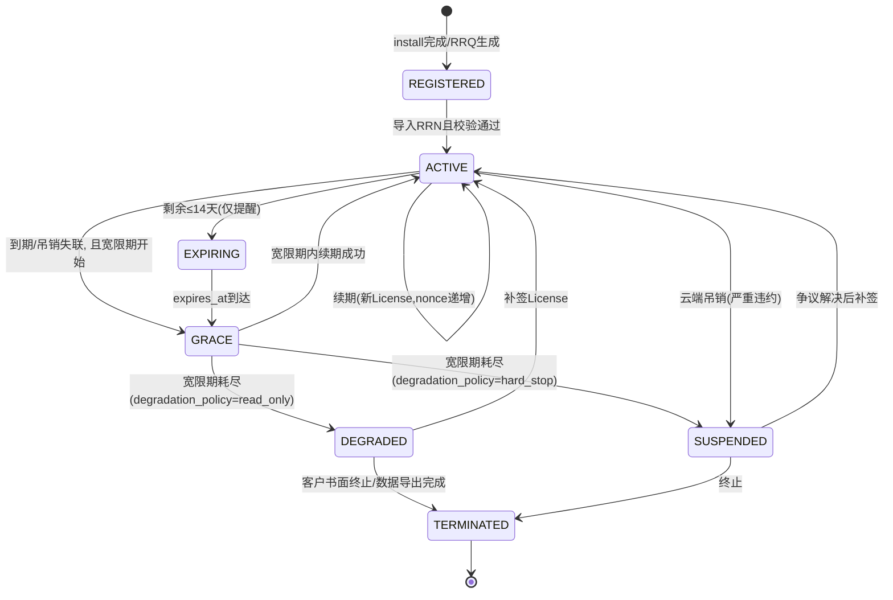
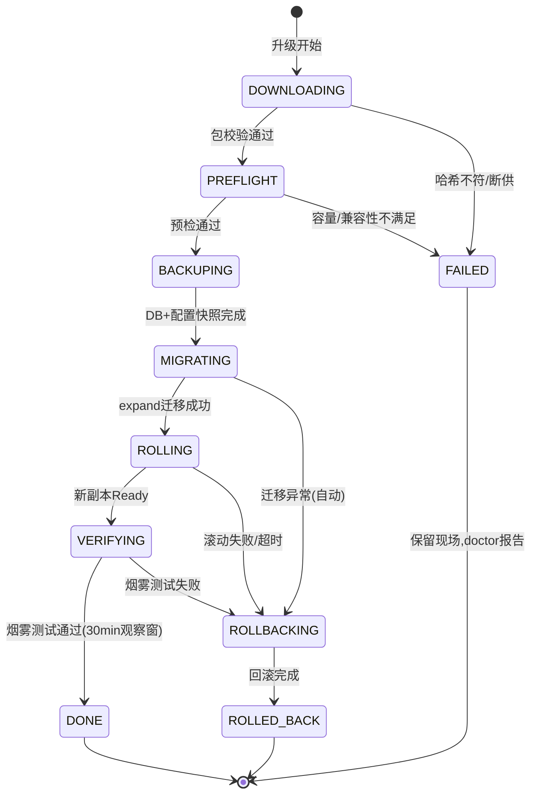
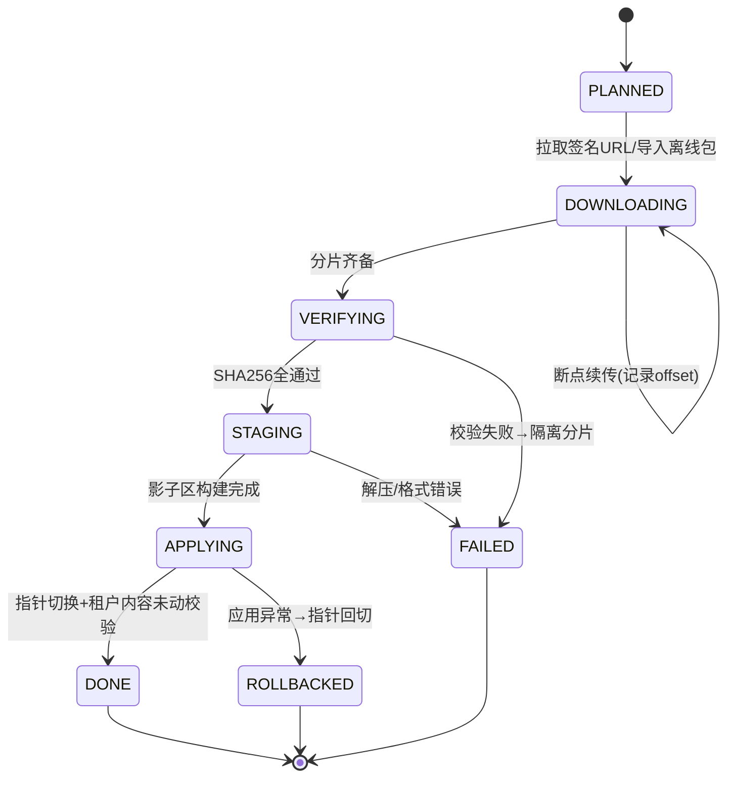

# 私有化部署交付与许可管控体系 - 详细设计文档

> 来源：《启硕-PrimeTop-全学段AI辅助学习软件项目设计文档》§10.5（V2.0 私有化部署能力）、§11.3（B 端合作：私有化或专属知识库部署方案）。
> 本文是 `B端合作与机构接入方案-详细设计.md` §10（私有化部署方案）的**交付工程深化**：B端文档定义了商业模式与接入形态，本文档将其工程化为可执行的交付物体系、许可管控、升级回滚、内容同步与远程运维方案。

## 1. 模块概述

### 1.1 设计目标

1. 提供**标准化、可离线执行**的私有化交付物（安装器 + 镜像包 + Chart + 内容种子包），使交付工程师或客户运维在无外网环境下也能完成安装、升级、回滚。
2. 建立**许可（License）全生命周期管控**：签发、硬件绑定、离线激活、宽限期、降级、吊销、续期，保护商业边界的同时保证课堂场景不中断。
3. 建立**云端内容增量同步通道**：题库、教材、知识点、Prompt 模板等平台内容可持续更新到私有实例，且不覆盖客户自建内容。
4. 建立**最小化匿名遥测与授权式远程诊断**机制，在客户信任与云端运维能力之间取得平衡。
5. 交付过程**幂等、可断点续跑、可审计**，任何失败可回退到上一个可用状态。

### 1.2 与相关文档的边界

| 文档 | 本文重叠点 | 边界约定 |
| --- | --- | --- |
| B端合作与机构接入方案 | §10 部署模式 / License payload | B端文档定义商业形态与客户旅程；本文细化交付工程。License payload 结构**向后兼容** B端 §10.4 |
| 服务端容器化与Kubernetes生产编排设计 | Helm Chart / 镜像分层 | 该文档面向云端 SaaS 集群；本文复用其镜像与 Chart 规范，仅增加私有化 values 变体与离线导入流程 |
| 服务端密钥管理与敏感配置安全策略 | 私钥/密钥保管 | 云端签名私钥托管于 KMS；私有实例密钥遵循该文档规范，本文不重复定义 |
| 数据备份与容灾策略 | 备份策略 | 私有实例备份执行该文档的策略基线，本文仅定义升级窗口内的自动备份钩子 |
| 统一回调中心与外部Webhook事件分发服务 | 事件分发 | 升级/同步事件对内走本地事件总线，跨端走该服务 |
| 服务端-统一变更数据捕获CDC管道 | 数据同步 | CDC 面向云端内部数据总线；本文的内容同步是"云端发布 → 私有实例拉取"的单向分发，不复用 CDC |
| 统一业务异常码与错误分类体系 | 错误码 | 本文新增 `DEPLOY_* / LICENSE_* / UPGRADE_* / SYNC_*` 前缀，注册进统一异常码段位 |

### 1.3 术语

| 术语 | 含义 |
| --- | --- |
| Deployment（交付实例） | 部署在客户环境的一套 PrimeTop 私有化系统，全局唯一 `deployment_id` |
| RRQ / RRN | Registration Request（激活申请码）/ Registration Response（激活响应码），离线激活往返凭证 |
| 硬件指纹 | 由目标机器多个硬件特征加权生成的绑定标识，用于 License 与实例绑定 |
| 交付包（Delivery Package） | 一次可分发版本的最小完整单元：镜像包/Chart/迁移脚本/内容种子 + 签名清单 |
| 平台命名空间 / 租户命名空间 | `platform:` 内容由云端同步并可被覆盖；`tenant:` 内容为客户自建，同步永不触碰 |
| 降级（DEGRADED） | 许可失效后的只读保护模式：可查看历史数据，禁止新的 AI 调用与写入 |

## 2. 总体架构

### 2.1 控制面与数据面分离

私有化交付采用**云端控制面（Delivery Control Plane）+ 客户数据面（On-Prem Data Plane）**架构：

- **云端控制面**：交付门户（Delivery Portal）、License 签发服务、交付制品库、内容发布通道、遥测接收。只持有实例元数据与匿名指标，**不持有学生业务数据**。
- **客户数据面**：完整业务栈（API、Worker、MySQL、Redis、MinIO、可选 ClickHouse），通过**拉取（Pull）**方式从云端获取交付包与内容更新，支持完全离线场景（人工介质导入）。

```text
┌─────────────────────────── 云端控制面 ────────────────────────────┐
│  交付门户(Delivery Portal)                                        │
│   ├─ License 签发/吊销服务        ├─ 制品库(全量/增量/内容包)      │
│   ├─ 版本通道管理(stable/patch)   ├─ 匿名遥测接收 + 实例健康看板   │
│   └─ 客户授权远程诊断网关(反向隧道出口)                            │
└──────────────▲───────────────────────────────▲───────────────────┘
               │ HTTPS 拉取(签名URL)            │ 每日匿名心跳(可关闭)
               │ RRQ/RRN 离线激活(可人工摆渡)    │ 远程诊断隧道(客户发起/限时)
┌──────────────┴───────────────────────────────┴───────────────────┐
│                        客户私有环境 (数据面)                        │
│  ┌──────────────────────────────────────────────────────────┐    │
│  │ primetop-deploy 安装器 CLI（独立二进制，不依赖业务镜像）      │    │
│  │  preflight → 离线导入 → 安装/升级/回滚 → 自检报告             │    │
│  └──────────────────────────────────────────────────────────┘    │
│  Ingress(TLS) → API Deployment(gunicorn/uvicorn) ×N              │
│               → Celery Worker ×N   → Beat(调度)                   │
│  MySQL8(主从)  Redis7(哨兵)  MinIO  [可选]ClickHouse  私有Registry │
│  AI 路由: 混合模式→云端AI网关 / 全私有→本地模型(vLLM GPU节点)       │
└──────────────────────────────────────────────────────────────────┘
```

### 2.2 部署规格档位

| 档位 | 适用 | K8s 节点 | 资源下限 | 数据库 | AI 链路 | 高可用 |
| --- | --- | --- | --- | --- | --- | --- |
| `poc` 最小验证 | POC/演示 ≤200 学生 | 单节点 Docker Compose | 8C / 16G / 200G SSD | 单实例 MySQL | 云端 AI 网关 | 无 |
| `standard` 标准 | 单校 ≤3,000 学生 | 3 节点 K8s | 每节点 16C/32G/500G | MySQL 主从 | 混合（云端网关为主，可断网降级缓存题解析） | 应用多副本 |
| `ha` 高可用 | 区域/集团 ≤50,000 学生 | ≥6 节点 + 独立 DB 节点 | 每节点 16C/64G/1T NVMe | MySQL 半同步主从 + ProxySQL | 混合 + 本地推理热备 | 全链路多副本 |
| `airgap` 全离线 | 涉密/断网环境 | ≥4 节点 + GPU 节点 | 上述 + 2×A100/H800 级 GPU | 同 ha | 本地模型（vLLM + 自备权重） | 全链路多副本 |

> `airgap` 档位下所有"云端拉取"通道替换为**离线导入命令**，其余流程不变。

### 2.3 交付流水线

```text
业务 CI ──► 镜像构建(多阶段,复用K8s文档Dockerfile) ──► 云端制品库(Harbor)
                                                        │
版本发布(Release Train) ──► 构建交付包:                                    │
  1. docker save + zstd 压缩 → images-<ver>.tar.zst  ◄───────────────────┘
  2. helm package → chart-<ver>.tgz
  3. alembic 迁移脚本 → migrations-<ver>.tar.gz
  4. 内容种子导出(题库/教材/知识点/Prompt) → content-seed-<ver>.tar.zst
  5. manifest.json(清单+SHA256+签名) → 打包为 delivery-<ver>.tar.zst
                                                        │
                              ┌─────────────────────────┴──────────────┐
                              │ 分发: 签名URL下载 / 客户介质摆渡(airgap) │
                              ▼                                        ▼
                    私有实例 primetop-deploy install/upgrade      云端升级追踪(heartbeat回执)
```

## 3. 离线交付物体系

### 3.1 交付物目录结构

```text
delivery-2.4.0/
├── manifest.json                 # 总清单：版本、最低可升级来源、各包SHA256、签名
├── installer/
│   └── primetop-deploy           # 独立静态编译二进制(Rust/Go)，无运行时依赖
├── images-2.4.0.tar.zst          # 全量镜像包(docker save | zstd -19)
├── images-2.3.2_to_2.4.0.zstd    # (增量包可选) registry blob 差分包
├── chart-primetop-2.4.0.tgz      # Helm Chart
├── migrations-2.4.0.tar.gz       # alembic versions/ + 预检脚本
├── content-seed-2.4.0.tar.zst    # 平台内容种子(首次安装用)
└── docs/
    ├── INSTALL.md                # 安装手册(含 airgap 摆渡流程)
    ├── UPGRADE.md
    └── ROLLBACK.md
```

### 3.2 manifest.json 结构与校验

```json
{
  "schema": 2,
  "package_id": "pkg_2.4.0_stable_full",
  "version": "2.4.0",
  "channel": "stable",
  "min_upgrade_from": "2.2.0",
  "created_at": "2026-08-14T09:00:00Z",
  "spec_tiers": ["standard", "ha", "airgap"],
  "artifacts": {
    "images": {"file": "images-2.4.0.tar.zst", "sha256": "e3b0c4...", "size": 6832453632},
    "chart":  {"file": "chart-primetop-2.4.0.tgz", "sha256": "a1b2c3...", "size": 48213},
    "migrations": {"file": "migrations-2.4.0.tar.gz", "sha256": "9f8e7d...", "size": 96411},
    "content_seed": {"file": "content-seed-2.4.0.tar.zst", "sha256": "5d4c3b...", "size": 1258291200}
  },
  "image_digests": {
    "primetop/server:2.4.0": "sha256:...",
    "primetop/worker:2.4.0": "sha256:..."
  },
  "breaking_notes": "2.3.x→2.4.0 需先升级至 ≥2.2.0；MySQL 8.0.30+ 必需"
}
```

清单整体由云端** RSA-3072 私钥**签名（与 License 同一密钥体系，见 §4），安装器内置公钥逐项校验 SHA256，任一不符即拒装并隔离该介质目录（写入 `local_deployment_state.last_preflight_error`）。

### 3.3 安装器 CLI

`primetop-deploy`（静态编译、单文件、支持 `--offline`）核心命令：

| 命令 | 说明 |
| --- | --- |
| `preflight --spec standard --values values.yaml` | 环境预检，输出 JSON 报告，不改动环境 |
| `install --package delivery-2.4.0/ --values values.yaml` | 全新安装（幂等，重跑从断点继续） |
| `upgrade --package delivery-2.4.0/` | 升级（详见 §5） |
| `rollback` | 回滚到上一版本（保留窗口内） |
| `license request` / `license import <rrn-file>` | 生成 RRQ / 导入 RRN（§4.3） |
| `content sync` / `content import <pkg>` | 在线拉取 / 离线导入内容（§6） |
| `doctor` | 一键体检：License、指纹、DB、队列、磁盘、时钟 |

安装主流程（幂等设计：每步落盘 `state.json`，重跑跳过已完成步骤）：

```text
preflight → 导入镜像(私有registry或docker load) → 部署数据面(MySQL/Redis/MinIO)
→ 执行DB初始化(alembic upgrade) → 安装Chart/Compose → 导入content-seed
→ 生成RRQ等待激活 → 健康自检 → 输出 INSTALL-REPORT.json
```

### 3.4 preflight 检查项

| 类别 | 检查项 | 判定 |
| --- | --- | --- |
| 硬件 | CPU 核数 / 内存 / 各挂载点可用磁盘 | ≥ 档位表下限；`/data` 预留 ≥1.5× 交付包解压空间 |
| 内核 | kernel ≥ 5.4、`vm.max_map_count≥262144`、`fs.file-max`、swap 建议 | fail / warn |
| K8s | 版本 1.26+、默认 StorageClass、`kubectl` 权限、节点 Ready、GPU 节点标签(airgap) | fail |
| 网络 | 端口占用(80/443/3306/6379/9000)、DNS 解析、NTP 时钟偏差 ≤ 90s、(在线模式)云端域名可达 | fail / warn |
| 软件 | docker ≥ 24 / containerd、Helm ≥ 3.12、MySQL 客户端、zstd | fail |
| 安全 | 未使用默认口令（installer 随机生成并单次打印）、TLS 证书存在或显式 `--insecure-demo` | fail(poc 可降级 warn) |

> 时钟偏差 > 90s 直接 fail：License 有效期与签名验证依赖系统时间，见 §11。

## 4. 许可管控体系（License）

### 4.1 License 模型（兼容并扩展 B端 §10.4 payload）

在 B端文档 payload 基础上新增字段（旧字段语义不变，老 License 仍可验证）：

```json
{
  "license_id": "LIC202608140001",
  "tenant_id": "TEN1024",
  "deployment_id": "deploy_abc123",
  "edition": "school",
  "spec_tier": "standard",
  "issued_at": 1747785600,
  "expires_at": 1779321600,
  "grace_days": 14,
  "max_students": 5000,
  "max_teachers": 200,
  "daily_ai_quota": 20000,
  "features": ["ai_tutoring", "photo_search", "mistake_book", "learning_analytics", "class_management", "openapi"],
  "model_providers": ["cloud_gateway", "local_vllm"],
  "allowed_domains": ["*.xxyizhong.edu.cn"],
  "fingerprint_policy": {"version": 2, "threshold": 0.75},
  "degradation_policy": "read_only",
  "revocation_nonce": 0
}
```

| 新增字段 | 说明 |
| --- | --- |
| `grace_days` | 到期/失联后的宽限期天数，默认 14，期间功能完整 |
| `daily_ai_quota` | 混合模式经云端网关的日调用配额；`local_vllm` 不受限 |
| `fingerprint_policy` | 硬件指纹相似度阈值，v2 算法默认 0.75 |
| `degradation_policy` | `read_only`（默认）/ `hard_stop`（涉密客户可选硬停） |
| `revocation_nonce` | 吊销计数，云端每次吊销/重签 +1，实例拒绝 nonce 回退的旧 License |

### 4.2 硬件指纹算法（v2，多因子加权 + 漂移容忍）

单因子更换（换网卡、加内存）不应导致失效，整体漂移超阈值才触发重新绑定：

```python
# installer 内置同源实现（Rust），此处为服务端等价 Python 版
import hashlib, subprocess, json

WEIGHTS = {"machine_id": 0.40, "cpu": 0.25, "root_disk_serial": 0.25, "primary_mac": 0.10}

def collect_factors() -> dict[str, str]:
    machine_id = open("/etc/machine-id").read().strip()          # OS 安装标识(云镜像重装会变)
    cpu = subprocess.run(["lscpu", "--json"], capture_output=True, text=True).stdout
    cpu_hash = hashlib.sha256(cpu.encode()).hexdigest()          # CPU 型号+核数+特性
    serial = subprocess.run(
        ["bash", "-c", "lsblk -ndo SERIAL $(findmnt -no SOURCE /)"],
        capture_output=True, text=True).stdout.strip()           # 根盘序列号
    mac = open("/sys/class/net/eth0/address").read().strip()
    return {
        "machine_id": hashlib.sha256(machine_id.encode()).hexdigest(),
        "cpu": cpu_hash[:32],
        "root_disk_serial": hashlib.sha256(serial.encode()).hexdigest()[:32],
        "primary_mac": hashlib.sha256(mac.encode()).hexdigest()[:32],
    }

def similarity(current: dict, bound: dict) -> float:
    """逐因子比对：完全一致得该因子权重，不一致得 0"""
    score = 0.0
    for k, w in WEIGHTS.items():
        if k in current and k in bound and current[k] == bound[k]:
            score += w
    return score
```

判定规则：

- `similarity ≥ threshold(0.75)` → 绑定通过（单因子更换后通常 ≥0.90）。
- `0.50 ≤ similarity < threshold` → 允许运行但每日告警，提示联系交付经理走**重绑流程**（云端核实后签发携带新指纹的 License，`revocation_nonce+1`）。
- `< 0.50`（整机迁移/克隆）→ License 拒绝，进入 DEGRADED。

### 4.3 离线激活流程（RRQ → RRN）

```text
私有实例                                云端签发服务
   │ 1. license request                       │
   │  收集: deployment_id, 指纹因子,          │
   │  版本, 申请人数, 联系人(脱敏可选)          │
   │  ──── RRQ(base64, 3DES短时效密文) ─────► │ 2. 交付门户核验:
   │                                          │  合同/指纹查重(防一码多机)/nonce
   │                                          │  RSA私钥签发 License
   │ ◄──── RRN(License文件, .lic) ─────────── │ 3. 生成签发事件(license_events)
   │ 4. license import xx.lic                 │
   │  本地公钥验签+指纹比对 → ACTIVE           │
```

- RRQ 有效期 72 小时，内含一次性随机 `request_nonce`，云端拒绝重放。
- RRN 可人工介质摆渡（打印/邮件附件），导入即完成离线激活，全程无需实例联网。

### 4.4 校验与执行

- **启动校验**：API/Worker 进程启动时加载 `.lic`，验签失败直接拒绝启动（fail-closed）。
- **定时校验**：`license_watchdog` Celery Beat 任务每 6 小时复查有效期/指纹/nonce；结果驱动状态机迁移。
- **请求拦截**：FastAPI 依赖注入 `require_license(feature)`，未授权 feature 返回 `403 LICENSE_FEATURE_DENIED`。
- **配额执行**：`daily_ai_quota` 由本地 Redis 计数（`INCR quota:ai:{yyyy-mm-dd}`，UTC+8 日切），超限返回 `429 LICENSE_QUOTA_EXCEEDED`，云端网关侧同步硬限（双保险）。

### 4.5 实例生命周期状态机



### 4.6 降级行为矩阵

| 能力 | ACTIVE | GRACE | DEGRADED(read_only) | SUSPENDED |
| --- | --- | --- | --- | --- |
| 登录与历史查看（学情/错题本/报告） | ✅ | ✅ | ✅ 只读 | ❌ 仅管理员账号 |
| 新 AI 调用（网关/本地模型） | ✅ | ✅ | ❌ `423 LICENSE_DEGRADED` | ❌ |
| 练习/答题写入 | ✅ | ✅ | ❌ | ❌ |
| 内容同步/升级 | ✅ | ✅ | ❌ | ❌ |
| 数据导出（客户自己的数据） | ✅ | ✅ | ✅ | ✅ 一次性导出通道 |

> 设计原则：**降级不锁死客户自己的数据**。DEGRADED 只停止增值计算与写入，历史数据始终可导出，符合 B端合同中的数据主权承诺。

### 4.7 核心代码

```python
# services/license_runtime.py —— 私有实例侧许可运行时
import time, base64, json
from functools import lru_cache
from cryptography.hazmat.primitives import serialization, hashes
from cryptography.hazmat.primitives.asymmetric import padding

class LicenseRuntime:
    """进程内 License 运行时：验签 + 指纹 + 状态推导（每6h由 watchdog 刷新缓存）"""

    def __init__(self, lic_path: str, fingerprint: dict, embedded_pubkey_pem: str):
        self.lic_path, self.fingerprint = lic_path, fingerprint
        self.pub = serialization.load_pem_public_key(embedded_pubkey_pem.encode())
        self._payload = None

    def load(self) -> dict:
        raw = open(self.lic_path, "rb").read().decode().strip()
        payload_b64, sig_b64 = raw.split(".")
        self.pub.verify(base64.b64decode(sig_b64), payload_b64.encode(),
                        padding.PKCS1v15(), hashes.SHA256())          # 验签失败即抛异常→拒绝启动
        p = json.loads(base64.b64decode(payload_b64))
        if p.get("revocation_nonce", 0) < self._known_nonce_floor():
            raise ValueError("LICENSE_STALE_NONCE")                    # 拒绝被吊销后的旧License
        self._payload = p
        return p

    def evaluate(self, now: float) -> tuple[str, dict]:
        p = self._payload
        sim = similarity(collect_factors() if self.fingerprint is None else self.fingerprint,
                         p["bound_factors"])
        if sim < 0.50:
            return "DEGRADED", {"reason": "FINGERPRINT_DRIFT", "similarity": sim}
        if now > p["expires_at"] + p.get("grace_days", 14) * 86400:
            return ("SUSPENDED" if p.get("degradation_policy") == "hard_stop" else "DEGRADED"), \
                   {"reason": "GRACE_EXPIRED"}
        if now > p["expires_at"]:
            return "GRACE", {"reason": "EXPIRED_IN_GRACE"}
        return "ACTIVE", {"similarity": sim}
```

```python
# api/deps/license.py —— 请求级拦截依赖
from fastapi import HTTPException, Depends

def require_license(feature: str):
    async def _dep(ctx = Depends(deployment_ctx)):
        st = ctx.license_state                       # watchdog 维护的当前状态缓存
        if st.status == "DEGRADED":
            raise HTTPException(423, "LICENSE_DEGRADED",
                headers={"Retry-After": "license-renewal"})
        if st.status == "SUSPENDED":
            raise HTTPException(423, "LICENSE_SUSPENDED")
        if feature not in st.features:
            raise HTTPException(403, "LICENSE_FEATURE_DENIED")
        if feature == "ai_tutoring" and not st.ai_quota_left:
            raise HTTPException(429, "LICENSE_QUOTA_EXCEEDED",
                headers={"X-Quota-Reset": st.quota_reset_at})
        return st
    return _dep
```

### 4.8 云端签发与吊销

- 签发服务持有 RSA 私钥（KMS 托管，遵循密钥管理文档），提供内部 API：`POST /internal/licenses/issue`、`/renew`、`/revoke`、`/rebind`，全部写 `license_events` 审计。
- 吊销分**软吊销**（`revocation_nonce+1`，心跳/同步响应中下发吊销通知，实例进入 SUSPENDED）与**合同终止**（签发 `TERMINAL` 标记 License，仅保留导出通道）。
- 一码多机防护：签发前校验同 `license_id` 已绑定指纹的 `similarity ≥ 0.5` 命中数 = 0，否则要求走重绑审批。

## 5. 版本升级与回滚

### 5.1 升级通道与兼容矩阵

| 通道 | 内容 | 节奏 |
| --- | --- | --- |
| `stable` | 全量交付包（镜像+Chart+迁移+内容） | 每季度 |
| `patch` | 仅修复版本（镜像+迁移） | 按需，含安全修复 SLA 7 天 |

- 兼容规则：`manifest.min_upgrade_from` 声明最低来源版本；**DB 迁移不允许跨大版本跳跃**，安装器检测到 `current < min_upgrade_from` 时报 `UPGRADE_PATH_TOO_OLD` 并提示逐版本升级。
- 应用代码遵循 **expand-contract**：2.4.0 的迁移只做加列/加表（expand），删除旧列必须推迟到 `min_upgrade_from ≥ 2.4.0` 的版本（contract），保证滚动升级期间新旧镜像共存可写。

### 5.2 升级流程状态机



### 5.3 关键约束

1. **升级前自动备份**：`mysqldump --single-transaction` 全量 + values/config 快照 + 旧镜像 tag 保留（`*-prev`），存于 `/data/backups/pre-2.4.0/`；备份失败则不进入 MIGRATING。
2. **回滚窗口**：VERIFYING 通过后 24h 内允许 `rollback`（expand-contract 保证旧镜像可回写）；超过窗口需走云端工单评估。
3. **滚动策略**：maxUnavailable=0、maxSurge=1，PDB 保底；Worker 先升级排空（引用优雅停机文档）再升级 API。
4. **烟雾测试**：安装器内置 15 项用例（登录、拍题、AI问答mock、错题写入、同步抽检），任一失败即 ROLLBACKING。

### 5.4 升级控制器（核心伪码）

```python
# installer/src/upgrade_controller.py
class UpgradeController:
    STEPS = ["download", "preflight", "backup", "migrate", "rollout", "verify"]

    def run(self, pkg: DeliveryPackage):
        state = self.load_state()                       # 断点续跑
        for step in self.STEPS:
            if state.done(step):
                continue
            try:
                getattr(self, f"step_{step}")(pkg)
                state.mark_done(step)
            except StepFatal as e:
                if step in ("migrate", "rollout", "verify"):
                    return self.rollback(reason=e.code)  # 自动回滚并出报告
                state.mark_failed(step, e)
                raise
        return Report(status="DONE", window_until=now() + 86400)
```

### 5.5 升级 API（私有实例管理端）

| 方法 | 路径 | 说明 |
| --- | --- | --- |
| GET | `/api/v1/admin/deployment/upgrade/check` | 返回目标版本、包大小、兼容性、预计窗口 |
| POST | `/api/v1/admin/deployment/upgrade/execute` | 触发升级（幂等键：`package_id`） |
| GET | `/api/v1/admin/deployment/upgrade/status` | 当前步骤/进度/日志游标 |
| POST | `/api/v1/admin/deployment/upgrade/rollback` | 窗口内回滚 |
| POST | `/api/v1/delivery/upgrade-report` | （回执→云端）升级结果上报 |

## 6. 云端内容增量同步

### 6.1 同步范围与命名空间

| 内容类型 | 命名空间 | 同步策略 |
| --- | --- | --- |
| 题库/题目解析 | platform | 增量追加+修订覆盖 |
| 教材/章节/知识点图谱 | platform | 版本化整体替换 |
| Prompt 模板库 | platform | 版本化替换（客户可 fork 到 tenant 覆盖） |
| 敏感词库/安全策略 | platform | 强制同步（安全优先） |
| 机构自建题/课件/校本题库 | tenant | **永不触碰**，仅本地存储 |

### 6.2 内容包结构与差分

云端每次内容发布生成 `content_manifest`（按内容类型分片，每片独立 zstd 包）：

```json
{
  "release_id": "cr_20260814_01",
  "base_release": "cr_20260701_03",
  "sections": {
    "questions": {"objects": 12580, "pack": "questions-delta.zst", "sha256": "...", "mode": "upsert"},
    "textbook_graph": {"objects": 1, "pack": "graph-full.zst", "sha256": "...", "mode": "replace"},
    "prompt_templates": {"objects": 342, "pack": "prompts-full.zst", "sha256": "...", "mode": "replace"},
    "safety_policies": {"objects": 88, "pack": "safety-delta.zst", "sha256": "...", "mode": "upsert"}
  }
}
```

- 差分只对 `upsert` 类内容：以 `(content_type, content_hash)` 为粒度，实例上报本地 `release_id`，云端返回该基线之后的 delta；基线过老（>4 个季度）返回 full 包。
- `replace` 类内容采用**版本指针切换**：新版本数据写入影子表/影子前缀（MinIO 前缀 `graph/cr_20260814_01/`），校验通过后原子更新指针，旧版本保留 2 个发布周期供回退。

### 6.3 同步任务状态机



### 6.4 同步 Worker（核心片段）

```python
# workers/content_sync.py
class ContentSyncWorker:
    def apply(self, task: SyncTask):
        release = self.fetch_manifest(task.base_release)
        for section, meta in release.sections.items():
            pack = self.download_resumable(meta.pack, meta.sha256)      # 断点续传+校验
            if meta.mode == "replace":
                shadow = self.stage_shadow(section, pack)               # 写影子区
                self.validate_shadow(shadow, expected=meta.objects)     # 行数/schema校验
                self.swap_pointer(section, release.release_id)          # 原子切换
            else:  # upsert
                with self.db.begin_nested():
                    self.upsert_rows(section, pack)                     # ON DUPLICATE KEY UPDATE
                    assert self.tenant_rows_touched(section) == 0, "SYNC_TENANT_INVASION"
        self.emit_event("content.sync.done", release.release_id)
```

- `SYNC_TENANT_INVASION` 为**熔断断言**：任何同步波及 `tenant:` 命名空间行即整体回滚该 section，并产生 P1 告警。
- 同步支持灰度：`sections` 可配置分批（先 safety_policies，再 questions），每批间隔观察错误率。

### 6.5 在线与离线双通道

- **在线**：实例凭 `deployment_token` 调 `GET /api/v1/delivery/content/manifest?base=...` 获取签名 URL（15 分钟有效），直连对象存储/CDN 下载。
- **离线（airgap）**：云端导出同结构 `content-offline-<release>.tar.zst`，客户介质摆渡后 `content import` 走同一校验与应用管线——两条通道在 `VERIFYING` 之后完全同构。

## 7. 遥测与远程运维

### 7.1 匿名遥测（每日心跳）

实例每日一次 `POST /api/v1/delivery/heartbeat`，字段经数据最小化评审（不含任何用户内容/ID）：

```json
{
  "deployment_id": "deploy_abc123",
  "version": "2.4.0",
  "content_release": "cr_20260814_01",
  "license_state": "ACTIVE",
  "metrics": {
    "dau_anonymous_bucket": "1000-3000",
    "api_p95_ms": 412, "error_rate": 0.003,
    "ai_gateway_calls": 18234, "quota_utilization": 0.91,
    "db_disk_used_gb": 312, "sync_lag_hours": 5
  },
  "events_summary": {"crash_count": 0, "sync_failures": 0}
}
```

- 遥测**可在管理端一键关闭**（`telemetry/toggle`）；关闭后云端实例看板显示 UNKNOWN，仅保留合同层面的季度人工巡检。
- 心跳同时携带 `revocation_nonce`，是云端下发软吊销/版本停止维护（EOL）通知的载体。

### 7.2 授权式远程诊断隧道

```text
客户管理员在本地管理端点击"开启远程协助(2小时)" 
→ 实例主动向云端诊断网关发起反向 TLS 隧道(类 frp, 出站-only, 客户防火墙无需开入站)
→ 云端工程师凭一次性 JWT 接入, 全部会话命令双向落审计(实例本地+云端各一份)
→ 到期自动断开; 客户可随时手动终止; 每次开启需独立授权, 不支持常驻
```

审计记录含：会话 ID、工程师 ID、每条执行命令、时长、终止原因；客户侧日志在数据导出包中一并交付，保证对等透明。

## 8. 数据结构定义

### 8.1 云端控制面（delivery 库）

```sql
CREATE TABLE deployments (
    id                  BIGINT UNSIGNED AUTO_INCREMENT PRIMARY KEY,
    deployment_id       VARCHAR(32) NOT NULL UNIQUE,
    tenant_id           VARCHAR(32) NOT NULL,
    institution_name    VARCHAR(128) NOT NULL,
    edition             VARCHAR(32) NOT NULL COMMENT 'school/district/group',
    spec_tier           VARCHAR(16) NOT NULL COMMENT 'poc/standard/ha/airgap',
    current_version     VARCHAR(32) NOT NULL DEFAULT '',
    content_release     VARCHAR(64) NOT NULL DEFAULT '',
    status              VARCHAR(16) NOT NULL DEFAULT 'REGISTERED'
                        COMMENT 'REGISTERED/ACTIVE/GRACE/DEGRADED/SUSPENDED/TERMINATED/UNKNOWN',
    bound_factors       JSON NOT NULL COMMENT '绑定的指纹因子(哈希)',
    ai_mode             VARCHAR(16) NOT NULL COMMENT 'cloud_gateway/local_vllm/hybrid',
    last_heartbeat_at   DATETIME NULL,
    telemetry_enabled   TINYINT(1) NOT NULL DEFAULT 1,
    created_at          DATETIME NOT NULL DEFAULT CURRENT_TIMESTAMP,
    updated_at          DATETIME NOT NULL DEFAULT CURRENT_TIMESTAMP ON UPDATE CURRENT_TIMESTAMP,
    UNIQUE KEY uk_tenant_deploy (tenant_id, deployment_id),
    INDEX idx_status_hb (status, last_heartbeat_at)
) ENGINE=InnoDB DEFAULT CHARSET=utf8mb4;

CREATE TABLE licenses (
    id              BIGINT UNSIGNED AUTO_INCREMENT PRIMARY KEY,
    license_id      VARCHAR(32) NOT NULL UNIQUE,
    deployment_id   VARCHAR(32) NOT NULL,
    payload         JSON NOT NULL,
    nonce           INT NOT NULL DEFAULT 0,
    status          VARCHAR(16) NOT NULL COMMENT 'issued/active/revoked/expired/terminal',
    issued_at       DATETIME NOT NULL,
    expires_at      DATETIME NOT NULL,
    revoked_at      DATETIME NULL,
    INDEX idx_deploy (deployment_id, status)
) ENGINE=InnoDB DEFAULT CHARSET=utf8mb4;

CREATE TABLE license_events (
    id              BIGINT UNSIGNED AUTO_INCREMENT PRIMARY KEY,
    license_id      VARCHAR(32) NOT NULL,
    deployment_id   VARCHAR(32) NOT NULL,
    event_type      VARCHAR(32) NOT NULL COMMENT 'issue/renew/revoke/rebind/grace_enter/degrade/suspend/terminate',
    operator_id     BIGINT UNSIGNED NOT NULL,
    detail          JSON,
    created_at      DATETIME NOT NULL DEFAULT CURRENT_TIMESTAMP,
    INDEX idx_deploy_time (deployment_id, created_at)
) ENGINE=InnoDB DEFAULT CHARSET=utf8mb4;

CREATE TABLE delivery_packages (
    id              BIGINT UNSIGNED AUTO_INCREMENT PRIMARY KEY,
    package_id      VARCHAR(64) NOT NULL UNIQUE,
    version         VARCHAR(32) NOT NULL,
    channel         VARCHAR(16) NOT NULL,
    kind            VARCHAR(16) NOT NULL COMMENT 'full/incremental/content_offline',
    min_upgrade_from VARCHAR(32) NOT NULL,
    manifest        JSON NOT NULL,
    size_bytes      BIGINT NOT NULL,
    sha256          CHAR(64) NOT NULL,
    published_at    DATETIME NOT NULL,
    INDEX idx_ver_channel (version, channel)
) ENGINE=InnoDB DEFAULT CHARSET=utf8mb4;

CREATE TABLE upgrade_records (          -- 心跳/回执汇聚的实例升级轨迹
    id              BIGINT UNSIGNED AUTO_INCREMENT PRIMARY KEY,
    deployment_id   VARCHAR(32) NOT NULL,
    package_id      VARCHAR(64) NOT NULL,
    from_version    VARCHAR(32) NOT NULL,
    to_version      VARCHAR(32) NOT NULL,
    result          VARCHAR(16) NOT NULL COMMENT 'DONE/ROLLED_BACK/FAILED',
    duration_sec    INT,
    failure_code    VARCHAR(64) NULL,
    reported_at     DATETIME NOT NULL DEFAULT CURRENT_TIMESTAMP,
    INDEX idx_deploy_time (deployment_id, reported_at)
) ENGINE=InnoDB DEFAULT CHARSET=utf8mb4;
```

### 8.2 私有实例本地表

```sql
CREATE TABLE local_deployment_state (
    id                  TINYINT UNSIGNED PRIMARY KEY DEFAULT 1,   -- 单例行
    deployment_id       VARCHAR(32) NOT NULL,
    current_version     VARCHAR(32) NOT NULL,
    previous_version    VARCHAR(32) NOT NULL DEFAULT '',
    content_release     VARCHAR(64) NOT NULL DEFAULT '',
    license_blob        MEDIUMTEXT NOT NULL,
    license_status      VARCHAR(16) NOT NULL DEFAULT 'REGISTERED',
    license_payload     JSON NULL,
    grace_deadline      DATETIME NULL,
    known_nonce_floor   INT NOT NULL DEFAULT 0,
    rollback_window_until DATETIME NULL,
    last_preflight_error TEXT NULL,
    updated_at          DATETIME NOT NULL DEFAULT CURRENT_TIMESTAMP ON UPDATE CURRENT_TIMESTAMP,
    CHECK (id = 1)
) ENGINE=InnoDB DEFAULT CHARSET=utf8mb4;

CREATE TABLE content_sync_tasks (
    id              BIGINT UNSIGNED AUTO_INCREMENT PRIMARY KEY,
    release_id      VARCHAR(64) NOT NULL,
    base_release    VARCHAR(64) NOT NULL,
    channel         VARCHAR(16) NOT NULL COMMENT 'online/offline_import',
    status          VARCHAR(16) NOT NULL DEFAULT 'PLANNED',
    progress        DECIMAL(5,2) NOT NULL DEFAULT 0,
    error_code      VARCHAR(64) NULL,
    idempotency_key VARCHAR(128) UNIQUE,
    created_at      DATETIME NOT NULL DEFAULT CURRENT_TIMESTAMP,
    finished_at     DATETIME NULL,
    INDEX idx_release (release_id, status)
) ENGINE=InnoDB DEFAULT CHARSET=utf8mb4;

CREATE TABLE content_sync_items (
    id              BIGINT UNSIGNED AUTO_INCREMENT PRIMARY KEY,
    task_id         BIGINT UNSIGNED NOT NULL,
    section         VARCHAR(32) NOT NULL,
    object_count    INT NOT NULL,
    status          VARCHAR(16) NOT NULL COMMENT 'PENDING/VERIFIED/APPLIED/FAILED/ROLLED_BACK',
    sha256          CHAR(64) NOT NULL,
    applied_at      DATETIME NULL,
    INDEX idx_task (task_id, section)
) ENGINE=InnoDB DEFAULT CHARSET=utf8mb4;

CREATE TABLE quota_counters (
    id              BIGINT UNSIGNED AUTO_INCREMENT PRIMARY KEY,
    quota_key       VARCHAR(64) NOT NULL COMMENT 'ai:2026-08-14',
    used            INT NOT NULL DEFAULT 0,
    limit_value     INT NOT NULL,
    UNIQUE KEY uk_key (quota_key)
) ENGINE=InnoDB DEFAULT CHARSET=utf8mb4;
```

> Redis 中的 `quota:ai:{date}` 为热计数，DB `quota_counters` 为对账持久层（每日心跳上报用量）。

## 9. API 接口设计

### 9.1 云端交付 API（网关域 `delivery.primetop.cn`）

| 方法 | 路径 | 鉴权 | 说明 |
| --- | --- | --- | --- |
| POST | `/api/v1/delivery/rrq` | deployment_token | 提交激活申请，返回受理号 |
| POST | `/api/v1/delivery/rrn` | 交付门户操作员 | 签发 License（内部审批流） |
| GET | `/api/v1/delivery/packages/latest?channel=stable&kind=full` | deployment_token | 最新交付包清单+签名URL |
| GET | `/api/v1/delivery/content/manifest?base=cr_20260701_03` | deployment_token | 内容差分清单 |
| POST | `/api/v1/delivery/heartbeat` | deployment_token | 匿名心跳/吊销通知载体 |
| POST | `/api/v1/delivery/upgrade-report` | deployment_token | 升级结果回执 |
| POST | `/api/v1/delivery/rebind-request` | deployment_token | 指纹重绑申请（附相似度报告） |

### 9.2 私有实例管理 API（机构管理员，走本地管理端）

| 方法 | 路径 | 说明 |
| --- | --- | --- |
| GET | `/api/v1/admin/deployment/status` | 版本/License状态/配额/同步水位/回滚窗口 |
| POST | `/api/v1/admin/deployment/license/activate-request` | 生成 RRQ 文件 |
| POST | `/api/v1/admin/deployment/license/import` | 上传 `.lic` 完成激活/续期 |
| POST | `/api/v1/admin/deployment/content-sync/trigger` | 触发在线同步（幂等键 `release_id`） |
| POST | `/api/v1/admin/deployment/content-sync/import` | 上传离线内容包 |
| POST | `/api/v1/admin/deployment/telemetry/toggle` | 开关匿名遥测 |
| POST | `/api/v1/admin/deployment/remote-assistance/open` | 开启限时远程协助隧道 |

响应统一遵循《服务端统一响应封装与分页查询规范》，错误码注册如下。

### 9.3 错误码表（注册进统一异常码体系）

| 错误码 | HTTP | 说明 | 处置 |
| --- | --- | --- | --- |
| `DEPLOY_PREFLIGHT_FAILED` | 409 | 预检不通过（detail 列出检查项） | 按 INSTALL.md 修复后重跑 |
| `DEPLOY_MANIFEST_INVALID` | 422 | 交付包签名/哈希校验失败 | 更换介质，隔离受损包 |
| `LICENSE_FINGERPRINT_DRIFT` | 403 | 指纹相似度 < 0.50 | 走 rebind 流程 |
| `LICENSE_STALE_NONCE` | 403 | 使用被吊销前的旧 License | 联系交付经理 |
| `LICENSE_FEATURE_DENIED` | 403 | 未授权功能模块 | 商务扩容 |
| `LICENSE_QUOTA_EXCEEDED` | 429 | 日 AI 配额耗尽 | 次日重置或扩容 |
| `LICENSE_DEGRADED` / `LICENSE_SUSPENDED` | 423 | 降级/停用状态 | 续期 |
| `UPGRADE_PATH_TOO_OLD` | 409 | 版本跨度过大 | 逐版本升级 |
| `UPGRADE_BACKUP_FAILED` | 500 | 升级前备份失败 | 检查磁盘/权限后重试 |
| `SYNC_TENANT_INVASION` | 500 | 同步波及租户命名空间（熔断） | 立即告警云端排查 |
| `SYNC_HASH_MISMATCH` | 422 | 内容分片校验失败 | 重新下载/换介质 |
| `HEARTBEAT_CLOCK_SKEW` | 400 | 时钟偏差 > 90s | 校准 NTP |

## 10. 错误处理与异常场景汇总

| 场景 | 检测点 | 行为 |
| --- | --- | --- |
| 客户环境时钟漂移 | preflight / 心跳 | preflight fail；运行期心跳 400，License 状态机不迁移（防人为拨表续命，宽限期以云端签发时间为锚） |
| 断网期间 License 到期 | watchdog 本地评估 | 进入 GRACE → DEGRADED（本地自治，不依赖云端） |
| 硬件更换导致指纹漂移 | watchdog 相似度 | ≥0.75 通过；0.5~0.75 告警续跑；<0.5 DEGRADED + rebind |
| 升级中断电/断网 | 安装器 state.json | 重跑 `upgrade` 从断点续跑；MIGRATING 阶段中断靠 alembic 版本表幂等 |
| 内容包下载中断 | 分片 offset 记录 | 断点续传；同一 release 幂等 |
 | 同步后业务异常 | 灰度批次观察 + 回退 | 指针回切上一 content_release（保留 2 周期） |
| 一码多机（克隆虚拟机） | 云端签发查重 + 实例端相似度 | 拒绝激活 / DEGRADED |
| 云端 AI 网关不可达（混合模式） | 网关健康检查 | 按《AI 模型调用容灾降级》文档降级到本地缓存解析与排队，状态页明示 |
| 遥测关闭的实例失联 | 云端看板 | 标记 UNKNOWN，触发合同层面人工巡检工单 |

## 11. 安全加固基线

1. 安装器生成的所有默认口令随机化并**仅单次打印**，首次登录强制改密；`--insecure-demo` 仅限 poc 档且界面持续水印。
2. 实例对外仅暴露 443（Ingress TLS）；MySQL/Redis/MinIO 全部内网监听，K8s NetworkPolicy 默认拒绝跨命名空间。
3. `.lic` 文件权限 `0600`，属主为服务账号；License blob 在备份快照中加密（引用密钥管理文档信封加密方案）。
4. 交付包介质建议客户侧留存校验记录（manifest SHA256），防调包。
5. 远程协助隧道出站-only、一次性 JWT、全程审计、默认 2 小时上限（§7.2）。

## 12. 验收标准（DoD）

1. `standard` 档全新环境：preflight → 可用 ≤ 60 分钟（含镜像导入）；airgap 档 ≤ 120 分钟。
2. RRQ→RRN 离线激活全流程在完全断网环境完成，激活后 `doctor` 全绿。
3. 模拟单因子更换（换网卡）：License 仍 ACTIVE；模拟整机克隆：第二台机器激活被拒绝。
4. 到期不续费：GRACE 期内功能完整；宽限耗尽后 DEGRADED，历史数据可导出，AI 调用返回 423。
5. stable 升级 2.3.2→2.4.0：滚动升级 ≤ 30 分钟，烟雾测试注入故障后 10 分钟内自动回滚至可用。
6. 内容同步：kill -9 中断后重跑可续传；同步后 `tenant:` 命名空间行数零变化（自动断言）。
7. 遥测开关即时生效；关闭后抓包确认无任何出站遥测流量（仅保留客户主动发起的操作通道）。

## 13. 里程碑建议

| 阶段 | 内容 | 依赖 |
| --- | --- | --- |
| M1（4 周） | 交付包构建 + 安装器 preflight/install + License v2（含指纹） | K8s 文档镜像规范、密钥管理 |
| M2（3 周） | RRQ/RRN 离线激活 + 状态机 + 降级中间件 | 统一异常码注册 |
| M3（3 周） | 升级/回滚控制器 + upgrade_records 回执 | 数据备份基线 |
| M4（3 周） | 内容增量同步双通道 + 租户隔离断言 | 内容服务数据模型 |
| M5（2 周） | 遥测心跳 + 远程诊断隧道 + 交付门户看板 | 审计日志规范 |
