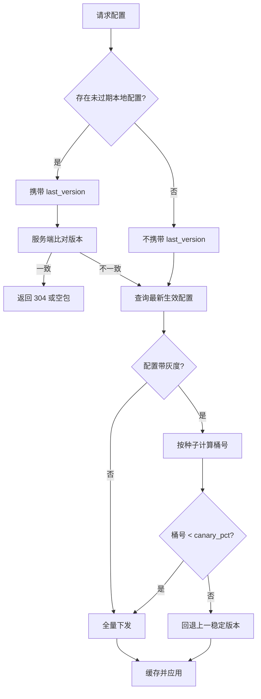

# 移动端信息架构与导航配置服务 - 详细设计

## 1. 模块定位与目标

### 1.1 定位

移动端信息架构与导航配置服务负责定义 PrimeTop App 的**页面层级、入口编排、底部/顶部导航、路由注册、深链接映射与功能门控策略**，并支持通过远程配置实现不同学段、角色、会员等级、家长管控状态下的动态信息架构。

该服务连接客户端路由框架、后台运营配置、A/B 实验平台与权限/门控引擎，是 App 首页、工作台、AI 辅导、同步学习、错题/计划、我的五大一级入口的统一编排中心。

### 1.2 目标

1. 统一描述 App 的页面树、底部导航、快捷入口、首页卡片、弹窗入口等信息架构。
2. 提供远程动态配置能力，支持运营在不停发版本的情况下调整首页入口、底部 Tab、弹窗策略与功能可见性。
3. 与权限、会员、家长管控、学段年级等门控规则联动，实现“同一份配置，千人千面”。
4. 保证路由与深链接可寻址、可回退、可鉴权，支持从推送、分享、Web、小程序唤起指定页面。
5. 建立信息架构版本管理与灰度发布能力，避免配置错误导致大规模 crash 或页面不可达。

### 1.3 设计依据

- 总体设计文档 §9.1 设计原则、§9.2 信息架构建议、§9.3 首页交互设计、§9.4 AI 对话页交互设计、§9.6 分龄 UI 策略。
- 关联文档：
  - `客户端路由与深链接系统-详细设计.md`
  - `客户端-底部导航栏与App主框架Shell架构设计-详细设计.md`
  - `服务端-教育平台流量入口统一配置与可编排页面渲染引擎-详细设计.md`
  - `用户额度管控与功能门控引擎-详细设计.md`
  - `客户端-学习内容统一卡片系统与智能渲染引擎-详细设计.md`

## 2. 核心概念与术语

| 术语 | 英文 | 含义 |
| --- | --- | --- |
| 信息架构 | Information Architecture, IA | App 页面、入口、导航、层级的结构化定义 |
| 导航节点 | NavNode | 信息架构中的最小单元，对应一个可跳转目标（页面/功能/外部链接） |
| 底部导航 | BottomNav | App 主框架底部常驻 Tab 栏 |
| 首页工作台 | HomeWorkbench | 学生登录后的首屏，由顶部区、快捷入口、今日任务、薄弱点提醒等组成 |
| 功能门控 | Feature Gate | 根据用户状态决定某个入口/页面是否可见、可点击 |
| 深链接 | DeepLink | 通过 scheme 或 universal link 直接唤起指定页面的能力 |
| 路由注册表 | RouteRegistry | 客户端所有命名路由及其元信息的注册集合 |
| 配置包 | NavigationConfig | 服务端下发的完整信息架构配置，含版本、生效人群、页面/导航/门控 |
| 灰度包 | ConfigCanary | 用于小流量验证的新版本配置，支持按设备/用户/学区投放 |

## 3. 数据结构设计

### 3.1 领域模型

#### 3.1.1 导航节点（NavNode）

```json
{
  "nodeId": "home_quick_photo_question",
  "nodeType": "ACTION",
  "scope": "STUDENT",
  "minStage": "PRIMARY",
  "maxStage": "HIGH",
  "routeName": "/study/photoQuestion",
  "deeplink": "primetop://study/photoQuestion?entry=home",
  "icon": "icon_camera_48",
  "title": "拍题答疑",
  "subtitle": "拍照即得思路",
  "priority": 100,
  "badgeRule": "mistake_review_pending",
  "gates": ["feature.photo_question.enabled", "user.age>=7"],
  "abTestKey": "home_v3_camera_button",
  "meta": {
    "analyticsPage": "Home_PhotoQuestion",
    "entranceSource": "home_quick"
  }
}
```

字段说明：

| 字段 | 类型 | 必填 | 说明 |
| --- | --- | --- | --- |
| nodeId | String | 是 | 全局唯一标识，英文小写下划线 |
| nodeType | Enum | 是 | PAGE / TAB / ACTION / GROUP / EXTERNAL / H5 |
| scope | Enum | 是 | STUDENT / PARENT / TEACHER / ADMIN / ALL |
| minStage | Enum | 否 | 最低学段：PRESCHOOL / PRIMARY / JUNIOR / HIGH |
| maxStage | Enum | 否 | 最高学段 |
| routeName | String | 否 | 客户端路由名，PAGE/ACTION 必填 |
| deeplink | String | 否 | 标准 scheme，唤起目标 |
| icon | String | 否 | 图标资源 key |
| title | I18nText | 是 | 多语言文案 |
| subtitle | I18nText | 否 | 副标题 |
| priority | Int | 是 | 排序权重，越大越靠前 |
| badgeRule | String | 否 | 角标数据源 key |
| gates | String[] | 否 | 门控表达式列表，全部满足才展示 |
| abTestKey | String | 否 | 关联 A/B 实验 key |
| meta | Map | 否 | 扩展字段，埋点、运营标签等 |

#### 3.1.2 底部导航配置（BottomNavConfig）

```json
{
  "configId": "bottom_nav_student_default_v3",
  "version": 3,
  "scope": "STUDENT",
  "items": [
    {
      "nodeId": "tab_home",
      "routeName": "/main/home",
      "iconDefault": "tab_home_off",
      "iconActive": "tab_home_on",
      "title": "首页"
    },
    {
      "nodeId": "tab_ai",
      "routeName": "/main/ai",
      "iconDefault": "tab_ai_off",
      "iconActive": "tab_ai_on",
      "title": "AI辅导"
    },
    {
      "nodeId": "tab_study",
      "routeName": "/main/study",
      "iconDefault": "tab_study_off",
      "iconActive": "tab_study_on",
      "title": "同步学习"
    },
    {
      "nodeId": "tab_mistake",
      "routeName": "/main/mistake",
      "badgeRule": "mistake.today_review_count",
      "title": "错题"
    },
    {
      "nodeId": "tab_profile",
      "routeName": "/main/profile",
      "title": "我的"
    }
  ]
}
```

#### 3.1.3 首页工作台配置（HomeWorkbenchConfig）

```json
{
  "configId": "home_student_primary_v3",
  "version": 3,
  "scope": "STUDENT",
  "stage": "PRIMARY",
  "sections": [
    {
      "sectionType": "HEADER",
      "nodes": ["home_user_header"]
    },
    {
      "sectionType": "QUICK_ACTIONS",
      "layout": "GRID_4",
      "nodes": [
        "home_quick_photo_question",
        "home_quick_ask_ai",
        "home_quick_sync_class",
        "home_quick_mistake_review"
      ]
    },
    {
      "sectionType": "DAILY_TASKS",
      "nodes": ["home_today_tasks"]
    },
    {
      "sectionType": "WEAK_POINTS",
      "nodes": ["home_weak_points"]
    },
    {
      "sectionType": "CONTINUE_LEARNING",
      "nodes": ["home_continue_learning"]
    }
  ]
}
```

#### 3.1.4 路由注册表条目（RouteRegistryEntry）

```json
{
  "routeName": "/study/photoQuestion",
  "pattern": "/study/photoQuestion",
  "pageClass": "PhotoQuestionPage",
  "module": "study",
  "transition": "bottomSheet",
  "requiresAuth": true,
  "allowedRoles": ["STUDENT"],
  "allowedStages": ["PRIMARY", "JUNIOR", "HIGH"],
  "paramsSchema": {
    "entry": { "type": "string", "required": true },
    "subject": { "type": "string", "required": false }
  },
  "deeplinkAlias": ["primetop://study/photoQuestion"],
  "fallbackRoute": "/main/home"
}
```

#### 3.1.5 深链接映射（DeepLinkMapping）

```json
{
  "scheme": "primetop",
  "host": "study",
  "path": "/photoQuestion",
  "routeName": "/study/photoQuestion",
  "paramMapping": {
    "entry": "entry",
    "subject": "subject"
  },
  "verifySignature": false,
  "allowExternal": true
}
```

#### 3.1.6 门控表达式（FeatureGateExpression）

门控表达式采用字符串形式，由客户端或 BFF 解释执行：

```
feature.photo_question.enabled && user.age >= 7 && !parent_control.block_photo
```

支持的操作符：

| 操作符 | 含义 |
| --- | --- |
| `==` / `!=` | 等于 / 不等于 |
| `>` / `<` / `>=` / `<=` | 数值比较 |
| `&&` / `\|\|` | 与 / 或 |
| `!` | 非 |
| `in` | 集合包含，如 `user.stage in ['PRIMARY','JUNIOR']` |
| `hasRole` | 角色判断 |

### 3.2 数据库表结构

采用 MySQL 存储主配置，Redis 缓存用户个性化配置包。

#### 3.2.1 信息架构配置主表（ia_config）

```sql
CREATE TABLE ia_config (
    id              BIGINT AUTO_INCREMENT PRIMARY KEY,
    config_id       VARCHAR(128) NOT NULL COMMENT '业务配置ID',
    config_type     VARCHAR(32)  NOT NULL COMMENT 'BOTTOM_NAV/HOME_WORKBENCH/ROUTE_REGISTRY/DEEPLINK/GATE_RULE',
    version         INT          NOT NULL DEFAULT 1,
    scope           VARCHAR(32)  NOT NULL COMMENT 'STUDENT/PARENT/TEACHER/ADMIN/ALL',
    stage           VARCHAR(32)  DEFAULT NULL COMMENT '学段限定，NULL 表示全学段',
    payload         JSON         NOT NULL COMMENT '配置 JSON',
    status          VARCHAR(16)  NOT NULL DEFAULT 'DRAFT' COMMENT 'DRAFT/PUBLISHED/ARCHIVED',
    canary_pct      INT          DEFAULT 0 COMMENT '灰度百分比，0=全量，1-99=灰度',
    canary_seed     VARCHAR(64)  DEFAULT NULL COMMENT '灰度分桶种子字段',
    effective_from  DATETIME     NOT NULL,
    effective_to    DATETIME     DEFAULT '2099-12-31 23:59:59',
    created_by      BIGINT       NOT NULL,
    created_at      DATETIME     NOT NULL DEFAULT CURRENT_TIMESTAMP,
    updated_at      DATETIME     NOT NULL DEFAULT CURRENT_TIMESTAMP ON UPDATE CURRENT_TIMESTAMP,
    UNIQUE KEY uk_config_scope_stage_version (config_id, scope, stage, version),
    KEY idx_status_effective (status, effective_from, effective_to)
) ENGINE=InnoDB DEFAULT CHARSET=utf8mb4 COLLATE=utf8mb4_unicode_ci COMMENT='信息架构配置主表';
```

#### 3.2.2 导航节点定义表（ia_nav_node）

```sql
CREATE TABLE ia_nav_node (
    id              BIGINT AUTO_INCREMENT PRIMARY KEY,
    node_id         VARCHAR(128) NOT NULL,
    node_type       VARCHAR(32)  NOT NULL,
    scope           VARCHAR(32)  NOT NULL,
    min_stage       VARCHAR(32)  DEFAULT NULL,
    max_stage       VARCHAR(32)  DEFAULT NULL,
    route_name      VARCHAR(256) DEFAULT NULL,
    deeplink        VARCHAR(512) DEFAULT NULL,
    title_i18n      JSON         NOT NULL,
    subtitle_i18n   JSON         DEFAULT NULL,
    priority        INT          NOT NULL DEFAULT 0,
    badge_rule      VARCHAR(128) DEFAULT NULL,
    gates           JSON         DEFAULT NULL COMMENT '门控表达式数组',
    ab_test_key     VARCHAR(128) DEFAULT NULL,
    meta            JSON         DEFAULT NULL,
    status          VARCHAR(16)  NOT NULL DEFAULT 'ACTIVE',
    created_at      DATETIME     NOT NULL DEFAULT CURRENT_TIMESTAMP,
    updated_at      DATETIME     NOT NULL DEFAULT CURRENT_TIMESTAMP ON UPDATE CURRENT_TIMESTAMP,
    UNIQUE KEY uk_node_id (node_id),
    KEY idx_scope_status (scope, status)
) ENGINE=InnoDB DEFAULT CHARSET=utf8mb4 COLLATE=utf8mb4_unicode_ci COMMENT='导航节点定义';
```

#### 3.2.3 路由注册表（ia_route_registry）

```sql
CREATE TABLE ia_route_registry (
    id              BIGINT AUTO_INCREMENT PRIMARY KEY,
    route_name      VARCHAR(256) NOT NULL,
    pattern         VARCHAR(256) NOT NULL,
    page_class      VARCHAR(128) NOT NULL,
    module          VARCHAR(64)  NOT NULL,
    transition      VARCHAR(32)  DEFAULT 'native',
    requires_auth   TINYINT      NOT NULL DEFAULT 1,
    allowed_roles   JSON         DEFAULT NULL,
    allowed_stages  JSON         DEFAULT NULL,
    params_schema   JSON         DEFAULT NULL,
    deeplink_alias  JSON         DEFAULT NULL,
    fallback_route  VARCHAR(256) DEFAULT '/main/home',
    status          VARCHAR(16)  NOT NULL DEFAULT 'ACTIVE',
    created_at      DATETIME     NOT NULL DEFAULT CURRENT_TIMESTAMP,
    updated_at      DATETIME     NOT NULL DEFAULT CURRENT_TIMESTAMP ON UPDATE CURRENT_TIMESTAMP,
    UNIQUE KEY uk_route_name (route_name),
    KEY idx_pattern (pattern)
) ENGINE=InnoDB DEFAULT CHARSET=utf8mb4 COLLATE=utf8mb4_unicode_ci COMMENT='路由注册表';
```

#### 3.2.4 深链接映射表（ia_deeplink_mapping）

```sql
CREATE TABLE ia_deeplink_mapping (
    id              BIGINT AUTO_INCREMENT PRIMARY KEY,
    scheme          VARCHAR(32)  NOT NULL DEFAULT 'primetop',
    host            VARCHAR(64)  NOT NULL,
    path            VARCHAR(256) NOT NULL,
    route_name      VARCHAR(256) NOT NULL,
    param_mapping   JSON         NOT NULL,
    verify_signature TINYINT     NOT NULL DEFAULT 0,
    allow_external  TINYINT      NOT NULL DEFAULT 1,
    status          VARCHAR(16)  NOT NULL DEFAULT 'ACTIVE',
    created_at      DATETIME     NOT NULL DEFAULT CURRENT_TIMESTAMP,
    updated_at      DATETIME     NOT NULL DEFAULT CURRENT_TIMESTAMP ON UPDATE CURRENT_TIMESTAMP,
    UNIQUE KEY uk_scheme_host_path (scheme, host, path),
    KEY idx_route (route_name)
) ENGINE=InnoDB DEFAULT CHARSET=utf8mb4 COLLATE=utf8mb4_unicode_ci COMMENT='深链接映射表';
```

#### 3.2.5 用户配置快照（ia_user_navigation_snapshot）

```sql
CREATE TABLE ia_user_navigation_snapshot (
    id              BIGINT AUTO_INCREMENT PRIMARY KEY,
    user_id         BIGINT       NOT NULL,
    role            VARCHAR(32)  NOT NULL,
    stage           VARCHAR(32)  NOT NULL,
    config_hash     VARCHAR(64)  NOT NULL COMMENT '下发配置包哈希',
    resolved_config JSON         NOT NULL COMMENT '解析后的最终配置',
    gates_context   JSON         NOT NULL COMMENT '门控评估上下文',
    created_at      DATETIME     NOT NULL DEFAULT CURRENT_TIMESTAMP,
    updated_at      DATETIME     NOT NULL DEFAULT CURRENT_TIMESTAMP ON UPDATE CURRENT_TIMESTAMP,
    UNIQUE KEY uk_user_role (user_id, role),
    KEY idx_config_hash (config_hash)
) ENGINE=InnoDB DEFAULT CHARSET=utf8mb4 COLLATE=utf8mb4_unicode_ci COMMENT='用户导航配置快照';
```

#### 3.2.6 导航事件日志表（ClickHouse）

```sql
CREATE TABLE ia_navigation_event_log (
    event_time      DateTime64(3),
    user_id         UInt64,
    device_id       String,
    session_id      String,
    event_type      LowCardinality(String) COMMENT 'tab_switch/deeplink_open/route_fail/config_load/feature_blocked',
    node_id         String,
    route_name      String,
    deeplink        String,
    from_route      String,
    to_route        String,
    config_version  Int32,
    error_code      Nullable(String),
    latency_ms      UInt32,
    payload         String
) ENGINE = MergeTree()
PARTITION BY toYYYYMMDD(event_time)
ORDER BY (user_id, event_time)
TTL event_time + INTERVAL 180 DAY;
```

### 3.3 Redis 缓存设计

| Key | 类型 | TTL | 说明 |
| --- | --- | --- | --- |
| `ia:config:{config_id}:v{version}` | String | 24h | 全局配置包 |
| `ia:user:{user_id}:nav` | String | 1h | 用户解析后的导航配置 |
| `ia:user:{user_id}:routes` | Hash | 1h | 用户可见路由白名单 |
| `ia:gate:eval:{hash}` | String | 5m | 门控表达式结果缓存 |
| `ia:config:hash:{hash}` | String | 24h | 配置内容去重缓存 |
| `ia:canary:{config_id}:v{version}` | Set | 24h | 灰度命中用户 ID 集合（兜底） |

## 4. API 接口设计

### 4.1 获取用户导航配置

**GET** `/api/v1/navigation/config`

请求头：

```http
Authorization: Bearer {access_token}
X-App-Version: 3.2.1
X-Platform: ios
X-Device-Id: A1B2C3D4
```

Query 参数：

| 参数 | 类型 | 必填 | 说明 |
| --- | --- | --- | --- |
| role | String | 是 | STUDENT / PARENT / TEACHER |
| stage | String | 否 | 学段 |
| subject | String | 否 | 当前学科 |
| ab_test_tags | String | 否 | A/B 分组 tag，逗号分隔 |
| last_version | Int | 否 | 客户端本地配置版本 |

响应 200：

```json
{
  "code": 0,
  "data": {
    "configVersion": 3,
    "configHash": "a1b2c3d4",
    "effectiveFrom": "2026-08-22T00:00:00Z",
    "bottomNav": { ... },
    "homeWorkbench": { ... },
    "routeRegistry": [ ... ],
    "deeplinkMappings": [ ... ],
    "gateContext": {
      "features": { "photo_question.enabled": true },
      "parentControls": { "block_photo": false },
      "membership": { "level": "PLUS" }
    },
    "diff": null
  }
}
```

当 `last_version` 与服务器一致且用户上下文未变时，返回 304 或带空 data：

```json
{
  "code": 0,
  "data": null,
  "message": "config_not_modified"
}
```

错误码：

| 错误码 | 含义 | HTTP 状态 |
| --- | --- | --- |
| 52000 | 导航配置不存在 | 404 |
| 52001 | 参数角色非法 | 400 |
| 52002 | A/B tag 解析失败 | 400 |
| 52003 | 配置灰度冲突 | 409 |
| 52004 | 配置版本已回滚 | 410 |

### 4.2 批量获取路由定义

**POST** `/api/v1/navigation/routes/resolve`

用于客户端按需解析一组 routeName 对应的完整元数据。

请求体：

```json
{
  "routeNames": [
    "/study/photoQuestion",
    "/study/chapterDetail"
  ]
}
```

响应 200：

```json
{
  "code": 0,
  "data": {
    "routes": [
      {
        "routeName": "/study/photoQuestion",
        "pageClass": "PhotoQuestionPage",
        "transition": "bottomSheet",
        "requiresAuth": true,
        "allowedRoles": ["STUDENT"],
        "paramsSchema": { ... }
      }
    ],
    "unresolved": []
  }
}
```

### 4.3 导航行为事件上报

**POST** `/api/v1/navigation/event`

请求体：

```json
{
  "eventType": "tab_switch",
  "nodeId": "tab_ai",
  "fromRoute": "/main/home",
  "toRoute": "/main/ai",
  "configVersion": 3,
  "timestamp": 1692643200000,
  "sessionId": "sess_abc123"
}
```

错误码：

| 错误码 | 含义 |
| --- | --- |
| 52010 | event_type 非法 |
| 52011 | 时间戳超出允许窗口 |
| 52012 | session_id 格式非法 |

### 4.4 管理后台配置接口

#### 4.4.1 创建/更新配置

**POST** `/admin/api/v1/navigation/config`

请求体：

```json
{
  "configId": "bottom_nav_student_default_v3",
  "configType": "BOTTOM_NAV",
  "scope": "STUDENT",
  "stage": null,
  "payload": { ... },
  "canaryPct": 5,
  "canarySeed": "device_id",
  "effectiveFrom": "2026-08-22T08:00:00Z"
}
```

响应：

```json
{
  "code": 0,
  "data": { "version": 3, "status": "DRAFT" }
}
```

#### 4.4.2 发布配置

**POST** `/admin/api/v1/navigation/config/{configId}/publish`

请求体：

```json
{
  "version": 3,
  "force": false
}
```

发布前执行以下校验：

1. routeName 必须在路由注册表中存在。
2. deeplink 不能重复。
3. 所有引用的 nodeId 必须在 nav_node 表中存在。
4. 灰度百分比合法。

#### 4.4.3 回滚配置

**POST** `/admin/api/v1/navigation/config/{configId}/rollback`

请求体：

```json
{
  "toVersion": 2
}
```

### 4.5 gRPC 内部接口（可选）

```protobuf
syntax = "proto3";
package primetop.ia.v1;

service NavigationService {
  rpc GetConfig(GetConfigRequest) returns (NavigationConfig);
  rpc ResolveRoutes(ResolveRoutesRequest) returns (ResolveRoutesResponse);
  rpc CheckRouteAccess(CheckRouteAccessRequest) returns (CheckRouteAccessResponse);
}

message GetConfigRequest {
  int64 user_id = 1;
  string role = 2;
  string stage = 3;
  string device_id = 4;
  int32 last_version = 5;
}

message CheckRouteAccessRequest {
  int64 user_id = 1;
  string route_name = 2;
  map<string, string> params = 3;
}

message CheckRouteAccessResponse {
  bool allowed = 1;
  string fallback_route = 2;
  string block_reason = 3;
}
```

## 5. 关键代码示例

### 5.1 客户端：动态路由表生成（Flutter）

```dart
class AppRouteRegistry {
  static final Map<String, RouteBuilder> _routes = {};

  static void register(RouteRegistryEntry entry, RouteBuilder builder) {
    _routes[entry.routeName] = builder;
  }

  static RouteBuilder? resolve(String routeName) {
    return _routes[routeName];
  }

  static bool isRegistered(String routeName) {
    return _routes.containsKey(routeName);
  }
}

abstract class RouteBuilder {
  Widget build(BuildContext context, Map<String, String> params);
}

class NavigationResolver {
  final FeatureGateEvaluator _gateEvaluator;
  NavigationResolver(this._gateEvaluator);

  List<NavNode> resolveVisibleNodes(
    List<NavNode> nodes,
    UserContext ctx,
  ) {
    return nodes.where((node) {
      final stageOk = _matchStage(node, ctx.stage);
      final scopeOk = node.scope == 'ALL' || node.scope == ctx.role;
      final gatesOk = _gateEvaluator.evaluateAll(node.gates, ctx);
      return stageOk && scopeOk && gatesOk;
    }).toList();
  }

  bool _matchStage(NavNode node, String stage) {
    if (node.minStage != null && _stageRank(stage) < _stageRank(node.minStage!)) {
      return false;
    }
    if (node.maxStage != null && _stageRank(stage) > _stageRank(node.maxStage!)) {
      return false;
    }
    return true;
  }

  int _stageRank(String stage) {
    const ranks = {'PRESCHOOL': 0, 'PRIMARY': 1, 'JUNIOR': 2, 'HIGH': 3};
    return ranks[stage] ?? -1;
  }
}
```

### 5.2 客户端：底部导航构建

```dart
class BottomNavBuilder {
  final BottomNavConfig config;
  final NavigationResolver resolver;
  BottomNavBuilder({required this.config, required this.resolver});

  BottomNavigationBar build(BuildContext context, int currentIndex) {
    final visibleItems = resolver.resolveVisibleNodes(
      config.items.map((e) => NavNode.fromJson(e.toJson())).toList(),
      UserContext.of(context),
    );
    return BottomNavigationBar(
      currentIndex: currentIndex,
      type: BottomNavigationBarType.fixed,
      onTap: (index) => _onTabTap(context, visibleItems[index]),
      items: visibleItems.map((node) {
        return BottomNavigationBarItem(
          icon: Icon(IconFont.byKey(node.icon)),
          activeIcon: Icon(IconFont.byKey('${node.icon}_active')),
          label: node.title,
        );
      }).toList(),
    );
  }

  void _onTabTap(BuildContext context, NavNode node) {
    NavigationEventReporter.tabSwitch(node.nodeId, node.routeName);
    Navigator.of(context).pushReplacementNamed(node.routeName);
  }
}
```

### 5.3 客户端：深链接处理

```dart
class DeepLinkHandler {
  final RouteRegistry registry;
  DeepLinkHandler(this.registry);

  Future<void> handle(Uri link) async {
    final mapping = await NavigationService.getDeepLinkMapping(
      scheme: link.scheme,
      host: link.host,
      path: link.path,
    );
    if (mapping == null) {
      NavigationEventReporter.routeFail(link.toString(), 'DEEPLINK_NOT_FOUND');
      return;
    }

    final params = _mapParams(link, mapping.paramMapping);
    final access = await NavigationService.checkRouteAccess(
      routeName: mapping.routeName,
      params: params,
    );
    if (!access.allowed) {
      NavigationEventReporter.featureBlocked(
        mapping.routeName,
        access.blockReason,
      );
      await Navigator.of(rootNavigatorKey.currentContext!)
          .pushNamed(access.fallbackRoute);
      return;
    }

    if (!registry.isRegistered(mapping.routeName)) {
      NavigationEventReporter.routeFail(mapping.routeName, 'ROUTE_NOT_REGISTERED');
      return;
    }
    await Navigator.of(rootNavigatorKey.currentContext!)
        .pushNamed(mapping.routeName, arguments: params);
  }

  Map<String, String> _mapParams(Uri link, Map<String, String> mapping) {
    final result = <String, String>{};
    mapping.forEach((queryKey, routeKey) {
      result[routeKey] = link.queryParameters[queryKey] ?? '';
    });
    return result;
  }
}
```

### 5.4 服务端：配置组装与灰度决策（Java/Spring Boot 风格）

```java
@Service
public class NavigationConfigService {

  @Autowired
  private IaConfigRepository configRepo;
  @Autowired
  private FeatureGateEvaluator gateEvaluator;
  @Autowired
  private CacheManager cache;

  public NavigationConfig getConfig(GetConfigRequest req) {
    String cacheKey = buildCacheKey(req);
    NavigationConfig cached = cache.get(cacheKey, NavigationConfig.class);
    if (cached != null) {
      return cached;
    }

    List<IaConfigEntity> configs = configRepo.findActiveConfigs(
        req.getRole(), req.getStage(), Instant.now());

    NavigationConfig result = assemble(req, configs);
    resolveCanary(req, result);

    cache.put(cacheKey, result, Duration.ofHours(1));
    snapshotUserConfig(req, result);
    return result;
  }

  private void resolveCanary(GetConfigRequest req, NavigationConfig config) {
    if (config.getCanaryPct() <= 0 || config.getCanaryPct() >= 100) {
      return;
    }
    String seed = resolveSeed(req, config.getCanarySeed());
    int bucket = Math.abs(seed.hashCode()) % 100;
    if (bucket >= config.getCanaryPct()) {
      config.setCanaryHit(false);
      // 返回上一版本兜底
      config.fallbackToPreviousVersion();
    } else {
      config.setCanaryHit(true);
    }
  }

  private String resolveSeed(GetConfigRequest req, String seedField) {
    return switch (seedField) {
      case "device_id" -> req.getDeviceId();
      case "user_id" -> String.valueOf(req.getUserId());
      default -> req.getUserId() + ":" + req.getDeviceId();
    };
  }
}
```

### 5.5 门控表达式求值器

```java
@Component
public class FeatureGateEvaluator {

  public boolean evaluate(String expr, GateContext ctx) {
    try {
      Expression parsed = new SpelExpressionParser().parseExpression(expr);
      EvaluationContext evalCtx = new StandardEvaluationContext(ctx);
      Boolean result = parsed.getValue(evalCtx, Boolean.class);
      return Boolean.TRUE.equals(result);
    } catch (Exception e) {
      // 表达式异常时 fail-closed：默认不可见
      return false;
    }
  }

  public boolean evaluateAll(List<String> gates, GateContext ctx) {
    if (gates == null || gates.isEmpty()) return true;
    return gates.stream().allMatch(g -> evaluate(g, ctx));
  }
}
```

### 5.6 配置版本冲突检测（发布前校验）

```java
public void validateBeforePublish(String configId, int version) {
  IaConfigEntity config = configRepo.findByConfigIdAndVersion(configId, version)
      .orElseThrow(() -> new NavigationException(52000, "配置不存在"));

  if (config.getStatus() == ConfigStatus.PUBLISHED) {
    throw new NavigationException(52003, "配置已发布，不可重复发布");
  }

  Set<String> nodeIds = extractNodeIds(config.getPayload());
  List<String> missing = navNodeRepo.findMissing(nodeIds);
  if (!missing.isEmpty()) {
    throw new NavigationException(52005,
        "引用的 nodeId 不存在: " + String.join(",", missing));
  }

  Set<String> routeNames = extractRouteNames(config.getPayload());
  List<String> unregistered = routeRegistryRepo.findMissing(routeNames);
  if (!unregistered.isEmpty()) {
    throw new NavigationException(52006,
        "路由未注册: " + String.join(",", unregistered));
  }
}
```

## 6. 状态流转

### 6.1 配置生命周期状态机

```
[DRAFT] --发布--> [PUBLISHED]
   |                  |
   | 编辑              | 归档
   v                  v
[DRAFT]           [ARCHIVED]
   ^                  |
   | 复制为草稿        | 复制为草稿
   +------------------+
```

状态说明：

| 状态 | 含义 |
| --- | --- |
| DRAFT | 草稿，仅管理后台可见，客户端不拉取 |
| PUBLISHED | 已发布，符合生效时间与灰度条件的客户端可见 |
| ARCHIVED | 已归档，不再下发，保留历史供审计 |

### 6.2 客户端配置加载状态机

```
[IDLE] --启动/登录--> [LOADING]
[LOADING] --成功--> [ACTIVE]
[LOADING] --失败+本地缓存--> [FALLBACK]
[LOADING] --失败+无缓存--> [FAILED]
[FALLBACK] --下次请求成功--> [ACTIVE]
[FAILED] --重试--> [LOADING]
```

### 6.3 灰度决策流程



### 6.4 路由访问控制状态机

```
[INIT] --解析 routeName--> [RESOLVE]
[RESOLVE] --未注册--> [NOT_FOUND]
[RESOLVE] --已注册--> [AUTH_CHECK]
[AUTH_CHECK] --未登录+需鉴权--> [LOGIN_REDIRECT]
[AUTH_CHECK] --已登录--> [ROLE_CHECK]
[ROLE_CHECK] --角色不符--> [FORBIDDEN]
[ROLE_CHECK] --角色符合--> [STAGE_CHECK]
[STAGE_CHECK] --学段不符--> [STAGE_FALLBACK]
[STAGE_CHECK] --学段符合--> [GATE_CHECK]
[GATE_CHECK] --门控不通过--> [FEATURE_BLOCKED]
[GATE_CHECK] --通过--> [NAVIGATE]
```

## 7. 错误处理与降级策略

### 7.1 错误码体系（52xxx 段）

| 错误码 | 场景 | 客户端处理 |
| --- | --- | --- |
| 52000 | 配置不存在 | 使用本地默认配置包 |
| 52001 | 角色非法 | 退出登录并提示重新选择身份 |
| 52002 | A/B tag 解析失败 | 忽略 A/B，继续请求 |
| 52003 | 配置灰度冲突 | 服务端回退稳定版本 |
| 52004 | 配置版本已回滚 | 清除本地缓存，重新拉取 |
| 52005 | 引用 nodeId 缺失（管理端） | 阻断发布，返回具体缺失列表 |
| 52006 | 路由未注册（管理端） | 阻断发布 |
| 52010 | 导航事件类型非法 | 丢弃事件 |
| 52011 | 时间戳异常 | 取客户端当前时间重试 |
| 52012 | session_id 非法 | 使用新的 session_id |
| 52020 | 深链接未找到 | 跳转首页并记录日志 |
| 52021 | 深链接签名验证失败 | 跳转首页，提示链接失效 |
| 52022 | 外部链接不允许 | 跳转首页 |

### 7.2 降级矩阵

| 故障点 | 影响 | 降级策略 |
| --- | --- | --- |
| 服务端配置接口超时 | 无法获取最新配置 | 使用本地缓存；无缓存使用内置默认配置 |
| Redis 缓存雪崩 | 请求直接打到 DB | 本地默认配置兜底，限流保护 DB |
| 配置 JSON 解析失败 | 客户端崩溃风险 | 校验 schema，失败时降级到上一版本 |
| 路由未注册 | 跳转失败 | 跳转 fallbackRoute（默认首页），上报错误 |
| 门控求值异常 | 入口可见性不可控 | fail-closed，默认隐藏入口 |
| 深链接 host/path 未命中 | 外部唤起失败 | 打开首页并记录 deeplink 原文 |
| A/B 实验平台不可用 | 无法命中实验分组 | 使用对照组配置 |
| 用户角色变化 | 可见导航变化 | 冷启动时重新拉取配置；运行中不强制刷新 |

### 7.3 配置一致性保障

1. 服务端下发配置时携带 `configHash`，客户端保存后用于增量校验。
2. 客户端启动、登录、学段切换、家长管控变更时强制刷新配置。
3. 运营后台发布新配置时，旧版本继续生效直到 `effective_to` 或手动回滚。
4. 重大配置变更（底部 Tab 数量/顺序变化）需灰度 1% → 10% → 50% → 100%。
5. 配置发布前执行自动化校验脚本，检查 nodeId、routeName、deeplink 重复与缺失。

## 8. 安全与合规

### 8.1 内容安全

1. 导航标题、副标题支持富文本时，仅允许白名单标签（`<b>`、`<i>`），禁止外链与脚本。
2. 外部 H5 链接必须走白名单，且在教育对话/未成年人模式下禁止跳转未备案页面。
3. 深链接参数中的 user_id、token 等敏感信息不得明文传递。

### 8.2 未成年人保护

1. 幼儿端（PRESCHOOL）底部导航仅保留“启蒙”“家长”两个入口，其余隐藏。
2. 家长管控可禁用拍题答疑、AI 对话、社交分享等入口，门控实时生效。
3. 家长端入口在儿童设备上不可见。

### 8.3 权限与审计

1. 管理后台配置变更需记录操作人、变更前后 diff、生效时间，保留 180 天。
2. 配置发布需双人复核（审批人 + 发布人）。
3. 路由访问控制需在服务端与客户端双重校验，不可仅依赖客户端隐藏。

## 9. 性能与容量

### 9.1 性能目标

| 指标 | 目标 | 说明 |
| --- | --- | --- |
| 配置接口 P99 | < 80ms | 含门控求值与灰度计算 |
| 客户端配置加载 | < 150ms | 从缓存读取到渲染完成 |
| 深链接解析 | < 50ms | 单次路由解析 |
| 配置包大小 | < 50KB | gzip 后 |

### 9.2 容量估算

按 DAU 50 万估算：

- 日配置请求：50 万 × 2 次/日 = 100 万请求。
- 峰值 QPS：约 30（均匀分布）。
- Redis 缓存：单条配置包约 50KB，按 5 个版本 × 5 个 scope = 1.25MB。
- 用户级缓存：50 万 × 2KB = 1GB（按 TTL 1h 滚动）。

### 9.3 缓存策略

1. 全局配置：Redis 24h，本地文件 7 天。
2. 用户级解析配置：Redis 1h，客户端内存 30min。
3. 门控求值结果：Redis 5min，避免重复计算。
4. 版本不变时返回 304，减少传输。

## 10. 关键验收场景

| 编号 | 场景 | 预期结果 |
| --- | --- | --- |
| AC1 | 小学生首次登录 | 底部导航展示“首页、AI辅导、同步学习、错题、我的” |
| AC2 | 幼儿首次登录 | 底部导航仅展示“启蒙、家长” |
| AC3 | 家长管控禁用拍题 | 首页快捷入口与底部 Tab 中的拍题入口隐藏 |
| AC4 | 灰度发布新首页 | 5% 用户看到新首页，95% 保持旧版，错误率 < 0.1% |
| AC5 | 深链接唤起拍照答疑 | 已登录学生直接跳转拍照页；未登录先跳转登录 |
| AC6 | 配置接口超时 | 客户端在 500ms 内使用本地默认配置完成渲染 |
| AC7 | 配置版本回滚 | 已拉取新版配置的客户端在下次刷新时回退到旧版 |
| AC8 | 路由未注册 | 跳转首页并上报 `route_fail` 事件 |
| AC9 | 学段切换 | 切换后重新拉取配置，首页与同步课堂内容更新 |
| AC10 | 运营修改底部 Tab 顺序 | 无需发版，下次启动生效 |

## 11. 关联文档

- `docs/design/启硕-PrimeTop-全学段AI辅助学习软件项目设计文档.md` §9.x
- `docs2/客户端路由与深链接系统-详细设计.md`
- `docs2/客户端-底部导航栏与App主框架Shell架构设计-详细设计.md`
- `docs2/服务端-教育平台流量入口统一配置与可编排页面渲染引擎-详细设计.md`
- `docs2/用户额度管控与功能门控引擎-详细设计.md`
- `docs2/客户端-学习内容统一卡片系统与智能渲染引擎-详细设计.md`
- `docs2/服务端-统一通知偏好授权中心与消息频率智能管控引擎-详细设计.md`
- `docs2/分龄UI适配与交互设计规范-详细设计.md`

## 12. 维护记录

| 日期 | 版本 | 变更说明 |
| --- | --- | --- |
| 2026-08-22 | v1.0 | 新建：移动端信息架构与导航配置服务详细设计 |
