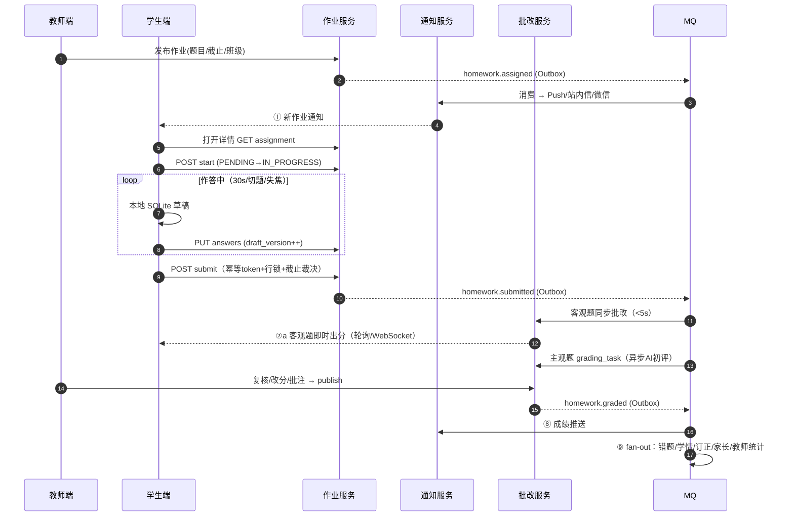
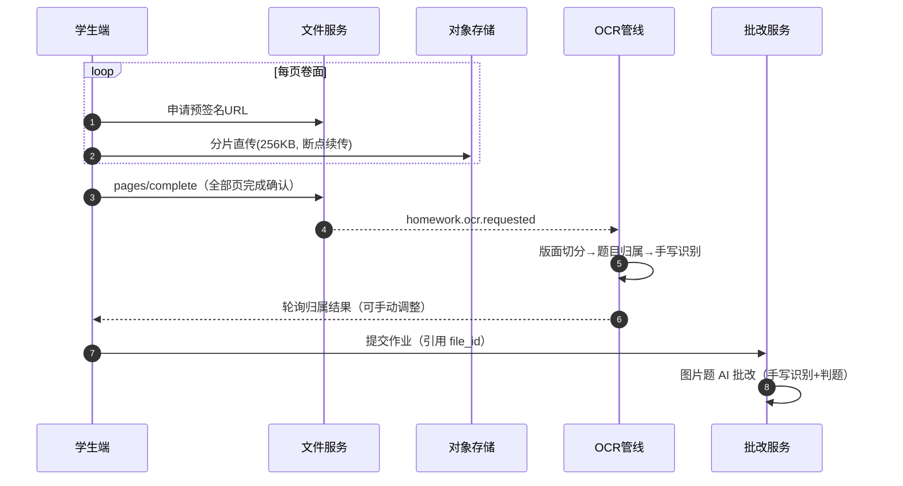
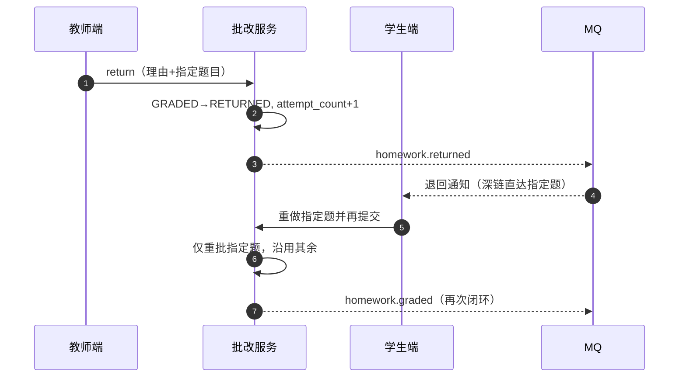

# 端到端流程设计 - 学生作业接收完成提交与反馈闭环完整链路

> **文档版本**：v1.1（2026-08-15 补全截断缺失章节：原文件在 §5.1.4 响应 JSON 处截断，仅写到步骤①；本次补齐步骤②-⑨详细流程、幂等与 Outbox、三链路批改、状态机守卫、异常补偿、弱网离线、安全、监控与验收场景）  
> **最后更新**：2026-08-15  
> **关联模块**：学生作业管理、练习测评、错题服务、学情分析、消息推送  
> **关联文档**：学生作业全生命周期管理与智能催交提醒调度引擎、客户端-学生班级与作业提交页面架构与交互设计、服务端-教师班级管理与作业发布服务、服务端-智能作业批改与教师阅卷辅助引擎

---

## 1. 概述

### 1.1 文档目的

本文档详细描述学生从**接收教师布置的作业** → **查看作业要求** → **逐题完成作答** → **提交作业** → **接收批改反馈** → **查看成绩与解析** → **错题自动收录** → **订正与复习**的完整端到端闭环流程。

该流程是学生端最高频的使用场景之一，涉及客户端多页面跳转、服务端多服务协作、AI自动批改、消息推送、数据统计等多个子系统的联动。本文档为开发团队提供跨模块集成的详细技术设计。

### 1.2 适用范围

| 维度 | 说明 |
|------|------|
| 适用学段 | 小学、初中、高中（幼儿阶段不涉及作业模块） |
| 作业类型 | 客观题（选择/填空）、主观题（简答/作文）、图片题（拍照上传手写答案） |
| 发布方 | 教师端批量发布给班级，或系统根据学习计划自动生成 |
| 批改方 | AI自动批改 + 教师人工复核/批改 |

### 1.3 核心设计目标

1. **低门槛**：学生打开作业 → 开始作答的操作路径不超过2步
2. **断点续答**：支持中途退出后恢复作答进度，数据不丢失
3. **离线容错**：弱网/断网环境下可继续作答，网络恢复后自动同步
4. **渐进反馈**：客观题即时反馈，主观题延迟反馈，整体形成完整反馈链
5. **闭环联动**：作业结果自动流入错题本、学情分析、复习计划等下游模块

---

## 2. 角色与场景定义

### 2.1 参与角色

| 角色 | 职责 | 系统标识 |
|------|------|----------|
| 学生 | 作业接收方和完成者 | `STUDENT` |
| 教师 | 作业发布者和最终批改者 | `TEACHER` |
| 系统(AI) | 自动批改、催交提醒、数据统计 | `SYSTEM` |
| 家长 | 查看孩子作业完成情况（可选） | `PARENT` |

### 2.2 核心用户场景

**场景A - 日常课后作业（高频）**：
> 教师在下午5点布置数学作业（10道选择题+2道解答题），学生在晚上7点打开APP看到通知，花30分钟完成并提交，系统自动批改选择题，解答题由AI初评+教师复核，次日学生查看成绩和解析。

**场景B - 周末综合作业（中频）**：
> 教师布置语文作文+英语阅读理解，学生分多次完成（写作文耗时较长），中途保存草稿，最终在截止时间前提交。

**场景C - 缓交/补交（低频）**：
> 学生未在截止时间前提交，系统发送催交通知；学生在宽限期内补交，但标记为"迟交"。

**场景D - 手写拍照作业**：
> 教师布置数学卷子，学生在纸上完成，拍照上传每页图片，系统通过OCR+AI进行批改。

---

## 3. 端到端流程总览

### 3.1 全链路流程图（文字版）

```
┌─────────────────────────────────────────────────────────────────────────┐
│                        学生作业完整闭环                                   │
└─────────────────────────────────────────────────────────────────────────┘

[教师发布作业]
       │
       ▼
┌──────────────┐     ┌──────────────┐     ┌──────────────┐
│  ① 作业通知   │────▶│  ② 查看作业   │────▶│  ③ 开始作答   │
│  推送到达     │     │  要求与详情   │     │  (进入答题流) │
└──────────────┘     └──────────────┘     └──────┬───────┘
                                                  │
                                    ┌─────────────┴──────────────┐
                                    │                             │
                                    ▼                             ▼
                          ┌──────────────┐             ┌──────────────┐
                          │  ④a 在线作答  │             │  ④b 拍照上传  │
                          │  (选择/填空/  │             │  (手写卷面    │
                          │   简答/作文)  │             │   拍照提交)   │
                          └──────┬───────┘             └──────┬───────┘
                                 │                            │
                                 └────────────┬───────────────┘
                                              ▼
                                    ┌──────────────┐
                                    │  ⑤ 草稿保存   │◀── 中途退出/断网
                                    │  & 断点续答   │──── 恢复作答
                                    └──────┬───────┘
                                           │
                                           ▼
                                    ┌──────────────┐
                                    │  ⑥ 提交作业   │
                                    │  (确认→提交)  │
                                    └──────┬───────┘
                                           │
                           ┌───────────────┼───────────────┐
                           │               │               │
                           ▼               ▼               ▼
                    ┌────────────┐  ┌────────────┐  ┌────────────┐
                    │⑦a 客观题   │  │⑦b 主观题   │  │⑦c 教师人工 │
                    │  即时批改  │  │  AI初评    │  │  复核批改  │
                    └─────┬──────┘  └─────┬──────┘  └─────┬──────┘
                          │              │               │
                          └──────────────┼───────────────┘
                                         ▼
                                ┌──────────────┐
                                │  ⑧ 成绩与解析 │
                                │  反馈推送     │
                                └──────┬───────┘
                                       │
                        ┌──────────────┼──────────────┐
                        │              │              │
                        ▼              ▼              ▼
                ┌────────────┐  ┌────────────┐  ┌────────────┐
                │⑨a 错题自动 │  │⑨b 学情数据 │  │⑨c 订正与   │
                │   收录     │  │   更新     │  │   复习触发 │
                └────────────┘  └────────────┘  └────────────┘
                                       │
                                       ▼
                                ┌──────────────┐
                                │  ⑩ 闭环完成   │
                                │  (家长报告/   │
                                │   教师统计)   │
                                └──────────────┘
```

### 3.2 阶段划分与耗时目标

| 阶段 | 步骤 | 响应时间目标 | 备注 |
|------|------|------------|------|
| 通知阶段 | ① 作业通知推送 | < 30秒 | 从教师发布到学生收到 |
| 准备阶段 | ② 查看作业详情 | < 1秒 | 页面加载 |
| 作答阶段 | ③④ 开始作答 | 实时 | 每题作答即时保存 |
| 暂存阶段 | ⑤ 草稿保存 | < 2秒 | 自动保存间隔30秒 |
| 提交阶段 | ⑥ 提交作业 | < 3秒 | 含数据上传 |
| 批改阶段 | ⑦a 客观题批改 | < 5秒 | 提交后即时出结果 |
| 批改阶段 | ⑦b 主观题AI初评 | < 30秒 | 异步处理 |
| 批改阶段 | ⑦c 教师复核 | T+24小时内 | 人工处理 |
| 反馈阶段 | ⑧ 成绩反馈推送 | 批改完成后< 30秒 | |
| 闭环阶段 | ⑨ 下游联动 | < 10秒 | 错题收录、学情更新 |

---

## 4. 数据结构定义

### 4.1 作业实体核心模型

#### 4.1.1 作业主表 `homework`

```sql
CREATE TABLE homework (
    id BIGINT PRIMARY KEY COMMENT '作业ID',
    title VARCHAR(200) NOT NULL COMMENT '作业标题',
    description TEXT COMMENT '作业说明',
    teacher_id BIGINT NOT NULL COMMENT '发布教师ID',
    class_id BIGINT NOT NULL COMMENT '目标班级ID',
    subject_code VARCHAR(20) NOT NULL COMMENT '学科编码',
    grade_code VARCHAR(20) NOT NULL COMMENT '年级编码',
    textbook_id BIGINT COMMENT '关联教材ID',
    chapter_id BIGINT COMMENT '关联章节ID',
    
    -- 时间控制
    publish_time DATETIME NOT NULL COMMENT '发布时间',
    deadline_time DATETIME NOT NULL COMMENT '截止时间',
    grace_period_minutes INT DEFAULT 0 COMMENT '宽限分钟数(允许迟交)',
    
    -- 作业内容
    question_ids JSON NOT NULL COMMENT '题目ID列表 ["q_001","q_002",...]',
    total_questions INT NOT NULL COMMENT '题目总数',
    total_score DECIMAL(6,1) NOT NULL COMMENT '总分',
    
    -- 批改配置
    auto_grade_enabled BOOLEAN DEFAULT TRUE COMMENT '是否启用AI自动批改',
    require_teacher_review BOOLEAN DEFAULT FALSE COMMENT '是否需要教师复核',
    
    -- 状态
    status VARCHAR(20) NOT NULL DEFAULT 'PUBLISHED' COMMENT 'PUBLISHED/CLOSED/ARCHIVED',
    
    created_at DATETIME NOT NULL DEFAULT CURRENT_TIMESTAMP,
    updated_at DATETIME NOT NULL DEFAULT CURRENT_TIMESTAMP ON UPDATE CURRENT_TIMESTAMP,
    
    INDEX idx_class_deadline (class_id, deadline_time),
    INDEX idx_teacher_status (teacher_id, status)
) ENGINE=InnoDB DEFAULT CHARSET=utf8mb4 COMMENT='作业主表';
```

#### 4.1.2 学生作业记录表 `student_homework`

```sql
CREATE TABLE student_homework (
    id BIGINT PRIMARY KEY COMMENT '主键',
    homework_id BIGINT NOT NULL COMMENT '作业ID',
    student_id BIGINT NOT NULL COMMENT '学生ID',
    
    -- 作答状态
    status VARCHAR(30) NOT NULL DEFAULT 'PENDING' 
        COMMENT 'PENDING/IN_PROGRESS/SUBMITTED/GRADED/RETURNED',
    
    -- 时间记录
    assigned_time DATETIME NOT NULL COMMENT '分配时间(作业发布时)',
    first_view_time DATETIME COMMENT '首次查看时间',
    start_answer_time DATETIME COMMENT '开始作答时间',
    submit_time DATETIME COMMENT '提交时间',
    grade_time DATETIME COMMENT '批改完成时间',
    
    -- 成绩
    objective_score DECIMAL(6,1) COMMENT '客观题得分',
    subjective_score DECIMAL(6,1) COMMENT '主观题得分',
    total_score DECIMAL(6,1) COMMENT '总得分',
    deduction_late SMALLINT DEFAULT 0 COMMENT '迟交扣分',
    
    -- 批改信息
    graded_by VARCHAR(20) COMMENT 'AI/TEACHER/MIXED',
    teacher_comment TEXT COMMENT '教师评语',
    ai_feedback TEXT COMMENT 'AI生成的反馈摘要',
    
    -- 元数据
    answer_duration_seconds INT COMMENT '实际作答时长(秒)',
    is_late BOOLEAN DEFAULT FALSE COMMENT '是否迟交',
    attempt_count INT DEFAULT 0 COMMENT '尝试提交次数',
    
    created_at DATETIME NOT NULL DEFAULT CURRENT_TIMESTAMP,
    updated_at DATETIME NOT NULL DEFAULT CURRENT_TIMESTAMP ON UPDATE CURRENT_TIMESTAMP,
    
    UNIQUE KEY uk_homework_student (homework_id, student_id),
    INDEX idx_student_status (student_id, status),
    INDEX idx_homework_status (homework_id, status)
) ENGINE=InnoDB DEFAULT CHARSET=utf8mb4 COMMENT='学生作业记录';
```

#### 4.1.3 学生作答明细表 `student_answer`

```sql
CREATE TABLE student_answer (
    id BIGINT PRIMARY KEY COMMENT '主键',
    student_homework_id BIGINT NOT NULL COMMENT '学生作业记录ID',
    homework_id BIGINT NOT NULL COMMENT '作业ID',
    student_id BIGINT NOT NULL COMMENT '学生ID',
    question_id BIGINT NOT NULL COMMENT '题目ID',
    
    -- 题序与分值
    question_order INT NOT NULL COMMENT '题目序号(从1开始)',
    max_score DECIMAL(4,1) NOT NULL COMMENT '该题满分',
    
    -- 作答内容
    answer_content JSON COMMENT '作答内容(结构化)',
    answer_images JSON COMMENT '答题图片URL列表(拍照上传)',
    answer_text TEXT COMMENT '文本作答(简答/作文)',
    
    -- 作答状态
    status VARCHAR(20) NOT NULL DEFAULT 'UNANSWERED' 
        COMMENT 'UNANSWERED/ANSWERED/MARKED_FOR_REVIEW/SUBMITTED',
    
    -- 草稿
    draft_content JSON COMMENT '草稿内容(未提交)',
    draft_saved_at DATETIME COMMENT '最后保存草稿时间',
    
    -- 批改结果
    is_correct BOOLEAN COMMENT '是否正确(客观题)',
    earned_score DECIMAL(4,1) COMMENT '得分',
    graded_by VARCHAR(20) COMMENT 'AI/TEACHER',
    grading_detail JSON COMMENT '批改详情(分步得分/批注)',
    teacher_annotation TEXT COMMENT '教师批注',
    
    -- 时间
    first_answer_time DATETIME COMMENT '首次作答时间',
    last_modify_time DATETIME COMMENT '最后修改时间',
    graded_time DATETIME COMMENT '批改时间',
    
    created_at DATETIME NOT NULL DEFAULT CURRENT_TIMESTAMP,
    updated_at DATETIME NOT NULL DEFAULT CURRENT_TIMESTAMP ON UPDATE CURRENT_TIMESTAMP,
    
    UNIQUE KEY uk_record_question (student_homework_id, question_id),
    INDEX idx_student_homework (student_id, homework_id)
) ENGINE=InnoDB DEFAULT CHARSET=utf8mb4 COMMENT='学生作答明细';
```

#### 4.1.4 答题作答内容 JSON 结构

```json
// 选择题
{
  "type": "CHOICE",
  "option_ids": ["opt_A", "opt_C"],
  "is_multiple": false
}

// 填空题
{
  "type": "FILL_BLANK",
  "blanks": [
    {"index": 1, "value": "32"},
    {"index": 2, "value": "64"}
  ]
}

// 判断题
{
  "type": "TRUE_FALSE",
  "value": true
}

// 简答题/作文
{
  "type": "ESSAY",
  "text": "作文正文...",
  "word_count": 850,
  "outline": ["论点1", "论点2", "论点3"]
}

// 拍照答题
{
  "type": "IMAGE",
  "images": [
    {
      "url": "https://cdn.primetop.com/homework/ans/img_xxx.jpg",
      "page_number": 1,
      "ocr_text": "OCR识别的文本...",
      "upload_time": "2026-07-22T12:00:00Z"
    }
  ]
}
```

### 4.2 关键状态枚举

```java
// 学生作业状态机
public enum StudentHomeworkStatus {
    PENDING("待查看"),        // 作业已分配，学生尚未查看
    IN_PROGRESS("作答中"),    // 学生已开始作答（有草稿）
    SUBMITTED("已提交"),      // 学生已提交作业
    GRADING("批改中"),        // 系统正在批改
    GRADED("已批改"),         // 批改完成
    RETURNED("已退回"),       // 教师退回重做
    OVERDUE("已逾期"),        // 超过截止时间未提交
    EXPIRED("已失效");        // 过了宽限期，不可再提交
    
    // 合法状态转换
    // PENDING → IN_PROGRESS → SUBMITTED → GRADING → GRADED
    //                                              → RETURNED → IN_PROGRESS
    // PENDING/IN_PROGRESS → OVERDUE → EXPIRED
    // OVERDUE → IN_PROGRESS (宽限期内补交)
}

// 单题作答状态
public enum AnswerStatus {
    UNANSWERED,      // 未作答
    ANSWERED,        // 已作答
    MARKED_FOR_REVIEW, // 标记待检查
    SUBMITTED,       // 已确认提交
    GRADED           // 已批改
}
```

---

## 5. 详细流程分解

### 5.1 步骤① 作业通知推送

#### 5.1.1 触发条件

教师端完成作业发布后，系统触发通知分发流程。

#### 5.1.2 处理流程

```
[教师发布作业 API]
    │
    ├─▶ 1. 写入 homework 表
    ├─▶ 2. 批量写入 student_homework 表（每个学生一条，status=PENDING）
    ├─▶ 3. 发送MQ消息 homework.assigned
    │       ├─ payload: { homeworkId, classId, studentIds[], deadline }
    │       └─ 消费者: NotificationService
    │
    └─▶ 4. NotificationService 处理:
            ├─ 查询每个学生的推送配置
            ├─ 按通道发送(APP Push / 站内信 / 微信服务通知)
            └─ 记录推送结果
```

#### 5.1.3 通知模板

```json
{
  "push_title": "你有新作业需要完成",
  "push_body": "{teacher_name}老师布置了{subject}作业：{homework_title}，请在{deadline}前完成",
  "push_data": {
    "type": "HOMEWORK_ASSIGNED",
    "homework_id": "hw_123456",
    "class_id": "cls_789",
    "deep_link": "primetop://homework/detail?hwId=hw_123456"
  },
  "inapp_title": "新作业通知",
  "inapp_body": "{subject} - {homework_title}\n截止时间：{deadline_formatted}\n题目数量：{count}题"
}
```

#### 5.1.4 API 设计

```
POST /api/v1/homework/{homeworkId}/notify
Authorization: Bearer {system_token}
X-Idempotency-Key: {uuid}          // 防止发布重试导致重复通知

Request Body:
{
  "channels": ["APP_PUSH", "INAPP", "WECHAT"],
  "student_ids": []                // 为空则按班级名单全量分发
}

Response 200:
{
  "code": 0,
  "data": {
    "notification_id": "ntf_20260815_0001",
    "total": 45,
    "dispatched": {
      "APP_PUSH": 45,
      "INAPP": 45,
      "WECHAT": 38
    },
    "failed_students": []
  }
}
```

| 错误码 | 场景 | 处理策略 |
| --- | --- | --- |
| 31201 `HOMEWORK_NOT_FOUND` | 作业不存在或已撤回 | 上游检查发布事务后重试 |
| 31202 `NOTIFY_CHANNEL_DISABLED` | 学生关闭全部通知通道 | 降级为首页红点 + 作业角标，打开 APP 即可见 |
| 429 | 触发通知频控 | 遵循疲劳度管控合并策略，并入下一个批量发送窗口 |

> 通知频率受《服务端-多源通知智能合并与用户通知疲劳度管控引擎》约束：同一学生 1 小时内最多接收 2 条作业类通知，多份作业合并为一条汇总推送（"今天有 3 份作业待完成"）。

---

### 5.2 步骤② 查看作业详情

#### 5.2.1 页面加载流程

```
[学生点击推送/首页作业卡片]
    │
    ├─▶ 1. 读本地缓存（SQLite homework_detail 表，TTL 10 分钟）
    │       └─ 命中 → 直接渲染，后台静默刷新
    │
    ├─▶ 2. 未命中 → GET /api/v1/student/assignments/{assignmentId}
    │
    └─▶ 3. 服务端组装响应：
            ├─ 作业元信息（标题/截止/题量/总分）
            ├─ 题目列表（题干/选项/图片，★不含答案与解析★）
            ├─ 我的作答状态（各题 draft/answered 标记）
            └─ 批改结果（仅 status=GRADED 时返回）
```

**防泄题约束**：题目下发接口永远不携带 `answer`/`analysis` 字段；答案与解析在批改完成后由独立的 `GET .../result` 接口按题返回，且受《答案管控与渐进式提示引擎》的渐进展示策略控制（默认先展示思路提示，学生点击后才展开完整步骤）。

#### 5.2.2 API 设计

```
GET /api/v1/student/assignments/{assignmentId}
Authorization: Bearer {student_token}

Response 200:
{
  "code": 0,
  "data": {
    "homework_id": "hw_123456",
    "title": "第3章 一元二次方程 课后作业",
    "subject_code": "MATH",
    "deadline_time": "2026-08-16T22:00:00+08:00",
    "grace_period_minutes": 60,
    "server_now": "2026-08-15T19:32:00+08:00",
    "my_status": "IN_PROGRESS",
    "submission_mode": "ONLINE",        // ONLINE / PHOTO / MIXED
    "questions": [
      {
        "question_id": "q_001",
        "order": 1,
        "type": "CHOICE",
        "stem_html": "...",
        "options": ["A...", "B...", "C...", "D..."],
        "max_score": 5.0,
        "my_answer_status": "ANSWERED"
      }
    ],
    "stats": { "answered": 7, "total": 12 }
  }
}
```

> `server_now` 随响应下发，客户端以此计算倒计时，避免本地时钟被篡改影响截止判断；提交截止裁决一律以服务端时间为准。

#### 5.2.3 首次查看回执

详情接口在 `first_view_time IS NULL` 时通过异步事件记录首览埋点（`homework_detail_view`），不阻塞主流程。教师端「未查看名单」据此统计。

---

### 5.3 步骤③ 开始作答

#### 5.3.1 处理流程

1. 学生点击「开始作答」→ 客户端调用 `POST /api/v1/student/assignments/{assignmentId}/start`；
2. 服务端 CAS 更新 `student_homework.status: PENDING → IN_PROGRESS`，写入 `start_answer_time`；
3. Redis 写入防重键 `homework:start:{studentId}:{homeworkId}`（TTL 24h），保证 `homework.started` 事件只发一次；
4. 返回作答上下文（草稿恢复所需的 `draft_version`）。

#### 5.3.2 服务端代码（状态机 CAS + 防重）

```java
@Service
public class HomeworkAnswerAppService {

    @Transactional
    public StartAnswerVO start(long homeworkId, long studentId) {
        // 1. 幂等防重：started 事件 24h 内只发一次
        String dedupeKey = "homework:start:%d:%d".formatted(studentId, homeworkId);
        boolean firstTime = Boolean.TRUE.equals(
            redis.opsForValue().setIfAbsent(dedupeKey, "1", Duration.ofHours(24)));

        // 2. CAS 状态转换：仅 PENDING / IN_PROGRESS 可进入
        int rows = jdbc.update("""
            UPDATE student_homework
            SET status = 'IN_PROGRESS',
                first_view_time = COALESCE(first_view_time, NOW()),
                start_answer_time = IFNULL(start_answer_time, NOW())
            WHERE homework_id = ? AND student_id = ?
              AND status IN ('PENDING', 'IN_PROGRESS')
            """, homeworkId, studentId);

        if (rows == 0) {
            StudentHomework sh = repo.find(homeworkId, studentId)
                .orElseThrow(() -> new BizException(31204, "ASSIGNMENT_NOT_FOUND"));
            // SUBMITTED / GRADED 等后置状态 → 幂等返回，不报错
            return StartAnswerVO.idempotent(sh);
        }
        if (firstTime) {
            outbox.append(new HomeworkEvent.Started(homeworkId, studentId));
        }
        return StartAnswerVO.started(repo.find(homeworkId, studentId).orElseThrow());
    }
}
```

#### 5.3.3 API 与错误码

```
POST /api/v1/student/assignments/{assignmentId}/start

Response 200:
{ "code": 0, "data": { "status": "IN_PROGRESS", "draft_version": 3,
                      "deadline_time": "...", "server_now": "..." } }
```

| 错误码 | 场景 | 处理 |
| --- | --- | --- |
| 31204 `ASSIGNMENT_NOT_FOUND` | 不在该作业名单 | 引导返回列表页 |
| 31205 `ASSIGNMENT_EXPIRED` | 已过宽限期（EXPIRED） | 展示「作业已截止」页，提供联系教师入口 |
| 31206 `ASSIGNMENT_WITHDRAWN` | 教师已撤回作业 | 展示撤回说明 |

---

### 5.4 步骤④a 在线作答与逐题自动保存

#### 5.4.1 自动保存触发策略

| 触发时机 | 说明 | 同步方式 |
| --- | --- | --- |
| 切题 | 学生切换到下一题时保存上一题 | 单题 PUT（≤1KB payload） |
| 定时 | 每 30 秒保存当前聚焦题 | 单题 PUT，与切题去重 |
| 批量 | 退到后台 / 页面失焦 / 每 2 分钟 | 批量 PUT（合并多题） |
| 手动 | 学生点击「保存草稿」 | 批量 PUT + 成功 Toast |

所有保存先写本地 SQLite（`answer_draft` 表），再异步上抛服务端；本地永远持有最新草稿，上抛失败不阻塞作答。

#### 5.4.2 草稿保存 API（带版本乐观锁）

```
PUT /api/v1/student/assignments/{assignmentId}/answers
Authorization: Bearer {student_token}

Request Body:
{
  "draft_version": 3,                       // 客户端持有的服务端版本号
  "answers": [
    { "question_id": "q_002", "status": "ANSWERED",
      "answer_content": { "type": "FILL_BLANK",
        "blanks": [{"index":1,"value":"32"}] },
      "client_saved_at": "2026-08-15T19:40:12+08:00" }
  ]
}

Response 200:
{ "code": 0, "data": { "draft_version": 4, "saved": 1, "conflict": false } }
```

| 错误码 | 场景 | 处理 |
| --- | --- | --- |
| 31210 `DRAFT_VERSION_CONFLICT` | draft_version 落后（另一端已保存） | 返回服务端最新草稿，客户端弹「多端冲突」选择框（见 §5.6.3） |
| 31211 `DEADLINE_PASSED` | 已过截止且无宽限 | 草稿拒收，本地标记待补交 |

> 服务端写路径：`answer_content → draft_content`，`status` 保持 `ANSWERED` 但不写正式 `answer_content`（提交时才固化），避免草稿污染批改。

#### 5.4.3 客户端保存调度伪代码（Flutter）

```dart
class AnswerDraftController {
  Future<void> onQuestionChanged(Question q) async {
    await localDao.upsertDraft(q.id, currentAnswer(q));   // 本地先行，永不失败
    _syncQueue.enqueue(SyncTask.single(q.id));
  }

  Future<void> flush() async {
    final batch = _syncQueue.drain(max: 20);
    if (batch.isEmpty) return;
    try {
      final resp = await api.saveDraft(assignmentId, batch, draftVersion);
      draftVersion = resp.draftVersion;                    // 单调递增
    } on DraftVersionConflict catch (e) {
      _conflictResolver.prompt(e.serverDraft, batch);      // 见 §5.6.3
    } on ApiException {
      _syncQueue.requeue(batch, backoff: ExponentialBackoff.base2s); // 失败退避重入队
    }
  }
}
```

---

### 5.5 步骤④b 拍照上传手写作业

#### 5.5.1 客户端处理链

```
拍照/相册选图
  → 自动裁切卷面边框（可手动调整）
  → 透视矫正 + 亮度增强（避免阴影反光影响 OCR）
  → 长边压缩至 2048px、JPEG quality 80（单页目标 ≤ 800KB）
  → 生成分片上传任务（每页一个，断点续传粒度 256KB）
```

上传协议复用《客户端文件上传服务与断点续传机制》：客户端先 `POST /api/v1/file/upload-token` 获取对象存储预签名 URL，直传 OSS；全部页完成后调用完成确认接口触发 OCR。

#### 5.5.2 服务端接收与 OCR 管线

```
POST /api/v1/student/assignments/{assignmentId}/photo-pages/complete
{ "pages": [ {"page_no":1, "file_id":"f_001"}, {"page_no":2, "file_id":"f_002"} ] }

Response 202:   // 异步受理
{ "code": 0, "data": { "upload_batch_id": "phb_777",
    "ocr_status": "PENDING", "poll_interval_ms": 2000 } }
```

服务端流程：
1. 登记 `photo_page` 记录（page_no / file_id / 状态 PENDING）；
2. 投递 MQ `homework.ocr.requested`（payload 含 upload_batch_id、题目切分策略）；
3. OCR 消费者调用《图片处理与 OCR 识别管线》：版面分析 → 题目切分 → 手写体识别 → 按 `question_order` 归属到 `student_answer.answer_images + ocr_text`；
4. 完成后 MQ `homework.ocr.completed`，客户端轮询接口获知归属结果，可手动调整某页归属的题目（识别错误兜底）。

| 错误码 | 场景 | 处理 |
| --- | --- | --- |
| 31220 `OCR_QUALITY_LOW` | 卷面过暗/模糊，置信度低于阈值 | 提示重拍该页，保留已成功页 |
| 31221 `PAGE_QUESTION_MATCH_FAILED` | 无法归属到题目 | 进入「手动指定题目」交互 |

#### 5.5.3 提交约束

`submission_mode=PHOTO` 的作业，提交前置校验：每道必答题至少归属 1 页图片，且所有 `file_id` 状态为 UPLOADED，否则提交按钮置灰并提示缺失清单。

---

### 5.6 步骤⑤ 断点续答与多端冲突

#### 5.6.1 本地草稿结构（SQLite）

```sql
CREATE TABLE answer_draft (
  assignment_id TEXT NOT NULL,
  question_id   TEXT NOT NULL,
  payload_json  TEXT NOT NULL,          -- 与 §4.1.4 answer_content 同构
  local_version INTEGER NOT NULL,       -- 本地保存次数
  updated_at    INTEGER NOT NULL,       -- 毫秒时间戳
  PRIMARY KEY (assignment_id, question_id)
);
CREATE TABLE draft_meta (
  assignment_id TEXT PRIMARY KEY,
  server_draft_version INTEGER NOT NULL DEFAULT 0,
  last_synced_at INTEGER
);
```

#### 5.6.2 恢复流程

```
进入作业详情
  → 本地有草稿 && my_status ∈ {IN_PROGRESS, RETURNED}
      → 顶部横幅「已恢复上次的作答进度（19:40 保存）」
      → 直接定位到最后一道未完成题
  → 本地无草稿 && 服务端 draft_content 非空（换设备场景）
      → 拉取服务端草稿回放本地，再进入作答
```

#### 5.6.3 多端冲突解决（乐观锁 + 用户裁决）

服务端 `student_answer` 行上维护 `draft_version`（每次成功保存 +1）。保存请求携带客户端持有的版本：
- 相等 → 正常写入并 +1；
- 落后 → 返回 `31210` + 服务端草稿，客户端弹出选择：**「使用本设备内容（覆盖）」/「使用云端内容（丢弃本地）」**；
- 覆盖动作以 `force=true` 重放保存请求（携带服务端最新版本号），一次 CAS 完成，不产生半覆盖状态。

> 教育场景特例：同一学生同时登录两台设备作答属低频异常使用，产品策略是**必须裁决**而非自动合并——避免两份内容交错写入导致题目答案串号。

---

### 5.7 步骤⑥ 提交作业

#### 5.7.1 提交前校验（客户端 + 服务端双重）

| 校验项 | 客户端 | 服务端（权威） |
| --- | --- | --- |
| 未答题数 | 展示清单，需二次确认 | 不阻断（允许漏答，计 0 分） |
| 截止/宽限 | 倒计时归零禁点 | `server_now` 裁决，过宽限拒收 31211 |
| 拍照完整性 | 缺页置灰提交按钮 | 逐题校验 file 状态 |
| 草稿同步 | 提交前强制 flush 本地队列 | 以服务端已保存草稿为准合并 |

#### 5.7.2 幂等与事务（服务端核心代码）

```java
@Service
public class HomeworkSubmitAppService {

    @Transactional
    public SubmitVO submit(SubmitCmd cmd) {   // cmd 含 submitToken（客户端 UUID）
        // 1) 幂等闸门：同一 submitToken 5 分钟内只处理一次
        String gateKey = "homework:submit:%d:%d".formatted(cmd.studentId(), cmd.homeworkId());
        if (!Boolean.TRUE.equals(redis.opsForValue()
                .setIfAbsent(gateKey, cmd.submitToken(), Duration.ofMinutes(5)))) {
            String prev = redis.opsForValue().get(gateKey + ":result");
            if (prev != null) return SubmitVO.fromToken(prev);      // 重复提交→返回原结果
            throw new BizException(31230, "SUBMIT_IN_PROGRESS");    // 并发中→请稍候
        }

        // 2) 行锁读取 + 状态守卫
        StudentHomework sh = repo.selectForUpdate(cmd.homeworkId(), cmd.studentId());
        guardState(sh, Set.of(IN_PROGRESS, OVERDUE));               // 其余状态→31231

        // 3) 截止裁决（服务端时间）
        DeadlineVerdict v = deadlineJudge.judge(sh, clock.now());   // ON_TIME / LATE / REJECTED
        if (v == REJECTED) throw new BizException(31211, "DEADLINE_PASSED");

        // 4) 明细固化：draft_content → answer_content，status=SUBMITTED（单事务批量）
        int fixed = answers.finalizeDrafts(sh.getId());

        // 5) 主记录状态流转
        jdbc.update("""
            UPDATE student_homework SET
              status='SUBMITTED', submit_time=NOW(), is_late=?, deduction_late=?,
              attempt_count=attempt_count+1, answer_duration_seconds=?
            WHERE id=?
            """, v == LATE, v.lateDeduction(), cmd.durationSeconds(), sh.getId());

        // 6) Outbox 事件（与业务同事务落库，投递器异步发送）
        outbox.append(new HomeworkEvent.Submitted(
            sh.getHomeworkId(), cmd.studentId(), sh.getId(), v == LATE));

        redis.opsForValue().set(gateKey + ":result", buildToken(sh), Duration.ofMinutes(30));
        return SubmitVO.of(sh, fixed);
    }
}
```

#### 5.7.3 提交事件扇出

`homework.submitted` 的消费方：

| 消费方 | 动作 | 时限 |
| --- | --- | --- |
| GradingService | 生成批改任务：客观题同步、主观题异步 | < 1s 受理 |
| 班级统计服务 | 实时提交率更新（教师端看板） | < 5s |
| 催交调度器 | 取消该生剩余催交计划（撤销定时器） | < 5s |
| 学情会话服务 | 记录学习会话（作业场景时长归因） | 异步 |

---

### 5.8 步骤⑦a 客观题即时批改

#### 5.8.1 同步批改流程

```
homework.submitted
  → GradingService 拆题：type ∈ {CHOICE, FILL_BLANK, TRUE_FALSE, MATCHING}
  → 调用《服务端-多题型统一判题引擎与答案评估策略框架》judge(questionId, answer)
  → 结果写回 student_answer（is_correct / earned_score / graded_by='AI'）
  → 汇总 objective_score 写入 student_homework
  → 若该作业无主观题 → 直接走 §5.11 发布流程
```

#### 5.8.2 关键实现（并行判题 + 汇总）

```java
List<JudgeResult> results = objectiveQuestions
    .parallelStream()
    .map(q -> judgeEngine.judge(q, answerOf(q)))   // 无状态纯函数，线程安全
    .toList();

// 批量写回：单 SQL 多值 INSERT ... ON DUPLICATE KEY UPDATE，避免逐题往返
answers.bulkUpsertGrading(submissionId, results);

// 汇总得分（含迟交扣分）
BigDecimal objective = results.stream()
    .map(JudgeResult::earnedScore).reduce(BigDecimal.ZERO, BigDecimal::add);
studentHomeworkMapper.updateObjectiveScore(submissionId, objective);
```

#### 5.8.3 5 秒预算分解

| 步骤 | 预算 |
| --- | --- |
| MQ 投递→消费 | ≤ 500ms |
| 判题（含客观题判分规则加载，Redis 缓存） | ≤ 1s |
| 批量写回 DB | ≤ 1s |
| 汇总与状态推进 | ≤ 500ms |
| 客户端轮询感知（2s 间隔） | ≤ 2s |

超预算兜底：整体 > 10s 未完成 → 客户端展示「客观题已提交，批改结果稍后可在作业详情查看」，不阻塞学生退出。

---

### 5.9 步骤⑦b 主观题 AI 初评

#### 5.9.1 异步批改任务

1. GradingService 为每道主观题（ESSAY/SHORT_ANSWER/IMAGE）创建 `grading_task`（复用《服务端-智能作业批改与教师阅卷辅助引擎》的任务模型）；
2. 任务按评分规则（rubric）调用大模型批改：输入题干+参考答案+学生作答（图片先过手写识别），输出分步得分、批注、置信度 `score_confidence`；
3. 结果写回 `student_answer.grading_detail`，`graded_by='AI'`。

#### 5.9.2 置信度分级与复核路由

| score_confidence | 处理 |
| --- | --- |
| ≥ 0.9 | 直接采信，教师端标记「AI 已批，可一键确认」 |
| 0.7 ~ 0.9 | 采信但进入教师复核队列（标记 SUGGEST_REVIEW） |
| < 0.7 | 不采信，仅作参考展示，必须教师人工给分 |

作文类主观题无论置信度如何，均强制进入复核队列（教育合规要求：最终分数必须可归因到人）。

#### 5.9.3 超时与降级

- 单题批改超时 30s → 重试 1 次（指数退避）；
- 两次失败 → 任务标记 `AI_FAILED`，直接转教师人工批改，并向教师端推送「AI 批改不可用，需人工批改」提醒；
- 大模型整体故障（供应商异常）→ 批量预批改任务挂起，遵循《服务端-AI模型调用多供应商容灾切换与自动降级引擎》切换供应商后恢复，不影响学生端任何界面（学生看到的一直是「批改中」）。

---

### 5.10 步骤⑦c 教师复核与发布

#### 5.10.1 复核工作流

```
教师待阅列表（GET /api/v1/grading/teacher/{teacherId}/pending）
  → 打开某份提交（GET /api/v1/grading/submission/{submissionId}）
  → 逐题：确认 AI 分 / 修改分数 / 添加批注（文字·语音·圈画）
  → 发布（POST /api/v1/grading/submission/{submissionId}/publish）
      ├─ 全部题目 graded_by 最终确定（TEACHER 覆盖记录 AI 原分）
      ├─ subjective_score / total_score 汇总写回 student_homework
      ├─ status: GRADING → GRADED，grade_time=NOW()
      └─ Outbox: homework.graded 事件（驱动 §5.11 + §5.12）
```

批量复核（`POST /api/v1/grading/batch-review`）仅允许批量「确认」客观题与高置信 AI 分；修改分数必须逐份操作（审计要求）。

#### 5.10.2 AI 与教师评分冲突处理

教师修改分数与 AI 分差超过该题满分的 30% 时，系统静默记录冲突样本（脱敏后回流 AI 批改质量评估），不弹窗打扰教师——教师拥有无条件最终裁决权。

#### 5.10.3 退回重做（RETURNED）

```
POST /api/v1/grading/submission/{submissionId}/return
{ "reason": "第5题步骤不完整，请重做后提交", "question_ids": ["q_005"] }
```

- `student_homework.status: GRADED → RETURNED`，`attempt_count + 1`；
- 学生收到退回通知（含教师理由 + 指定重做题目）；
- 重做仅开放指定题目的作答入口，其余题目锁定展示原批改；
- 再次提交后仅重新批改指定题目，其余沿用原结果（`RETURNED → IN_PROGRESS → SUBMITTED`，见 §7 状态机）。

---

### 5.11 步骤⑧ 成绩与解析反馈推送

#### 5.11.1 触发与模板

`homework.graded` → NotificationService（复用 §5.1 通道体系）：

```json
{
  "push_title": "作业批改完成啦",
  "push_body": "《一元二次方程 课后作业》已出分：92 分（班级前 20%）",
  "push_data": {
    "type": "HOMEWORK_GRADED",
    "homework_id": "hw_123456",
    "deep_link": "primetop://homework/result?hwId=hw_123456"
  }
}
```

> 推送文案中的班级排名仅对初高中开放，小学段（防焦虑合规）展示为「比上次进步 5 分」类自我对比话术。

#### 5.11.2 解析内容组装（渐进式）

成绩页按题展示：得分 → 思路提示（默认展开）→ 完整解题步骤（点击展开）→ 同类题推荐入口。展开策略由《答案管控与渐进式提示引擎》统一配置；错题的完整解析在学生未查看思路前不主动推送（防止直接抄解析）。

---

### 5.12 步骤⑨ 下游闭环联动

#### 5.12.1 事件扇出总表

`homework.graded` 事件消费者（全部幂等消费，见 §8.3）：

| 消费者 | 动作 | 联动文档 |
| --- | --- | --- |
| MistakeService | 错题自动收录（见 §5.12.2） | 错题服务-详细设计 |
| LearningProfileService | 知识点掌握度增量更新 | 服务端-练习答题实时批改与知识点掌握度增量更新服务 |
| ReviewPlanService | 生成订正任务 + 遗忘曲线复习计划插队 | 间隔重复算法与遗忘曲线复习调度引擎 |
| ParentReportService | 家长周报数据累积（可见度分级） | 家长端学情报告聚合与通知服务 |
| TeacherStatsService | 教师仪表盘 / 班级共性薄弱点更新 | 服务端-班级学情诊断与共性薄弱知识点靶向教学推荐引擎 |
| GrowthService | 学习时长/打卡/激励发放 | 用户学习激励中心 |

#### 5.12.2 错题自动收录规则

```
触发条件：is_correct = false 或 earned_score < max_score × 60%
错因标签映射（可被学生后续修正）：
  客观题错误        → CONCEPT_unclear（概念不清，默认）
  填空部分正确      → CALC_careless（计算失误，默认）
  主观题低分        → METHOD_error（方法错误，默认）
  未作答            → SKIPPED（不收录错题本，仅统计）
去重规则：同 homework_id + question_id 只收录一次（退回重做再次错误不重复收录，
          但更新「订正后又错」计数，权重升级为高优先复习）
```

#### 5.12.3 幂等消费与补偿

- 每个消费者以 `(event_id, consumer_group)` 为幂等键，Redis `SETNX` + 处理结果表双保险；
- 消费失败进入重试队列（退避 1m/5m/30m，3 次后进死信）；
- 死信由对账任务（§8.3）扫描补发，保证「提交 → 批改 → 错题/学情」最终一致。

---

## 6. 关键时序图

### 6.1 在线作答主链路（场景A）



### 6.2 拍照作业链路（场景D）



### 6.3 退回重做链路（RETURNED）



---

## 7. 状态机与流转守卫

### 7.1 完整状态转换表

| 当前态 | 触发事件 | 守卫条件 | 次态 | 副作用 |
| --- | --- | --- | --- | --- |
| PENDING | `STUDENT_START` | 在名单且未过宽限期 | IN_PROGRESS | start_answer_time、homework.started |
| PENDING | `DUE_TIME_REACHED` | 无草稿 | OVERDUE | 进入催交序列（T+2h 首次催交） |
| PENDING | `GRACE_EXPIRED` | — | EXPIRED | 终态，不可补交 |
| IN_PROGRESS | `STUDENT_SUBMIT` | 截止前 | SUBMITTED | 提交事务（§5.7.2） |
| IN_PROGRESS | `DUE_TIME_REACHED` | — | OVERDUE | 催交提醒 |
| OVERDUE | `STUDENT_SUBMIT` | 宽限期内 | SUBMITTED（is_late=1） | 迟交标记 + 扣分规则 |
| OVERDUE | `GRACE_EXPIRED` | — | EXPIRED | 终态 |
| SUBMITTED | `GRADING_BEGIN` | 批改任务受理 | GRADING | 客观题立即、主观题排队 |
| GRADING | `ALL_QUESTIONS_GRADED_AND_PUBLISHED` | 教师发布或无主观题自动发布 | GRADED | homework.graded 扇出 |
| GRADED | `TEACHER_RETURN` | 教师权限 | RETURNED | homework.returned 通知 |
| RETURNED | `STUDENT_RESUBMIT` | 重做指定题 | IN_PROGRESS | 仅开放指定题 |
| SUBMITTED/GRADING | `TEACHER_WITHDRAW` | 教师撤回作业 | （记录态 WITHDRAWN） | 通知学生，作业作废 |
| 任意态 | `TEACHER_EXEMPT` | 免交标记 | （记录态 EXEMPTED） | 移出催交，不计未交率 |

### 7.2 CAS 守卫实现规范

所有状态流转必须使用条件 UPDATE（乐观并发），禁止「先查后改」两步写：

```sql
UPDATE student_homework
SET status = :next, updated_at = NOW()
WHERE homework_id = :hw AND student_id = :stu AND status = :expected;
-- affected = 0 → 查询当前态走幂等分支或抛 31231 STATE_CONFLICT
```

### 7.3 非法转换处理

- `GRADED → IN_PROGRESS`（未经退回直接重做）等非法请求返回 `31231 STATE_CONFLICT`；
- 客户端收到 31231 后强制刷新作业状态，以服务端为准渲染；
- 所有被拒绝的非法转换记录审计日志（student_id、from、to、source），用于识别刷接口异常行为。

---

## 8. 异常场景与补偿策略

### 8.1 异常矩阵

| # | 异常场景 | 检测机制 | 补偿策略 |
| --- | --- | --- | --- |
| 1 | 提交请求超时，学生重复点击 | submitToken 幂等闸门 | 命中闸门返回原结果，不产生重复提交 |
| 2 | 提交事务成功但 Outbox 投递失败 | Outbox 扫描任务（每 5s） | 重投直到成功（事件带 event_id 去重） |
| 3 | MQ 消息丢失（极端） | 对账任务（§8.3） | SUBMITTED 超过 60s 无批改任务 → 补发 homework.submitted |
| 4 | 客观题批改超时（>10s） | 批改服务超时告警 | 转异步，客户端改轮询；结果仍写入后推送 |
| 5 | 主观题 AI 两次失败 | grading_task 状态 AI_FAILED | 转教师人工 + 教师端提醒 |
| 6 | OCR 全部页失败 | upload_batch 状态 FAILED | 通知学生重拍，草稿（在线部分）不受影响 |
| 7 | 成绩推送失败 | 通知服务回执 | 站内信兜底，下次打开 APP 红点提醒 |
| 8 | 错题收录消费失败进死信 | 死信队列监控告警 | 对账任务扫描 homework.graded 未收录的错题补收录 |
| 9 | 教师撤回作业但学生已提交 | 撤回接口校验 | 已提交的学生作业保留批改（不撤回），仅名单内未提交者作废 |
| 10 | 服务端时间与客户端偏差 | server_now 下发比对 | 客户端倒计时以服务端为基准校准 |

### 8.2 Outbox 模式要点

- 业务事务与 `event_outbox` 表同库同事务写入，杜绝「业务成功事件丢失」；
- 独立投递器（每 5s 扫描 status=PENDING 的 outbox 记录）按 topic 发送，成功后标记 SENT；
- 投递器多实例部署时以 `SELECT ... FOR UPDATE SKIP LOCKED` 分片，避免重复投递。

### 8.3 对账任务

```
每小时执行：
  a) student_homework.status=SUBMITTED 且 grade_time IS NULL 且 submit_time < NOW()-10min
       → 检查 grading_task 是否存在，缺失则补发 submitted 事件
  b) status=GRADED 且 homework.graded 事件已发，但 mistake_record 无对应记录
       → 补发错题收录命令（幂等）
  c) homework.status=PUBLISHED 但 student_homework 分配数 ≠ 班级在册数
       → 告警人工核查（新增学生补分配）
```

---

## 9. 弱网与离线作答设计

### 9.1 离线能力边界

| 能力 | 离线可用 | 说明 |
| --- | --- | --- |
| 查看已缓存作业与题目 | ✅ | 详情缓存 TTL 内 |
| 客观题/文本作答 | ✅ | 全部写本地，上线同步 |
| 拍照页面上传 | ❌ | 需网络（分片续传已降低弱网失败率） |
| 提交作业 | ❌ | 需在线（截止裁决必须服务端） |
| 查看批改结果 | ✅（缓存） | 已看过的结果缓存可离线回看 |

### 9.2 本地同步队列

- `sync_queue` 表：任务（save_draft / submit）按 FIFO + 优先级（submit 最高）调度；
- 网络恢复监听（connectivity_plus）触发 flush，指数退避（2s/4s/8s，上限 60s）；
- 队列上限 500 条，超出后最早完成的草稿任务合并压缩；
- 提交任务在队列中超过截止时间 → 本地标记 `DEADLINE_UNKNOWN`，联网后请求服务端裁决，按裁决结果展示（成功迟交 / 已失效）。

### 9.3 与全局离线体系的关系

本模块本地持久化复用《客户端本地持久层与数据管理》《离线缓存与数据同步》的通用设施（队列、退避、冲突框架），仅定义作业域的冲突键（assignment_id+question_id）与裁决规则；跨设备同步遵循《多端数据同步与冲突解决策略》。

---

## 10. 安全与权限设计

| 风险点 | 防护措施 |
| --- | --- |
| 越权查看他人作业 | 所有学生侧接口校验 student_id ∈ 班级名单（JWT 解析 uid + 名单比对，DB 层兜底） |
| 篡改成绩/状态 | 客户端不传任何分数字段；得分只由服务端批改链路写入 |
| 提前获取答案 | 题目接口不下发答案；答案接口需 status=GRADED 且走渐进展示 |
| 代做作业（账号借用） | 设备指纹比对（同一账号频繁跨设备切换触发风控提醒家长，不在学生端暴露） |
| 作文内容安全 | ESSAY 文本提交时过敏感词过滤（异步，命中仅阻断发布解析不阻断提交） |
| 截图泄露题目 | 高中段水印含学生 ID（复用数字内容防截屏与溯源水印体系，作业场景默认轻量水印） |

---

## 11. 埋点与监控

### 11.1 埋点事件清单

| 事件 | 触发 | 关键属性 |
| --- | --- | --- |
| homework_notify_received | 通知到达 | hw_id, channel |
| homework_detail_view | 详情打开 | hw_id, first_view(0/1) |
| homework_start | 开始作答 | hw_id |
| answer_autosave | 草稿自动保存 | hw_id, batch_size, success |
| homework_photo_upload_result | 拍照页上传 | pages, fail_count, avg_ms |
| homework_submit_result | 提交结果 | hw_id, is_late, cost_ms, retry |
| homework_objective_graded | 客观题出分 | hw_id, latency_ms |
| homework_grade_view | 查看成绩 | hw_id, total_score |
| homework_hint_expand | 展开完整解析 | hw_id, q_id（答案管控漏斗） |
| homework_redo_submit | 退回重做再提交 | hw_id, attempt |

### 11.2 核心指标与告警

| 指标 | 目标 | 告警阈值 |
| --- | --- | --- |
| 通知到达→打开作业转化率 | ≥ 60%（24h） | < 40% 持续 2 天（产品告警） |
| 提交接口 P99 延迟 | < 3s | > 5s 持续 5min |
| 客观题批改 P99 | < 5s | > 10s 持续 5min |
| 主观题 AI 初评成功率 | ≥ 98% | < 95% 持续 10min |
| homework.graded→错题收录延迟 P99 | < 10s | 死信队列非空立即告警 |
| 提交幂等冲突率 | < 0.5% | > 2% 排查客户端重试逻辑 |

---

## 12. 性能与容量估算

假设：10 万 DAU，人均 1.5 份作业/天，平均 8 题/份。

| 项 | 估算 | 优化 |
| --- | --- | --- |
| student_homework 写入 | 15 万行/天 | 批量 INSERT（发布时按班级一次写入） |
| student_answer 写入 | 120 万行/天 | 草稿合并写（同题 30s 内多次保存只落一行）、按月分区 |
| 草稿保存 QPS 峰值 | ≈ 500（晚 19-21 点） | Redis 写缓冲 + 定时刷库（草稿允许 30s 丢失窗口，提交时强制 flush 校验） |
| homework.submitted 峰值 | ≈ 80/s（22 点截止前） | MQ 削峰，批改消费水平扩展 |
| 通知扇出 | 单作业 45 人 × 通道 | 分批发送（500/batch），合并多作业为汇总通知 |

> 草稿写缓冲取舍：草稿允许短暂仅存 Redis（AOF everysec），**提交事务读取时先合并 Redis 最新草稿再固化**，保证不丢最终内容。

---

## 13. 与关联模块的边界划分

| 主题 | 本文档负责 | 关联文档负责 |
| --- | --- | --- |
| 作业分配/催交/免交调度 | 学生视角的接收与状态联动 | 《服务端-学生作业全生命周期管理与智能催交提醒调度引擎》：催交策略、免交、负荷管控 |
| 批改引擎 | 流程编排与结果回写时序 | 《服务端-智能作业批改与教师阅卷辅助引擎》：rubric、批注、阅卷工作台 |
| 判题算法 | 调用与结果消费 | 《服务端-多题型统一判题引擎与答案评估策略框架》：各题型判分策略 |
| 页面与交互 | 接口时序契约 | 《客户端-学生班级与作业提交页面架构与交互设计》：组件树、手势、渲染 |
| 教师发布 | 学生侧可观测结果 | 《服务端-教师班级管理与作业发布服务》：组题、定时发布、多班发布 |

**状态模型映射说明**：生命周期引擎的 assignment 状态（ASSIGNED/VIEWED/IN_PROGRESS/SUBMITTED/LATE_SUBMIT/OVERDUE/WITHDRAWN/EXEMPTED）与本流程学生态（PENDING/IN_PROGRESS/SUBMITTED[+is_late]/OVERDUE/EXPIRED）为同一数据的两个视图：ASSIGNED+VIEWED 对应 PENDING（以 first_view_time 区分），LATE_SUBMIT 对应 SUBMITTED+is_late=1，WITHDRAWN/EXEMPTED 为教师侧记录态。落地时以生命周期引擎表为存储源，本流程状态为其上的学生端投影。

**接口风格说明**：本文档沿用 `/api/v1/student/assignments/*`（服务端引擎规范路径）；客户端页面文档中的 `/api/v2/classes/{classId}/homework/*` 为 BFF 聚合层路由，二者为同一能力的不同网关映射，映射表由《服务端-BFF数据聚合层与多端接口适配设计》维护。

---

## 14. 端到端验收场景清单

| # | 场景 | 验收要点 |
| --- | --- | --- |
| 1 | 日常作业标准闭环（场景A） | 通知 30s 内到达；客观题提交后 5s 出分；教师发布后学生收到成绩推送；错题自动入本 |
| 2 | 中途退出断点续答 | 杀进程重进，草稿完整恢复并定位到最后一题，横幅提示保存时间 |
| 3 | 弱网作答（场景B） | 飞行模式作答→恢复网络→草稿自动同步；无重复、无丢失 |
| 4 | 截止前 1 秒提交 | 服务端裁决 ON_TIME，成绩正常；客户端倒计时以 server_now 校准 |
| 5 | 宽限期内迟交（场景C） | 状态 OVERDUE→SUBMITTED，is_late=1，按规则扣分并展示迟交标识 |
| 6 | 宽限期后提交被拒 | 返回 31211，客户端展示已截止页；草稿保留 30 天可导出 |
| 7 | 双击/弱网重复提交 | 仅一条 student_homework 记录，第二次请求返回原结果（幂等） |
| 8 | 拍照作业全链路（场景D） | 分片断点续传；OCR 归属可手动修正；图片题 AI 批改后教师可改分 |
| 9 | 主观题 AI 低置信 | 分数不采信、进复核队列，教师未处理前学生端保持「批改中」 |
| 10 | 教师退回重做 | 仅指定题可重做，其余锁定；重交后只重批指定题；attempt_count 正确 |
| 11 | 双设备同时作答 | 后保存端收到 31210 冲突，选择覆盖/丢弃后数据一致 |
| 12 | 换设备续答 | 新设备拉取服务端草稿恢复，无本地数据依赖 |
| 13 | 未交学生催交链路 | T+2h 催交通知到达；提交后剩余催交计划取消 |
| 14 | 教师撤回已提交作业 | 已提交者批改流程不受影响，未提交者作业作废 |
| 15 | 错题收录幂等 | 退回重做再次错误不重复收录，但「订正后又错」计数 +1 |

---

## 15. 版本历史

| 版本 | 日期 | 变更说明 |
| --- | --- | --- |
| v1.0 | 2026-07-23 | 初版：概述、角色场景、流程总览、数据结构、步骤①（写作中断截断） |
| v1.1 | 2026-08-15 | 补全截断缺失章节：完成 §5.1.4；新增 §5.2-§5.12 步骤②-⑨详细流程、§6 时序图、§7 状态机守卫表、§8 异常补偿与 Outbox/对账、§9 弱网离线作答、§10 安全权限、§11 埋点监控、§12 容量估算、§13 模块边界与状态映射、§14 验收场景 |