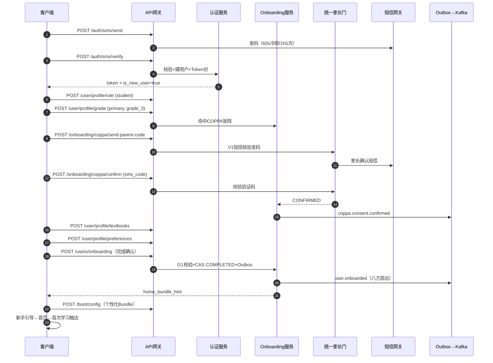
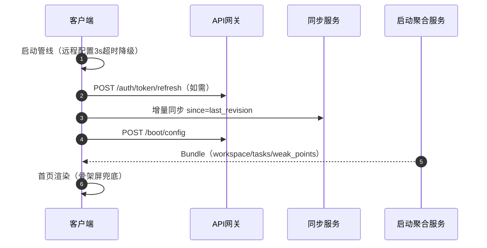
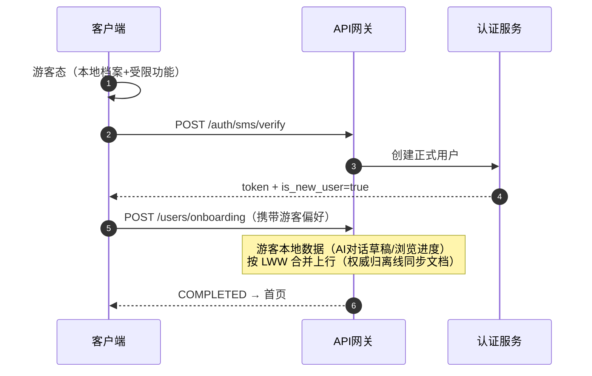

# 端到端流程设计 - 用户注册与首次使用引导完整链路

## 1. 概述

### 1.1 文档目的

详细设计用户从首次启动 APP 到完成首次学习交互的完整链路，涵盖启动初始化、登录注册、角色建档、年级学段选择、教材版本配置、偏好设定、新手引导和首屏数据加载的全流程。使开发人员可直接参照编码，明确每个环节的前后端交互、数据流转和异常处理。

### 1.2 流程范围

| 阶段 | 起点 | 终点 |
|------|------|------|
| 启动初始化 | APP 进程创建 | Splash 展示完成、远程配置就绪 |
| 登录注册 | 进入登录页 | 获得 Access Token + Refresh Token |
| 用户建档 | 登录成功判定新用户 | 角色、年级、教材版本写入完成 |
| 偏好设定 | 建档完成 | 学习偏好、目标设定完成（可跳过） |
| 新手引导 | 偏好设定完成 | 引导教程播放完毕（可跳过） |
| 首页加载 | 进入首页 | 首屏数据全部就绪 |
| 首次学习触达 | 首页就绪 | 用户完成首次 AI 对话或拍题 |

### 1.3 设计原则

1. **3 步核心路径**：首次启动到可用状态控制在 3 步以内（登录 → 建档 → 进入首页）
2. **渐进采集**：非必要信息延迟采集，不阻塞进入主流程
3. **可恢复性**：引导中断后可从断点继续，已填信息不丢失
4. **合规前置**：隐私协议、儿童信息保护规则在采集前完成确认
5. **游客友好**：支持游客模式体验核心功能后再决定注册

---

## 2. 整体流程状态机

```
┌─────────────┐
│  APP 启动    │
└──────┬──────┘
       │
┌──────▼──────────┐
│  启动初始化管线  │──── 异常 ───▶ 重试/降级启动
└──────┬──────────┘
       │
┌──────▼──────────┐     ┌────────────────┐
│  Token 有效性    │─有效─▶│  增量同步检查   │
│  检查           │     └───────┬────────┘
└──────┬──────────┘             │
       │ 无效/过期        ┌─────▼─────┐
┌──────▼──────────┐      │  首页加载  │
│  登录页面       │      └───────────┘
└──┬─────┬───────┘
   │     │
   │  ┌──▼────────┐
   │  │ 游客体验   │── 有限功能首页
   │  └───────────┘
   │
┌──▼──────────┐
│ 隐私协议确认  │
└──────┬──────┘
       │
┌──────▼──────────────────┐
│  登录方式选择             │
│  ┌─────┐┌──────┐┌─────┐ │
│  │手机号││OAuth ││体验码│ │
│  └──┬──┘└──┬───┘└──┬──┘ │
└─────┼──────┼────────┼────┘
      └──┬───┘        │
    ┌─────▼─────┐     │
    │ 后端认证   │     │
    │ 返回Token  │     │
    └─────┬─────┘     │
          │           │
    ┌─────▼───────────▼──┐
    │  是否新用户？       │
    └──┬──────────┬──────┘
       │新用户     │老用户
  ┌────▼────┐  ┌──▼────────┐
  │ 角色选择 │  │ 检查档案   │
  └────┬────┘  │ 完整性     │
       │       └──┬────────┘
  ┌────▼────────┐  │不完整
  │ 年级学段选择 │  ▼
  └────┬────────┘ ┌──────────┐
       │          │ 补全引导  │──▶ ┐
  ┌────▼────────┐ └──────────┘   │
  │ 教材版本选择 │                │
  └────┬────────┘                │
       │                 ┌───────┘
  ┌────▼────────┐       │
  │ 学习偏好设定 │◀── 可跳过
  └────┬────────┘
       │
  ┌────▼────────┐
  │ 新手引导    │◀── 可跳过
  └────┬────────┘
       │
  ┌────▼──────────────────┐
  │ 首页加载 + 首次学习推荐 │
  └───────────────────────┘
```

---

## 3. 阶段一：启动初始化管线

### 3.1 客户端启动序列

```
App Main() →
  1. Flutter引擎初始化
  2. 本地存储初始化 (SharedPreferences/SQLite)
  3. 读取本地缓存配置 (theme, locale, env)
  4. 网络状态检测
  5. 远程配置拉取 (Firebase Remote Config / 自建配置中心)
  6. 环境判断 (灰度/AB实验分组)
  7. SDK初始化 (推送、埋点、崩溃上报)
  8. 路由决策 → 登录页 / 首页
```

### 3.2 远程配置项

客户端在启动阶段拉取以下远程配置，控制后续流程分支：

```json
{
  "force_update": {
    "min_version": "1.0.0",
    "current_version": "1.2.0",
    "download_url": "https://cdn.primetop.com/app/release.apk"
  },
  "login_config": {
    "guest_mode_enabled": true,
    "sms_login_enabled": true,
    "oauth_providers": ["wechat", "apple"],
    "agreement_version": "2026-v2",
    "experience_code_enabled": true
  },
  "onboarding_config": {
    "skip_preference": true,
    "skip_tutorial": true,
    "tutorial_version": "v1",
    "default_textbook_edition": "renjia"
  },
  "maintenance": {
    "enabled": false,
    "message": "系统维护中，预计 22:00 恢复",
    "estimated_end": "2026-06-03T22:00:00+08:00"
  }
}
```

### 3.3 启动阶段异常处理

| 异常场景 | 处理策略 |
|----------|----------|
| 网络不可用 | 使用本地缓存配置继续启动，后台重试 |
| 远程配置拉取超时 (>3s) | 降级为本地默认配置，不阻塞启动 |
| 强制更新 | 弹窗阻断，引导更新 |
| 维护模式 | 全屏维护提示页，禁止进入 |
| 本地数据库损坏 | 清理重建，日志上报 |

### 3.4 客户端关键代码示例

```dart
/// app_startup.dart
class AppStartupManager {
  static const _remoteConfigTimeout = Duration(seconds: 3);

  Future<StartupResult> initialize() async {
    final stopwatch = Stopwatch()..start();

    try {
      // 1. 本地存储初始化
      await _initLocalStorage();

      // 2. 并行：远程配置 + 网络检测
      final results = await Future.wait([
        _fetchRemoteConfig().timeout(_remoteConfigTimeout),
        _checkNetworkStatus(),
      ]);

      final remoteConfig = results[0] as RemoteConfig;
      final networkAvailable = results[1] as bool;

      // 3. 强制更新检查
      if (_needsForceUpdate(remoteConfig)) {
        return StartupResult.forceUpdate(remoteConfig.forceUpdate!);
      }

      // 4. 维护模式检查
      if (remoteConfig.maintenance?.enabled == true) {
        return StartupResult.maintenance(remoteConfig.maintenance!);
      }

      // 5. SDK初始化
      await _initSDKs(remoteConfig);

      // 6. 路由决策
      final route = _determineStartupRoute();
      stopwatch.stop();

      // 埋点：启动完成
      Analytics.track('app_startup_completed', {
        'duration_ms': stopwatch.elapsedMilliseconds,
        'route': route.name,
        'network_available': networkAvailable,
        'is_cold_start': true,
      });

      return StartupResult.success(route: route, config: remoteConfig);
    } catch (e, stack) {
      CrashReporter.report(e, stack);
      // 降级：使用本地配置继续启动
      return StartupResult.success(
        route: _determineStartupRoute(),
        config: RemoteConfig.defaults(),
      );
    }
  }

  StartupRoute _determineStartupRoute() {
    final token = TokenManager.getAccessToken();
    if (token == null) return StartupRoute.login;

    final isExpired = TokenManager.isTokenExpired(token);
    if (isExpired) return StartupRoute.login;

    final onboardingComplete = LocalStorage.getBool('onboarding_complete');
    if (onboardingComplete != true) return StartupRoute.onboarding;

    return StartupRoute.home;
  }
}
```

---

## 4. 阶段二：登录注册

### 4.1 登录方式路由

| 方式 | 入口 | MVP | 说明 |
|------|------|-----|------|
| 手机号+验证码 | 主入口 | ✅ | 核心登录方式 |
| 微信 OAuth | 第三方按钮 | ✅ | Android/iOS 均支持 |
| Apple 登录 | 第三方按钮 (iOS) | ✅ | iOS 14+ 必须提供 |
| 游客体验 | 底部文字链接 | ✅ | 有限功能体验 |
| 体验码 | 输入框 | ❌ V1.0 | 学校/机构批量体验 |

### 4.2 手机号验证码登录流程

```
客户端                                  服务端
  │                                      │
  │  POST /api/v1/auth/sms/send          │
  │  { phone: "138****1234" }            │
  │ ─────────────────────────────────────▶│
  │                                      │  校验手机号格式
  │                                      │  检查发送频率（同号60s/同IP 1h 5次）
  │                                      │  生成6位验证码（5分钟有效）
  │                                      │  存入 Redis: sms:code:{phone}
  │  { success: true }                   │
  │◀───────────────────────────────────── │
  │                                      │
  │  用户输入验证码                        │
  │                                      │
  │  POST /api/v1/auth/sms/verify        │
  │  { phone, code, device_id }          │
  │ ─────────────────────────────────────▶│
  │                                      │  验证码校验
  │                                      │  查找/创建用户
  │                                      │  生成 Token 对
  │                                      │  记录登录日志
  │  {                                   │
  │    access_token,                     │
  │    refresh_token,                    │
  │    expires_in: 7200,                 │
  │    is_new_user: true,                │
  │    user: { id, nickname, ... }       │
  │  }                                   │
  │◀───────────────────────────────────── │
  │                                      │
  │  存储Token到安全存储                    │
  │  路由决策：is_new_user → 建档         │
```

### 4.3 手机号验证码登录 API 详细设计

#### 4.3.1 发送验证码

```
POST /api/v1/auth/sms/send
```

**请求体：**
```json
{
  "phone": "13812341234",
  "captcha_token": "g-recaptcha-response-xxx"
}
```

**参数校验：**
| 字段 | 规则 |
|------|------|
| phone | 必填，中国大陆手机号正则 `^1[3-9]\d{9}$` |
| captcha_token | 可选，触发人机验证时必填 |

**服务端处理逻辑：**
```java
public SmsSendResult sendSmsCode(SmsSendRequest request) {
    // 1. 手机号格式校验
    if (!PhoneValidator.isValid(request.getPhone())) {
        throw new BizException(ErrorCode.INVALID_PHONE_FORMAT);
    }

    // 2. 频率限制（Redis INCR + TTL）
    String rateLimitKey = "sms:rate:" + request.getPhone();
    long count = redis.incr(rateLimitKey);
    if (count == 1) redis.expire(rateLimitKey, 3600); // 1小时窗口
    if (count > 5) {
        throw new BizException(ErrorCode.SMS_RATE_LIMIT_EXCEEDED);
    }

    // 3. 同号间隔检查
    String cooldownKey = "sms:cooldown:" + request.getPhone();
    if (redis.exists(cooldownKey)) {
        throw new BizException(ErrorCode.SMS_COOLDOWN_NOT_EXPIRED);
    }

    // 4. 生成6位数字验证码
    String code = RandomStringUtils.randomNumeric(6);

    // 5. 存储到 Redis（5分钟有效，验证后删除）
    redis.setex("sms:code:" + request.getPhone(), 300, code);

    // 6. 设置冷却期（60秒）
    redis.setex(cooldownKey, 60, "1");

    // 7. 调用短信服务发送
    smsService.sendVerificationCode(request.getPhone(), code);

    // 8. 返回（不返回验证码本身）
    return SmsSendResult.success();
}
```

**响应体：**
```json
{
  "code": 0,
  "message": "success",
  "data": {
    "cooldown_seconds": 60
  }
}
```

**错误码：**
| code | message | 说明 |
|------|---------|------|
| 10001 | 手机号格式不正确 | 正则校验失败 |
| 10002 | 验证码发送过于频繁，请稍后再试 | 60秒内重复发送 |
| 10003 | 该手机号今日验证码次数已达上限 | 1小时内超过5次 |
| 10004 | 短信服务暂时不可用，请稍后再试 | SMS供应商异常 |
| 10901 | 人机验证失败 | captcha校验不通过 |

#### 4.3.2 验证码校验登录

```
POST /api/v1/auth/sms/verify
```

**请求体：**
```json
{
  "phone": "13812341234",
  "code": "123456",
  "device_info": {
    "device_id": "uuid-xxx",
    "platform": "android",
    "os_version": "14",
    "app_version": "1.0.0",
    "device_model": "Pixel 8"
  }
}
```

**服务端处理逻辑：**
```java
@Transactional
public LoginResult verifySmsCode(SmsVerifyRequest request) {
    // 1. 验证码校验（5次错误锁定）
    String codeKey = "sms:code:" + request.getPhone();
    String verifyCountKey = "sms:verify:" + request.getPhone();

    String cachedCode = redis.get(codeKey);
    if (cachedCode == null) {
        throw new BizException(ErrorCode.SMS_CODE_EXPIRED);
    }

    long verifyCount = redis.incr(verifyCountKey);
    if (verifyCount > 5) {
        redis.del(codeKey); // 超过5次错误，清除验证码
        throw new BizException(ErrorCode.SMS_CODE_LOCKED);
    }

    if (!cachedCode.equals(request.getCode())) {
        throw new BizException(ErrorCode.SMS_CODE_MISMATCH);
    }

    // 2. 验证成功，清除相关Key
    redis.del(codeKey, verifyCountKey);

    // 3. 查找或创建用户
    User user = userRepository.findByPhone(request.getPhone());
    boolean isNewUser = (user == null);

    if (isNewUser) {
        user = createNewUser(request.getPhone());
    }

    // 4. 更新登录信息
    user.setLastLoginAt(Instant.now());
    user.setLastLoginIp(request.getClientIp());
    userRepository.save(user);

    // 5. 生成 Token 对
    TokenPair tokenPair = tokenService.generateTokenPair(user.getId());

    // 6. 记录登录设备（多端管理）
    deviceService.registerLoginDevice(user.getId(), request.getDeviceInfo());

    // 7. 记录登录日志（审计）
    auditLogService.log(AuditAction.LOGIN, user.getId(), Map.of(
        "method", "sms",
        "device_id", request.getDeviceInfo().getDeviceId(),
        "ip", request.getClientIp()
    ));

    return LoginResult.builder()
        .accessToken(tokenPair.getAccessToken())
        .refreshToken(tokenPair.getRefreshToken())
        .expiresIn(tokenPair.getExpiresIn())
        .isNewUser(isNewUser)
        .user(UserVO.from(user))
        .build();
}
```

**响应体（新用户）：**
```json
{
  "code": 0,
  "message": "success",
  "data": {
    "access_token": "eyJhbGciOiJIUzI1NiJ9...",
    "refresh_token": "dGhpcyBpcyBhIHJlZnJlc2g...",
    "expires_in": 7200,
    "token_type": "Bearer",
    "is_new_user": true,
    "user": {
      "id": 100001,
      "nickname": "用户100001",
      "avatar_url": null,
      "user_type": "student",
      "phone": "138****1234",
      "profile_complete": false
    }
  }
}
```

**响应体（老用户）：**
```json
{
  "code": 0,
  "message": "success",
  "data": {
    "access_token": "eyJhbGciOiJIUzI1NiJ9...",
    "refresh_token": "dGhpcyBpcyBhIHJlZnJlc2g...",
    "expires_in": 7200,
    "token_type": "Bearer",
    "is_new_user": false,
    "user": {
      "id": 100001,
      "nickname": "小明",
      "avatar_url": "https://cdn.primetop.com/avatar/100001.jpg",
      "user_type": "student",
      "phone": "138****1234",
      "profile_complete": true,
      "stage": "junior",
      "grade": 8,
      "semester": "second",
      "textbook_edition": "renjia"
    }
  }
}
```

### 4.4 微信 OAuth 登录流程

```
客户端                                  微信SDK        服务端
  │                                      │              │
  │  调用 WXApi.sendReq(SendAuth)        │              │
  │ ────────────────────────────────────▶│              │
  │                                      │  微信授权页   │
  │  onResp(code)                        │              │
  │◀──────────────────────────────────── │              │
  │                                      │              │
  │  POST /api/v1/auth/oauth/wechat                     │
  │  { code, device_info }               │              │
  │ ───────────────────────────────────────────────────▶│
  │                                                     │
  │                                      │  code → access_token + openid
  │                                      │  ◀────────── 微信API
  │                                                     │
  │                                                     │  查找 user_oauth
  │                                                     │  查找 wechat union_id
  │                                                     │  创建/关联用户
  │                                                     │  生成 Token
  │  { access_token, refresh_token, is_new_user }       │
  │◀────────────────────────────────────────────────────│
```

**API：**
```
POST /api/v1/auth/oauth/wechat
```

**请求体：**
```json
{
  "code": "wechat_auth_code_xxx",
  "device_info": { ... }
}
```

**服务端处理要点：**
1. 用 `code` 向微信换取 `access_token` + `openid`（含 `unionid`）
2. 优先用 `unionid` 查 `user_oauth` 表（支持公众号/小程序统一账号）
3. 若未找到绑定记录 → 创建新用户 + 绑定 OAuth
4. 若 `unionid` 已绑定但 `openid` 不同（跨应用）→ 追加绑定记录
5. 拉取微信头像/昵称作为默认值（需用户授权）

### 4.5 Apple 登录流程（iOS Only）

遵循 Apple Sign-In 规范：
1. 客户端调用 `ASAuthorizationAppleIDProvider`
2. 获取 `authorizationCode` + `identityToken` + `user` (含 email/name，仅首次)
3. 客户端将 `identityToken` (JWT) 发送到后端
4. 后端验证 Apple JWT 签名，提取 `sub`（Apple 用户唯一标识）
5. 查找或创建用户

**API：**
```
POST /api/v1/auth/oauth/apple
```

**请求体：**
```json
{
  "identity_token": "eyJraW...",
  "authorization_code": "c1234...",
  "user": {
    "email": "user@privaterelay.appleid.com",
    "full_name": "张三"
  },
  "device_info": { ... }
}
```

> **注意**：Apple 仅在首次授权时返回 email 和 name，后续只返回 `sub`。必须在首次授权时保存这些信息。

### 4.6 游客模式

```dart
/// 客户端游客模式处理
class GuestManager {
  /// 进入游客模式
  Future<void> enterGuestMode() async {
    // 1. 生成游客临时标识（UUID）
    final guestId = const Uuid().v4();
    await LocalStorage.setString('guest_id', guestId);

    // 2. 设置游客状态标记
    await LocalStorage.setBool('is_guest', true);

    // 3. 使用默认配置创建本地游客档案
    await _createLocalGuestProfile();

    // 4. 埋点
    Analytics.track('guest_mode_entered', {
      'guest_id': guestId,
    });

    // 5. 进入受限首页
    Navigator.of(context).pushReplacementNamed('/home');
  }
}
```

**游客模式限制：**
| 功能 | 游客可用 | 注册用户可用 |
|------|---------|-------------|
| AI 对话（每日3次） | ✅ | ✅ |
| 拍照搜题（每日1次） | ✅ | ✅ |
| 同步课堂目录浏览 | ✅ | ✅ |
| 错题本 | ❌ | ✅ |
| 学情分析 | ❌ | ✅ |
| 学习规划 | ❌ | ✅ |
| 会员功能 | ❌ | ✅ |

**游客转注册触发时机：**
- 触达游客功能上限时弹出引导
- 进入受限功能页面时弹出引导
- 首页顶部常驻"完善资料，解锁更多功能"Banner

---

## 5. 阶段三：用户建档（Onboarding）

### 5.1 建档流程状态机

```
┌──────────┐
│ 角色选择  │◀────────────────────┐
│(student/ │                     │
│ parent)  │                     │
└─────┬────┘                     │
      │                          │
┌─────▼────────┐                 │
│ 隐私协议确认  │                 │
│(COPPA合规)   │                 │
└─────┬────────┘                 │
      │                          │
┌─────▼────────┐    返回修改      │
│ 年级学段选择  │─────────────────│
└─────┬────────┘                 │
      │                          │
┌─────▼────────┐                 │
│ 教材版本选择  │                 │
│(按学科配置)   │                 │
└─────┬────────┘                 │
      │                          │
┌─────▼──────────────────┐      │
│ POST /api/v1/users/    │      │
│       onboarding       │      │
│ 一次性提交所有建档数据   │      │
└─────┬──────────────────┘      │
      │ 200 OK                   │
      ▼                         │
  进入首页                       │
```

### 5.2 角色选择页

**客户端设计：**
```dart
class RoleSelectionPage extends StatelessWidget {
  // 两张大卡片，直观明确
  // 学生卡片：图标为 🎒，文案"我是学生，开始学习"
  // 家长卡片：图标为 👨‍👩‍👧，文案"我是家长，管理孩子学习"

  void _onRoleSelected(String role) {
    if (role == 'parent') {
      // 家长需要先绑定或创建孩子账号
      Navigator.pushNamed(context, '/onboarding/parent-bind');
    } else {
      // 学生进入 COPPA 确认
      Navigator.pushNamed(context, '/onboarding/coppa-consent');
    }
  }
}
```

**家长角色特殊处理：**
家长选择后进入"绑定学生"流程：
1. 输入孩子手机号/扫码绑定已有学生账号
2. 或选择"创建新学生账号"（需要填写孩子姓名、年级等信息）
3. 家长自己也需要完成基础设置

### 5.3 COPPA 合规确认

对 14 岁以下用户（学段 ≤ 小学），在采集任何个人信息前必须获得家长同意：

```dart
class CoppaConsentPage extends StatefulWidget {
  @override
  Widget build(BuildContext context) {
    return Scaffold(
      body: Column(
        children: [
          Text('我们需要家长的帮助'),
          Text('根据相关规定，14岁以下用户需要家长同意才能使用本应用。'),
          Text('请家长协助完成以下确认：'),
          // 家长确认表单
          TextFormField(decoration: InputDecoration(labelText: '家长手机号')),
          TextFormField(decoration: InputDecoration(labelText: '与孩子关系')),
          CheckboxListTile(title: Text('我已阅读并同意《儿童个人信息保护规则》')),
          CheckboxListTile(title: Text('我同意为孩子注册并使用本应用')),
          ElevatedButton(
            onPressed: _onConsentConfirmed,
            child: Text('确认并继续'),
          ),
        ],
      ),
    );
  }
}
```

**服务端处理：**
```java
// COPPA同意记录存储
public void recordCoppaConsent(Long userId, CoppaConsentRequest request) {
    CoppaConsent consent = CoppaConsent.builder()
        .userId(userId)
        .parentPhone(request.getParentPhone())
        .parentRelationship(request.getRelationship())
        .agreementVersion(request.getAgreementVersion())
        .childProtectionVersion(request.getChildProtectionVersion())
        .consentedAt(Instant.now())
        .clientIp(request.getClientIp())
        .userAgent(request.getUserAgent())
        .build();
    coppaConsentRepository.save(consent);

    // 同时发送确认短信给家长（异步，不阻塞主流程）
    // 短信核验协议复用统一家长门引擎 V1（SMS_VERIFY），见 §5.3.3
    parentGateClient.sendParentConfirmSms(
        ParentSmsRequest.builder()
            .parentPhone(request.getParentPhone())
            .purpose("onboarding.coppa_consent")
            .grantToken(request.getGrantToken())
            .agreementVersion(request.getAgreementVersion())
            .build()
    );

    // 同事务写入 Outbox：coppa.consent.recorded 事件（证据链归档 + 审计消费）
    outboxRepository.save(OutboxEvent.of(
        "coppa.consent.recorded",
        OutboxKey.of(user.getId(), "coppa_consent", consent.getId()),
        consent
    ));
}
```

#### 5.3.1 学段×家长同意矩阵（COPPA 强制门）

依据《儿童个人信息网络保护规定》与《个人信息保护法》，结合本项目 14 岁儿童线（权威见《端到端流程设计-用户实名认证与未成年人身份核验完整链路》§6.5）：

| 学段 | 推定年龄 | 家长同意要求 | 核验方式 | 豁免条件 |
|------|---------|-------------|---------|---------|
| 幼儿园（kindergarten） | 3-6 | **强制** | 家长门 V1 短信核验（页面内即时） | 无豁免 |
| 小学（primary） | 6-12 | **强制** | 家长门 V1 短信核验 | 无豁免 |
| 初中（junior） | 12-15 | **默认强制**（初一/初二可能 <14） | 家长门 V1 短信核验 | 已实名认证且判定 is_child=false |
| 高中（senior） | 15-18 | 不强制（按实名认证引擎另判） | — | — |
| 家长代建孩子账号 | — | 视为成立（操作主体即监护人） | 记录 guardian_consent + 操作审计 | — |

> **裁决 G-COPPA**：v1.0 流程图将 COPPA 确认置于年级选择之前，但学段未知时无法判定是否触发家长同意。v1.1 修正为：**角色选择 → 年级学段选择 → （命中矩阵）→ 家长同意 → 教材版本选择**。基础《用户协议》+《隐私政策》确认仍前置（所有人必勾），与儿童保护规则确认解耦。

#### 5.3.2 COPPA 确认页面交互（客户端）

```
┌─────────────────────────────────────┐
│  ← 返回                    家长协助  │
│                                      │
│   请家长完成确认                     │
│   根据儿童个人信息保护规定，          │
│   14 岁以下用户需监护人同意           │
│                                      │
│   家长手机号 [138****5678      ]     │
│   与孩子关系  [母亲 ▼]               │
│                                      │
│   □ 已阅读《儿童个人信息保护规则》    │
│   □ 同意为孩子注册并使用本应用        │
│                                      │
│   [获取验证码]  验证码 [______ ]      │
│                                      │
│        [确认并继续]                  │
└─────────────────────────────────────┘
```

**交互规则：**
1. 两个勾选框必须全部勾选，「确认并继续」才可点击
2. 家长手机号不能与当前注册手机号相同（G6，防自验）
3. 验证码 60s 冷却，页面显示倒计时
4. 家长手机号校验失败 5 次锁定 10 分钟（复用家长门防爆破协议）
5. 弱网/短信不可用时降级为「远程确认」（V3）：家长收到短信链接，孩子端进入等待页，家长确认后自动放行（见 D2）

#### 5.3.3 服务端 API：发送家长确认验证码

```
POST /api/v1/onboarding/coppa/send-parent-code
```

**请求体：**
```json
{
  "parent_phone": "13900005678",
  "relationship": "mother",
  "agreement_version": "2026-v2",
  "child_protection_version": "cp-2026-v1"
}
```

**服务端校验链（顺序执行）：**

```java
public void sendParentConfirmCode(Long userId, CoppaSendRequest req) {
    // 1. 手机号格式 + 与注册手机号不同（G6）
    String selfPhone = userRepository.findPhoneById(userId);
    if (req.getParentPhone().equals(selfPhone)) {
        throw new BizException(ErrorCode.COPPA_PARENT_PHONE_SAME_AS_CHILD);
    }

    // 2. 同一家长手机号名下待确认孩子数 ≤ 3（防批量注册滥用）
    if (coppaConsentRepository.countPendingByParentPhone(req.getParentPhone()) >= 3) {
        throw new BizException(ErrorCode.COPPA_PARENT_PHONE_EXCEEDED);
    }

    // 3. 发送频控：同号 60s 冷却 / 1h 5 次（委托统一短信网关 scene=COPPA_CONFIRM）
    smsGatewayClient.send(SmsScene.COPPA_CONFIRM, req.getParentPhone(), Map.of(
        "child_nickname_masked", maskNickname(user.getNickname())
    ));

    // 4. 记录待确认快照（CONFIRM_PENDING，10 分钟有效）
    coppaConsentRepository.upsertPending(userId, req);
}
```

**响应体：**
```json
{
  "code": 0,
  "data": { "cooldown_seconds": 60 }
}
```

#### 5.3.4 服务端 API：确认家长同意

```
POST /api/v1/onboarding/coppa/confirm
```

**请求体：**
```json
{
  "parent_phone": "13900005678",
  "sms_code": "123456",
  "relationship": "mother",
  "agreement_version": "2026-v2",
  "child_protection_version": "cp-2026-v1",
  "client_request_id": "uuid-xxx"
}
```

**服务端处理逻辑：**

```java
@Transactional
public CoppaConfirmResult confirmParentConsent(Long userId, CoppaConfirmRequest req) {
    // 1. 幂等：client_request_id 唯一索引（uk_coppa_confirm），重复请求返回首次结果
    CoppaConsent existing = coppaConsentRepository.findByClientRequestId(req.getClientRequestId());
    if (existing != null) {
        return CoppaConfirmResult.replay(existing);
    }

    // 2. 校验短信验证码（复用家长门 V1 校验：5 次错误锁定 10 分钟）
    parentGateClient.verifySmsCode(req.getParentPhone(), req.getSmsCode(), "coppa_consent");

    // 3. 更新同意记录状态：CONFIRM_PENDING → CONFIRMED（CAS）
    int updated = coppaConsentRepository.casUpdateStatus(
        userId, ConsentStatus.CONFIRM_PENDING, ConsentStatus.CONFIRMED);
    if (updated == 0) {
        // 已确认过 → 幂等放行（不报错，返回当前状态）
        CoppaConsent current = coppaConsentRepository.findByUserId(userId);
        return CoppaConfirmResult.replay(current);
    }

    // 4. 落库证据链（ guardian_consent 权威表归用户协议与法律文档管理服务，本地事务写入）
    legalDocClient.recordGuardianConsent(GuardianConsentRecord.builder()
        .userId(userId)
        .parentPhoneHash(sha256(req.getParentPhone()))
        .relationship(req.getRelationship())
        .agreementVersion(req.getAgreementVersion())
        .childProtectionVersion(req.getChildProtectionVersion())
        .consentEvidence(ConsentEvidence.of(clientIp, userAgent, deviceId, Instant.now()))
        .source("onboarding")
        .build());

    // 5. Outbox：coppa.consent.confirmed（异步触发监护人轻绑定 + 学生端放行）
    outboxRepository.save(OutboxEvent.of("coppa.consent.confirmed",
        OutboxKey.of(userId, "coppa_consent", userId), null));

    return CoppaConfirmResult.success();
}
```

**响应体：**
```json
{
  "code": 0,
  "data": {
    "consent_status": "CONFIRMED",
    "next_step": "textbookSelection"
  }
}
```

**错误码：**
| code | message | 说明 |
|------|---------|------|
| 10101 | COPPA 同意记录不存在或已过期 | pending 快照超过 10 分钟 |
| 10102 | 家长验证码错误 | 短信核验失败 |
| 10103 | 家长同意未完成，无法完成建档 | 建档最终提交时的 COPPA 门（G1） |
| 10104 | 家长手机号不能与孩子注册手机号相同 | G6 防自验 |
| 10105 | 该家长手机号待确认的孩子数已达上限 | ≥3 个 pending |
| 10106 | 家长验证码尝试次数过多已锁定 | 5 次错误锁 10 分钟 |

**DDL（本域新增表，DDL 风格对齐《账号体系》§3）：**

```sql
CREATE TABLE coppa_consents (
  id BIGINT PRIMARY KEY AUTO_INCREMENT,
  user_id BIGINT NOT NULL COMMENT '孩子用户ID',
  parent_phone_hash CHAR(64) NOT NULL COMMENT '家长手机号SHA-256（不明文存储）',
  relationship VARCHAR(20) NOT NULL COMMENT 'father/mother/guardian',
  status TINYINT NOT NULL DEFAULT 0 COMMENT '0=CONFIRM_PENDING,1=CONFIRMED,2=EXPIRED',
  agreement_version VARCHAR(20) NOT NULL,
  child_protection_version VARCHAR(20) NOT NULL,
  client_request_id VARCHAR(64) NOT NULL,
  evidence JSON COMMENT '证据链：client_ip/user_agent/device_id/consented_at',
  confirmed_at DATETIME,
  created_at DATETIME DEFAULT CURRENT_TIMESTAMP,
  updated_at DATETIME DEFAULT CURRENT_TIMESTAMP ON UPDATE CURRENT_TIMESTAMP,

  UNIQUE KEY uk_client_request_id (client_request_id),
  UNIQUE KEY uk_user_active (user_id),
  INDEX idx_parent_phone_hash (parent_phone_hash, status)
) ENGINE=InnoDB DEFAULT CHARSET=utf8mb4 COMMENT='COPPA家长同意记录表（证据链权威归guardian_consent，本表为旅程内状态）';
```

> `uk_user_active` 单用户仅一条有效同意记录；换家长重确认时先置旧记录 EXPIRED 再插入新记录（同事务）。正式监护人强绑定（人脸/身份证核验）不在 onboarding 强制，由《用户实名认证》链路事后引导升级。

### 5.4 年级学段选择

#### 5.4.1 客户端交互

学段 Tab（幼儿/小学/初中/高中）+ 年级宫格（对齐《客户端-登录注册与入门引导页面架构设计》§5）。选择后立即调分步 API 落库，支持断点恢复（设计原则 3）。

#### 5.4.2 分步 API：年级学段提交

```
POST /api/v1/user/profile/grade
```

**请求体：**
```json
{
  "stage": "junior",
  "grade": "grade_8",
  "client_request_id": "uuid-xxx"
}
```

**服务端校验规则：**

| 校验项 | 规则 | 失败错误码 |
|--------|------|-----------|
| stage 合法值 | kindergarten / primary / junior / senior | 10110 非法学段 |
| grade-stage 组合 | primary→grade_1~6；junior→grade_7~9；senior→grade_10~12；kindergarten→grade_k1~k3 | 10111 年级学段不匹配 |
| 幂等 | client_request_id 唯一 | 重复返回首次结果 |
| 状态推进 | onboarding status ≥ ROLE_SELECTED（G4 单向推进） | 10112 引导步骤越界 |

**处理逻辑：**
```java
@Transactional
public GradeResult submitGrade(Long userId, GradeRequest req) {
    // 1. 校验组合（查静态组合表，不走 DB）
    if (!StageGradeMatrix.isValid(req.getStage(), req.getGrade())) {
        throw new BizException(ErrorCode.ONBOARDING_GRADE_MISMATCH);
    }

    // 2. student_profiles upsert（DDL 权威归《账号体系》§3.2）
    studentProfileRepository.upsertStageGrade(userId, req.getStage(), req.getGrade());

    // 3. 学期自动推定（权威归《学期与学年管理服务》，此处只读结果）
    Semester current = academicCalendarService.getCurrentSemester();

    // 4. 推定是否命中 COPPA 强制门（矩阵见 §5.3.1）
    boolean coppaRequired = COPPA_MATRIX.containsKey(req.getStage());

    // 5. 推进 onboarding 状态（CAS 单向）
    onboardingProgressRepository.casAdvance(userId,
        OnboardingStep.GRADE_SELECT, OnboardingStep.nextOf(OnboardingStep.GRADE_SELECT));

    return GradeResult.builder()
        .nextStep(coppaRequired ? "coppaConsent" : "textbookSelection")
        .coppaRequired(coppaRequired)
        .semester(current)
        .build();
}
```

**响应体：**
```json
{
  "code": 0,
  "data": {
    "next_step": "coppaConsent",
    "coppa_required": true,
    "semester": "2026-2027-1",
    "textbook_recommend_ready": true
  }
}
```

> **枚举裁决**：服务端存储以《账号体系》student_profiles.stage 为权威（kindergarten）；《客户端-登录注册》文档的 `preschool` 为客户端历史枚举，客户端在序列化层映射为 kindergarten（契约缺陷登记，见 §16.3）。

### 5.5 教材版本选择（按学科配置）

#### 5.5.1 推荐拉取

```
GET /api/v1/textbook/recommend?region=310000&stage=junior&grade=grade_8
```

推荐规则（权威归《用户引导与新手教程系统》§3.6）：
1. 语文默认部编版（全国统一）
2. 数学/英语按地区热门版本推荐（region 缺省时用 IP 定位省份，失败用全国默认）
3. 理科（初中起）默认人教版

**响应体（节选）：**
```json
{
  "code": 0,
  "data": {
    "recommendations": [
      { "subject": "chinese", "default_edition": "buban", "options": ["buban"] },
      { "subject": "math", "default_edition": "renjia", "options": ["renjia", "sujiao", "beishida"] },
      { "subject": "english", "default_edition": "renjia", "options": ["renjia", "waiyan", "yilin"] }
    ],
    "region_resolved": "310000"
  }
}
```

#### 5.5.2 分步 API：教材版本提交

```
POST /api/v1/user/profile/textbooks
```

**请求体：**
```json
{
  "textbooks": {
    "chinese": "buban",
    "math": "renjia",
    "english": "waiyan"
  },
  "client_request_id": "uuid-xxx"
}
```

**服务端校验（G7）：**
```java
// 教材版本必须属于 (stage, grade, subject) 且 is_active=1
for (Map.Entry<String, String> e : req.getTextbooks().entrySet()) {
    boolean valid = textbookVersionRepository.existsActive(
        e.getValue(), currentStage, currentGrade, e.getKey());
    if (!valid) {
        throw new BizException(ErrorCode.ONBOARDING_TEXTBOOK_INVALID,
            Map.of("subject", e.getKey(), "edition", e.getValue()));
    }
}
// 语文部编版唯一选项时自动带入，客户端不展示语文选择页（快捷路径）
```

**响应体：**
```json
{
  "code": 0,
  "data": {
    "next_step": "preference",
    "skippable": true
  }
}
```

**边界：** 教材内容（章节目录/知识点映射）权威归《教材版本与章节管理服务》；本流程只做「选择并写档」，不复制教材结构。版本切换提示：同一学段内切换教材走「设置-教材版本」（学段不变仅教材变），跨学段变更走《学段年级升迁》链路（G4 禁止 onboarding 回退改年级）。

### 5.6 学习偏好设定（可跳过）

#### 5.6.1 页面内容

1. **兴趣标签**：分学段配置（对齐《用户引导与新手教程系统》§3.7：幼儿 1-3 个、小学 2-4 个、初中 2-5 个、高中 2-5 个），用于推荐冷启动
2. **学习目标**：日常巩固 daily / 中考冲刺 zhongkao / 高考冲刺 gaokao（senior 仅 gaokao/daily；junior 含 zhongkao；primary/kindergarten 仅 daily，对齐 student_profiles.learning_goal）
3. **可用学习时段**（可选）：工作日/周末时段多选，供学习计划服务冷启动

#### 5.6.2 分步 API

```
POST /api/v1/user/profile/preferences
```

**请求体：**
```json
{
  "interest_tags": ["math_thinking", "reading"],
  "learning_goal": "daily",
  "study_time_slots": { "weekday": "19:00-21:00", "weekend": "09:00-11:00" },
  "skipped": false,
  "client_request_id": "uuid-xxx"
}
```

**跳过语义（skipped=true）：**
- interest_tags 置空数组（推荐冷启动回退「学段热门内容」，对齐推荐冷启动引擎 DEFAULT 策略）
- learning_goal 默认 daily
- study_time_slots 空 → 学习计划服务用学段默认时段
- skippedSteps 记录 INTEREST_TAG，不阻塞建档完成

**响应体：**
```json
{
  "code": 0,
  "data": { "next_step": "tutorial", "skippable": true }
}
```

### 5.7 建档完成提交（一次性确认）

分步 API 已逐步落库；本接口做**最终一致性校验 + 状态置 COMPLETED + 事件扇出**，保证「进入首页时档案一定完整」。

```
POST /api/v1/users/onboarding
```

**请求体：**
```json
{
  "client_request_id": "uuid-xxx",
  "source": "app",
  "timezone": "Asia/Shanghai"
}
```

**服务端处理逻辑：**
```java
@Transactional
public OnboardingResult completeOnboarding(Long userId, OnboardingCompleteRequest req) {
    // 1. 幂等：uk(user_id, client_request_id)，重复请求返回首次快照（不重放事件）
    OnboardingResult cached = onboardingResultCache.get(userId, req.getClientRequestId());
    if (cached != null) return cached;

    // 2. 完整性校验（G8）：角色/年级/教材必填
    StudentProfile profile = studentProfileRepository.findForUpdate(userId);
    if (profile.getStage() == null || profile.getGrade() == null
        || isEmpty(profile.getSelectedSubjects())) {
        throw new BizException(ErrorCode.ONBOARDING_PROFILE_INCOMPLETE);
    }

    // 3. COPPA 门（G1/G2）：coppa_required 用户必须有 CONFIRMED 记录
    if (coppaPolicy.isRequired(profile.getStage())
        && !coppaConsentRepository.existsConfirmed(userId)) {
        throw new BizException(ErrorCode.COPPA_NOT_CONFIRMED); // 10103
    }

    // 4. 状态 CAS：PROFILE_SUBMITTED → COMPLETED（单向，G4）
    onboardingProgressRepository.casComplete(userId);

    // 5. users.profile_complete = true + user_type 落定（同事务，G13）
    userRepository.markProfileComplete(userId, profile.getRole());

    // 6. Outbox（同事务，G14）：user.onboarded 扇出
    outboxRepository.save(OutboxEvent.of("user.onboarded",
        OutboxKey.of(userId, "user", userId),
        UserOnboardedPayload.of(profile, req.getTimezone())));

    return OnboardingResult.of(homeEntry());
}
```

**user.onboarded 事件扇出矩阵：**

| 消费方 | 动作 | 幂等键 |
--------|------|--------|
| 计费引擎（额度门控） | 初始化免费用户日额度（AI 问答/拍题） | (user_id, "quota_init") |
| 用户学习画像冷启动 | 建初始画像（学段/学科/兴趣标签） | (user_id) |
| 推荐冷启动引擎 | 注册冷启动策略（学段热门 + 兴趣标签） | (user_id) |
| 学习计划服务 | 生成欢迎计划（含首次学习任务） | (user_id, "welcome_plan") |
| 多源任务调度引擎 | 投递首次任务（SYS_RECOMMEND） | (source_id=welcome, external_ref=first) |
| 学习上下文 GLCM | 写入初始上下文（stage/grade/教材） | (user_id, "bootstrap") |
| 通知中心 | 发送欢迎消息（学生端） | (user_id, "welcome") |
| 埋点平台 | 服务端补发 onboarded 事件（对齐客户端漏斗） | (user_id) |

**响应体：**
```json
{
  "code": 0,
  "data": {
    "profile_complete": true,
    "home_bundle_hint": {
      "endpoint": "/api/v1/boot/config",
      "sections": ["workspace", "today_tasks", "weak_points"]
    },
    "tutorial": { "required": true, "version": "v1", "skippable": true }
  }
}
```

### 5.8 家长角色建档分支

家长选择「我是家长」后进入绑定流程（对齐《服务端-家庭账户管理与多孩子切换服务》）：

| 子流程 | 交互 | 服务端 | 说明 |
|--------|------|--------|------|
| 绑定已有学生 | 输入孩子手机号 → 孩子端确认 / 家长输入绑定码 | parent_bindings.binding_code（DDL 权威归《账号体系》§3.4） | 双向确认防误绑 |
| 代建新学生档案 | 填写孩子昵称/年级/教材 → 家长门 V3 远程确认或同机 V1 核验 | 创建孩子子账号（user_type=1）+ parent_bindings | **G10：操作主体即监护人，COPPA 视为成立**，guardian_consent 记录 source=parent_created |
| 稍后再添加 | 直接进入家长首页（空态引导） | onboarding status=COMPLETED（parent 分支无年级/教材必填） | 家长中心可后续多孩子管理 |

教师角色：MVP 不开放注册入口，跳转「教师认证申请」（对齐《服务端-平台多角色统一身份与跨角色切换管理服务》，教师身份需学校认证）。OnboardingStep 中 TEACHER_SETUP 为预留。

---

## 6. 阶段四：新手引导（Tutorial）

### 6.1 引导版本机制

```
播放条件：local.viewed_tutorial_version ≠ remote.tutorial_version
```

- `tutorial_version` 由远程配置下发（§3.2 onboarding_config.tutorial_version）
- 版本不一致才播放：首次安装（无本地版本）、大版本升级、学段升迁（升迁链路会 bump 用户的 pending_tutorial_version）
- 可跳过（skip_tutorial=true），跳过也写 viewed_tutorial_version（视为已触达）

### 6.2 首页功能引导四步（coach marks）

| 步骤 | 高亮目标 | 文案要点 | 完成埋点 |
|------|---------|---------|---------|
| 1 | 拍题按钮 | 「拍照就能解题」 | tutorial_step_photo |
| 2 | AI 对话入口 | 「有问题随时问我」 | tutorial_step_ai |
| 3 | 同步课堂 Tab | 「跟着教材学」 | tutorial_step_sync |
| 4 | 错题本入口 | 「错题自动帮你收好」 | tutorial_step_mistake |

幼儿学段：降级为 2 步（拍题→拼音识字入口），语音播报引导文案（对齐分龄 UI 交互规范）。

### 6.3 完成上报

```
POST /api/v1/onboarding/tutorial-complete
```

**请求体：**
```json
{ "tutorial_version": "v1", "skipped": false, "completed_steps": ["photo", "ai", "sync", "mistake"] }
```

**幂等（G11）：** `(user_id, tutorial_version)` 唯一索引 upsert；重复上报不报错、不重复计数。引导状态机权威归《用户引导与新手教程系统》（OnboardingStep 枚举 + UserOnboardingState），本文档只负责首次旅程的时序编排。

---

## 7. 阶段五：首页加载与首屏数据预取

### 7.1 预取时机矩阵

| 时机 | 拉取内容 | 用途 |
|------|---------|------|
| 登录成功（含游客） | /boot/config 游客版/通用版 | 提前暖缓存，缩短进首页耗时 |
| 建档完成 | /boot/config 个性化版（workspace/today_tasks/weak_points） | 首屏直接渲染 |
| 进入首页后 2s | /boot/lazy?sections=hot_topics,recommended_courses | 非首屏延迟加载 |

启动配置聚合接口契约权威归《服务端-APP启动配置聚合与首屏数据预取Bundle服务》（POST /api/v1/boot/config + GET /boot/lazy），本旅程只编排调用时序。

### 7.2 首屏性能预算

| 指标 | 目标 | 降级动作 |
|------|------|---------|
| 建档完成→首页可交互 | P95 ≤ 1.5s | Bundle 超时 800ms → 骨架屏 + lazy 分区加载（D5） |
| 首屏数据完整 | P95 ≤ 2.5s | today_tasks 失败 → 只渲染工作台，任务区显示刷新按钮 |

### 7.3 冷启动老用户路径

Token 有效 → 增量同步检查（对齐《多端数据同步与冲突解决策略》since=last_sync_revision）→ /boot/config → 首页。档案不完整老用户（历史数据/异常中断）→ 走「补全引导」弹层（复用 onboarding 分步 API，不强制全流程重走）。

---

## 8. 阶段六：首次学习触达

### 8.1 触达引导

- 首页就绪后展示「首次学习推荐卡」：按学段推荐（幼儿→拼音识字、小学→同步课堂/拍题、初中→考点拍题、高中→理科解题），点击直达对应模块
- 24h 内未发生首次学习 → 次日首次启动推送轻提醒（走通知中心，受未成年人推送频控约束：日 ≤3 条）

### 8.2 首次交互的特殊处理

| 场景 | 特殊逻辑 | 依赖 |
|------|---------|------|
| 首次 AI 对话 | 注入 onboarding 上下文（stage/grade/教材/兴趣标签）到首条 System Context | 学习上下文 GLCM bootstrap 快照 |
| 首次拍题 | 引导授权相机权限（对齐运行时授权框架），拒绝后展示图文指引 | 系统权限管理 |
| 首次对话完成 | 触发「首次学习完成」激励（积分 +10，成长体系冷启动奖励） | 用户学习激励中心 |

### 8.3 首次触达埋点（漏斗终点）

`first_learning_reached`：type=ai_dialogue | photo_search | sync_class，onboarding 旅程到此闭合。

---

## 9. 端到端时序图

### 9.1 新用户（SMS 登录 + 小学生 COPPA）



### 9.2 老用户冷启动



### 9.3 游客转正式注册



---

## 10. 状态机与守卫总表

### 10.1 Onboarding 状态机（服务端权威 onboarding_progress.status）

```
NOT_STARTED ──role──▶ ROLE_SELECTED ──grade──▶ GRADE_SELECTED
      │                                          │
      │                        ┌───coppa命中───▶ COPPA_PENDING ──confirm──▶ COPPA_CONFIRMED
      │                        └───未命中────────────────────┐│
      │                                                     ▼▼
      │                                    TEXTBOOK_CONFIGURED ──pref(可跳过)──▶ PROFILE_SUBMITTED
      │                                                                  │complete
      ▼                                                                  ▼
  COMPLETED ◀──────────────────────────────────────────────────── COMPLETED
  （家长稍后添加分支：ROLE_SELECTED(parent) ──直接──▶ COMPLETED）
```

**状态持久化 DDL：**
```sql
CREATE TABLE onboarding_progress (
  id BIGINT PRIMARY KEY AUTO_INCREMENT,
  user_id BIGINT NOT NULL,
  status VARCHAR(32) NOT NULL DEFAULT 'NOT_STARTED' COMMENT 'NOT_STARTED/ROLE_SELECTED/GRADE_SELECTED/COPPA_PENDING/COPPA_CONFIRMED/TEXTBOOK_CONFIGURED/PROFILE_SUBMITTED/COMPLETED',
  current_step VARCHAR(32) NOT NULL DEFAULT 'ROLE_SELECT',
  skipped_steps JSON COMMENT '已跳过步骤（偏好等）',
  step_data JSON COMMENT '各步骤临时数据（断点恢复）',
  source VARCHAR(20) COMMENT 'app/guest_convert',
  version INT NOT NULL DEFAULT 1 COMMENT '乐观锁',
  completed_at DATETIME,
  created_at DATETIME DEFAULT CURRENT_TIMESTAMP,
  updated_at DATETIME DEFAULT CURRENT_TIMESTAMP ON UPDATE CURRENT_TIMESTAMP,

  UNIQUE KEY uk_user_id (user_id),
  INDEX idx_status (status)
) ENGINE=InnoDB DEFAULT CHARSET=utf8mb4 COMMENT='建档进度表（断点恢复SSOT）';
```

### 10.2 守卫总表

| 守卫 | 规则 | 违反后果 |
|------|------|---------|
| G1 | stage∈{kindergarten,primary} 且无 CONFIRMED 同意记录 → 禁止 COMPLETED | 10103 |
| G2 | junior 默认按 <14 处理需家长同意；实名认证 is_child=false 可豁免 | 10103（豁免走认证引擎回写） |
| G3 | 完成提交幂等：(user_id, client_request_id) 唯一 | 重复返回首次快照 |
| G4 | status 单向推进（CAS+version 乐观锁），禁止回退改年级 | 10112（改年级走升迁链路） |
| G5 | 游客态（无 token）禁调建档 API | 401 |
| G6 | 家长手机号 ≠ 孩子注册手机号 | 10104 |
| G7 | 教材版本 ∈ (stage, grade, subject) 且 is_active | 10113 |
| G8 | grade-stage 组合合法（静态矩阵） | 10111 |
| G9 | 多端并发建档：first-write-wins，后到端 409 + 重拉最新状态 | 10114 |
| G10 | 家长代建孩子账号 COPPA 视为成立（source=parent_created 留痕） | — |
| G11 | tutorial-complete (user_id, tutorial_version) upsert 幂等 | — |
| G12 | 注销 → onboarding_progress/coppa_consents 级联清理（180 天延迟删除对齐注销链路） | — |
| G13 | student_profiles 与 users.profile_complete 同事务写入 | 任一失败整体回滚 |
| G14 | Outbox 事件与状态变更同事务（禁止事后补发） | — |

---

## 11. 幂等与并发设计

| 场景 | 机制 | 说明 |
|------|------|------|
| 建档完成重复提交 | (user_id, client_request_id) 唯一索引 | 返回首次结果快照，不重放事件 |
| COPPA confirm 重放 | client_request_id + CAS 状态机 | 已 CONFIRMED 幂等放行 |
| 分步 API 重复提交 | client_request_id | 同上 |
| 验证码并发校验 | Redis DEL 原子消费 | 先到者生效，后到者 10005 |
| 多端同时建档 | status CAS + version 乐观锁 | G9：后到端 409 重拉 |
| 游客转正数据合并 | 实体级 LWW + 完成态不可回退 | 权威归《离线缓存与数据同步》§6 |
| Outbox 投递 | (event_key, consumer) 幂等消费 | 消费方矩阵见 §5.7 |

---

## 12. 错误码汇总（本文档 10xxx 段）

| 段 | 错误码 | 含义 | HTTP |
|----|--------|------|------|
| SMS 发送 | 10001/10002/10003/10004 | 见 §4.3.1 | 400/429 |
| 人机验证 | 10901 | 见 §4.3.1 | 400 |
| SMS 校验 | 10005 过期 / 10006 锁定 / 10007 不匹配 | 补齐 §4.3.2 错误码表 | 400/429 |
| OAuth | 10021 code 无效 / 10022 微信接口异常 / 10023 Apple JWT 验签失败 / 10024 unionid 已绑定其他账号 | 补齐 §4.4/§4.5 | 400/502/409 |
| 游客 | 10031 游客额度耗尽 / 10032 游客功能受限 | 引导弹注册 | 200 业务码 |
| COPPA | 10101-10106 | 见 §5.3.4 | 400/403/429 |
| 建档 | 10110 非法学段 / 10111 年级学段不匹配 / 10112 步骤越界 / 10113 教材版本非法 / 10114 并发冲突 / 10115 档案不完整 | 见 §5.4/§5.5/§5.7 | 400/409 |

> **映射裁决**：《账号体系》§7.1 的 1001-5002 为全局基础段；本文档 10xxx 为登录注册旅程客户端细分段（客户端按 10xxx 展示，网关日志按基础段聚合），短信通道内部错误码（52900-52999）不透出客户端。

---

## 13. 异常补偿与降级矩阵

| 编号 | 异常 | 降级/补偿策略 |
|------|------|--------------|
| D1 | 远程配置拉取失败/超时 | 本地缓存配置 → 内置默认配置启动，后台静默重试 |
| D2 | COPPA 短信通道不可用 | 降级 V3 远程确认（短信链接，孩子端等待页轮询 30s×10）；仍失败允许暂存进度次日续办（状态不丢失） |
| D3 | 教材推荐服务失败 | 默认人教版/部编版兜底 + 首页提示「可在设置中修改教材版本」 |
| D4 | 建档完成提交失败 | 本地暂存全部步骤数据，退避重试（2^n 封顶 10min）；断点恢复不重走已完成步骤 |
| D5 | /boot/config 超时(>800ms) | 骨架屏 + /boot/lazy 分区补载；today_tasks 失败仅显示刷新入口 |
| D6 | 游客转正数据合并冲突 | 本地草稿保留 LWW 上行，服务端完成态优先；冲突快照 7 天可人工裁决（对齐离线同步 §6.7） |
| D7 | 建档中 Token 过期 | 静默 refresh 续作；refresh 也失效 → 登录页（进度已服务端持久化，重登续办） |
| D8 | 多端并发 409 | 后到端提示「已在其他设备完成」并重拉最新档案进入首页 |
| D9 | 已选教材版本被下架 | 建档完成校验放行（历史选择有效）；下次进同步课堂时触发换版引导（对齐教材内容生命周期引擎） |
| D10 | 家长绑定服务失败（家长分支） | 异步补偿任务 2^n 重试；失败入死信 + 家长中心待办提醒 |

---

## 14. 埋点与监控

### 14.1 旅程漏斗事件表（module=onboarding）

| 顺序 | 事件 | 触发点 |
|------|------|--------|
| 1 | app_startup_completed | 启动管线完成（含 route） |
| 2 | login_page_viewed | 登录页曝光 |
| 3 | login_succeeded | 登录成功（method=sms/wechat/apple） |
| 4 | guest_mode_entered | 进入游客 |
| 5 | guest_convert_completed | 游客转正 |
| 6 | role_selected | 角色选择（role） |
| 7 | grade_selected | 年级选择（stage/grade） |
| 8 | coppa_parent_code_sent | 家长验证码发送 |
| 9 | coppa_confirmed | 家长同意确认（耗时） |
| 10 | textbook_selected | 教材选择（editions） |
| 11 | preference_set_or_skipped | 偏好设定/跳过（skipped） |
| 12 | onboarding_completed | 建档完成（总耗时） |
| 13 | tutorial_completed / tutorial_skipped | 引导完成/跳过（version） |
| 14 | first_learning_reached | 首次学习触达（type） |

### 14.2 核心指标与告警

| 指标 | 口径 | 告警阈值 |
|------|------|---------|
| 建档完成率 | onboarding_completed / login_succeeded(is_new_user) | <70% 连续 3 天 P2 |
| COPPA 确认成功率 | coppa_confirmed / coppa_parent_code_sent | <60% P2（流失家长） |
| 步骤流失 Top | 相邻步骤转化最低项 | 单步流失 >25% P3 |
| 首次触达率（24h） | first_learning_reached / onboarding_completed | <50% P3 |
| 建档总耗时 P95 | login→completed | >180s P3（体验劣化） |
| 游客转正率 | guest_convert / guest_entered（7 日窗口） | 环比降 10pp P3 |

---

## 15. 合规要点（C1-C10）

| 编号 | 红线 |
|------|------|
| C1 | 14 岁以下采集任何个人信息前必须完成家长同意（G1/G2 硬门，代码层不可绕过） |
| C2 | 同意证据链四要素（协议版本/时间/IP/UA+设备）落 guardian_consent，append-only 不可篡改 |
| C3 | 家长手机号仅存 SHA-256 哈希于本域表，明文只在短信网关瞬时使用 |
| C4 | 建档最小化采集：真实姓名/学校为可选字段，不默认采集身份证（实名认证为独立可选链路） |
| C5 | 隐私协议与儿童保护规则分版本管理，版本升级需重新确认（对齐用户协议管理服务） |
| C6 | 游客模式不上传任何个人信息，本地数据 30 天清理；转正后按 LWW 合并且需用户确认合并提示 |
| C7 | onboarding 全流程禁营销内容（弹窗/Banner/推送），首次触达激励仅限成长体系非现金激励 |
| C8 | 注销时 onboarding_progress/coppa_consents/教程状态级联清理（180 天延迟删除，对齐数据导出与注销链路） |
| C9 | 家长可见边界：家长端仅见孩子学段/年级聚合信息，onboarding step_data 中兴趣标签对孩子单方可见（L2） |
| C10 | 埋点不采集手机号明文/精确位置；region 仅省级编码用于教材推荐 |

---

## 16. 契约对齐表

| # | 对齐项 | 裁决 |
|---|--------|------|
| 1 | users/student_profiles/parent_bindings DDL | 权威归《账号体系-详细设计》§3，本文档只引用；student_profiles.selected_subjects 由教材提交步骤写入 |
| 2 | stage 枚举 | 服务端权威值 kindergarten/primary/junior/senior；《客户端-登录注册》preschool 为客户端枚举，序列化层映射（客户端文档待更正，登记为契约缺陷） |
| 3 | 分步 vs 一次性 API | 分步 API（/user/profile/*）交互权威归《客户端-登录注册与入门引导页面架构设计》；/users/onboarding 为完成确认与事件扇出口，两者并存：分步落库保断点恢复，完成确认保一致性 |
| 4 | 短信验证码收发 | 通道与频控权威归《服务端-统一短信验证码服务与多渠道通知发送网关》（scene=LOGIN/COPPA_CONFIRM），本文档 §4.3 为旅程编排层；52900 内部段不透出 |
| 5 | 家长核验协议 | V1 短信/V3 远程确认权威归《服务端-统一家长门与监护人授权核验引擎》；onboarding 只消费 purpose=onboarding.coppa_consent 的 Grant Token |
| 6 | 同意记录存储 | guardian_consent 权威表归《用户协议与法律文档管理服务》，coppa_consents 为旅程内状态表（证据链同步双写） |
| 7 | 监护人强绑定 | 人脸/身份证级核验权威归《端到端-用户实名认证与未成年人身份核验》；onboarding 只做轻核验，强绑定事后引导（不阻塞建档） |
| 8 | 教材推荐 API | GET /api/v1/textbook/recommend 权威归《用户引导与新手教程系统》§3.6；参数名 phase→stage 统一为本文档取值（客户端文档同步更正） |
| 9 | 教材内容结构 | 章节目录/知识点映射权威归《教材版本与章节管理服务》《知识点体系与教材映射引擎》 |
| 10 | 首屏 Bundle | POST /boot/config 契约权威归《服务端-APP启动配置聚合与首屏数据预取Bundle服务》，本文档 §7 只编排时序与降级 |
| 11 | 学期推定 | 权威归《学期与学年管理服务》，onboarding 只读 currentSemester |
| 12 | 年级/学段变更 | 建档完成后修改走《端到端-学段年级升迁与教材版本切换完整链路》；onboarding 状态机禁止回退（G4） |
| 13 | 教师角色 | 注册与身份切换权威归《服务端-平台多角色统一身份与跨角色切换管理服务》；MVP 入口隐藏，TEACHER_SETUP 为预留步骤 |
| 14 | 额度初始化 | user.onboarded 事件驱动《服务端-统一计费账单中心》/《用户额度管控与功能门控引擎》初始化免费额度，禁止建档同步调用（解耦） |
| 15 | 游客数据迁移 | LWW 与冲突裁决权威归《离线缓存与数据同步》/《多端数据同步与冲突解决策略》 |
| 16 | 引导状态机 | OnboardingStep 枚举与 UserOnboardingState 权威归《用户引导与新手教程系统》；本文档 onboarding_progress 为服务端断点 SSOT，两者经步骤名映射同步 |

---

## 17. 验收场景（18 条）

| # | 场景 | 预期 |
|---|------|------|
| 1 | 新用户 SMS 登录全流程（小学） | 3 步内进首页；COPPA 门生效；user.onboarded 八方扇出各消费一次 |
| 2 | 验证码 60s 内重发 | 10002；倒计时展示 |
| 3 | 验证码错误 5 次 | 10006 锁定；验证码作废需重发 |
| 4 | 微信登录（unionid 已绑定） | 追加 openid 绑定记录；不创建新用户 |
| 5 | Apple 登录二次授权 | email/name 为空不报错（首授权已存） |
| 6 | 家长手机号=孩子手机号 | 10104 拒绝（G6） |
| 7 | COPPA 短信 10 分钟未确认 | 快照 EXPIRED；重新发送走新周期 |
| 8 | 初中生已实名 is_child=false | COPPA 门豁免，直达教材选择（G2） |
| 9 | grade=grade_12 + stage=primary | 10111（G8） |
| 10 | 提交不存在的教材版本组合 | 10113（G7） |
| 11 | 建档完成提交断网重试 | client_request_id 幂等，仅一次扇出（G3） |
| 12 | 双设备并发建档 | 后到端 10114/409，重拉后进首页（G9） |
| 13 | 中断于教材选择后杀进程重进 | 断点恢复至教材页，已完成步骤不重走 |
| 14 | 偏好页跳过 | skippedSteps 记录；完成不受阻；默认值填充 |
| 15 | 游客体验 3 次 AI 对话后转正 | 额度继承判断正确；游客本地草稿合并上行 |
| 16 | 远程配置拉取超时 | 3s 降级本地默认配置正常启动（D1） |
| 17 | 教材推荐服务宕机 | 默认人教版兜底可完成建档（D3） |
| 18 | 注销后 180 天 | onboarding_progress/coppa_consents/教程状态全部清理（G12/C8） |

---

## 18. 关联文档

| 文档 | 关系 |
|------|------|
| 账号体系-详细设计 | 用户/档案/绑定 DDL 与通用错误码权威 |
| 账号体系-手机号一键登录与号码认证 | 一键登录扩展（v1.1 接入，流程同 §4.3 编排） |
| 账号体系-第三方登录与授权集成 | OAuth 细节权威 |
| 客户端-登录注册与入门引导页面架构设计 | 页面与分步 API 交互权威 |
| 用户引导与新手教程系统 | 引导状态机与教程版本权威 |
| 服务端-统一家长门与监护人授权核验引擎 | V1/V3 核验协议权威 |
| 服务端-用户实名认证与未成年人身份核验服务 | 14 岁线判定与强绑定权威 |
| 用户协议与法律文档管理服务 | 协议版本与 guardian_consent 权威 |
| 服务端-APP启动配置聚合与首屏数据预取Bundle服务 | 首屏 Bundle 契约权威 |
| 服务端-统一短信验证码服务与多渠道通知发送网关 | 短信通道权威 |
| 端到端流程设计-学段年级升迁与教材版本切换完整链路 | 建档后学段变更权威 |
| 服务端-家庭账户管理与多孩子切换服务 | 家长分支绑定/代建权威 |
| 服务端-平台多角色统一身份与跨角色切换管理服务 | 教师角色预留 |
| 离线缓存与数据同步 / 多端数据同步与冲突解决策略 | 游客转正与多端同步权威 |

---

## 维护记录

| 版本 | 日期 | 说明 |
|------|------|------|
| v1.0 | 2026-08 初批次 | 初始版本：启动管线/登录方式/SMS 与 OAuth 流程/游客模式/建档状态机/角色选择/COPPA 确认。文件在 §5.3 COPPA 服务端代码 `smsService.sendCoppaConfirm` 处截断，§5.3 后半及年级/教材/偏好/完成提交/新手引导/首页加载/首次触达/时序图/状态机守卫/幂等/错误码/降级/监控/合规/契约/验收全缺 |
| v1.1 | 2026-08-20 | 补全烂尾文档：完成 §5.3（学段×家长同意矩阵含 junior 豁免/V1 短信核验 API×2/coppa_consents DDL/错误码 10101-10106）；新增 §5.4 年级学段（组合矩阵/semester 推定）、§5.5 教材版本（推荐+提交+G7 校验）、§5.6 偏好（跳过语义）、§5.7 完成提交（G1/G3/G8 守卫+user.onboarded 八方扇出矩阵）、§5.8 家长/教师分支、§6 新手引导（tutorial_version 机制+四步 coach marks）、§7 首页加载（预取矩阵+性能预算）、§8 首次触达、§9 时序图×3、§10 状态机+onboarding_progress DDL+守卫 G1-G14、§11 幂等七场景、§12 错误码 10xxx 段汇总与基础段映射裁决、§13 降级 D1-D10、§14 漏斗 14 事件+6 指标、§15 合规 C1-C10、§16 契约对齐 16 项（含 stage 枚举 preschool/kindergarten 裁决、分步与一次性 API 并存语义、v1.0 流程图 COPPA 前置缺陷修正）、§17 验收 18 条、§18 关联文档 |