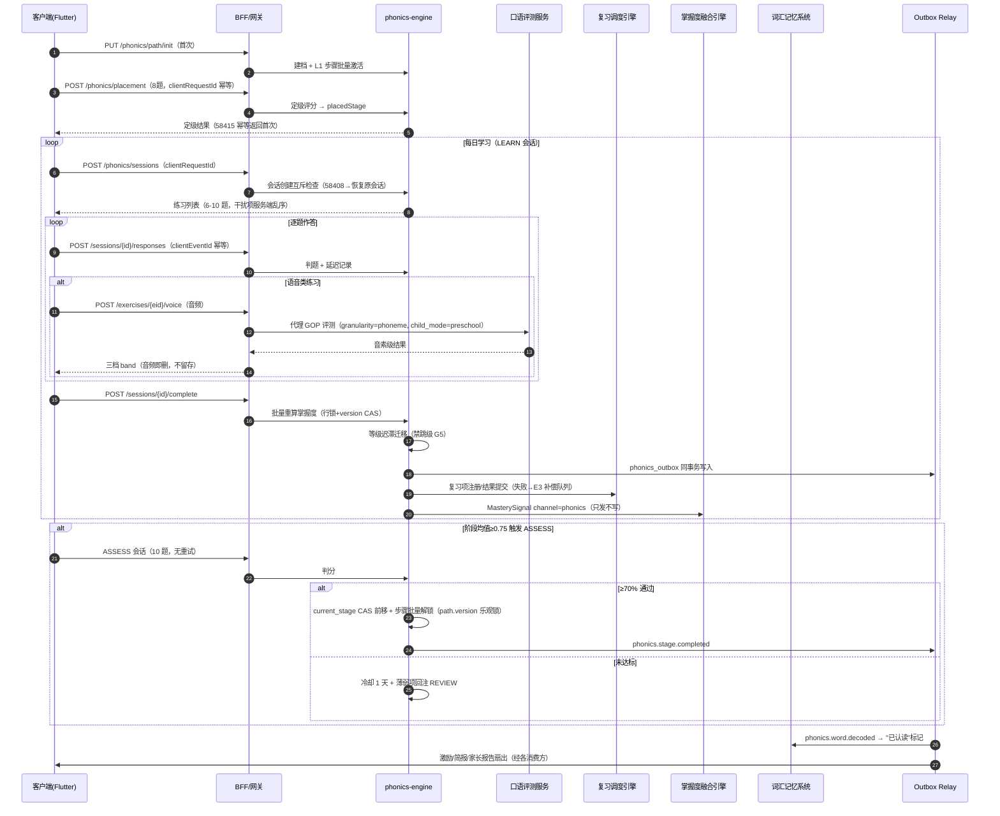

# 端到端流程设计 - 英语自然拼读启蒙完整链路 - 详细设计

> **文档版本**：v1.0（2026-09-22）
> **链路定位**：PrimeTop 英语自然拼读（Phonics）启蒙模块从"首次进入"到"阶段毕业"的完整端到端链路，覆盖 5-9 岁（幼儿大班～小学低年级）用户。
> **原始需求来源**：`docs/design/启硕-PrimeTop-全学段AI辅助学习软件项目设计文档.md` §5.1（幼儿启蒙阶段）、§5.2（小学阶段）、§6.5 对位模块（英语侧）
> **契约权威**：
> - 服务端契约 SSOT：《服务端-英语字母认知与自然拼读Phonics启蒙教学引擎-详细设计》（错误码 58400-58499、状态机、事件、DDL 本文不重复发明，仅引用）
> - 客户端契约 SSOT：《客户端-自然拼读学习页面架构与交互设计-详细设计》（路由 /phonics/*、客户端映射段 03600-03699、16 类渲染器矩阵）
> - 对位镜像链路：《端到端流程设计-拼音识字启蒙完整链路-详细设计》（语文侧同构链路，本文与其共享会话框架模板与编排规则风格）
> **错误码段**：服务端 58400-58499；客户端展示段 03600-03699
> **优先级**：P1（V1.5 阶段）

---

## 1. 链路概述

### 1.1 核心场景

| # | 场景 | 用户 | 说明 |
| --- | --- | --- | --- |
| S1 | 首次进入与定级建档 | 新用户（≥7 岁建议快测） | 路径初始化 + 8 题定级快测，确定起步阶段（默认 L1） |
| S2 | 字母名与字母音学习 | 3 岁+ | L1-L2 阶段 LEARN 会话：听音选字母 / 看字母选发音 / 听词选首音 |
| S3 | CVC 拼读 Blending | 3 岁+ | L3 阶段：tap（点读音素）→ slide（滑读）→ build（组词）三步递进 |
| S4 | 语音跟读评测 | 3 岁+ | 贯穿全阶段的 pronunciation_read / sentence_decode：GOP 音素级评测，幼儿端三档表情反馈 |
| S5 | 高频词闪认与可解码句 | 6 岁+ | L8-L10：sight_word_flash 限时应答、sentence_decode 句级朗读 |
| S6 | 每日复习 | 全阶段 | SM-2 委托的 MEMORIZATION 复习队列（上限 10 项），REVIEW 会话 |
| S7 | 阶段测试与门控推进 | 全阶段 | ASSESS 会话（10 题，无重试无提示）≥70% 解锁下一阶段，冷却 1 天防挫败 |
| S8 | 家长查看与干预 | 家长 | 混淆对 Top 列表、进阶题型开关、学情聚合（无音频留存） |
| S9 | 毕业与下游联动 | 系统 | L10 ASSESS 通过 → GRADUATED；已解码词事件同步词汇系统 |

### 1.2 链路全景时序



### 1.3 子链路划分与本文结构

| 子链路 | 章节 | 覆盖 API |
| --- | --- | --- |
| P0 定级与路径建档 | §2 | `PUT /path/init`、`POST /placement` |
| L01 字母名与字母音学习 | §3 | `POST /sessions`、`POST /responses`、`POST /complete` |
| L02 CVC 拼读 Blending | §4 | 同 L01 + blending 编排数据契约 |
| L03 语音跟读评测 | §5 | `POST /exercises/{eid}/voice`（评测代理） |
| L04 高频词与可解码句 | §6 | 同 L01 + 限时应答语义 |
| 复习与阶段门控 | §7 | `GET /review/today`、`POST /review/ack`、ASSESS 门控 |
| 跨链路编排/事件/守卫/补偿/验收 | §8-§15 | - |

**权威边界裁决（与服务端文档 §2.2 一致，本文不重复展开）：**

1. `user_phonics_item_mastery` 为字母/字母音/词族/高频词粒度掌握度 **SSOT**；知识点级掌握度以融合引擎 `unified_mastery` 为 SSOT，本链路**只发信号不写画像**。
2. GOP 评测不自建：统一代理调用口语发音评估服务，本引擎做代理 + 结果裁剪（幼儿端三档 band）。
3. 复习排程不自建：注册为 `MEMORIZATION` 复习项，SM-2 参数归复习调度引擎。

---

## 2. P0 - 入门定级与路径建档链路

### 2.1 业务流程

```
首次进入 /phonics/home
  │
  ├─ 本地无 phonics_path_initialized 标记
  │     └─ PUT /api/v1/phonics/path/init（body 可带 entryAssessment: true）
  │           ├─ 服务端：创建 user_phonics_path（L1 起步）+ L1 全部步骤 LOCKED→ACTIVE
  │           └─ 成功 → 客户端置标记
  │
  ├─ 用户 ≥7 岁 且 未完成定级（本地无 placement_done/placement_skipped）
  │     └─ 主 CTA 替换为定级引导（可跳过 → 记 placement_skipped=true，默认 L1）
  │
  └─ POST /api/v1/phonics/placement（8 题）
        ├─ 题型轮播：字母名选择 / 字母音听辨 / CVC 拼读 / 高频词闪认（各 2 题）
        ├─ 中途退出：不保存进度，下次全量重答（仅 8 题，无断点必要）
        └─ 服务端：scoreVector 评分 → placedStage → 发布 phonics.placement.done
              → 结果页动画 → 跳主页（当前阶段卡片更新）
```

**定级输入输出契约（服务端 §4.9 权威）：**

```json
// POST /api/v1/phonics/placement 请求
{
  "clientRequestId": "uuid-v4-每次进入快测生成一次",
  "answers": [
    { "questionNo": 1, "questionType": "letter_name_match", "itemId": 101, "answer": "B", "latencyMs": 3200 },
    { "questionNo": 2, "questionType": "letter_sound_match", "itemId": 205, "answer": "a", "latencyMs": 4100 }
  ]
}

// 响应
{
  "code": 0,
  "data": {
    "placedStage": "L3",
    "scoreVector": { "letterName": 0.83, "letterSound": 0.75, "blending": 0.50, "sightWord": 0.00 },
    "skipped": false,
    "placementVersion": 1
  }
}
```

### 2.2 幂等与冲突

| 场景 | 裁决 |
| --- | --- |
| 重复提交（弱网重放/双击） | `clientRequestId` 幂等窗口 15 分钟；重复提交返回 `58415`，**静默接受首次定级结果**，客户端不弹任何提示 |
| 同 key 不同 body | 视为冲突，返回首次定级结果（与作答幂等 58411 同语义） |
| 定级后 path/init 重放 | `uk_user(user_id)` 唯一键命中，幂等返回现有路径（不重建不重置进度） |

### 2.3 异常处理

| 异常 | 客户端 | 服务端 |
| --- | --- | --- |
| 快测提交超时/断网 | 本地暂存答案，恢复后按原 clientRequestId 重试（幂等保障）；超 15 分钟窗口则新 key 全量重答 | 超时 1.5s 不重试，直接返回 |
| init 失败（网络） | 保留未初始化标记，下次进入重试；主页展示骨架重试态 | - |
| 定级结果写路径失败（极端） | 结果页转错误态重试 | 定级与路径建档同事务，失败整体回滚，无半态 |

---

## 3. L01 - 字母名与字母音学习完整链路

### 3.1 业务流程

L1（Letter Names A-Z）与 L2（Letter Sounds A-Z）阶段的 LEARN 会话，题型三选（服务端按 §5.2 适配表投放）：

| 题型 | 交互 | 服务端判定 |
| --- | --- | --- |
| `letter_name_match` | 看字母选发音：3 个发音按钮（服务端下发乱序） | 选项命中 |
| `letter_sound_match` | 听音选字母：3 个大字母卡片 | 选项命中；首次播放标准发音后计时 latency |
| `initial_sound` | 听词选首音/首字母（cat → c） | 选项命中；考察音素意识而非字母形 |

**流程：**

```
主页"开始今日学习"
  → POST /sessions {stageCode:"L2", sessionType:"LEARN", clientRequestId}
      ├─ 命中进行中会话 → 58408 + 原会话句柄 → 客户端 PhonicsSessionPage 恢复
      ├─ 每日新学超限（仅新学池部分）→ 服务端自动降级为全复习组卷，不报错
      └─ 成功 → 返回练习列表（前 2 题固定复习项热身，新学项间插已掌握项微复习）
  → 逐题渲染（LetterNameMatchBoard / LetterSoundMatchBoard / InitialSoundBoard）
      → POST /sessions/{id}/responses {exerciseId, answer, latencyMs, clientEventId}
          ├─ 幼儿当场重试 1 次（attempt_no=2，二次通过折算 0.6）
          └─ 反馈层三档动效（TRY_AGAIN 永不出现 ✗ 图标）
  → 全部答完 → POST /sessions/{id}/complete
      → 批量重算掌握度（非逐题更新，降低写放大）
      → 跳 SessionReportPage（星星 + 三维度雷达缩略）
```

### 3.2 会话状态机（客户端镜像，服务端权威）

```
CREATED ──首题作答──> IN_PROGRESS ──全部答完──> COMPLETED
   │                      │
   └──30min 未开始──> EXPIRED
                          └──中途退出超 10min 未回（心跳缺失）──> ABANDONED（已答部分照常计掌握度）
```

**恢复矩阵：**

| 客户端重新进入时服务端状态 | 行为 |
| --- | --- |
| CREATED / IN_PROGRESS | 拉取已出题列表 + 进度，原位续答 |
| COMPLETED | 直接拉报告跳结算页（complete 幂等） |
| ABANDONED / EXPIRED | `58404` → 静默建新会话，旧会话已答部分已计掌握度不重复 |

### 3.3 API 对接

```
POST /api/v1/phonics/sessions
{ "stageCode": "L2", "sessionType": "LEARN", "clientRequestId": "uuid-v4" }
→ 200 { "sessionId": "...", "stageCode": "L2", "sessionType": "LEARN",
        "exercises": [ { "exerciseId": "ex_...", "type": "letter_sound_match",
                         "item": {...}, "options": [乱序], "retryAllowed": true } ],
        "expireAt": "..." }

POST /api/v1/phonics/sessions/{sessionId}/responses
{ "exerciseId": "ex_...", "answer": "b", "latencyMs": 2800,
  "attemptNo": 1, "clientEventId": "uuid-v4-每题每次作答唯一" }
→ 200 { "isCorrect": true, "correctAnswer": null,  // 幼儿端不回显答案防挫败
        "feedbackBand": "GOOD", "progress": { "answered": 3, "total": 8 } }
```

**关键语义：**

1. `options` 由**服务端乱序下发**，客户端不本地洗牌（防位置记忆刷题与多端顺序不一致）。
2. 幼儿端**不回显 correctAnswer**（feedbackBand 驱动三档动效），家长端报告才含明细。
3. `retryAllowed`：ASSESS 会话恒 false；LEARN/REVIEW 幼儿恒 true（当场重试 1 次）。

### 3.4 干扰项与混淆对（端到端闭环）

```
出题时 DistractorPicker(item, k=3)
  1) phx:confuse:active ZSET 取含该项的活跃混淆对（confusion_rate 降序，Top500）
  2) 无数据退兜底池：视觉相似组（b d p q / m n / u v w）与音近组（/ɛ/-/ɪ/-/eɪ/）
  3) 难度微调：mastery 高 → 优先高混淆率干扰；低 → 低混淆率（防挫败）
  4) 作答后命中干扰项写入 answer.distractor_ids
        │
        ▼
周任务混淆挖掘（sample≥200 且 rate>0.15 入活跃池；SEED 预置 7 组如 b/d 镜像）
        │
        ▼
家长端 GET /stats/confusion-matrix → Top 混淆对 + 辅导建议（如"b/d 可在沙盘中用手指比画区分"）
```

### 3.5 掌握度落库（会话完成事务内）

complete 触发批量重算（服务端 §5.5 权威公式，本文只锚定时序）：

```
事务内：
  1) SELECT ... FOR UPDATE 行锁逐 item 重算 mastery（三因子：acc 0.55 / gop 0.30 / fluency 0.15）
  2) 等级迟滞迁移（相邻档禁跳级；MASTERED 后单次答错不降级）
  3) level=4 首达 → mastered_at + 发布 phonics.item.mastered
  4) 复习项注册/结果提交（失败不阻断主流程 → E3 补偿队列，客户端收 58419 语义静默）
  5) 发 MasterySignal（channel=phonics，只发不写）
  6) phonics_outbox 同事务写入（session.completed 等）
  7) 路径版本检查（plan_version 变更 → 热迁移差量重算，见 §7.4）
```

### 3.6 异常处理

| 异常场景 | 客户端处理 | 服务端处理 |
| --- | --- | --- |
| 进行中重复建会话 | 收 58408 + 原会话句柄 → 恢复续答 | 返回原会话全量进度 |
| 会话过期（30min 未开始/过期） | 收 58404 → 静默建新会话 | EXPIRED 不结算 |
| 中途退出 >10min | 无感；家长面板可见中断记录 | ABANDONED，已答部分照常计掌握度 |
| 作答提交弱网重发 | 同 clientEventId 重试 | 幂等命中返回首次判定（同 key 不同体 58411） |
| 音频 CDN 失败 | 本地内置包兜底（L1-L3 随安装包） | D3 监控 |
| 内容下架（item status 变更） | 列表刷新跳过该项 | 会话内已出题照常判完，新会话不再出 |

---

## 4. L02 - CVC 拼读 Blending 完整链路（"Sound It Out"）

### 4.1 业务流程

L3 阶段核心链路，也是本模块与"单词卡"类产品的本质差异：**拼读而非死记**。

```
LEARN 会话中 BLENDING_WORD 项按掌握度递进投放：
  mastery <0.4   → blending_tap（分解点读：/k/ → /æ/ → /t/）
  mastery 0.4-0.7 → word_build（组词：拖拽/点选字母拼 cat）
  mastery >0.7   → word_to_picture / pronunciation_read（整词认读）
```

**blending_tap 三步教学法（客户端按服务端编排数据驱动）：**

```
第 1 步 TAP（单音）：依序点读 steps[]，顺序敏感——只能点当前步，
       点对播放该音素音频 + 高亮对应字母
第 2 步 SLIDE（滑读）：三步完成后自动播放 blendAudioKeys（ca → at 滑读示范）
第 3 步 BUILD/SAY（整词）：播放 wholeAudioKey 整词 → 可选跟读（录音条承接，
       跟读结果只加成不计负，GOP 链路见 §5）
tempo 随掌握度 SLOW → NORMAL 过渡
```

### 4.2 编排数据契约（服务端下发，客户端不自行拆词）

```json
{
  "exerciseId": "ex_8831",
  "type": "blending_tap",
  "item": { "grapheme": "cat", "phonemes": ["k", "æ", "t"], "pictureKey": "pic_cat" },
  "interaction": {
    "steps": [
      { "phoneme": "k", "audioKey": "p_k",  "highlight": "letters[0]" },
      { "phoneme": "æ", "audioKey": "p_ae", "highlight": "letters[1]" },
      { "phoneme": "t", "audioKey": "p_t",  "highlight": "letters[2]" }
    ],
    "blendAudioKeys": ["blend_ca", "blend_at"],
    "wholeAudioKey": "w_cat",
    "tempo": "SLOW"
  },
  "retryAllowed": true
}
```

**客户端判定职责边界：** 客户端只校验"依序完成三步点读"的交互完整性（顺序敏感），**不判发音对错**；发音判定全部归 §5 语音链路。word_build 的组词判定由服务端在 responses 提交时完成（选项/序列比对）。

### 4.3 判定与作答提交

```
POST /sessions/{id}/responses
{
  "exerciseId": "ex_8831",
  "type": "blending_tap",
  "answer": { "stepsCompleted": ["k","æ","t"], "blendListened": true, "followupVoiceRef": null },
  "latencyMs": 9200,
  "attemptNo": 1,
  "clientEventId": "uuid-v4"
}
→ 200 { "isCorrect": true, "feedbackBand": "GOOD", "progress": {...} }
```

| 判定项 | 规则 |
| --- | --- |
| 交互完整性 | stepsCompleted 顺序与 phonemes 一致（顺序敏感） |
| blendListened | 滑读示范已播放（客户端上报，防跳过直接蒙整词） |
| 当场重试 | 幼儿允许重试 1 次（attempt_no=2，折算 0.6） |
| 跟读加成 | followupVoiceRef 回填后 GOP≥band 阈值 → accFactor 加权 +0.05 封顶，**不计负** |

### 4.4 已解码词事件（跨系统扇出）

BLENDING_WORD 项 level=4（整词认读掌握）→ 发布 `phonics.word.decoded`：

```
payload: { "wordId": 5001, "vocabWordId": 88021, "word": "cat", "userId": ..., "grapheme": "cat" }
消费方：英语词汇记忆系统
  → 单词本"已认读"标记（该词不再列入生词优先级）
  → 词汇系统反向消费 vocab.word.added 回填 vocab_word_id 关联
红线：本链路只输出"已解码"事实，不做单词释义/拼写听写（归属词汇模块）
```

### 4.5 异常处理

| 异常场景 | 客户端处理 | 服务端处理 |
| --- | --- | --- |
| 内置音频缺失（未内置的新词） | 预加载引擎提前拉 CDN；失败转骨架重试态 | D3 告警 |
| 滑读条手势误触（3-6 岁） | 3-6 岁提供"自动滑读"替代路径（点一次播完整滑读） | 无（交互层裁决） |
| 组词拖拽超出精度（3-6 岁） | 3-6 岁 word_build 强制点选模式，7 岁+ 才启用拖拽 | 年龄门控 58418（题型级） |
| stepsCompleted 乱序提交（篡改） | 客户端不可能产生 | 服务端校验顺序，不一致按未通过计（不报错，防挫败） |

---

## 5. L03 - 语音跟读评测完整链路（GOP 代理）

### 5.1 业务流程

贯穿全阶段的 pronunciation_read（字母音/词）与 sentence_decode（可解码句）共用本链路：

```
VoiceRecorderBar 长按 300ms 开始录音（防误触）
  → 松开结束（最长 15s，客户端预检格式/时长）
  → POST /api/v1/phonics/exercises/{exerciseId}/voice（multipart 音频）
      │
      ▼
  phonics-engine 评测代理：
    1) 额度预检（幼儿每日跟读次数，Lua 原子扣减 → 不足 58412）
    2) 防沉迷二次校验（fail-secure，不可绕过）
    3) 代理调用 POST /api/v1/oral/pronunciation/evaluate
         referenceText = item.grapheme
         granularity = phoneme（句子类 sentence）
         child_mode = preschool（儿童声学模型路由）
       超时 1.5s 不重试（幼儿等待体验优先）
    4) 结果裁剪：幼儿端只出三档 band（GOOD ≥0.80 / OK ≥0.60 / TRY_AGAIN），
       不透出音素级分数明细；音素错标记仅服务端留存（供混淆对挖掘）
    5) 音频即传即删（不留存红线），GOP 分数与音素标记为派生统计
      │
      ▼
  响应回填：200 { "band": "GOOD", "gopScore": 0.0 不返, "degraded": false }
  客户端：三档动效 + 语音反馈（服务端文案键，EN 主 CN 辅）
```

**异步回填语义：** 作答提交与语音评测解耦——responses 提交时语音类练习可先交交互结果，voice 结果回来后**异步 PATCH 回填**（同 exerciseId 关联）；GOP 缺口按 §5.5 权重让渡（gopFactor 中性 0.5，accFactor 权重升至 0.85），**丢分不丢进度**。

### 5.2 额度与降级矩阵

| 场景 | 错误码 | 客户端 | 服务端 |
| --- | --- | --- | --- |
| 今日跟读次数用完 | 58412 | 家长端文案："今日跟读次数用完，明天再来"；幼儿端中性提示转点读 | Lua 原子扣减 `phx:user:{uid}:daily:{date}` |
| 评测服务不可用 | 58413 | "我们先练点读，跟读稍后再试"（降级 D2） | 转点读模式：pronunciation_read → letter_sound_match，中性 band 放行 |
| 录音格式/时长非法 | 58414 | "重新录"（客户端预检后不应出现） | 校验失败不入库 |
| 评测超时（1.5s） | 同 58413 语义 | 同 D2 | 不重试，直接降级 |
| 额度引擎故障 | -（D9） | 幼儿学段 fail-open（放行并记 quota_degraded） | 事后对账修正 |

### 5.3 混淆对挖掘闭环（评测数据的唯一用途）

```
音素错标记（如 /b/ 读成 /d/）+ answer.distractor_ids
  → ClickHouse 诊断仓（phonics_response 归档，TTL 3 年）
  → 周任务：同对样本≥200 且混淆率>0.15 → phonics_confusion_pair MINED 入库
  → phx:confuse:active ZSET 重建（Top500）
  → 反哺两件事：
     a) 干扰项生成（§3.4 优先采用）
     b) 家长端混淆矩阵辅导建议
红线：挖掘只消费统计标记，音频原文不可复原、不入训练集
```

### 5.4 异常处理

| 异常场景 | 处理 |
| --- | --- |
| 录音上传断网 | 客户端离线队列缓存，恢复后补传（每请求独立幂等键）；超 10 分钟会话过期则丢弃该题语音，交互分保留 |
| 会话已结束仍上传语音 | 58405 静默丢弃 |
| 评测结果回填时会话已 complete | GOP 计入下次重算的 gopFactor（近 5 次窗口），不推翻已发报告 |
| 儿童声学模型路由失败 | 回退通用模型 + degraded=true 标记，band 阈值不变（对齐幼儿语音适配引擎） |

---

## 6. L04 - 高频词闪认与可解码句完整链路

### 6.1 业务流程

L8-L10 阶段：SIGHT_WORD（Dolch 高频词）与 SENTENCE（可解码句）。

```
sight_word_flash（闪认）：
  整词展示 3s（幼儿端隐藏计时器，仅服务端计时）
  → 选项：发音匹配 / 词形匹配（服务端按 mastery 选）
  → 服务端判分 + latency 记录（fluencyFactor 数据源）
  → 分龄硬规则：3-6 岁隐藏计时器无时间压力；7 岁+ 显示温和倒计时

sight_word_spell（拼写排序）：
  仅 7 岁+ 或家长"进阶开关"显式开启（58418 门控）
  → 拖拽/点选字母排序 → 服务端序列比对

sentence_decode（可解码句朗读）：
  句子展示 + 录音条 → 走 §5 GOP 句级链路（granularity=sentence）
  → 三档 band + 句子内已解码词高亮
```

### 6.2 API 对接

复用 L01 三组 API（sessions/responses/complete），补充 SIGHT_WORD 题型作答载荷：

```json
{
  "exerciseId": "ex_9021",
  "type": "sight_word_flash",
  "answer": { "matched": "the", "latencyMs": 1800 },
  "attemptNo": 1,
  "clientEventId": "uuid-v4"
}
```

### 6.3 掌握度与复习注册

- SIGHT_WORD 为 MEMORIZATION 复习项首注册对象（首次作答即注册，比 mastered 更早进入遗忘曲线）。
- `POST /api/v1/review/items`：`item_type=MEMORIZATION`、`item_source_id=phonics_item.id`、`difficulty_tier=item.difficulty_tier`；唯一键 `(user_id, MEMORIZATION, item_source_id)`，重复注册返回已存在（G13）。
- 60 天未接触自动衰减（服务端 §5.5 迟滞与衰减任务），衰减后由复习链路按 SM-2 重排，**不即时降级抹掉 mastered_at**。

### 6.4 异常处理

| 异常场景 | 处理 |
| --- | --- |
| 限时应答中幼儿停留过久 | 不判负（fluencyFactor 只识别 >P90 超长犹豫标记 hesitation，供诊断不计负） |
| 高频词图片缺失 | 词形卡兜底（sight word 本就要求"见词即读"脱离图片） |
| 句级 GOP 整句失败 | band=TRY_AGAIN + 分词慢读引导（拆分已掌握词重试一次，attempt_no=2） |

---

## 7. 复习链路与阶段门控

### 7.1 每日复习队列

```
GET /api/v1/phonics/review/today
→ 200 { "items": [ { "itemId": ..., "grapheme": "b", "itemType": "LETTER_SOUND",
                     "dueReason": "DUE|WEAK|CONFUSION", "confusionPair": null } ],
        "total": 4, "cap": 10 }

客户端 /phonics/review → 直接创建 REVIEW 会话（sessionType=REVIEW）
  → 全部来自复习池，题型优先选该 item 历史错误率最高的题型
  → 完成 → 服务端按 §5.7 quality 映射批量提交 SM-2 结果
POST /api/v1/phonics/review/ack   # 批量确认已复习（会话完成时服务端自动调用，兜底手动）
```

**规则：**

| 规则 | 说明 |
| --- | --- |
| 上限 | 每日复习队列 cap=10，防过量 |
| 复习不限额 | 每日新学上限（58409）只管 LEARN 新学池，REVIEW 不受限 |
| 注册失败补偿 | 复习引擎不可用 → 58419 语义，静默入补偿队列（E3），不阻断主流程 |
| D4 降级 | 复习调度引擎不可用 → 本模块内存队列临时排程（到期项 Redis ZSET 快照），恢复后补注册 |

### 7.2 ASSESS 阶段测试与门控推进

**触发：** 会话完成时重算当前阶段掌握度均值 ≥ `minStageMastery`（默认 0.75）→ 今日任务自动投放 ASSESS 会话卡。

```
ASSESS 会话：阶段内全量 item 均匀随机 10 题，固定类型池（match/build/decode）
  ├─ 无重试（retryAllowed=false）、无提示、无复习混排
  └─ 完成判定：
        ≥ assessPassLine（0.70）
          → user_phonics_path.current_stage CAS 前移（携带 path.version 乐观锁）
          → 下一阶段步骤批量 LOCKED→ACTIVE
          → 发布 phonics.stage.completed（激励中心阶段勋章、家长报告、首页任务调度）
        < 0.70
          → 保持当前阶段，ASSESS 冷却 1 天（防挫败循环）
          → 薄弱项自动回注 REVIEW 队列（优先到期）
```

**门控守卫：**

| 守卫 | 规则 |
| --- | --- |
| G9 | ASSESS 无重试无提示，冷却期内（1 天）重复进入只返回冷却提示，不出题 |
| G2 | 阶段推进 CAS 携带 path.version，与教研调版并发冲突时 58416 → 客户端静默重读路径后重试 |
| 越级封锁 | 前置阶段 ASSESS 未通过时，下一阶段 bundle 接口返回 58402（客户端地图锁形展示） |

### 7.3 毕业

L10 ASSESS 通过 → `user_phonics_path.status=GRADUATED`（finished_at 落库）→ 主页阶段地图全通展示 → 学习任务调度引擎停止投递拼读任务卡 → 掌握度行保留（不清数据），60 天衰减任务继续运行供复习回顾。

### 7.4 路径版本迁移（教研调版）

`phonics_stage` 调整 → `plan_version+1` → 热迁移任务：已通过项按 `grapheme` 比对映射保留状态；新增项插入 LOCKED 排前向位置；删除项步骤转 SKIPPED 且掌握度行保留。迁移与学生学并发由 G2 乐观锁裁决。

---

## 8. 跨链路编排规则

1. **L02 拼读词准入：** BLENDING_WORD 仅由"构成字母的 LETTER_SOUND 项 path_step=PASSED（或 mastery≥0.8）"的词组成；未达标字母构成的词在词库标记 `decodable_blocked`，练习生成器不采（对齐拼音链路"L02 只推双掌握组合"同款规则）。
2. **L03 跟读优先弱项：** pronunciation_read 的复习池优先取 `dueReason=CONFUSION`（混淆对弱项）项；无弱项时按 step_seq 顺序。
3. **L04 准入门控：** SIGHT_WORD 阶段（L8）解锁以 L3 CVC 阶段 ASSESS 通过为前置（unlock_rule.prereqStage），保证"先解码后整词"。
4. **亲子时长统一门控：** 所有写接口（sessions/responses/voice/complete）经 BFF 统一校验亲子共学时长余额；耗尽返回全局门控码，会话置 ABANDONED（已完成部分照常结算）。
5. **入口卡片联动：** `plan.task.completed`（外部来源）事件消费仅打勾首页任务卡，**不产生掌握度信号**（服务端 §9.4 红线）。

---

## 9. 事件扇出矩阵

| 事件 | 时机 | 关键消费方与用途 |
| --- | --- | --- |
| `phonics.placement.done` | 定级完成 | 学情分析（冷启动画像）、家长报告 |
| `phonics.session.completed` | 会话完成 | 埋点平台、学情简报、激励中心（星星） |
| `phonics.stage.completed` | ASSESS 通过 | 激励中心（阶段勋章）、家长报告、首页任务调度 |
| `phonics.item.mastered` | 单项 level=4 | 复习引擎（确认注册）、掌握度融合（信号转换） |
| `phonics.word.decoded` | BLENDING_WORD 掌握 | 词汇记忆系统（已认读标记、生词降权） |

**投递契约：** 统一信封 `{eventId, eventType, occurredAt, aggregateId, payload}`，经 `phonics_outbox` 与业务**同事务**写入；消费幂等键 `(eventId)`；Relay 指数退避 1/2/4/8/16/30min 共 6 次后 DEAD + 告警（E9）。

**掌握度信号（非事件，独立通道）：** 会话完成时向 `mastery.signal.ingest` 发 `MasterySignal`（`channel="phonics"`，权重 0.85）；ASSESS 完成按 kp 聚合发 `selfConfidence=0.95`。**只发不写**（G12）。

---

## 10. 守卫总表（G1-G14）

| # | 守卫 | 违反后果/裁决 |
| --- | --- | --- |
| G1 | 仅 `ACTIVE` 步骤项可入新学池；`PASSED` 项只能经复习池回流 | 生成器过滤，不可配置绕过 |
| G2 | 步骤迁移与阶段推进携带 `path.version` 乐观锁 | 冲突 58416，重读后重试 |
| G3 | `COMPLETED` 后拒一切作答/语音提交（58405）；重复 complete 幂等返回首份报告 | 静默丢弃 |
| G4 | 防沉迷硬顶 fail-secure：全局引擎判定时长到顶 → 会话 ABANDONED（reason=SCREEN_TIME），**不得以任何降级路径绕过** | 对齐多源任务调度引擎降级总红线 |
| G5 | 掌握度等级只相邻档迁移禁跳级；MASTERED 单次失误不即时降级，60 天衰减统一下调 | 迟滞阈值表裁决 |
| G6 | 会话创建互斥：同用户存在 CREATED/IN_PROGRESS 会话时重复创建返回 58408 + 原会话句柄 | 多端双开以服务端为准 |
| G7 | 每日新学上限 Lua 原子扣减（幼儿 5/小学低年级 8），仅约束新学池，复习不限 | 58409 幼儿端正向文案 |
| G8 | 语音音频即传即删不留存；幼儿端不透出音素级分数明细 | 合规红线，见 §13 |
| G9 | ASSESS 无重试无提示；未达标冷却 1 天，冷却期不出题 | 防挫败循环 |
| G10 | 作答幂等双层：Redis SETNX 10min + DB `uk_client_event`；同 key 不同体返回首次判定 | 58411 |
| G11 | 分龄题型硬门控：3-6 岁仅点选/语音练习；letter_trace/sight_word_spell/word_family_sort 仅 7 岁+或家长显式开启 | 58418 |
| G12 | 掌握度信号只发不写：`unified_mastery` 归融合引擎 SSOT | 禁止直连写接口 |
| G13 | 复习项注册唯一键 `(user_id, MEMORIZATION, item_source_id)`，重复注册返回已存在 | 幂等 |
| G14 | 定级幂等：clientRequestId 15 分钟窗口，重复提交返回首次定级 | 58415 静默接受 |

---

## 11. 异常补偿矩阵（E1-E12）

| # | 异常 | 补偿机制 | 对账 |
| --- | --- | --- | --- |
| E1 | 58408 进行中重复建会话 | 返回原会话句柄恢复续答 | - |
| E2 | 58404 会话过期 | 客户端静默建新会话，旧已答部分已计掌握度 | - |
| E3 | 复习项注册失败（58419） | 入补偿队列，恢复后补注册；REVIEW 结果批量补交 | 每日 04:30 对账 |
| E4 | 评测不可用（D2） | 转点读模式，中性 band 放行，GOP 缺口权重让渡 | 丢分不丢进度核对 |
| E5 | complete 重复提交（58407） | 幂等返回首份报告 | - |
| E6 | 作答提交最终失败（弱网） | 客户端本地持久化，恢复后按 clientEventId 重放 | DB 唯一键兜底 |
| E7 | 激励中心不可用（D7） | 星星本地暂计，报告标 stars_pending，Outbox 重投 | Relay DEAD 告警 |
| E8 | 额度引擎故障（D9） | 幼儿 fail-open 记 quota_degraded；对账任务修正 | 日终对账 |
| E9 | Outbox 投递失败 | 指数退避 6 次后 DEAD + P2 告警人工介入 | Relay 监控 |
| E10 | 定级重复提交（58415） | 幂等返回首次定级 | - |
| E11 | 多端并发 complete 竞态（手机+平板同会话） | 掌握度行锁先到者胜，后到者幂等返回 | 行锁串行天然裁决 |
| E12 | ASSESS 未达标 | 薄弱项自动回注 REVIEW 优先到期 + 冷却 1 天 | - |

**对账任务：** 每日 04:30 以 DB 重算覆盖 Redis `phx:user:{uid}:daily:{date}`（时区以用户画像为准）；`phonics_daily_progress.learn_sec` 与防沉迷全局引擎时长对账（防沉迷以全局引擎为 SSOT，本表仅对账用）。

---

## 12. 埋点与监控

### 12.1 埋点事件（客户端）

| 事件 | 触发 | 关键参数 |
| --- | --- | --- |
| phx_home_view | 主页曝光 | stageCode, todayNew, todayReview |
| phx_session_start | 会话创建成功 | sessionId, stageCode, sessionType, exerciseCount |
| phx_exercise_answer | 每题作答 | type, isCorrect, attemptNo, latencyMs |
| phx_voice_result | 跟读回填 | band, degraded |
| phx_session_complete | 结算曝光 | accuracy, stars, firstTryCorrect |
| phx_placement_done | 定级完成 | resultStage, skipped |
| phx_exit_mid_session | 中途退出 | answered, total, staySec |
| phx_parent_view | 家长面板曝光 | （家长身份独立会话） |

Schema 注册走统一埋点平台，事件名/参数以注册中心为 SSOT。

### 12.2 服务端监控指标

| 指标 | 告警阈值（初值） |
| --- | --- |
| 会话完成率（complete/创建） | <70% 连续 3 天 P2（排查防挫败/流失） |
| ASSESS 一次通过率 | <40% 或 >95% 持续 1 周 P2（阈值偏离教研预期） |
| 语音评测降级率（D2 触发占比） | >5% P1（口语评测服务容量） |
| 混淆对挖掘周任务产出 | 0 新对连续 2 周 P3（样本量或算法检查） |
| Outbox DEAD 积压 | >0 P2 |
| 每日新学上限触发率 | >30% P3（上限可能过紧） |
| 复习队列到期积压 | >1000 项 P2（复习调度引擎联动） |

容量锚点（DAU 50 万、拼读渗透 8%=4 万日活）：响应记录月增约 1 亿行，按月分区、在线 12 个月，CH 归档 TTL 3 年；单实例支撑详见服务端 §11.2。

---

## 13. 合规红线（C1-C8）

| # | 红线 | 执行点 |
| --- | --- | --- |
| C1 | **语音音频不留存**：录音即传即删，仅 GOP 分数与音素错标记（不可复原音频）留存 | 评测代理层硬编码，无配置开关 |
| C2 | 幼儿端**不透出分数/排名/音素明细**，三档 band + 正向文案为唯一反馈形态 | BFF 响应裁剪（幼儿端响应体精简） |
| C3 | 全链路无 ✗/红错/负面标签；TRY_AGAIN 永不与 ✗ 同屏 | 客户端渲染规范 |
| C4 | 无外链/广告/UGC/营销内容注入 | 模块白名单 |
| C5 | 防沉迷硬顶不可绕过（G4），单会话 ≤10 分钟 | 全局引擎 + 服务端双检 |
| C6 | 混淆矩阵与学情数据仅家长绑定关系可见；学生端无对比排名 | 家长门校验 |
| C7 | 挖掘数据禁入第三方模型训练；PII 最小化 | 数据血缘与供应商协议 |
| C8 | 账户注销：掌握度概要随 PortfolioDataPack 导出，明细 180 天物理清除 | 统一注销服务联动 |

---

## 14. 契约对齐表

| 对齐方 | 关键裁决 |
| --- | --- |
| 服务端引擎文档（SSOT） | 错误码 58400-58499、状态机、DDL、事件信封、掌握度公式、降级 D1-D10 本文全部引用不复制发明 |
| 客户端页面文档（SSOT） | 路由 /phonics/*、03600-03699 映射、16 类渲染器、防误触 300ms/88dp、埋点事件名 |
| 拼音识字启蒙 E2E（镜像） | 会话框架模板、编排规则风格、验收场景结构同构；两模块不共享业务表 |
| 复习调度引擎 | MEMORIZATION 项 SSOT 归复习引擎；本链路注册+提交结果，不排程 |
| 掌握度融合引擎 | unified_mastery SSOT；本链路 channel=phonics 权重 0.85 信号，只发不写 |
| 口语发音评估服务 | GOP 评测权威；本链路代理+裁剪，1.5s 超时 |
| 词汇记忆系统 | word.decoded 单向输出已解码词；vocab.word.added 反向回填关联 |
| 防沉迷/亲子共学 | 时长硬顶 fail-secure；亲子余额 BFF 统一门控 |
| 多源任务调度引擎 | 首页任务卡投递与打勾联动；不产生掌握度信号 |

---

## 15. 验收场景

| 编号 | 场景 | 预期 |
| --- | --- | --- |
| A1 | 新用户首入主页 | 自动 path/init 建档，L1 步骤 ACTIVE；≥7 岁主 CTA 变定级引导 |
| A2 | 定级 8 题提交后弱网重发 | 58415 幂等，返回首次 placedStage，不重复建档 |
| A3 | 定级中途退出再进 | 全量重答，无断点恢复 |
| A4 | 跳过定级 | 默认 L1 起步，本地记 placement_skipped，不再强制弹窗 |
| A5 | LEARN 会话首题作答 | 会话 CREATED→IN_PROGRESS，首 2 题为复习热身项 |
| A6 | 进行中在平板上重复创建会话 | 58408 + 原会话句柄，平板恢复续答与手机进度一致 |
| A7 | 幼儿 letter_sound_match 首次答错 | retryAllowed=true，重试通过按 0.6 折算计入 accFactor |
| A8 | 当日新学第 6 项（幼儿上限 5） | 58409 或自动全复习组卷；REVIEW 不受限 |
| A9 | blending_tap 乱序点读提交 | 服务端判未通过，不报错，可当场重试 |
| A10 | blending 词 level=4 | 发 phonics.item.mastered + phonics.word.decoded，词汇系统已认读标记 |
| A11 | 跟读 GOP 0.85 | band=GOOD 三档动效，响应不含音素明细 |
| A12 | 评测服务宕机 | 58413 → D2 点读模式中性放行，GOP 缺口权重让渡，进度不丢 |
| A13 | 录音上传断网 8 分钟后恢复 | 离线队列补传成功，GOP 回填该题 |
| A14 | 会话中途退出 15 分钟 | ABANDONED，已答部分计掌握度，家长面板可见中断记录 |
| A15 | 阶段均值 0.78 触发 ASSESS 得 0.72 | 通过，current_stage CAS 前移，下一阶段步骤解锁，stage.completed 扇出三方各一次 |
| A16 | ASSESS 得 0.55 | 冷却 1 天，薄弱项回注 REVIEW 优先到期 |
| A17 | 冷却期内重复进入 ASSESS | G9 拦截，返回冷却提示，不出题 |
| A18 | 防沉迷硬顶时正在会话中 | 全局收束 UI，服务端 ABANDONED reason=SCREEN_TIME，已完成部分正常结算 |
| A19 | L10 ASSESS 通过 | GRADUATED，任务卡停止投递，掌握度行保留 |
| A20 | 注销账户 | PortfolioDataPack 含掌握度概要，明细 180 天物理清除 |

---

## 16. 维护记录

| 版本 | 日期 | 变更 |
| --- | --- | --- |
| v1.0 | 2026-09-22 | 初版。补齐《服务端-英语字母认知与自然拼读Phonics启蒙教学引擎》§13.4 与《客户端-自然拼读学习页面架构与交互设计》§15 共同标注的"端到端链路（后续批次）"空缺。覆盖：P0 定级建档（§2）、L01 字母名与字母音（§3）、L02 CVC Blending 三步教学法（§4）、L03 语音跟读 GOP 代理链路（§5）、L04 高频词与可解码句（§6）、复习与 ASSESS 阶段门控（§7）、跨链路编排 5 规则（§8）、事件扇出矩阵（§9）、守卫 G1-G14（§10）、异常补偿 E1-E12 与 04:30 对账（§11）、埋点 8 事件与 7 监控指标（§12）、合规红线 C1-C8（§13）、契约对齐 9 项（§14）、验收场景 20 条（§15）。全部 API/错误码/状态机/事件与两端 SSOT 文档对齐，未发明新语义 |
