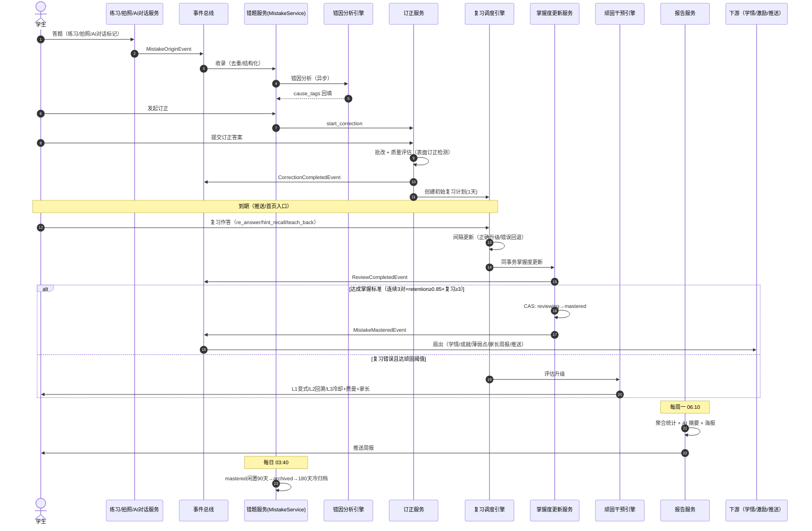

# 端到端流程设计：错题整理与复习巩固完整链路

> 本文档描述 PrimeTop 错题从产生到最终掌握的完整端到端链路，串联拍照搜题、练习答题、AI 辅导、错题收录、错因分析、订正流程、复习调度、掌握度更新、顽固错题干预、错题报告生成等全环节，为开发人员提供可编码的集成设计。

## 1. 链路总览

### 1.1 全局阶段划分

```
┌─────────────────────────────────────────────────────────────────────────────┐
│                        错题整理与复习巩固完整链路                              │
│                                                                             │
│  P1 错题产生      P2 错题收录        P3 订正与复习      P4 掌握与归档       │
│  ┌─────────┐    ┌──────────┐     ┌──────────────┐   ┌──────────────┐       │
│  │拍照搜题  │───▶│错题识别   │────▶│ 订正执行     │──▶│ 掌握度更新    │       │
│  │练习答题  │    │结构化解析 │     │ 遗忘曲线复习  │   │ 顽固错题干预  │       │
│  │AI辅导   │    │错因分析   │     │ 间隔重复调度  │   │ 错题报告生成  │       │
│  │手动录入  │    │分类归档   │     │ 订正效果评估  │   │ 周期性归档    │       │
│  └─────────┘    └──────────┘     └──────────────┘   └──────────────┘       │
│                                                                             │
│  事件流：错题收录事件 → 订正完成事件 → 复习完成事件 → 掌握度变更事件           │
└─────────────────────────────────────────────────────────────────────────────┘
```

### 1.2 阶段与关键服务映射

| 阶段 | 核心服务 | 协作服务 |
|------|---------|---------|
| P1 错题产生 | 拍照搜题服务、练习测评服务、AI辅导服务 | OCR服务、批改引擎、题目服务 |
| P2 错题收录 | 错题服务(MistakeService) | 知识点服务、题库服务、错因分析引擎 |
| P3 订正与复习 | 错题订正服务、复习调度引擎 | 遗忘曲线算法、答案管控引擎、AI辅导服务 |
| P4 掌握与归档 | 掌握度服务(MasteryService)、错题报告服务 | 学习画像服务、用户标签引擎、通知服务 |

### 1.3 核心数据流

```
用户答题 → 答题记录(AnswerRecord) → 错误判定 → 错题记录(MistakeRecord) 
    → 错因标签(MistakeCauseTag) → 订正记录(CorrectionRecord)
    → 复习计划(ReviewSchedule) → 复习执行记录(ReviewAttempt)
    → 掌握度快照(MasterySnapshot) → 错题状态变更(MistakeStatus)
```

---

## 2. P1 错题产生阶段

### 2.1 错题来源入口

错题有 5 种产生来源，每种来源有不同的触发机制和数据丰富度：

| 来源 | 触发方式 | 自动/手动 | 数据丰富度 |
|------|---------|----------|-----------|
| 拍照搜题 | 用户点击"加入错题本" | 手动 | 高（有原图、OCR文本、AI解析） |
| 练习答题 | 答题结果判定为错误 | 自动 | 高（有完整答题过程、用时、选项） |
| 考试模拟 | 考试结束批量收录错题 | 自动+手动确认 | 高（有完整试卷上下文） |
| AI辅导对话 | 用户在AI对话中标记错题 | 手动 | 中（有对话上下文、知识点） |
| 手动录入 | 用户手动拍照/输入题目 | 手动 | 低（仅原图或文本） |

### 2.2 统一错题产生事件协议

所有来源通过统一的领域事件进入错题收录管线：

```python
# 错题产生事件协议
class MistakeOriginEvent(BaseModel):
    """错题产生事件 - 所有来源统一格式"""
    event_id: str = Field(description="事件唯一ID，格式：moe_{source}_{timestamp}_{rand}")
    event_type: Literal[
        "photo_answer_wrong",       # 拍照搜题发现错题
        "practice_answer_wrong",    # 练习答题错误
        "exam_answer_wrong",        # 考试答题错误
        "ai_dialog_mark",           # AI对话中手动标记
        "manual_entry",             # 手动录入
    ]
    user_id: int
    student_profile_id: int
    timestamp: datetime
    
    # 题目信息（必填）
    question_id: int | None = Field(default=None, description="题库题目ID（题库题目时有值）")
    question_content: str = Field(description="题目内容（文本）")
    question_images: list[str] = Field(default_factory=list, description="题目图片URL列表")
    question_type: str = Field(description="题型：choice/fill/short_answer/essay/calculation")
    subject_code: str = Field(description="学科编码")
    
    # 来源上下文（选填）
    source_session_id: str | None = Field(default=None, description="来源会话ID（AI对话/拍照/练习会话）")
    user_answer: str | None = Field(default=None, description="用户答案")
    correct_answer: str | None = Field(default=None, description="正确答案")
    ai_analysis: str | None = Field(default=None, description="AI解析内容")
    
    # 元数据
    grade_code: str = Field(description="年级编码")
    textbook_id: int | None = Field(default=None, description="教材版本ID")
    chapter_ids: list[int] = Field(default_factory=list, description="关联章节ID列表")
    knowledge_point_ids: list[int] = Field(default_factory=list, description="知识点ID列表")
    difficulty: float | None = Field(default=None, description="题目难度（0-1）")
    
    # 来源特有数据
    source_metadata: dict = Field(default_factory=dict, description="来源特有元数据")
```

### 2.3 各来源事件生成器

#### 2.3.1 拍照搜题来源

```python
class PhotoMistakeEventGenerator:
    """拍照搜题错题事件生成器"""
    
    async def generate_from_photo_session(
        self, 
        session_id: str,
        user_id: int,
        photo_context: PhotoSessionContext,
    ) -> MistakeOriginEvent:
        """
        从拍照搜题会话生成错题事件
        
        场景：用户在拍照搜题结果页点击"加入错题本"
        数据丰富度：高（有原图、OCR文本、AI解析、知识点标注）
        """
        # 获取拍照搜题会话完整上下文
        session = await self.photo_service.get_session_detail(session_id)
        question = session.matched_question
        
        return MistakeOriginEvent(
            event_id=f"moe_photo_{int(time.time())}_{uuid4().hex[:6]}",
            event_type="photo_answer_wrong",
            user_id=user_id,
            student_profile_id=photo_context.student_profile_id,
            timestamp=datetime.utcnow(),
            question_id=question.id if question else None,
            question_content=session.ocr_text,
            question_images=[session.original_image_url],
            question_type=session.question_type or "unknown",
            subject_code=photo_context.subject_code,
            source_session_id=session_id,
            user_answer=None,  # 拍题场景通常无用户答案
            correct_answer=question.correct_answer if question else None,
            ai_analysis=session.ai_analysis,
            grade_code=photo_context.grade_code,
            textbook_id=photo_context.textbook_id,
            chapter_ids=session.chapter_ids,
            knowledge_point_ids=session.knowledge_point_ids,
            difficulty=question.difficulty if question else None,
            source_metadata={
                "ocr_confidence": session.ocr_confidence,
                "match_type": session.match_type,  # fingerprint/vector/es
                "match_score": session.match_score,
                "original_image_url": session.original_image_url,
                "cropped_image_url": session.cropped_image_url,
            }
        )
```

#### 2.3.2 练习答题来源

```python
class PracticeMistakeEventGenerator:
    """练习答题错题事件生成器"""
    
    async def generate_from_practice_answer(
        self,
        answer_record_id: int,
        practice_session_id: str,
        user_id: int,
    ) -> MistakeOriginEvent:
        """
        从练习答题记录自动生成错题事件
        
        场景：答题批改结果为"错误"时自动触发
        数据丰富度：高（有完整答题过程、用时、选项、批改详情）
        """
        answer = await self.practice_service.get_answer_record(answer_record_id)
        question = await self.question_service.get_question(answer.question_id)
        
        # 判定是否需要收录：不是所有错题都自动收录
        if not self._should_auto_collect(answer, question):
            return None
        
        return MistakeOriginEvent(
            event_id=f"moe_practice_{int(time.time())}_{uuid4().hex[:6]}",
            event_type="practice_answer_wrong",
            user_id=user_id,
            student_profile_id=answer.student_profile_id,
            timestamp=datetime.utcnow(),
            question_id=question.id,
            question_content=question.content_text,
            question_images=question.image_urls,
            question_type=question.question_type,
            subject_code=question.subject_code,
            source_session_id=practice_session_id,
            user_answer=answer.user_answer,
            correct_answer=question.correct_answer,
            ai_analysis=None,  # 练习场景通常无AI解析
            grade_code=answer.grade_code,
            textbook_id=answer.textbook_id,
            chapter_ids=question.chapter_ids,
            knowledge_point_ids=question.knowledge_point_ids,
            difficulty=question.difficulty,
            source_metadata={
                "practice_mode": answer.practice_mode,  # chapter/smart_review/exam
                "time_spent_seconds": answer.time_spent_seconds,
                "attempt_number": answer.attempt_number,
                "is_first_attempt": answer.attempt_number == 1,
                "grading_method": answer.grading_method,  # exact/rule/ai
                "grading_detail": answer.grading_detail,
                "practice_session_id": practice_session_id,
            }
        )
    
    def _should_auto_collect(self, answer: AnswerRecord, question: Question) -> bool:
        """
        判定是否自动收录错题
        
        规则：
        - 首次答题错误 → 自动收录
        - 同一题目已收录且未掌握 → 更新而非重复收录
        - 已掌握的题再次错误 → 重新收录（标记为"回退"）
        - 做对但点踩（用户认为AI批错）→ 不自动收录
        """
        # 排除批改不确定的情况
        if answer.grading_method == "ai" and answer.grading_confidence < 0.7:
            return False
        return True
```

#### 2.3.3 手动录入来源

```python
class ManualMistakeEventGenerator:
    """手动录入错题事件生成器"""
    
    async def generate_from_manual_entry(
        self,
        user_id: int,
        entry_data: ManualMistakeEntry,
    ) -> MistakeOriginEvent:
        """
        手动录入错题
        
        场景：用户拍照或手动输入题目
        数据丰富度：低（仅有用户提供的原始内容）
        """
        # 如果提供了图片，触发异步OCR和题目匹配
        ocr_text = None
        matched_question_id = None
        if entry_data.image_urls:
            ocr_result = await self.ocr_service.recognize(entry_data.image_urls[0])
            ocr_text = ocr_result.text
            # 尝试题库匹配
            match_result = await self.question_match_service.match(ocr_text)
            if match_result and match_result.confidence > 0.85:
                matched_question_id = match_result.question_id
        
        # 如果提供了文本但没有学科，尝试自动识别
        subject_code = entry_data.subject_code
        if not subject_code and (ocr_text or entry_data.text_content):
            subject_code = await self.subject_detector.detect(
                ocr_text or entry_data.text_content
            )
        
        return MistakeOriginEvent(
            event_id=f"moe_manual_{int(time.time())}_{uuid4().hex[:6]}",
            event_type="manual_entry",
            user_id=user_id,
            student_profile_id=entry_data.student_profile_id,
            timestamp=datetime.utcnow(),
            question_id=matched_question_id,
            question_content=ocr_text or entry_data.text_content or "",
            question_images=entry_data.image_urls,
            question_type=entry_data.question_type or "unknown",
            subject_code=subject_code or "unknown",
            source_session_id=None,
            user_answer=entry_data.user_answer,
            correct_answer=entry_data.correct_answer,
            ai_analysis=None,
            grade_code=entry_data.grade_code,
            textbook_id=entry_data.textbook_id,
            chapter_ids=entry_data.chapter_ids,
            knowledge_point_ids=[],
            difficulty=None,
            source_metadata={
                "entry_method": entry_data.entry_method,  # photo/text/voice
                "ocr_confidence": ocr_result.confidence if ocr_text else None,
                "auto_matched": matched_question_id is not None,
            }
        )
```

---

## 3. P2 错题收录阶段

### 3.1 收录管线架构

```
MistakeOriginEvent
      │
      ▼
┌──────────────┐     ┌──────────────┐     ┌──────────────┐
│ 1. 去重检查   │────▶│ 2. 题目补全   │────▶│ 3. 错因分析   │
│   DedupCheck  │     │   Enrichment │     │   CauseAnalysis│
└──────────────┘     └──────────────┘     └──────────────┘
                                                  │
┌──────────────┐     ┌──────────────┐             │
│ 6. 事件发布   │◀───│ 5. 复习计划   │◀────────────┤
│   EventPublish│     │   ReviewPlan │             │
└──────────────┘     └──────────────┘     ┌──────────────┐
                           ▲              │ 4. 分类归档   │
                           │              │   Classify   │
                           └──────────────└──────────────┘
```

### 3.2 收录管线核心服务

```python
class MistakeIngestionPipeline:
    """错题收录管线 - 将 MistakeOriginEvent 转化为 MistakeRecord"""
    
    def __init__(self, db: AsyncSession, redis: Redis):
        self.db = db
        self.redis = redis
        self.dedup_checker = MistakeDedupChecker(db, redis)
        self.enricher = MistakeEnricher(db)
        self.cause_analyzer = MistakeCauseAnalyzer(db, redis)
        self.classifier = MistakeClassifier()
        self.review_planner = ReviewSchedulePlanner(db)
        self.event_publisher = DomainEventPublisher(redis)
    
    async def process(self, event: MistakeOriginEvent) -> MistakeRecord:
        """处理错题产生事件，返回 MistakeRecord"""
        
        # Step 1: 去重检查
        existing = await self.dedup_checker.check(
            user_id=event.user_id,
            question_id=event.question_id,
            question_content=event.question_content,
        )
        if existing:
            return await self._handle_duplicate(existing, event)
        
        # Step 2: 题目信息补全
        enriched = await self.enricher.enrich(event)
        
        # Step 3: 错因分析
        cause_tags = await self.cause_analyzer.analyze(enriched)
        
        # Step 4: 分类归档 → 创建 MistakeRecord
        mistake = await self._create_mistake_record(enriched, cause_tags)
        
        # Step 5: 生成复习计划
        review_schedule = await self.review_planner.create_initial_schedule(mistake)
        mistake.review_schedule_id = review_schedule.id
        
        # Step 6: 发布领域事件
        await self.event_publisher.publish(MistakeCollectedEvent(
            mistake_id=mistake.id,
            user_id=event.user_id,
            subject_code=enriched.subject_code,
            knowledge_point_ids=enriched.knowledge_point_ids,
        ))
        
        await self.db.commit()
        return mistake
```

### 3.3 数据结构定义

#### 3.3.1 MistakeRecord（错题记录主表）

```sql
CREATE TABLE mistake_records (
    id              BIGINT PRIMARY KEY AUTO_INCREMENT,
    user_id         BIGINT NOT NULL COMMENT '用户ID',
    student_profile_id BIGINT NOT NULL COMMENT '学生档案ID',
    
    -- 题目信息
    question_id     BIGINT COMMENT '题库题目ID（可为空）',
    question_content TEXT NOT NULL COMMENT '题目内容文本',
    question_content_hash VARCHAR(64) NOT NULL COMMENT '题目内容SHA-256哈希（去重用）',
    question_images JSON COMMENT '题目图片URL列表',
    question_type   VARCHAR(20) NOT NULL DEFAULT 'unknown' COMMENT '题型',
    subject_code    VARCHAR(10) NOT NULL COMMENT '学科编码',
    grade_code      VARCHAR(10) NOT NULL COMMENT '年级编码',
    
    -- 来源信息
    origin_type     VARCHAR(20) NOT NULL COMMENT '来源：photo/practice/exam/ai_dialog/manual',
    origin_session_id VARCHAR(64) COMMENT '来源会话ID',
    origin_metadata JSON COMMENT '来源特有元数据',
    
    -- 答题信息
    user_answer     TEXT COMMENT '用户答案',
    correct_answer  TEXT COMMENT '正确答案',
    ai_analysis     TEXT COMMENT 'AI解析内容',
    
    -- 分类信息
    textbook_id     BIGINT COMMENT '教材版本ID',
    chapter_ids     JSON COMMENT '章节ID列表',
    knowledge_point_ids JSON COMMENT '知识点ID列表',
    difficulty      FLOAT COMMENT '题目难度(0-1)',
    
    -- 错因信息
    cause_tags      JSON NOT NULL COMMENT '错因标签列表',
    cause_detail    TEXT COMMENT '错因分析详情',
    auto_cause      BOOLEAN NOT NULL DEFAULT FALSE COMMENT '是否为自动分析错因',
    
    -- 状态与复习
    status          VARCHAR(20) NOT NULL DEFAULT 'new' COMMENT '状态：new/correcting/reviewing/mastered/archived',
    mastery_level   FLOAT NOT NULL DEFAULT 0.0 COMMENT '掌握度(0-1)',
    review_count    INT NOT NULL DEFAULT 0 COMMENT '累计复习次数',
    correct_review_count INT NOT NULL DEFAULT 0 COMMENT '正确复习次数',
    last_review_at  DATETIME COMMENT '最后复习时间',
    next_review_at  DATETIME COMMENT '下次复习时间',
    
    -- 顽固错题标记
    is_stubborn     BOOLEAN NOT NULL DEFAULT FALSE COMMENT '是否为顽固错题',
    stubborn_level  TINYINT DEFAULT 0 COMMENT '顽固等级(0-3)',
    intervention_count INT NOT NULL DEFAULT 0 COMMENT '干预次数',
    
    -- 时间与软删除
    created_at      DATETIME NOT NULL DEFAULT CURRENT_TIMESTAMP,
    updated_at      DATETIME NOT NULL DEFAULT CURRENT_TIMESTAMP ON UPDATE CURRENT_TIMESTAMP,
    deleted_at      DATETIME COMMENT '软删除时间',
    
    INDEX idx_user_subject (user_id, subject_code, status),
    INDEX idx_user_knowledge (user_id, knowledge_point_ids(128)),
    INDEX idx_user_status (user_id, status, next_review_at),
    INDEX idx_question_hash (user_id, question_content_hash),
    INDEX idx_user_chapter (user_id, chapter_ids(128)),
    INDEX idx_stubborn (user_id, is_stubborn, stubborn_level),
    INDEX idx_next_review (next_review_at, status)
) ENGINE=InnoDB DEFAULT CHARSET=utf8mb4 COLLATE=utf8mb4_unicode_ci;
```

#### 3.3.2 CorrectionRecord（订正记录表）

```sql
CREATE TABLE correction_records (
    id              BIGINT PRIMARY KEY AUTO_INCREMENT,
    mistake_id      BIGINT NOT NULL COMMENT '错题记录ID',
    user_id         BIGINT NOT NULL COMMENT '用户ID',
    
    -- 订正内容
    correction_type VARCHAR(20) NOT NULL COMMENT '订正方式：re_answer/re_explain/ai_guide/manual',
    user_answer     TEXT NOT NULL COMMENT '订正答案',
    is_correct      BOOLEAN NOT NULL COMMENT '订正是否正确',
    
    -- 订正过程
    attempt_number  INT NOT NULL DEFAULT 1 COMMENT '第几次订正尝试',
    time_spent_seconds INT COMMENT '订正用时(秒)',
    hint_used       BOOLEAN DEFAULT FALSE COMMENT '是否使用了提示',
    hint_level      TINYINT COMMENT '使用提示级别(1-5)',
    ai_guidance     TEXT COMMENT 'AI引导内容',
    
    -- 评估
    correction_quality FLOAT COMMENT '订正质量评分(0-1)',
    is_surface_correction BOOLEAN DEFAULT FALSE COMMENT '是否为表面订正',
    
    created_at      DATETIME NOT NULL DEFAULT CURRENT_TIMESTAMP,
    
    INDEX idx_mistake (mistake_id, attempt_number),
    INDEX idx_user (user_id, created_at)
) ENGINE=InnoDB DEFAULT CHARSET=utf8mb4 COLLATE=utf8mb4_unicode_ci;
```

#### 3.3.3 ReviewSchedule（复习计划表）

```sql
CREATE TABLE review_schedules (
    id              BIGINT PRIMARY KEY AUTO_INCREMENT,
    mistake_id      BIGINT NOT NULL COMMENT '错题记录ID',
    user_id         BIGINT NOT NULL COMMENT '用户ID',
    
    -- 调度信息
    algorithm       VARCHAR(20) NOT NULL DEFAULT 'ebbinghaus' COMMENT '算法：ebbinghaus/sm2/custom',
    next_review_at  DATETIME NOT NULL COMMENT '下次复习时间',
    review_interval_days FLOAT NOT NULL COMMENT '复习间隔(天)',
    interval_multiplier FLOAT NOT NULL DEFAULT 2.0 COMMENT '间隔乘数',
    
    -- 复习历史
    total_reviews   INT NOT NULL DEFAULT 0 COMMENT '累计复习次数',
    consecutive_correct INT NOT NULL DEFAULT 0 COMMENT '连续正确次数',
    last_review_at  DATETIME COMMENT '最后复习时间',
    last_review_correct BOOLEAN COMMENT '最后一次复习是否正确',
    
    -- 掌握度追踪
    retention_score FLOAT NOT NULL DEFAULT 0.0 COMMENT '保持信心度(0-1)',
    predicted_retention FLOAT COMMENT '预测保持率',
    
    -- 状态
    status          VARCHAR(20) NOT NULL DEFAULT 'active' COMMENT 'active/completed/paused',
    completed_at    DATETIME COMMENT '完成时间',
    
    created_at      DATETIME NOT NULL DEFAULT CURRENT_TIMESTAMP,
    updated_at      DATETIME NOT NULL DEFAULT CURRENT_TIMESTAMP ON UPDATE CURRENT_TIMESTAMP,
    
    INDEX idx_user_next (user_id, status, next_review_at),
    INDEX idx_mistake (mistake_id)
) ENGINE=InnoDB DEFAULT CHARSET=utf8mb4 COLLATE=utf8mb4_unicode_ci;
```

#### 3.3.4 ReviewAttempt（复习执行记录表）

```sql
CREATE TABLE review_attempts (
    id              BIGINT PRIMARY KEY AUTO_INCREMENT,
    review_schedule_id BIGINT NOT NULL COMMENT '复习计划ID',
    mistake_id      BIGINT NOT NULL COMMENT '错题记录ID',
    user_id         BIGINT NOT NULL COMMENT '用户ID',
    
    -- 复习内容
    review_type     VARCHAR(20) NOT NULL COMMENT '复习方式：re_answer/hint_recall/teach_back',
    user_answer     TEXT COMMENT '用户答案',
    is_correct      BOOLEAN NOT NULL COMMENT '是否正确',
    
    -- 上下文
    time_spent_seconds INT COMMENT '复习用时(秒)',
    hint_used       BOOLEAN DEFAULT FALSE COMMENT '是否使用提示',
    review_session_id VARCHAR(64) COMMENT '复习会话ID（批量复习时同一会话）',
    
    -- 效果评估
    retention_before FLOAT COMMENT '复习前保持度',
    retention_after  FLOAT COMMENT '复习后保持度',
    
    created_at      DATETIME NOT NULL DEFAULT CURRENT_TIMESTAMP,
    
    INDEX idx_schedule (review_schedule_id),
    INDEX idx_user_date (user_id, created_at),
    INDEX idx_session (review_session_id)
) ENGINE=InnoDB DEFAULT CHARSET=utf8mb4 COLLATE=utf8mb4_unicode_ci;
```

### 3.4 去重检查策略

```python
class MistakeDedupChecker:
    """错题去重检查器"""
    
    async def check(
        self, 
        user_id: int, 
        question_id: int | None,
        question_content: str,
    ) -> MistakeRecord | None:
        """
        检查是否已存在相同错题
        
        去重策略：
        1. 有 question_id → 精确匹配（最可靠）
        2. 无 question_id → 内容哈希匹配（SHA-256）
        """
        # 策略1：question_id 精确匹配
        if question_id:
            existing = await self.db.execute(
                select(MistakeRecord).where(
                    MistakeRecord.user_id == user_id,
                    MistakeRecord.question_id == question_id,
                    MistakeRecord.status.in_(["new", "correcting", "reviewing"]),
                    MistakeRecord.deleted_at.is_(None),
                )
            )
            result = existing.scalar_one_or_none()
            if result:
                return result
        
        # 策略2：内容哈希匹配
        content_hash = hashlib.sha256(
            question_content.strip().encode('utf-8')
        ).hexdigest()
        
        existing = await self.db.execute(
            select(MistakeRecord).where(
                MistakeRecord.user_id == user_id,
                MistakeRecord.question_content_hash == content_hash,
                MistakeRecord.status.in_(["new", "correcting", "reviewing"]),
                MistakeRecord.deleted_at.is_(None),
            )
        )
        return existing.scalar_one_or_none()
    
    async def _handle_duplicate(
        self, 
        existing: MistakeRecord, 
        event: MistakeOriginEvent
    ) -> MistakeRecord:
        """
        处理重复错题
        
        逻辑：
        - new/correcting 状态：更新来源信息，增加错误计数
        - reviewing 状态：标记为"回退"，重置复习计划
        - mastered 状态：重新激活，标记为回退
        """
        if existing.status == "mastered":
            # 已掌握但再次犯错 → 回退处理
            existing.status = "reviewing"
            existing.mastery_level *= 0.5  # 掌握度减半
            existing.is_stubborn = True
            existing.stubborn_level = min(existing.stubborn_level + 1, 3)
            # 重新生成复习计划
            await self.review_planner.reset_schedule(existing)
        elif existing.status == "reviewing":
            # 复习中再次犯错 → 增加顽固等级
            existing.stubborn_level = min(existing.stubborn_level + 1, 3)
            if existing.stubborn_level >= 2:
                existing.is_stubborn = True
            # 缩短复习间隔
            await self.review_planner.shorten_interval(existing)
        
        # 合并来源信息
        if event.origin_type not in (existing.origin_metadata or {}).get("sources", []):
            meta = existing.origin_metadata or {}
            sources = meta.get("sources", [])
            sources.append(event.origin_type)
            meta["sources"] = sources
            meta["last_repeat_at"] = datetime.utcnow().isoformat()
            existing.origin_metadata = meta
        
        existing.updated_at = datetime.utcnow()
        return existing
```

### 3.5 错因分析引擎

```python
class MistakeCauseAnalyzer:
    """错因分析引擎"""
    
    CAUSE_TAGS = {
        # 知识类错因
        "concept_unclear": "概念不清",
        "knowledge_gap": "知识遗漏",
        "misapplication": "知识误用",
        # 思维类错因
        "logic_error": "逻辑推理错误",
        "calculation_error": "计算失误",
        "careless_error": "粗心大意",
        # 审题类错因
        "misread_question": "审题不清",
        "missed_condition": "遗漏条件",
        "wrong_assumption": "错误假设",
        # 方法类错因
        "wrong_method": "方法错误",
        "incomplete_solution": "解答不完整",
        "formula_error": "公式记错",
        # 其他
        "time_pressure": "时间不足",
        "unknown": "原因不明",
    }
    
    async def analyze(self, enriched: EnrichedMistakeEvent) -> list[str]:
        """
        分析错因标签
        
        策略：
        1. 练习答题 → 基于规则分析（高准确度）
        2. 拍照搜题 → 基于规则 + AI辅助
        3. 手动录入 → 标记为 unknown，等待订正时分析
        """
        if enriched.event_type in ("practice_answer_wrong", "exam_answer_wrong"):
            return await self._analyze_from_practice(enriched)
        elif enriched.event_type == "photo_answer_wrong":
            return await self._analyze_from_photo(enriched)
        else:
            return ["unknown"]
    
    async def _analyze_from_practice(self, event: EnrichedMistakeEvent) -> list[str]:
        """基于练习答题数据进行错因分析"""
        causes = []
        metadata = event.source_metadata
        
        answer = event.user_answer or ""
        correct = event.correct_answer or ""
        time_spent = metadata.get("time_spent_seconds", 0)
        question_type = event.question_type
        
        # 规则1：计算类错误检测
        if event.subject_code in ("math", "physics", "chemistry"):
            if await self._is_calculation_error(answer, correct):
                causes.append("calculation_error")
        
        # 规则2：审题错误检测
        if question_type == "choice":
            if await self._is_misread_choice(answer, correct):
                causes.append("misread_question")
        
        # 规则3：时间压力检测
        avg_time = metadata.get("average_time_for_question", 60)
        if time_spent < avg_time * 0.3:
            causes.append("careless_error")
        elif time_spent > avg_time * 2.5:
            causes.append("concept_unclear")
        
        # 规则4：基于知识点的常见错因
        if event.knowledge_point_ids:
            common_causes = await self._get_common_causes_for_knowledge_points(
                event.knowledge_point_ids
            )
            causes.extend(common_causes[:1])  # 取最常见的1个
        
        # 去重并确保至少有一个标签
        causes = list(dict.fromkeys(causes))  # 保序去重
        return causes if causes else ["unknown"]
    
    async def _analyze_from_photo(self, event: EnrichedMistakeEvent) -> list[str]:
        """基于拍照搜题数据进行分析 - 使用AI辅助"""
        # 如果有题库匹配的题目，利用历史错因统计
        if event.question_id:
            stats = await self.redis.hgetall(
                f"mistake:cause_stats:{event.question_id}"
            )
            if stats:
                # 返回历史高频错因
                sorted_causes = sorted(stats.items(), key=lambda x: float(x[1]), reverse=True)
                return [c[0] for c in sorted_causes[:2]]
        
        # 无历史数据时使用AI分析
        prompt = f"""分析以下错题的可能错误原因，从以下标签中选择1-3个：
{', '.join(f'{k}({v})' for k, v in self.CAUSE_TAGS.items())}

题目：{event.question_content[:500]}
学科：{event.subject_code}
年级：{event.grade_code}

请只返回标签列表，用逗号分隔。"""
        
        result = await self.ai_service.quick_analyze(prompt, max_tokens=100)
        tags = [t.strip() for t in result.split(",") if t.strip() in self.CAUSE_TAGS]
        return tags if tags else ["unknown"]
```

---

## 4. P3 订正与复习阶段

### 4.1 订正流程状态机

```
                    ┌───────────┐
                    │   new     │ 新收录
                    └─────┬─────┘
                          │ 用户发起订正
                          ▼
                    ┌───────────┐
          ┌────────│correcting │ 订正中
          │        └─────┬─────┘
          │              │ 提交订正答案
          │              ▼
          │        ┌───────────┐     订正正确
          │        │ judging   │──────────────┐
          │        └───────────┘              │
          │              │ 订正错误            │
          │              ▼                     │
          │        ┌───────────┐              │
          │        │retry_corr │ 重新订正      │
          │        └─────┬─────┘              │
          │              │                    │
          │              │ (达最大尝试次数)     │
          │              ▼                    ▼
          │        ┌───────────┐      ┌───────────┐
          │        │ai_guide   │─────▶│reviewing  │ 进入复习阶段
          │        └───────────┘      └─────┬─────┘
          │                               │ 复习周期执行
          │                               ▼
          │                         ┌───────────┐
          │                         │reviewing  │◀──── 复习失败（调整间隔）
          │                         └─────┬─────┘
          │                               │ 连续正确达到阈值
          │                               ▼
          │                         ┌───────────┐
          └────────────────────────▶│ mastered  │ 已掌握
                                    └───────────┘
```

### 4.2 订正执行服务

```python
class CorrectionService:
    """错题订正执行服务"""
    
    MAX_CORRECTION_ATTEMPTS = 3  # 最大订正尝试次数
    
    async def start_correction(
        self, 
        mistake_id: int, 
        user_id: int
    ) -> CorrectionSession:
        """
        发起订正
        
        返回订正会话，包含题目信息和可用提示级别
        """
        mistake = await self._get_mistake(mistake_id, user_id)
        
        if mistake.status not in ("new", "correcting"):
            raise BusinessException(
                code="MISTAKE_STATUS_INVALID",
                message=f"错题当前状态 {mistake.status} 不允许订正"
            )
        
        # 更新状态为 correcting
        mistake.status = "correcting"
        
        # 获取当前尝试次数
        attempt_count = await self.db.execute(
            select(func.count(CorrectionRecord.id)).where(
                CorrectionRecord.mistake_id == mistake_id
            )
        )
        current_attempt = attempt_count.scalar() + 1
        
        return CorrectionSession(
            mistake_id=mistake.id,
            question_content=mistake.question_content,
            question_images=mistake.question_images,
            question_type=mistake.question_type,
            subject_code=mistake.subject_code,
            attempt_number=current_attempt,
            max_attempts=self.MAX_CORRECTION_ATTEMPTS,
            available_hint_levels=self._get_available_hints(
                mistake, current_attempt
            ),
        )
    
    async def submit_correction(
        self,
        mistake_id: int,
        user_id: int,
        submission: CorrectionSubmission,
    ) -> CorrectionResult:
        """
        提交订正答案
        
        流程：
        1. 批改订正答案
        2. 记录订正记录
        3. 评估订正质量
        4. 决定后续动作
        """
        mistake = await self._get_mistake(mistake_id, user_id)
        
        # 批改
        is_correct, grading_detail = await self._grade_correction(
            mistake, submission
        )
        
        # 记录订正记录
        correction = CorrectionRecord(
            mistake_id=mistake_id,
            user_id=user_id,
            correction_type=submission.correction_type,
            user_answer=submission.answer,
            is_correct=is_correct,
            attempt_number=submission.attempt_number,
            time_spent_seconds=submission.time_spent_seconds,
            hint_used=submission.hint_used,
            hint_level=submission.hint_level,
        )
        self.db.add(correction)
        
        # 评估订正质量
        quality = await self._evaluate_correction_quality(mistake, correction)
        correction.correction_quality = quality.score
        correction.is_surface_correction = quality.is_surface
        
        # 决定后续动作
        if is_correct and not quality.is_surface:
            # 订正正确且非表面订正 → 进入复习阶段
            mistake.status = "reviewing"
            mistake.review_count += 1
            mistake.correct_review_count += 1
            
            # 创建首次复习计划（间隔1天）
            await self.review_planner.create_initial_schedule(mistake)
            
            next_action = "enter_review"
        elif is_correct and quality.is_surface:
            # 表面订正 → 标记但允许进入复习，但降低保持信心度
            mistake.status = "reviewing"
            mistake.review_count += 1
            await self.review_planner.create_initial_schedule(
                mistake, interval_multiplier=0.5  # 缩短间隔
            )
            next_action = "enter_review_with_warning"
        elif submission.attempt_number < self.MAX_CORRECTION_ATTEMPTS:
            # 还有尝试次数 → 允许重试
            next_action = "retry"
        else:
            # 超过最大尝试 → AI引导后进入复习
            ai_guidance = await self._generate_ai_guidance(mistake)
            correction.ai_guidance = ai_guidance
            mistake.status = "reviewing"
            await self.review_planner.create_initial_schedule(
                mistake, interval_multiplier=0.5
            )
            next_action = "ai_guide_then_review"
        
        # 发布订正完成事件
        await self.event_publisher.publish(CorrectionCompletedEvent(
            mistake_id=mistake_id,
            user_id=user_id,
            is_correct=is_correct,
            quality_score=quality.score,
            is_surface=quality.is_surface,
            attempt_number=submission.attempt_number,
        ))
        
        await self.db.commit()
        
        return CorrectionResult(
            is_correct=is_correct,
            grading_detail=grading_detail,
            quality_score=quality.score,
            is_surface=quality.is_surface,
            next_action=next_action,
            remaining_attempts=self.MAX_CORRECTION_ATTEMPTS - submission.attempt_number,
        )
```

### 4.3 复习调度引擎（遗忘曲线）

```python
class ReviewSchedulePlanner:
    """复习调度引擎 - 基于艾宾浩斯遗忘曲线 + SM-2改进"""
    
    # 默认复习间隔（天）
    DEFAULT_INTERVALS = [1, 2, 4, 7, 15, 30, 60]
    
    # 难度修正因子
    DIFFICULTY_FACTORS = {
        "easy": 1.5,       # 简单题拉长间隔
        "medium": 1.0,     # 中等题标准间隔
        "hard": 0.7,       # 困难题缩短间隔
    }
    
    async def create_initial_schedule(
        self,
        mistake: MistakeRecord,
        interval_multiplier: float = 1.0,
    ) -> ReviewSchedule:
        """创建初始复习计划"""
        # 根据难度调整首次间隔
        difficulty = self._classify_difficulty(mistake.difficulty)
        base_interval = self.DEFAULT_INTERVALS[0]  # 1天
        adjusted_interval = base_interval * self.DIFFICULTY_FACTORS[difficulty] * interval_multiplier
        
        # 顽固错题缩短间隔
        if mistake.is_stubborn:
            adjusted_interval *= 0.5
        
        next_review = datetime.utcnow() + timedelta(days=adjusted_interval)
        
        schedule = ReviewSchedule(
            mistake_id=mistake.id,
            user_id=mistake.user_id,
            algorithm="ebbinghaus",
            next_review_at=next_review,
            review_interval_days=adjusted_interval,
            interval_multiplier=2.0,
            retention_score=0.3,  # 初始保持度
            status="active",
        )
        self.db.add(schedule)
        return schedule
    
    async def update_after_review(
        self,
        schedule: ReviewSchedule,
        attempt: ReviewAttempt,
    ) -> ReviewSchedule:
        """
        复习完成后更新调度计划
        
        核心算法：
        - 正确 → 间隔 × 乘数（渐进增长）
        - 错误 → 间隔回退到上一级
        - 连续正确 → 加速增长
        - 顽固错题 → 使用更保守的增长策略
        """
        schedule.total_reviews += 1
        schedule.last_review_at = datetime.utcnow()
        schedule.last_review_correct = attempt.is_correct
        
        if attempt.is_correct:
            schedule.consecutive_correct += 1
            
            # 计算新间隔
            current_index = self._find_interval_index(schedule.review_interval_days)
            
            if schedule.consecutive_correct >= 3:
                # 连续3次正确 → 加速增长
                next_index = min(current_index + 2, len(self.DEFAULT_INTERVALS) - 1)
            else:
                next_index = min(current_index + 1, len(self.DEFAULT_INTERVALS) - 1)
            
            new_interval = self.DEFAULT_INTERVALS[next_index]
            
            # 难度修正
            mistake = await self.db.get(MistakeRecord, schedule.mistake_id)
            if mistake:
                difficulty = self._classify_difficulty(mistake.difficulty)
                new_interval *= self.DIFFICULTY_FACTORS[difficulty]
            
            # 顽固错题修正
            if mistake and mistake.is_stubborn:
                new_interval *= 0.7
            
            schedule.review_interval_days = new_interval
            schedule.next_review_at = datetime.utcnow() + timedelta(days=new_interval)
            
            # 更新保持度
            schedule.retention_score = min(1.0, schedule.retention_score + 0.15)
            
            # 检查是否达到掌握标准
            if (schedule.consecutive_correct >= 3 and 
                schedule.retention_score >= 0.85 and
                schedule.total_reviews >= 3):
                schedule.status = "completed"
                schedule.completed_at = datetime.utcnow()
                # 同步更新错题状态
                mistake.status = "mastered"
                mistake.mastery_level = schedule.retention_score
                
        else:
            # 复习错误
            schedule.consecutive_correct = 0
            
            # 间隔回退
            current_index = self._find_interval_index(schedule.review_interval_days)
            back_index = max(0, current_index - 1)
            schedule.review_interval_days = self.DEFAULT_INTERVALS[back_index]
            schedule.next_review_at = datetime.utcnow() + timedelta(
                days=schedule.review_interval_days
            )
            
            # 降低保持度
            schedule.retention_score = max(0.0, schedule.retention_score - 0.2)
            
            # 检查是否升级为顽固错题
            mistake = await self.db.get(MistakeRecord, schedule.mistake_id)
            if mistake:
                mistake.review_count += 1
                if schedule.total_reviews >= 5 and schedule.consecutive_correct == 0:
                    mistake.is_stubborn = True
                    mistake.stubborn_level = min(mistake.stubborn_level + 1, 3)
        
        return schedule
    
    def _find_interval_index(self, current_interval: float) -> int:
        """找到当前间隔在默认间隔列表中的位置"""
        for i, interval in enumerate(self.DEFAULT_INTERVALS):
            if current_interval <= interval:
                return i
        return len(self.DEFAULT_INTERVALS) - 1
    
    def _classify_difficulty(self, difficulty: float | None) -> str:
        if difficulty is None:
            return "medium"
        if difficulty < 0.35:
            return "easy"
        elif difficulty < 0.7:
            return "medium"
        return "hard"
```

### 4.4 复习会话管理

```python
class ReviewSessionService:
    """复习会话管理 - 支持批量复习和单题复习"""
    
    async def create_review_session(
        self,
        user_id: int,
        subject_code: str | None = None,
        review_mode: str = "scheduled",  # scheduled/random/topic
        limit: int = 20,
    ) -> ReviewSession:
        """
        创建复习会话
        
        review_mode:
        - scheduled: 按复习计划到期（优先级最高）
        - random: 随机抽取未掌握错题
        - topic: 按知识点/章节筛选
        """
        # 获取待复习错题
        if review_mode == "scheduled":
            mistakes = await self._get_scheduled_reviews(user_id, subject_code, limit)
        elif review_mode == "random":
            mistakes = await self._get_random_reviews(user_id, subject_code, limit)
        elif review_mode == "topic":
            mistakes = await self._get_topic_reviews(user_id, subject_code, limit)
        
        if not mistakes:
            raise BusinessException(
                code="NO_REVIEWS_AVAILABLE",
                message="当前没有需要复习的错题"
            )
        
        session_id = f"review_{user_id}_{int(time.time())}"
        
        # 按策略排序（到期优先，然后按难度升序，简单题先复习）
        sorted_mistakes = self._sort_for_review(mistakes)
        
        return ReviewSession(
            session_id=session_id,
            user_id=user_id,
            subject_code=subject_code,
            review_mode=review_mode,
            total_count=len(sorted_mistakes),
            items=[
                ReviewSessionItem(
                    sequence=i + 1,
                    mistake_id=m.id,
                    question_content=m.question_content,
                    question_images=m.question_images,
                    question_type=m.question_type,
                    subject_code=m.subject_code,
                    is_overdue=m.next_review_at and m.next_review_at < datetime.utcnow(),
                )
                for i, m in enumerate(sorted_mistakes)
            ],
        )
    
    async def _get_scheduled_reviews(
        self, user_id: int, subject_code: str | None, limit: int
    ) -> list[MistakeRecord]:
        """获取到期的复习错题"""
        query = (
            select(MistakeRecord)
            .join(ReviewSchedule, MistakeRecord.id == ReviewSchedule.mistake_id)
            .where(
                MistakeRecord.user_id == user_id,
                MistakeRecord.status == "reviewing",
                ReviewSchedule.status == "active",
                ReviewSchedule.next_review_at <= datetime.utcnow() + timedelta(hours=2),
                MistakeRecord.deleted_at.is_(None),
            )
            .order_by(ReviewSchedule.next_review_at.asc())
        )
        if subject_code:
            query = query.where(MistakeRecord.subject_code == subject_code)
        query = query.limit(limit)
        
        result = await self.db.execute(query)
        return list(result.scalars().all())
```

---

## 5. P4 掌握与归档阶段

### 5.1 掌握度更新流

掌握度更新是 P4 阶段的入口。触发源有三类，按优先级排列：

| 触发源 | 时机 | 同步/异步 | 说明 |
|-------|------|----------|------|
| 复习作答完成 | `ReviewAttempt` 落库后 | 同步（同事务） | 主链路，见 5.1.1 |
| 订正完成 | `CorrectionCompletedEvent` | 异步消费 | 订正正确也产生弱掌握度信号，见 5.1.2 |
| 日终对账 | 每日 02:30 定时 | 异步批处理 | 兜底修复漂移，见 §8 对账任务 R1 |

#### 5.1.1 复习驱动的掌握度更新（主链路）

`ReviewSessionService` 提交单题复习结果后，同事务内完成错题级与知识点级两层更新：

```python
class MasteryUpdateService:
    """掌握度更新服务 - P4 阶段核心入口"""

    # 知识点掌握度增量系数（与《服务端-练习答题实时批改与知识点掌握度增量更新服务》统一公式对齐）
    # 统一公式：正确 Δm = +κ(1-m)；错误 Δm = -κm
    KP_KAPPA_REVIEW_CORRECT = 0.15   # 复习正确（强信号）
    KP_KAPPA_REVIEW_WRONG = 0.20    # 复习错误（遗忘信号更强）
    KP_KAPPA_CORRECTION = 0.10      # 订正正确（弱信号，仅订正链路使用）

    async def update_after_review(
        self,
        mistake: MistakeRecord,
        schedule: ReviewSchedule,
        attempt: ReviewAttempt,
    ) -> None:
        """
        复习作答完成后的同事务掌握度更新
        
        注意：本方法必须在 ReviewAttempt 落库、ReviewSchedulePlanner.update_after_review()
        执行之后的同一 DB 事务中调用。
        """
        # 1. 错题级：以 ReviewSchedule.retention_score 为单一事实源（SSOT），
        #    mistake.mastery_level 只做镜像，禁止两处独立计算（见 §8 对账 R2）
        mistake.mastery_level = schedule.retention_score
        mistake.review_count += 1
        mistake.last_review_at = attempt.created_at
        if attempt.is_correct:
            mistake.correct_review_count += 1

        # 2. 状态迁移：reviewing -> mastered（CAS 防并发重复触发）
        mastered_now = False
        if (schedule.status == "completed"
                and mistake.status == "reviewing"):
            # CAS：仅当状态仍为 reviewing 时迁移，重复事件/并发投递直接跳过
            updated = await self.db.execute(
                update(MistakeRecord)
                .where(
                    MistakeRecord.id == mistake.id,
                    MistakeRecord.status == "reviewing",
                )
                .values(status="mastered", mastery_level=schedule.retention_score)
            )
            mastered_now = updated.rowcount == 1

        # 3. 知识点级：按错题关联知识点均摊增量（一题多知识点时信号稀释）
        kp_count = len(mistake.knowledge_point_ids) or 1
        share = 1.0 / kp_count
        if attempt.is_correct:
            delta = self.KP_KAPPA_REVIEW_CORRECT * share
        else:
            delta = -self.KP_KAPPA_REVIEW_WRONG * share
        await self.kp_mastery_client.apply_delta(
            user_id=mistake.user_id,
            knowledge_point_ids=mistake.knowledge_point_ids,
            delta_per_kp=delta,
            source="mistake_review",
            source_ref_id=attempt.id,
        )

        # 4. Outbox 事件（与业务同事务落库，由 relay 异步投递）
        await self.outbox.append(
            event=ReviewCompletedEvent(
                event_id=f"rce_{attempt.id}",          # 以 attempt 为幂等键
                user_id=mistake.user_id,
                mistake_id=mistake.id,
                knowledge_point_ids=mistake.knowledge_point_ids,
                subject_code=mistake.subject_code,
                is_correct=attempt.is_correct,
                review_type=attempt.review_type,
                retention_after=schedule.retention_score,
                mastered=mastered_now,
            )
        )
        if mastered_now:
            await self.outbox.append(
                event=MistakeMasteredEvent(
                    event_id=f"mme_{mistake.id}_{attempt.id}",  # 最终一次 attempt 参与幂等键
                    user_id=mistake.user_id,
                    mistake_id=mistake.id,
                    subject_code=mistake.subject_code,
                    knowledge_point_ids=mistake.knowledge_point_ids,
                    cause_tags=mistake.cause_tags,
                    total_reviews=schedule.total_reviews,
                    days_from_creation=(datetime.utcnow() - mistake.created_at).days,
                    mastery_level=schedule.retention_score,
                )
            )
```

> **设计约束：** `mistake.mastery_level` 的唯一写入口是本服务（镜像自 `retention_score`）。
> 订正链路（§4.2）中 `submit_correction` 只改 `review_count/correct_review_count`，
> 不直接写 `mastery_level`，避免双写漂移。

#### 5.1.2 订正完成的弱信号更新

订正正确但不满足掌握标准时，知识点掌握度仍获得小幅增量（`KP_KAPPA_CORRECTION`），
由 `CorrectionCompletedEvent` 消费者异步执行（失败重试见 §8-E3）：

```python
class CorrectionSignalConsumer:
    """订正完成事件消费者 - 弱掌握度信号"""

    async def on_correction_completed(self, event: CorrectionCompletedEvent) -> None:
        if not event.is_correct:
            return  # 订正错误不扣减（错误信号在后续复习中体现，避免双重惩罚）
        mistake = await self._get_mistake(event.mistake_id)
        share = 1.0 / (len(mistake.knowledge_point_ids) or 1)
        await self.kp_mastery_client.apply_delta(
            user_id=event.user_id,
            knowledge_point_ids=mistake.knowledge_point_ids,
            delta_per_kp=MasteryUpdateService.KP_KAPPA_CORRECTION * share,
            source="mistake_correction",
            source_ref_id=event.event_id,
        )
        # 消费幂等：以 (event_id, consumer) 记录于 consumed_events 表
        await self._mark_consumed(event.event_id, "correction_signal")
```

#### 5.1.3 MistakeMasteredEvent 扇出矩阵

| 消费方 | 订阅事件 | 动作 | 失败策略 |
|-------|---------|------|---------|
| 学情分析服务 | MistakeMasteredEvent | 科目错题存量-1、掌握转化率统计 | 重试 3 次后入 DLQ |
| 成长激励中心 | MistakeMasteredEvent | 成就判定（如"错题清零周""百题斩"） | 忽略（成就非关键链路） |
| 首页薄弱点提醒服务 | MistakeMasteredEvent | 该知识点薄弱卡片权重下降/移除 | 重试 3 次 |
| 家长周报聚合 | MistakeMasteredEvent | 周报"本周攻克"计数 | 重试 + 兜底扫描 |
| 用户标签引擎 | MistakeMasteredEvent | "错题管理活跃用户"标签特征 | 忽略 |
| 消息推送服务 | MistakeMasteredEvent | 攻克祝贺推送（经通知疲劳度管控） | 丢弃（可失去，不补发） |
| 推荐候选召回 | MistakeMasteredEvent | 同知识点变式题曝光降权 | 忽略 |

### 5.2 顽固错题干预引擎

#### 5.2.1 顽固等级升级/降级规则

`stubborn_level` 的唯一变更入口是复习结果处理（§4.3 `update_after_review` 的错误分支）
与本节的干预效果评估，规则如下：

| 方向 | 条件 | 动作 |
|------|------|------|
| 升级 L0→L1 | `total_reviews >= 5` 且本次复习错误 | `is_stubborn=True, stubborn_level=1` |
| 升级 L1→L2 | L1 状态下再连续 2 次复习错误 | `stubborn_level=2` |
| 升级 L2→L3 | L2 状态下再连续 2 次复习错误 | `stubborn_level=3`（上限） |
| 降级 L(n)→L(n-1) | 连续 2 次复习正确 | `stubborn_level -= 1` |
| 解除 | `stubborn_level` 降至 0 | `is_stubborn=False`，保留干预历史 |

> 与 §4.3 的衔接：§4.3 中 `total_reviews >= 5 and consecutive_correct == 0` 即首次跨过升级阈值，
> 后续升级由本引擎的干预评估器在每次复习后统一判定（升级逻辑收敛于此，避免两处规则漂移）。

#### 5.2.2 分级干预策略矩阵

| 等级 | 干预策略 | 依赖服务 | 交互形态 |
|------|---------|---------|---------|
| L1 | **变式训练**：推送 2 道同知识点变式题（换情境/换数字） | 题目条件变式生成引擎、错题相似题型聚类服务 | 复习会话内插入"换个花样再试试"卡片 |
| L2 | **前置回溯**：定位前置薄弱知识点，生成 ≤15 分钟微课包 + AI 苏格拉底式分步引导订正 | 学生跨年级知识漏洞根因追溯引擎、教育内容知识切片引擎、AI教育辅导策略引擎 | "回炉小灶"专属任务卡（学习规划同步加入） |
| L3 | **冷却 + 费曼讲题 + 家长协同**：7 天冷却不再入到期队列；开放"讲给AI听"模式；家长端提醒 | 学生自主讲解智能评估（费曼）引擎、家长端学情报告聚合、学生学习数据家庭共享可见度分级引擎 | 冷却期提示、讲题录音/文本界面、家长卡片 |

#### 5.2.3 干预执行服务

```python
class StubbornMistakeInterventionService:
    """顽固错题干预引擎"""

    INTERVENTION_COOLDOWN_DAYS = 3   # 同一错题两次干预的最小间隔
    DAILY_NEW_INTERVENTION_CAP = 2   # 每用户每日新增干预上限（防挫败）

    async def evaluate_and_intervene(
        self, mistake: MistakeRecord, attempt: ReviewAttempt
    ) -> InterventionResult | None:
        """每次复习结果落库后调用（异步，失败不影响主链路）"""
        # 降级检测
        if attempt.is_correct:
            schedule = await self._get_schedule(mistake.id)
            if schedule.consecutive_correct >= 2 and mistake.stubborn_level > 0:
                mistake.stubborn_level -= 1
                if mistake.stubborn_level == 0:
                    mistake.is_stubborn = False
                return InterventionResult(action="deescalate", new_level=mistake.stubborn_level)
            return None

        # 升级检测（规则见 5.2.1）
        if not self._should_escalate(mistake):
            return None

        # 频控：同题冷却 + 每日上限
        if await self._in_cooldown(mistake):
            return InterventionResult(action="deferred_by_cooldown")
        if not await self._acquire_daily_cap(mistake.user_id):
            return InterventionResult(action="deferred_by_daily_cap")

        mistake.stubborn_level = min(mistake.stubborn_level + 1, 3)
        mistake.is_stubborn = True
        mistake.intervention_count += 1

        strategy = self._strategy_for_level(mistake.stubborn_level)
        task = await strategy.build_task(mistake)   # 按矩阵组装干预内容
        await self.learning_plan_client.append_task(
            user_id=mistake.user_id, task=task
        )
        await self.event_publisher.publish(StubbornMistakeEscalatedEvent(
            event_id=f"sme_{mistake.id}_{attempt.id}",
            user_id=mistake.user_id,
            mistake_id=mistake.id,
            new_level=mistake.stubborn_level,
            strategy=task.strategy_code,
        ))
        return InterventionResult(action="escalate", new_level=mistake.stubborn_level, task=task)

    def _strategy_for_level(self, level: int) -> InterventionStrategy:
        return {
            1: VariantDrillStrategy(self.ctx),        # L1 变式训练
            2: PrerequisiteBacktrackStrategy(self.ctx),  # L2 前置回溯 + 苏格拉底引导
            3: CooldownAndFeynmanStrategy(self.ctx),  # L3 冷却 + 费曼 + 家长协同
        }[level]
```

#### 5.2.4 L3 冷却期语义

- 冷却期内该错题**不进入** `_get_scheduled_reviews` 到期队列（查询增加条件
  `NOT (is_stubborn AND stubborn_level = 3 AND cooldown_until > NOW())`）；
- 冷却不影响用户主动复习（`random`/`topic` 模式仍可抽出）；
- 冷却结束由统一延迟任务调度引擎在 `cooldown_until` 触发 `CooldownExpiredEvent`，
  错题重新入队并将 `next_review_at` 顺延至唤醒日；
- DDL 增补：`ALTER TABLE mistake_records ADD COLUMN cooldown_until DATETIME NULL COMMENT 'L3冷却截止时间';`

### 5.3 错题报告生成

#### 5.3.1 数据结构

```sql
CREATE TABLE mistake_reports (
    id              BIGINT PRIMARY KEY AUTO_INCREMENT,
    report_no       VARCHAR(40) NOT NULL COMMENT '报告编号：mr_{userId}_{periodType}_{periodStart}',
    user_id         BIGINT NOT NULL,
    period_type     VARCHAR(10) NOT NULL COMMENT '周期类型：week/month',
    period_start    DATE NOT NULL COMMENT '周期起始日（周一 / 每月1日）',
    period_end      DATE NOT NULL COMMENT '周期结束日',

    -- 聚合统计（生成时冻结快照）
    stats           JSON NOT NULL COMMENT '统计块：新增/订正/复习/掌握/顽固数、按时复习率、订正完成率',
    cause_distribution JSON COMMENT '错因分布：[{cause_tag, count, pct}]',
    subject_breakdown JSON COMMENT '学科分布：[{subject_code, new_count, mastered_count}]',
    top_mistakes    JSON COMMENT '本周期的顽固错题摘要（前 5 题，仅题干截断 80 字 + 学科）',

    -- AI 摘要与呈现
    ai_summary      TEXT COMMENT 'AI 自然语言总结（成长型话术）',
    share_poster_url VARCHAR(255) COMMENT '分享海报 URL（学习报告卡片生成引擎产出）',
    -- 状态机
    status          VARCHAR(20) NOT NULL DEFAULT 'generating' COMMENT 'generating/ready/failed/pushed',
    fail_reason     VARCHAR(200) COMMENT '失败原因',
    generated_at    DATETIME,
    pushed_at       DATETIME COMMENT '推送时间',

    created_at      DATETIME NOT NULL DEFAULT CURRENT_TIMESTAMP,
    updated_at      DATETIME NOT NULL DEFAULT CURRENT_TIMESTAMP ON UPDATE CURRENT_TIMESTAMP,

    UNIQUE KEY uk_user_period (user_id, period_type, period_start),  -- 幂等键
    INDEX idx_status_time (status, created_at)
) ENGINE=InnoDB DEFAULT CHARSET=utf8mb4 COLLATE=utf8mb4_unicode_ci;
```

`stats` 字段结构约定（前后端契约）：

```json
{
  "new_mistakes": 12,
  "corrections_done": 9,
  "correction_rate": 0.75,
  "reviews_done": 31,
  "on_time_review_rate": 0.82,
  "mastered_count": 6,
  "mastered_conversion": 0.32,
  "stubborn_count": 2,
  "total_active": 45,
  "streak_days": 4
}
```

#### 5.3.2 生成管线（定时任务）

```python
class MistakeReportPipeline:
    """错题报告生成管线 - 周报每周一 06:10，月报每月 1 日 06:10（避开整点高峰）"""

    async def run(self, period_type: str) -> None:
        period = self._resolve_period(period_type)  # 上周一~周日 / 上月
        # 1. 圈用户：周期内至少 1 条错题活动的用户（增量拉取，避免全表扫描）
        user_ids = await self._active_users(period)
        for uid in user_ids:
            # 幂等闸门：uk(user_id, period_type, period_start) 冲突即跳过
            if not await self._try_create_row(uid, period):
                continue
            await self._generate_one(uid, period)

    async def _generate_one(self, user_id: int, period: Period) -> None:
        report = await self._get_report(user_id, period)
        try:
            # 2. 聚合统计（单用户 5 条 SQL，均命中 §3.3 索引）
            report.stats = await self.stats_aggregator.aggregate(user_id, period)
            report.cause_distribution = await self.stats_aggregator.cause_dist(user_id, period)
            report.subject_breakdown = await self.stats_aggregator.subject_dist(user_id, period)
            report.top_mistakes = await self.stats_aggregator.top_stubborn(user_id, period)

            # 3. AI 摘要（输入仅统计数字与错因标签，不含题目原文/个人信息）
            report.ai_summary = await self.ai_client.generate(
                prompt=MISTAKE_REPORT_PROMPT,          # 成长型话术模板，见 5.3.3
                payload=report.stats | {"causes": report.cause_distribution},
            )

            # 4. 分享海报（异步可失败，不阻塞报告就绪）
            try:
                report.share_poster_url = await self.poster_client.render(
                    template="mistake_weekly", data=report.stats
                )
            except Exception:
                logger.warning("poster_render_failed", user_id=user_id)

            report.status = "ready"
            report.generated_at = datetime.utcnow()

            # 5. 推送（经通知疲劳度管控：错题报告优先级 MEDIUM，可延迟不可夜间补发）
            await self.notify_client.push_report(user_id, report)
            report.status = "pushed"
            report.pushed_at = datetime.utcnow()

        except Exception as e:
            report.status = "failed"
            report.fail_reason = str(e)[:200]   # 重试由 §8-E7 补偿任务接管
        finally:
            await self.db.commit()
```

聚合统计核心 SQL 示例（按时复习率，其余同构）：

```sql
SELECT
    COUNT(*) AS reviews_done,
    SUM(CASE WHEN ra.created_at <= rs.next_review_at + INTERVAL 24 HOUR THEN 1 ELSE 0 END)
        AS on_time_count
FROM review_attempts ra
JOIN review_schedules rs ON rs.id = ra.review_schedule_id
WHERE ra.user_id = :user_id
  AND ra.created_at >= :period_start AND ra.created_at < :period_end;
```

#### 5.3.3 AI 摘要 Prompt 模板（要点）

- **输入白名单**：仅 `stats` 数值 + 错因标签聚合 + 学科编码；**禁止**输入题目原文、
  用户答案、对话记录（最小化原则，降低未成年人数据外送面）；
- **话术红线**：只允许成长型表述（"这周你攻克了 6 道错题"），禁止负面标签
  （"你很粗心""学得慢"）；顽固错题必须配归因到"方法"而非"能力"的建议；
- **输出**：≤120 字中文 + 1 条下周行动建议；输出经流式安全过滤中间件校验后落库。

#### 5.3.4 API

| 接口 | 方法 | 路径 | 说明 |
|------|------|------|------|
| 报告列表 | GET | `/api/v1/mistake-reports?period_type=week&page=1` | 倒序列表，含状态 |
| 报告详情 | GET | `/api/v1/mistake-reports/{id}` | stats + ai_summary + top_mistakes |
| 分享海报 | GET | `/api/v1/mistake-reports/{id}/poster` | 302 跳海报 CDN，失败返回默认图 |
| 报告反馈 | POST | `/api/v1/mistake-reports/{id}/feedback` | `helpful: bool`，用于话术调优 |

### 5.4 周期性归档

#### 5.4.1 归档策略

| 层级 | 触发条件 | 动作 | 目标位置 |
|------|---------|------|---------|
| 状态归档 | `mastered` 且 90 天无任何复习/查看 | `status -> archived`（仍在原表） | mistake_records（热） |
| 冷归档 | `archived` 且 `updated_at` 超 180 天 | 迁移至归档表并从原表删除 | mistake_records_archive（冷） |
| 文件生命周期 | 冷归档时联动 | 题目图片转低频访问存储类 | 对象存储（调 存储资源统一生命周期管理引擎） |
| 主动恢复 | 用户查看历史错题/再次答错 | 读时合并展示；再次答错走 §7 G7 复活 | 热表 |

> **归档不删除**：归档仅改变存储层级与查询路径，数据保留遵循《服务端数据归档与生命周期管理
> 策略》与未成年人数据保留期限合规要求。

#### 5.4.2 归档任务（分页 + CAS + 批量迁移）

```python
class MistakeArchiveJob:
    """每日 03:40 执行；单批 500 条，批间 sleep 200ms 削峰"""

    BATCH_SIZE = 500
    MASTERED_IDLE_DAYS = 90
    ARCHIVED_COLD_DAYS = 180

    async def run(self) -> JobMetrics:
        m = JobMetrics()
        m.state_archived = await self._archive_idle_mastered()
        m.cold_migrated = await self._migrate_cold_archived()
        return m

    async def _archive_idle_mastered(self) -> int:
        cutoff = datetime.utcnow() - timedelta(days=self.MASTERED_IDLE_DAYS)
        total = 0
        while True:
            ids = await self.db.execute(
                select(MistakeRecord.id).where(
                    MistakeRecord.status == "mastered",
                    func.coalesce(MistakeRecord.last_review_at,
                                  MistakeRecord.updated_at) < cutoff,
                ).order_by(MistakeRecord.id).limit(self.BATCH_SIZE)
            )
            rows = ids.scalars().all()
            if not rows:
                break
            # CAS：仅 mastered -> archived，防与 G7 复活竞态
            res = await self.db.execute(
                update(MistakeRecord)
                .where(MistakeRecord.id.in_(rows), MistakeRecord.status == "mastered")
                .values(status="archived")
            )
            total += res.rowcount
            await self.db.commit()
            if res.rowcount < len(rows):   # 有行被并发变更（如复活），下轮重扫
                break
            await asyncio.sleep(0.2)
        return total

    async def _migrate_cold_archived(self) -> int:
        cutoff = datetime.utcnow() - timedelta(days=self.ARCHIVED_COLD_DAYS)
        # INSERT ... SELECT + DELETE 同事务；外键引用（correction/review 表）保留，
        # 仅通过 mistake_id 关联查询，冷归档不影响关联完整性（无物理外键）
        ...
```

#### 5.4.3 冷热读时合并查询

```sql
-- 历史错题列表（客户端"全部" Tab）：热表 UNION 冷归档表，归档表走冷存储慢查询，分页各自独立
(SELECT id, question_content, subject_code, status, archived_marker = 0 AS is_cold
 FROM mistake_records
 WHERE user_id = :uid AND status = 'archived' AND deleted_at IS NULL)
UNION ALL
(SELECT id, question_content, subject_code, status, 1 AS is_cold
 FROM mistake_records_archive
 WHERE user_id = :uid)
ORDER BY updated_at DESC
LIMIT :page_size OFFSET :offset;
```

> 冷归档查询 P99 容忍 ≤ 2s；客户端对 `is_cold=1` 的题目隐藏"再次复习"入口（仅查看）。

---

## 6. 端到端时序图（完整链路）



---

## 7. 全链路状态机与守卫总表

### 7.1 MistakeRecord 状态守卫（G1-G10）

| 守卫 | 当前状态 | 触发动作 | 目标状态 | 守卫条件（不满足则拒绝/忽略） |
|------|---------|---------|---------|------------------------------|
| G1 | new | 发起订正 | correcting | 归属校验 user_id 匹配；未软删 |
| G2 | correcting | 提交订正且合格 | reviewing | §4.2 三分支：正确非表面/表面警告/起限AI引导 |
| G3 | correcting | 超最大尝试且无AI引导结果 | reviewing | 必须已生成 ai_guidance（不允许无引导直接入复习） |
| G4 | reviewing | 达成掌握标准 | mastered | 连续正确≥3 且 retention≥0.85 且复习≥3；CAS 防重 |
| G5 | reviewing | 复习错误 | reviewing（不变更） | 仅更新调度间隔/计数，永不因错误回退到 correcting |
| G6 | mastered | 闲置 90 天（定时） | archived | 归档任务 CAS；与 G7 复活竞态时复活优先 |
| G7 | mastered/archived | 同题再次答错 | new（复活） | 去重检查命中已掌握记录；`recurrence_count+=1`；保留历史计数，清空 is_stubborn/stubborn_level |
| G8 | archived | 用户主动恢复复习 | reviewing | 重建 ReviewSchedule（间隔从 7 天起，非 1 天）；清 last_review_at |
| G9 | 任意 | 删除错题 | （软删） | deleted_at 置位；关联 ReviewSchedule 同步 paused；不做物理删 |
| G10 | 任意 | 教材版本切换 | （不变更） | 仅重映射 chapter_ids/知识点，状态与进度不重置（见教材版本间知识点映射引擎） |

> G7 复活 DDL 增补：
> `ALTER TABLE mistake_records ADD COLUMN recurrence_count INT NOT NULL DEFAULT 0 COMMENT '复发次数（掌握后再次做错）';`
> 复活后 mastery_level 重置为 0，但 review_history 保留——复发题在首次复习调度时使用
> `interval_multiplier=0.5`（历史记忆尚存，间隔可比新题略长：首次 2 天）。

### 7.2 ReviewSchedule 状态守卫（G11-G14）

| 守卫 | 状态 | 动作 | 目标 | 条件 |
|------|------|------|------|------|
| G11 | active | 掌握达成 | completed | 仅由 §4.3 掌握判定置位；completed_at 必填 |
| G12 | active | 用户暂停复习（休假模式） | paused | 寒暑假专题/清冷却可触发；恢复时 next_review_at 顺延暂停时长 |
| G13 | paused | 恢复 | active | 恢复时重算 next_review_at = 恢复时刻 + 剩余间隔 |
| G14 | active | 错题软删/复活 | paused / 重建 | 软删→paused；复活→新建 active 计划（旧 completed 保留历史） |

### 7.3 关键竞态裁决

| 竞态场景 | 裁决规则 |
|---------|--------|
| 同一错题两个端同时提交复习结果 | 以 ReviewAttempt 落库先后为序；第二次 update_after_review 基于最新 schedule 行（行锁串行化），第二份结果照常计入下一次调度 |
| 归档任务与 G7 复活并发 | 归档 CAS 仅迁移仍为 mastered 的行；复活已改 status=new 的行迁移失败跳过 |
| MistakeMasteredEvent 重复投递 | event_id 幂等；消费方按 (event_id, consumer) 跳过 |
| 报告生成与迟到的复习事件并发 | 报告快照冻结于 generated_at；迟到数据入下一周期（不回补） |

---

## 8. 异常补偿与幂等矩阵

| 编号 | 故障点 | 影响 | 补偿机制 |
|------|--------|------|---------|
| E1 | MistakeOriginEvent 丢失（MQ 确认前宕机） | 错题未收录 | 来源服务 Outbox 扫描重发（5min/次，指数退避）；用户端"最近答错但未入本"可见性兜底提示 |
| E2 | 收录管线部分失败（去重后解析异常） | 错题缺结构化字段 | 降级入库：status=new + origin_metadata 保留原始报文；人工/异步补齐任务修复 |
| E3 | CorrectionSignalConsumer 消费失败 | 知识点掌握度漏加 | MQ 重试 3 次 → DLQ；对账任务 R3 扫描订正记录补发 |
| E4 | 掌握度更新与调度更新事务回滚不一致 | retention 与 mastery_level 漂移 | 同事务保证 + 对账 R2 夜间修复 |
| E5 | MistakeMasteredEvent 扇出部分失败 | 学情/成就漏记 | 关键消费方重试 3 次；日终扫描 mastered 无事件记录补发 |
| E6 | 顽固干预任务创建失败 | 干预未触达 | 重试 2 次；下次复习错误时自然重评（干预幂等按 mistake_id+level） |
| E7 | 报告生成 failed | 用户无周报 | 补偿任务每 30min 扫 failed 重试（最多 3 次）；最终失败退化为无 AI 摘要的纯统计版 |
| E8 | 报告推送失败 | 报告未触达 | 不补发（非关键通知）；列表页红点兜底 |
| E9 | 归档任务批次部分失败 | 少量未归档 | 下日重扫（任务幂等，无产副作用） |
| E10 | 冷迁移 INSERT 成功 DELETE 失败 | 归档表重复行 | 同事务保证；对账 R4 比对两表 id 集合去重 |
| E11 | kp_mastery_client 超时 | 知识点掌握度漏更新 | apply_delta 幂等（source+source_ref_id 去重）+ 重试；失败告警 |
| E12 | 复活去重命中但旧记录已被冷归档 | 复活无热行 | 冷表命中 → 先回迁热表（状态 new）再走收录更新 |

### 对账任务（每日 02:30，R1-R4）

```sql
-- R1: 错题复习计数 vs 复习执行记录（以 attempts 为准）
SELECT m.id, m.review_count, COUNT(ra.id) AS actual
FROM mistake_records m
LEFT JOIN review_attempts ra ON ra.mistake_id = m.id
WHERE m.updated_at >= :since
GROUP BY m.id
HAVING m.review_count <> COUNT(ra.id);
-- 修复：UPDATE mistake_records SET review_count = :actual WHERE id = :id;

-- R2: 掌握度镜像 vs 调度保持度（SSOT 校验，仅 reviewing 状态错题）
SELECT m.id, m.mastery_level, rs.retention_score
FROM mistake_records m
JOIN review_schedules rs ON rs.mistake_id = m.id AND rs.status = 'active'
WHERE m.status = 'reviewing'
  AND ABS(m.mastery_level - rs.retention_score) > 0.01;

-- R3: 有订正记录但无 CorrectionCompletedEvent 消费痕迹的用户日增量扫描（伪代码）
-- 扫 correction_records LEFT JOIN consumed_events ON ref = event_id，补发 apply_delta

-- R4: 冷热双表 id 交集检测（应为空）
SELECT a.id FROM mistake_records a
JOIN mistake_records_archive b ON a.id = b.id;
```

---

## 9. 埋点与监控

### 9.1 关键埋点事件

| 事件名 | 触发时机 | 关键属性 |
|--------|---------|----------|
| mistake_added | 收录成功 | origin_type, subject_code, is_duplicate_merged |
| correction_submitted | 提交订正 | attempt_number, hint_used, is_correct, is_surface |
| review_session_start | 复习会话创建 | review_mode, item_count, overdue_count |
| review_answer_submitted | 单题复习提交 | review_type, is_correct, time_spent_seconds |
| mistake_mastered | 掌握达成 | total_reviews, days_from_creation |
| stubborn_intervention_shown | 干预卡片曝光 | new_level, strategy_code |
| stubborn_intervention_done | 干预任务完成 | strategy_code, outcome |
| mistake_report_viewed / _shared | 周报查看/分享 | period_type, helpful |
| mistake_archived | 状态归档 | idle_days |
| mistake_revived | G7 复活 | recurrence_count |

### 9.2 指标与告警

| 指标 | 定义 | 告警阈值 |
|------|------|---------|
| 收录管线积压 | Outbox 未投递 MistakeOriginEvent 数 | > 1000 持续 10min，P1 |
| 按时复习率（周） | 24h 内完成的到期复习占比 | 周级 < 40%，运营关注 |
| 7 日掌握转化 | 新收录→7 日内 mastered 比例 | 周环比下降 > 10pp，P2 |
| 顽固错题占比 | active 中 is_stubborn 比例 | > 15%，内容/策略复核 |
| 掌握度对账差异率 | R2 差异行 / 扫描行 | > 0.1%，P2（代码缺陷信号） |
| 报告任务失败率 | failed / generating | > 5%，P3 |
| 归档任务耗时 | 单次 run | > 30min，P3（容量预警） |

---

## 10. 安全与合规要点

1. **答案管控**：订正与复习过程中的答案揭示、提示分级全部经《答案管控与渐进式提示引擎》，本链路不自建揭示逻辑；
2. **未成年人数据外送最小化**：报告 AI 摘要仅送统计数值（5.3.3 白名单），题目原文/答案/对话不出域；
3. **家长可见边界**：顽固错题 L3 家长提醒内容仅含学科与鼓励建议，不含题目原文与错因细节（可见度分级由家庭共享可见度分级引擎裁决）；
4. **防沉迷联动**：复习会话单次≤20 题；L3 冷却本质为防挫败机制，不可被运营配置关闭；
5. **数据保留**：冷归档不物理删除；账户注销时按《学习数据导出与账户注销服务》统一处置。

---

## 11. 关联文档

- `docs2/错题整理-详细设计.md` / `docs2/错题服务-详细设计.md`：模块级概设
- `docs2/间隔重复算法与遗忘曲线复习调度引擎-详细设计.md`：调度算法细化
- `docs2/服务端-错题订正效果评估与复习成效追踪服务-详细设计.md`：订正质量评估
- `docs2/服务端-错题相似题型聚类与薄弱知识点深度诊断服务-详细设计.md`：L1 变式题源
- `docs2/服务端-学生跨年级知识漏洞根因追溯与前置薄弱点精准诊断引擎-详细设计.md`：L2 前置回溯
- `docs2/服务端-学生自主讲解智能评估与费曼学习法AI辅导引擎-详细设计.md`：L3 费曼讲题
- `docs2/服务端-练习答题实时批改与知识点掌握度增量更新服务-详细设计.md`：掌握度增量公式基准
- `docs2/服务端-多渠道学习数据融合与统一知识掌握度计算引擎-详细设计.md`：知识点掌握度融合上游
- `docs2/学习报告卡片生成与社交分享图片渲染引擎`（客户端）：报告海报渲染
- `docs2/服务端-存储资源统一生命周期管理与过期数据自动清理引擎-详细设计.md`：归档文件联动
- `docs2/端到端流程设计-学情分析与学习报告完整链路-详细设计.md`：掌握事件的下游消费

---

## 12. 端到端验收场景

| # | 场景 | Given / When / Then |
|---|------|---------------------|
| 1 | 练习错题自动收录 | Given 用户练习答错 When 答题判定完成 Then 3s 内 MistakeOriginEvent 入库为 new，错因标签异步回填 ≤ 30s |
| 2 | 重复错题合并不重录 | Given 同题已在错题本（reviewing） When 再次答错 Then 去重命中，review_count 计数、不新建记录 |
| 3 | 表面订正降间隔 | Given 订正正确但判定为表面订正 When 入复习 Then 初始间隔为 0.5 天且用户看到订正质量提示 |
| 4 | 三次订正失败 AI 引导 | Given 连续 3 次订正错误 When 第 3 次提交 Then 返回 ai_guide_then_review，ai_guidance 非空 |
| 5 | 掌握达成判定 | Given 连续 3 次复习正确且 retention≥0.85 When 第 3 次提交 Then status=mastered、mastery_level=retention、MistakeMasteredEvent 恰好投递 1 次 |
| 6 | 复习错误不回退订正态 | Given reviewing 错题复习答错 When 结果落库 Then 间隔回退一级、状态仍 reviewing |
| 7 | 顽固升级 L1 | Given 复习满 5 次且本次错误 When 结果处理 Then is_stubborn=True、L1 变式任务进入学习规划 |
| 8 | 干预频控 | Given 同题 3 天内已有一次干预 When 再次触发升级评估 Then deferred_by_cooldown，不重复干预 |
| 9 | L3 冷却不推不堵 | Given L3 冷却中 When 到期队列拉取 Then 该题不在 scheduled 队列；random 模式仍可抽到 |
| 10 | 干预降级 | Given L2 且连续 2 次复习正确 When 结果处理 Then level=1；再连对 2 次 Then is_stubborn=False |
| 11 | 掌握度对账修复 | Given 人为将 mastery_level 改偏 0.5 When 夜间 R2 执行 Then 次日恢复与 retention_score 一致 |
| 12 | 周报幂等 | Given 周报已生成 When 管道重跑 Then uk 冲突跳过，不重复推送 |
| 13 | 周报话术红线 | Given 周期顽固题>3 When AI 摘要生成 Then 输出不含"粗心/学得慢"类标签词，含 1 条方法归因建议 |
| 14 | 闲置归档 | Given mastered 错题 90 天未动 When 归档任务运行 Then status=archived；客户端历史列表可见 |
| 15 | 复活链路 | Given 已 mastered 同题再次答错 When 收录去重 Then 原 record 复活为 new，recurrence_count=1，首次间隔 2 天 |
| 16 | 冷归档回迁 | Given 冷表题再次答错 When 收录 Then 先回迁热表再复活，归档表无残留 |
| 17 | 事件重复投递无副作用 | Given MistakeMasteredEvent 重放 3 次 When 消费方处理 Then 学情/成就计数仅变更 1 次 |
| 18 | 弱网订正不丢数据 | Given 订正提交超时重试 When 网络恢复 Then 依 clientRequestId 幂等，无重复订正记录 |

---

## 13. 文档修订记录

| 版本 | 日期 | 说明 |
|------|------|------|
| v1.0 | 2026-08-10 | 初稿：P1-P3 全部章节（产生/收录/订正复习）+ 数据结构 |
| v1.1 | 2026-08-19 | 补全烂尾文档：原文件 1156 行截断于 §5.1 标题处（P4 及之后全部缺失）。本次补齐：§5.1 掌握度更新流（双触发源/SSOT 约束/CAS 状态迁移/知识点增量公式/事件扇出矩阵）、§5.2 顽固错题干预引擎（升降级规则/三级策略矩阵/频控/L3 冷却语义）、§5.3 错题报告（mistake_reports DDL/生成管线/统计 SQL/Prompt 红线/API）、§5.4 周期性归档（分层策略/分页 CAS 批迁移/冷热 UNION 查询）；新增 §6 端到端时序图、§7 状态守卫 G1-G14 与竞态裁决（含 G7 复活规则与 recurrence_count DDL 增补）、§8 补偿矩阵 E1-E12 与对账 R1-R4、§9 埋点与指标告警、§10 合规要点、§11 关联文档、§12 验收场景 18 条 |
