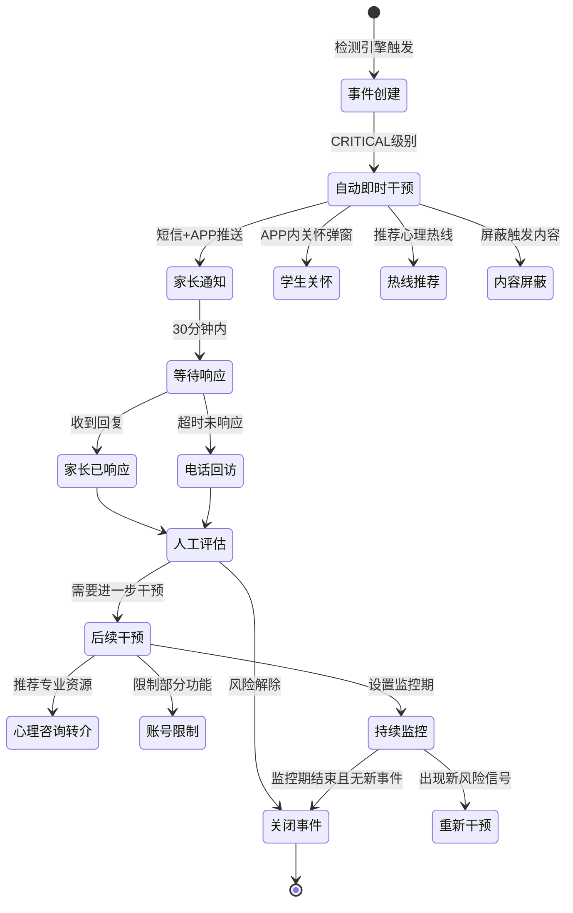
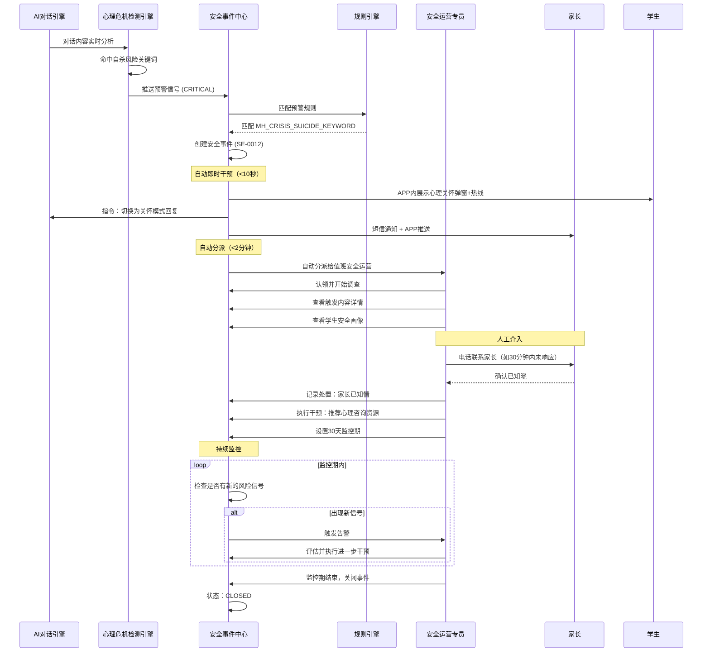

# 管理后台 - 学生安全事件与心理健康预警管理工作台 详细设计

## 1. 概述

### 1.1 功能定位

本工作台是 PrimeTop 平台管理后台的核心安全运营模块，面向平台安全运营团队、内容审核团队和指定安全官，提供学生安全事件的统一监控、预警处置、干预追踪和合规报告能力。

### 1.2 设计背景

PrimeTop 作为面向未成年人（3-18 岁）的教育产品，已建设了多个服务端安全检测引擎：

| 已有引擎 | 检测能力 |
| --- | --- |
| 学生 AI 对话心理危机信号检测与分级预警干预编排引擎 | 自伤/自杀/抑郁信号检测 |
| 学生数字安全防护与上网行为保护引擎 | 网络欺凌、隐私泄露、不当接触 |
| 防沉迷与未成年人保护机制 | 超时使用、深夜使用、异常消费 |
| 教育场景敏感词多层次过滤与内容安全规则引擎 | 不当内容发布、敏感词命中 |
| AI 提示词注入攻击防御与对抗性输入智能识别拦截引擎 | AI 对话滥用 |
| 用户生成内容安全审核与未成年人社交保护引擎 | UGC 内容安全 |
| 在线测评防作弊检测与考试诚信度评估引擎 | 考试作弊 |

但当前缺少一个**统一的安全事件管理工作台**来聚合这些引擎产生的预警信号，导致：

1. 安全信号分散在各引擎独立的通知/日志中，缺乏统一视图。
2. 安全事件的分派、处理、追踪缺乏标准化的工作流。
3. 无法对学生的安全风险进行全貌画像和长期追踪。
4. 难以生成面向监管部门的合规报告。

### 1.3 适用范围

- **目标用户**：安全运营专员、内容审核主管、安全官（Security Officer）、合规专员
- **覆盖场景**：心理健康预警、网络欺凌、不当内容接触、隐私泄露、异常消费、沉迷行为、安全投诉
- **不覆盖**：AI 内容质量审核（已有"内容安全审核与AI质量监控工作台"）、客户服务工单（已有"客户服务与工单管理工作台"）

### 1.4 核心价值

1. **统一安全态势感知**：多源预警信号聚合为统一安全事件流
2. **标准化处置流程**：事件分派 → 调查 → 干预 → 复核 → 归档
3. **学生安全画像**：时间维度上的安全风险全景
4. **合规审计支撑**：满足《未成年人保护法》《未成年人网络保护条例》等法规要求

---

## 2. 角色与权限设计

### 2.1 角色定义

| 角色编码 | 角色名称 | 权限范围 |
| --- | --- | --- |
| `SAFETY_VIEWER` | 安全只读员 | 查看安全事件列表、详情、统计看板 |
| `SAFETY_OPERATOR` | 安全运营专员 | 查看 + 事件分派、处置、状态变更、添加备注 |
| `SAFETY_SUPERVISOR` | 安全主管 | 全部操作 + 事件升级、关闭、复核审批 |
| `SAFETY_OFFICER` | 安全官 | 全部操作 + 规则配置、阈值调整、合规报告导出 |
| `COMPLIANCE_OFFICER` | 合规专员 | 查看事件 + 合规报告查看与导出（只读） |

### 2.2 权限矩阵

| 操作 | VIEWER | OPERATOR | SUPERVISOR | OFFICER | COMPLIANCE |
| --- | --- | --- | --- | --- | --- |
| 查看安全看板 | ✓ | ✓ | ✓ | ✓ | ✓ |
| 查看事件列表 | ✓ | ✓ | ✓ | ✓ | ✓ |
| 查看事件详情 | ✓ | ✓ | ✓ | ✓ | ✓ |
| 认领/分派事件 | ✗ | ✓ | ✓ | ✓ | ✗ |
| 添加处置记录 | ✗ | ✓ | ✓ | ✓ | ✗ |
| 变更事件状态 | ✗ | ✓ | ✓ | ✓ | ✗ |
| 触发紧急干预 | ✗ | ✓ | ✓ | ✓ | ✗ |
| 升级事件级别 | ✗ | ✗ | ✓ | ✓ | ✗ |
| 关闭/归档事件 | ✗ | ✗ | ✓ | ✓ | ✗ |
| 复核审批 | ✗ | ✗ | ✓ | ✓ | ✗ |
| 配置预警规则 | ✗ | ✗ | ✗ | ✓ | ✗ |
| 调整预警阈值 | ✗ | ✗ | ✗ | ✓ | ✗ |
| 导出合规报告 | ✗ | ✗ | ✓ | ✓ | ✓ |
| 查看学生安全画像 | ✗ | ✓ | ✓ | ✓ | ✓ |

### 2.3 数据脱敏规则

| 数据项 | VIEWER | OPERATOR+ | COMPLIANCE |
| --- | --- | --- | --- |
| 学生姓名 | 脱敏（姓+*） | 完整 | 脱敏（姓+*） |
| 手机号 | 后4位 | 完整 | 后4位 |
| AI对话原文 | 不展示 | 完整 | 不展示 |
| 家长联系方式 | 不展示 | 完整 | 不展示 |
| 学生ID | 完整 | 完整 | 完整 |

---

## 3. 数据模型设计

### 3.1 核心表结构

#### 3.1.1 `safety_event` - 安全事件表

```sql
CREATE TABLE `safety_event` (
    `id`                    BIGINT UNSIGNED NOT NULL AUTO_INCREMENT COMMENT '主键ID',
    `event_no`              VARCHAR(32) NOT NULL COMMENT '事件编号 SE-yyyyMMdd-seq',
    `student_id`            BIGINT UNSIGNED NOT NULL COMMENT '学生用户ID',
    `student_name`          VARCHAR(64) NOT NULL COMMENT '学生姓名快照',
    `grade_stage`           TINYINT NOT NULL COMMENT '学段 1幼儿 2小学 3初中 4高中',
    `grade_level`           INT NOT NULL COMMENT '年级',
    `event_type`            VARCHAR(32) NOT NULL COMMENT '事件类型 见枚举',
    `severity_level`        TINYINT NOT NULL COMMENT '严重程度 1低 2中 3高 4紧急',
    `risk_score`            DECIMAL(5,2) DEFAULT 0 COMMENT '风险评分 0-100',
    `title`                 VARCHAR(200) NOT NULL COMMENT '事件标题',
    `description`           TEXT COMMENT '事件描述',
    `source_engine`         VARCHAR(64) NOT NULL COMMENT '来源引擎标识',
    `source_ref_id`         VARCHAR(64) COMMENT '来源引擎原始记录ID',
    `source_ref_type`       VARCHAR(32) COMMENT '来源记录类型',
    `trigger_content_snippet` TEXT COMMENT '触发内容片段（脱敏后）',
    `trigger_metadata`      JSON COMMENT '触发元数据 {ai_conversation_id, message_id, module, etc.}',
    `status`                VARCHAR(20) NOT NULL DEFAULT 'PENDING' COMMENT '事件状态',
    `priority`              TINYINT NOT NULL DEFAULT 3 COMMENT '优先级 1最高 2高 3中 4低',
    `assigned_to`           BIGINT UNSIGNED COMMENT '分派处理人ID',
    `assigned_at`           DATETIME COMMENT '分派时间',
    `resolved_at`           DATETIME COMMENT '解决时间',
    `closed_at`             DATETIME COMMENT '关闭时间',
    `closure_code`          VARCHAR(32) COMMENT '关闭分类 见枚举',
    `closure_summary`       TEXT COMMENT '关闭总结',
    `is_escalated`          TINYINT DEFAULT 0 COMMENT '是否已升级',
    `escalated_at`          DATETIME COMMENT '升级时间',
    `parent_notified`       TINYINT DEFAULT 0 COMMENT '是否已通知家长',
    `parent_notified_at`    DATETIME COMMENT '家长通知时间',
    `school_notified`       TINYINT DEFAULT 0 COMMENT '是否已通知学校',
    `regulatory_reported`   TINYINT DEFAULT 0 COMMENT '是否已上报监管',
    `regulatory_reported_at` DATETIME COMMENT '监管上报时间',
    `tags`                  JSON COMMENT '事件标签数组',
    `related_event_ids`     JSON COMMENT '关联事件ID数组',
    `created_at`            DATETIME NOT NULL DEFAULT CURRENT_TIMESTAMP,
    `updated_at`            DATETIME NOT NULL DEFAULT CURRENT_TIMESTAMP ON UPDATE CURRENT_TIMESTAMP,
    `deleted_at`            DATETIME COMMENT '软删除标记',

    PRIMARY KEY (`id`),
    UNIQUE KEY `uk_event_no` (`event_no`),
    KEY `idx_student_id` (`student_id`, `status`),
    KEY `idx_status_severity` (`status`, `severity_level`),
    KEY `idx_assigned_to` (`assigned_to`, `status`),
    KEY `idx_event_type` (`event_type`, `status`),
    KEY `idx_source_engine` (`source_engine`, `source_ref_id`),
    KEY `idx_created_at` (`created_at`),
    KEY `idx_risk_score` (`risk_score`)
) ENGINE=InnoDB DEFAULT CHARSET=utf8mb4 COMMENT='安全事件表';
```

#### 3.1.2 `safety_event_action` - 事件处置记录表

```sql
CREATE TABLE `safety_event_action` (
    `id`                BIGINT UNSIGNED NOT NULL AUTO_INCREMENT,
    `event_id`          BIGINT UNSIGNED NOT NULL COMMENT '关联事件ID',
    `action_type`       VARCHAR(32) NOT NULL COMMENT '处置类型 ASSIGN/INVESTIGATE/INTERVENE/NOTIFY/ESCALATE/CLOSE/REOPEN',
    `action_result`     VARCHAR(32) NOT NULL COMMENT '处置结果 SUCCESS/FAILED/PENDING',
    `action_description` TEXT NOT NULL COMMENT '处置描述',
    `action_metadata`   JSON COMMENT '处置元数据',
    `operator_id`       BIGINT UNSIGNED NOT NULL COMMENT '操作人ID',
    `operator_name`     VARCHAR(64) NOT NULL COMMENT '操作人姓名',
    `operator_role`     VARCHAR(32) NOT NULL COMMENT '操作人角色',
    `previous_status`   VARCHAR(20) COMMENT '变更前状态',
    `new_status`        VARCHAR(20) COMMENT '变更后状态',
    `attachments`       JSON COMMENT '附件列表 [{type, url, name}]',
    `is_internal_note`  TINYINT DEFAULT 0 COMMENT '是否内部备注（不对其他角色可见）',
    `created_at`        DATETIME NOT NULL DEFAULT CURRENT_TIMESTAMP,

    PRIMARY KEY (`id`),
    KEY `idx_event_id` (`event_id`),
    KEY `idx_operator_id` (`operator_id`),
    KEY `idx_action_type` (`action_type`),
    KEY `idx_created_at` (`created_at`)
) ENGINE=InnoDB DEFAULT CHARSET=utf8mb4 COMMENT='安全事件处置记录表';
```

#### 3.1.3 `student_safety_profile` - 学生安全画像表

```sql
CREATE TABLE `student_safety_profile` (
    `id`                        BIGINT UNSIGNED NOT NULL AUTO_INCREMENT,
    `student_id`                BIGINT UNSIGNED NOT NULL UNIQUE COMMENT '学生用户ID',
    `risk_level`                TINYINT DEFAULT 0 COMMENT '综合风险等级 0正常 1关注 2警告 3高风险 4紧急',
    `risk_score`                DECIMAL(5,2) DEFAULT 0 COMMENT '综合风险评分 0-100',
    `risk_factors`              JSON COMMENT '风险因子明细 [{factor, weight, score, trend}]',
    `total_event_count`         INT DEFAULT 0 COMMENT '历史安全事件总数',
    `open_event_count`          INT DEFAULT 0 COMMENT '当前未关闭事件数',
    `high_severity_count`       INT DEFAULT 0 COMMENT '高严重度事件总数',
    `last_event_at`             DATETIME COMMENT '最近一次安全事件时间',
    `last_intervention_at`      DATETIME COMMENT '最近一次干预时间',
    `intervention_count`        INT DEFAULT 0 COMMENT '累计干预次数',
    `parent_contact_status`     VARCHAR(20) DEFAULT 'UNKNOWN' COMMENT '家长联系状态',
    `requires_monitoring`       TINYINT DEFAULT 0 COMMENT '是否需要持续监控',
    `monitoring_until`          DATETIME COMMENT '监控截止时间',
    `protection_measures`       JSON COMMENT '当前保护措施 [{type, scope, startAt, endAt}]',
    `assigned_case_manager`     BIGINT UNSIGNED COMMENT '指定案件管理员ID',
    `safety_notes`              TEXT COMMENT '安全备注（仅安全官可见）',
    `created_at`                DATETIME NOT NULL DEFAULT CURRENT_TIMESTAMP,
    `updated_at`                DATETIME NOT NULL DEFAULT CURRENT_TIMESTAMP ON UPDATE CURRENT_TIMESTAMP,

    PRIMARY KEY (`id`),
    UNIQUE KEY `uk_student_id` (`student_id`),
    KEY `idx_risk_level` (`risk_level`),
    KEY `idx_risk_score` (`risk_score`),
    KEY `idx_monitoring` (`requires_monitoring`, `monitoring_until`)
) ENGINE=InnoDB DEFAULT CHARSET=utf8mb4 COMMENT='学生安全画像表';
```

#### 3.1.4 `safety_rule_config` - 安全预警规则配置表

```sql
CREATE TABLE `safety_rule_config` (
    `id`                BIGINT UNSIGNED NOT NULL AUTO_INCREMENT,
    `rule_code`         VARCHAR(64) NOT NULL COMMENT '规则编码',
    `rule_name`         VARCHAR(128) NOT NULL COMMENT '规则名称',
    `rule_category`     VARCHAR(32) NOT NULL COMMENT '规则类别',
    `event_type`        VARCHAR(32) NOT NULL COMMENT '触发的事件类型',
    `severity_level`    TINYINT NOT NULL COMMENT '严重程度',
    `condition_expr`    TEXT NOT NULL COMMENT '条件表达式 JSONLogic格式',
    `condition_desc`    VARCHAR(500) COMMENT '条件描述（自然语言）',
    `action_type`       VARCHAR(32) NOT NULL DEFAULT 'CREATE_EVENT' COMMENT '触发动作',
    `action_params`     JSON COMMENT '动作参数 {notify_roles, auto_assign, parent_notify}',
    `cooldown_minutes`  INT DEFAULT 60 COMMENT '同一学生同规则冷却时间（分钟）',
    `is_active`         TINYINT DEFAULT 1 COMMENT '是否启用',
    `applies_to_grades` JSON COMMENT '适用学段 [1,2,3,4] null=全部',
    `priority`          INT DEFAULT 100 COMMENT '规则优先级（越小越高）',
    `version`           INT DEFAULT 1 COMMENT '规则版本',
    `created_by`        BIGINT UNSIGNED NOT NULL,
    `updated_by`        BIGINT UNSIGNED,
    `created_at`        DATETIME NOT NULL DEFAULT CURRENT_TIMESTAMP,
    `updated_at`        DATETIME NOT NULL DEFAULT CURRENT_TIMESTAMP ON UPDATE CURRENT_TIMESTAMP,

    PRIMARY KEY (`id`),
    UNIQUE KEY `uk_rule_code` (`rule_code`),
    KEY `idx_category_active` (`rule_category`, `is_active`),
    KEY `idx_event_type` (`event_type`)
) ENGINE=InnoDB DEFAULT CHARSET=utf8mb4 COMMENT='安全预警规则配置表';
```

#### 3.1.5 `safety_intervention_log` - 安全干预执行日志表

```sql
CREATE TABLE `safety_intervention_log` (
    `id`                    BIGINT UNSIGNED NOT NULL AUTO_INCREMENT,
    `event_id`              BIGINT UNSIGNED NOT NULL COMMENT '关联事件ID',
    `student_id`            BIGINT UNSIGNED NOT NULL COMMENT '学生用户ID',
    `intervention_type`     VARCHAR(32) NOT NULL COMMENT '干预类型',
    `intervention_channel`  VARCHAR(32) NOT NULL COMMENT '干预渠道',
    `target_user_id`        BIGINT UNSIGNED COMMENT '目标用户ID（家长/学生）',
    `target_contact`        VARCHAR(128) COMMENT '目标联系方式',
    `content_summary`       TEXT NOT NULL COMMENT '干预内容摘要',
    `content_full`          TEXT COMMENT '干预完整内容',
    `delivery_status`       VARCHAR(20) NOT NULL DEFAULT 'PENDING' COMMENT '送达状态',
    `delivered_at`          DATETIME COMMENT '送达时间',
    `read_at`               DATETIME COMMENT '阅读时间',
    `response_received`     TINYINT DEFAULT 0 COMMENT '是否收到响应',
    `response_content`      TEXT COMMENT '响应内容',
    `response_at`           DATETIME COMMENT '响应时间',
    `effectiveness_score`   TINYINT COMMENT '干预有效性评分 1-5',
    `operator_id`           BIGINT UNSIGNED NOT NULL COMMENT '执行人ID',
    `created_at`            DATETIME NOT NULL DEFAULT CURRENT_TIMESTAMP,
    `updated_at`            DATETIME NOT NULL DEFAULT CURRENT_TIMESTAMP ON UPDATE CURRENT_TIMESTAMP,

    PRIMARY KEY (`id`),
    KEY `idx_event_id` (`event_id`),
    KEY `idx_student_id` (`student_id`),
    KEY `idx_type_status` (`intervention_type`, `delivery_status`),
    KEY `idx_created_at` (`created_at`)
) ENGINE=InnoDB DEFAULT CHARSET=utf8mb4 COMMENT='安全干预执行日志表';
```

#### 3.1.6 `safety_compliance_report` - 合规报告表

```sql
CREATE TABLE `safety_compliance_report` (
    `id`                BIGINT UNSIGNED NOT NULL AUTO_INCREMENT,
    `report_no`         VARCHAR(32) NOT NULL COMMENT '报告编号',
    `report_type`       VARCHAR(32) NOT NULL COMMENT '报告类型 MONTHLY/QUARTERLY/INCIDENT/SPECIAL',
    `report_period`     VARCHAR(20) COMMENT '报告周期 yyyyMM 或 yyyyQ1',
    `title`             VARCHAR(200) NOT NULL COMMENT '报告标题',
    `summary`           TEXT NOT NULL COMMENT '执行摘要',
    `statistics`        JSON NOT NULL COMMENT '统计数据',
    `incident_cases`    JSON COMMENT '典型案例列表',
    `actions_taken`     JSON COMMENT '已采取措施',
    `improvements`      TEXT COMMENT '改进建议',
    `status`            VARCHAR(20) NOT NULL DEFAULT 'DRAFT' COMMENT 'DRAFT/FINALIZED/SUBMITTED',
    `generated_by`      BIGINT UNSIGNED COMMENT '生成人ID',
    `reviewed_by`       BIGINT UNSIGNED COMMENT '审核人ID',
    `submitted_to`      VARCHAR(256) COMMENT '上报对象',
    `file_url`          VARCHAR(512) COMMENT '导出文件URL',
    `created_at`        DATETIME NOT NULL DEFAULT CURRENT_TIMESTAMP,
    `updated_at`        DATETIME NOT NULL DEFAULT CURRENT_TIMESTAMP ON UPDATE CURRENT_TIMESTAMP,

    PRIMARY KEY (`id`),
    UNIQUE KEY `uk_report_no` (`report_no`),
    KEY `idx_type_period` (`report_type`, `report_period`),
    KEY `idx_status` (`status`)
) ENGINE=InnoDB DEFAULT CHARSET=utf8mb4 COMMENT='合规报告表';
```

### 3.2 枚举定义

```typescript
/** 安全事件类型 */
enum SafetyEventType {
  MENTAL_HEALTH_CRISIS    = 'MENTAL_HEALTH_CRISIS',    // 心理危机信号
  SELF_HARM_INDICATOR     = 'SELF_HARM_INDICATOR',     // 自伤倾向
  DEPRESSION_SIGNAL       = 'DEPRESSION_SIGNAL',       // 抑郁信号
  CYBERBULLYING           = 'CYBERBULLYING',           // 网络欺凌
  INAPPROPRIATE_CONTACT   = 'INAPPROPRIATE_CONTACT',   // 不当接触
  PRIVACY_LEAK            = 'PRIVACY_LEAK',            // 隐私泄露
  ADDICTION_BEHAVIOR      = 'ADDICTION_BEHAVIOR',      // 沉迷行为
  ABNORMAL_PAYMENT        = 'ABNORMAL_PAYMENT',        // 异常消费
  INAPPROPRIATE_CONTENT   = 'INAPPROPRIATE_CONTENT',   // 接触不当内容
  CHEATING_BEHAVIOR       = 'CHEATING_BEHAVIOR',       // 作弊行为
  AI_ABUSE                = 'AI_ABUSE',                // AI对话滥用
  UNAUTHORIZED_ACCESS     = 'UNAUTHORIZED_ACCESS',     // 非授权访问
  SAFETY_COMPLAINT        = 'SAFETY_COMPLAINT',        // 安全投诉
  OTHER                   = 'OTHER',                    // 其他
}

/** 事件状态 */
enum SafetyEventStatus {
  PENDING        = 'PENDING',        // 待处理（新创建）
  ASSIGNED       = 'ASSIGNED',       // 已分派
  INVESTIGATING  = 'INVESTIGATING',  // 调查中
  INTERVENING    = 'INTERVENING',    // 干预中
  RESOLVED       = 'RESOLVED',       // 已解决
  UNDER_REVIEW   = 'UNDER_REVIEW',   // 复核中
  CLOSED         = 'CLOSED',         // 已关闭
  REOPENED       = 'REOPENED',       // 已重开
}

/** 严重程度 */
enum SeverityLevel {
  LOW      = 1,  // 低 - 一般关注
  MEDIUM   = 2,  // 中 - 需要处理
  HIGH     = 3,  // 高 - 优先处理
  CRITICAL = 4,  // 紧急 - 立即处理
}

/** 关闭分类 */
enum ClosureCode {
  FALSE_POSITIVE       = 'FALSE_POSITIVE',       // 误报
  RESOLVED_BY_SYSTEM   = 'RESOLVED_BY_SYSTEM',   // 系统自动解决
  RESOLVED_BY_OPERATOR = 'RESOLVED_BY_OPERATOR', // 人工解决
  PARENT_INTERVENED    = 'PARENT_INTERVENED',    // 家长已干预
  NO_ACTION_NEEDED     = 'NO_ACTION_NEEDED',     // 无需行动
  DUPLICATE            = 'DUPLICATE',            // 重复事件
  REFERRED_EXTERNAL    = 'REFERRED_EXTERNAL',    // 转介外部机构
}

/** 干预类型 */
enum InterventionType {
  CONTENT_BLOCK      = 'CONTENT_BLOCK',      // 内容屏蔽
  ACCOUNT_RESTRICT   = 'ACCOUNT_RESTRICT',   // 账号限制
  PARENT_NOTIFICATION = 'PARENT_NOTIFICATION', // 家长通知
  STUDENT_GUIDANCE   = 'STUDENT_GUIDANCE',    // 学生引导
  COUNSELOR_REFERRAL = 'COUNSELOR_REFERRAL',  // 心理咨询师转介
  EMERGENCY_HOTLINE  = 'EMERGENCY_HOTLINE',   // 紧急热线转介
  ACCOUNT_FREEZE     = 'ACCOUNT_FREEZE',      // 账号冻结
  FEATURE_DISABLE    = 'FEATURE_DISABLE',     // 功能禁用
  WARNING_MESSAGE    = 'WARNING_MESSAGE',     // 警告消息
}
```

---

## 4. 核心功能模块设计

### 4.1 安全态势看板

#### 4.1.1 功能说明

全局安全态势的实时可视化大屏，展示当日/本周/本月的安全事件统计、趋势和分布。

#### 4.1.2 看板指标定义

| 指标 | 计算方式 | 展示形式 |
| --- | --- | --- |
| 待处理事件数 | `COUNT(*) WHERE status IN ('PENDING','ASSIGNED','INVESTIGATING','INTERVENING')` | 数字卡片（红色高亮） |
| 紧急事件数 | `COUNT(*) WHERE severity_level = 4 AND status != 'CLOSED'` | 数字卡片（闪烁红） |
| 今日新增事件 | `COUNT(*) WHERE DATE(created_at) = CURDATE()` | 数字卡片 + 环比 |
| 本周事件趋势 | 按天聚合最近7天事件量 | 折线图 |
| 事件类型分布 | 按 `event_type` 分组统计 | 饼图 |
| 严重程度分布 | 按 `severity_level` 分组 | 环形图 |
| 平均响应时长 | `AVG(TIMESTAMPDIFF(MINUTE, created_at, assigned_at))` | 数字卡片 |
| 平均处置时长 | `AVG(TIMESTAMPDIFF(MINUTE, assigned_at, resolved_at))` | 数字卡片 |
| 高风险学生数 | `COUNT(DISTINCT student_id) WHERE risk_level >= 3` | 数字卡片 |
| 干预执行率 | ` intervened_events / total_events * 100%` | 百分比卡片 |
| 各引擎预警量 | 按 `source_engine` 分组 | 柱状图 |
| 处理人员负载 | 按 `assigned_to` 分组未关闭事件 | 横向柱状图 |

#### 4.1.3 自动刷新策略

```typescript
// 看板数据刷新策略
const dashboardRefreshConfig = {
  // 实时指标（紧急事件数、待处理数）：30秒轮询
  realtimeInterval: 30_000,
  // 统计图表数据：5分钟刷新
  statisticsInterval: 300_000,
  // WebSocket推送：紧急事件即时推送
  wsChannel: 'safety_dashboard_realtime',
  // 深夜降频：23:00-07:00 降低到2分钟轮询
  nightModeInterval: 120_000,
  nightModeHours: { start: 23, end: 7 },
};
```

### 4.2 安全事件列表与筛选

#### 4.2.1 列表展示字段

| 列 | 说明 | 可排序 |
| --- | --- | --- |
| 事件编号 | `event_no` | ✓ |
| 学生 | 姓名（脱敏）+ 学段标签 | ✗ |
| 事件类型 | 带颜色标签 | ✗ |
| 严重程度 | 颜色标识（红/橙/黄/蓝） | ✓ |
| 风险评分 | 0-100 进度条 | ✓ |
| 来源引擎 | 引擎简称 | ✗ |
| 状态 | 状态标签 | ✓ |
| 处理人 | 姓名 | ✗ |
| 创建时间 | 相对时间 | ✓ |
| 操作 | 查看 / 认领 / 快速分派 | ✗ |

#### 4.2.2 筛选条件

```typescript
interface SafetyEventFilter {
  // 基础筛选
  status?: SafetyEventStatus[];
  severityLevel?: SeverityLevel[];
  eventType?: SafetyEventType[];
  riskScoreRange?: { min: number; max: number };

  // 时间筛选
  dateRange: {
    field: 'created_at' | 'assigned_at' | 'resolved_at' | 'closed_at';
    start: string;
    end: string;
  };

  // 关联筛选
  studentId?: number;
  studentName?: string;        // 模糊搜索
  assignedTo?: number;        // 处理人
  sourceEngine?: string[];    // 来源引擎
  gradeStage?: number[];      // 学段

  // 特殊筛选
  onlyMyCases?: boolean;       // 仅看我的案件
  onlyOverdue?: boolean;      // 仅看超时
  escalatedOnly?: boolean;    // 仅看已升级
  parentNotifiedOnly?: boolean;
  regulatoryReportedOnly?: boolean;

  // 分页
  page: number;
  pageSize: number;
  sortBy?: string;
  sortOrder?: 'ASC' | 'DESC';
}
```

#### 4.2.3 SLA 超时标识

```typescript
// 不同严重程度的SLA超时阈值
const slaThresholds: Record<SeverityLevel, number> = {
  [SeverityLevel.CRITICAL]: 15 * 60,    // 15分钟
  [SeverityLevel.HIGH]:     60 * 60,    // 1小时
  [SeverityLevel.MEDIUM]:   4 * 3600,   // 4小时
  [SeverityLevel.LOW]:      24 * 3600,  // 24小时
};

// 列表中超时事件以红色边框标识
function isOverdue(event: SafetyEvent): boolean {
  if (event.status === 'CLOSED') return false;
  const threshold = slaThresholds[event.severity_level];
  const elapsed = (Date.now() - new Date(event.created_at).getTime()) / 1000;
  return elapsed > threshold;
}
```

### 4.3 安全事件详情页

#### 4.3.1 页面结构

```
┌──────────────────────────────────────────────────────┐
│ 事件编号 SE-20260809-0012    [紧急] [心理危机信号]     │
│ 状态: 调查中 → 干预中          创建: 2026-08-09 10:23  │
├──────────────────────────────────────────────────────┤
│ ┌─ 学生信息卡片 ─────────────────────────────────┐    │
│ │  张*明  初中八年级  风险等级: 高风险(82分)      │    │
│ │  历史事件: 3次  本月事件: 2次  上次干预: 7天前  │    │
│ │  [查看安全画像] [查看学习档案]                  │    │
│ └────────────────────────────────────────────────┘    │
├──────────────────────────────────────────────────────┤
│ ┌─ 触发详情 ─────────────────────────────────────┐    │
│ │ 来源引擎: 心理危机信号检测引擎                  │    │
│ │ 触发时间: 2026-08-09 10:22:15                  │    │
│ │ 触发场景: AI对话                               │    │
│ │ 触发内容片段:                                  │    │
│ │ ┌──────────────────────────────────────────┐   │    │
│ │ │ 学生消息: "...活着好累，不想上学了，       │   │    │
│ │ │ 有时候想从楼上跳下去..."                  │   │    │
│ │ │ AI回复: (系统已自动触发安全拦截)           │   │    │
│ │ └──────────────────────────────────────────┘   │    │
│ │ 检测结果: 自杀风险关键词命中 + 情绪低落信号    │    │
│ │ 风险评分: 82/100                               │    │
│ └────────────────────────────────────────────────┘    │
├──────────────────────────────────────────────────────┤
│ ┌─ 处置时间线 ───────────────────────────────────┐    │
│ │ ● 10:23 系统创建事件 (自动)                    │    │
│ │ ● 10:25 认领 (安全运营-李芳)                   │    │
│ │ ● 10:30 开始调查 (安全运营-李芳)               │    │
│ │ ● 10:35 触发家长通知 (短信+APP推送)            │    │
│ │ ● 10:40 转介心理咨询师 (电话联系家长)          │    │
│ │ ○ 待处理: 账号功能调整                         │    │
│ └────────────────────────────────────────────────┘    │
├──────────────────────────────────────────────────────┤
│ ┌─ 操作区 ───────────────────────────────────────┐    │
│ │ [分派] [升级] [触发干预] [关联事件] [添加备注]  │    │
│ │ [关闭事件] [导出报告] [标记误报]                │    │
│ └────────────────────────────────────────────────┘    │
└──────────────────────────────────────────────────────┘
```

#### 4.3.2 触发内容查看权限

```typescript
// 触发内容（如AI对话片段）的查看权限控制
const triggerContentViewConfig = {
  // CRITICAL级别：SAFETY_OPERATOR及以上可查看完整内容
  // HIGH级别：SAFETY_OPERATOR及以上可查看完整内容
  // MEDIUM/LOW级别：仅SAFETY_SUPERVISOR及以上可查看完整内容
  // SAFETY_VIEWER和COMPLIANCE_OFFICER始终只能查看摘要

  minRoleForFullContent: (severity: SeverityLevel): string => {
    if (severity >= SeverityLevel.HIGH) return 'SAFETY_OPERATOR';
    return 'SAFETY_SUPERVISOR';
  },

  // 敏感信息二次确认
  requireReauth: true,  // 需要重新输入密码
  logAccess: true,      // 记录访问日志
  watermark: true,      // 添加查看者水印
};
```

### 4.4 学生安全画像

#### 4.4.1 画像维度

| 维度 | 展示内容 |
| --- | --- |
| 风险等级 | 综合风险等级与评分（雷达图） |
| 事件时间线 | 历史安全事件按时间排列（甘特图） |
| 风险因子分解 | 各风险因子得分（柱状图） |
| 干预历史 | 历史干预措施及效果 |
| 当前保护措施 | 正在执行的保护措施列表 |
| 家长协同状态 | 家长是否已知情、是否配合 |
| 关联学生 | 同班级/同校其他高风险学生（网络图） |

#### 4.4.2 风险评分模型

```typescript
/**
 * 学生综合安全风险评分计算
 * 多维度加权评分，范围 0-100
 */
interface RiskFactor {
  code: string;
  name: string;
  description: string;
  weight: number;       // 权重 (0-1)
  score: number;        // 该维度得分 (0-100)
  trend: 'UP' | 'DOWN' | 'STABLE';
  lastUpdated: string;
}

const defaultRiskFactors: RiskFactor[] = [
  {
    code: 'MENTAL_HEALTH',
    name: '心理健康风险',
    description: '基于AI对话情绪分析、心理危机信号频率',
    weight: 0.35,
    score: 0,
    trend: 'STABLE',
    lastUpdated: '',
  },
  {
    code: 'SOCIAL_SAFETY',
    name: '社交安全风险',
    description: '基于网络欺凌、不当接触、UGC内容安全',
    weight: 0.20,
    score: 0,
    trend: 'STABLE',
    lastUpdated: '',
  },
  {
    code: 'ADDICTION_RISK',
    name: '沉迷行为风险',
    description: '基于使用时长、深夜使用、频率异常',
    weight: 0.15,
    score: 0,
    trend: 'STABLE',
    lastUpdated: '',
  },
  {
    code: 'CONTENT_EXPOSURE',
    name: '不当内容接触风险',
    description: '基于敏感内容命中、不当搜索行为',
    weight: 0.10,
    score: 0,
    trend: 'STABLE',
    lastUpdated: '',
  },
  {
    code: 'FINANCIAL_RISK',
    name: '异常消费风险',
    description: '基于消费频次、金额异常、未成年充值',
    weight: 0.05,
    score: 0,
    trend: 'STABLE',
    lastUpdated: '',
  },
  {
    code: 'ACADEMIC_INTEGRITY',
    name: '学术诚信风险',
    description: '基于作弊检测、作业抄袭',
    weight: 0.05,
    score: 0,
    trend: 'STABLE',
    lastUpdated: '',
  },
  {
    code: 'HISTORICAL_RISK',
    name: '历史风险累积',
    description: '基于历史安全事件数量、严重度、频率',
    weight: 0.10,
    score: 0,
    trend: 'STABLE',
    lastUpdated: '',
  },
];

/**
 * 计算综合风险评分
 */
function calculateRiskScore(factors: RiskFactor[]): number {
  const totalScore = factors.reduce((sum, f) => sum + f.score * f.weight, 0);
  return Math.min(100, Math.round(totalScore * 10) / 10);
}

/**
 * 评分到风险等级映射
 */
function scoreToRiskLevel(score: number): number {
  if (score >= 80) return 4; // 紧急
  if (score >= 60) return 3; // 高风险
  if (score >= 40) return 2; // 警告
  if (score >= 20) return 1; // 关注
  return 0;                      // 正常
}
```

### 4.5 安全预警规则管理

#### 4.5.1 规则配置界面

安全官（`SAFETY_OFFICER`）可通过界面配置和调整预警规则。

```typescript
interface SafetyRuleFormData {
  ruleCode: string;
  ruleName: string;
  ruleCategory: 'MENTAL_HEALTH' | 'SOCIAL' | 'ADDICTION' | 'CONTENT' | 'PAYMENT' | 'CHEATING' | 'CUSTOM';
  eventType: SafetyEventType;
  severityLevel: SeverityLevel;
  conditionExpr: object;  // JSONLogic 条件表达式
  actionType: 'CREATE_EVENT' | 'AUTO_INTERVENE' | 'NOTIFY_ONLY';
  actionParams: {
    notifyRoles?: string[];
    autoAssignTo?: number;
    parentNotify?: boolean;
    parentNotifyChannel?: 'SMS' | 'APP_PUSH' | 'BOTH';
  };
  cooldownMinutes: number;
  appliesToGrades?: number[];
  isActive: boolean;
}
```

#### 4.5.2 内置规则示例

```json
[
  {
    "ruleCode": "MH_CRISIS_SUICIDE_KEYWORD",
    "ruleName": "自杀相关关键词命中",
    "ruleCategory": "MENTAL_HEALTH",
    "eventType": "SELF_HARM_INDICATOR",
    "severityLevel": 4,
    "conditionDesc": "AI对话中出现自杀/自残相关关键词或语义匹配",
    "actionParams": {
      "notifyRoles": ["SAFETY_OPERATOR", "SAFETY_SUPERVISOR"],
      "autoAssignTo": null,
      "parentNotify": true,
      "parentNotifyChannel": "BOTH"
    },
    "cooldownMinutes": 30
  },
  {
    "ruleCode": "SOC_BULLYING_REPEATED",
    "ruleName": "疑似被网络欺凌（多次触发）",
    "ruleCategory": "SOCIAL",
    "eventType": "CYBERBULLYING",
    "severityLevel": 3,
    "conditionDesc": "24小时内社交模块被检测到欺凌相关信号≥3次",
    "cooldownMinutes": 360
  },
  {
    "ruleCode": "ADD_NIGHT_OVERUSE",
    "ruleName": "深夜持续使用",
    "ruleCategory": "ADDICTION",
    "eventType": "ADDICTION_BEHAVIOR",
    "severityLevel": 2,
    "conditionDesc": "23:00-06:00期间持续使用超过60分钟",
    "appliesToGrades": [1, 2, 3],
    "actionParams": {
      "parentNotify": true,
      "parentNotifyChannel": "APP_PUSH"
    },
    "cooldownMinutes": 720
  },
  {
    "ruleCode": "PAY_MINOR_LARGE_AMOUNT",
    "ruleName": "未成年人大额消费",
    "ruleCategory": "PAYMENT",
    "eventType": "ABNORMAL_PAYMENT",
    "severityLevel": 3,
    "conditionDesc": "单笔消费≥500元或24小时内累计≥1000元",
    "actionParams": {
      "notifyRoles": ["SAFETY_OPERATOR"],
      "parentNotify": true
    },
    "cooldownMinutes": 1440
  }
]
```

### 4.6 安全干预执行

#### 4.6.1 干预方式

| 干预类型 | 执行方式 | 自动/手动 | 通知对象 |
| --- | --- | --- | --- |
| 内容屏蔽 | 立即在学生端屏蔽相关内容 | 可自动可手动 | 无 |
| 账号限制 | 限制特定功能（如AI对话、社交） | 手动 | 学生 |
| 家长通知 | 通过短信/APP推送通知家长 | 可自动可手动 | 家长 |
| 学生引导 | 在APP内展示关怀提示和帮助信息 | 可自动可手动 | 学生 |
| 心理咨询转介 | 向家长推荐心理咨询资源 | 手动 | 家长 |
| 紧急热线转介 | 提供12355/12320等热线信息 | 可自动可手动 | 学生+家长 |
| 账号冻结 | 临时冻结账号（需安全官审批） | 手动 | 学生+家长 |
| 功能禁用 | 禁用特定功能模块 | 手动 | 学生 |
| 警告消息 | 发送规范提醒 | 可自动可手动 | 学生 |

#### 4.6.2 紧急干预流程（CRITICAL级别事件）



### 4.7 合规报告管理

#### 4.7.1 报告类型

| 类型 | 触发方式 | 内容 |
| --- | --- | --- |
| 月度报告 | 自动生成（每月1日） | 上月安全事件统计、处置情况、改进建议 |
| 季度报告 | 自动生成（每季度首月1日） | 上季度安全态势分析、趋势对比 |
| 事件报告 | 手动生成 | 单次重大安全事件的详细报告 |
| 专项报告 | 手动生成 | 针对特定主题（如心理健康月）的专项分析 |

#### 4.7.2 报告统计指标

```typescript
interface ComplianceReportStatistics {
  // 总体数据
  totalEvents: number;              // 事件总数
  resolvedEvents: number;           // 已解决事件数
  pendingEvents: number;            // 未解决事件数
  averageResponseTime: number;      // 平均响应时长（分钟）
  averageResolutionTime: number;    // 平均解决时长（小时）

  // 分类统计
  eventsByType: Record<SafetyEventType, number>;
  eventsBySeverity: Record<SeverityLevel, number>;
  eventsBySourceEngine: Record<string, number>;

  // 干预统计
  totalInterventions: number;
  parentNotifications: number;
  successfulInterventions: number;  // 干预成功数
  interventionSuccessRate: number;  // 干预成功率

  // 趋势对比
  monthOverMonthChange: number;     // 环比变化百分比
  yearOverYearChange: number;       // 同比变化百分比

  // 高风险学生
  highRiskStudentCount: number;
  monitoredStudentCount: number;

  // 合规指标
  slaComplianceRate: number;        // SLA达标率
  regulatoryReportsFiled: number;   // 监管上报数
  parentSatisfactionScore?: number; // 家长满意度（可选）
}
```

---

## 5. API 接口设计

### 5.1 安全事件管理 API

#### 5.1.1 查询事件列表

```
GET /api/admin/safety/events
```

**请求参数：**

```typescript
interface QueryEventsRequest {
  page?: number;           // default: 1
  pageSize?: number;       // default: 20, max: 100
  status?: string;         // 逗号分隔多个状态
  severityLevel?: string;  // 逗号分隔多个级别
  eventType?: string;      // 逗号分隔多个类型
  sourceEngine?: string;
  studentId?: number;
  assignedTo?: number;
  riskScoreMin?: number;
  riskScoreMax?: number;
  dateStart?: string;      // yyyy-MM-dd
  dateEnd?: string;
  onlyOverdue?: boolean;
  onlyMyCases?: boolean;
  sortBy?: string;         // default: created_at
  sortOrder?: 'ASC' | 'DESC';  // default: DESC
}
```

**响应：**

```json
{
  "code": 0,
  "data": {
    "total": 156,
    "page": 1,
    "pageSize": 20,
    "list": [
      {
        "id": 1234,
        "eventNo": "SE-20260809-0012",
        "studentId": 56789,
        "studentName": "张*明",
        "gradeStage": 3,
        "gradeLevel": 8,
        "eventType": "MENTAL_HEALTH_CRISIS",
        "eventTypeLabel": "心理危机信号",
        "severityLevel": 4,
        "severityLabel": "紧急",
        "riskScore": 82.0,
        "status": "INTERVENING",
        "statusLabel": "干预中",
        "sourceEngine": "mental_health_crisis_detector",
        "sourceEngineLabel": "心理危机检测引擎",
        "assignedTo": 101,
        "assignedToName": "李芳",
        "title": "AI对话中检测到自杀风险信号",
        "createdAt": "2026-08-09T10:23:00Z",
        "assignedAt": "2026-08-09T10:25:00Z",
        "isOverdue": false,
        "parentNotified": true
      }
    ]
  }
}
```

#### 5.1.2 获取事件详情

```
GET /api/admin/safety/events/{eventId}
```

**响应：**

```json
{
  "code": 0,
  "data": {
    "id": 1234,
    "eventNo": "SE-20260809-0012",
    "student": {
      "id": 56789,
      "name": "张*明",
      "nameMasked": "张*明",
      "gradeStage": 3,
      "gradeStageLabel": "初中",
      "gradeLevel": 8,
      "avatar": "https://cdn.primetop.com/avatar/56789.png",
      "riskLevel": 3,
      "riskLevelLabel": "高风险",
      "riskScore": 82.0
    },
    "eventType": "MENTAL_HEALTH_CRISIS",
    "severityLevel": 4,
    "riskScore": 82.0,
    "title": "AI对话中检测到自杀风险信号",
    "description": "学生在AI对话中表达了...",
    "sourceEngine": "mental_health_crisis_detector",
    "sourceRefId": "MHA-20260809102215-56789",
    "triggerContentSnippet": "...活着好累，不想上学了...",
    "triggerMetadata": {
      "aiConversationId": "conv_20260809_56789_001",
      "messageId": "msg_00342",
      "module": "AI_TUTORING",
      "sessionId": "sess_20260809_56789"
    },
    "status": "INTERVENING",
    "priority": 1,
    "assignedTo": 101,
    "assignedToName": "李芳",
    "createdAt": "2026-08-09T10:23:00Z",
    "assignedAt": "2026-08-09T10:25:00Z",
    "resolvedAt": null,
    "closedAt": null,
    "parentNotified": true,
    "parentNotifiedAt": "2026-08-09T10:35:00Z",
    "isEscalated": false,
    "tags": ["心理危机", "AI对话", "初中"],
    "relatedEventIds": [1200, 1185],
    "actions": [
      {
        "id": 5001,
        "actionType": "CREATED",
        "actionResult": "SUCCESS",
        "actionDescription": "系统自动创建安全事件",
        "operatorName": "系统",
        "createdAt": "2026-08-09T10:23:00Z"
      },
      {
        "id": 5002,
        "actionType": "ASSIGNED",
        "actionResult": "SUCCESS",
        "actionDescription": "自动分派给安全运营-李芳",
        "operatorName": "系统",
        "createdAt": "2026-08-09T10:25:00Z"
      },
      {
        "id": 5003,
        "actionType": "NOTIFY",
        "actionResult": "SUCCESS",
        "actionDescription": "已通过短信和APP推送通知家长",
        "operatorName": "李芳",
        "createdAt": "2026-08-09T10:35:00Z"
      }
    ],
    "interventions": [
      {
        "id": 3001,
        "interventionType": "STUDENT_GUIDANCE",
        "interventionChannel": "APP_POPUP",
        "contentSummary": "在APP内展示了心理关怀弹窗和热线信息",
        "deliveryStatus": "DELIVERED",
        "deliveredAt": "2026-08-09T10:23:30Z"
      },
      {
        "id": 3002,
        "interventionType": "PARENT_NOTIFICATION",
        "interventionChannel": "SMS",
        "contentSummary": "向家长发送安全提醒短信",
        "deliveryStatus": "DELIVERED",
        "deliveredAt": "2026-08-09T10:35:00Z"
      }
    ]
  }
}
```

#### 5.1.3 分派事件

```
POST /api/admin/safety/events/{eventId}/assign
```

```json
{
  "assigneeId": 102,
  "note": "转给王强处理，他更熟悉心理健康类事件"
}
```

#### 5.1.4 更新事件状态

```
PUT /api/admin/safety/events/{eventId}/status
```

```json
{
  "status": "INTERVENING",
  "note": "已完成家长联系，开始执行干预措施"
}
```

#### 5.1.5 执行干预

```
POST /api/admin/safety/events/{eventId}/intervene
```

```json
{
  "interventionType": "PARENT_NOTIFICATION",
  "channel": "SMS",
  "targetUserId": 56800,
  "targetContact": "138****8888",
  "contentSummary": "通知家长关注学生近期心理状态",
  "content": "尊敬的家长，系统检测到您的孩子近期可能存在心理压力，建议您及时关注并与孩子沟通...",
  "scheduleAt": null
}
```

#### 5.1.6 升级事件

```
POST /api/admin/safety/events/{eventId}/escalate
```

```json
{
  "escalateReason": "家长未响应，需要主管介入电话回访",
  "targetRole": "SAFETY_SUPERVISOR",
  "note": "已等待35分钟家长未回复"
}
```

#### 5.1.7 关闭事件

```
POST /api/admin/safety/events/{eventId}/close
```

```json
{
  "closureCode": "PARENT_INTERVENED",
  "closureSummary": "家长已知情并表示会带孩子进行心理咨询，建议设置30天监控期",
  "requiresMonitoring": true,
  "monitoringDays": 30
}
```

### 5.2 安全画像 API

#### 5.2.1 获取学生安全画像

```
GET /api/admin/safety/profiles/{studentId}
```

**响应：**

```json
{
  "code": 0,
  "data": {
    "studentId": 56789,
    "studentName": "张*明",
    "riskLevel": 3,
    "riskLevelLabel": "高风险",
    "riskScore": 82.0,
    "riskFactors": [
      {
        "code": "MENTAL_HEALTH",
        "name": "心理健康风险",
        "score": 88.0,
        "weight": 0.35,
        "trend": "UP",
        "lastUpdated": "2026-08-09T10:23:00Z"
      },
      {
        "code": "SOCIAL_SAFETY",
        "name": "社交安全风险",
        "score": 45.0,
        "weight": 0.20,
        "trend": "STABLE",
        "lastUpdated": "2026-08-08T00:00:00Z"
      }
    ],
    "statistics": {
      "totalEventCount": 5,
      "openEventCount": 1,
      "highSeverityCount": 2,
      "interventionCount": 4,
      "lastEventAt": "2026-08-09T10:23:00Z",
      "lastInterventionAt": "2026-08-09T10:35:00Z"
    },
    "currentMeasures": [
      {
        "type": "FEATURE_DISABLE",
        "scope": "SOCIAL_MODULE",
        "startAt": "2026-08-05T00:00:00Z",
        "endAt": "2026-09-05T00:00:00Z",
        "reason": "社交模块中检测到不当接触信号"
      },
      {
        "type": "MONITORING",
        "scope": "AI_CONVERSATION",
        "startAt": "2026-08-09T10:30:00Z",
        "endAt": "2026-09-08T10:30:00Z",
        "reason": "心理危机信号持续监控"
      }
    ],
    "parentContactStatus": "REACHED",
    "assignedCaseManager": {
      "id": 101,
      "name": "李芳",
      "role": "SAFETY_OPERATOR"
    },
    "requiresMonitoring": true,
    "monitoringUntil": "2026-09-08T10:30:00Z"
  }
}
```

#### 5.2.2 获取学生安全事件时间线

```
GET /api/admin/safety/profiles/{studentId}/timeline?limit=50
```

### 5.3 看板统计 API

```
GET /api/admin/safety/dashboard/overview?dateStart=2026-08-09&dateEnd=2026-08-09
```

```json
{
  "code": 0,
  "data": {
    "summary": {
      "pendingCount": 23,
      "criticalCount": 2,
      "todayNewCount": 15,
      "weekNewCount": 87,
      "highRiskStudentCount": 8,
      "avgResponseMinutes": 18,
      "avgResolutionHours": 6.5,
      "interventionRate": 0.78,
      "slaComplianceRate": 0.92
    },
    "weekTrend": [
      { "date": "2026-08-03", "count": 12, "critical": 1 },
      { "date": "2026-08-04", "count": 15, "critical": 0 },
      { "date": "2026-08-05", "count": 10, "critical": 2 },
      { "date": "2026-08-06", "count": 18, "critical": 1 },
      { "date": "2026-08-07", "count": 14, "critical": 0 },
      { "date": "2026-08-08", "count": 20, "critical": 3 },
      { "date": "2026-08-09", "count": 15, "critical": 2 }
    ],
    "typeDistribution": {
      "MENTAL_HEALTH_CRISIS": 18,
      "CYBERBULLYING": 12,
      "ADDICTION_BEHAVIOR": 25,
      "ABNORMAL_PAYMENT": 8,
      "INAPPROPRIATE_CONTENT": 15,
      "AI_ABUSE": 9
    },
    "severityDistribution": {
      "1": 35,
      "2": 28,
      "3": 12,
      "4": 5
    },
    "engineDistribution": {
      "mental_health_crisis_detector": 18,
      "digital_safety_guard": 20,
      "addiction_prevention": 25,
      "content_safety_filter": 15,
      "payment_risk_monitor": 8,
      "ai_abuse_detector": 9
    },
    "assigneeLoad": [
      { "userId": 101, "userName": "李芳", "openCount": 8, "criticalCount": 1 },
      { "userId": 102, "userName": "王强", "openCount": 6, "criticalCount": 1 },
      { "userId": 103, "userName": "陈静", "openCount": 9, "criticalCount": 0 }
    ]
  }
}
```

### 5.4 规则配置 API

```
GET  /api/admin/safety/rules                    // 列表
POST /api/admin/safety/rules                    // 创建
PUT  /api/admin/safety/rules/{ruleId}           // 更新
POST /api/admin/safety/rules/{ruleId}/toggle    // 启用/禁用
GET  /api/admin/safety/rules/{ruleId}/test      // 规则测试（传入模拟数据）
```

### 5.5 合规报告 API

```
GET  /api/admin/safety/reports                  // 报告列表
POST /api/admin/safety/reports/generate         // 手动生成报告
GET  /api/admin/safety/reports/{reportId}       // 报告详情
POST /api/admin/safety/reports/{reportId}/export // 导出PDF/Excel
```

---

## 6. 安全事件状态机

### 6.1 完整状态流转

```
                        ┌──────────────┐
                        │   PENDING    │ ← 系统自动创建
                        └──────┬───────┘
                               │ assign / auto-assign
                               ▼
                        ┌──────────────┐
               ┌────────│   ASSIGNED   │────────┐
               │        └──────┬───────┘        │
               │               │ start_investigation   │ reopen
               │               ▼                │
               │        ┌──────────────┐        │
               │        │ INVESTIGATING│        │
               │        └──────┬───────┘        │
               │               │ start_intervention     │
               │               ▼                │
               │        ┌──────────────┐        │
               │   ┌────│  INTERVENING │────┐   │
               │   │    └──────┬───────┘    │   │
               │   │           │ mark_resolved    │
               │   │           ▼            │   │
               │   │    ┌──────────────┐    │   │
               │   │    │   RESOLVED   │    │   │
               │   │    └──────┬───────┘    │   │
               │   │           │ submit_for_review   │
               │   │           ▼            │   │
               │   │    ┌──────────────┐    │   │
               │   │    │ UNDER_REVIEW │    │   │
               │   │    └──────┬───────┘    │   │
               │   │           │            │   │
               │   │     ┌─────┴──────┐     │   │
               │   │     │            │     │   │
               │   │     ▼            ▼     │   │
               │   │  approve      reject  │   │
               │   │     │            │     │   │
               │   │     ▼            └─────┼───┘
               │   │  ┌──────────┐         │
               │   │  │  CLOSED  │─────────┘
               │   │  └──────────┘ (reopen within 30 days)
               │   │
               │   └── escalate ──→ 自动通知 SAFETY_SUPERVISOR
               │                     并将状态设回 ASSIGNED
               │
               └── false_positive ──→ 自动 CLOSED
```

### 6.2 状态转换规则

```typescript
const stateTransitions: Record<SafetyEventStatus, {
  allowedActions: string[];
  nextState: SafetyEventStatus;
}[]> = {
  PENDING: [
    { allowedActions: ['ASSIGN', 'AUTO_ASSIGN'], nextState: SafetyEventStatus.ASSIGNED },
    { allowedActions: ['CLOSE'], nextState: SafetyEventStatus.CLOSED },  // 直接关闭（误报）
    { allowedActions: ['ESCALATE'], nextState: SafetyEventStatus.ASSIGNED },
  ],
  ASSIGNED: [
    { allowedActions: ['START_INVESTIGATION'], nextState: SafetyEventStatus.INVESTIGATING },
    { allowedActions: ['REASSIGN'], nextState: SafetyEventStatus.ASSIGNED },
    { allowedActions: ['CLOSE'], nextState: SafetyEventStatus.CLOSED },
    { allowedActions: ['ESCALATE'], nextState: SafetyEventStatus.ASSIGNED },
  ],
  INVESTIGATING: [
    { allowedActions: ['START_INTERVENTION'], nextState: SafetyEventStatus.INTERVENING },
    { allowedActions: ['CLOSE'], nextState: SafetyEventStatus.CLOSED },
    { allowedActions: ['ESCALATE'], nextState: SafetyEventStatus.ASSIGNED },
    { allowedActions: ['REQUEST_MORE_INFO'], nextState: SafetyEventStatus.INVESTIGATING },
  ],
  INTERVENING: [
    { allowedActions: ['MARK_RESOLVED'], nextState: SafetyEventStatus.RESOLVED },
    { allowedActions: ['ADD_INTERVENTION'], nextState: SafetyEventStatus.INTERVENING },
    { allowedActions: ['ESCALATE'], nextState: SafetyEventStatus.ASSIGNED },
  ],
  RESOLVED: [
    { allowedActions: ['SUBMIT_FOR_REVIEW'], nextState: SafetyEventStatus.UNDER_REVIEW },
    { allowedActions: ['REOPEN_INTERVENTION'], nextState: SafetyEventStatus.INTERVENING },
  ],
  UNDER_REVIEW: [
    { allowedActions: ['APPROVE'], nextState: SafetyEventStatus.CLOSED },
    { allowedActions: ['REJECT'], nextState: SafetyEventStatus.INTERVENING },
  ],
  CLOSED: [
    { allowedActions: ['REOPEN'], nextState: SafetyEventStatus.REOPENED },
  ],
  REOPENED: [
    { allowedActions: ['ASSIGN'], nextState: SafetyEventStatus.ASSIGNED },
  ],
};
```

---

## 7. 多源预警信号接入

### 7.1 预警信号统一接入协议

各安全检测引擎通过统一接口将预警信号推送至安全事件中心。

```typescript
/**
 * 统一预警信号结构
 */
interface SafetySignal {
  // 来源信息
  sourceEngine: string;         // 引擎标识
  sourceRefId: string;          // 引擎内记录ID
  sourceRefType: string;        // 记录类型

  // 学生信息
  studentId: number;
  studentName?: string;         // 可选，引擎不一定有

  // 信号内容
  signalType: SafetyEventType;  // 信号对应的事件类型
  severityLevel: SeverityLevel;
  riskScore: number;            // 引擎给出的风险评分
  title: string;
  description: string;

  // 触发上下文
  triggerContentSnippet?: string;   // 脱敏后的触发内容片段
  triggerMetadata?: {
    module?: string;                // 发生模块
    conversationId?: string;        // 对话ID
    messageId?: string;             // 消息ID
    sessionId?: string;             // 会话ID
    [key: string]: any;
  };

  // 引擎建议
  suggestedAction?: InterventionType;
  suggestedSeverity?: SeverityLevel;

  // 时间
  detectedAt: string;               // 引擎检测时间
}

/**
 * 预警信号接入API
 * POST /api/internal/safety/signals
 */
async function ingestSafetySignal(signal: SafetySignal): Promise<{
  accepted: boolean;
  eventId?: number;       // 创建的安全事件ID
  matchedRule?: string;   // 匹配的规则
  deduplicated?: boolean; // 是否去重
}> {
  // 1. 规则匹配
  const matchedRules = await matchSafetyRules(signal);

  // 2. 冷却检查（同一学生同一规则在冷却期内不重复创建）
  const isCooling = await checkCooldown(signal.studentId, matchedRules);

  if (isCooling) {
    return { accepted: true, deduplicated: true };
  }

  // 3. 创建安全事件
  const event = await createSafetyEvent(signal, matchedRules);

  // 4. 执行规则动作（自动分派、自动通知等）
  await executeRuleActions(event, matchedRules);

  // 5. 更新学生安全画像
  await updateStudentSafetyProfile(signal.studentId);

  return { accepted: true, eventId: event.id, matchedRule: matchedRules[0]?.ruleCode };
}
```

### 7.2 信号去重策略

```typescript
/**
 * 预警信号去重策略
 * 避免同一事件被多个引擎重复创建
 */
interface DeduplicationConfig {
  // 时间窗口（秒）：同一学生同一事件类型在时间窗口内视为重复
  timeWindow: number;

  // 去重键
  dedupKey: (signal: SafetySignal) => string;

  // 合并策略
  mergeStrategy: 'KEEP_HIGHEST_SEVERITY' | 'KEEP_LATEST' | 'MERGE';
}

const dedupConfigs: Record<SafetyEventType, DeduplicationConfig> = {
  MENTAL_HEALTH_CRISIS: {
    timeWindow: 1800, // 30分钟
    dedupKey: (s) => `${s.studentId}:MENTAL_HEALTH_CRISIS:${s.triggerMetadata.conversationId || ''}`,
    mergeStrategy: 'KEEP_HIGHEST_SEVERITY',
  },
  CYBERBULLYING: {
    timeWindow: 3600, // 1小时
    dedupKey: (s) => `${s.studentId}:CYBERBULLYING:${s.triggerMetadata.targetUserId || ''}`,
    mergeStrategy: 'MERGE',
  },
  ADDICTION_BEHAVIOR: {
    timeWindow: 7200, // 2小时
    dedupKey: (s) => `${s.studentId}:ADDICTION_BEHAVIOR`,
    mergeStrategy: 'KEEP_LATEST',
  },
  // ... 其他类型
};
```

---

## 8. 关键业务流程

### 8.1 紧急事件全链路处理流程

以心理危机信号检测为例：



### 8.2 事件合并流程

当多个引擎检测到同一学生的相关安全问题时：

```typescript
/**
 * 事件合并逻辑
 */
async function mergeRelatedEvents(
  primaryEventId: number,
  relatedEventIds: number[],
  operatorId: number
): Promise<void> {
  const primary = await getEvent(primaryEventId);
  const related = await getEvents(relatedEventIds);

  // 1. 取最高严重程度
  const maxSeverity = Math.max(
    primary.severityLevel,
    ...related.map(e => e.severityLevel)
  );

  // 2. 合并风险评分（取最高）
  const maxRiskScore = Math.max(
    primary.riskScore,
    ...related.map(e => e.riskScore)
  );

  // 3. 合并触发内容
  const mergedDescription = [
    `主事件: ${primary.description}`,
    ...related.map(e => `[关联事件 ${e.eventNo}]: ${e.description}`),
  ].join('\n');

  // 4. 更新主事件
  await updateEvent(primaryEventId, {
    severityLevel: maxSeverity,
    riskScore: maxRiskScore,
    description: mergedDescription,
    relatedEventIds: [...primary.relatedEventIds, ...relatedEventIds],
  });

  // 5. 关闭关联事件（标记为重复）
  for (const eventId of relatedEventIds) {
    await closeEvent(eventId, {
      closureCode: 'DUPLICATE',
      closureSummary: `已合并到主事件 ${primary.eventNo}`,
    }, operatorId);
  }
}
```

---

## 9. 前端页面设计

### 9.1 页面路由

| 路由 | 页面 | 说明 |
| --- | --- | --- |
| `/admin/safety` | 安全看板 | 默认首页，态势感知 |
| `/admin/safety/events` | 事件列表 | 全量事件筛选与管理 |
| `/admin/safety/events/:id` | 事件详情 | 单个事件处理 |
| `/admin/safety/profiles` | 安全画像列表 | 高风险学生列表 |
| `/admin/safety/profiles/:studentId` | 学生安全画像 | 单个学生安全画像 |
| `/admin/safety/rules` | 规则配置 | 预警规则管理 |
| `/admin/safety/interventions` | 干预记录 | 全部干预记录 |
| `/admin/safety/reports` | 合规报告 | 报告生成与管理 |

### 9.2 事件列表页交互设计

```
┌─────────────────────────────────────────────────────────────┐
│ ← 安全事件管理                                  [导出] [刷新] │
├─────────────────────────────────────────────────────────────┤
│ ┌─ 筛选栏 ──────────────────────────────────────────────┐   │
│ │ 状态: [待处理✓] [调查中✓] [干预中✓] [已关闭 ]          │   │
│ │ 严重: [紧急✓] [高✓] [中 ] [低 ]                       │   │
│ │ 类型: [全部▼]  引擎: [全部▼]  时间: [今天▼]            │   │
│ │ □ 仅超时  □ 仅我的案件                                  │   │
│ │ 搜索: [学生姓名/事件编号___________] [查询]            │   │
│ └───────────────────────────────────────────────────────┘   │
├─────────────────────────────────────────────────────────────┤
│ 共 23 条记录  待处理: 8  紧急: 2                            │
│ ┌──┬──────────┬────┬──────┬────┬──────┬─────┬──────┬───┐  │
│ │□ │事件编号   │学生│类型   │严重│评分  │状态  │处理人│操作│  │
│ ├──┼──────────┼────┼──────┼────┼──────┼─────┼──────┼───┤  │
│ │□ │SE-...012 │张*明│心理危机│🔴紧急│82  │干预中│李芳  │👁 │  │
│ │□ │SE-...008 │李* │网络欺凌│🟠高 │65  │调查中│王强  │👁 │  │
│ │□ │SE-...005 │陈* │沉迷行为│🟡中 │42  │待处理│—    │👆 │  │
│ └──┴──────────┴────┴──────┴────┴──────┴─────┴──────┴───┘  │
│                                              [< 1 2 3 >]    │
└─────────────────────────────────────────────────────────────┘
```

### 9.3 安全看板大屏布局

```
┌──────────────────────────────────────────────────────────────────┐
│  学生安全监控中心                            2026-08-09 10:30:00  │
├─────────────────┬──────────────┬───────────────┬────────────────┤
│  🔴 紧急: 2      │  ⏳ 待处理: 8 │  📊 今日新增: 15│  ⚠️ 高风险: 8  │
│  (↑1 vs 昨日)    │              │  (↓5 vs 昨日)  │  学生          │
├─────────────────┴──────────────┴───────────────┴────────────────┤
│ ┌─ 本周事件趋势 ─────────────┐  ┌─ 事件类型分布 ────────────┐    │
│ │     ╱╲                     │  │         心理危机 23%       │    │
│ │    ╱  ╲    ╱╲             │  │    沉迷行为 32%    网络欺凌 │    │
│ │   ╱    ╲  ╱  ╲    ╱╲     │  │           15%             │    │
│ │  ╱      ╲╱    ╲  ╱  ╲    │  │   不当内容 19%  其他 11%   │    │
│ │ Mon  Tue  Wed  Thu  Fri   │  │                            │    │
│ └───────────────────────────┘  └────────────────────────────┘    │
├──────────────────────────────────────────────────────────────────┤
│ ┌─ 各引擎预警量 ─────────────┐  ┌─ 处理人员负载 ─────────────┐   │
│ │ 沉迷防护  ████████ 25      │  │ 李芳  ████████ 8           │   │
│ │ 心理危机  ██████ 18        │  │ 陈静  █████████ 9          │   │
│ │ 内容安全  █████ 15         │  │ 王强  ██████ 6            │   │
│ │ 数字安全  █████ 20         │  │ 未分派  ████ 4            │   │
│ └───────────────────────────┘  └────────────────────────────┘   │
├──────────────────────────────────────────────────────────────────┤
│ ┌─ 待处理紧急事件 ──────────────────────────────────────────┐    │
│ │ 🔴 SE-20260809-0012  张*明  心理危机信号  82分  10:23     │    │
│ │ 🔴 SE-20260809-0008  李*华  网络欺凌     65分  09:15     │    │
│ └──────────────────────────────────────────────────────────┘    │
└──────────────────────────────────────────────────────────────────┘
```

---

## 10. 错误处理与异常场景

### 10.1 错误码定义

| 错误码 | 说明 | 处理建议 |
| --- | --- | --- |
| `SAFETY_001` | 事件不存在 | 检查事件ID是否正确 |
| `SAFETY_002` | 事件状态不允许此操作 | 检查当前状态和允许的状态转换 |
| `SAFETY_003` | 权限不足 | 联系管理员调整角色权限 |
| `SAFETY_004` | 无权查看触发内容 | 需要更高级别角色 |
| `SAFETY_005` | 规则条件表达式无效 | 检查JSONLogic格式 |
| `SAFETY_006` | 重复事件（冷却期内） | 等待冷却期结束 |
| `SAFETY_007` | 干预执行失败 | 检查通知通道状态，重试 |
| `SAFETY_008` | 学生安全画像不存在 | 学生可能未触发过安全事件 |
| `SAFETY_009` | 报告生成失败 | 检查统计数据完整性 |
| `SAFETY_010` | 规则版本冲突 | 刷新后重试 |

### 10.2 异常场景处理

```typescript
/**
 * 预警信号接入异常处理
 */
async function handleSignalIngestError(
  signal: SafetySignal,
  error: Error
): Promise<void> {
  // 1. 记录失败日志
  await logSignalIngestFailure(signal, error);

  // 2. 如果是系统级错误（DB连接、Redis不可用等），降级处理
  if (isInfrastructureError(error)) {
    // 降级：将信号暂存到本地队列，稍后重试
    await enqueueForRetry(signal);
    
    // 对于CRITICAL级别，即使系统异常也要立即通知值班人员
    if (signal.severityLevel === SeverityLevel.CRITICAL) {
      await sendEmergencyAlertToOnCall(signal);
    }
    return;
  }

  // 3. 如果是数据问题（格式错误、缺失字段等），记录并通知
  if (isDataError(error)) {
    await notifyEngineIntegrationTeam(signal.sourceEngine, error);
    return;
  }
}

/**
 * 干预执行失败补偿
 */
async function handleInterventionFailure(
  interventionLog: SafetyInterventionLog
): Promise<void> {
  const retryConfig = {
    maxRetries: 3,
    retryDelayMs: 5000,
    backoffMultiplier: 2,
  };

  for (let attempt = 1; attempt <= retryConfig.maxRetries; attempt++) {
    try {
      await executeIntervention(interventionLog);
      return;
    } catch (error) {
      if (attempt === retryConfig.maxRetries) {
        // 最终失败：通知操作人员
        await notifyOperatorForManualIntervention(interventionLog);
        
        // 如果是家长通知失败，尝试备用通道
        if (interventionLog.interventionType === 'PARENT_NOTIFICATION') {
          await tryAlternativeChannel(interventionLog);
        }
      }
      await sleep(retryConfig.retryDelayMs * Math.pow(retryConfig.backoffMultiplier, attempt - 1));
    }
  }
}
```

---

## 11. 性能与扩展性考虑

### 11.1 查询性能优化

| 查询场景 | 优化策略 |
| --- | --- |
| 事件列表分页查询 | 复合索引 `(status, severity_level, created_at)` |
| 按学生查询事件历史 | 索引 `(student_id, created_at)` |
| 按处理人查询负载 | 索引 `(assigned_to, status)` |
| 看板聚合统计 | 预计算 + Redis缓存（5分钟刷新） |
| 时间线查询 | 按月分表，避免大表全扫描 |

### 11.2 Redis 缓存策略

```typescript
const cacheConfig = {
  // 看板统计数据：5分钟TTL
  dashboardStats: {
    key: 'safety:dashboard:stats:{date}',
    ttl: 300,
  },
  // 学生安全画像：1小时TTL
  studentProfile: {
    key: 'safety:profile:{studentId}',
    ttl: 3600,
  },
  // 事件详情：事件状态变更时主动失效
  eventDetail: {
    key: 'safety:event:{eventId}',
    ttl: 1800,
  },
  // 规则配置：变更时主动失效
  ruleConfigs: {
    key: 'safety:rules:active',
    ttl: 3600,
  },
  // 冷却检查：使用Redis SETNX + TTL
  cooldownCheck: {
    key: 'safety:cooldown:{studentId}:{ruleCode}',
    ttl: '规则配置的cooldownMinutes',
  },
  // 预警信号去重：使用Redis SET + TTL
  dedupSet: {
    key: 'safety:dedup:{eventType}:{studentId}',
    ttl: '去重时间窗口',
  },
};
```

### 11.3 异步处理

```typescript
// 安全事件相关的异步任务通过消息队列处理
const safetyAsyncTopics = {
  // 事件创建后的异步处理
  ON_EVENT_CREATED: 'safety.event.created',
  // 事件状态变更后的异步处理
  ON_EVENT_STATUS_CHANGED: 'safety.event.status_changed',
  // 干预执行
  EXECUTE_INTERVENTION: 'safety.intervention.execute',
  // 画像更新
  UPDATE_PROFILE: 'safety.profile.update',
  // 合规报告生成
  GENERATE_REPORT: 'safety.report.generate',
  // 看板统计刷新
  REFRESH_DASHBOARD: 'safety.dashboard.refresh',
};

// 消费者配置
const consumerConfig = {
  // CRITICAL级别事件：最高优先级，独立消费队列
  criticalEventQueue: {
    concurrency: 10,
    maxRetries: 5,
    retryDelay: 1000,
  },
  // 普通事件处理
  normalEventQueue: {
    concurrency: 5,
    maxRetries: 3,
    retryDelay: 5000,
  },
  // 报告生成：低优先级
  reportQueue: {
    concurrency: 1,
    maxRetries: 2,
    retryDelay: 30000,
  },
};
```

---

## 12. 隐私保护与合规要求

### 12.1 数据访问审计

```typescript
/**
 * 安全事件数据访问全量审计日志
 */
interface SafetyAuditLog {
  action: 'VIEW_EVENT_DETAIL' | 'VIEW_TRIGGER_CONTENT' | 'VIEW_PROFILE' |
          'EXPORT_REPORT' | 'CONFIG_RULE' | 'EXECUTE_INTERVENTION';
  operatorId: number;
  operatorRole: string;
  targetEntityType: 'SAFETY_EVENT' | 'STUDENT_PROFILE' | 'RULE_CONFIG' | 'REPORT';
  targetEntityId: number;
  accessReason?: string;   // 对于敏感操作需填写原因
  metadata: {
    ipAddress: string;
    userAgent: string;
    timestamp: string;
    // 查看触发内容时记录被查看的内容片段范围
    contentRange?: { start: number; end: number };
  };
}
```

### 12.2 合规要求对照

| 法规要求 | 本系统支撑能力 |
| --- | --- |
| 《未成年人保护法》- 网络保护 | 安全事件监控、干预处置、家长通知 |
| 《未成年人网络保护条例》 | 内容安全过滤、沉迷预防、网络欺凌处置 |
| 《个人信息保护法》- 敏感信息处理 | 最小化采集、权限分级、访问审计、数据脱敏 |
| 《数据安全法》- 数据分类分级 | 安全事件数据标记为高敏感级别，加密存储 |
| 《生成式AI服务管理暂行办法》 | AI对话安全事件追踪、内容留存 |

### 12.3 数据保留策略

| 数据类型 | 保留期限 | 到期处理 |
| --- | --- | --- |
| 安全事件记录 | 3年 | 匿名化（去除学生身份信息） |
| 事件处置记录 | 3年 | 匿名化 |
| 触发内容片段 | 1年 | 删除 |
| 学生安全画像 | 账号注销后1年 | 删除 |
| 合规报告 | 5年 | 归档存储 |
| 审计日志 | 3年 | 归档存储 |
| 干预日志 | 3年 | 匿名化 |

---

## 13. 与其他系统的集成关系

### 13.1 集成架构

```
┌─────────────────────────────────────────────────────────────┐
│                    安全事件管理工作台                         │
│                   (本工作台)                                │
└────────┬──────────────┬──────────────┬─────────────┬───────┘
         │              │              │             │
    ┌────▼────┐   ┌────▼────┐   ┌────▼────┐  ┌────▼────┐
    │信号接入  │   │干预执行  │   │通知服务  │  │报告服务  │
    │(消费)   │   │(调用)   │   │(调用)   │  │(调用)   │
    └────┬────┘   └────┬────┘   └────┬────┘  └────┬────┘
         │              │              │             │
    ┌────▼──────────────▼──────────────▼─────────────▼────┐
    │              消息总线 / 事件总线                       │
    └────┬──────────────┬──────────────┬─────────────┬────┘
         │              │              │             │
┌────────▼───┐  ┌───────▼────┐  ┌──────▼─────┐  ┌───▼──────────┐
│ 心理危机    │  │ 数字安全    │  │ 沉迷防护   │  │ 内容安全     │
│ 检测引擎   │  │ 防护引擎    │  │ 引擎      │  │ 过滤引擎     │
└────────────┘  └────────────┘  └────────────┘  └──────────────┘
```

### 13.2 集成接口清单

| 方向 | 对端系统 | 接口/协议 | 说明 |
| --- | --- | --- | --- |
| 入站 | 心理危机检测引擎 | MQ: `safety.signal.mental_health` | 推送心理危机预警信号 |
| 入站 | 数字安全防护引擎 | MQ: `safety.signal.digital_safety` | 推送网络安全预警信号 |
| 入站 | 防沉迷引擎 | MQ: `safety.signal.addiction` | 推送沉迷行为信号 |
| 入站 | 内容安全过滤引擎 | MQ: `safety.signal.content` | 推送不当内容信号 |
| 入站 | 支付风控引擎 | MQ: `safety.signal.payment` | 推送异常消费信号 |
| 入站 | AI滥用检测引擎 | MQ: `safety.signal.ai_abuse` | 推送AI滥用信号 |
| 出站 | 统一通知服务 | REST: `/api/internal/notify/send` | 发送家长通知、学生引导 |
| 出站 | 用户服务 | REST: `/api/internal/users/{id}/restrict` | 执行账号限制/功能禁用 |
| 出站 | AI对话引擎 | REST: `/api/internal/ai/safety-mode` | 指令AI切换安全模式 |
| 双向 | 客服工单系统 | REST + Webhook | 安全事件与工单互转 |
| 出站 | 家长端推送 | REST: `/api/internal/push/parent` | 家长端消息推送 |
| 出站 | 数据分析平台 | MQ: `analytics.safety.*` | 安全事件数据同步至BI |

---

## 14. 部署与配置

### 14.1 环境配置

```yaml
# 安全事件管理工作台配置
safety:
  # 事件编号生成器
  event:
    noPrefix: "SE"
    noDateFormat: "yyyyMMdd"
    noSeqDigits: 4
  
  # SLA超时配置（秒）
  sla:
    critical: 900      # 15分钟
    high: 3600         # 1小时
    medium: 14400      # 4小时
    low: 86400         # 24小时
  
  # 自动分派策略
  autoAssign:
    strategy: ROUND_ROBIN  # ROUND_ROBIN | LEAST_LOAD | RULE_BASED
    fallbackRoleId: SAFETY_OPERATOR
    onCallScheduleEnabled: true
  
  # 监控期默认配置
  monitoring:
    defaultDurationDays: 30
    maxDurationDays: 180
    checkIntervalHours: 6
  
  # 报告自动生成
  report:
    monthlyEnabled: true
    quarterlyEnabled: true
    generateAt: "0 2 1 * *"  # 每月1日2:00执行
  
  # 数据保留
  retention:
    eventRetentionDays: 1095      # 3年
    triggerContentDays: 365       # 1年
    reportRetentionDays: 1825     # 5年
    auditLogDays: 1095            # 3年
```

### 14.2 告警配置

```yaml
alerts:
  # 紧急事件积压告警
  - name: critical_events_backlog
    condition: "pending_critical_count > 3"
    for: 5m
    severity: critical
    notify: [on_call_safety_team]

  # 平均响应时间告警
  - name: slow_response_time
    condition: "avg_response_time_minutes > 30"
    for: 15m
    severity: warning
    notify: [safety_supervisor]

  # 干预失败率告警
  - name: high_intervention_failure_rate
    condition: "intervention_failure_rate > 0.1"
    for: 10m
    severity: warning
    notify: [safety_supervisor, devops]

  # 引擎信号中断告警
  - name: signal_source_disruption
    condition: "time_since_last_signal_from_{engine} > 30m"
    for: 5m
    severity: critical
    notify: [safety_officer, devops]
```

---

## 15. 版本演进规划

### 15.1 V1.0（MVP）

- 基础事件列表、详情、状态流转
- 多源预警信号接入（心理危机、沉迷、内容安全）
- 学生安全画像基础版
- 看板概览
- 家长通知干预
- 基础角色权限

### 15.2 V1.5

- 完整干预体系（全部干预类型）
- 安全预警规则可视化配置
- 合规报告自动生成
- 事件合并与关联分析
- 学生安全画像增强版（风险因子可视化）

### 15.3 V2.0

- AI 辅助事件分析（自动摘要、风险预判）
- 安全事件趋势预测
- 跨平台安全数据联动（学校/家庭/平台）
- 安全知识库与案例库
- 应急演练模拟
- 面向监管部门的在线报送接口
