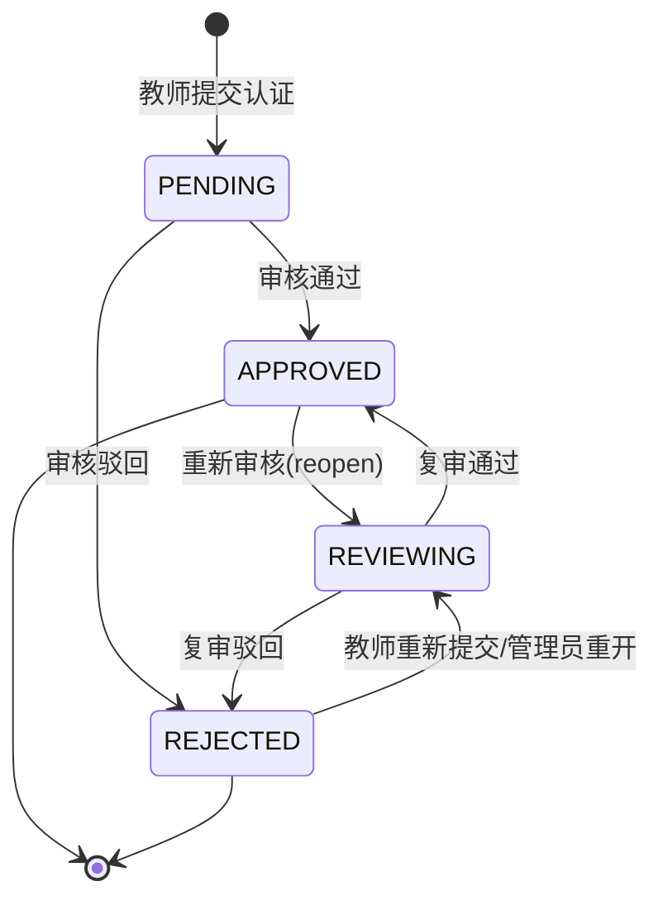
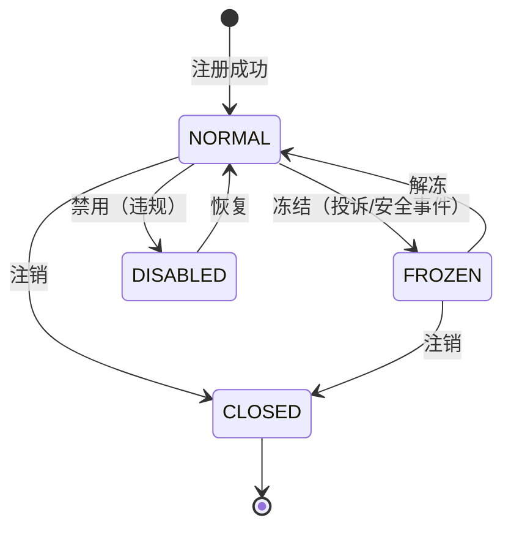
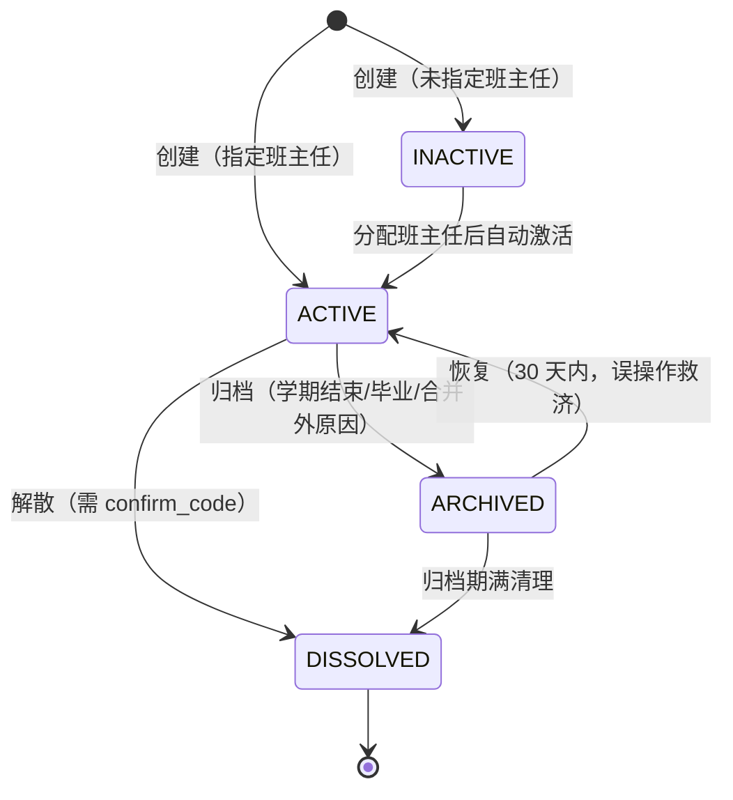
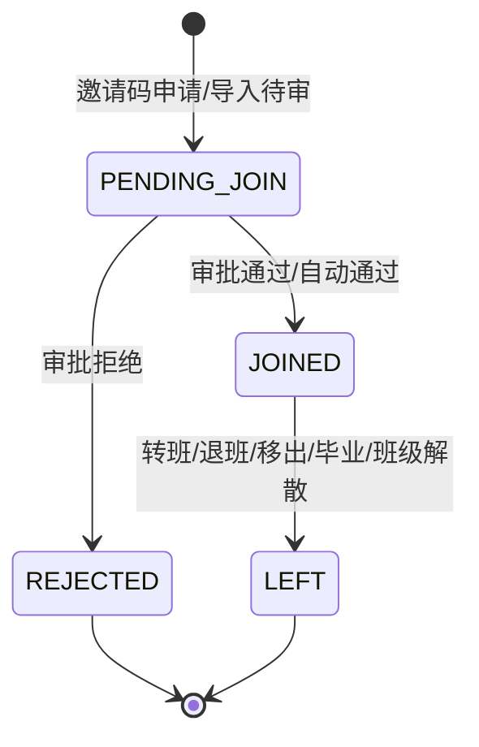

# 管理后台-教师与班级数据管理工作台-详细设计

## 1. 概述

### 1.1 功能定位

教师与班级数据管理工作台是 PrimeTop 管理后台的核心模块之一，面向平台管理员和运营人员，提供教师账号管理、教师资质审核、班级数据管理、师生关系维护、教学资源配置以及班级学情监控等功能的统一操作入口。

### 1.2 设计目标

| 目标 | 说明 |
| --- | --- |
| 教师全生命周期管理 | 覆盖教师注册审核、信息维护、权限分配、状态变更、注销等完整流程 |
| 班级数据集中管控 | 支持班级创建、归档、迁移、合并、解散等全生命周期操作 |
| 师生关系透明可溯 | 清晰呈现教师-班级-学生的绑定关系链路，支持批量调整 |
| 数据安全与合规 | 教师实名信息加密存储，操作行为全程审计，符合未成年人保护要求 |
| 高效运维工具 | 提供批量导入导出、数据校验、异常预警等运维能力 |

### 1.3 适用范围

- 平台超级管理员：全部功能
- 运营管理员：教师查询、班级查看、学情概览
- 内容管理员：无本模块权限
- 教师本人：通过教师端查看本人班级数据（非管理后台）

### 1.4 关联文档

| 文档 | 关系 |
| --- | --- |
| 教师端与班级管理-详细设计 | 教师端前台功能设计 |
| 服务端-教师班级管理与作业发布服务-详细设计 | 服务端接口设计 |
| 服务端-家庭账户管理与多孩子切换服务-详细设计 | 学生侧家庭账户 |
| 端到端流程设计-教师端班级管理与作业发布完整链路-详细设计 | 端到端业务流程 |
| 管理后台-权限角色与系统安全配置工作台-详细设计 | 角色权限体系 |
| 管理后台-用户查询与账号运维服务-详细设计 | 用户账号基础管理 |

---

## 2. 数据结构定义

### 2.1 教师信息表 (teacher_profile)

```sql
CREATE TABLE teacher_profile (
    id              BIGINT PRIMARY KEY AUTO_INCREMENT COMMENT '主键ID',
    user_id         BIGINT NOT NULL UNIQUE COMMENT '关联用户表user.id',
    teacher_no      VARCHAR(32) NOT NULL UNIQUE COMMENT '教师工号（平台分配，格式T+年月日+4位序列）',
    real_name       VARCHAR(64) NOT NULL COMMENT '真实姓名（加密存储）',
    real_name_hash  VARCHAR(64) NOT NULL COMMENT '姓名哈希值（用于等值查询）',
    id_card_enc     VARBINARY(256) NOT NULL COMMENT '身份证号（AES-256加密）',
    id_card_hash    VARCHAR(64) NOT NULL COMMENT '身份证哈希（用于查重）',
    phone_enc       VARBINARY(256) NOT NULL COMMENT '手机号（加密存储）',
    phone_hash      VARCHAR(64) NOT NULL COMMENT '手机号哈希',
    gender          TINYINT NOT NULL DEFAULT 0 COMMENT '性别：0-未知 1-男 2-女',
    avatar_url      VARCHAR(512) DEFAULT NULL COMMENT '头像URL',
    
    -- 教师资质信息
    school_name     VARCHAR(128) DEFAULT NULL COMMENT '所属学校名称',
    school_id       BIGINT DEFAULT NULL COMMENT '关联学校ID（如有）',
    title           VARCHAR(32) DEFAULT NULL COMMENT '职称：高级教师/一级教师/二级教师/特级教师等',
    employment_type TINYINT NOT NULL DEFAULT 0 COMMENT '聘用类型：0-未知 1-在编 2-聘用 3-实习',
    subject_primary VARCHAR(32) NOT NULL COMMENT '主教学科：chinese/math/english/physics/chemistry/biology/history/geography/politics/informatics',
    subject_secondary VARCHAR(128) DEFAULT NULL COMMENT '兼教学科（JSON数组）',
    grade_range     VARCHAR(64) NOT NULL COMMENT '任教年级范围（JSON，如["G7","G8","G9"]）',
    
    -- 审核与状态
    verify_status   TINYINT NOT NULL DEFAULT 0 COMMENT '审核状态：0-待审核 1-已通过 2-已驳回 3-复审中',
    verify_reason   VARCHAR(512) DEFAULT NULL COMMENT '审核说明/驳回原因',
    verified_at     DATETIME DEFAULT NULL COMMENT '审核通过时间',
    verified_by     BIGINT DEFAULT NULL COMMENT '审核人admin_id',
    
    teach_cert_no       VARCHAR(64) DEFAULT NULL COMMENT '教师资格证编号',
    teach_cert_img_url  VARCHAR(512) DEFAULT NULL COMMENT '教师资格证照片URL',
    cert_expire_date    DATE DEFAULT NULL COMMENT '资格证有效期',
    
    -- 账号状态
    status          TINYINT NOT NULL DEFAULT 1 COMMENT '状态：0-禁用 1-正常 2-冻结 3-已注销',
    status_reason   VARCHAR(256) DEFAULT NULL COMMENT '状态变更原因',
    frozen_at       DATETIME DEFAULT NULL COMMENT '冻结时间',
    frozen_by       BIGINT DEFAULT NULL COMMENT '冻结操作人',
    
    last_login_at   DATETIME DEFAULT NULL COMMENT '最后登录时间',
    last_login_ip   VARCHAR(45) DEFAULT NULL COMMENT '最后登录IP',
    
    created_at      DATETIME NOT NULL DEFAULT CURRENT_TIMESTAMP COMMENT '创建时间',
    updated_at      DATETIME NOT NULL DEFAULT CURRENT_TIMESTAMP ON UPDATE CURRENT_TIMESTAMP COMMENT '更新时间',
    deleted_at      DATETIME DEFAULT NULL COMMENT '软删除时间',
    
    INDEX idx_school_id (school_id),
    INDEX idx_verify_status (verify_status),
    INDEX idx_status (status),
    INDEX idx_subject_primary (subject_primary),
    INDEX idx_created_at (created_at),
    INDEX idx_real_name_hash (real_name_hash),
    INDEX idx_id_card_hash (id_card_hash),
    INDEX idx_phone_hash (phone_hash)
) ENGINE=InnoDB DEFAULT CHARSET=utf8mb4 COMMENT='教师信息表';
```

### 2.2 班级表 (class_info)

```sql
CREATE TABLE class_info (
    id              BIGINT PRIMARY KEY AUTO_INCREMENT COMMENT '班级主键ID',
    class_code      VARCHAR(16) NOT NULL UNIQUE COMMENT '班级编码（加入码，格式C+8位随机 alphanumeric）',
    class_name      VARCHAR(64) NOT NULL COMMENT '班级名称，如"七年级一班"',
    school_id       BIGINT DEFAULT NULL COMMENT '所属学校ID',
    school_name     VARCHAR(128) DEFAULT NULL COMMENT '所属学校名称（冗余字段）',
    
    -- 学段年级信息
    stage           TINYINT NOT NULL COMMENT '学段：1-小学 2-初中 3-高中',
    grade           TINYINT NOT NULL COMMENT '年级：1-12（1-6小学，7-9初中，10-12高中）',
    semester        TINYINT NOT NULL COMMENT '当前学期：1-上学期 2-下学期',
    
    -- 教材版本
    textbook_version VARCHAR(32) NOT NULL DEFAULT 'renjiao' COMMENT '默认教材版本',
    
    -- 班级属性
    class_type      TINYINT NOT NULL DEFAULT 1 COMMENT '班级类型：1-普通班 2-重点班 3-实验班 4-复读班',
    student_limit   INT NOT NULL DEFAULT 200 COMMENT '学生上限',
    student_count   INT NOT NULL DEFAULT 0 COMMENT '当前学生数',
    
    -- 状态
    status          TINYINT NOT NULL DEFAULT 1 COMMENT '状态：0-未激活 1-正常 2-已归档 3-已解散',
    archived_at     DATETIME DEFAULT NULL COMMENT '归档时间',
    archived_reason VARCHAR(256) DEFAULT NULL COMMENT '归档原因',
    
    created_by      BIGINT NOT NULL COMMENT '创建人ID（教师user_id或admin_id）',
    creator_type    TINYINT NOT NULL COMMENT '创建者类型：1-教师 2-管理员',
    
    start_date      DATE NOT NULL COMMENT '班级开课日期',
    end_date        DATE DEFAULT NULL COMMENT '预计结束日期',
    
    created_at      DATETIME NOT NULL DEFAULT CURRENT_TIMESTAMP,
    updated_at      DATETIME NOT NULL DEFAULT CURRENT_TIMESTAMP ON UPDATE CURRENT_TIMESTAMP,
    deleted_at      DATETIME DEFAULT NULL,
    
    INDEX idx_school_id (school_id),
    INDEX idx_stage_grade (stage, grade),
    INDEX idx_status (status),
    INDEX idx_created_by (created_by),
    INDEX idx_class_code (class_code)
) ENGINE=InnoDB DEFAULT CHARSET=utf8mb4 COMMENT='班级信息表';
```

### 2.3 教师班级关联表 (teacher_class_relation)

```sql
CREATE TABLE teacher_class_relation (
    id              BIGINT PRIMARY KEY AUTO_INCREMENT,
    teacher_id      BIGINT NOT NULL COMMENT '教师user_id',
    class_id        BIGINT NOT NULL COMMENT '班级ID',
    role            TINYINT NOT NULL DEFAULT 2 COMMENT '角色：1-班主任 2-任课教师',
    subject         VARCHAR(32) DEFAULT NULL COMMENT '任教学科（任课教师必填）',
    
    status          TINYINT NOT NULL DEFAULT 1 COMMENT '状态：0-已移除 1-在职',
    joined_at       DATETIME NOT NULL DEFAULT CURRENT_TIMESTAMP COMMENT '加入时间',
    left_at         DATETIME DEFAULT NULL COMMENT '离开时间',
    left_reason     VARCHAR(256) DEFAULT NULL COMMENT '离开原因',
    
    created_by      BIGINT NOT NULL COMMENT '操作人',
    created_at      DATETIME NOT NULL DEFAULT CURRENT_TIMESTAMP,
    updated_at      DATETIME NOT NULL DEFAULT CURRENT_TIMESTAMP ON UPDATE CURRENT_TIMESTAMP,
    
    UNIQUE KEY uk_teacher_class_active (teacher_id, class_id, status),
    INDEX idx_class_id (class_id),
    INDEX idx_teacher_id (teacher_id),
    INDEX idx_subject (subject)
) ENGINE=InnoDB DEFAULT CHARSET=utf8mb4 COMMENT='教师班级关联表';
```

### 2.4 学生班级关联表 (student_class_relation)

```sql
CREATE TABLE student_class_relation (
    id              BIGINT PRIMARY KEY AUTO_INCREMENT,
    student_id      BIGINT NOT NULL COMMENT '学生user_id',
    class_id        BIGINT NOT NULL COMMENT '班级ID',
    
    join_type       TINYINT NOT NULL DEFAULT 1 COMMENT '加入方式：1-邀请码加入 2-教师添加 3-管理员导入 4-批量导入',
    join_status     TINYINT NOT NULL DEFAULT 1 COMMENT '状态：0-待审核 1-已通过 2-已拒绝 3-已移出',
    
    joined_at       DATETIME NOT NULL DEFAULT CURRENT_TIMESTAMP COMMENT '加入时间',
    approved_by     BIGINT DEFAULT NULL COMMENT '审批人（教师或管理员）',
    approved_at     DATETIME DEFAULT NULL COMMENT '审批时间',
    
    left_at         DATETIME DEFAULT NULL COMMENT '离开时间',
    left_reason     VARCHAR(256) DEFAULT NULL COMMENT '离开原因：毕业/转班/退班/移出',
    
    created_at      DATETIME NOT NULL DEFAULT CURRENT_TIMESTAMP,
    updated_at      DATETIME NOT NULL DEFAULT CURRENT_TIMESTAMP ON UPDATE CURRENT_TIMESTAMP,
    
    UNIQUE KEY uk_student_class_active (student_id, class_id, join_status),
    INDEX idx_class_id (class_id),
    INDEX idx_student_id (student_id),
    INDEX idx_join_status (join_status)
) ENGINE=InnoDB DEFAULT CHARSET=utf8mb4 COMMENT='学生班级关联表';
```

### 2.5 教师审核日志表 (teacher_audit_log)

```sql
CREATE TABLE teacher_audit_log (
    id              BIGINT PRIMARY KEY AUTO_INCREMENT,
    teacher_id      BIGINT NOT NULL COMMENT '教师user_id',
    operator_id     BIGINT NOT NULL COMMENT '操作人ID',
    operator_type   TINYINT NOT NULL COMMENT '操作人类型：1-管理员 2-系统自动 3-教师本人',
    
    action          VARCHAR(64) NOT NULL COMMENT '操作类型：VERIFY_APPROVE/VERIFY_REJECT/STATUS_CHANGE/INFO_UPDATE/PERMISSION_CHANGE/FREEZE/UNFREEZE/DELETE',
    
    before_snapshot JSON DEFAULT NULL COMMENT '变更前数据快照',
    after_snapshot  JSON DEFAULT NULL COMMENT '变更后数据快照',
    
    remark          VARCHAR(512) DEFAULT NULL COMMENT '备注',
    ip_address      VARCHAR(45) DEFAULT NULL COMMENT '操作IP',
    user_agent      VARCHAR(256) DEFAULT NULL COMMENT '操作UA',
    
    created_at      DATETIME NOT NULL DEFAULT CURRENT_TIMESTAMP,
    
    INDEX idx_teacher_id (teacher_id),
    INDEX idx_operator_id (operator_id),
    INDEX idx_action (action),
    INDEX idx_created_at (created_at)
) ENGINE=InnoDB DEFAULT CHARSET=utf8mb4 COMMENT='教师操作审计日志';
```

### 2.6 学校信息表 (school_info)

```sql
CREATE TABLE school_info (
    id              BIGINT PRIMARY KEY AUTO_INCREMENT,
    school_code     VARCHAR(32) NOT NULL UNIQUE COMMENT '学校标识码（教育部统一编码）',
    school_name     VARCHAR(128) NOT NULL COMMENT '学校名称',
    school_type     TINYINT NOT NULL COMMENT '学校类型：1-公办小学 2-民办小学 3-公办初中 4-民办初中 5-公办高中 6-民办高中 7-九年一贯 8-完全中学',
    
    province_code   VARCHAR(8) NOT NULL COMMENT '省级行政区编码',
    city_code       VARCHAR(8) NOT NULL COMMENT '市级行政区编码',
    district_code   VARCHAR(8) NOT NULL COMMENT '区县编码',
    
    address         VARCHAR(256) DEFAULT NULL COMMENT '学校地址',
    contact_name    VARCHAR(64) DEFAULT NULL COMMENT '联系人姓名',
    contact_phone   VARCHAR(32) DEFAULT NULL COMMENT '联系电话',
    
    status          TINYINT NOT NULL DEFAULT 1 COMMENT '状态：0-禁用 1-正常',
    
    created_at      DATETIME NOT NULL DEFAULT CURRENT_TIMESTAMP,
    updated_at      DATETIME NOT NULL DEFAULT CURRENT_TIMESTAMP ON UPDATE CURRENT_TIMESTAMP,
    
    INDEX idx_province (province_code),
    INDEX idx_city (city_code),
    INDEX idx_district (district_code),
    INDEX idx_school_type (school_type)
) ENGINE=InnoDB DEFAULT CHARSET=utf8mb4 COMMENT='学校信息表';
```

### 2.7 班级操作日志表 (class_operation_log)

```sql
CREATE TABLE class_operation_log (
    id              BIGINT PRIMARY KEY AUTO_INCREMENT,
    class_id        BIGINT NOT NULL COMMENT '班级ID',
    operator_id     BIGINT NOT NULL COMMENT '操作人ID',
    operator_type   TINYINT NOT NULL COMMENT '操作人类型：1-管理员 2-教师 3-系统',
    
    operation_type  VARCHAR(48) NOT NULL COMMENT '操作类型：CREATE/UPDATE/ARCHIVE/DISSOLVE/STUDENT_JOIN/STUDENT_LEAVE/TEACHER_ASSIGN/TEACHER_REMOVE/TRANSFER/MERGE',
    
    target_type     VARCHAR(32) DEFAULT NULL COMMENT '操作对象类型：STUDENT/TEACHER/CLASS',
    target_id       BIGINT DEFAULT NULL COMMENT '操作对象ID',
    
    detail          JSON DEFAULT NULL COMMENT '操作详情（含变更前后值）',
    remark          VARCHAR(512) DEFAULT NULL,
    
    created_at      DATETIME NOT NULL DEFAULT CURRENT_TIMESTAMP,
    
    INDEX idx_class_id (class_id),
    INDEX idx_operator_id (operator_id),
    INDEX idx_operation_type (operation_type),
    INDEX idx_created_at (created_at)
) ENGINE=InnoDB DEFAULT CHARSET=utf8mb4 COMMENT='班级操作日志表';
```

---

## 3. API 接口设计

### 3.1 教师管理接口

#### 3.1.1 教师列表查询

```
GET /api/admin/teacher/list
```

**请求参数：**

| 参数 | 类型 | 必填 | 说明 |
| --- | --- | --- | --- |
| keyword | string | 否 | 搜索关键词（姓名/工号/手机号后四位） |
| verify_status | int | 否 | 审核状态筛选：0/1/2/3 |
| status | int | 否 | 账号状态筛选：0/1/2/3 |
| subject | string | 否 | 主教学科 |
| school_id | int | 否 | 学校ID |
| province_code | string | 否 | 省份编码 |
| employment_type | int | 否 | 聘用类型 |
| date_start | string | 否 | 注册开始日期 |
| date_end | string | 否 | 注册结束日期 |
| sort_field | string | 否 | 排序字段：created_at/last_login_at/student_count |
| sort_order | string | 否 | 排序方向：asc/desc |
| page | int | 否 | 页码，默认1 |
| page_size | int | 否 | 每页条数，默认20，最大100 |

**响应示例：**

```json
{
  "code": 0,
  "msg": "success",
  "data": {
    "total": 1532,
    "page": 1,
    "page_size": 20,
    "list": [
      {
        "teacher_id": 10086,
        "teacher_no": "T202601010001",
        "real_name": "张**",
        "gender": 2,
        "school_name": "北京市海淀区实验小学",
        "title": "高级教师",
        "subject_primary": "math",
        "subject_primary_label": "数学",
        "grade_range": ["G3", "G4", "G5"],
        "employment_type": 1,
        "employment_type_label": "在编",
        "verify_status": 1,
        "verify_status_label": "已通过",
        "status": 1,
        "status_label": "正常",
        "class_count": 3,
        "student_count": 128,
        "last_login_at": "2026-07-22T10:30:00+08:00",
        "created_at": "2026-01-01T08:00:00+08:00"
      }
    ]
  }
}
```

#### 3.1.2 教师详情查询

```
GET /api/admin/teacher/{teacher_id}/detail
```

**响应示例：**

```json
{
  "code": 0,
  "msg": "success",
  "data": {
    "teacher_id": 10086,
    "teacher_no": "T202601010001",
    "real_name": "张老师",
    "gender": 2,
    "avatar_url": "https://cdn.primetop.com/avatar/10086.jpg",
    "phone_masked": "138****1234",
    "school_id": 2001,
    "school_name": "北京市海淀区实验小学",
    "title": "高级教师",
    "employment_type": 1,
    "subject_primary": "math",
    "subject_secondary": ["informatics"],
    "grade_range": ["G3", "G4", "G5"],
    "verify_status": 1,
    "teach_cert_no": "201111000200001234",
    "cert_expire_date": "2031-06-30",
    "status": 1,
    "last_login_at": "2026-07-22T10:30:00+08:00",
    "last_login_ip": "114.254.1xx.x",
    "created_at": "2026-01-01T08:00:00+08:00",
    "verified_at": "2026-01-02T14:00:00+08:00",
    "verified_by_name": "管理员李四",
    "classes": [
      {
        "class_id": 5001,
        "class_name": "三年级一班",
        "role": 1,
        "role_label": "班主任",
        "student_count": 45,
        "status": 1
      },
      {
        "class_id": 5002,
        "class_name": "四年级三班",
        "role": 2,
        "role_label": "任课教师",
        "subject": "math",
        "student_count": 42,
        "status": 1
      }
    ]
  }
}
```

#### 3.1.3 教师审核操作

```
POST /api/admin/teacher/{teacher_id}/verify
```

**请求体：**

```json
{
  "action": "approve",
  "reason": "教师资格证核验通过，准予通过",
  "cert_no_verified": true,
  "cert_expire_verified": true
}
```

| 字段 | 类型 | 必填 | 说明 |
| --- | --- | --- | --- |
| action | string | 是 | `approve` / `reject` / `reopen`（重新审核） |
| reason | string | reject时必填 | 审核说明/驳回原因 |
| cert_no_verified | boolean | 否 | 是否已核验资格证编号 |
| cert_expire_verified | boolean | 否 | 是否已核验资格证有效期 |

**响应：**

```json
{
  "code": 0,
  "msg": "审核操作成功",
  "data": {
    "teacher_id": 10086,
    "verify_status": 1,
    "verified_at": "2026-07-23T07:20:00+08:00"
  }
}
```

#### 3.1.4 教师状态变更

```
PUT /api/admin/teacher/{teacher_id}/status
```

**请求体：**

```json
{
  "status": 2,
  "reason": "接到家长投诉，暂冻结账号待调查",
  "notify_teacher": true
}
```

| 字段 | 类型 | 必填 | 说明 |
| --- | --- | --- | --- |
| status | int | 是 | 目标状态：0-禁用 1-恢复正常 2-冻结 3-注销 |
| reason | string | 是 | 变更原因（最少10字） |
| notify_teacher | boolean | 否 | 是否通知教师本人，默认true |

#### 3.1.5 批量教师审核

```
POST /api/admin/teacher/batch-verify
```

**请求体：**

```json
{
  "teacher_ids": [10086, 10087, 10088],
  "action": "approve",
  "reason": "批量初审通过"
}
```

#### 3.1.6 教师信息修改

```
PUT /api/admin/teacher/{teacher_id}/info
```

**请求体：**

```json
{
  "school_name": "北京市海淀区实验小学（变更后）",
  "title": "特级教师",
  "subject_primary": "math",
  "subject_secondary": ["informatics", "science"],
  "grade_range": ["G3", "G4", "G5", "G6"],
  "reason": "教师职称变更，更新信息"
}
```

### 3.2 班级管理接口

#### 3.2.1 班级列表查询

```
GET /api/admin/class/list
```

**请求参数：**

| 参数 | 类型 | 必填 | 说明 |
| --- | --- | --- | --- |
| keyword | string | 否 | 搜索关键词（班级名称/班级编码） |
| school_id | int | 否 | 学校ID |
| stage | int | 否 | 学段：1/2/3 |
| grade | int | 否 | 年级 |
| status | int | 否 | 班级状态：0/1/2/3 |
| teacher_id | int | 否 | 按教师筛选 |
| has_student | boolean | 否 | 是否有学生 |
| created_start | string | 否 | 创建开始日期 |
| created_end | string | 否 | 创建结束日期 |
| page | int | 否 | 页码 |
| page_size | int | 否 | 每页条数 |

**响应示例：**

```json
{
  "code": 0,
  "data": {
    "total": 856,
    "list": [
      {
        "class_id": 5001,
        "class_code": "C8K3M9X2",
        "class_name": "三年级一班",
        "school_name": "北京市海淀区实验小学",
        "stage": 1,
        "stage_label": "小学",
        "grade": 3,
        "grade_label": "三年级",
        "semester": 1,
        "textbook_version": "renjiao",
        "class_type": 1,
        "class_type_label": "普通班",
        "student_count": 45,
        "student_limit": 200,
        "head_teacher_name": "张老师",
        "subject_teachers": [
          {"name": "张老师", "subject": "math"},
          {"name": "李老师", "subject": "chinese"},
          {"name": "王老师", "subject": "english"}
        ],
        "status": 1,
        "status_label": "正常",
        "created_at": "2026-02-15T09:00:00+08:00",
        "created_by_name": "张老师",
        "creator_type": 1
      }
    ]
  }
}
```

#### 3.2.2 创建班级

```
POST /api/admin/class/create
```

**请求体：**

```json
{
  "class_name": "七年级三班",
  "school_id": 2001,
  "school_name": "北京市海淀区实验中学",
  "stage": 2,
  "grade": 7,
  "semester": 1,
  "textbook_version": "renjiao",
  "class_type": 1,
  "student_limit": 200,
  "head_teacher_id": 10086,
  "start_date": "2026-09-01",
  "end_date": "2027-06-30",
  "auto_generate_code": true
}
```

**响应：**

```json
{
  "code": 0,
  "msg": "班级创建成功",
  "data": {
    "class_id": 6001,
    "class_code": "C7Y2N4R9",
    "class_name": "七年级三班",
    "created_at": "2026-07-23T07:20:00+08:00"
  }
}
```

#### 3.2.3 班级详情查询

```
GET /api/admin/class/{class_id}/detail
```

**响应：**

```json
{
  "code": 0,
  "data": {
    "class_id": 6001,
    "class_code": "C7Y2N4R9",
    "class_name": "七年级三班",
    "school_id": 2001,
    "school_name": "北京市海淀区实验中学",
    "stage": 2,
    "grade": 7,
    "semester": 1,
    "textbook_version": "renjiao",
    "class_type": 1,
    "student_count": 48,
    "student_limit": 200,
    "status": 1,
    "start_date": "2026-09-01",
    "end_date": "2027-06-30",
    "created_at": "2026-07-23T07:20:00+08:00",
    "created_by_name": "管理员admin",
    "creator_type": 2,
    "teachers": [
      {
        "teacher_id": 10086,
        "teacher_name": "张老师",
        "role": 1,
        "role_label": "班主任",
        "subject": null,
        "joined_at": "2026-07-23T07:20:00+08:00",
        "status": 1
      }
    ],
    "statistics": {
      "avg_active_rate_7d": 0.78,
      "avg_assignment_completion": 0.85,
      "avg_mastery_level": 0.62,
      "total_study_hours_month": 1256.5
    }
  }
}
```

#### 3.2.4 班级归档

```
POST /api/admin/class/{class_id}/archive
```

**请求体：**

```json
{
  "reason": "学期结束，班级归档",
  "archive_type": "semester_end",
  "notify_teachers": true,
  "notify_students": true,
  "retain_data_days": 365
}
```

| 字段 | 类型 | 必填 | 说明 |
| --- | --- | --- | --- |
| reason | string | 是 | 归档原因 |
| archive_type | string | 是 | 归档类型：`semester_end`/`graduation`/`teacher_leave`/`merge`/`manual` |
| notify_teachers | boolean | 否 | 是否通知教师，默认true |
| notify_students | boolean | 否 | 是否通知学生，默认true |
| retain_data_days | int | 否 | 数据保留天数，默认365 |

#### 3.2.5 班级解散

```
POST /api/admin/class/{class_id}/dissolve
```

**请求体：**

```json
{
  "reason": "班级违规操作，予以解散",
  "confirm_code": "DISSOLVE_6001",
  "notify_members": true,
  "export_data": true
}
```

> **安全措施：** 解散操作需二次确认，`confirm_code` 必须为 `DISSOLVE_{class_id}` 格式。

#### 3.2.6 班级合并

```
POST /api/admin/class/merge
```

**请求体：**

```json
{
  "source_class_ids": [5001, 5002],
  "target_class_id": 5003,
  "merge_strategy": "keep_both_teachers",
  "reason": "教学调整，合并班级",
  "notify_members": true
}
```

### 3.3 师生关系管理接口

#### 3.3.1 分配教师到班级

```
POST /api/admin/class/{class_id}/assign-teacher
```

**请求体：**

```json
{
  "teacher_id": 10087,
  "role": 2,
  "subject": "chinese",
  "notify_teacher": true
}
```

#### 3.3.2 移除班级教师

```
DELETE /api/admin/class/{class_id}/remove-teacher/{teacher_id}
```

**请求参数：**

| 参数 | 类型 | 必填 | 说明 |
| --- | --- | --- | --- |
| reason | string | 是 | 移除原因（query param） |
| notify_teacher | boolean | 否 | 是否通知教师 |

#### 3.3.3 学生加入审批

```
PUT /api/admin/class/{class_id}/student/{student_id}/approve
```

**请求体：**

```json
{
  "action": "approve",
  "reason": "学生身份核实通过"
}
```

#### 3.3.4 批量导入学生

```
POST /api/admin/class/{class_id}/students/import
```

**请求：** `multipart/form-data`

| 字段 | 类型 | 说明 |
| --- | --- | --- |
| file | file | Excel文件，列：姓名、手机号、学号 |
| auto_approve | boolean | 是否自动通过审批 |
| notify_students | boolean | 是否通知学生 |

**响应：**

```json
{
  "code": 0,
  "data": {
    "total_rows": 50,
    "success_count": 47,
    "failed_count": 3,
    "failed_details": [
      {"row": 12, "name": "李X", "phone": "138xxxx", "reason": "手机号格式错误"},
      {"row": 25, "name": "王X", "phone": "139xxxx", "reason": "该学生已在其他班级"},
      {"row": 38, "name": "赵X", "phone": "137xxxx", "reason": "手机号未注册PrimeTop"}
    ]
  }
}
```

#### 3.3.5 学生转班

```
POST /api/admin/student/transfer-class
```

**请求体：**

```json
{
  "student_ids": [20001, 20002],
  "from_class_id": 5001,
  "to_class_id": 5003,
  "reason": "学生调班",
  "migrate_learning_data": true
}
```

### 3.4 学校管理接口

#### 3.4.1 学校列表查询

```
GET /api/admin/school/list
```

#### 3.4.2 创建/编辑学校

```
POST /api/admin/school/create
PUT /api/admin/school/{school_id}/update
```

### 3.5 数据导出接口

#### 3.5.1 导出教师列表

```
POST /api/admin/teacher/export
```

**请求体：**

```json
{
  "filters": {
    "verify_status": 1,
    "subject": "math",
    "province_code": "110000"
  },
  "fields": ["teacher_no", "real_name", "school_name", "subject_primary", "class_count", "student_count", "created_at"],
  "format": "xlsx"
}
```

**响应：** 异步任务模式

```json
{
  "code": 0,
  "data": {
    "task_id": "export_teacher_20260723_001",
    "status": "processing",
    "estimated_seconds": 30,
    "callback_url": "/api/admin/export/task/export_teacher_20260723_001"
  }
}
```

#### 3.5.2 导出班级花名册

```
POST /api/admin/class/{class_id}/export-roster
```

---

## 4. 前端页面设计

### 4.1 页面路由结构

```
/admin/teacher-class/
├── /teacher/list                  → 教师列表页
├── /teacher/:id/detail            → 教师详情页
├── /teacher/pending               → 待审核教师列表
├── /teacher/export                → 教师数据导出
├── /class/list                    → 班级列表页
├── /class/:id/detail              → 班级详情页
├── /class/create                  → 创建班级
├── /school/list                   → 学校管理列表
└── /school/:id/detail             → 学校详情页
```

### 4.2 教师列表页

**页面布局：**

```
┌──────────────────────────────────────────────────────────┐
│ 教师管理                                          [导出数据] │
├──────────────────────────────────────────────────────────┤
│ ┌─────────────┐ ┌──────────┐ ┌──────────┐ ┌──────────┐    │
│ │ 总教师数     │ │ 待审核    │ │ 本月新增   │ │ 异常状态   │    │
│ │   1,532     │ │   23     │ │    67    │ │    12    │    │
│ └─────────────┘ └──────────┘ └──────────┘ └──────────┘    │
├──────────────────────────────────────────────────────────┤
│ [搜索: 姓名/工号/手机号]  学科[全部▼] 状态[全部▼] 学校[全部▼] │
│ 审核状态[全部▼] 聘用类型[全部▼] 注册时间[日期范围]  [查询] [重置]│
├──────────────────────────────────────────────────────────┤
│ ☐ 工号    姓名    学校          学科  审核状态 状态 班级数 学生数 │
│ ☐ T2026.. 张**  海淀实验小学    数学  ✅通过  正常  3    128  │
│ ☐ T2026.. 李**  人大附中        语文  ⏳待审  -    -    -   │
│ ☐ T2026.. 王**  清华附中        英语  ❌驳回  -    -    -   │
│ ☐ T2026.. 赵**  北师大实验      物理  ✅通过  冻结  2    89   │
├──────────────────────────────────────────────────────────┤
│ ☐全选  [批量审核] [批量冻结]           共1532条 < 1 2 3 ... > │
└──────────────────────────────────────────────────────────┘
```

**关键交互：**

1. **快捷筛选标签**：页面顶部展示「全部 / 待审核(23) / 已通过 / 已驳回 / 异常状态」快捷标签
2. **批量操作**：勾选多个教师后底部浮出操作栏
3. **行内快捷操作**：每行右侧「...」菜单提供：查看详情、审核、冻结/解冻、重置密码
4. **身份证脱敏**：列表中姓名默认脱敏（张**），仅超级管理员可查看完整姓名

### 4.3 教师详情页

**页面结构：**

```
┌──────────────────────────────────────────────────────────┐
│ ← 返回  教师详情 - 张老师 (T202601010001)                    │
│                                          [审核] [更多操作▼] │
├──────────────────────────────────────────────────────────┤
│ ┌──Tab──┐                                                │
│ │基本信息│ 班级管理 │ 学情概览 │ 审核记录 │ 操作日志        │
│ └───────┘                                                │
├──────────────────────────────────────────────────────────┤
│                                                          │
│  ┌──────────┐  姓名：张老师                               │
│  │          │  性别：女                                    │
│  │  [头像]   │  工号：T202601010001                        │
│  │          │  手机：138****1234 [查看完整]                │
│  └──────────┘  学校：北京市海淀区实验小学                    │
│                职称：高级教师                                │
│                聘用类型：在编                                │
│                主教学科：数学                                │
│                兼教学科：信息技术                              │
│                任教年级：三、四、五年级                         │
│                                                          │
│  ┌─── 资质信息 ──────────────────────────────────────┐    │
│  │ 教师资格证编号：201111000200001234                   │    │
│  │ 资格证有效期至：2031-06-30                          │    │
│  │ 资格证照片：[查看图片]                              │    │
│  │ 审核状态：✅ 已通过（2026-01-02 由管理员李四审核）      │    │
│  └──────────────────────────────────────────────────┘    │
│                                                          │
│  ┌─── 账号状态 ──────────────────────────────────────┐    │
│  │ 状态：🟢 正常                                       │    │
│  │ 最后登录：2026-07-22 10:30 (IP: 114.254.x.x)       │    │
│  │ 注册时间：2026-01-01 08:00                         │    │
│  └──────────────────────────────────────────────────┘    │
│                                                          │
│  ┌─── 关联班级 ──────────────────────────────────────┐    │
│  │ 班级名称        角色     学生数  状态               │    │
│  │ 三年级一班      班主任    45    🟢正常  [管理]       │    │
│  │ 四年级三班      任课教师   42    🟢正常  [管理]       │    │
│  │ 五年级二班      任课教师   41    🟢正常  [管理]       │    │
│  └──────────────────────────────────────────────────┘    │
│                                                          │
└──────────────────────────────────────────────────────────┘
```

### 4.4 教师审核流程弹窗

```
┌──────────────────────────────────────┐
│ 教师审核 - 张老师 (T202601010001)       │
├──────────────────────────────────────┤
│                                      │
│  当前状态：⏳ 待审核                    │
│                                      │
│  ┌── 资质核验 ──────────────────┐    │
│  │ ☑ 教师资格证编号已核验         │    │
│  │ ☑ 资格证有效期已核验           │    │
│  │ ☑ 身份信息一致性已核验         │    │
│  │ ☐ 学校归属已核实              │    │
│  └──────────────────────────────┘    │
│                                      │
│  审核结果：                           │
│  ◉ 通过    ○ 驳回    ○ 退回补充材料     │
│                                      │
│  审核说明：                           │
│  ┌──────────────────────────────┐    │
│  │ 资格证核验通过，准予通过         │    │
│  └──────────────────────────────┘    │
│                                      │
│  ☐ 通知教师本人                       │
│                                      │
│         [取消]  [确认审核]             │
└──────────────────────────────────────┘
```

### 4.5 班级列表页

```
┌──────────────────────────────────────────────────────────┐
│ 班级管理                                         [+创建班级] │
├──────────────────────────────────────────────────────────┤
│ ┌─────────────┐ ┌──────────┐ ┌──────────┐ ┌──────────┐    │
│ │ 总班级数     │ │ 活跃班级   │ │ 待审批学生  │ │ 异常班级   │    │
│ │   856      │ │   723    │ │    45    │ │    8     │    │
│ └─────────────┘ └──────────┘ └──────────┘ └──────────┘    │
├──────────────────────────────────────────────────────────┤
│ [搜索: 班级名/编码]  学段[全部▼] 学校[全部▼] 状态[全部▼]      │
│ 教师[选择...] 年级[全部▼]               [查询] [重置]        │
├──────────────────────────────────────────────────────────┤
│ 班级编码   班级名称    学校      学段年级 班主任 学生数 状态   │
│ C8K3..  三年级一班  海淀实验小学  小学三  张**   45/200 🟢正常│
│ C7Y2..  七年级三班  海淀实验中学  初中七  李**   48/200 🟢正常│
│ C5R9..  五年级二班  人大附小     小学五  王**   52/200 📦已归档│
│ C2M8..  高二六班   清华附中     高中十一 赵**   --    ⚫已解散│
│ C3K1..  三年级四班  北师大实验   小学三  --     3/200  🔴未激活│
├──────────────────────────────────────────────────────────┤
│ ☐全选  [批量归档] [批量导出]        共856条 < 1 2 3 ... >   │
└──────────────────────────────────────────────────────────┘
```

**关键交互：**

1. **快捷筛选标签**：顶部「全部(856) / 正常(723) / 未激活(31) / 已归档(94) / 已解散(8)」；「待审批学生(45)」标签点击后跳转班级列表并自动展开待审批子视图
2. **异常班级标记**：连续 7 天无教师登录、人数超限、无班主任的班级标红，悬浮提示异常原因
3. **行内快捷操作**：每行「...」菜单提供：查看详情、归档、解散（需二次确认）、复制班级编码
4. **批量归档**：仅允许勾选「正常」状态班级；归档前弹窗提示各班进行中作业数量（引用作业服务查询），确认后逐班执行并展示部分成功结果
5. **学生数列**：展示 `当前/上限`，超限 90% 时橙色预警；点击数字直达班级详情学生名单 Tab

### 4.6 班级详情页

**页面结构：**

```
┌──────────────────────────────────────────────────────────┐
│ ← 返回  班级详情 - 七年级三班 (C7Y2N4R9)                   │
│                    [归档] [解散] [更多操作▼] [导出花名册]  │
├──────────────────────────────────────────────────────────┤
│ ┌──Tab──┐                                               │
│ │基本信息│ 学生名单 │ 教师团队 │ 学情概览 │ 操作日志      │
│ └───────┘                                               │
├──────────────────────────────────────────────────────────┤
│  ┌─── 基本信息 ────────────────────────────────────┐     │
│  │ 学校：北京市海淀区实验中学（ID:2001）              │     │
│  │ 学段年级：初中 七年级   学期：2026 上学期          │     │
│  │ 教材版本：人教版     班级类型：普通班              │     │
│  │ 学生数：48/200     开课：2026-09-01 ~ 2027-06-30  │     │
│  │ 状态：🟢 正常      创建：管理员admin 2026-07-23    │     │
│  │ 班级编码：C7Y2N4R9  [重置编码]（学生可见性风险提示）│     │
│  └─────────────────────────────────────────────────┘     │
│                                                          │
│  ┌─── 学情概览（7日/30日切换）─────────────────────┐     │
│  │ 活跃率 78%  作业完成率 85%  平均掌握度 62%        │     │
│  │ 月学习时长 1,256.5h  薄弱TOP3: 一元一次方程/...   │     │
│  └─────────────────────────────────────────────────┘     │
└──────────────────────────────────────────────────────────┘
```

**学生名单 Tab：**

```
┌──────────────────────────────────────────────────────────┐
│ [搜索: 姓名/学号]  状态[全部▼]   [批量导入] [批量转班]     │
│ ┌─子Tab─┐  ┌─待审批(3)─┐                                 │
│ │已通过(48)│ │已移出(5) │                                  │
│ └────────┘  └──────────┘                                  │
├──────────────────────────────────────────────────────────┤
│ ☐ 学号    姓名    加入方式   加入时间       状态    操作    │
│ ☐ S2026.. 陈**   邀请码    2026-09-02    已通过 [移出][转班]│
│ ☐ S2026.. 刘**   教师添加  2026-09-03    已通过 [移出][转班]│
│   ... 共48条 < 1 2 3 >                                   │
├──────────────────────────────────────────────────────────┤
│ 待审批子Tab：                                             │
│ ☐ 申请学生  申请时间    来源    操作                       │
│ ☐ 周**    2026-09-10  邀请码  [通过] [拒绝]               │
└──────────────────────────────────────────────────────────┘
```

**关键交互：**

1. **移出学生**：弹窗必填移出原因（退班/误加入/违规/毕业），移出后学生端立即失去班级可见性（Token 内班级声明失效，见 §9 事件联动）
2. **批量转班**：勾选后选择目标班级（仅同校同学段同年级可选），展示目标班剩余容量，提交后走 §6.3 转班事务
3. **导出花名册**：默认脱敏导出（姓名首字+学号），完整字段导出需二级审批（见 §12 合规 C2）

**教师团队 Tab：**

| 列 | 说明 |
| --- | --- |
| 教师 | 姓名（脱敏）+ 工号 |
| 角色 | 班主任 / 任课教师（学科） |
| 加入时间 / 状态 | 在职或已移除 |
| 操作 | [移除]（班主任移除前必须先指定新班主任，守卫 G11） |

页头提供 [+分配教师]：搜索教师（仅审核通过+正常状态可被搜索，守卫 G3）→ 选择角色/学科 → 提交。

### 4.7 创建班级页

**表单字段与校验：**

| 字段 | 组件 | 校验规则 |
| --- | --- | --- |
| 学校 | 远程搜索 Select | 必填；可选学校需 `status=1` |
| 学段/年级 | 级联 Select | 必填；年级值必须落在所选学段区间（小学1-6/初中7-9/高中10-12），前端与后端双重校验 |
| 学期 | Radio | 必填；默认当前学期（由学期管理服务计算） |
| 班级名称 | Input(64) | 必填；同校同年级下唯一（失焦即校验，守卫 G12） |
| 教材版本 | Select | 必填；默认人教版 |
| 班级类型 | Select | 必填；默认普通班 |
| 学生上限 | InputNumber | 1-500，默认 200 |
| 班主任 | 远程搜索 | 可选；仅审核通过教师；未指定则班级进入「未激活」状态 |
| 开课/结束日期 | DatePicker | 结束日期 > 开课日期 |

**提交行为：**

1. 提交按钮防重（loading 态 + `Idempotency-Key` 请求头，见 §8.4）
2. 成功后跳转班级详情页，右上角 Toast 展示班级编码并提供「复制编码」快捷操作
3. 指定了班主任时：创建班级 + 建立 `teacher_class_relation`（role=1）同一事务；未指定班主任时班级 `status=0 未激活`，分配班主任后自动激活（守卫 G5）

### 4.8 学校管理页

```
┌──────────────────────────────────────────────────────────┐
│ 学校管理                                        [+新增学校] │
├──────────────────────────────────────────────────────────┤
│ [搜索: 学校名/标识码]  省份[全部▼] 市[全部▼] 类型[全部▼]    │
├──────────────────────────────────────────────────────────┤
│ 学校标识码  学校名称      类型     地区     教师数 班级数 状态│
│ 110108..  海淀实验小学  公办小学  北京海淀   56   24  🟢正常│
│ 110108..  海淀实验中学  公办初中  北京海淀   88   31  🟢正常│
└──────────────────────────────────────────────────────────┘
```

**编辑弹窗字段：** 标识码（创建后不可改）、名称、类型、省/市/区（级联）、地址、联系人、联系电话、状态。

**校验规则：**

1. 标识码须为教育部统一编码格式（9 位数字或民政部门规则，正则 `^\d{9}$` 宽容模式 + 人工免审通道）
2. 同区划下学校名称唯一（守卫 G13）；重名冲突时提示「已有同名学校，请确认是否为同一所」
3. 学校禁用前置条件：无正常状态班级挂载（守卫 G14），否则列出冲突班级清单
4. 学校信息变更（更名/区划调整）仅更新 `school_info` 与新引用；历史班级/教师冗余的 `school_name` 不回刷，列表按 `school_id` 关联展示实时名称（冗余字段仅用于学校被物理删除时的兜底展示）

### 4.9 前端组件清单

> 复用《客户端-管理后台Web前端架构与开发规范》：React 18 + TypeScript + Ant Design，qiankun 微前端子应用 `tc-workbench`（teacher-class workbench）。

| 组件 | 职责 | 关键 Props / 要点 |
| --- | --- | --- |
| `TeacherStatCards` | 教师列表顶部四指标卡 | `{total, pending, monthlyNew, abnormal}`；待审核卡可点击跳转筛选 |
| `TeacherFilterBar` | 教师多条件筛选 | 受控组件；「重置」恢复默认并触发查询 |
| `TeacherListTable` | 教师列表 | `rowSelection` 受控；行内「...」Dropdown；`onPageChange` 远端分页 |
| `TeacherVerifyModal` | 审核弹窗 | 资质核验 Checklist（四项）+ 结果 Radio + 说明；提交带 `Idempotency-Key` |
| `BatchActionBar` | 批量操作浮层 | `selectedCount`、`actions: BatchAction[]`；每次操作后清空选择并刷新 |
| `MaskedField` | 脱敏字段 + 明文查看 | `value`、`sensitivity: L2\|L3`；L3 点击触发后端明文接口并展示审计提示 |
| `ClassStatCards` | 班级四指标卡 | 异常班级卡点击加过滤 `status=abnormal` |
| `ClassListTable` | 班级列表 | 学段年级列合并渲染；学生数进度条；归档/解散按钮守卫态禁用 |
| `ClassDetailTabs` | 班级详情五 Tab 容器 | 懒加载各 Tab；学情概览引用学情看板组件包 |
| `StudentRosterTable` | 学生名单 + 待审批子 Tab | 审批操作乐观更新 + 失败回滚刷新 |
| `StudentImportModal` | 批量导入 | 模板下载、文件校验（.xlsx ≤5MB ≤500 行）、结果失败明细导出 |
| `TransferClassModal` | 批量转班 | 目标班容量实时校验；`migrate_learning_data` 开关 |
| `SchoolFormModal` | 学校新增/编辑 | 标识码不可编辑态；区划级联数据源缓存 |
| `AuditLogTimeline` | 审计/操作日志时间线 | 通用组件；快照字段级 Diff 渲染（before/after JSON） |
| `ConfirmWithCodeDialog` | 高危操作二次确认 | 输入 `confirm_code`（如 `DISSOLVE_6001`）匹配后才允许提交 |

**`MaskedField` 组件示例：**

```tsx
import { useState } from 'react';
import { Typography, Tooltip, message } from 'antd';
import { EyeOutlined } from '@ant-design/icons';
import { revealSensitiveField } from '@/api/sensitive';

interface Props {
  label: string;            // 字段名
  masked: string;           // 脱敏值，如 "138****1234"
  revealUrl: string;        // 明文查看接口，如 /api/admin/teacher/10086/reveal
  field: string;            // 字段标识，如 "phone"
  sensitivity: 'L2' | 'L3'; // L2 点击直接揭示；L3 需确认并强审计
  reasonRequired?: boolean; // L3 是否必须填写查看原因
}

export const MaskedField: React.FC<Props> = ({ label, masked, revealUrl, field, sensitivity, reasonRequired }) => {
  const [plain, setPlain] = useState<string | null>(null);
  const [loading, setLoading] = useState(false);

  const handleReveal = async (reason?: string) => {
    setLoading(true);
    try {
      // 明文查看：服务端二次校验角色 + 写审计日志（§6.4），返回短时效明文
      const { data } = await revealSensitiveField(revealUrl, {
        field,
        reason: reason ?? '',
        // 明文仅在前端内存停留 60s，倒计时结束自动恢复脱敏
        ttl_seconds: 60,
      });
      setPlain(data.value);
      setTimeout(() => setPlain(null), 60_000);
      if (sensitivity === 'L3') {
        message.info('本次查看已记录审计日志', 3);
      }
    } catch (e: any) {
      message.error(e?.msg ?? '无权查看，请联系超级管理员');
    } finally {
      setLoading(false);
    }
  };

  return (
    <div className="masked-field">
      <span className="masked-field__label">{label}：</span>
      <Typography.Text>{plain ?? masked}</Typography.Text>
      <Tooltip title={plain ? `${60}s 后自动恢复脱敏` : '查看明文（将记录审计）'}>
        <EyeOutlined onClick={() => handleReveal()} loading={loading} style={{ marginLeft: 8, cursor: 'pointer' }} />
      </Tooltip>
    </div>
  );
};
```

---

## 5. 关键状态机与流转守卫

### 5.1 教师审核状态机（verify_status）



**枚举映射：** 0-PENDING 待审核、1-APPROVED 已通过、2-REJECTED 已驳回、3-REVIEWING 复审中。

**流转规则：**

| 当前态 | 动作 | 目标态 | 附加效果 |
| --- | --- | --- | --- |
| PENDING | approve | APPROVED | 写 verified_at/verified_by；发 `teacher.verified` 事件；教师端解锁建班能力 |
| PENDING | reject | REJECTED | reason 必填；发 `teacher.verify_rejected`；教师端引导申诉/重新提交 |
| APPROVED | reopen | REVIEWING | 触发场景：资格证投诉、定期抽查；期间教师可继续登录但新班级创建被拦截（守卫 G3） |
| REJECTED | resubmit / reopen | REVIEWING | 教师重新提交材料后进入复审 |
| REVIEWING | approve / reject | APPROVED / REJECTED | 复审结论回写，快照存 teacher_audit_log |

> PENDING 不可直接 reopen；REVIEWING 不可再次 reopen（防嵌套复审）。

### 5.2 教师账号状态机（status）



**枚举映射：** 0-DISABLED 禁用、1-NORMAL 正常、2-FROZEN 冻结、3-CLOSED 已注销。

**关键规则：**

1. 冻结/禁用/注销均需吊销教师全端登录态（调用用户账号安全服务 Token 吊销接口），生效延迟 ≤ 5s
2. 注销前置条件：名下无 `status=1` 的班级关联（班主任或任课）；否则拦截并提示先移除/移交（守卫 G10）
3. `verify_status != 1`（未审核通过）的教师不允许置为 NORMAL 之外的状态变更入口——账号状态机与审核状态机解耦：未审核通过教师登录后仅能浏览/申诉，不能建班、发作业（能力门控，见 §13 与教师端服务对齐）
4. 状态变更 reason 必填（≥10 字）；每次变更写 teacher_audit_log（before/after 快照）

### 5.3 班级生命周期状态机（class_info.status）



**枚举映射：** 0-INACTIVE 未激活、1-ACTIVE 正常、2-ARCHIVED 已归档、3-DISSOLVED 已解散。

**关键规则：**

1. 归档时：进行中作业自动截止并按作业服务规则结算（发 `class.archived` 事件，作业服务消费）；学生与教师关联保留为只读（历史可查）
2. 解散时：`confirm_code=DISSOLVE_{class_id}` 强校验；学生关联置为移出（left_reason='class_dissolved'）；可选先导出全量数据（异步任务）
3. 合并（merge）：源班 ACTIVE → DISSOLVED（archived_reason='merge'，target_class_id 记入 detail）；目标班保持 ACTIVE，见 §6.2
4. 归档 30 天内可恢复且仅限原归档人或超级管理员；恢复后自动通知全部在职教师
5. INACTIVE 班级不允许学生加入（守卫 G6）；班级编码在归档/解散后保留不复用（历史作业/错题引用完整性）

### 5.4 学生班级关系状态机（student_class_relation.join_status）



**枚举映射：** 0-PENDING_JOIN 待审核、1-JOINED 已通过、2-REJECTED 已拒绝、3-LEFT 已移出。

**关键规则：**

1. 转班事务：原班 JOINED→LEFT（left_reason='transfer'）+ 目标班插入 JOINED，同一本地事务；`migrate_learning_data=true` 时学习数据迁移走异步事件（§9 `student.transferred`），迁移完成前目标班学情报表标注「迁移中」
2. 学生同时仅可属于同校同学段同年级的一个 ACTIVE 班级（跨班唯一约束，守卫 G7）
3. 学生被移出后再次申请加入：历史 LEFT 行保留，新插入 PENDING_JOIN 行（依赖 §5.6 唯一索引修复）

### 5.5 教师班级关系状态机（teacher_class_relation.status）

1（在职）⇄ 0（已移除）：移除需 left_reason；班主任被移除前必须先转移班主任角色（守卫 G11）；教师被移除时其在该班的未批改作业任务交接给班主任（发 `class.teacher_removed` 事件，作业服务消费）。

### 5.6 v1.0 唯一索引缺陷修复（DDL 增补）

v1.0 中 `uk_teacher_class_active(teacher_id, class_id, status)` 与 `uk_student_class_active(student_id, class_id, join_status)` 以状态列参与唯一键：同一师生“离开后再次加入”会与历史 `status=0/3` 行撞唯一键（如学生两次移出后两行均为 `(student_id, class_id, 3)`），导致再次加入失败。修复方案：改用 MySQL 8.0 函数索引，仅对“活跃行”生效（函数返回 NULL 不参与唯一约束）：

```sql
-- 教师班级关联：至多一条在职记录，允许多条历史移除记录
ALTER TABLE teacher_class_relation
  DROP INDEX uk_teacher_class_active,
  ADD UNIQUE KEY uk_teacher_class_active
    ((IF(status = 1, 0, NULL)), teacher_id, class_id);

-- 学生班级关联：至多一条“待审/已通过”活跃记录，允许多条 LEFT/REJECTED 历史
ALTER TABLE student_class_relation
  DROP INDEX uk_student_class_active,
  ADD UNIQUE KEY uk_student_class_active
    ((IF(join_status IN (0, 1), 0, NULL)), student_id, class_id);
```

> 注意：两条函数索引含义不同——教师侧“在职”唯一；学生侧“待审或已通过”唯一（防止同时存在待审与已通过两行）。同时保留普通索引 `idx_teacher_id/idx_student_id` 支撑历史查询。上线前需执行存量重复数据检查（同键多条活跃行先人工归并）。

### 5.7 状态守卫总表（G1-G15）

| 守卫 | 约束 | 违反时错误码 |
| --- | --- | --- |
| G1 | 教师审核动作仅在 PENDING/REVIEWING 态允许；REVIEWING 不可 reopen | 55911 |
| G2 | reject 必填 reason（≥10 字） | 55912 |
| G3 | 仅 verify_status=1 且 status=1 的教师可被分配到班级/设为班主任/被搜索选中 | 55921 |
| G4 | 批量审核仅作用于 PENDING 态教师，部分失败返回逐条结果 | 55913 |
| G5 | 班级 INACTIVE→ACTIVE 仅由“分配班主任”触发；无班主任班级不可手动激活 | 55931 |
| G6 | INACTIVE/ARCHIVED/DISSOLVED 班级不允许学生加入/教师分配/作业发布 | 55932 |
| G7 | 学生在同校同学段同年级仅可加入一个 ACTIVE 班级 | 55941 |
| G8 | 班级学生数不可超过 student_limit（导入/审批/转班/合并四入口统一校验） | 55942 |
| G9 | 解散必须携带 `confirm_code=DISSOLVE_{class_id}` 且班级为 ACTIVE | 55933 |
| G10 | 教师注销前名下不得有在职班级关联 | 55915 |
| G11 | 班主任移除/转班前必须先指定新班主任 | 55934 |
| G12 | 同校同年级下班级名称唯一 | 55935 |
| G13 | 同区划下学校名称唯一；学校标识码全局唯一 | 55961 |
| G14 | 学校禁用前不得挂载正常状态班级 | 55962 |
| G15 | 合并仅允许同校同学段同年级的 ACTIVE 班级，且合并后学生数不超目标班上限 | 55943 |

---

## 6. 关键代码示例

### 6.1 教师审核服务（幂等 + CAS + 审计同事务）

```java
@Service
@RequiredArgsConstructor
public class TeacherVerifyService {

    private final TeacherProfileMapper teacherMapper;
    private final TeacherAuditLogMapper auditLogMapper;
    private final TcOutboxMapper outboxMapper;
    private final ApplicationEventPublisher eventPublisher;

    /**
     * 教师审核。幂等策略：
     * - 重复提交相同结果：返回当前状态（成功语义，不报错）；
     * - 状态已被他人变更（CAS 失败）：返回 55911 引导刷新。
     */
    @Transactional(rollbackFor = Exception.class)
    public VerifyResult verify(Long teacherId, VerifyAction action, String reason,
                               AdminOperator operator) {
        TeacherProfile teacher = teacherMapper.selectByIdForUpdate(teacherId);

        // G1: 仅 PENDING / REVIEWING 可审核
        if (teacher.getVerifyStatus() != VerifyStatus.PENDING
                && teacher.getVerifyStatus() != VerifyStatus.REVIEWING) {
            // 幂等：目标态与当前态一致时直接返回成功
            if (isSameOutcome(teacher.getVerifyStatus(), action)) {
                return VerifyResult.idempotentHit(teacher);
            }
            throw new BizException(ErrorCode.TEACHER_VERIFY_STATE_INVALID); // 55911
        }
        // G2: 驳回必填原因
        if (action == VerifyAction.REJECT && StringUtils.length(reason) < 10) {
            throw new BizException(ErrorCode.TEACHER_VERIFY_REASON_REQUIRED); // 55912
        }

        VerifyStatus target = action == VerifyAction.APPROVE
                ? VerifyStatus.APPROVED : VerifyStatus.REJECTED;

        // CAS 状态推进（带乐观检查，防止并发双审）
        int updated = teacherMapper.casUpdateVerifyStatus(
                teacherId, teacher.getVerifyStatus().getCode(), target.getCode(),
                reason, operator.getAdminId(), LocalDateTime.now());
        if (updated == 0) {
            throw new BizException(ErrorCode.TEACHER_VERIFY_STATE_INVALID); // 55911
        }

        // 审计日志同事务（before/after 快照）
        auditLogMapper.insert(TeacherAuditLog.builder()
                .teacherId(teacherId)
                .operatorId(operator.getAdminId())
                .operatorType(OperatorType.ADMIN)
                .action(action == VerifyAction.APPROVE ? "VERIFY_APPROVE" : "VERIFY_REJECT")
                .beforeSnapshot(JsonUtils.minimal(teacher, "verifyStatus", "verifiedAt", "verifiedBy"))
                .afterSnapshot(JsonUtils.of("verifyStatus", target.getCode(), "reason", reason))
                .remark(reason)
                .ipAddress(operator.getIp())
                .userAgent(operator.getUa())
                .build());

        // Outbox 同事务：审核结果事件（通知/教师端能力门控解耦消费）
        outboxMapper.insert(TcOutbox.of(
                action == VerifyAction.APPROVE ? "teacher.verified" : "teacher.verify_rejected",
                teacherId, JsonUtils.of("teacherId", teacherId, "action", action.name())));

        return VerifyResult.success(teacherId, target);
    }
}
```

> 批量审核（§3.1.5）循环调用本方法，逐条 try/catch 汇总 partial 结果；单条失败不影响其余（每条独立事务 `REQUIRES_NEW`）。

### 6.2 班级合并服务（事务 + 分批迁移 + Outbox）

```java
@Service
@RequiredArgsConstructor
public class ClassMergeService {

    private final ClassInfoMapper classMapper;
    private final StudentClassRelationMapper relationMapper;
    private final TeacherClassRelationMapper teacherRelMapper;
    private final ClassOperationLogMapper opLogMapper;
    private final TcOutboxMapper outboxMapper;

    @Transactional(rollbackFor = Exception.class)
    public MergeResult merge(MergeRequest req, AdminOperator operator) {
        ClassInfo target = classMapper.selectByIdForUpdate(req.getTargetClassId());
        List<ClassInfo> sources = classMapper.selectByIdsForUpdate(req.getSourceClassIds());

        // G15: 同校同学段同年级且均为 ACTIVE
        for (ClassInfo src : sources) {
            if (src.getStatus() != ClassStatus.ACTIVE
                    || !Objects.equals(src.getSchoolId(), target.getSchoolId())
                    || src.getGrade() != target.getGrade()) {
                throw new BizException(ErrorCode.CLASS_MERGE_MISMATCH); // 55943
            }
        }
        // G8: 容量校验（合并后不超目标班上限）
        int total = target.getStudentCount()
                + sources.stream().mapToInt(ClassInfo::getStudentCount).sum();
        if (total > target.getStudentLimit()) {
            throw new BizException(ErrorCode.CLASS_CAPACITY_EXCEEDED); // 55942
        }

        for (ClassInfo src : sources) {
            // 1) 学生关联迁移：保留原 joined_at，join_type 追加 'merged' 标记
            relationMapper.batchTransferClass(src.getId(), target.getId(), "merge");
            // 2) 教师合并策略
            if ("keep_both_teachers".equals(req.getMergeStrategy())) {
                // 目标班不存在的同学科任课教师整体迁入；学科冲突保留目标班教师
                teacherRelMapper.mergeActiveTeachers(src.getId(), target.getId());
            } // keep_head_only：源班教师关联仅写入历史，不迁入
            // 3) 源班 -> DISSOLVED（CAS，防并发操作）
            classMapper.casUpdateStatus(src.getId(), ClassStatus.ACTIVE, ClassStatus.DISSOLVED,
                    "merge", JsonUtils.of("targetClassId", target.getId()));
            // 4) 班级操作日志（源班+目标班各一条）
            opLogMapper.insert(ClassOperationLog.of(src.getId(), operator, "MERGE_SOURCE",
                    JsonUtils.of("targetClassId", target.getId(), "students", src.getStudentCount())));
        }

        // 目标班计数以迁移后实数重算（防漂移）
        classMapper.recalcStudentCount(target.getId());
        opLogMapper.insert(ClassOperationLog.of(target.getId(), operator, "MERGE_TARGET",
                JsonUtils.of("sourceClassIds", req.getSourceClassIds(), "totalStudents", total)));

        // Outbox：合并完成事件（通知师生两端 + 学情数据归并消费）
        outboxMapper.insert(TcOutbox.of("class.merged", target.getId(),
                JsonUtils.of("targetClassId", target.getId(),
                             "sourceClassIds", req.getSourceClassIds(),
                             "notifyMembers", req.isNotifyMembers())));
        return MergeResult.of(target.getId(), total);
    }
}
```

> 班级人数 >1000 或单事务行数预算超限时（合并后的批量 update 分层执行），转异步任务模式：先写 `class_merge_task`（PENDING），由后台 worker 分批 200 人迁移，进度通过统一异步任务进度中心下发；任务失败自动回滚已完成批次（逆向迁移）。

### 6.3 学生批量导入（部分成功 + 行级错误明细）

```java
@Service
@RequiredArgsConstructor
public class StudentImportService {

    private final StudentClassRelationMapper relationMapper;
    private final UserAccountClient userAccountClient; // 用户基础服务 gRPC 客户端

    /**
     * 行级独立事务：单行失败不影响其他行；返回逐行结果供前端渲染失败明细。
     * 上限：500 行/文件（与教师端 50602 对齐）。
     */
    public ImportResult importStudents(Long classId, MultipartFile file,
                                       boolean autoApprove, AdminOperator operator) {
        ClassInfo clazz = classMapper.selectById(classId);
        if (clazz.getStatus() != ClassStatus.ACTIVE) {
            throw new BizException(ErrorCode.CLASS_NOT_ACTIVE); // 55932（G6）
        }
        List<StudentRow> rows = ExcelParser.parse(file, StudentRow.class, 500);
        ImportResult result = new ImportResult(rows.size());

        for (int i = 0; i < rows.size(); i++) {
            StudentRow row = rows.get(i);
            try {
                self().importOneRow(classId, row, autoApprove, operator); // REQUIRES_NEW
                result.success(i + 1, row);
            } catch (BizException e) {
                // 行级失败归因：格式错误 / 未注册 / 已在别的班 / 容量满
                result.fail(i + 1, row, e.getMessage());
            }
        }
        return result;
    }

    @Transactional(propagation = Propagation.REQUIRES_NEW, rollbackFor = Exception.class)
    public void importOneRow(Long classId, StudentRow row, boolean autoApprove,
                             AdminOperator operator) {
        // 1) 手机号格式校验
        if (!PhoneUtil.isValid(row.getPhone())) {
            throw new BizException(ImportError.PHONE_FORMAT);   // 55951
        }
        // 2) 手机号 -> user_id（未注册则失败，不代创建账号——未成年人账号须家长侧创建）
        Long studentId = userAccountClient.findStudentIdByPhoneHash(PhoneUtil.hash(row.getPhone()));
        if (studentId == null) {
            throw new BizException(ImportError.NOT_REGISTERED);  // 55952
        }
        // 3) G7/G8：跨班唯一 + 容量
        relationMapper.assertJoinable(classId, studentId, 1);    // 55941 / 55942
        // 4) 写入关联（join_type=4 批量导入；auto_approve 直接 JOINED，否则 PENDING_JOIN）
        relationMapper.insert(StudentClassRelation.ofImported(
                classId, studentId, autoApprove, operator.getAdminId()));
        if (autoApprove) {
            classMapper.incrementStudentCount(classId, 1);
        }
    }
}
```

### 6.4 敏感字段明文查看（权限 + 强审计）

```java
/**
 * 明文查看统一入口。仅 SUPER_ADMIN 角色可调用（L3 级）；
 * 审计写入失败时主流程回滚——审计优先于业务（合规红线 C3）。
 */
@PostMapping("/api/admin/teacher/{teacherId}/reveal")
@Transactional(rollbackFor = Exception.class)
public R<RevealVO> reveal(@PathVariable Long teacherId,
                          @RequestBody @Valid RevealReq req,
                          @AuthAdmin AdminOperator operator) {
    if (!operator.hasRole(RoleCode.SUPER_ADMIN)) {
        throw new BizException(ErrorCode.REVEAL_PERMISSION_DENIED); // 55971
    }
    if (req.getSensitivity() == Sensitivity.L3 && req.getReason().length() < 5) {
        throw new BizException(ErrorCode.REVEAL_REASON_REQUIRED);   // 55972
    }
    TeacherProfile t = teacherMapper.selectById(teacherId);
    String plain = switch (req.getField()) {
        case "phone"   -> crypto.decrypt(t.getPhoneEnc());
        case "id_card" -> crypto.decrypt(t.getIdCardEnc());
        case "real_name" -> crypto.decrypt(t.getRealNameEnc());
        default -> throw new BizException(ErrorCode.REVEAL_FIELD_INVALID); // 55973
    };
    // 强审计：字段、原因、IP、UA 全量留痕（审计失败即回滚本次查看）
    auditLogMapper.insert(TeacherAuditLog.builder()
            .teacherId(teacherId).operatorId(operator.getAdminId())
            .operatorType(OperatorType.ADMIN)
            .action("REVEAL_" + req.getField().toUpperCase())
            .remark(req.getReason()).ipAddress(operator.getIp())
            .userAgent(operator.getUa()).build());
    // 明文不缓存；响应标注短时效，由前端 60s 后自动恢复脱敏
    return R.ok(new RevealVO(plain, 60));
}
```

### 6.5 班级编码生成（防碰撞）

```java
/**
 * C + 8 位随机 alphanumeric（去除易混淆 0/O/1/I/L）。
 * 唯一性由 class_code UNIQUE 索引兜底；冲突重试 3 次后降级为 C + 10 位。
 */
@Component
@RequiredArgsConstructor
public class ClassCodeGenerator {

    private static final char[] ALPHABET =
            "ABCDEFGHJKMNPQRSTUVWXYZ23456789".toCharArray();
    private static final SecureRandom RANDOM = new SecureRandom();

    private final ClassInfoMapper classMapper;

    public String generate() {
        for (int retry = 0; retry < 3; retry++) {
            char[] buf = new char[8];
            for (int i = 0; i < 8; i++) buf[i] = ALPHABET[RANDOM.nextInt(ALPHABET.length)];
            String code = "C" + new String(buf);
            if (classMapper.existsByCode(code) == 0) return code;
        }
        return "C" + RandomStringUtils.randomAlphanumeric(10).toUpperCase();
    }
}
```

> 编码总量 31^8 ≈ 852 亿，现有规模下碰撞概率可忽略；重置编码（§4.6）会使旧码 30 天内仍可跳转提示「编码已更换」并引导新码，防社交分享旧码失效体验（旧码映射存 Redis，TTL 30 天）。

---

## 7. 错误码与错误处理

### 7.1 错误码段分配

本工作台使用 **55900-55999** 段（管理后台内部错误码，登记于《服务端统一业务异常码与错误分类体系》55xxx 序列）。教师/学生自助操作错误仍归教师端服务 **50xxx** 段（见 §13 边界），不重复定义。

### 7.2 错误码总表

| 错误码 | HTTP | 含义 | 前端处理 |
| --- | --- | --- | --- |
| 55900 | 500 | 系统繁忙 | Toast 重试 |
| 55901 | 404 | 教师不存在 | 返回列表 |
| 55902 | 400 | 参数校验失败 | 表单错误定位 |
| 55903 | 429 | 操作过于频繁 | 限流提示 |
| 55910 | 403 | 无本模块操作权限 | 引导联系超管 |
| 55911 | 409 | 教师审核状态不允许该操作（G1） | 刷新详情 |
| 55912 | 400 | 驳回必须填写原因≥10字（G2） | 聚焦原因输入框 |
| 55913 | 409 | 批量审核部分失败 | 展示逐条结果弹窗 |
| 55915 | 409 | 教师名下存在在职班级，不允许注销（G10） | 展示班级清单 |
| 55921 | 409 | 教师未审核通过/非正常态，不可分配（G3） | 提示先完成审核 |
| 55930 | 404 | 班级不存在 | 返回班级列表 |
| 55931 | 409 | 无班主任班级不可手动激活（G5） | 引导分配班主任 |
| 55932 | 409 | 班级状态不允许该操作（G6） | 刷新列表 |
| 55933 | 400 | 解散确认码错误（G9） | 提示 confirm_code 格式 |
| 55934 | 409 | 班主任移除前须指定新班主任（G11） | 弹出指定新班主任表单 |
| 55935 | 409 | 同校同年级班级名称已存在（G12） | 聚焦名称输入框 |
| 55941 | 409 | 学生已加入同年级其他班级（G7） | 展示当前班级 |
| 55942 | 403 | 班级学生数已达上限（G8） | 展示剩余容量 |
| 55943 | 409 | 合并条件不满足（同校同年级/容量）（G15） | 展示冲突详情 |
| 55951 | 400 | 导入行手机号格式错误 | 失败明细导出 |
| 55952 | 404 | 手机号未注册 PrimeTop | 失败明细导出 |
| 55953 | 400 | 导入文件格式/行数超限（≤500 行） | 提示下载模板分批导入 |
| 55961 | 409 | 学校名称/标识码重复（G13） | 确认是否同名 |
| 55962 | 409 | 学校存在正常班级，不可禁用（G14） | 展示班级清单 |
| 55971 | 403 | 无明文查看权限（仅超管） | 引导申请权限 |
| 55972 | 400 | 明文查看必须填写原因 | 弹窗补填 |
| 55973 | 400 | 不支持揭示的字段 | — |
| 55981 | 409 | 导出任务已达并发上限 | 排队提示 |

### 7.3 通用处理策略

1. **部分成功结构**：批量操作（审核/导入/转班）统一返回 `{total, success_count, failed_count, failed_details[]}`，HTTP 状态码为 200，业务码 0；全部失败时才返回对应错误码
2. **幂等语义**：写操作均支持 `Idempotency-Key` 头；重复请求返回首次结果指纹（§8.4）
3. **参数与守卫分离**：5590x 系参数错，5591x-5597x 系状态/守卫错，便于告警分类（参数错不告警，守卫命中突增需关注）

---

## 8. 权限与数据安全

### 8.1 角色×操作权限矩阵

| 操作 | SUPER_ADMIN | OPS_ADMIN | CONTENT_ADMIN | DATA_AUDITOR（只读） |
| --- | --- | --- | --- | --- |
| 教师列表/详情查询 | ✅ | ✅ | ❌ | ✅（含审计 Tab） |
| 教师审核（单/批量） | ✅ | ✅ | ❌ | ❌ |
| 教师状态变更（冻结/禁用/注销） | ✅ | ❌（仅可发起申请，超管审批） | ❌ | ❌ |
| 明文查看（手机/身份证） | ✅ | ❌ | ❌ | ❌ |
| 班级创建/归档/解散/合并 | ✅ | ✅（解散需超管二次确认） | ❌ | ❌ |
| 师生关系操作（分配/移除/转班/导入） | ✅ | ✅ | ❌ | ❌ |
| 学校管理 | ✅ | ✅ | ❌ | ✅（只读） |
| 数据导出（脱敏） | ✅ | ✅ | ❌ | ✅ |
| 花名册完整字段导出 | ✅（双人审批） | ❌ | ❌ | ❌ |

> 权限点注册到《管理后台-权限角色与系统安全配置工作台》RBAC 体系：`tc.teacher.read / tc.teacher.verify / tc.teacher.status / tc.teacher.reveal / tc.class.read / tc.class.write / tc.class.dissolve / tc.relation.write / tc.school.write / tc.export.masked / tc.export.full`。

### 8.2 敏感字段分级

| 级别 | 字段 | 展示规则 |
| --- | --- | --- |
| L1 公开 | 工号、学科、学校、班级统计 | 列表直接展示 |
| L2 脱敏 | 姓名（张**）、手机号（138****1234）、IP | 默认脱敏；OPS_ADMIN 可点击揭示，揭示即审计 |
| L3 强管控 | 身份证号、资格证图片、完整手机号 | 仅 SUPER_ADMIN + 原因必填 + 强审计；前端 60s 自动恢复脱敏 |
| 未成年人 | 学生手机号/姓名 | 本工作台仅展示首字+学号；完整信息走《用户查询与账号运维》并受其未成年人保护约束 |

### 8.3 审计要求

1. `teacher_audit_log` / `class_operation_log` 仅允许 INSERT，物理禁止 UPDATE/DELETE（DB 账号权限层面限制）
2. 高危操作（解散/合并/注销/明文查看/完整导出）审计行包含操作原因、IP、UA、前后快照
3. 导出文件自动写入水印（操作人工号+时间），文件 7 天后自动过期（存储生命周期引擎执行）

### 8.4 幂等与并发控制汇总

| 操作 | 幂等机制 | 并发控制 |
| --- | --- | --- |
| 教师审核 | 目标态重复提交返回成功（语义幂等） | SELECT FOR UPDATE + CAS |
| 班级创建 | `Idempotency-Key` 24h 窗口 | 同名校验唯一索引兼并防护 |
| 归档/解散/合并 | confirm_code + 状态 CAS | FOR UPDATE 锁目标班 |
| 学生审批 | 状态 CAS（PENDING→JOINED/REJECTED） | 唯一活跃索引（§5.6） |
| 批量导入 | 行级独立事务，无整体幂等要求 | 容量校验在行事务内重读 |
| 转班 | `Idempotency-Key`（同批学生+同目标班） | 双班 FOR UPDATE 顺序：先 from 后 to，避免死锁环 |

---

## 9. 跨模块事件联动（Outbox）

### 9.1 事件清单（tc.domain.events）

| 事件 | 触发时机 | 关键 payload | 主要消费方 |
| --- | --- | --- | --- |
| teacher.verified | 审核通过 | teacherId, verifiedAt | 通知中心（站内信/短信）、教师端能力门控 |
| teacher.verify_rejected | 审核驳回 | teacherId, reason | 通知中心 |
| teacher.status_changed | 冻结/禁用/注销 | teacherId, from, to, reason | 用户账号安全（Token 吊销）、任务调度（停止投递）、作业服务（未批改任务交接） |
| class.archived | 班级归档 | classId, reason, retainDays | 作业服务（进行中作业截止）、学情分析、任务调度 |
| class.dissolved | 班级解散 | classId, reason, exportRef | 通知中心（师生通知）、作业服务、学情分析 |
| class.merged | 合并完成 | targetClassId, sourceClassIds | 学情数据归并、通知中心、任务调度（重定向） |
| class.teacher_removed | 教师被移除 | classId, teacherId, handoverTo | 作业服务（批改任务交接） |
| student.class_joined | 学生加入生效 | studentId, classId | 学情分析（班级聚合重算）、家长通知 |
| student.class_left | 学生移出 | studentId, classId, reason | 学情分析、任务调度（移除班级任务） |
| student.transferred | 转班完成 | studentId, fromClassId, toClassId, migrateLearningData | 学情迁移 worker、任务调度 |

### 9.2 Outbox 表与投递

```sql
CREATE TABLE tc_outbox (
    id           BIGINT PRIMARY KEY AUTO_INCREMENT,
    event_id     VARCHAR(64) NOT NULL UNIQUE COMMENT '事件ID（雪花），消费方幂等键',
    event_type   VARCHAR(64) NOT NULL COMMENT '事件类型，见 §9.1',
    aggregate_id BIGINT NOT NULL COMMENT '聚合根ID（teacherId/classId/studentId）',
    payload      JSON NOT NULL,
    status       TINYINT NOT NULL DEFAULT 0 COMMENT '0-PENDING 1-SENT 2-DEAD',
    retry_count  INT NOT NULL DEFAULT 0,
    next_retry_at DATETIME DEFAULT NULL,
    created_at   DATETIME NOT NULL DEFAULT CURRENT_TIMESTAMP,
    sent_at      DATETIME DEFAULT NULL,
    INDEX idx_status_next (status, next_retry_at)
) ENGINE=InnoDB COMMENT='教师班级域 Outbox（与业务同库同事务）';
```

Relay 服务每 500ms 扫描 PENDING 批量 200 条发布 MQ（topic `tc.domain.events`）；消费方以 `(event_id, consumer)` 幂等。2^n 退避重试 8 次后置 DEAD 并 P2 告警；每日对账 `tc_outbox SENT 量 vs MQ 发送确认量`，差异自动补发。

---

## 10. 监控与告警

| 指标 | 口径 | 阈值/告警 |
| --- | --- | --- |
| 待审核教师积压 | verify_status=0 数量 | >200 或最老待审 >48h → P2 告警（SLA：审核时效 24h） |
| 审核操作时长 P95 | 接口耗时 | >1.5s → 关注 |
| 批量导入失败率 | 失败行/总行（按日） | >15% → 提示检查模板/数据源 |
| 班级合并失败次数 | 异常事务/日 | ≥3 → P2 |
| 导出任务积压 | export 队列长度 | >50 或最老任务 >10min → P2 |
| 明文查看次数 | REVEAL_* 审计行/人/日 | 单管理员 >50 次/日 → 安全审计告警 |
| 学生关联不一致 | relation 活跃数 vs class.student_count | 对账 Job 每小时，偏差>0 自动重算并告警 |
| Outbox DEAD 数 | status=2 | ≥1 → P2；单事件类型 10min 内重试失败>20 → P1 |
| 班级人数超限率 | student_count/limit>1 | 必须=0，出现即 P1（守卫旁路入侵） |
| 审计写入失败 | 主流程回滚次数 | ≥1 → P1（审计优先红线） |

---

## 11. 降级与容错（D1-D8）

| 编号 | 故障场景 | 降级策略 |
| --- | --- |
| D1 | 用户基础服务（gRPC）不可用 | 导入单行失败归因“系统繁忙，请稍后重试该行”；列表仍可展示（不依赖实时 user 服务） |
| D2 | 学校库不可用 | 列表/详情使用 school_name 冗余字段展示；新建/编辑学校入口置灰并提示 |
| D3 | 通知中心不可用 | 审核等主流程不阻塞；Outbox 重试链路自然补偿（最多 8 次+DEAD 人工处理） |
| D4 | 作业服务查询超时（归档前作业数统计） | 归档弹窗显示“作业数据不可用”，提供“仍要归档”二次确认；截止结算以事件消费为准 |
| D5 | 导出中心积压 | 新导出任务进入排队并前端提示预计等待；超过 24h 自动取消并通知 |
| D6 | 合并大班事务超时 | 自动转异步任务模式（§6.2），进度中心可查；失败逆向回滚 |
| D7 | Redis 不可用 | 幂等退化到 DB 唯一索引约束（Idempotency-Key 表）；旧班级编码映射暂失效（30 天后自然过期） |
| D8 | 审计库写失败 | 主流程回滚（宁可不操作不可不审计）；触发 P1 告警并熔断该类写操作 5min |

> 红线：任何降级不得绕过守卫 G1-G15 与审计要求；D4/D8 涉及数据一致性的操作宁可拒绝不可静默放行。

---

## 12. 合规红线

| 编号 | 红线 |
| --- | --- |
| C1 | 未成年人个人信息最小化：班级维度仅展示姓名首字+学号；学生完整信息查询一律走《用户查询与账号运维》并受其未成年人保护约束 |
| C2 | 花名册完整字段导出：仅 SUPER_ADMIN 发起 + 双人审批；文件水印（操作人+时间）；7 天过期；导出行为全量审计 |
| C3 | 审计优先：任何高危操作的审计写入失败必须回滚业务操作，不允许“先操作后补审计” |
| C4 | 教师实名四要素（姓名/身份证/手机号/资格证）加密存储（AES-256），明文仅内存短暂存在，禁止日志/缓存/埋点携带明文 |
| C5 | 班级解散/归档涉及未成年人学习记录：数据保留期（retain_data_days 默认 365 天）内不得物理删除；到期清理委托《存储资源统一生命周期管理引擎》 |
| C6 | 本模块数据（师生关系/学情聚合）不得用于营销触达或对外提供；B 端机构使用需走《B 端合作与机构接入方案》数据授权链路 |
| C7 | 教师账号注销：保留审计日志不可变；实名加密字段按《个人信息保护法》到期删除策略执行（法规要求保存期限除外） |
| C8 | 管理后台全部操作 HTTPS；明文查看接口响应头禁用缓存（`Cache-Control: no-store`） |

---

## 13. 契约对齐与边界

| 对齐项 | 对方文档 | 约定 |
| --- | --- | --- |
| 教师自助操作 vs 管理员操作 | 服务端-教师班级管理与作业发布服务 | 教师建班/拉学生/发布作业归教师端（50xxx）；管理员强制操作（审核/合并/转班/解散）归本工作台（559xx）；两侧行为均写 class_operation_log，operator_type 区分 |
| 教师能力门控 | 同上 + AI服务 | verify_status=1 才可建班/发作业：教师端服务在入口校验，本工作台在分配教师时校验（G3），双重防线 |
| 学生主体查询 | 管理后台-用户查询与账号运维 | 本工作台不提供学生账号管理（禁言/封禁/注销），仅班级关系操作；跨文档导航带 userId |
| 权限点 | 管理后台-权限角色与系统安全配置 | §8.1 权限码注册到 RBAC；角色变更事件由权限工作台广播，本工作台缓存 5min 失效 |
| 异步导出协议 | 统一文件生成与异步报表导出中心 | 导出任务复用统一 task_id/轮询协议；水印与过期由导出中心执行 |
| 学籍同步 | 服务端-学校教务系统标准数据对接 | 教务系统学籍变更（转班/毕业）经适配器写入后产生同一套事件（§9.1），本工作台展示来源标记 operator_type=3 系统 |
| 通知触达 | 端到端流程设计-系统通知触发与消息推送投递 | 本域仅发事件，不直接触达；模板/频控/免打扰统一由通知域裁决 |
| Token 吊销 | 服务端-用户账号安全与登录风控引擎 | 教师冻结/禁用/注销事件由其消费并吊销全端令牌，SLA ≤5s |

---

## 14. 验收场景

| # | 场景 | 预期 |
| --- | --- | --- |
| 1 | 提交教师审核（通过），重复点击提交 | 首次成功；重复请求幂等返回成功；teacher.verified 事件仅一条 |
| 2 | 对已通过教师再次 reject | 55911，提示刷新；状态不变 |
| 3 | 批量审核 5 人，其中 1 人已被他人审核 | 部分成功结构：4 成功 1 失败，失败行标 55911 |
| 4 | OPS_ADMIN 尝试明文查看身份证 | 55971；SUPER_ADMIN 填原因可看，审计行含 REVEAL_ID_CARD |
| 5 | 冻结教师后 5s 内教师端请求 | 全端 401（Token 已吊销） |
| 6 | 注销名下有在职班级的教师 | 55915，展示班级清单；移除关联后可注销 |
| 7 | 创建同校同年级同名班级 | 55935；不同年级同名允许 |
| 8 | 创建班级不指定班主任 | 班级 INACTIVE，学生加入被拒 55932；分配班主任后自动 ACTIVE |
| 9 | 解散班级 confirm_code 错误 | 55933；正确码后学生关联全部 LEFT(reason=class_dissolved)，事件发出 |
| 10 | 移除班主任但未指定新班主任 | 55934，弹窗引导指定 |
| 11 | 学生移出后再次申请加入同一班级 | 历史行保留，新 PENDING_JOIN 行写入成功（§5.6 函数索引生效） |
| 12 | 导入 500 行，12 行手机号未注册 | 488 成功 12 失败；失败明细可导出；班级计数=488 |
| 13 | 转班时目标班剩余容量不足 | 55942，整批拒绝；无部分迁移 |
| 14 | 合并不同年级班级 | 55943；同年级合并后源班 DISSOLVED(merge)、目标班计数重算 |
| 15 | 归档班级带进行中作业 | 作业截止结算事件消费后作业状态终结；班级只读可查 |
| 16 | 审计库写失败时执行明文查看 | 主操作回滚，前端报错，P1 告警触发 |
| 17 | 花名册完整导出 | 双人审批后任务执行；文件含水印；7 天后链接失效 |
| 18 | 学生关联对账 Job 发现计数偏差 | 自动重算 class.student_count，告警含偏差班级清单 |

---

## 维护记录

- v1.0（2026-08-13）：初稿，§1-§4.4 与数据模型/API 完成，§4.5 班级列表线框图处截断。
- v1.1（2026-08-18）：补全烂尾文档——补齐 §4.5 班级列表线框与交互、新增 §4.6 班级详情页（学生名单/教师团队/学情概览）、§4.7 创建班级表单校验、§4.8 学校管理页、§4.9 前端组件清单（React 18 + AntD，含 MaskedField 明文查看组件）；新增 §5 四套状态机（审核/账号/班级/学生关系）+ G1-G15 守卫总表，修复 v1.0 两处唯一索引缺陷（师生“离开后再次加入”撞键，§5.6 函数唯一索引修复 DDL）；新增 §6 关键代码（审核幂等 CAS+审计同事务/班级合并分批迁移/批量导入行级事务/明文查看强审计/编码防碰撞）、§7 错误码 55900-55999 共 28 项与 50xxx 边界、§8 角色×操作矩阵与敏感字段分级、§9 tc.domain.events 十事件 Outbox 与消费方矩阵、§10 监控 10 指标、§11 降级 D1-D8、§12 合规 C1-C8、§13 契约对齐 8 项、§14 验收 18 条。