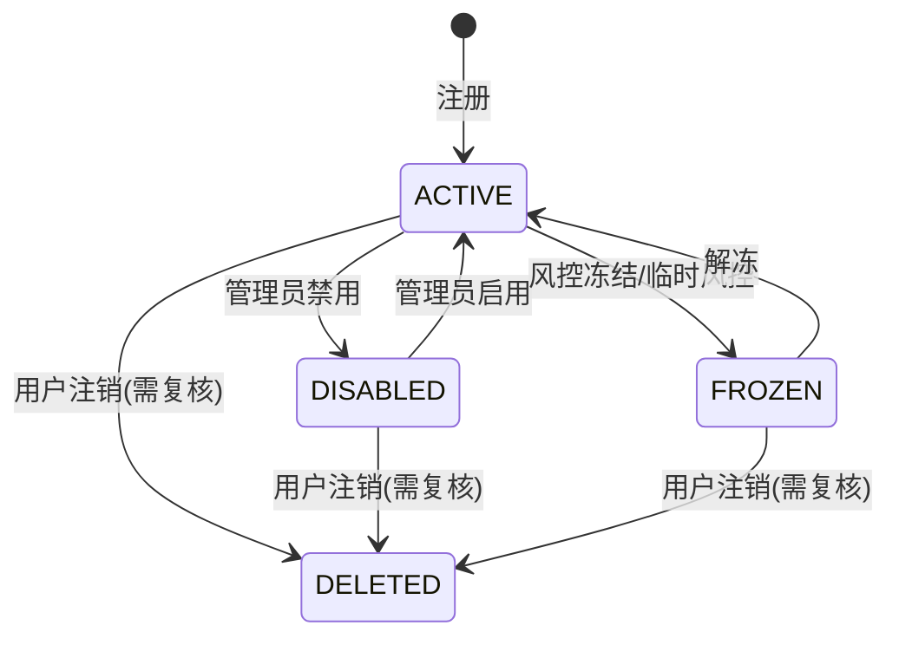

# 管理后台 - 用户查询与账号运维服务 - 详细设计

> 细化日期：2026-07-21
> 原始文档：`docs/design/启硕-PrimeTop-全学段AI辅助学习软件项目设计文档.md` §7.3 管理后台功能清单 - 用户管理 / 用户查询
> 关联文档：`docs2/用户基础服务与身份认证系统-详细设计.md`、`docs2/权限管理与角色访问控制-详细设计.md`、`docs2/服务端审计日志与操作追溯系统-详细设计.md`、`docs2/数据安全与隐私合规体系-详细设计.md`

## 1. 概述

### 1.1 模块定位

管理后台用户查询与账号运维服务（Admin User Management Service）是 PrimeTop 平台运营管理后台的核心支撑服务之一，面向平台管理员、运营人员、客服人员提供对学生账号、家长账号、教师账号及管理员账号的统一查询、状态运维、异常处理与基础操作能力。

该服务不直接负责用户注册、登录、认证流程（由用户基础服务与身份认证系统负责），而是专注于**管理视角**的账号生命周期运维：

- 多维查询与筛选
- 账号状态管理（启用 / 禁用 / 注销复核）
- 密码与登录异常处理
- 实名认证状态查看
- 家长-学生绑定关系维护
- 批量操作与导出
- 运营异常账号干预

### 1.2 核心职责

| 职责 | 说明 |
|------|------|
| 用户查询 | 支持按手机号、昵称、用户类型、学段年级、账号状态、注册时间、最后登录时间等多维度组合查询 |
| 账号状态运维 | 启用、禁用、临时冻结、注销复核、异常解锁 |
| 认证与密码运维 | 协助重置密码、清除登录锁定、强制下线、刷新 Token |
| 实名信息查看 | 查看实名认证状态、未成年人标识、核验记录（不存储敏感证件明文） |
| 关系运维 | 查看家长-学生绑定关系、解绑异常关系、辅助关系修复 |
| 批量操作 | 批量导出、批量禁用/启用、批量发送通知 |
| 操作审计 | 所有管理操作写入审计日志，支持操作人、操作对象、变更前后值追溯 |

### 1.3 依赖关系

```text
管理后台用户查询与账号运维服务
    ├── 依赖：用户基础服务（用户主数据、登录状态、Token）
    ├── 依赖：权限管理与角色访问控制（管理员鉴权、数据权限）
    ├── 依赖：审计日志与操作追溯系统（操作记录）
    ├── 依赖：数据安全与隐私合规体系（敏感数据脱敏）
    ├── 依赖：消息与推送服务（通知用户 / 家长）
    ├── 依赖：学生画像与能力维度模型（学情概览）
    └── 被依赖：管理后台 Web 前端、客服系统、风控系统
```

## 2. 数据模型

### 2.1 核心实体关系

```text
┌─────────────────┐     ┌────────────────────┐     ┌──────────────────┐
│     users       │1:N  │   student_profiles  │     │  parent_bindings │
│   (用户主表)     │────→│   (学生档案)        │     │  (家长绑定关系)   │
└─────────────────┘     └────────────────────┘     └──────────────────┘
         │                                                      │
         │ 1:N                                                  │ N:1
         ▼                                                      ▼
┌─────────────────┐                                     ┌─────────────────┐
│  user_identities│                                     │     users       │
│  (实名认证信息)  │                                     │   (家长账号)     │
└─────────────────┘                                     └─────────────────┘
         │
         │ 1:N
         ▼
┌─────────────────┐     ┌────────────────────┐
│  user_devices   │     │ admin_user_oper_logs│
│  (用户设备)      │     │  (管理操作审计)     │
└─────────────────┘     └────────────────────┘
```

### 2.2 用户主表（复用用户服务）

管理后台用户查询服务读取 `users` 主表，本服务不直接修改用户注册相关字段。

```sql
CREATE TABLE users (
    id                  BIGINT PRIMARY KEY AUTO_INCREMENT COMMENT '用户ID',
    phone               VARCHAR(20) COMMENT '手机号（脱敏展示）',
    phone_encrypted     VARBINARY(255) COMMENT '加密存储手机号',
    phone_hash          VARCHAR(64) COMMENT '手机号哈希，用于精确查询',
    nickname            VARCHAR(50) NOT NULL COMMENT '昵称',
    avatar_url          VARCHAR(512) COMMENT '头像URL',
    user_type           TINYINT NOT NULL DEFAULT 1 COMMENT '1-学生 2-家长 3-教师 4-管理员',
    status              TINYINT NOT NULL DEFAULT 1 COMMENT '0-注销 1-正常 2-禁用 3-冻结',
    registration_source VARCHAR(20) COMMENT '注册来源：phone/wechat/apple',
    created_at          DATETIME NOT NULL DEFAULT CURRENT_TIMESTAMP,
    updated_at          DATETIME NOT NULL DEFAULT CURRENT_TIMESTAMP ON UPDATE CURRENT_TIMESTAMP,
    last_login_at       DATETIME COMMENT '最后登录时间',
    last_login_ip       VARCHAR(64) COMMENT '最后登录IP',
    deleted_at          DATETIME COMMENT '逻辑删除时间',
    
    INDEX idx_users_phone_hash (phone_hash),
    INDEX idx_users_user_type (user_type),
    INDEX idx_users_status (status),
    INDEX idx_users_created_at (created_at),
    INDEX idx_users_last_login_at (last_login_at),
    INDEX idx_users_composite (user_type, status, created_at)
) ENGINE=InnoDB DEFAULT CHARSET=utf8mb4 COMMENT='用户主表';
```

**管理后台查询专用补充表**：

```sql
CREATE TABLE admin_user_query_metadata (
    user_id             BIGINT PRIMARY KEY COMMENT '用户ID',
    identity_status     TINYINT DEFAULT 0 COMMENT '实名状态：0-未实名 1-已实名 2-核验中 3-核验失败',
    is_minor            BOOLEAN DEFAULT NULL COMMENT '是否未成年人（NULL=未知）',
    parent_bound_count  INT DEFAULT 0 COMMENT '绑定的家长数',
    student_bound_count INT DEFAULT 0 COMMENT '绑定的学生数',
    risk_level          TINYINT DEFAULT 0 COMMENT '风控等级：0-正常 1-低风险 2-中风险 3-高风险',
    first_active_at     DATETIME COMMENT '首次活跃时间',
    labels              JSON COMMENT '运营标签，如["高价值","流失风险"]' ,
    updated_at          DATETIME NOT NULL DEFAULT CURRENT_TIMESTAMP ON UPDATE CURRENT_TIMESTAMP,
    
    INDEX idx_metadata_identity (identity_status, is_minor),
    INDEX idx_metadata_risk (risk_level),
    INDEX idx_metadata_labels ( (JSON_EXTRACT(labels, '$')) )
) ENGINE=InnoDB DEFAULT CHARSET=utf8mb4 COMMENT='管理后台用户查询元数据';
```

### 2.3 管理操作审计表

```sql
CREATE TABLE admin_user_oper_logs (
    id                  BIGINT PRIMARY KEY AUTO_INCREMENT,
    admin_user_id       BIGINT NOT NULL COMMENT '操作管理员ID',
    admin_username      VARCHAR(64) COMMENT '操作管理员账号',
    oper_type           VARCHAR(32) NOT NULL COMMENT '操作类型：DISABLE/ENABLE/UNLOCK/RESET_PASSWORD/UNBIND/EXPORT/STATUS_CHANGE',
    target_user_id      BIGINT NOT NULL COMMENT '被操作用户ID',
    target_user_type    TINYINT COMMENT '被操作用户类型',
    request_id          VARCHAR(64) COMMENT '请求ID，用于链路追踪',
    before_value        JSON COMMENT '变更前数据',
    after_value         JSON COMMENT '变更后数据',
    reason              VARCHAR(500) COMMENT '操作原因',
    ip_address          VARCHAR(64) COMMENT '操作IP',
    user_agent          VARCHAR(512) COMMENT '操作浏览器UA',
    created_at          DATETIME NOT NULL DEFAULT CURRENT_TIMESTAMP,
    
    INDEX idx_oper_admin (admin_user_id, created_at),
    INDEX idx_oper_target (target_user_id, oper_type),
    INDEX idx_oper_type_time (oper_type, created_at),
    INDEX idx_oper_request (request_id)
) ENGINE=InnoDB DEFAULT CHARSET=utf8mb4 COMMENT='管理后台用户操作审计日志';
```

### 2.4 账号状态定义

```java
public enum UserStatus {
    ACTIVE(1, "正常"),
    DISABLED(2, "禁用"),
    FROZEN(3, "冻结"),
    DELETED(0, "已注销");
}

public enum IdentityStatus {
    UNVERIFIED(0, "未实名"),
    VERIFIED(1, "已实名"),
    PENDING(2, "核验中"),
    FAILED(3, "核验失败");
}

public enum UserType {
    STUDENT(1, "学生"),
    PARENT(2, "家长"),
    TEACHER(3, "教师"),
    ADMIN(4, "管理员");
}
```

### 2.5 缓存策略

| 缓存Key | 类型 | 说明 | 过期时间 |
|---------|------|------|---------|
| `admin:user:detail:{userId}` | String | 用户详情缓存 | 10分钟 |
| `admin:user:search:{hash}` | String | 查询条件Hash结果页缓存 | 5分钟 |
| `admin:user:export:{taskId}` | String | 批量导出任务状态 | 30分钟 |
| `admin:user:lock:{userId}` | SET | 当前管理员正在编辑的锁定标记 | 5分钟 |
| `admin:user:stat:{dimension}` | String | 用户统计概览 | 1分钟 |

## 3. API 接口设计

### 3.1 接口总览

| 接口 | 方法 | 路径 | 说明 |
|------|------|------|------|
| 用户列表查询 | GET | `/api/admin/v1/users` | 多维分页查询 |
| 用户详情 | GET | `/api/admin/v1/users/{userId}` | 查看用户完整档案 |
| 用户状态变更 | PUT | `/api/admin/v1/users/{userId}/status` | 启用/禁用/冻结 |
| 用户解锁 | POST | `/api/admin/v1/users/{userId}/unlock` | 解除登录锁定 |
| 强制下线 | POST | `/api/admin/v1/users/{userId}/kick-off` | 使所有登录态失效 |
| 重置密码 | POST | `/api/admin/v1/users/{userId}/reset-password` | 发送重置链接/验证码 |
| 实名信息查看 | GET | `/api/admin/v1/users/{userId}/identity` | 查看实名状态 |
| 绑定关系查询 | GET | `/api/admin/v1/users/{userId}/bindings` | 家长/学生绑定关系 |
| 解绑关系 | POST | `/api/admin/v1/users/{userId}/bindings/{bindingId}/unbind` | 运营解绑 |
| 批量导出 | POST | `/api/admin/v1/users/exports` | 创建导出任务 |
| 导出任务状态 | GET | `/api/admin/v1/users/exports/{taskId}` | 查询导出进度 |
| 用户统计概览 | GET | `/api/admin/v1/users/statistics/overview` | 注册/活跃/异常统计 |
| 操作日志 | GET | `/api/admin/v1/users/{userId}/oper-logs` | 用户维度的操作日志 |

### 3.2 用户列表查询

**请求示例**：

```http
GET /api/admin/v1/users?page=1&size=20&userType=1&status=1&keyword=138****1234&stage=primary&grade=3&isMinor=true&registeredAfter=2026-01-01&registeredBefore=2026-07-01&sortField=createdAt&sortOrder=desc
```

**请求参数**：

| 字段 | 类型 | 必填 | 说明 |
|------|------|------|------|
| page | int | 否 | 页码，默认1 |
| size | int | 否 | 页大小，默认20，最大100 |
| keyword | string | 否 | 手机号/昵称/用户ID模糊搜索 |
| userType | int | 否 | 用户类型 |
| status | int | 否 | 账号状态 |
| stage | string | 否 | 学生学段：preschool/primary/junior/senior |
| grade | int | 否 | 年级 |
| isMinor | boolean | 否 | 是否未成年人 |
| identityStatus | int | 否 | 实名状态 |
| riskLevel | int | 否 | 风控等级 |
| registeredAfter | date | 否 | 注册开始日期 |
| registeredBefore | date | 否 | 注册结束日期 |
| lastLoginAfter | date | 否 | 最后登录时间开始 |
| lastLoginBefore | date | 否 | 最后登录时间结束 |
| labels | string[] | 否 | 运营标签筛选 |
| sortField | string | 否 | 排序字段：createdAt/lastLoginAt/riskLevel |
| sortOrder | string | 否 | asc/desc |

**响应示例**：

```json
{
  "code": 0,
  "message": "success",
  "data": {
    "total": 15234,
    "pages": 763,
    "page": 1,
    "size": 20,
    "records": [
      {
        "userId": 10000001,
        "nickname": "小明",
        "phoneMasked": "138****1234",
        "userType": 1,
        "userTypeName": "学生",
        "status": 1,
        "statusName": "正常",
        "stage": "primary",
        "grade": 3,
        "gradeLabel": "三年级",
        "isMinor": true,
        "identityStatus": 1,
        "identityStatusName": "已实名",
        "riskLevel": 0,
        "lastLoginAt": "2026-07-20T18:30:00+08:00",
        "createdAt": "2026-01-15T09:20:00+08:00",
        "registrationSource": "phone",
        "labels": ["活跃用户"],
        "boundParentCount": 1,
        "operations": {
          "canDisable": true,
          "canEnable": false,
          "canUnlock": false,
          "canResetPassword": true
        }
      }
    ]
  }
}
```

### 3.3 用户详情

**请求示例**：

```http
GET /api/admin/v1/users/10000001
```

**响应示例**：

```json
{
  "code": 0,
  "message": "success",
  "data": {
    "userId": 10000001,
    "basicInfo": {
      "nickname": "小明",
      "phoneMasked": "138****1234",
      "avatarUrl": "https://cdn.primetop.cn/avatar/10000001.jpg",
      "userType": 1,
      "status": 1,
      "registrationSource": "phone",
      "createdAt": "2026-01-15T09:20:00+08:00",
      "lastLoginAt": "2026-07-20T18:30:00+08:00",
      "lastLoginIp": "180.***.***.123"
    },
    "studentProfile": {
      "stage": "primary",
      "grade": 3,
      "gradeLabel": "三年级",
      "textbookVersions": [
        {"subjectCode": "MATH", "versionCode": "PEP_RJB_2024"}
      ],
      "learningGoal": "daily",
      "schoolName": "实验小学"
    },
    "identityInfo": {
      "status": 1,
      "statusName": "已实名",
      "verifiedAt": "2026-01-20T10:15:00+08:00",
      "realNameMasked": "张*明",
      "idCardMasked": "110***********1234",
      "isMinor": true
    },
    "bindingInfo": {
      "boundParents": [
        {"userId": 10000002, "nickname": "小明爸爸", "relationship": "父亲", "boundAt": "2026-01-15T10:00:00+08:00"}
      ],
      "boundStudents": []
    },
    "securityInfo": {
      "loginFailedCount": 0,
      "isLocked": false,
      "mfaEnabled": false,
      "activeDeviceCount": 2
    },
    "membershipInfo": {
      "isMember": true,
      "memberType": "annual",
      "expireAt": "2027-01-14T23:59:59+08:00"
    }
  }
}
```

### 3.4 账号状态变更

**请求示例**：

```http
PUT /api/admin/v1/users/10000001/status
Content-Type: application/json

{
  "status": 2,
  "reason": "多次发布违规内容",
  "notifyUser": true,
  "notifyParents": true
}
```

**响应示例**：

```json
{
  "code": 0,
  "message": "success",
  "data": {
    "userId": 10000001,
    "oldStatus": 1,
    "newStatus": 2,
    "operLogId": 89234,
    "affectedTokens": 2,
    "notified": true
  }
}
```

**状态流转**：



### 3.5 强制下线

**请求示例**：

```http
POST /api/admin/v1/users/10000001/kick-off
Content-Type: application/json

{
  "reason": "账号存在异常登录",
  "kickAllDevices": true
}
```

**响应示例**：

```json
{
  "code": 0,
  "message": "success",
  "data": {
    "userId": 10000001,
    "kickedDeviceCount": 3,
    "invalidatedTokenCount": 3
  }
}
```

### 3.6 重置密码

**请求示例**：

```http
POST /api/admin/v1/users/10000001/reset-password
Content-Type: application/json

{
  "method": "sms",
  "reason": "用户通过客服申请重置",
  "needAudit": true
}
```

**响应示例**：

```json
{
  "code": 0,
  "message": "success",
  "data": {
    "userId": 10000001,
    "resetToken": "rt_xxxxxxxx",
    "expireAt": "2026-07-21T07:20:00+08:00",
    "smsSent": true
  }
}
```

### 3.7 批量导出

**请求示例**：

```http
POST /api/admin/v1/users/exports
Content-Type: application/json

{
  "query": {
    "userType": 1,
    "status": 1,
    "registeredAfter": "2026-01-01"
  },
  "columns": ["userId", "nickname", "phone", "userType", "stage", "grade", "status", "createdAt", "lastLoginAt"],
  "fileFormat": "xlsx",
  "maxRows": 10000
}
```

**响应示例**：

```json
{
  "code": 0,
  "message": "success",
  "data": {
    "taskId": "UE202607210650123456",
    "status": "PROCESSING",
    "estimatedSeconds": 30,
    "downloadUrl": null
  }
}
```

## 4. 业务逻辑

### 4.1 查询引擎设计

#### 4.1.1 查询条件解析

管理后台用户查询需要支持复杂组合条件，采用 **查询条件对象（Query DSL） + 动态 SQL 构建** 模式。

```java
@Data
public class AdminUserQueryRequest {
    private Integer page = 1;
    private Integer size = 20;
    private String keyword;
    private Integer userType;
    private Integer status;
    private String stage;
    private Integer grade;
    private Boolean isMinor;
    private Integer identityStatus;
    private Integer riskLevel;
    private LocalDate registeredAfter;
    private LocalDate registeredBefore;
    private LocalDate lastLoginAfter;
    private LocalDate lastLoginBefore;
    private List<String> labels;
    private String sortField = "createdAt";
    private String sortOrder = "desc";
}
```

#### 4.1.2 动态 SQL 构建

```java
@Component
public class AdminUserQueryBuilder {

    public String buildQuerySql(AdminUserQueryRequest req) {
        StringBuilder sql = new StringBuilder(
            "SELECT u.id, u.nickname, u.phone_hash, u.user_type, u.status, " +
            "u.created_at, u.last_login_at, u.registration_source, " +
            "sp.stage, sp.grade, sp.grade_label, " +
            "m.identity_status, m.is_minor, m.risk_level, m.labels " +
            "FROM users u " +
            "LEFT JOIN student_profiles sp ON u.id = sp.user_id " +
            "LEFT JOIN admin_user_query_metadata m ON u.id = m.user_id " +
            "WHERE u.deleted_at IS NULL "
        );
        
        List<Object> params = new ArrayList<>();
        
        if (req.getUserType() != null) {
            sql.append("AND u.user_type = ? ");
            params.add(req.getUserType());
        }
        if (req.getStatus() != null) {
            sql.append("AND u.status = ? ");
            params.add(req.getStatus());
        }
        if (StringUtils.isNotBlank(req.getKeyword())) {
            if (isPhoneKeyword(req.getKeyword())) {
                sql.append("AND u.phone_hash = ? ");
                params.add(PhoneHashUtil.hash(req.getKeyword()));
            } else if (isNumeric(req.getKeyword())) {
                sql.append("AND u.id = ? ");
                params.add(Long.valueOf(req.getKeyword()));
            } else {
                sql.append("AND u.nickname LIKE ? ");
                params.add("%" + req.getKeyword() + "%");
            }
        }
        if (StringUtils.isNotBlank(req.getStage())) {
            sql.append("AND sp.stage = ? ");
            params.add(req.getStage());
        }
        if (req.getGrade() != null) {
            sql.append("AND sp.grade = ? ");
            params.add(req.getGrade());
        }
        if (req.getIsMinor() != null) {
            sql.append("AND m.is_minor = ? ");
            params.add(req.getIsMinor());
        }
        if (req.getIdentityStatus() != null) {
            sql.append("AND m.identity_status = ? ");
            params.add(req.getIdentityStatus());
        }
        if (req.getRiskLevel() != null) {
            sql.append("AND m.risk_level = ? ");
            params.add(req.getRiskLevel());
        }
        if (req.getRegisteredAfter() != null) {
            sql.append("AND u.created_at >= ? ");
            params.add(req.getRegisteredAfter().atStartOfDay());
        }
        if (req.getRegisteredBefore() != null) {
            sql.append("AND u.created_at < ? ");
            params.add(req.getRegisteredBefore().plusDays(1).atStartOfDay());
        }
        
        // 排序与分页
        sql.append("ORDER BY ").append(resolveSortField(req.getSortField()))
           .append(" ").append(resolveSortOrder(req.getSortOrder()))
           .append(" LIMIT ? OFFSET ?");
        params.add(req.getSize());
        params.add((req.getPage() - 1) * req.getSize());
        
        return sql.toString();
    }
}
```

#### 4.1.3 查询优化策略

| 场景 | 优化策略 |
|------|----------|
| 手机号精确查询 | 使用 phone_hash 索引，避免全表扫描 |
| 模糊昵称查询 | 限制长度 ≥ 2 字符，走 nickname 索引前缀 |
| 多维度组合查询 | 使用 admin_user_query_metadata 汇总表，避免多表 JOIN |
| 大数据量导出 | 走流式查询（Cursor），避免内存溢出 |
| 高频统计查询 | 预计算统计指标，缓存1分钟 |

### 4.2 状态机

```java
@Component
public class UserStatusStateMachine {

    private static final Map<UserStatus, Set<UserStatus>> ALLOWED_TRANSITIONS = Map.of(
        UserStatus.ACTIVE, Set.of(UserStatus.DISABLED, UserStatus.FROZEN, UserStatus.DELETED),
        UserStatus.DISABLED, Set.of(UserStatus.ACTIVE, UserStatus.DELETED),
        UserStatus.FROZEN, Set.of(UserStatus.ACTIVE, UserStatus.DISABLED, UserStatus.DELETED),
        UserStatus.DELETED, Set.of() // 已注销不可恢复
    );

    public void validateTransition(UserStatus from, UserStatus to) {
        if (!ALLOWED_TRANSITIONS.getOrDefault(from, Set.of()).contains(to)) {
            throw new BusinessException("STATUS_TRANSITION_NOT_ALLOWED", 
                String.format("不允许从 %s 切换到 %s", from.getName(), to.getName()));
        }
    }
}
```

### 4.3 敏感操作风控

管理员执行敏感操作时需二次验证：

| 操作 | 风控要求 |
|------|----------|
| 禁用账号 | 需输入管理员密码或MFA验证码 |
| 批量禁用 | 单次最多100个，需主管审批 |
| 重置密码 | 必须记录操作原因，用户本人或家长需二次确认 |
| 解绑关系 | 需说明原因，通知相关家长/学生 |
| 导出用户数据 | 需数据安全审批，导出文件加密 |

## 5. 代码示例

### 5.1 核心服务类

```java
@Service
@RequiredArgsConstructor
@Slf4j
public class AdminUserManagementService {

    private final UserRepository userRepository;
    private final AdminUserMetadataRepository metadataRepository;
    private final AdminUserOperLogRepository operLogRepository;
    private final AuthServiceClient authServiceClient;
    private final AuditLogService auditLogService;
    private final MessageServiceClient messageServiceClient;
    private final UserStatusStateMachine stateMachine;
    private final RedisTemplate<String, String> redisTemplate;

    /**
     * 分页查询用户列表
     */
    public PageResult<AdminUserListDTO> queryUsers(AdminUserQueryRequest request) {
        // 1. 构建查询缓存Key
        String cacheKey = buildQueryCacheKey(request);
        String cached = redisTemplate.opsForValue().get(cacheKey);
        if (cached != null) {
            return JsonUtil.fromJson(cached, new TypeReference<PageResult<AdminUserListDTO>>() {});
        }

        // 2. 查询总数
        long total = userRepository.countByQuery(request);
        
        // 3. 查询数据
        List<AdminUserListDTO> records = userRepository.findByQuery(request);
        
        // 4. 补充元数据（是否可执行各操作）
        records.forEach(this::fillOperationPermissions);
        
        PageResult<AdminUserListDTO> result = new PageResult<>(request.getPage(), request.getSize(), total, records);
        
        // 5. 缓存结果（只有第一页缓存）
        if (request.getPage() == 1) {
            redisTemplate.opsForValue().set(cacheKey, JsonUtil.toJson(result), Duration.ofMinutes(5));
        }
        
        return result;
    }

    /**
     * 变更用户状态
     */
    @Transactional
    @AuditLog(module = "USER_MANAGEMENT", action = "STATUS_CHANGE")
    public UserStatusChangeResult changeStatus(Long userId, UserStatusChangeCommand cmd, AdminContext ctx) {
        User user = userRepository.findById(userId)
            .orElseThrow(() -> new BusinessException("USER_NOT_FOUND", "用户不存在"));
        
        // 状态机校验
        stateMachine.validateTransition(user.getStatus(), cmd.getStatus());
        
        // 不能操作超级管理员账号
        if (user.isSuperAdmin()) {
            throw new BusinessException("CANNOT_OPERATE_SUPER_ADMIN", "不能操作超级管理员账号");
        }
        
        UserStatus oldStatus = user.getStatus();
        user.setStatus(cmd.getStatus());
        user.setUpdatedAt(LocalDateTime.now());
        userRepository.save(user);
        
        // 同步通知用户服务使 Token 失效
        int affectedTokens = 0;
        if (cmd.getStatus() == UserStatus.DISABLED || cmd.getStatus() == UserStatus.FROZEN) {
            affectedTokens = authServiceClient.invalidateUserTokens(userId);
        }
        
        // 记录审计日志
        AdminUserOperLog operLog = AdminUserOperLog.builder()
            .adminUserId(ctx.getAdminId())
            .adminUsername(ctx.getUsername())
            .operType("STATUS_CHANGE")
            .targetUserId(userId)
            .targetUserType(user.getUserType().getCode())
            .beforeValue(JsonUtil.toJson(Map.of("status", oldStatus.getCode())))
            .afterValue(JsonUtil.toJson(Map.of("status", cmd.getStatus().getCode())))
            .reason(cmd.getReason())
            .ipAddress(ctx.getIp())
            .userAgent(ctx.getUserAgent())
            .build();
        operLogRepository.save(operLog);
        
        // 通知用户或家长
        boolean notified = false;
        if (Boolean.TRUE.equals(cmd.getNotifyUser())) {
            notified = messageServiceClient.sendAccountStatusNotification(userId, cmd.getStatus(), cmd.getReason());
        }
        
        // 清除缓存
        clearUserCache(userId);
        
        return UserStatusChangeResult.builder()
            .userId(userId)
            .oldStatus(oldStatus.getCode())
            .newStatus(cmd.getStatus().getCode())
            .operLogId(operLog.getId())
            .affectedTokens(affectedTokens)
            .notified(notified)
            .build();
    }

    /**
     * 强制用户下线
     */
    @Transactional
    @AuditLog(module = "USER_MANAGEMENT", action = "KICK_OFF")
    public KickOffResult kickOffUser(Long userId, KickOffCommand cmd, AdminContext ctx) {
        User user = userRepository.findById(userId)
            .orElseThrow(() -> new BusinessException("USER_NOT_FOUND", "用户不存在"));
        
        // 调用认证服务使所有 Token 失效
        int invalidatedTokens = authServiceClient.invalidateUserTokens(userId);
        
        // 调用设备服务强制下线所有设备
        int kickedDevices = authServiceClient.kickOffAllDevices(userId);
        
        AdminUserOperLog operLog = AdminUserOperLog.builder()
            .adminUserId(ctx.getAdminId())
            .operType("KICK_OFF")
            .targetUserId(userId)
            .reason(cmd.getReason())
            .build();
        operLogRepository.save(operLog);
        
        return KickOffResult.builder()
            .userId(userId)
            .kickedDeviceCount(kickedDevices)
            .invalidatedTokenCount(invalidatedTokens)
            .build();
    }

    private void fillOperationPermissions(AdminUserListDTO dto) {
        dto.setCanDisable(dto.getStatus() == UserStatus.ACTIVE.getCode());
        dto.setCanEnable(dto.getStatus() == UserStatus.DISABLED.getCode());
        dto.setCanUnlock(dto.getStatus() == UserStatus.FROZEN.getCode());
        dto.setCanResetPassword(true);
    }

    private void clearUserCache(Long userId) {
        redisTemplate.delete("admin:user:detail:" + userId);
        // 清除列表查询缓存（按前缀匹配）
        Set<String> keys = redisTemplate.keys("admin:user:search:*");
        if (keys != null && !keys.isEmpty()) {
            redisTemplate.delete(keys);
        }
    }
}
```

### 5.2 数据权限拦截器

```java
@Component
public class AdminUserDataPermissionFilter {

    /**
     * 根据管理员角色过滤可见用户类型
     */
    public void validateUserTypeAccess(AdminUser admin, Integer targetUserType) {
        Set<Integer> allowedTypes = admin.getRoleDataScopes().stream()
            .flatMap(scope -> scope.getAllowedUserTypes().stream())
            .collect(Collectors.toSet());
        
        if (!allowedTypes.contains(targetUserType)) {
            throw new BusinessException("DATA_PERMISSION_DENIED", "无权查看该类型用户数据");
        }
    }

    /**
     * 字段级脱敏
     */
    public void maskSensitiveFields(AdminUserListDTO dto, AdminUser admin) {
        // 普通运营人员只能看到掩码手机号
        if (!admin.hasPermission("user:read:phone")) {
            dto.setPhoneMasked(MaskUtil.maskPhone(dto.getPhoneMasked()));
        }
        // 查看完整手机号需要临时授权
        if (!admin.hasPermission("user:read:phone:full")) {
            dto.setPhoneFull(null);
        }
    }
}
```

### 5.3 批量导出任务

```java
@Service
@RequiredArgsConstructor
public class UserExportTaskService {

    private final UserRepository userRepository;
    private final ExcelExporter excelExporter;
    private final ObjectStorageClient ossClient;

    /**
     * 创建异步导出任务
     */
    public ExportTask createExportTask(AdminUserExportRequest request, AdminContext ctx) {
        String taskId = "UE" + DateUtil.format(LocalDateTime.now(), "yyyyMMddHHmm") + RandomUtil.randomNumbers(6);
        
        ExportTask task = ExportTask.builder()
            .taskId(taskId)
            .status(ExportTaskStatus.PROCESSING)
            .adminId(ctx.getAdminId())
            .querySnapshot(JsonUtil.toJson(request))
            .createdAt(LocalDateTime.now())
            .build();
        
        // 异步执行导出
        CompletableFuture.runAsync(() -> executeExport(taskId, request));
        
        return task;
    }

    private void executeExport(String taskId, AdminUserExportRequest request) {
        try {
            // 1. 流式查询数据
            try (Stream<UserExportRow> stream = userRepository.streamExportRows(request.getQuery())) {
                Path tempFile = excelExporter.export(stream, request.getColumns());
                
                // 2. 上传对象存储
                String ossKey = ossClient.upload("exports/users/" + taskId + ".xlsx", tempFile.toFile());
                String downloadUrl = ossClient.generatePresignedUrl(ossKey, Duration.ofHours(24));
                
                // 3. 更新任务状态
                updateTaskSuccess(taskId, downloadUrl, ossKey);
            }
        } catch (Exception e) {
            log.error("用户导出任务失败: taskId={}", taskId, e);
            updateTaskFailed(taskId, e.getMessage());
        }
    }
}
```

## 6. 错误处理

### 6.1 错误码定义

| 错误码 | 含义 | HTTP状态 | 处理建议 |
|--------|------|---------|---------|
| 0 | 成功 | 200 | - |
| 400001 | 参数错误 | 400 | 检查请求参数 |
| 400002 | 无效的状态值 | 400 | 使用合法的状态枚举 |
| 400003 | 无效的用户类型 | 400 | 检查 userType 参数 |
| 400004 | 手机号格式错误 | 400 | 使用合法手机号 |
| 400005 | 批量操作数量超过限制 | 400 | 单次最多100条 |
| 403001 | 无权限查看用户数据 | 403 | 联系管理员授权 |
| 403002 | 不能操作超级管理员 | 403 | 禁止操作平台所有者 |
| 403003 | 状态切换不被允许 | 403 | 参考状态机 |
| 404001 | 用户不存在 | 404 | 检查 userId |
| 404002 | 导出任务不存在 | 404 | 检查 taskId |
| 409001 | 用户当前状态已被修改 | 409 | 刷新后重试 |
| 409002 | 操作冲突，该用户正在被其他管理员编辑 | 409 | 等待或强制解锁 |
| 429001 | 查询频率过高 | 429 | 降低查询频率 |
| 500001 | 认证服务调用失败 | 500 | 稍后重试 |
| 500002 | 导出任务执行失败 | 500 | 查看任务详情 |

### 6.2 异常处理示例

```java
@RestControllerAdvice
public class AdminUserExceptionHandler {

    @ExceptionHandler(BusinessException.class)
    public ResponseEntity<ApiResponse<Void>> handleBusinessException(BusinessException e) {
        return ResponseEntity.status(e.getHttpStatus())
            .body(ApiResponse.error(e.getCode(), e.getMessage()));
    }

    @ExceptionHandler(DataPermissionDeniedException.class)
    public ResponseEntity<ApiResponse<Void>> handleDataPermissionDenied(DataPermissionDeniedException e) {
        // 记录安全审计日志
        securityAuditService.logAccessDenied(e);
        return ResponseEntity.status(403)
            .body(ApiResponse.error("403001", "无权访问该用户数据"));
    }

    @ExceptionHandler(OptimisticLockingFailureException.class)
    public ResponseEntity<ApiResponse<Void>> handleConcurrentEdit(OptimisticLockingFailureException e) {
        return ResponseEntity.status(409)
            .body(ApiResponse.error("409001", "该用户状态已被其他管理员修改，请刷新后重试"));
    }
}
```

### 6.3 降级策略

| 依赖服务异常 | 降级行为 |
|-------------|---------|
| 认证服务不可用 | 仅更新数据库状态，Token失效延迟处理；服务恢复后异步补偿 |
| 消息服务不可用 | 状态变更成功，通知失败记录到待发送队列，稍后重试 |
| 审计日志服务不可用 | 本地写入日志文件，服务恢复后补录；关键操作禁止无审计执行 |
| 元数据表未命中 | 回源查询用户服务与学生画像服务实时组装 |

## 7. 性能优化

### 7.1 索引策略

```sql
-- 高频查询索引
CREATE INDEX idx_users_phone_hash ON users(phone_hash);
CREATE INDEX idx_users_composite ON users(user_type, status, created_at);
CREATE INDEX idx_users_last_login ON users(last_login_at);

-- 元数据查询索引
CREATE INDEX idx_metadata_risk_identity ON admin_user_query_metadata(risk_level, identity_status);
CREATE INDEX idx_metadata_minor ON admin_user_query_metadata(is_minor);

-- 审计日志索引
CREATE INDEX idx_oper_log_target ON admin_user_oper_logs(target_user_id, created_at);
CREATE INDEX idx_oper_log_time ON admin_user_oper_logs(created_at);
```

### 7.2 缓存策略

| 缓存对象 | 策略 | 过期时间 | 刷新时机 |
|----------|------|---------|---------|
| 用户详情 | 按用户ID缓存 | 10分钟 | 状态变更、信息更新时失效 |
| 查询结果页 | 按查询条件Hash缓存 | 5分钟 | 任何用户状态变更时批量清除 |
| 统计概览 | 预计算缓存 | 1分钟 | 定时任务刷新 |
| 导出任务 | 任务状态缓存 | 30分钟 | 任务状态变更时更新 |

### 7.3 分页与限流

- 列表查询最大返回100条/页
- 导出任务最大支持10万条数据
- 敏感接口（禁用、重置密码）按管理员ID限流：10次/分钟
- 查询接口按管理员ID限流：60次/分钟
- 批量操作最大支持100个用户ID

### 7.4 慢查询治理

- 所有查询必须命中索引，禁止使用 `SELECT *`
- 复杂统计走 `admin_user_query_metadata` 汇总表
- 大数据导出使用流式查询，避免一次性加载到内存
- 定期使用 `EXPLAIN` 分析慢查询

## 8. 安全考虑

### 8.1 权限控制

| 权限点 | 编码 | 说明 |
|--------|------|------|
| 用户查询 | `user:read` | 查看用户列表和详情 |
| 查看完整手机号 | `user:read:phone:full` | 解密查看完整手机号（需临时授权） |
| 账号状态管理 | `user:manage:status` | 启用/禁用/冻结账号 |
| 密码重置 | `user:manage:password` | 发起密码重置 |
| 强制下线 | `user:manage:kickoff` | 强制用户下线 |
| 关系解绑 | `user:manage:binding` | 解绑家长学生关系 |
| 数据导出 | `user:export` | 导出用户数据 |
| 查看实名信息 | `user:read:identity` | 查看实名认证信息 |

### 8.2 数据脱敏

| 字段 | 默认展示 | 完整查看条件 |
|------|---------|------------|
| 手机号 | `138****1234` | 拥有 `user:read:phone:full` 权限并记录审计日志 |
| 身份证号 | `110***********1234` | 拥有 `user:read:identity` 权限 |
| 真实姓名 | `张*明` | 拥有 `user:read:identity` 权限 |
| 最后登录IP | `180.***.***.123` | 拥有 `user:read:security` 权限 |
| 设备信息 | 部分脱敏 | 安全审计需要 |

### 8.3 审计要求

- 所有管理操作必须记录：操作人、操作时间、操作IP、UA、变更前后值、操作原因
- 敏感操作（禁用、重置密码、解绑、导出）必须二次确认
- 审计日志保留至少180天，关键操作保留3年
- 禁止管理员删除或修改审计日志

### 8.4 数据导出安全

- 导出文件必须加密存储（AES-256）
- 下载链接有效期24小时，最多下载3次
- 导出操作需主管审批
- 导出文件记录接收人、下载时间、IP
- 导出内容按需脱敏，避免泄露敏感个人信息

## 9. 测试策略

### 9.1 单元测试

```java
@SpringBootTest
class AdminUserManagementServiceTest {

    @Autowired
    private AdminUserManagementService service;

    @Test
    @DisplayName("正常禁用学生账号")
    void shouldDisableStudentSuccessfully() {
        // given
        Long userId = 10000001L;
        UserStatusChangeCommand cmd = new UserStatusChangeCommand();
        cmd.setStatus(UserStatus.DISABLED);
        cmd.setReason("测试禁用");
        cmd.setNotifyUser(false);
        
        AdminContext ctx = AdminContext.builder()
            .adminId(90001L)
            .username("admin_test")
            .build();
        
        // when
        UserStatusChangeResult result = service.changeStatus(userId, cmd, ctx);
        
        // then
        assertEquals(2, result.getNewStatus());
        assertTrue(result.getAffectedTokens() >= 0);
    }

    @Test
    @DisplayName("禁止禁用超级管理员")
    void shouldRejectDisableSuperAdmin() {
        Long userId = 1L; // super admin
        UserStatusChangeCommand cmd = new UserStatusChangeCommand();
        cmd.setStatus(UserStatus.DISABLED);
        
        assertThrows(BusinessException.class, () -> 
            service.changeStatus(userId, cmd, AdminContext.testContext()));
    }

    @Test
    @DisplayName("手机号精确查询应命中哈希索引")
    void shouldFindUserByPhoneHash() {
        AdminUserQueryRequest req = new AdminUserQueryRequest();
        req.setKeyword("13800138000");
        
        PageResult<AdminUserListDTO> result = service.queryUsers(req);
        
        assertFalse(result.getRecords().isEmpty());
    }
}
```

### 9.2 集成测试

| 场景 | 验证点 |
|------|--------|
| 禁用账号后登录 | 用户登录应返回账号禁用错误 |
| 强制下线后Token刷新 | 旧Token应失效，新登录需重新认证 |
| 家长账号被禁用 | 学生端不应再收到该家长的消息 |
| 批量导出 | 导出文件字段正确、脱敏符合预期 |
| 数据权限隔离 | 普通运营人员不能查看管理员账号 |
| 审计日志 | 敏感操作后审计日志完整记录 |

### 9.3 性能测试

| 指标 | 目标 |
|------|------|
| 用户列表查询（10万用户） | p99 < 200ms |
| 用户详情查询 | p99 < 50ms |
| 状态变更操作 | p99 < 100ms |
| 批量导出1万用户 | < 30秒 |
| 并发查询100管理员 | 系统稳定，无慢查询 |

### 9.4 安全测试

- 越权访问测试：低权限管理员尝试访问高权限数据
- SQL注入测试：keyword参数注入特殊字符
- 脱敏测试：确认未授权管理员看不到完整敏感信息
- 审计不可篡改测试：确认审计日志无法被删除

## 10. 部署与运维

### 10.1 服务配置

```yaml
admin-user-management:
  query:
    max-page-size: 100
    default-page-size: 20
    cache-ttl-minutes: 5
  operation:
    max-batch-size: 100
    sensitive-oper-need-reason: true
    disable-user-invalidate-tokens: true
  export:
    max-rows: 100000
    temp-dir: /tmp/admin-user-exports
    file-ttl-hours: 24
  rate-limit:
    query-per-minute: 60
    sensitive-oper-per-minute: 10
```

### 10.2 监控告警

| 指标 | 阈值 | 告警级别 |
|------|------|---------|
| 用户查询P99延迟 | > 500ms | 警告 |
| 敏感操作频率 | 单管理员 > 50次/小时 | 警告 |
| 批量导出失败率 | > 5% | 严重 |
| 数据权限拒绝次数 | 单管理员 > 20次/小时 | 严重 |
| 认证服务调用失败 | > 1% | 严重 |

### 10.3 定时任务

| 任务 | 频率 | 说明 |
|------|------|------|
| 元数据刷新 | 每5分钟 | 刷新 admin_user_query_metadata 表 |
| 导出文件清理 | 每天凌晨 | 清理过期导出文件 |
| 审计日志归档 | 每天 | 将30天前日志归档到冷存储 |
| 缓存预热 | 启动时 | 预热用户统计概览缓存 |

---

## 附录 A：接口变更日志

| 版本 | 日期 | 变更内容 |
|------|------|---------|
| v1.0 | 2026-07-21 | 初始版本，定义用户查询、状态运维、导出、审计等核心能力 |
