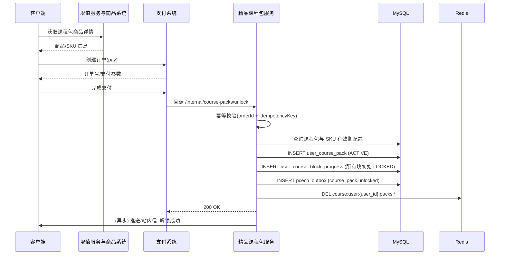
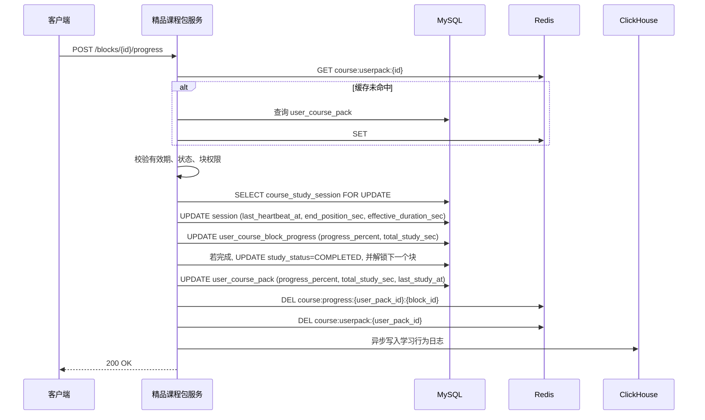
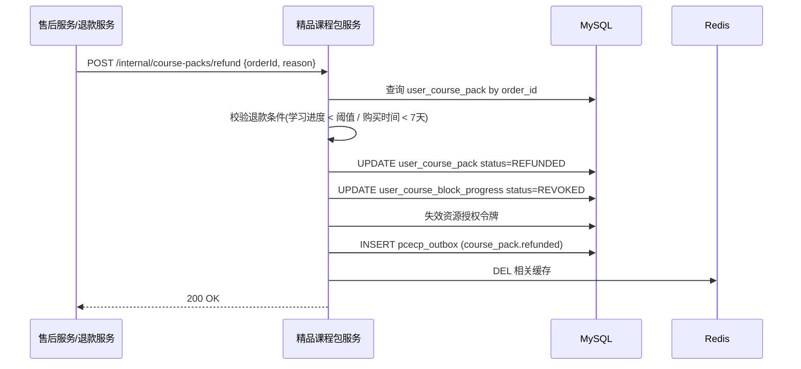

# 精品课程与名师内容包 - 详细设计

> **版本**: v1.0 | **更新时间**: 2026-08-22
> **状态**: 初稿待评审
> **对应总体设计**: `docs/design/启硕-PrimeTop-全学段AI辅助学习软件项目设计文档.md` §11.2 增值服务 / §12.5 运营迭代

---

## 1. 概述

### 1.1 文档范围

本文档详细设计 PrimeTop 的**精品课程与名师内容包（Premium Course & Expert Content Pack, PCECP）**, 是增值服务与商品系统（VAS）下 `CONTENT_PACK` 子类的课程/名师内容商品形态。用户可一次性购买由教研团队或合作名师出品的精品课程、专题讲解、方法串讲、真题解析视频/音频/图文内容包, 解锁后在有效期内反复学习, 并生成学习进度与能力报告。

本模块只负责:

- 精品课程/名师内容包的商品元数据、内容编排与目录结构。
- 用户购买/领取后的解锁、访问授权与有效期管理。
- 课程目录/内容块播放/阅读进度追踪、学习时长归因、完成判定。
- 与支付系统、用户资产、学习规划、学情分析、家长报告的联动。
- 内容包下架/更新/退款时的权益回收与补偿策略。

不负责:

- 通用流媒体转码与 CDN 分发（由 `教育内容多媒体转码处理与自适应码率流媒体分发服务` 负责）。
- 通用支付渠道处理（由 `支付与会员订阅` 系统负责, 本模块调用其订单接口）。
- 通用会员订阅权益（由 `会员订阅服务` 负责）。
- 内容生产与版权审核（由 `教育内容审核工作流与多级审核管线` 负责）。

### 1.2 术语定义

| 术语 | 英文 | 说明 |
|------|------|------|
| 精品课程包 | PremiumCoursePack | 可售卖的精品课程集合, 含课程目录、内容块、配套资料 |
| 内容块 | ContentBlock | 课程包内最小学习单元, 如视频课、音频课、图文讲义、习题集 |
| 课程目录 | CourseCatalog | 树形/线性编排的内容块序列, 支持章节解锁或顺序解锁 |
| 用户课程包 | UserCoursePack | 用户购买/领取后产生的实例, 记录有效期、解锁状态、学习进度 |
| 学习会话 | CourseStudySession | 用户在某内容块上的一次学习会话, 支持断点续看/续听 |
| 名师包 | ExpertContentPack | 由外部名师/机构提供的内容包, 额外包含讲师档案、版权信息 |
| 试看块 | TrialBlock | 允许未购买用户免费预览的内容块, 受时长/页数限制 |

### 1.3 与其他模块的关系

```text
┌─────────────────────────────────────────────────────────────────────┐
│                              客户端                                  │
│  课程商城 / 已购列表 / 课程目录 / 内容块播放页 / 学习进度 / 报告页   │
└──────────────────────────────┬──────────────────────────────────────┘
                               │
                 ┌─────────────▼──────────────┐
                 │   精品课程与名师内容包服务 │  ← 本文档
                 │   (pcecp-service)          │
                 └─────────────┬────────────┘
                               │
        ┌──────────────────────┼──────────────────────┐
        │                      │                      │
┌───────▼───────┐  ┌───────────▼────────┐  ┌────────▼───────┐
│  支付与订单   │  │  增值服务与商品系统  │  │  用户资产/额度  │
│  会员订阅     │  │  (商品元数据/SKU)   │  │  额度管控       │
└───────────────┘  └────────────────────┘  └────────────────┘
        │                      │                      │
┌───────▼───────┐  ┌───────────▼────────┐  ┌────────▼───────┐
│  学习规划     │  │  流媒体/存储/CDN     │  │  学情分析       │
│  每日任务     │  │  (转码/分发/防盗链)  │  │  家长报告       │
└───────────────┘  └────────────────────┘  └────────────────┘
```

### 1.4 优先级与覆盖学段

| 维度 | 说明 |
|------|------|
| 优先级 | P1（V1.5 阶段, 差异化内容变现） |
| 覆盖学段 | 小学高年级至高中, 幼儿/小学低年级以启蒙内容包形式简化呈现 |
| 主要学科 | 语数英、物理、化学、生物、历史、地理、政治 |
| 内容形态 | 视频精讲、音频课程、图文讲义、PDF 资料、配套练习 |

---

## 2. 数据模型

### 2.1 课程包主表 `course_pack`

```sql
CREATE TABLE course_pack (
    id                  BIGINT UNSIGNED AUTO_INCREMENT PRIMARY KEY COMMENT '自增主键',
    pack_code           VARCHAR(64)     NOT NULL COMMENT '课程包唯一编码, 如 COURSE_MATH_G9_FUNC_001',
    name                VARCHAR(128)    NOT NULL COMMENT '课程包名称',
    subtitle            VARCHAR(256)    COMMENT '副标题',
    description         TEXT            COMMENT '详情介绍',
    cover_image         VARCHAR(512)    COMMENT '封面图 URL',
    detail_images       JSON            COMMENT '详情图 URL 列表',

    -- 商品属性
    product_code        VARCHAR(64)     NOT NULL COMMENT '关联 VAS 商品编码 product.product_code',
    sku_code            VARCHAR(64)     COMMENT '关联 SKU 编码',
    category            VARCHAR(32)     NOT NULL DEFAULT 'COURSE_PACK' COMMENT 'COURSE_PACK/EXPERT_PACK/MATERIAL_PACK',
    sub_category        VARCHAR(64)     COMMENT '子分类: 同步提高/专题突破/方法串讲/真题解析/名师专栏',

    -- 学段学科
    grade_levels        JSON            NOT NULL COMMENT '适用年级列表, 如 ["G7","G8","G9"]',
    subjects            JSON            NOT NULL COMMENT '学科列表, 如 ["数学"]',
    textbook_ids        JSON            COMMENT '关联教材版本ID列表',
    exam_types          JSON            COMMENT '适用考试: 期中/期末/中考/高考/会考',

    -- 讲师/版权
    instructor_id       BIGINT UNSIGNED COMMENT '内部讲师ID',
    instructor_name     VARCHAR(64)     COMMENT '讲师显示名',
    instructor_avatar   VARCHAR(512)    COMMENT '讲师头像',
    instructor_title    VARCHAR(128)    COMMENT '讲师头衔',
    partner_id          BIGINT UNSIGNED COMMENT '外部合作机构/名师ID',
    partner_name        VARCHAR(128)    COMMENT '合作方名称',
    copyright_info      JSON            COMMENT '版权信息: {owner, license_expire, royalty_model}',

    -- 内容统计
    total_blocks        INT             NOT NULL DEFAULT 0 COMMENT '内容块总数',
    total_duration_sec  INT             NOT NULL DEFAULT 0 COMMENT '总时长(秒)',
    total_size_bytes    BIGINT          NOT NULL DEFAULT 0 COMMENT '资源总字节数',
    has_exercises       TINYINT         NOT NULL DEFAULT 0 COMMENT '是否含配套练习 0/1',
    has_materials       TINYINT         NOT NULL DEFAULT 0 COMMENT '是否含资料下载 0/1',

    -- 解锁策略
    unlock_strategy     VARCHAR(32)     NOT NULL DEFAULT 'SEQUENTIAL' COMMENT 'SEQUENTIAL顺序解锁/FULL全解锁/CHAPTER_BY_CHAPTER按章解锁',
    trial_enabled       TINYINT         NOT NULL DEFAULT 0 COMMENT '是否支持试看 0/1',

    -- 状态
    status              VARCHAR(32)     NOT NULL DEFAULT 'DRAFT' COMMENT 'DRAFT/REVIEWING/PUBLISHED/DEPRECATED/OFFLINE',
    version             INT             NOT NULL DEFAULT 1 COMMENT '课程包版本号',
    publisher_id        BIGINT UNSIGNED COMMENT '发布人ID',
    published_at        DATETIME        COMMENT '发布时间',

    created_at          DATETIME        NOT NULL DEFAULT CURRENT_TIMESTAMP,
    updated_at          DATETIME        NOT NULL DEFAULT CURRENT_TIMESTAMP ON UPDATE CURRENT_TIMESTAMP,

    UNIQUE KEY uk_pack_code (pack_code),
    KEY idx_product_code (product_code),
    KEY idx_status_published (status, published_at),
    KEY idx_grade_subject ( (CAST(grade_levels AS CHAR(64) ARRAY)), (CAST(subjects AS CHAR(32) ARRAY)) ) COMMENT 'MySQL 8.0.17+ 多值索引',
    FULLTEXT INDEX ft_name_desc (name, subtitle, description)
) ENGINE=InnoDB DEFAULT CHARSET=utf8mb4 COMMENT='精品课程包主表';
```

### 2.2 课程目录/内容块表 `course_pack_block`

```sql
CREATE TABLE course_pack_block (
    id                  BIGINT UNSIGNED AUTO_INCREMENT PRIMARY KEY COMMENT '自增主键',
    pack_id             BIGINT UNSIGNED NOT NULL COMMENT '关联 course_pack.id',
    parent_id           BIGINT UNSIGNED DEFAULT 0 COMMENT '父节点ID, 0 表示章/模块, 非0 表示节/内容块',
    block_code          VARCHAR(64)     NOT NULL COMMENT '内容块唯一编码, 包内唯一',
    title               VARCHAR(128)    NOT NULL COMMENT '标题',
    summary             VARCHAR(512)    COMMENT '摘要',

    -- 内容形态
    block_type          VARCHAR(32)     NOT NULL COMMENT 'VIDEO/AUDIO/ARTICLE/PDF/QUIZ/MATERIAL/LIVE',
    content_id          VARCHAR(64)     COMMENT '关联内容资源ID, 视频/音频/文档统一ID',
    content_url         VARCHAR(512)    COMMENT '资源访问 URL(仅内部服务使用, 不直接暴露)',
    content_duration_sec INT            NOT NULL DEFAULT 0 COMMENT '内容时长(秒)或阅读预估秒数',
    content_size_bytes  BIGINT          NOT NULL DEFAULT 0 COMMENT '资源字节数',

    -- 试看/权限
    is_trial            TINYINT         NOT NULL DEFAULT 0 COMMENT '是否试看块 0/1',
    trial_limit_sec     INT             NOT NULL DEFAULT 0 COMMENT '试看限制秒数, 0 表示完整试看',
    trial_limit_pages   INT             NOT NULL DEFAULT 0 COMMENT 'PDF 试看页数',

    -- 排序与解锁
    sort_order          INT             NOT NULL DEFAULT 0 COMMENT '同层级排序',
    unlock_dependency   JSON            COMMENT '解锁依赖: 前置 block_id 列表, 完成百分比阈值',
    unlock_condition    JSON            COMMENT '解锁条件: {"type":"PREV_COMPLETED" / "TIME_UNLOCK" / "DATE_UNLOCK", "param":{}}',

    -- 学习判定
    completion_rule     VARCHAR(32)     NOT NULL DEFAULT 'DURATION_RATIO' COMMENT 'DURATION_RATIO时长比例/FINISH_EVENT完成事件/QUIZ_PASS测验通过',
    completion_threshold DECIMAL(3,2)   NOT NULL DEFAULT 0.80 COMMENT '完成判定阈值, 如 0.8 表示看够 80%',
    quiz_pack_id        BIGINT UNSIGNED COMMENT '配套测验关联题库包ID',

    status              VARCHAR(32)     NOT NULL DEFAULT 'DRAFT' COMMENT 'DRAFT/PUBLISHED/DEPRECATED',
    created_at          DATETIME        NOT NULL DEFAULT CURRENT_TIMESTAMP,
    updated_at          DATETIME        NOT NULL DEFAULT CURRENT_TIMESTAMP ON UPDATE CURRENT_TIMESTAMP,

    UNIQUE KEY uk_pack_block_code (pack_id, block_code),
    KEY idx_pack_parent (pack_id, parent_id, sort_order),
    KEY idx_pack_status (pack_id, status),
    KEY idx_content_id (content_id)
) ENGINE=InnoDB DEFAULT CHARSET=utf8mb4 COMMENT='课程包内容块与目录表';
```

### 2.3 用户课程包实例表 `user_course_pack`

```sql
CREATE TABLE user_course_pack (
    id                  BIGINT UNSIGNED AUTO_INCREMENT PRIMARY KEY COMMENT '自增主键',
    user_id             BIGINT UNSIGNED NOT NULL COMMENT '学生用户ID',
    pack_id             BIGINT UNSIGNED NOT NULL COMMENT '关联 course_pack.id',
    order_id            VARCHAR(64)     COMMENT '来源订单号',
    source_type         VARCHAR(32)     NOT NULL DEFAULT 'PURCHASE' COMMENT 'PURCHASE购买/GIFT赠送/EVENT活动/REDEEM兑换',

    -- 有效期
    valid_start_at      DATETIME        NOT NULL DEFAULT CURRENT_TIMESTAMP COMMENT '有效期开始',
    valid_end_at        DATETIME        NOT NULL COMMENT '有效期结束',
    permanent_unlock    TINYINT         NOT NULL DEFAULT 0 COMMENT '是否永久解锁 0/1',

    -- 进度汇总
    total_blocks        INT             NOT NULL DEFAULT 0 COMMENT '购买时包内总块数',
    completed_blocks    INT             NOT NULL DEFAULT 0 COMMENT '已完成块数',
    total_study_sec     INT             NOT NULL DEFAULT 0 COMMENT '累计学习秒数',
    last_study_at       DATETIME        COMMENT '最近学习时间',
    last_study_block_id BIGINT UNSIGNED COMMENT '最近学习内容块ID',

    -- 状态
    status              VARCHAR(32)     NOT NULL DEFAULT 'ACTIVE' COMMENT 'ACTIVE/EXPIRED/FINISHED/REFUNDED/REVOKED',
    progress_percent      INT             NOT NULL DEFAULT 0 COMMENT '总进度百分比 0-100',
    first_unlock_at       DATETIME        NOT NULL DEFAULT CURRENT_TIMESTAMP COMMENT '首次解锁时间',

    -- 版本与并发
    version             INT             NOT NULL DEFAULT 1 COMMENT '乐观锁版本号',

    created_at          DATETIME        NOT NULL DEFAULT CURRENT_TIMESTAMP,
    updated_at          DATETIME        NOT NULL DEFAULT CURRENT_TIMESTAMP ON UPDATE CURRENT_TIMESTAMP,

    UNIQUE KEY uk_user_pack (user_id, pack_id, status),
    KEY idx_user_status (user_id, status),
    KEY idx_expires (valid_end_at, status),
    KEY idx_order (order_id)
) ENGINE=InnoDB DEFAULT CHARSET=utf8mb4 COMMENT='用户课程包实例';
```

> **注意**: `uk_user_pack` 使用 `(user_id, pack_id, status)` 而非仅 `(user_id, pack_id)`, 是因为用户可能先购买后退款, 再重新购买; REFUNDED 与 ACTIVE 共存需通过状态区分。业务层保证同一用户同一时间最多只有一个 ACTIVE/EXPIRED/FINISHED 实例, 退款后重新购买生成新记录。

### 2.4 用户内容块进度表 `user_course_block_progress`

```sql
CREATE TABLE user_course_block_progress (
    id                  BIGINT UNSIGNED AUTO_INCREMENT PRIMARY KEY COMMENT '自增主键',
    user_id             BIGINT UNSIGNED NOT NULL COMMENT '学生用户ID',
    pack_id             BIGINT UNSIGNED NOT NULL COMMENT '课程包ID',
    block_id            BIGINT UNSIGNED NOT NULL COMMENT '内容块ID',
    user_pack_id        BIGINT UNSIGNED NOT NULL COMMENT '关联 user_course_pack.id',

    -- 进度
    study_status        VARCHAR(32)     NOT NULL DEFAULT 'LOCKED' COMMENT 'LOCKED/UNLOCKED/IN_PROGRESS/COMPLETED',
    progress_percent    INT             NOT NULL DEFAULT 0 COMMENT '当前进度 0-100',
    current_position_sec INT            NOT NULL DEFAULT 0 COMMENT '视频/音频当前播放位置(秒)',
    current_page        INT             NOT NULL DEFAULT 0 COMMENT 'PDF/文章当前页/阅读位置',
    total_study_sec     INT             NOT NULL DEFAULT 0 COMMENT '累计学习秒数(去重)',
    completed_at        DATETIME        COMMENT '完成时间',
    first_unlock_at     DATETIME        COMMENT '首次解锁时间',

    -- 会话快照
    last_session_id     VARCHAR(64)     COMMENT '最近一次学习会话ID',
    last_study_at       DATETIME        COMMENT '最近一次学习开始时间',

    -- 幂等与并发
    version             INT             NOT NULL DEFAULT 1,

    created_at          DATETIME        NOT NULL DEFAULT CURRENT_TIMESTAMP,
    updated_at          DATETIME        NOT NULL DEFAULT CURRENT_TIMESTAMP ON UPDATE CURRENT_TIMESTAMP,

    UNIQUE KEY uk_user_block (user_id, block_id, user_pack_id),
    KEY idx_user_pack (user_pack_id, study_status),
    KEY idx_study_status (user_id, pack_id, study_status),
    KEY idx_completed (completed_at)
) ENGINE=InnoDB DEFAULT CHARSET=utf8mb4 COMMENT='用户内容块学习进度';
```

### 2.5 学习会话明细表 `course_study_session`

```sql
CREATE TABLE course_study_session (
    id                  BIGINT UNSIGNED AUTO_INCREMENT PRIMARY KEY COMMENT '自增主键',
    session_id          VARCHAR(64)     NOT NULL COMMENT '会话唯一ID',
    user_id             BIGINT UNSIGNED NOT NULL,
    user_pack_id        BIGINT UNSIGNED NOT NULL,
    pack_id             BIGINT UNSIGNED NOT NULL,
    block_id            BIGINT UNSIGNED NOT NULL,

    -- 会话状态
    status              VARCHAR(32)     NOT NULL DEFAULT 'ACTIVE' COMMENT 'ACTIVE/PAUSED/COMPLETED/EXPIRED',
    start_at            DATETIME        NOT NULL DEFAULT CURRENT_TIMESTAMP,
    end_at              DATETIME        COMMENT '结束时间',
    last_heartbeat_at   DATETIME        NOT NULL DEFAULT CURRENT_TIMESTAMP,

    -- 播放/阅读位置
    start_position_sec  INT             NOT NULL DEFAULT 0 COMMENT '开始位置',
    end_position_sec    INT             NOT NULL DEFAULT 0 COMMENT '结束/当前位置',
    effective_duration_sec INT         NOT NULL DEFAULT 0 COMMENT '有效学习秒数(扣除暂停、倍速折算后)',
    playback_speed      DECIMAL(3,2)    NOT NULL DEFAULT 1.00 COMMENT '播放速度',

    -- 客户端标识
    client_request_id   VARCHAR(64)     NOT NULL COMMENT '客户端幂等ID',
    device_id           VARCHAR(64)     COMMENT '设备ID',

    created_at          DATETIME        NOT NULL DEFAULT CURRENT_TIMESTAMP,
    updated_at          DATETIME        NOT NULL DEFAULT CURRENT_TIMESTAMP ON UPDATE CURRENT_TIMESTAMP,

    UNIQUE KEY uk_session_id (session_id),
    UNIQUE KEY uk_client_request (user_id, client_request_id),
    KEY idx_user_pack_block (user_id, user_pack_id, block_id, status),
    KEY idx_heartbeat (last_heartbeat_at, status)
) ENGINE=InnoDB DEFAULT CHARSET=utf8mb4 COMMENT='课程学习会话明细';
```

### 2.6 课程包内容资源授权表 `course_pack_resource_auth`

```sql
CREATE TABLE course_pack_resource_auth (
    id                  BIGINT UNSIGNED AUTO_INCREMENT PRIMARY KEY COMMENT '自增主键',
    user_id             BIGINT UNSIGNED NOT NULL,
    pack_id             BIGINT UNSIGNED NOT NULL,
    block_id            BIGINT UNSIGNED NOT NULL,
    resource_id         VARCHAR(64)     NOT NULL COMMENT '资源统一ID',
    auth_token          VARCHAR(128)    NOT NULL COMMENT '一次性/限时授权令牌',
    expires_at          DATETIME        NOT NULL COMMENT '授权过期时间',
    used_count          INT             NOT NULL DEFAULT 0 COMMENT '已使用次数',
    max_use_count       INT             NOT NULL DEFAULT 1 COMMENT '最大使用次数',
    created_at          DATETIME        NOT NULL DEFAULT CURRENT_TIMESTAMP,

    UNIQUE KEY uk_token (auth_token),
    KEY idx_user_resource (user_id, resource_id, expires_at),
    KEY idx_pack_block (pack_id, block_id)
) ENGINE=InnoDB DEFAULT CHARSET=utf8mb4 COMMENT='课程资源访问授权令牌';
```

### 2.7 课程包更新/版本迁移表 `course_pack_version_log`

```sql
CREATE TABLE course_pack_version_log (
    id                  BIGINT UNSIGNED AUTO_INCREMENT PRIMARY KEY,
    pack_id             BIGINT UNSIGNED NOT NULL,
    old_version         INT             NOT NULL,
    new_version         INT             NOT NULL,
    change_summary      JSON            NOT NULL COMMENT '变更摘要: {added:[], removed:[], modified:[]}',
    user_pack_affected  INT             NOT NULL DEFAULT 0 COMMENT '影响用户实例数',
    migration_status    VARCHAR(32)     NOT NULL DEFAULT 'PENDING' COMMENT 'PENDING/DONE/FAILED',
    executed_at         DATETIME        COMMENT '执行时间',
    created_at          DATETIME        NOT NULL DEFAULT CURRENT_TIMESTAMP,

    KEY idx_pack_version (pack_id, new_version),
    KEY idx_migration (migration_status, created_at)
) ENGINE=InnoDB DEFAULT CHARSET=utf8mb4 COMMENT='课程包版本变更日志';
```

### 2.8 Redis 缓存结构

```text
# 课程包基本信息缓存(热点读取)
course:pack:{pack_id}  →  Hash { 基础字段 + total_blocks + status }
TTL: 10min, 发布/下架时主动删除

# 课程包目录树缓存
course:pack:{pack_id}:catalog  →  JSON String(目录树, 含 block 列表与权限标记)
TTL: 10min, 内容块变更时删除

# 用户课程包实例缓存
course:userpack:{user_pack_id}  →  Hash { status, progress, valid_end_at, version }
TTL: 30min, 进度更新时删除或覆盖

# 用户课程包列表(用于"我的课程")
course:user:{user_id}:packs:{status}  →  ZSET { user_pack_id: last_study_at_ts }
TTL: 30min

# 内容块进度缓存
course:progress:{user_pack_id}:{block_id}  →  Hash { study_status, progress_percent, current_position_sec }
TTL: 30min, 心跳上报时先写 DB 再删缓存

# 学习会话心跳锁(防多端并发)
course:session:{session_id}:heartbeat  →  String { device_id }
TTL: 120s

# 资源授权令牌缓存
course:auth:{auth_token}  →  Hash { user_id, pack_id, block_id, resource_id, expires_at }
TTL: 与 auth_token 过期时间一致
```

### 2.9 Outbox 事件表 `pcecp_outbox`

```sql
CREATE TABLE pcecp_outbox (
    id                  BIGINT UNSIGNED AUTO_INCREMENT PRIMARY KEY,
    event_id            VARCHAR(64)     NOT NULL COMMENT '事件唯一ID',
    event_type          VARCHAR(64)     NOT NULL COMMENT '事件类型',
    aggregate_id        VARCHAR(64)     NOT NULL COMMENT '聚合ID, 如 user_pack_id',
    payload             JSON            NOT NULL COMMENT '事件载荷',
    status              VARCHAR(16)     NOT NULL DEFAULT 'PENDING' COMMENT 'PENDING/SENT/FAILED',
    retry_count         INT             NOT NULL DEFAULT 0,
    next_retry_at       DATETIME        NOT NULL DEFAULT CURRENT_TIMESTAMP,
    created_at          DATETIME        NOT NULL DEFAULT CURRENT_TIMESTAMP,

    UNIQUE KEY uk_event_id (event_id),
    KEY idx_status_retry (status, next_retry_at),
    KEY idx_aggregate (aggregate_id, event_type)
) ENGINE=InnoDB DEFAULT CHARSET=utf8mb4 COMMENT='课程包领域事件 Outbox';
```

---

## 3. API 接口设计

### 3.1 接口清单

| 分组 | 接口 | 方法 | 说明 |
|------|------|------|------|
| 商城 | `/api/v1/course-packs` | GET | 课程包列表(筛选/分页) |
| 商城 | `/api/v1/course-packs/{packCode}` | GET | 课程包详情(含试看块、目录) |
| 学习 | `/api/v1/user-course-packs` | GET | 我的课程包列表 |
| 学习 | `/api/v1/user-course-packs/{userPackId}` | GET | 我的课程包详情与总进度 |
| 学习 | `/api/v1/user-course-packs/{userPackId}/catalog` | GET | 课程目录与学习状态(每块解锁/完成状态) |
| 学习 | `/api/v1/user-course-packs/{userPackId}/blocks/{blockId}` | GET | 内容块详情与播放授权 |
| 学习 | `/api/v1/user-course-packs/{userPackId}/blocks/{blockId}/progress` | POST | 上报心跳/进度 |
| 学习 | `/api/v1/user-course-packs/{userPackId}/blocks/{blockId}/complete` | POST | 标记完成(手动或测验通过) |
| 内部 | `/api/internal/course-packs/unlock` | POST | 支付/订单完成后解锁(幂等) |
| 内部 | `/api/internal/course-packs/refund` | POST | 退款时回收权益 |
| 内部 | `/api/internal/course-packs/expire-check` | POST | 手动触发过期检查 |
| 管理 | `/api/admin/course-packs` | POST | 创建课程包 |
| 管理 | `/api/admin/course-packs/{packId}` | PUT | 更新课程包 |
| 管理 | `/api/admin/course-packs/{packId}/blocks` | POST | 批量创建/更新内容块 |
| 管理 | `/api/admin/course-packs/{packId}/publish` | POST | 发布课程包 |
| 管理 | `/api/admin/course-packs/{packId}/offline` | POST | 下架课程包 |
| 管理 | `/api/admin/course-packs/{packId}/version-migrate` | POST | 版本迁移(双人审批) |

### 3.2 课程包列表查询

**请求**

```http
GET /api/v1/course-packs?subject=数学&grade=G9&category=EXPERT_PACK&keyword=函数&page=1&size=20
```

**响应**

```json
{
  "code": 0,
  "message": "ok",
  "data": {
    "list": [
      {
        "packCode": "COURSE_MATH_G9_FUNC_001",
        "name": "九年级函数专题突破",
        "subtitle": "名师精讲 12 讲, 覆盖一次函数/反比例函数/二次函数",
        "coverImage": "https://cdn.example.com/course/cover_001.jpg",
        "category": "EXPERT_PACK",
        "subCategory": "专题突破",
        "instructorName": "张老师",
        "instructorTitle": "省级骨干教师",
        "totalDurationSec": 7200,
        "totalBlocks": 12,
        "hasExercises": 1,
        "price": {
          "originalPrice": 19900,
          "currentPrice": 9900,
          "currency": "CNY"
        },
        "trialEnabled": 1,
        "tags": ["热销", "中考必备"]
      }
    ],
    "total": 86,
    "page": 1,
    "size": 20
  }
}
```

### 3.3 课程包详情(含试看)

**请求**

```http
GET /api/v1/course-packs/COURSE_MATH_G9_FUNC_001
```

**响应**

```json
{
  "code": 0,
  "message": "ok",
  "data": {
    "packCode": "COURSE_MATH_G9_FUNC_001",
    "name": "九年级函数专题突破",
    "description": "...",
    "instructor": {
      "name": "张老师",
      "title": "省级骨干教师",
      "avatar": "..."
    },
    "catalog": [
      {
        "blockId": 1001,
        "blockCode": "CHAPTER_01",
        "title": "第一章 函数基础概念",
        "blockType": "CHAPTER",
        "children": [
          {
            "blockId": 1002,
            "blockCode": "VIDEO_01_01",
            "title": "1.1 变量与函数",
            "blockType": "VIDEO",
            "durationSec": 600,
            "isTrial": true,
            "trialLimitSec": 120,
            "isLocked": false
          },
          {
            "blockId": 1003,
            "blockCode": "PDF_01_02",
            "title": "1.2 讲义下载",
            "blockType": "PDF",
            "isTrial": false,
            "isLocked": true
          }
        ]
      }
    ],
    "price": {
      "originalPrice": 19900,
      "currentPrice": 9900
    },
    "purchaseButton": {
      "text": "立即购买",
      "action": "BUY"
    }
  }
}
```

> 未购买用户返回 `isLocked=true/false` 基于试看策略; 已购买用户调用 `/user-course-packs/{id}/catalog` 返回真实状态。

### 3.4 内容块播放授权

**请求**

```http
GET /api/v1/user-course-packs/20001/blocks/1002
Headers: X-Idempotency-Key: req_20260822_001
```

**响应(已购买)**

```json
{
  "code": 0,
  "message": "ok",
  "data": {
    "blockId": 1002,
    "title": "1.1 变量与函数",
    "blockType": "VIDEO",
    "durationSec": 600,
    "studyStatus": "UNLOCKED",
    "progressPercent": 35,
    "currentPositionSec": 210,
    "resource": {
      "resourceId": "res_video_1002",
      "authToken": "auth_abc123xyz",
      "expiresAt": "2026-08-22T20:00:00Z",
      "playbackUrl": "https://stream.example.com/res_video_1002?token=auth_abc123xyz",
      "cdnDomain": "cdn.example.com"
    },
    "restrictions": {
      "maxPlaybackSpeed": 2.0,
      "allowDownload": true,
      "drmType": "NONE"
    }
  }
}
```

**响应(试看, 未购买)**

```json
{
  "code": 0,
  "message": "ok",
  "data": {
    "blockId": 1002,
    "title": "1.1 变量与函数",
    "blockType": "VIDEO",
    "durationSec": 600,
    "studyStatus": "TRIAL",
    "trialLimitSec": 120,
    "resource": {
      "resourceId": "res_video_1002",
      "authToken": "auth_trial_abc123",
      "expiresAt": "2026-08-22T20:00:00Z",
      "playbackUrl": "https://stream.example.com/res_video_1002?token=auth_trial_abc123",
      "trialClipEndSec": 120
    }
  }
}
```

### 3.5 学习心跳/进度上报

**请求**

```http
POST /api/v1/user-course-packs/20001/blocks/1002/progress
Content-Type: application/json

{
  "clientRequestId": "req_20260822_001",
  "sessionId": "sess_xyz789",
  "positionSec": 300,
  "playbackSpeed": 1.25,
  "isPaused": false,
  "effectiveDurationSec": 45,
  "deviceId": "dev_abc123"
}
```

**响应**

```json
{
  "code": 0,
  "message": "ok",
  "data": {
    "sessionId": "sess_xyz789",
    "progressPercent": 50,
    "completed": false,
    "nextBlockId": 1003,
    "nextBlockTitle": "1.2 讲义下载",
    "studyStatus": "IN_PROGRESS"
  }
}
```

### 3.6 内部解锁接口(支付回调后调用)

**请求**

```http
POST /api/internal/course-packs/unlock
Content-Type: application/json

{
  "orderId": "ORD_202608220001",
  "userId": 10001,
  "productCode": "COURSE_MATH_G9_FUNC_001",
  "skuCode": "COURSE_MATH_G9_FUNC_001_STD",
  "idempotencyKey": "unlock_ORD_202608220001"
}
```

**响应**

```json
{
  "code": 0,
  "message": "ok",
  "data": {
    "userPackId": 20001,
    "packId": 101,
    "validStartAt": "2026-08-22T12:00:00Z",
    "validEndAt": "2027-08-22T12:00:00Z",
    "permanentUnlock": 0,
    "status": "ACTIVE"
  }
}
```

### 3.7 gRPC 接口(内部服务)

```protobuf
syntax = "proto3";
package pcecp.v1;

service PcecpService {
  // 校验用户是否有权限访问某内容块
  rpc CheckAccess (CheckAccessRequest) returns (CheckAccessResponse);

  // 批量获取用户课程包进度(供学情分析/家长报告)
  rpc BatchGetUserPackProgress (BatchGetUserPackProgressRequest) returns (BatchGetUserPackProgressResponse);

  // 触发内容块解锁(由学习规划/每日任务调用)
  rpc UnlockBlocks (UnlockBlocksRequest) returns (UnlockBlocksResponse);

  // 退款回收
  rpc RevokePack (RevokePackRequest) returns (RevokePackResponse);
}

message CheckAccessRequest {
  int64 user_id = 1;
  int64 block_id = 2;
  string action = 3; // PLAY/DOWNLOAD/SHARE
}

message CheckAccessResponse {
  bool granted = 1;
  string reason = 2;
  int64 user_pack_id = 3;
  bool trial = 4;
}

message BatchGetUserPackProgressRequest {
  repeated int64 user_pack_ids = 1;
}

message BatchGetUserPackProgressResponse {
  message Progress {
    int64 user_pack_id = 1;
    int32 progress_percent = 2;
    int32 completed_blocks = 3;
    int32 total_blocks = 4;
    string status = 5;
  }
  repeated Progress items = 1;
}
```

---

## 4. 核心流程

### 4.1 课程包购买解锁流程



### 4.2 内容块解锁策略

课程包购买后, 内容块根据 `unlock_strategy` 字段进行解锁:

| 策略 | 说明 | 触发时机 |
|------|------|----------|
| FULL | 购买后所有块立即解锁 | user_course_pack 创建时批量初始化 `UNLOCKED` |
| SEQUENTIAL | 只有第一个块解锁, 完成一个解锁下一个 | 心跳上报 `COMPLETED` 时 CAS 解锁下一个 |
| CHAPTER_BY_CHAPTER | 每章第一个块解锁, 章内顺序解锁 | 同 SEQUENTIAL, 但按章分组 |

**顺序解锁判定算法**

```python
def unlock_next_block(user_pack_id: int, completed_block_id: int) -> Optional[int]:
    # 1. 查询同层级下一个 block
    next_block = catalog_repo.find_next_sibling(pack_id, completed_block_id)
    if next_block:
        # 2. CAS 更新为 UNLOCKED
        ok = progress_repo.cas_unlock(user_id, user_pack_id, next_block.id, version=0)
        if ok:
            return next_block.id
    # 3. 否则向上查找下一章的第一个块
    next_chapter_first = catalog_repo.find_next_chapter_first(pack_id, completed_block_id)
    if next_chapter_first:
        progress_repo.cas_unlock(user_id, user_pack_id, next_chapter_first.id, version=0)
        return next_chapter_first.id
    return None
```

### 4.3 学习心跳与进度更新流程



### 4.4 完成判定规则

| block_type | 完成条件 | 说明 |
|------------|----------|------|
| VIDEO/AUDIO | `end_position_sec / duration_sec >= completion_threshold` | 默认 0.80, 倍速播放按实际时长折算 |
| ARTICLE/PDF | `current_page / total_pages >= completion_threshold` | 或客户端发送 finish 事件 |
| QUIZ | `quiz_score >= pass_score` | 由判题引擎回调 |
| MATERIAL | 点击下载即算完成, 或 finish 事件 | 资料型内容块 |

**有效时长计算规则**

```python
effective_duration_sec = raw_watch_sec * (1.0 / playback_speed)
# 倍速播放: 1.5x 看 90 秒实际内容, 有效时长 = 90 / 1.5 = 60 秒
# 目的: 防止用户开 0.5x 刷时长
```

### 4.5 退款与权益回收流程



**退款红线**

- 已学习进度超过 30% 的内容包, 默认不支持自动退款, 转人工审核。
- 名师/版权内容包退款需同步通知合作方, 按合同结算。

### 4.6 课程包版本更新与迁移

当课程内容需要更新时, 采用**版本号 + 灰度迁移**策略, 而非直接修改已发布内容:

1. 创建新版本 `course_pack.version += 1`, 复制所有 block 并修改。
2. 新版本状态为 `REVIEWING`, 审核通过后 `PUBLISHED`。
3. 管理端触发版本迁移, 将已购买用户的实例指向新版本:
   - 新增 block: 自动解锁(按策略)。
   - 删除 block: 已学习进度保留, 不计入总数; 未学习块直接移除。
   - 修改 block: 视为新增版本, 保留旧进度, 允许用户重新学习。
4. 异步任务分片执行迁移, 每批 500 条, 写入 `course_pack_version_log`。

---

## 5. 状态机

### 5.1 课程包状态机

```text
DRAFT --(审核通过)--> REVIEWING --(发布)--> PUBLISHED --(下架)--> OFFLINE
                        |                          |
                        |                          +--(彻底废弃)--> DEPRECATED
                        +--(驳回)--> DRAFT
```

| 状态 | 说明 | 可购买 | 可学习 |
|------|------|--------|--------|
| DRAFT | 草稿 | 否 | 否 |
| REVIEWING | 审核中 | 否 | 否 |
| PUBLISHED | 已发布 | 是 | 是 |
| OFFLINE | 已下架(已有用户可继续学习) | 否 | 是(已有实例) |
| DEPRECATED | 已废弃(不再维护) | 否 | 否(建议迁移) |

### 5.2 用户课程包状态机

```text
ACTIVE --(到期)--> EXPIRED
ACTIVE --(全部完成)--> FINISHED
ACTIVE --(退款)--> REFUNDED
ACTIVE/EXPIRED/FINISHED --(续购/重新购买)--> 新的 ACTIVE 实例
```

> 同一用户允许存在多个历史状态实例, 但业务层保证同一 pack_id 下最多一个非 REFUNDED/REVOKED 的 ACTIVE/EXPIRED/FINISHED 实例。

### 5.3 内容块学习状态机

```text
LOCKED --(解锁)--> UNLOCKED --(开始学习)--> IN_PROGRESS --(完成判定)--> COMPLETED
```

| 状态 | 说明 |
|------|------|
| LOCKED | 未解锁, 无法学习 |
| UNLOCKED | 已解锁, 未开始 |
| IN_PROGRESS | 学习中 |
| COMPLETED | 已完成 |

### 5.4 学习会话状态机

```text
ACTIVE --(暂停)--> PAUSED --(恢复)--> ACTIVE
ACTIVE --(结束/心跳超时)--> COMPLETED
ACTIVE --(长时间无心跳, 120s)--> EXPIRED
```

---

## 6. 关键代码示例

### 6.1 幂等解锁服务

```java
@Service
public class CoursePackUnlockService {

    @Transactional
    public UserCoursePack unlock(UnlockRequest request) {
        // 1. 幂等锁: 订单维度
        String idemKey = "pcecp:unlock:" + request.getOrderId();
        Boolean locked = redisTemplate.opsForValue().setIfAbsent(idemKey, "1", Duration.ofMinutes(10));
        if (!Boolean.TRUE.equals(locked)) {
            // 已处理, 直接返回已有实例
            return userCoursePackRepo.findByOrderId(request.getOrderId())
                    .orElseThrow(() -> new PcecpException(PcecpErrorCode.UNLOCK_IN_PROGRESS));
        }

        try {
            // 2. 查询课程包
            CoursePack pack = coursePackRepo.findByPackCode(request.getProductCode())
                    .orElseThrow(() -> new PcecpException(PcecpErrorCode.PACK_NOT_FOUND));

            // 3. 检查是否已存在 ACTIVE 实例
            userCoursePackRepo.findActiveByUserAndPack(request.getUserId(), pack.getId())
                    .ifPresent(existing -> {
                        throw new PcecpException(PcecpErrorCode.ALREADY_UNLOCKED);
                    });

            // 4. 计算有效期
            LocalDateTime now = LocalDateTime.now();
            LocalDateTime endAt = calculateValidEndAt(request.getSkuCode(), now);

            // 5. 创建用户实例
            UserCoursePack userPack = UserCoursePack.builder()
                    .userId(request.getUserId())
                    .packId(pack.getId())
                    .orderId(request.getOrderId())
                    .sourceType("PURCHASE")
                    .validStartAt(now)
                    .validEndAt(endAt)
                    .totalBlocks(pack.getTotalBlocks())
                    .status("ACTIVE")
                    .build();
            userCoursePackRepo.save(userPack);

            // 6. 初始化内容块进度
            List<CoursePackBlock> blocks = blockRepo.findByPackIdOrderBySort(pack.getId());
            List<UserBlockProgress> progressList = blocks.stream()
                    .map(b -> initProgress(userPack.getId(), b, pack.getUnlockStrategy()))
                    .collect(Collectors.toList());
            userBlockProgressRepo.batchInsert(progressList);

            // 7. 发布领域事件
            outboxRepo.save(PcecpOutboxEvent.builder()
                    .eventId("evt_pcecp_unlocked_" + request.getOrderId())
                    .eventType("course_pack.unlocked")
                    .aggregateId(String.valueOf(userPack.getId()))
                    .payload(Map.of("userId", request.getUserId(), "packId", pack.getId(), "orderId", request.getOrderId()))
                    .build());

            return userPack;
        } catch (Exception e) {
            redisTemplate.delete(idemKey);
            throw e;
        }
    }

    private UserBlockProgress initProgress(Long userPackId, CoursePackBlock block, String strategy) {
        String status = "LOCKED";
        if ("FULL".equals(strategy) || block.getSortOrder() == 0) {
            status = "UNLOCKED";
        }
        return UserBlockProgress.builder()
                .userPackId(userPackId)
                .blockId(block.getId())
                .packId(block.getPackId())
                .studyStatus(status)
                .build();
    }
}
```

### 6.2 心跳进度更新(带 CAS)

```java
@Service
public class CourseStudySessionService {

    @Transactional
    public ProgressReport heartbeat(HeartbeatRequest req) {
        // 1. 校验用户课程包
        UserCoursePack userPack = userCoursePackRepo.findByIdForUpdate(req.getUserPackId())
                .orElseThrow(() -> new PcecpException(PcecpErrorCode.USER_PACK_NOT_FOUND));
        validateActive(userPack);

        // 2. 获取或创建会话
        CourseStudySession session = sessionRepo.findActiveSession(req.getUserPackId(), req.getBlockId())
                .orElseGet(() -> createSession(req, userPack));

        // 3. 更新会话位置与有效时长
        session.setLastHeartbeatAt(LocalDateTime.now());
        session.setEndPositionSec(req.getPositionSec());
        session.setPlaybackSpeed(req.getPlaybackSpeed());
        session.setEffectiveDurationSec(
                session.getEffectiveDurationSec() +
                (int)(req.getEffectiveDurationSec() / req.getPlaybackSpeed())
        );
        sessionRepo.save(session);

        // 4. 更新内容块进度
        UserBlockProgress progress = userBlockProgressRepo.findByUserPackAndBlockForUpdate(req.getUserPackId(), req.getBlockId())
                .orElseThrow(() -> new PcecpException(PcecpErrorCode.BLOCK_NOT_FOUND));
        updateBlockProgress(progress, session, req);

        // 5. 判定完成
        boolean completed = checkCompletion(progress);
        if (completed && !"COMPLETED".equals(progress.getStudyStatus())) {
            progress.setStudyStatus("COMPLETED");
            progress.setCompletedAt(LocalDateTime.now());
            unlockNextBlock(userPack, progress);
        }
        userBlockProgressRepo.save(progress);

        // 6. 更新用户课程包总进度
        refreshUserPackProgress(userPack);

        return ProgressReport.builder()
                .sessionId(session.getSessionId())
                .progressPercent(progress.getProgressPercent())
                .completed("COMPLETED".equals(progress.getStudyStatus()))
                .build();
    }

    private void updateBlockProgress(UserBlockProgress progress, CourseStudySession session, HeartbeatRequest req) {
        int duration = blockRepo.findDurationById(progress.getBlockId());
        int percent = duration > 0 ? Math.min(100, req.getPositionSec() * 100 / duration) : 0;
        progress.setProgressPercent(percent);
        progress.setCurrentPositionSec(req.getPositionSec());
        progress.setTotalStudySec(session.getEffectiveDurationSec());
        progress.setLastStudyAt(LocalDateTime.now());
        if (!"COMPLETED".equals(progress.getStudyStatus())) {
            progress.setStudyStatus("IN_PROGRESS");
        }
    }

    private boolean checkCompletion(UserBlockProgress progress) {
        CoursePackBlock block = blockRepo.findById(progress.getBlockId()).orElseThrow();
        BigDecimal threshold = block.getCompletionThreshold();
        return new BigDecimal(progress.getProgressPercent())
                .compareTo(threshold.multiply(new BigDecimal(100))) >= 0;
    }
}
```

### 6.3 资源授权令牌生成(Lua 原子脚本)

```lua
-- generate_auth_token.lua
-- KEYS[1] = course:auth_count:{user_id}:{block_id} (防止刷令牌)
-- ARGV[1] = token
-- ARGV[2] = expires_at timestamp
-- ARGV[3] = max_use_count
-- ARGV[4] = metadata json

local count_key = KEYS[1]
local token = ARGV[1]
local token_key = "course:auth:" .. token

local current = redis.call('INCR', count_key)
if current > 5 then
    redis.call('DECR', count_key)
    return {-1, "token_generation_rate_limited"}
end

redis.call('HSET', token_key,
    "user_id", ARGV[5],
    "pack_id", ARGV[6],
    "block_id", ARGV[7],
    "resource_id", ARGV[8],
    "expires_at", ARGV[2],
    "max_use_count", ARGV[3],
    "used_count", 0
)
redis.call('EXPIRE', token_key, ARGV[9])
redis.call('EXPIRE', count_key, 60)

return {1, "ok"}
```

### 6.4 过期检查定时任务

```java
@Component
public class CoursePackExpireJob {

    @Scheduled(cron = "0 30 2 * * ?")
    public void expireCheck() {
        LocalDateTime now = LocalDateTime.now();
        int shardCount = 8;
        int shardIndex = getShardIndex(now);

        List<UserCoursePack> list = userCoursePackRepo.findActiveBefore(now, shardCount, shardIndex);
        for (UserCoursePack up : list) {
            try {
                if (up.getValidEndAt().isBefore(now)) {
                    up.setStatus("EXPIRED");
                    userCoursePackRepo.save(up);
                    outboxRepo.save(PcecpOutboxEvent.builder()
                            .eventType("course_pack.expired")
                            .aggregateId(String.valueOf(up.getId()))
                            .payload(Map.of("userId", up.getUserId(), "packId", up.getPackId()))
                            .build());
                }
            } catch (Exception e) {
                log.error("expire check failed userPackId={}", up.getId(), e);
            }
        }
    }
}
```

---

## 7. 幂等、并发与竞态处理

### 7.1 幂等场景总表

| 场景 | 幂等键 | 存储位置 | 有效期 |
|------|--------|----------|--------|
| 购买解锁 | `orderId` + `idempotencyKey` | Redis SET + DB 唯一索引 | 10min |
| 心跳上报 | `clientRequestId` | DB `uk_client_request` | 永久 |
| 资源授权 | `auth_token` | Redis Hash + DB `uk_token` | 与 token 等长 |
| 完成标记 | `user_pack_id + block_id` | DB `uk_user_block` | 永久 |
| 退款回收 | `orderId` | DB 状态机 + Redis SET | 10min |

### 7.2 并发控制规则

1. **同一会话多端并发**: 同一 `user_pack_id + block_id` 只允许一个 `ACTIVE` 会话, 新会话创建时强制结束旧会话并汇总进度。
2. **进度更新 CAS**: `user_course_block_progress.version` 乐观锁, 冲突时按时间戳/位置取较大值, 有效时长累加。
3. **顺序解锁竞态**: 使用数据库函数唯一索引 `(user_pack_id, block_id, study_status='UNLOCKED')` 或 CAS 更新, 确保同一 block 只解锁一次。
4. **资源令牌防盗刷**: 每用户每 block 每分钟最多生成 5 个令牌, 令牌最大使用次数 3 次。

### 7.3 常见竞态裁决

| 竞态场景 | 裁决规则 |
|----------|----------|
| 支付回调重试同时到达 | Redis SETNX 抢锁, 失败者查询已生成实例返回 |
| 心跳与完成标记同时到达 | DB 行锁串行化, 心跳先更新位置, 完成标记再改状态 |
| 退款与学习中同时发生 | 退款只改状态, 不阻止正在进行的播放(但新播放授权失败) |
| 课程包更新与学习中 | 旧实例继续按旧版本学习, 新购买用户获得新版本 |

---

## 8. 错误处理

### 8.1 错误码段: 59200-59299

| 错误码 | 含义 | HTTP 状态 | 客户端处理 |
|--------|------|-----------|------------|
| 59200 | 成功(部分场景如已解锁返回) | 200 | 正常展示 |
| 59201 | 课程包不存在 | 404 | 展示空态/返回商城 |
| 59202 | 课程包未发布 | 403 | 提示未上架 |
| 59203 | 用户课程包不存在 | 404 | 引导购买 |
| 59204 | 用户课程包已过期 | 403 | 提示续费/重新购买 |
| 59205 | 用户课程包已退款 | 403 | 引导重新购买 |
| 59206 | 内容块未解锁 | 403 | 提示先完成前置内容 |
| 59207 | 试看已用完 | 403 | 引导购买 |
| 59208 | 资源授权令牌无效或过期 | 403 | 重新请求授权 |
| 59209 | 学习会话不存在或已过期 | 404 | 创建新会话 |
| 59210 | 心跳超出有效范围(position > duration) | 400 | 校正播放位置 |
| 59211 | 已达到最大学习设备数 | 403 | 提示设备管理 |
| 59212 | 内容块类型不支持 | 400 | 报错 |
| 59213 | 退款条件不满足(学习进度超限) | 403 | 转人工客服 |
| 59214 | 订单重复解锁 | 200 | 返回已有实例 |
| 59215 | 生成授权令牌过于频繁 | 429 | 稍后重试 |
| 59216 | 课程包版本迁移中, 暂不支持播放 | 503 | 稍后重试 |
| 59217 | 退款后资源访问拒绝 | 403 | 引导重新购买 |
| 59250-59299 | 管理端错误码 | 400/403/404 | - |

### 8.2 管理端错误码

| 错误码 | 含义 |
|--------|------|
| 59250 | 课程包编码已存在 |
| 59251 | 内容块编码在包内重复 |
| 59252 | 课程包有未完成的用户实例, 不可删除 |
| 59253 | 版本迁移失败, 存在冲突 |
| 59254 | 下架操作需要双人审批 |
| 59255 | 版权信息不完整 |

### 8.3 降级映射

当本服务不可用时:

| 原接口 | 降级行为 | 触发条件 |
|--------|----------|----------|
| 课程包列表 | 返回缓存, 无缓存返回空列表 | Redis/MySQL 故障 |
| 播放授权 | 返回 CDN 直链(限免/试看), 付费内容拒绝 | 授权服务故障 |
| 心跳上报 | 客户端本地缓存, 服务恢复后批量补报 | 网络中断 |
| 学习进度查询 | 返回最近一次缓存, 不更新 | DB 故障 |

---

## 9. 事件与消息

### 9.1 发布事件

| 事件 | 说明 | 消费方 |
|------|------|--------|
| `course_pack.unlocked` | 用户购买解锁 | 学习规划、消息通知、用户资产 |
| `course_pack.progress_updated` | 进度更新 | 学情分析、家长报告、每日任务 |
| `course_pack.completed` | 课程包全部完成 | 成就系统、学习规划、推荐引擎 |
| `course_pack.expired` | 用户课程包到期 | 消息通知、学习规划 |
| `course_pack.refunded` | 退款回收 | 用户资产、结算对账 |
| `course_pack.deprecated` | 课程包废弃 | 搜索索引、推荐引擎 |
| `course_pack.version_migrated` | 版本迁移完成 | 客户端同步、学习规划 |

### 9.2 订阅事件

| 事件 | 来源 | 用途 |
|------|------|------|
| `payment.order.paid` | 支付系统 | 触发解锁 |
| `payment.order.refunded` | 售后服务 | 触发权益回收 |
| `user.grade_upgraded` | 用户服务 | 年级不匹配时提示 |
| `membership.activated` | 会员系统 | 会员赠送课程包权益 |
| `content.block.published` | 内容审核 | 内容块上架后更新目录缓存 |

### 9.3 幂等消费矩阵

| 消费方 | 幂等键 | 说明 |
|--------|--------|------|
| 学习规划 | `(user_id, pack_id)` | 同一课程包只生成一次规划任务 |
| 学情分析 | `(event_id, user_id)` | 按事件ID去重 |
| 消息通知 | `(event_id, channel)` | 按事件ID+渠道去重 |
| 成就系统 | `(user_id, pack_id, "completed")` | 完成成就只触发一次 |

---

## 10. 降级与容灾

### 10.1 降级策略表

| 故障 | 降级行为 | 红线 |
|------|----------|------|
| MySQL 不可用 | 只读模式: 返回 Redis 缓存; 写操作排队或失败 | 不可伪造购买/解锁记录 |
| Redis 不可用 | 直接查 MySQL; 热点接口限流 | 不可跳过有效期校验 |
| 流媒体/CDN 不可用 | 提示"内容暂不可播放", 允许下载的提供本地文件 | 不可直接暴露未授权资源 URL |
| 支付回调堆积 | 解锁任务入延迟队列, 用户 5min 内可见 | 不可重复解锁 |
| 学习行为日志写入失败 | 本地队列暂存, 失败 3 次后丢弃 | 不可阻塞核心学习流程 |

### 10.2 容灾要点

1. **多活读**: 课程包列表、目录、进度查询优先走 Redis/从库。
2. **单点写**: 解锁、退款、进度更新必须走主库, 使用行锁/乐观锁。
3. **冷备**: 课程包资源文件在对象存储多副本, CDN 多域名兜底。
4. **限流**: 播放授权接口按用户限流 60 次/分钟, 资源下载限流 30 次/分钟。

---

## 11. 监控与对账

### 11.1 关键监控指标

| 指标 | 计算方式 | 告警阈值 |
|------|----------|----------|
| 课程包购买转化率 | 购买 UV / 详情页 UV | 低于 3% 关注 |
| 播放授权成功率 | 成功授权数 / 授权请求数 | 低于 99% P1 |
| 心跳上报丢失率 | (客户端上报数 - 服务端落库数) / 客户端上报数 | 高于 1% P2 |
| 课程包完成率 | 完成实例数 / ACTIVE 实例数 | 低于 20% 关注 |
| 退款率 | 退款订单数 / 购买订单数 | 高于 10% P1 |
| 平均学习时长 | total_study_sec / 学习用户数 | 日环比下跌 30% 关注 |
| 资源令牌盗刷率 | 异常 location/IP 使用 / 总使用 | 高于 0.1% P1 |
| 版本迁移失败率 | 失败任务数 / 总迁移任务数 | 高于 0.1% P1 |

### 11.2 对账任务

| 对账项 | 频率 | 恒等式/规则 |
|--------|------|-------------|
| 购买实例 vs 订单 | 每小时 | `count(user_course_pack by order_id) = count(paid order)` |
| 退款实例 vs 售后单 | 每小时 | `status=REFUNDED 实例 = 已退款订单` |
| 有效实例 vs 用户资产 | 每日 | `user_asset 中 CONTENT_PACK 数量 = ACTIVE user_course_pack 数量` |
| 学习时长 vs 行为日志 | 每日 | `sum(effective_duration_sec) ≈ sum(ClickHouse 行为日志)` |
| 资源授权 vs CDN 日志 | 每日 | 抽样比对, 差异 > 1% 告警 |

### 11.3 容量估算

| 指标 | 估算 | 说明 |
|------|------|------|
| DAU | 50 万 | 全平台 |
| 课程包购买日订单 | 5000 | 初期 |
| 播放授权峰值 QPS | 3000 | 晚高峰 |
| 心跳上报峰值 QPS | 8000 | 持续上报 |
| MySQL 主库写入 | 2000 TPS | 解锁/心跳聚合 |
| Redis 内存 | ~2GB | 课程包目录/进度缓存 |
| 对象存储 | ~10TB/年 | 视频/音频/PDF |

---

## 12. 合规要点

| 编号 | 合规项 | 实现 |
|------|--------|------|
| C1 | 未成年人保护 | 购买需经家长门确认(统一家长门 V3/V4); 幼儿内容不得含诱导消费 |
| C2 | 版权合规 | 版权信息录入, 到期自动下架, 名师包按合同结算 |
| C3 | 退款透明 | 购买页明确展示退款规则, 学习进度超 30% 不支持自动退款 |
| C4 | 数据最小化 | 学习行为日志 90 天后归档, 180 天后脱敏 |
| C5 | 内容审核 | 所有课程包内容经审核管线, 名师内容需双人复核 |
| C6 | 营销合规 | 不得使用"保分""必过"等夸大宣传, 价格真实 |
| C7 | 用户知情权 | 课程包更新/下架需通知已购买用户 |
| C8 | 家长可见 | 家长端可查看孩子已购课程包、学习进度、消费金额 |

---

## 13. 契约对齐

| 编号 | 契约 | 说明 |
|------|------|------|
| R1 | 商品权威归 VAS | `product.product_code` 与 `course_pack.pack_code` 保持一致 |
| R2 | 支付回调权威 | 只有支付系统可触发 `course_pack.unlocked`, 本服务不主动解锁 |
| R3 | 资源 URL 不直出 | 客户端获取 `auth_token`, 由 CDN 鉴权服务验证, 不直接暴露对象存储 URL |
| R4 | 学习时长 SSOT | 本服务为课程学习时长唯一生产者, 学情分析只读消费 |
| R5 | 完成状态唯一 | `user_course_block_progress.study_status=COMPLETED` 为完成 SSOT |
| R6 | 退款后资源失效 | 退款后 `resource_auth` 全部失效, CDN 令牌不可续期 |
| R7 | 版本迁移不中断学习 | 已购买用户旧实例继续可用, 新用户获取新版本 |
| R8 | 试看内容审核 | 试看块与完整块同等内容安全审核 |
| R9 | 名师信息真实 | 讲师头衔、合作方信息需运营审核, 不得虚假宣传 |
| R10 | 防盗链 | 播放 URL 带限时 token, 支持 Referer/UA/IP 校验 |

---

## 14. 验收场景

| 编号 | 场景 | 验收标准 |
|------|------|----------|
| A1 | 用户购买课程包 | 支付成功后 5s 内课程包出现在"我的课程" |
| A2 | 顺序解锁课程 | 完成第 1 节后第 2 节自动解锁, 目录状态同步 |
| A3 | 视频断点续看 | 退出后重新进入, 从上次位置继续播放 |
| A4 | 倍速播放计时长 | 1.5x 播放 90 秒, 有效学习时长记录为 60 秒 |
| A5 | 课程包过期 | 到期后内容块全部变为 LOCKED, 提示续费 |
| A6 | 退款回收 | 退款后已下载资源不可播放, 新授权失败 |
| A7 | 试看限制 | 未购买用户只能试看 120 秒, 超限时提示购买 |
| A8 | 离线缓存 | 允许下载的课程包, 离线时仍可学习, 联网后同步进度 |
| A9 | 多端学习 | 手机端学习进度, 平板端同步可见 |
| A10 | 完成课程包 | 所有内容块完成后, 生成学习报告并触发成就 |
| A11 | 课程包更新 | 已购用户不受影响, 新购用户获得新版本 |
| A12 | 家长端可见 | 家长端可查看孩子已购课程包和学习进度 |
| A13 | 未成年人购买 | 必须经家长门确认, 否则拦截购买 |
| A14 | 防盗链 | 播放 URL token 过期后无法访问 |
| A15 | 并发学习 | 同一账号同时多端播放同一课程, 以最新心跳为准 |
| A16 | 内容安全 | 课程包上线前必须通过内容审核 |
| A17 | 性能 | 播放授权 P99 < 100ms, 目录查询 P99 < 80ms |
| A18 | 对账 | 日终购买实例数与支付订单数一致 |

---

## 15. 关联文档

- `增值服务与商品系统-详细设计.md`
- `支付与会员订阅-详细设计.md`
- `端到端流程设计-增值服务商品购买与消费使用完整链路-详细设计.md`
- `服务端-教育内容多媒体转码处理与自适应码率流媒体分发服务-详细设计.md`
- `服务端-教育内容访问授权与权益决策引擎-详细设计.md`
- `客户端-学习内容统一阅读器核心架构与沉浸式阅读体验管理引擎-详细设计.md`
- `服务端-统一家长门与监护人授权核验引擎-详细设计.md`

---

## 16. 维护记录

| 版本 | 时间 | 说明 |
|------|------|------|
| v1.0 | 2026-08-22 | 新增初版: 补齐总体设计 §11.2 增值服务中"精品课程或名师内容包"的详细设计, 覆盖商品元数据/目录编排/购买解锁/学习进度/资源授权/退款回收/版本迁移全链路, 错误码段 59200-59299 |
