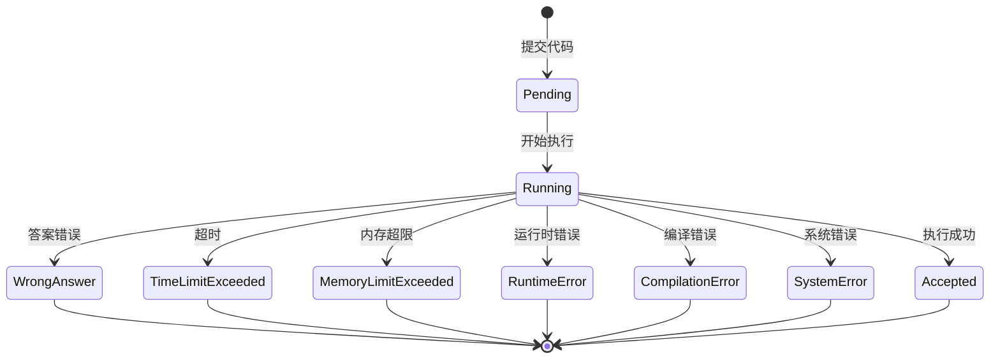
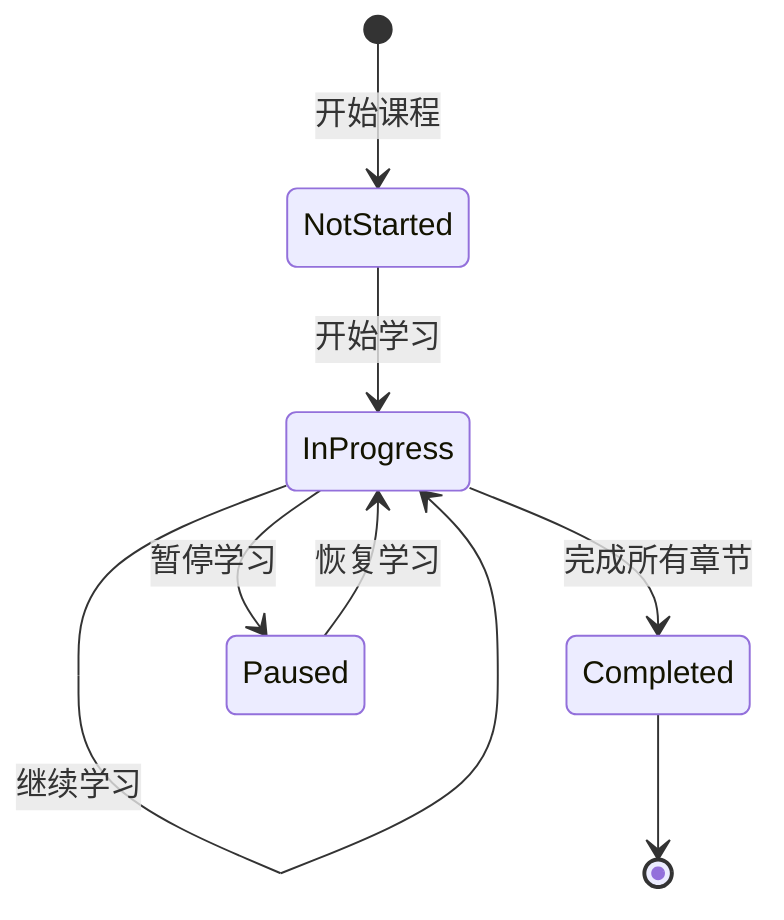
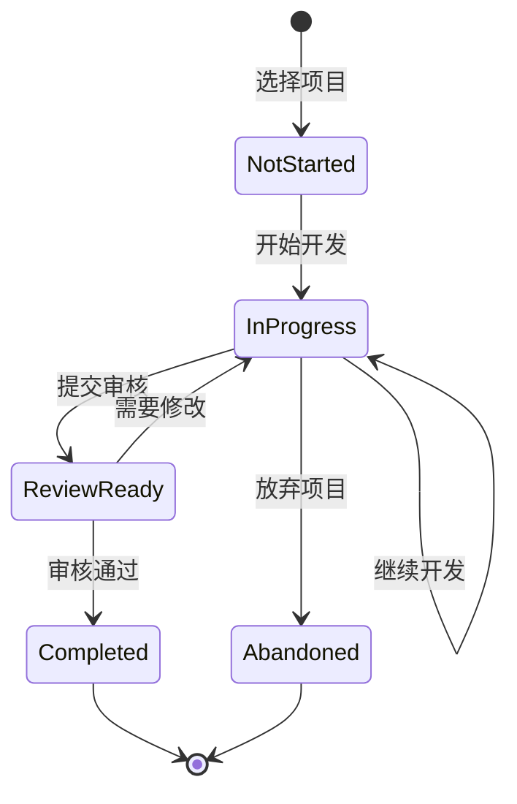

# 编程学习系统-详细设计

## 文档信息
| 项目 | 说明 |
|------|------|
| 模块名称 | 编程学习系统 |
| 设计版本 | v1.0 |
| 设计日期 | 2026-08-17 |
| 涉及端 | 服务端、客户端 |
| 依赖模块 | AI服务、用户服务、内容服务、学习记录服务 |

## 1. 需求概述

### 1.1 功能目标
为K12阶段学生提供完整的编程学习体验，从基础的编程概念理解到实际的代码编写和调试，结合AI辅助教学，帮助学生建立计算思维和编程能力。

### 1.2 核心功能
1. 编程概念可视化教学
2. 交互式代码编辑器
3. 在线代码执行环境
4. 编程练习与题目系统
5. AI代码辅导与错误诊断
6. 项目式学习路径
7. 成就系统与激励机制
8. 代码分享与协作学习

### 1.3 适用学段
- 小学高年级（4-6年级）：图形化编程、基础概念
- 初中阶段：Python入门、算法基础
- 高中阶段：Python进阶、数据结构、算法竞赛

## 2. 系统架构设计

### 2.1 整体架构

```
客户端层
├── 移动端APP (Flutter)
│   ├── 代码编辑器组件
│   ├── 可视化编程组件
│   ├── 调试器组件
│   └── 学习路径导航
├── Web端 (可选)
│   └── 完整IDE体验

服务层
├── 编程学习服务 (Programming Learning Service)
│   ├── 学习路径管理
│   ├── 练习题目管理
│   ├── 用户进度追踪
│   └── 成就系统
├── 代码执行服务 (Code Execution Service)
│   ├── 沙箱环境管理
│   ├── 代码安全检测
│   ├── 执行结果返回
│   └── 资源限制控制
├── AI编程辅导服务 (AI Programming Tutor Service)
│   ├── 代码理解与分析
│   ├── 错误诊断与提示
│   ├── 代码优化建议
│   └── 个性化学习推荐
└── 代码评测服务 (Code Grading Service)
    ├── 自动化测试
    ├── 性能评估
    ├── 代码质量分析
    └── 智能评分

AI能力层
├── 代码大模型 (Code LLM)
├── 错误分析模型
└── 个性化推荐模型

数据层
├── 用户代码数据库
├── 练习题库
├── 学习记录数据库
├── 代码模板库
└── 评测结果数据库

外部依赖
├── 在线代码执行引擎 (Docker/Judge0)
├── 代码质量分析工具 (SonarQube)
└── 版本控制系统 (Git)
```

### 2.2 技术选型

| 组件 | 技术方案 | 说明 |
|------|----------|------|
| 前端编辑器 | Monaco Editor | 支持语法高亮、代码补全、多语言 |
| 图形化编程 | Blockly/Scratch | 拖拽式编程，适合低龄学生 |
| 代码执行引擎 | Docker + Python解释器 | 沙箱隔离，资源限制 |
| API框架 | Spring Boot (Java) / FastAPI (Python) | 高性能、易扩展 |
| 数据库 | MySQL + Redis | 关系数据 + 缓存 |
| 消息队列 | RabbitMQ/Kafka | 异步任务处理 |
| AI模型 | GPT-4/Claude + 代码专用模型 | 代码理解与生成 |

## 3. 数据结构设计

### 3.1 核心实体定义

#### 用户编程档案表 (programming_profile)
```sql
CREATE TABLE programming_profile (
    id BIGINT PRIMARY KEY AUTO_INCREMENT,
    user_id BIGINT NOT NULL,
    current_level VARCHAR(50) DEFAULT 'beginner',
    total_practice_count INT DEFAULT 0,
    total_code_lines INT DEFAULT 0,
    preferred_language VARCHAR(20) DEFAULT 'python',
    learning_stages JSON,
    skill_tags JSON,
    achievements JSON,
    created_at TIMESTAMP DEFAULT CURRENT_TIMESTAMP,
    updated_at TIMESTAMP DEFAULT CURRENT_TIMESTAMP ON UPDATE CURRENT_TIMESTAMP,
    INDEX idx_user_id (user_id)
) ENGINE=InnoDB DEFAULT CHARSET=utf8mb4;
```

#### 编程课程表 (programming_course)
```sql
CREATE TABLE programming_course (
    id BIGINT PRIMARY KEY AUTO_INCREMENT,
    title VARCHAR(200) NOT NULL,
    description TEXT,
    level VARCHAR(50) NOT NULL,
    target_grade VARCHAR(50),
    prerequisites JSON,
    learning_objectives JSON,
    estimated_hours INT,
    is_published BOOLEAN DEFAULT FALSE,
    sort_order INT DEFAULT 0,
    created_at TIMESTAMP DEFAULT CURRENT_TIMESTAMP,
    updated_at TIMESTAMP DEFAULT CURRENT_TIMESTAMP ON UPDATE CURRENT_TIMESTAMP,
    INDEX idx_level (level),
    INDEX idx_target_grade (target_grade)
) ENGINE=InnoDB DEFAULT CHARSET=utf8mb4;
```

#### 编程章节表 (programming_chapter)
```sql
CREATE TABLE programming_chapter (
    id BIGINT PRIMARY KEY AUTO_INCREMENT,
    course_id BIGINT NOT NULL,
    title VARCHAR(200) NOT NULL,
    description TEXT,
    content JSON,
    practice_count INT DEFAULT 0,
    sort_order INT DEFAULT 0,
    is_free BOOLEAN DEFAULT FALSE,
    created_at TIMESTAMP DEFAULT CURRENT_TIMESTAMP,
    updated_at TIMESTAMP DEFAULT CURRENT_TIMESTAMP ON UPDATE CURRENT_TIMESTAMP,
    INDEX idx_course_id (course_id)
) ENGINE=InnoDB DEFAULT CHARSET=utf8mb4;
```

#### 编程练习表 (programming_exercise)
```sql
CREATE TABLE programming_exercise (
    id BIGINT PRIMARY KEY AUTO_INCREMENT,
    chapter_id BIGINT NOT NULL,
    title VARCHAR(200) NOT NULL,
    description TEXT NOT NULL,
    difficulty VARCHAR(20) DEFAULT 'medium',
    input_format TEXT,
    output_format TEXT,
    constraints TEXT,
    examples JSON,
    template_code TEXT,
    solution_code TEXT,
    test_cases JSON,
    time_limit INT DEFAULT 3000,
    memory_limit INT DEFAULT 256,
    hints JSON,
    knowledge_points JSON,
    tags JSON,
    created_at TIMESTAMP DEFAULT CURRENT_TIMESTAMP,
    updated_at TIMESTAMP DEFAULT CURRENT_TIMESTAMP ON UPDATE CURRENT_TIMESTAMP,
    INDEX idx_chapter_id (chapter_id),
    INDEX idx_difficulty (difficulty)
) ENGINE=InnoDB DEFAULT CHARSET=utf8mb4;
```

#### 用户代码提交表 (code_submission)
```sql
CREATE TABLE code_submission (
    id BIGINT PRIMARY KEY AUTO_INCREMENT,
    user_id BIGINT NOT NULL,
    exercise_id BIGINT NOT NULL,
    code TEXT NOT NULL,
    language VARCHAR(20) DEFAULT 'python',
    status VARCHAR(20) DEFAULT 'pending',
    execution_time INT,
    memory_usage INT,
    test_results JSON,
    ai_feedback JSON,
    score DECIMAL(5,2),
    submission_count INT DEFAULT 1,
    created_at TIMESTAMP DEFAULT CURRENT_TIMESTAMP,
    updated_at TIMESTAMP DEFAULT CURRENT_TIMESTAMP ON UPDATE CURRENT_TIMESTAMP,
    INDEX idx_user_id (user_id),
    INDEX idx_exercise_id (exercise_id),
    INDEX idx_status (status)
) ENGINE=InnoDB DEFAULT CHARSET=utf8mb4;
```

#### 编程项目表 (programming_project)
```sql
CREATE TABLE programming_project (
    id BIGINT PRIMARY KEY AUTO_INCREMENT,
    title VARCHAR(200) NOT NULL,
    description TEXT,
    difficulty VARCHAR(20) DEFAULT 'medium',
    category VARCHAR(50),
    requirements JSON,
    starter_code TEXT,
    solution_code TEXT,
    evaluation_criteria JSON,
    tags JSON,
    is_published BOOLEAN DEFAULT FALSE,
    created_at TIMESTAMP DEFAULT CURRENT_TIMESTAMP,
    updated_at TIMESTAMP DEFAULT CURRENT_TIMESTAMP ON UPDATE CURRENT_TIMESTAMP,
    INDEX idx_category (category),
    INDEX idx_difficulty (difficulty)
) ENGINE=InnoDB DEFAULT CHARSET=utf8mb4;
```

#### 用户项目进度表 (user_project_progress)
```sql
CREATE TABLE user_project_progress (
    id BIGINT PRIMARY KEY AUTO_INCREMENT,
    user_id BIGINT NOT NULL,
    project_id BIGINT NOT NULL,
    status VARCHAR(20) DEFAULT 'not_started',
    current_phase INT DEFAULT 0,
    code_snapshots JSON,
    ai_suggestions JSON,
    completion_percentage INT DEFAULT 0,
    started_at TIMESTAMP NULL,
    completed_at TIMESTAMP NULL,
    created_at TIMESTAMP DEFAULT CURRENT_TIMESTAMP,
    updated_at TIMESTAMP DEFAULT CURRENT_TIMESTAMP ON UPDATE CURRENT_TIMESTAMP,
    UNIQUE KEY uk_user_project (user_id, project_id),
    INDEX idx_status (status)
) ENGINE=InnoDB DEFAULT CHARSET=utf8mb4;
```

### 3.2 数据字典

**难度等级 (difficulty)**
- `beginner`: 初级，适合刚开始学习
- `easy`: 简单，基础概念练习
- `medium`: 中等，需要综合运用
- `hard`: 困难，复杂算法和问题解决
- `expert`: 专家级，竞赛级别

**提交状态 (status)**
- `pending`: 等待执行
- `running`: 正在执行
- `accepted`: 通过
- `wrong_answer`: 答案错误
- `time_limit_exceeded`: 超时
- `memory_limit_exceeded`: 内存超限
- `runtime_error`: 运行时错误
- `compilation_error`: 编译错误
- `system_error`: 系统错误

## 4. API接口设计

### 4.1 编程学习管理接口

#### 获取学习路径
```
GET /api/v1/programming/learning-path
```
**请求参数**
```json
{
  "grade_level": "grade_7",
  "current_level": "beginner",
  "interests": ["algorithm", "data_science"]
}
```

**响应示例**
```json
{
  "code": 200,
  "data": {
    "recommended_courses": [
      {
        "id": 1,
        "title": "Python编程入门",
        "level": "beginner",
        "chapters_count": 12,
        "estimated_hours": 20,
        "completion_rate": 0.25,
        "next_chapter": {
          "id": 3,
          "title": "变量与数据类型"
        }
      }
    ],
    "skill_gaps": [
      "循环结构",
      "函数定义"
    ],
    "daily_mission": {
      "exercise_id": 123,
      "title": "实现一个简单的计算器",
      "reward_points": 50
    }
  }
}
```

#### 获取课程详情
```
GET /api/v1/programming/courses/{courseId}
```

#### 获取章节内容
```
GET /api/v1/programming/chapters/{chapterId}
```

### 4.2 代码执行接口

#### 提交代码执行
```
POST /api/v1/programming/execute
```
**请求参数**
```json
{
  "exercise_id": 123,
  "code": "def solution():\n    return 'Hello World'",
  "language": "python",
  "test_mode": true
}
```

**响应示例**
```json
{
  "code": 200,
  "data": {
    "submission_id": "sub_123456",
    "status": "running",
    "estimated_time": 2,
    "queue_position": 3
  }
}
```

#### 获取执行结果
```
GET /api/v1/programming/submissions/{submissionId}
```

**响应示例**
```json
{
  "code": 200,
  "data": {
    "submission_id": "sub_123456",
    "status": "accepted",
    "execution_time": 156,
    "memory_usage": 128,
    "test_results": [
      {
        "case_id": 1,
        "status": "passed",
        "input": "5",
        "expected_output": "120",
        "actual_output": "120",
        "execution_time": 12
      },
      {
        "case_id": 2,
        "status": "failed",
        "input": "0",
        "expected_output": "1",
        "actual_output": "Error",
        "error_message": "ZeroDivisionError"
      }
    ],
    "ai_feedback": {
      "overall_score": 0.5,
      "strengths": ["正确处理了基础用例"],
      "weaknesses": ["未处理边界情况"],
      "suggestions": [
        "添加对0的特殊处理",
        "考虑负数输入的情况"
      ],
      "improved_code": "def solution(n):\n    if n < 0:\n        raise ValueError('n must be non-negative')\n    if n == 0:\n        return 1\n    result = 1\n    for i in range(1, n+1):\n        result *= i\n    return result"
    }
  }
}
```

### 4.3 AI编程辅导接口

#### 获取代码分析
```
POST /api/v1/programming/ai/analyze
```
**请求参数**
```json
{
  "code": "def sum(a, b):\n    return a + b",
  "language": "python",
  "context": {
    "exercise_id": 123,
    "user_level": "beginner"
  }
}
```

**响应示例**
```json
{
  "code": 200,
  "data": {
    "analysis": {
      "correctness": 0.9,
      "efficiency": 0.8,
      "readability": 0.7,
      "best_practices": 0.6
    },
    "issues": [
      {
        "severity": "info",
        "line": 2,
        "message": "函数缺少文档字符串",
        "suggestion": "添加docstring说明函数用途"
      },
      {
        "severity": "warning",
        "line": 2,
        "message": "未进行参数类型检查",
        "suggestion": "考虑添加类型注解和参数验证"
      }
    ],
    "improvements": [
      "可以添加类型注解提高代码清晰度",
      "考虑添加错误处理机制"
    ]
  }
}
```

#### 获取智能提示
```
POST /api/v1/programming/ai/hint
```
**请求参数**
```json
{
  "exercise_id": 123,
  "current_code": "def solution():\n    # TODO: 实现阶乘计算\n    pass",
  "hint_level": 1
}
```

**响应示例**
```json
{
  "code": 200,
  "data": {
    "hint_level": 1,
    "hint": "阶乘是从1乘到n的乘积，你可以考虑使用循环来实现",
    "next_step": "尝试用一个for循环来实现",
    "code_snippet": "result = 1\nfor i in range(1, n+1):\n    result *= i\nreturn result"
  }
}
```

### 4.4 项目式学习接口

#### 获取项目列表
```
GET /api/v1/programming/projects
```
**查询参数**
- `difficulty`: 难度筛选
- `category`: 类别筛选
- `tags`: 标签筛选

#### 开始项目
```
POST /api/v1/programming/projects/{projectId}/start
```

#### 保存项目代码
```
POST /api/v1/programming/projects/{projectId}/save
```
**请求参数**
```json
{
  "phase": 1,
  "code": "import turtle\nt = turtle.Turtle()\nt.forward(100)",
  "notes": "第一阶段完成，实现了基本移动"
}
```

#### 提交项目评价
```
POST /api/v1/programming/projects/{projectId}/submit
```

## 5. 关键代码实现

### 5.1 代码执行服务核心逻辑

```python
import docker
import time
import json
from typing import Dict, Any

class CodeExecutionService:
    def __init__(self):
        self.docker_client = docker.from_env()
        self.timeout = 10  # 默认超时时间
        self.memory_limit = "256m"  # 默认内存限制

    def execute_code(self, code: str, language: str = "python",
                    test_cases: list = None) -> Dict[str, Any]:
        """
        执行用户代码并返回结果
        """
        try:
            # 创建Docker容器
            container = self.docker_client.containers.run(
                image="python:3.9-slim",
                command=f"python3 -c '{code}'",
                mem_limit=self.memory_limit,
                network_mode="none",  # 禁用网络
                detach=True,
                remove=False
            )

            # 等待执行完成或超时
            start_time = time.time()
            result = self._wait_for_container(container, self.timeout)
            execution_time = int((time.time() - start_time) * 1000)

            # 获取执行结果
            logs = container.logs().decode('utf-8')
            exit_code = container.wait()['StatusCode']

            container.remove(force=True)

            if exit_code == 0:
                # 执行成功，运行测试用例
                test_results = self._run_test_cases(code, test_cases) if test_cases else []
                return {
                    "status": "accepted" if all(test['passed'] for test in test_results) else "wrong_answer",
                    "output": logs,
                    "execution_time": execution_time,
                    "test_results": test_results
                }
            else:
                return {
                    "status": "runtime_error",
                    "error": logs,
                    "execution_time": execution_time
                }

        except Exception as e:
            return {
                "status": "system_error",
                "error": str(e)
            }

    def _wait_for_container(self, container, timeout: int) -> bool:
        """
        等待容器执行完成
        """
        start_time = time.time()
        while container.status == "running":
            if time.time() - start_time > timeout:
                container.kill()
                raise TimeoutError("Code execution timeout")
            time.sleep(0.1)
        return True

    def _run_test_cases(self, code: str, test_cases: list) -> list:
        """
        运行测试用例
        """
        results = []
        for test_case in test_cases:
            try:
                # 动态执行测试代码
                exec_globals = {"__builtins__": __builtins__}
                exec(code, exec_globals)

                # 准备测试输入
                input_data = test_case.get('input', '')
                expected_output = test_case.get('expected_output', '')

                # 执行用户函数
                if 'solution' in exec_globals:
                    actual_output = str(exec_globals['solution'](input_data))
                else:
                    # 执行整个脚本并捕获输出
                    import io
                    import sys
                    old_stdout = sys.stdout
                    sys.stdout = buffer = io.StringIO()
                    exec(code, exec_globals)
                    actual_output = buffer.getvalue()
                    sys.stdout = old_stdout

                # 比较结果
                passed = actual_output.strip() == expected_output.strip()
                results.append({
                    'case_id': test_case.get('case_id'),
                    'passed': passed,
                    'input': input_data,
                    'expected_output': expected_output,
                    'actual_output': actual_output
                })

            except Exception as e:
                results.append({
                    'case_id': test_case.get('case_id'),
                    'passed': False,
                    'error': str(e)
                })

        return results

    def validate_code_security(self, code: str, language: str) -> Dict[str, Any]:
        """
        代码安全性检查
        """
        security_issues = []

        # 检查危险操作
        dangerous_patterns = [
            r'import\s+os\s*\.system',
            r'import\s+subprocess',
            r'eval\s*\(',
            r'exec\s*\(',
            r'__import__',
            r'open\s*\(',
            r'input\s*\(',
            r'\.sleep\s*\(',
        ]

        for pattern in dangerous_patterns:
            import re
            if re.search(pattern, code):
                security_issues.append({
                    "severity": "critical",
                    "pattern": pattern,
                    "message": "检测到危险操作"
                })

        return {
            "is_safe": len(security_issues) == 0,
            "security_issues": security_issues
        }
```

### 5.2 AI代码分析服务

```python
from typing import Dict, Any, List
import ast
import re

class AICodeAnalysisService:
    def __init__(self, ai_client):
        self.ai_client = ai_client

    def analyze_code(self, code: str, language: str,
                    context: Dict[str, Any]) -> Dict[str, Any]:
        """
        AI代码分析
        """
        # 基础语法分析
        syntax_analysis = self._analyze_syntax(code, language)

        # AI深度分析
        ai_analysis = self._ai_analyze(code, language, context)

        # 代码质量分析
        quality_analysis = self._analyze_quality(code, language)

        return {
            "syntax_analysis": syntax_analysis,
            "ai_analysis": ai_analysis,
            "quality_analysis": quality_analysis,
            "overall_score": self._calculate_overall_score(syntax_analysis, ai_analysis, quality_analysis)
        }

    def _analyze_syntax(self, code: str, language: str) -> Dict[str, Any]:
        """
        基础语法分析
        """
        if language == "python":
            return self._analyze_python_syntax(code)
        # 其他语言的分析
        return {}

    def _analyze_python_syntax(self, code: str) -> Dict[str, Any]:
        """
        Python语法分析
        """
        try:
            tree = ast.parse(code)

            # 统计代码特征
            functions = []
            classes = []
            imports = []
            complexity = 0

            for node in ast.walk(tree):
                if isinstance(node, ast.FunctionDef):
                    functions.append({
                        "name": node.name,
                        "line": node.lineno,
                        "args": [arg.arg for arg in node.args.args]
                    })
                    complexity += self._calculate_cyclomatic_complexity(node)

                elif isinstance(node, ast.ClassDef):
                    classes.append({
                        "name": node.name,
                        "line": node.lineno,
                        "methods": [n.name for n in node.body if isinstance(n, ast.FunctionDef)]
                    })

                elif isinstance(node, (ast.Import, ast.ImportFrom)):
                    if isinstance(node, ast.Import):
                        imports.extend([alias.name for alias in node.names])
                    else:
                        imports.append(node.module)

            return {
                "is_valid": True,
                "functions_count": len(functions),
                "classes_count": len(classes),
                "imports": imports,
                "cyclomatic_complexity": complexity,
                "functions": functions,
                "classes": classes
            }

        except SyntaxError as e:
            return {
                "is_valid": False,
                "error": str(e),
                "line": e.lineno
            }

    def _calculate_cyclomatic_complexity(self, node) -> int:
        """
        计算圈复杂度
        """
        complexity = 1
        for child in ast.walk(node):
            if isinstance(child, (ast.If, ast.While, ast.For, ast.ExceptHandler)):
                complexity += 1
            elif isinstance(child, ast.BoolOp):
                complexity += len(child.values) - 1
        return complexity

    def _ai_analyze(self, code: str, language: str,
                   context: Dict[str, Any]) -> Dict[str, Any]:
        """
        AI深度分析
        """
        prompt = self._build_analysis_prompt(code, language, context)

        try:
            response = self.ai_client.chat.completions.create(
                model="gpt-4",
                messages=[
                    {
                        "role": "system",
                        "content": "你是一个专业的编程教育AI助手，擅长分析学生代码，提供教育性的反馈和改进建议。"
                    },
                    {
                        "role": "user",
                        "content": prompt
                    }
                ],
                temperature=0.7,
                max_tokens=1000
            )

            ai_response = response.choices[0].message.content

            return self._parse_ai_response(ai_response)

        except Exception as e:
            return {
                "error": f"AI分析失败: {str(e)}"
            }

    def _build_analysis_prompt(self, code: str, language: str,
                               context: Dict[str, Any]) -> str:
        """
        构建分析提示词
        """
        user_level = context.get('user_level', 'intermediate')
        exercise_context = context.get('exercise_id', '')

        prompt = f"""
请分析以下{language}代码，针对{user_level}水平的学习者提供反馈：

```python
{code}
```

请从以下几个维度进行分析：
1. 正确性：代码逻辑是否正确
2. 效率：时间复杂度和空间复杂度
3. 可读性：代码风格和命名规范
4. 最佳实践：是否遵循编程最佳实践

请提供具体的改进建议，并给出改进后的代码示例。建议应该具有教育意义，能帮助学习者理解。
"""
        return prompt

    def _parse_ai_response(self, response: str) -> Dict[str, Any]:
        """
        解析AI响应
        """
        # 这里可以根据AI返回的格式进行结构化解析
        return {
            "feedback": response,
            "strengths": [],
            "weaknesses": [],
            "suggestions": [],
            "improved_code": None
        }

    def _analyze_quality(self, code: str, language: str) -> Dict[str, Any]:
        """
        代码质量分析
        """
        if language == "python":
            return self._analyze_python_quality(code)
        return {}

    def _analyze_python_quality(self, code: str) -> Dict[str, Any]:
        """
        Python代码质量分析
        """
        issues = []

        # 检查代码长度
        if len(code.split('\n')) > 100:
            issues.append({
                "severity": "warning",
                "message": "代码过长，建议拆分为多个函数",
                "line": 1
            })

        # 检查命名规范
        function_names = re.findall(r'def\s+([a-zA-Z_][a-zA-Z0-9_]*)', code)
        for name in function_names:
            if not name.islower() or '_' not in name:
                issues.append({
                    "severity": "info",
                    "message": f"函数名 '{name}' 不符合snake_case命名规范",
                    "type": "naming"
                })

        # 检查魔法数字
        magic_numbers = re.findall(r'\b\d+\b', code)
        if len(magic_numbers) > 5:
            issues.append({
                "severity": "info",
                "message": "发现多个魔法数字，建议使用常量",
                "type": "maintainability"
            })

        return {
            "score": max(0, 100 - len(issues) * 10),
            "issues": issues,
            "metrics": {
                "lines_of_code": len(code.split('\n')),
                "functions_count": len(function_names),
                "complexity_score": self._calculate_complexity_score(code)
            }
        }

    def _calculate_complexity_score(self, code: str) -> int:
        """
        计算复杂度评分
        """
        complexity_keywords = ['if', 'elif', 'for', 'while', 'except', 'try']
        complexity = sum(code.count(keyword) for keyword in complexity_keywords)
        return max(0, 100 - complexity * 5)

    def _calculate_overall_score(self, syntax_analysis: Dict,
                                ai_analysis: Dict,
                                quality_analysis: Dict) -> float:
        """
        计算综合评分
        """
        if not syntax_analysis.get('is_valid', False):
            return 0.0

        quality_score = quality_analysis.get('score', 50)
        complexity_score = quality_analysis.get('metrics', {}).get('complexity_score', 50)

        return round((quality_score + complexity_score) / 2, 2)

    def get_hint(self, exercise_id: int, current_code: str,
                hint_level: int) -> Dict[str, Any]:
        """
        获取编程提示
        """
        exercise = self._get_exercise_by_id(exercise_id)
        if not exercise:
            return {"error": "练习不存在"}

        hint_prompt = self._build_hint_prompt(exercise, current_code, hint_level)

        try:
            response = self.ai_client.chat.completions.create(
                model="gpt-4",
                messages=[
                    {
                        "role": "system",
                        "content": "你是一个编程学习助手，擅长给出适度的学习提示，帮助学生自己找到解决方案，而不是直接给出答案。"
                    },
                    {
                        "role": "user",
                        "content": hint_prompt
                    }
                ],
                temperature=0.8,
                max_tokens=500
            )

            hint = response.choices[0].message.content

            return {
                "hint_level": hint_level,
                "hint": hint,
                "can_progress": hint_level < 3
            }

        except Exception as e:
            return {
                "error": f"获取提示失败: {str(e)}"
            }

    def _build_hint_prompt(self, exercise: Dict, current_code: str,
                          hint_level: int) -> str:
        """
        构建提示提示词
        """
        descriptions = {
            1: "给出一个高层次的方向提示，引导学生思考",
            2: "给出具体的实现思路或关键代码片段",
            3: "给出接近解决方案的提示"
        }

        prompt = f"""
练习题目：{exercise['title']}
题目描述：{exercise['description']}

学生当前代码：
```python
{current_code}
```

请提供第{hint_level}级提示（{descriptions[hint_level]}）。
提示应该具有教育意义，帮助学生理解解决问题的思路。
"""
        return prompt

    def _get_exercise_by_id(self, exercise_id: int) -> Dict:
        """
        获取练习信息
        """
        # 这里应该从数据库查询
        return {}
```

### 5.3 前端代码编辑器组件

```dart
import 'package:flutter/material.dart';
import 'package:flutter_code_editor/flutter_code_editor.dart';
import 'package:highlight/languages/python.dart';

class CodeEditorWidget extends StatefulWidget {
  final String initialCode;
  final Function(String) onCodeChanged;
  final Function() onRunCode;
  final Function() onGetHint;
  final bool readOnly;

  const CodeEditorWidget({
    Key? key,
    required this.initialCode,
    required this.onCodeChanged,
    required this.onRunCode,
    required this.onGetHint,
    this.readOnly = false,
  }) : super(key: key);

  @override
  _CodeEditorWidgetState createState() => _CodeEditorWidgetState();
}

class _CodeEditorWidgetState extends State<CodeEditorWidget> {
  late CodeController _codeController;
  int _currentLine = 1;
  int _currentColumn = 1;
  List<Diagnostic> _diagnostics = [];

  @override
  void initState() {
    super.initState();
    _codeController = CodeController(
      text: widget.initialCode,
      language: python,
    );

    _codeController.addListener(() {
      widget.onCodeChanged(_codeController.text);
      _updateCursorPosition();
    });
  }

  void _updateCursorPosition() {
    final position = _codeController.selection.base;
    final text = _codeController.text.substring(0, position.offset);
    final lines = text.split('\n');
    setState(() {
      _currentLine = lines.length;
      _currentColumn = lines.last.length + 1;
    });
  }

  void _insertCodeSnippet(String snippet) {
    final selection = _codeController.selection;
    _codeController.text = _codeController.text.replaceRange(
      selection.start,
      selection.end,
      snippet,
    );
    _codeController.selection = TextSelection.collapsed(
      offset: selection.start + snippet.length,
    );
  }

  @override
  Widget build(BuildContext context) {
    return Container(
      decoration: BoxDecoration(
        color: Colors.grey[900],
        borderRadius: BorderRadius.circular(8),
      ),
      child: Column(
        children: [
          _buildToolbar(),
          Divider(color: Colors.grey[700]),
          Expanded(
            child: _buildEditor(),
          ),
          _buildStatusBar(),
        ],
      ),
    );
  }

  Widget _buildToolbar() {
    return Container(
      padding: const EdgeInsets.symmetric(horizontal: 8, vertical: 4),
      child: Row(
        children: [
          Text(
            'Python',
            style: TextStyle(color: Colors.grey[400], fontSize: 12),
          ),
          Spacer(),
          if (!widget.readOnly) ...[
            _buildToolbarButton(
              icon: Icons.lightbulb_outline,
              tooltip: '获取提示',
              onPressed: widget.onGetHint,
            ),
            _buildToolbarButton(
              icon: Icons.play_arrow,
              tooltip: '运行代码',
              onPressed: widget.onRunCode,
            ),
          ],
        ],
      ),
    );
  }

  Widget _buildToolbarButton({
    required IconData icon,
    required String tooltip,
    required VoidCallback onPressed,
  }) {
    return Tooltip(
      message: tooltip,
      child: IconButton(
        icon: Icon(icon, color: Colors.white70, size: 20),
        onPressed: onPressed,
        padding: EdgeInsets.zero,
        constraints: BoxConstraints(),
      ),
    );
  }

  Widget _buildEditor() {
    return Stack(
      children: [
        CodeTheme(
          data: CodeThemeData(
            styles: pythonTheme,
          ),
          child: SingleChildScrollView(
            child: CodeField(
              controller: _codeController,
              enabled: !widget.readOnly,
              textStyle: TextStyle(
                fontFamily: 'Fira Code',
                fontSize: 14,
                height: 1.5,
              ),
              minLines: 10,
              maxLines: null,
              decoration: BoxDecoration(
                color: Colors.transparent,
              ),
            ),
          ),
        ),
        if (_diagnostics.isNotEmpty)
          _buildDiagnosticsPanel(),
      ],
    );
  }

  Widget _buildDiagnosticsPanel() {
    return Positioned(
      bottom: 0,
      left: 0,
      right: 0,
      child: Container(
        decoration: BoxDecoration(
          color: Colors.red[900]?.withOpacity(0.9),
          borderRadius: BorderRadius.vertical(top: Radius.circular(8)),
        ),
        padding: EdgeInsets.all(12),
        child: Column(
          crossAxisAlignment: CrossAxisAlignment.start,
          mainAxisSize: MainAxisSize.min,
          children: [
            Row(
              children: [
                Icon(Icons.error_outline, color: Colors.white, size: 16),
                SizedBox(width: 8),
                Text(
                  '代码错误',
                  style: TextStyle(color: Colors.white, fontWeight: FontWeight.bold),
                ),
              ],
            ),
            SizedBox(height: 8),
            ..._diagnostics.map((diag) => Padding(
              padding: EdgeInsets.only(bottom: 4),
              child: Text(
                '行 ${diag.line}: ${diag.message}',
                style: TextStyle(color: Colors.white70, fontSize: 12),
              ),
            )),
          ],
        ),
      ),
    );
  }

  Widget _buildStatusBar() {
    return Container(
      padding: const EdgeInsets.symmetric(horizontal: 12, vertical: 4),
      decoration: BoxDecoration(
        color: Colors.grey[800],
        borderRadius: BorderRadius.vertical(bottom: Radius.circular(8)),
      ),
      child: Row(
        children: [
          Icon(Icons.location_on, color: Colors.grey[400], size: 12),
          SizedBox(width: 4),
          Text(
            '行 $_currentLine, 列 $_currentColumn',
            style: TextStyle(color: Colors.grey[400], fontSize: 11),
          ),
          Spacer(),
          Text(
            'UTF-8',
            style: TextStyle(color: Colors.grey[400], fontSize: 11),
          ),
          SizedBox(width: 16),
          Text(
            'Python 3.9',
            style: TextStyle(color: Colors.grey[400], fontSize: 11),
          ),
        ],
      ),
    );
  }

  @override
  void dispose() {
    _codeController.dispose();
    super.dispose();
  }
}

class Diagnostic {
  final int line;
  final String message;
  final DiagnosticSeverity severity;

  Diagnostic({
    required this.line,
    required this.message,
    required this.severity,
  });
}

enum DiagnosticSeverity {
  error,
  warning,
  info,
}

// Python代码高亮主题
final pythonTheme = {
  'root': TextStyle(color: Color(0xFFABB2BF)),
  'keyword': TextStyle(color: Color(0xFFC678DD)),
  'string': TextStyle(color: Color(0xFF98C379)),
  'number': TextStyle(color: Color(0xFFD19A66)),
  'comment': TextStyle(color: Color(0xFF5C6370), fontStyle: FontStyle.italic),
  'function': TextStyle(color: Color(0xFF61AFEF)),
  'class-name': TextStyle(color: Color(0xFFE5C07B)),
  'operator': TextStyle(color: Color(0xFF56B6C2)),
};
```

## 6. 状态流转设计

### 6.1 代码执行状态机



### 6.2 学习进度状态机



### 6.3 项目开发状态机



## 7. 错误处理与异常处理

### 7.1 常见错误类型

| 错误类型 | HTTP状态码 | 处理策略 |
|----------|------------|----------|
| 代码语法错误 | 400 | 返回具体错误信息和行号 |
| 执行超时 | 408 | 建议优化代码或调整时间限制 |
| 内存超限 | 413 | 提示内存使用优化建议 |
| 安全违规 | 403 | 拒绝执行并记录日志 |
| 系统错误 | 500 | 返回通用错误信息，记录详细日志 |
| 网络错误 | 503 | 建议检查网络连接，支持重试 |

### 7.2 错误处理代码示例

```python
from fastapi import HTTPException, status
from typing import Dict, Any
import logging

logger = logging.getLogger(__name__)

class ProgrammingExceptionHandler:
    @staticmethod
    def handle_syntax_error(error: SyntaxError) -> Dict[str, Any]:
        """
        处理语法错误
        """
        return {
            "error_type": "syntax_error",
            "message": "代码语法错误",
            "details": {
                "line": error.lineno,
                "offset": error.offset,
                "text": error.text,
                "error_message": str(error)
            },
            "suggestion": "请检查代码的语法拼写和缩进"
        }

    @staticmethod
    def handle_runtime_error(error: Exception) -> Dict[str, Any]:
        """
        处理运行时错误
        """
        error_type = type(error).__name__
        error_messages = {
            "ZeroDivisionError": "除零错误，请检查除数是否为0",
            "NameError": "变量名错误，请检查变量是否定义",
            "TypeError": "类型错误，请检查数据类型是否匹配",
            "IndexError": "索引越界，请检查列表或字符串索引",
            "KeyError": "键不存在，请检查字典键是否正确",
            "ValueError": "值错误，请检查值的格式或范围",
            "AttributeError": "属性错误，请检查对象是否有该属性",
        }

        return {
            "error_type": "runtime_error",
            "error_class": error_type,
            "message": error_messages.get(error_type, str(error)),
            "suggestion": "请检查代码逻辑和数据类型"
        }

    @staticmethod
    def handle_timeout_error(timeout: int) -> Dict[str, Any]:
        """
        处理超时错误
        """
        return {
            "error_type": "timeout_error",
            "message": f"代码执行超时（{timeout}秒）",
            "suggestion": "请优化算法复杂度或检查是否存在无限循环",
            "tips": [
                "检查循环条件是否正确",
                "优化算法时间复杂度",
                "考虑使用更高效的数据结构"
            ]
        }

    @staticmethod
    def handle_memory_error(limit: str) -> Dict[str, Any]:
        """
        处理内存超限错误
        """
        return {
            "error_type": "memory_error",
            "message": f"内存使用超限（{limit}）",
            "suggestion": "请优化内存使用，避免创建过大的数据结构",
            "tips": [
                "检查是否创建了不必要的列表或字典",
                "考虑使用生成器替代列表",
                "及时释放不再使用的大对象"
            ]
        }

    @staticmethod
    def handle_security_error(violation: str) -> Dict[str, Any]:
        """
        处理安全违规错误
        """
        logger.warning(f"安全违规检测: {violation}")
        return {
            "error_type": "security_error",
            "message": "代码包含不安全的操作",
            "violation": violation,
            "suggestion": "请移除危险操作，如文件访问、系统命令等"
        }

def handle_code_execution_exception(func):
    """
    代码执行异常处理装饰器
    """
    def wrapper(*args, **kwargs):
        try:
            return func(*args, **kwargs)
        except SyntaxError as e:
            raise HTTPException(
                status_code=status.HTTP_400_BAD_REQUEST,
                detail=ProgrammingExceptionHandler.handle_syntax_error(e)
            )
        except TimeoutError:
            raise HTTPException(
                status_code=status.HTTP_408_REQUEST_TIMEOUT,
                detail=ProgrammingExceptionHandler.handle_timeout_error(10)
            )
        except MemoryError:
            raise HTTPException(
                status_code=status.HTTP_413_REQUEST_ENTITY_TOO_LARGE,
                detail=ProgrammingExceptionHandler.handle_memory_error("256m")
            )
        except Exception as e:
            error_type = type(e).__name__
            if error_type in ["ZeroDivisionError", "NameError", "TypeError", "IndexError"]:
                raise HTTPException(
                    status_code=status.HTTP_400_BAD_REQUEST,
                    detail=ProgrammingExceptionHandler.handle_runtime_error(e)
                )
            else:
                logger.error(f"代码执行系统错误: {str(e)}", exc_info=True)
                raise HTTPException(
                    status_code=status.HTTP_500_INTERNAL_SERVER_ERROR,
                    detail={
                        "error_type": "system_error",
                        "message": "系统错误，请稍后重试"
                    }
                )
    return wrapper
```

## 8. 性能优化与安全考虑

### 8.1 性能优化策略

1. **代码执行优化**
   - 使用Docker容器隔离，限制资源使用
   - 实现代码执行结果缓存
   - 批量执行测试用例，减少容器创建销毁开销

2. **AI调用优化**
   - 实现AI响应缓存，相同代码不重复分析
   - 使用流式响应，提升用户体验
   - 设置合理的超时时间和重试策略

3. **数据库优化**
   - 为常用查询字段创建索引
   - 实现分页查询，避免大数据量查询
   - 使用Redis缓存热门数据

4. **前端优化**
   - 代码编辑器懒加载
   - 实现代码语法高亮的增量更新
   - 优化大型项目的加载性能

### 8.2 安全考虑

1. **代码执行安全**
   - Docker容器沙箱隔离
   - 禁用网络访问
   - 限制文件系统访问权限
   - 设置执行时间和内存限制
   - 代码安全检测，过滤危险操作

2. **数据安全**
   - 用户代码加密存储
   - 敏感信息脱敏处理
   - 定期备份重要数据

3. **访问控制**
   - 基于角色的访问控制
   - API接口鉴权
   - 频率限制，防止滥用

4. **内容安全**
   - AI输出内容安全过滤
   - 用户提交内容审核
   - 恶意代码检测

## 9. 测试策略

### 9.1 单元测试

```python
import pytest
from programming_service import CodeExecutionService

class TestCodeExecutionService:
    def setup_method(self):
        self.service = CodeExecutionService()

    def test_simple_execution(self):
        """测试简单代码执行"""
        code = "print('Hello World')"
        result = self.service.execute_code(code)
        assert result["status"] == "accepted"
        assert "Hello World" in result["output"]

    def test_syntax_error(self):
        """测试语法错误处理"""
        code = "print('Hello World'"
        result = self.service.execute_code(code)
        assert result["status"] == "runtime_error"

    def test_infinite_loop_timeout(self):
        """测试无限循环超时"""
        code = "while True: pass"
        result = self.service.execute_code(code)
        assert result["status"] == "system_error"

    def test_security_validation(self):
        """测试安全验证"""
        dangerous_code = "import os; os.system('rm -rf /')"
        validation = self.service.validate_code_security(dangerous_code, "python")
        assert not validation["is_safe"]
        assert len(validation["security_issues"]) > 0

    def test_function_execution(self):
        """测试函数执行"""
        code = """
def add(a, b):
    return a + b

print(add(2, 3))
"""
        result = self.service.execute_code(code)
        assert result["status"] == "accepted"
        assert "5" in result["output"]
```

### 9.2 集成测试

```python
import pytest
from fastapi.testclient import TestClient
from main import app

client = TestClient(app)

class TestProgrammingAPI:
    def test_execute_code_endpoint(self):
        """测试代码执行接口"""
        response = client.post(
            "/api/v1/programming/execute",
            json={
                "code": "print('test')",
                "language": "python"
            }
        )
        assert response.status_code == 200
        data = response.json()
        assert "submission_id" in data["data"]

    def test_get_submission_result(self):
        """测试获取提交结果接口"""
        # 先提交代码
        submit_response = client.post(
            "/api/v1/programming/execute",
            json={
                "code": "print('test')",
                "language": "python"
            }
        )
        submission_id = submit_response.json()["data"]["submission_id"]

        # 获取结果
        result_response = client.get(f"/api/v1/programming/submissions/{submission_id}")
        assert result_response.status_code == 200
        data = result_response.json()
        assert "status" in data["data"]

    def test_ai_code_analysis(self):
        """测试AI代码分析接口"""
        response = client.post(
            "/api/v1/programming/ai/analyze",
            json={
                "code": "def test(): pass",
                "language": "python",
                "context": {"user_level": "beginner"}
            }
        )
        assert response.status_code == 200
        data = response.json()
        assert "analysis" in data["data"]
```

## 10. 部署与运维

### 10.1 部署架构

```
负载均衡层 (Nginx)
    ↓
API服务层 (多实例)
    ↓
消息队列 (RabbitMQ)
    ↓
代码执行集群 (Docker Swarm/K8s)
    ↓
数据存储层 (MySQL + Redis)
```

### 10.2 监控指标

| 指标类型 | 具体指标 | 告警阈值 |
|----------|----------|----------|
| 系统性能 | CPU使用率 | >80% |
| 系统性能 | 内存使用率 | >85% |
| 系统性能 | 磁盘使用率 | >90% |
| 业务指标 | 代码执行成功率 | <95% |
| 业务指标 | 平均执行时间 | >5秒 |
| 业务指标 | API响应时间 | >2秒 |
| 错误监控 | 错误率 | >5% |
| 资源监控 | Docker容器数量 | >1000 |

### 10.3 日志管理

```python
import logging
from logging.handlers import RotatingFileHandler
import json

class JSONFormatter(logging.Formatter):
    def format(self, record):
        log_data = {
            "timestamp": self.formatTime(record),
            "level": record.levelname,
            "message": record.getMessage(),
            "module": record.module,
            "function": record.funcName,
            "line": record.lineno
        }
        if hasattr(record, 'user_id'):
            log_data['user_id'] = record.user_id
        if hasattr(record, 'submission_id'):
            log_data['submission_id'] = record.submission_id

        return json.dumps(log_data, ensure_ascii=False)

# 配置日志
def setup_logging():
    logger = logging.getLogger()
    logger.setLevel(logging.INFO)

    # 文件处理器
    file_handler = RotatingFileHandler(
        'logs/programming_service.log',
        maxBytes=10*1024*1024,  # 10MB
        backupCount=10
    )
    file_handler.setFormatter(JSONFormatter())
    logger.addHandler(file_handler)

    # 控制台处理器
    console_handler = logging.StreamHandler()
    console_handler.setFormatter(JSONFormatter())
    logger.addHandler(console_handler)
```

## 11. 总结

编程学习系统作为PrimeTop项目的重要组成部分，为学生提供了从编程概念学习到实际项目开发的完整学习路径。通过AI辅助教学、在线代码执行、智能错误诊断等功能，帮助学生建立计算思维和编程能力。

系统的核心特点包括：

1. **分层教学**：根据学生水平提供不同难度的学习内容和练习
2. **即时反馈**：实时代码执行和错误提示，帮助学生快速理解问题
3. **AI辅导**：智能代码分析和个性化学习建议
4. **项目驱动**：通过实际项目提升编程实践能力
5. **安全可靠**：完善的代码安全检测和资源限制机制

通过持续优化算法性能、丰富教学内容、提升AI辅导质量，系统将成为学生学习编程的有力工具。