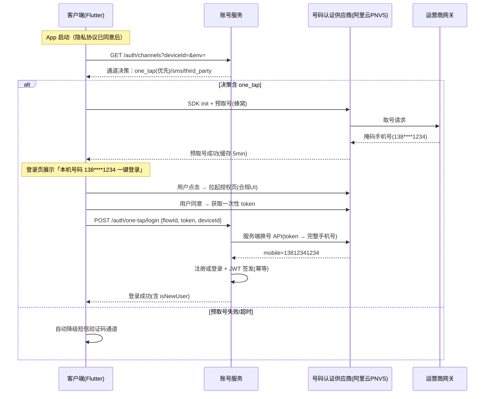
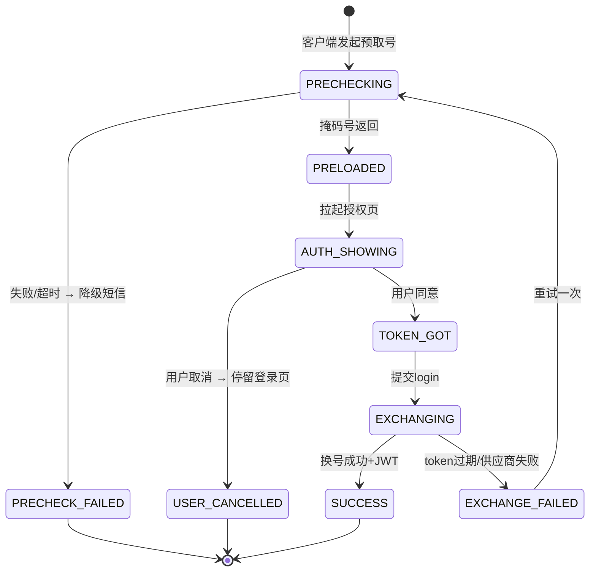

# 账号体系-手机号一键登录与号码认证-详细设计

> 本文档是 `docs2/账号体系-详细设计.md` 的专项补充，聚焦「运营商号码认证一键登录」通道的完整技术实现，并与 `服务端-统一短信验证码服务与多渠道通知发送网关-详细设计.md`（降级通道）、`账号体系-第三方登录与授权集成-详细设计.md`（平行通道）、`客户端-登录注册与入门引导页面架构设计-详细设计.md`（页面架构）衔接。账号体系主文档中已定义的 users / login_logs / user_devices 等表结构、JWT 签发逻辑本文不再重复。

## 1. 模块概述

### 1.1 背景与目标

原始设计（§7.1 功能细分清单）将「账号体系-注册登录」列为 P0。现有细化仅覆盖短信验证码与第三方登录两条通道。对移动端为主的 K12 产品，短信验证码登录存在三大问题：

1. 输入成本高（未成年人换设备频繁、家长代注册场景多），注册漏斗流失大；
2. 短信通道受运营商拦截与黑词影响，到达率不稳定；
3. 单条短信成本（约 ¥0.045）与取号成本接近，但转化更低。

运营商号码认证（本机号码一键登录）可在 App 内通过蜂窝网关直接取回本机手机号，用户点击授权即可完成注册/登录，是移动端 K12 产品提升注册转化的标准配置。目标：

1. 移动端（Android/iOS 原生容器）默认优先展示一键登录，命中即完成登录，目标登录页转化率提升 30% 以上；
2. 全场景自动降级到短信验证码通道，任何失败不阻断登录主流程；
3. 服务端统一承接多供应商（阿里云 PNVS / 腾讯云 / 聚合 SDK），支持供应商切换与成本对账；
4. 满足工信部与运营商对授权页、隐私披露、SDK 初始化时机的合规要求。

### 1.2 能力边界

| 能力 | 说明 | 是否本文范围 |
| --- | --- | --- |
| 预取号（取号缓存） | App 启动/进入登录页前提前向运营商网关申请掩码号码 | 是 |
| 一键登录授权页 | SDK 授权页 UI 定制与合规要求 | 是 |
| token 换取手机号 | 服务端携 token 调供应商 API 换取完整手机号并登录 | 是 |
| 本机号码校验 | 已有手机号与本机 SIM 一致性校验（换绑、家长核身） | 是 |
| 短信验证码登录 | 降级通道 | 否（见统一短信验证码服务文档） |
| 第三方登录 | 平行通道 | 否（见第三方登录文档） |
| Web/小程序登录 | 号码认证仅限原生 App，Web/小程序强制走短信/扫码 | 否，仅做端能力探测约定 |
| 密码登录 | 不提供（未成年人产品弱化密码） | 否 |

### 1.3 与其他模块的关系

```text
客户端登录页 ──┬─ 一键登录通道（本文）──→ 号码认证服务 → 运营商/供应商网关
              ├─ 短信验证码通道（降级）→ 短信验证码服务
              └─ 第三方登录通道（平行）→ OAuth 集成
账号体系核心（注册建档 / JWT 签发 / 设备绑定）← 三条通道共用
```

## 2. 技术选型

### 2.1 接入模式对比

| 模式 | 代表 | 优势 | 劣势 | 结论 |
| --- | --- | --- | --- | --- |
| 云厂商直连 | 阿里云号码认证服务（PNVS）、腾讯云号码认证 | 与既有云基础设施同账号、计费统一、API 规范 | 三网支持依赖厂商网关质量 | ✅ 主选 |
| 聚合 SDK | 极光 JVerification、Mob 秒验、闪验 | 客户端封装完善、授权页定制强、失败自动兜底 | 多一层供应商、成本略高 | 备选（二期） |
| 运营商直连 | 移动/联通/电信开放平台 | 成本最低 | 需三网分别接入、审核周期长、维护成本高 | 不采用 |

**MVP 决策：主通道阿里云 PNVS（一键登录 + 本机号码校验），服务端预留供应商适配层；客户端 SDK 初始化与 UI 定制按阿里云原生 SDK 接入，同时将回调接口收敛为内部统一协议，后续可替换为聚合 SDK 而不动业务层。**

### 2.2 关键计费与限制（设计输入）

| 项 | 约束 | 设计应对 |
| --- | --- | --- |
| 计费口径 | 换号成功（token 换手机号成功）才计费；预取号失败不计费 | 预取号可放心提前、重试 |
| 单价量级 | 一键登录约 ¥0.045/次（与短信同量级） | 登录成功后 7 天内静默续登，减少取号次数 |
| token 有效性 | 一次性，一般 2~5 分钟失效，不可复用 | 服务端换号接口幂等 + 一次性消费记录 |
| 网络要求 | 取号必须走蜂窝网络（WiFi+无SIM 不可用） | 预检接口下发通道决策 |
| 支持范围 | 境内三大运营商实体卡；多数虚拟号段/境外 SIM 不支持 | 失败即降级，不重试取号超过 1 次 |

## 3. 总体流程设计

### 3.1 登录通道决策总流程



### 3.2 预取号时机策略

| 时机 | 触发 | 适用 | 说明 |
| --- | --- | --- | --- |
| 冷启动后置预取 | 隐私协议同意完成 + SDK 初始化完成后延迟 2s | 已同意协议的回访用户 | 不阻塞首屏；命中缓存则登录页零等待 |
| 登录页曝光预取 | 登录页 `initState` | 未命中缓存 | 授权页等待超时 3s，超时降级 |
| 静默续登 | 启动时本地 refresh_token 失效且用户处于蜂窝网络 | 7 天内二次登录 | 后台静默完成，不拉授权页（仅本机号码校验） |

预取号缓存有效期 5 分钟（供应商默认），过期后登录页需重新取号；同一页面生命周期内最多重试 1 次。

### 3.3 降级矩阵（核心）

| 场景 | 检测点 | 行为 |
| --- | --- | --- |
| 无 SIM / WiFi-only（iPad） | 客户端 `SimInfo.hasSim && net.cellular` | 登录页不展示一键登录按钮，直接短信优先 |
| 境外 SIM / 虚拟运营商不支持 | 预取号返回特定错误码 | 降级短信，不重试 |
| 预取号超时（3s） | SDK 回调 | 登录页先渲染短信表单骨架，一键登录按钮转圈，成功后再置顶 |
| 授权页用户取消/返回 | SDK 回调 `cancel` | 停留登录页，短信通道保持可用 |
| token 过期/换号失败(服务端) | 换号 API 错误码 | 返回客户端明确错误，客户端重新预取号一次，再失败降级短信 |
| 双卡双待 | SDK 取数据卡号码 | 授权页明示掩码号码，用户取消可走短信 |
| 供应商服务故障 | 服务端熔断器打开 | `/auth/channels` 直接不再下发 one_tap（全端降级短信） |
| Web/小程序/鸿蒙纯血(H5容器) | 端能力探测 | 永不下发 one_tap |

### 3.4 本机号码校验流程（换绑/家长核身）

```text
已登录用户发起「换绑手机号」或家长侧「本机核身」
→ 客户端预取号（无需授权页，静默获取 token）
→ POST /auth/one-tap/verify {targetMobile?, token}
→ 服务端调供应商本机校验 API（传入 token + 待校验手机号）
→ 一致：通过，进入换绑确认；不一致：返回校验失败，走人工/短信兜底
```

## 4. 数据结构设计

### 4.1 号码认证流水表 phone_auth_flows

一条记录对应一次完整的一键登录/本机校验尝试，作为审计、计费对账与防重放依据。

```sql
CREATE TABLE `phone_auth_flows` (
  `id`             BIGINT UNSIGNED NOT NULL AUTO_INCREMENT,
  `flow_id`        VARCHAR(64)  NOT NULL COMMENT '客户端生成 UUID，串联全链路',
  `type`           TINYINT      NOT NULL COMMENT '1=一键登录 2=本机号码校验 3=静默续登',
  `vendor`         VARCHAR(32)  NOT NULL COMMENT 'aliyun / tencent / aggregator',
  `user_id`        BIGINT UNSIGNED NULL COMMENT '登录成功后回填',
  `device_id`      VARCHAR(64)  NOT NULL,
  `app_platform`   VARCHAR(16)  NOT NULL COMMENT 'android / ios',
  `precheck_status` TINYINT     NOT NULL DEFAULT 0 COMMENT '0未预取 1成功 2失败 3超时',
  `masked_mobile`  VARCHAR(20)  NULL COMMENT '预取号返回掩码号',
  `auth_status`    TINYINT      NOT NULL DEFAULT 0 COMMENT '0未拉授权 1已拉起 2已同意 3已取消',
  `exchange_status` TINYINT     NOT NULL DEFAULT 0 COMMENT '0未换号 1成功 2失败 3token过期',
  `vendor_err_code` VARCHAR(64) NULL,
  `mobile`         VARCHAR(20)  NULL COMMENT '换号成功后完整手机号(加密存储见4.4)',
  `session_user_id` BIGINT UNSIGNED NULL,
  `billed`         TINYINT      NOT NULL DEFAULT 0 COMMENT '是否已计费(换号成功)',
  `cost_cents`     INT          NOT NULL DEFAULT 0 COMMENT '单次成本(分)，对账用',
  `retry_count`    TINYINT      NOT NULL DEFAULT 0,
  `created_at`     DATETIME(3)  NOT NULL DEFAULT CURRENT_TIMESTAMP(3),
  `updated_at`     DATETIME(3)  NOT NULL DEFAULT CURRENT_TIMESTAMP(3) ON UPDATE CURRENT_TIMESTAMP(3),
  `expired_at`     DATETIME(3)  GENERATED ALWAYS AS (DATE_ADD(created_at, INTERVAL 10 MINUTE)) STORED,
  PRIMARY KEY (`id`),
  UNIQUE KEY `uk_flow_id` (`flow_id`),
  KEY `idx_device_created` (`device_id`, `created_at`),
  KEY `idx_user_created` (`user_id`, `created_at`),
  KEY `idx_billed_created` (`billed`, `created_at`)
) ENGINE=InnoDB DEFAULT CHARSET=utf8mb4 COMMENT='号码认证(一键登录)流水';
```

### 4.2 token 一次性消费表 phone_auth_token_consumed

token 不可复用，但为防客户端重放与网络重试造成重复换号，服务端以 token 摘要做消费登记（供应商侧亦有校验，此处为纵深防御）。

```sql
CREATE TABLE `phone_auth_token_consumed` (
  `id`          BIGINT UNSIGNED NOT NULL AUTO_INCREMENT,
  `token_hash`  CHAR(64)      NOT NULL COMMENT 'SHA256(vendor + token)',
  `flow_id`     VARCHAR(64)   NOT NULL,
  `consumed_at` DATETIME(3)   NOT NULL DEFAULT CURRENT_TIMESTAMP(3),
  PRIMARY KEY (`id`),
  UNIQUE KEY `uk_token_hash` (`token_hash`)
) ENGINE=InnoDB DEFAULT CHARSET=utf8mb4 COMMENT='一键登录token消费去重';
```

### 4.3 供应商计费对账表 vendor_billing_records

```sql
CREATE TABLE `vendor_billing_records` (
  `id`           BIGINT UNSIGNED NOT NULL AUTO_INCREMENT,
  `vendor`       VARCHAR(32) NOT NULL,
  `bill_date`    DATE        NOT NULL,
  `flow_id`      VARCHAR(64) NULL COMMENT '关联流水，可为空(账单侧无明细时)',
  `direction`    TINYINT     NOT NULL COMMENT '1=平台侧计量 2=账单侧',
  `amount_cents` INT         NOT NULL,
  `raw_ref`      VARCHAR(128) NULL COMMENT '供应商账单流水号',
  `created_at`   DATETIME(3) NOT NULL DEFAULT CURRENT_TIMESTAMP(3),
  PRIMARY KEY (`id`),
  KEY `idx_vendor_date` (`vendor`, `bill_date`),
  UNIQUE KEY `uk_raw_ref` (`raw_ref`)
) ENGINE=InnoDB DEFAULT CHARSET=utf8mb4 COMMENT='号码认证供应商计费对账';
```

### 4.4 字段加密与脱敏

- `phone_auth_flows.mobile`：AES-256-GCM 加密存储（密钥见 `服务端-密钥管理与敏感配置安全策略-详细设计.md`），KMS 数据密钥按年轮换，密钥版本随密文存储（`v1:base64(iv+cipher)` 格式）。
- 日志与埋点中仅允许输出 `masked_mobile`；完整手机号仅出现在服务端内部审计表。
- 与主文档 `users.phone` 的唯一约束联动：换号成功后按手机号 upsert 用户，冲突场景见 §7.3。

## 5. API 接口设计

所有接口挂载于账号服务 `/api/v1` 前缀，鉴权要求与主文档一致；`/auth/one-tap/login` 为免登录接口但需设备指纹头。

### 5.1 GET /api/v1/auth/channels —— 登录通道决策

请求：

```http
GET /api/v1/auth/channels?deviceId=dev_9f2c&platform=android&appVersion=1.4.0
X-Device-Fingerprint: fp_xxx
```

响应：

```json
{
  "code": 0,
  "data": {
    "orderedChannels": [
      { "channel": "one_tap", "reason": "cellular_ok" },
      { "channel": "sms" },
      { "channel": "third_party", "providers": ["wechat", "apple"] }
    ],
    "oneTap": {
      "enabled": true,
      "sdkConfig": { "vendor": "aliyun", "scene": "login" },
      "precheckTimeoutMs": 3000,
      "silentRefreshEnabled": true
    }
  }
}
```

决策逻辑（服务端）：

1. 版本灰度：`one_tap_min_version` 以下不下发；
2. 熔断：号码认证供应商换号成功率 5 分钟窗口 < 80% 时全端关闭；
3. 端能力：`platform` 非 android/ios 或 `isH5Container=true` 不下发；
4. 设备风控：命中设备黑名单（见设备指纹文档）不下发，静默走短信。

### 5.2 POST /api/v1/auth/one-tap/precheck —— 预取号结果上报

```json
// 请求
{ "flowId": "f_8a1b...", "deviceId": "dev_9f2c", "precheckStatus": "SUCCESS",
  "maskedMobile": "138****1234", "vendor": "aliyun", "costMs": 820 }
// 响应
{ "code": 0, "data": { "flowAccepted": true, "authPageExpireSeconds": 300 } }
```

作用：服务端落流水（供漏斗分析与计费口径核对），并返回授权页允许的过期窗口。预取号失败也上报（`precheckStatus=FAILED/TIMEOUT` + `vendorErrCode`），服务端据此调整熔断窗口统计。

### 5.3 POST /api/v1/auth/one-tap/login —— 一键登录（核心）

```json
// 请求
{ "flowId": "f_8a1b...", "token": "eyJ2ZW5kb3IiOiJhbGl5dW4iLC...", 
  "deviceId": "dev_9f2c", "platform": "android", "appVersion": "1.4.0" }
// 成功响应
{ "code": 0, "data": {
    "isNewUser": false,
    "accessToken": "eyJhbGciOi...", "refreshToken": "rt_...",
    "expiresIn": 7200,
    "user": { "userId": 10086, "nickname": "小硕", "stage": "JUNIOR_2" }
} }
// 失败响应（可重试场景）
{ "code": 40102, "message": "token已过期，请重新取号", "data": { "retryable": true, "action": "RE_PRECHECK" } }
```

服务端处理顺序：

1. `flowId` 存在性与状态校验（未消费、未过期）；
2. `token_hash` 插入消费表（唯一键冲突 → 返回幂等结果：若该 flow 已登录成功，直接重放该次 JWT 结果缓存）；
3. 供应商换号 API（超时 3s，超时不重试，直接返回 `RE_PRECHECK`）；
4. 手机号 upsert 用户 → 复用主文档「注册/登录 + JWT 签发」逻辑；
5. 回填流水（exchange_status、user_id、billed、cost_cents）；
6. 发送登录成功事件 `auth.login.succeeded{channel=ONE_TAP}`（进埋点与风控）。

### 5.4 POST /api/v1/auth/one-tap/verify —— 本机号码校验（需登录）

```json
// 请求：校验当前登录用户手机号（换绑前置核身）
{ "flowId": "f_7c2d...", "token": "eyJ...", "expectMobileHash": "sha256(13812341234+salt)" }
// 响应
{ "code": 0, "data": { "matched": true } }
```

`expectMobileHash` 由服务端下发校验挑战时提供 hash 盐，客户端不传明文；服务端调供应商「本机号码校验」API 比对。失败次数计入风控（同一账号 24h 最多 5 次）。

### 5.5 错误码（新增段，纳入统一业务异常码体系）

| 错误码 | HTTP | 说明 | 客户端动作 |
| --- | --- | --- | --- |
| 40101 | 401 | flowId 不存在或已过期 | 重新走 channels 流程 |
| 40102 | 401 | token 无效/已过期（供应商返回） | 重新预取号一次，再失败降级短信 |
| 40103 | 401 | token 重复消费且无幂等结果 | 引导重试登录 |
| 40104 | 403 | 设备命中风控黑名单 | 仅短信通道 |
| 40105 | 503 | 供应商熔断中 | 降级短信 |
| 40106 | 429 | 预取号/登录接口超出设备频控 | 提示稍后再试 |
| 40107 | 401 | 本机校验不匹配 | 走短信/人工兜底 |

## 6. 关键代码示例

### 6.1 客户端（Flutter）：一键登录服务封装

```dart
/// lib/auth/one_tap/one_tap_login_service.dart
/// 供应商 SDK 统一收敛为内部协议，替换供应商时仅改 Adapter。
abstract class OneTapVendorAdapter {
  Future<void> init();                         // 必须在隐私协议同意后调用
  Future<PrecheckResult> precheck({int timeoutMs});
  Future<AuthTokenResult> requestAuth({required String flowId}); // 拉起授权页
  Future<VerifyTokenResult> silentVerify();    // 本机号码校验(静默)
}

class OneTapLoginService {
  OneTapLoginService(this._adapter, this._api, this._device);

  PrecheckResult? _cached;            // 预取号缓存 5min
  DateTime _cachedAt = DateTime.fromMillisecondsSinceEpoch(0);

  /// 冷启动延迟预取：隐私同意后 2s 执行，失败静默
  Future<void> warmup() async {
    if (!_device.hasSim || !_device.hasCellular) return; // iPad WiFi-only 直接跳过
    try {
      _cached = await _adapter.precheck(timeoutMs: 5000);
      _cachedAt = DateTime.now();
      await _api.reportPrecheck(flowId: _cached!.flowId,
          precheckStatus: _cached!.status, maskedMobile: _cached!.maskedMobile);
    } catch (_) {/* 静默，登录页再试一次 */}
  }

  bool get oneTapReady =>
      _cached != null &&
      DateTime.now().difference(_cachedAt).inMinutes < 5;

  /// 登录主入口：返回成功 JWT 或抛出降级信号
  Future<LoginResult> login() async {
    if (!oneTapReady) {
      _cached = await _adapter.precheck(timeoutMs: 3000); // 登录页兜底预取
      _cachedAt = DateTime.now();
    }
    final pre = _cached;
    if (pre == null || !pre.ok) throw const ChannelFallback.sms(); // 降级信号

    final auth = await _adapter.requestAuth(flowId: pre.flowId);
    if (auth.cancelled) throw const ChannelFallback.sms(); // 用户取消→留在登录页短信态

    final resp = await _api.oneTapLogin(
        flowId: pre.flowId, token: auth.token, deviceId: _device.id);
    if (resp.code == 40102 && resp.retryable) {
      // token 过期：重新预取号一次，仍失败则降级
      _cached = await _adapter.precheck(timeoutMs: 3000);
      if (_cached?.ok ?? false) {
        final retry = await _adapter.requestAuth(flowId: _cached!.flowId);
        if (!retry.cancelled) {
          return _api.oneTapLogin(
              flowId: _cached!.flowId, token: retry.token, deviceId: _device.id)
              .unwrap();
        }
      }
      throw const ChannelFallback.sms();
    }
    return resp.unwrap();
  }
}
```

### 6.2 服务端（Java/Spring）：换号与幂等

```java
@Service
@RequiredArgsConstructor
public class OneTapAuthService {

    private final PhoneAuthFlowMapper flowMapper;
    private final TokenConsumedMapper consumedMapper;
    private final VendorPnvsClient pnvsClient;      // 阿里云PNVS适配
    private final AccountCoreService accountCore;   // 复用主文档注册/登录逻辑
    private final CircuitBreaker pnvsBreaker;       // Resilience4j

    @Transactional
    public LoginResult login(OneTapLoginReq req) {
        // 1. 流水校验
        PhoneAuthFlow flow = flowMapper.findByFlowId(req.getFlowId())
                .orElseThrow(() -> new BizException(40101, "flow不存在或已过期"));
        if (flow.getExchangeStatus() == ExchangeStatus.SUCCESS.ordinal()) {
            return loginResultCache.get(req.getFlowId());      // 幂等重放
        }

        // 2. token 一次性消费（唯一键防重放/防并发重试双花）
        String tokenHash = Sha256.of(flow.getVendor() + req.getToken());
        try {
            consumedMapper.insert(TokenConsumed.of(tokenHash, req.getFlowId()));
        } catch (DuplicateKeyException e) {
            throw new BizException(40103, "token重复消费");
        }

        // 3. 供应商换号（熔断包裹，超时3s不重试）
        MobileResult mobile;
        try {
            mobile = pnvsBreaker.executeSupplier(() ->
                    pnvsClient.getMobile(req.getToken(), Duration.ofSeconds(3)));
        } catch (CallNotPermittedException e) {
            throw new BizException(40105, "供应商熔断");
        } catch (VendorTimeoutException e) {
            flowMapper.markExchange(req.getFlowId(),
                    ExchangeStatus.FAILED, "VENDOR_TIMEOUT");
            throw new BizException(40102, "token已过期，请重新取号")
                    .retryable(RetryAction.RE_PRECHECK);
        }

        // 4. 复用账号体系核心：按手机号注册或登录 + JWT
        LoginResult result = accountCore.loginOrRegisterByMobile(
                mobile.getMobile(), LoginChannel.ONE_TAP, req.getDeviceId());

        // 5. 回填流水与计费口径
        flowMapper.markSuccess(req.getFlowId(), result.getUserId(),
                mobile.getBilledCostCents());
        eventPublisher.publish(AuthLoginSucceeded.of(
                result.getUserId(), LoginChannel.ONE_TAP, req.getFlowId()));
        loginResultCache.put(req.getFlowId(), result); // 幂等缓存10min
        return result;
    }
}
```

### 6.3 供应商适配层接口

```java
public interface VendorPnvsClient {
    MobileResult getMobile(String oneTapToken, Duration timeout);  // 一键登录换号
    boolean verifyLocalMobile(String token, String expectMobile);  // 本机号码校验
    VendorHealth health();                                          // 熔断统计来源
}
// 实现：AliyunPnvsClient（dypnsapi GetMobile / VerifyMobile）、
// 预留 TencentPnvsClient，经配置 `auth.one-tap.vendor` 切换。
```

## 7. 状态流转与边界场景

### 7.1 流水状态机



### 7.2 手机号冲突（多通道交汇）

| 场景 | 处理 |
| --- | --- |
| 一键登录手机号已被第三方账号绑定占用 | 复用主文档 §4.4 绑定手机号冲突策略：同 user → 直接登录；不同 user → 返回 `40901 MOBILE_BOUND_OTHER_ACCOUNT`，引导「手机号+验证码登录后合并」或客服 |
| 换绑手机号经本机校验后目标号已被占用 | 拒绝换绑，提示先解绑原账号 |
| 静默续登时手机号已注销（携号转网回收） | 换号失败降级为普通登录页 |

### 7.3 特殊设备与网络

- **iPad WiFi-only / 无蜂窝权限（iOS 网络权限被关）**：预检短路，登录页直接短信布局，不出现一键登录按钮位（避免空转圈）。
- **双卡**：SDK 默认取数据卡；授权页必须展示掩码号供用户确认（运营商合规要求，掩码号不可省略）。
- **蜂窝 + WiFi 并存**：SDK 自动蜂窝网关取号，业务层无需干预。
- **境外 SIM / 虚拟号段**：预取号失败即降级，不做二次重试。
- **Web / 小程序 / 鸿蒙 H5 容器**：`/auth/channels` 永不下发 one_tap（见 Web 端与小程序端架构适配设计）。

## 8. 安全与合规设计

1. **SDK 初始化时机**：运营商 SDK 初始化必须晚于隐私协议首次同意（合规红线）。客户端在 `PrivacyGate.consented` 事件后才调用 `adapter.init()`；CI 中以静态检查禁止在启动 `main()` 中直接引用 SDK。
2. **隐私披露**：隐私政策第三方 SDK 清单中披露号码认证 SDK 及其采集项（设备信息、SIM 状态、运营商网关交互），授权页文案含运营商协议勾选框（默认不勾选，符合工信部要求）。
3. **防重放**：token 服务端一次性消费（§4.2）+ flowId 10 分钟过期 + 同设备 10 分钟内 `/one-tap/login` 上限 5 次（频控中间件）。
4. **防计费滥用**：预取号同设备 24h 上限 30 次（超出后 `/auth/channels` 不再下发 one_tap），防止竞品刷量消耗取号费用；换号成功才计费，计费流水与供应商账单 T+1 对账（§4.3），差异 > 1% 告警。
5. **数据最小化**：完整手机号仅存 `users`（主文档加密策略）与 `phone_auth_flows.mobile`（加密），埋点只允许掩码号；`phone_auth_flows` 保留 180 天后归档（对接存储生命周期管理引擎）。
6. **未成年人关联**：一键登录建立的账号同样走主文档「家长绑定 + 实名/未成年人核验」链路，本通道不因「家长手机号登录」而跳过未成年判定（登录手机号≠使用人，需在首次引导中询问使用人身份）。

## 9. 性能与成本

| 指标 | 目标 | 手段 |
| --- | --- | --- |
| 授权页等待（命中预取） | < 300ms | 冷启动预热预取号 |
| 授权页等待（未命中） | < 3s 或明确降级 | 3s 超时直接渲染短信表单 |
| 服务端换号接口 P95 | < 800ms | 供应商连接池 + 熔断 |
| 一键登录渗透率（可用用户中占比） | > 60% | 通道决策 + 策略调优 |
| 单次成功登录认证成本 | ≤ ¥0.05 | 7 天静默续登减少取号；账单对账防超收 |

成本账：假设 DAU 10 万、日均登录人次 18 万、60% 走一键登录（其中 70% 命中静默续登不计费）→ 日均取号+换号计费次数 ≈ 18万 × 60% × 30% ≈ 3.24 万次 ≈ ¥1458/日，需纳入成本中心「单用户 AI/认证调用成本」看板（见成本管理文档）。

## 10. 监控与埋点

| 事件 | 关键属性 | 用途 |
| --- | --- | --- |
| `auth_channel_decision` | deviceId, channels, reason | 通道决策分布 |
| `one_tap_precheck_result` | status, vendorErrCode, costMs | 预取号成功率（分机型/运营商） |
| `one_tap_authpage_result` | cancelled/agreed | 授权页转化 |
| `auth.login.succeeded` | channel=ONE_TAP, isNewUser | 通道漏斗（复用账号体系埋点） |
| `one_tap_exchange_result` | status, vendorErrCode | 换号成功率（熔断输入） |

告警：换号成功率 5 分钟窗口 < 80% → 熔断 + 告警；计费对账日差异 > 1% → 财务告警；单设备 24h 取号 > 30 次 → 风控告警。

## 11. 测试用例（核心）

| 编号 | 场景 | 预期 |
| --- | --- | --- |
| OT-01 | 有 SIM + 蜂窝，预取号成功 | 登录页 < 300ms 展示掩码号一键登录 |
| OT-02 | WiFi-only iPad | 登录页不出现一键登录位 |
| OT-03 | 双卡，数据卡为副卡 | 授权页展示数据卡掩码号 |
| OT-04 | 授权页点取消 | 停留登录页，短信可用，无崩溃 |
| OT-05 | token 过期重试 | 自动重取号一次，二次失败降级短信 |
| OT-06 | 同 token 重放 login | 40103 或幂等重放缓存 JWT，不重复计费 |
| OT-07 | 供应商超时（mock 4s） | 服务端 3s 超时返回 40102，客户端降级 |
| OT-08 | 熔断打开时 channels | orderedChannels 无 one_tap |
| OT-09 | 隐私协议同意前 | SDK 未初始化（网络抓包无运营商网关请求） |
| OT-10 | 换绑场景本机校验不匹配 | matched=false，24h 第 6 次被限流 |
| OT-11 | 一键登录手机号已被其他账号绑定 | 40901 + 合并引导 |
| OT-12 | 计费对账 mock 差异 2% | 触发财务告警工单 |

## 12. 实施排期建议

| 阶段 | 内容 | 工作量估算 |
| --- | --- | --- |
| 1 | 服务端流水表/接口/供应商适配 + mock 联调 | 5 人日 |
| 2 | 客户端 SDK 接入、授权页 UI 合规定制、降级链路 | 5 人日（双端各 2.5） |
| 3 | 静默续登 + 本机号码校验（换绑） | 3 人日 |
| 4 | 埋点/熔断/对账任务 + 测试用例 | 3 人日 |

上线策略：先 Android 10% 灰度观察换号成功率与授权页转化，再开 iOS（App Store 审核注意：登录页必须保留非一键登录入口，避免 4.3 被拒）。

## 文档版本

| 版本 | 日期 | 说明 |
| --- | --- | --- |
| v1.0 | 2026-08-14 | 首版：预取号/授权页/换号/本机校验全链路、降级矩阵、计费对账与合规设计 |
