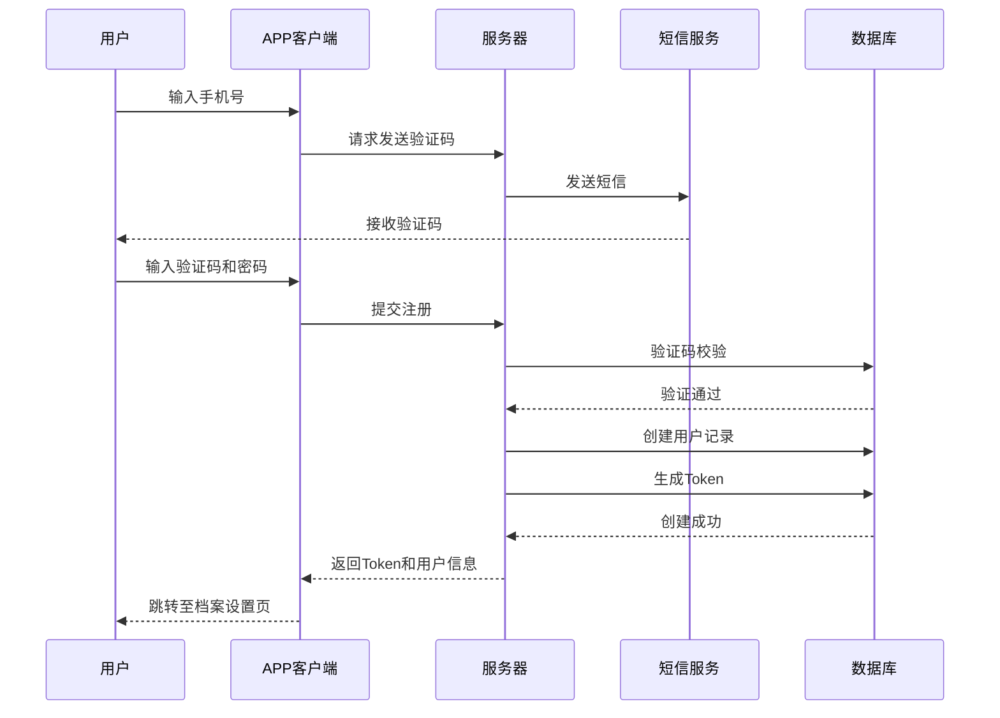
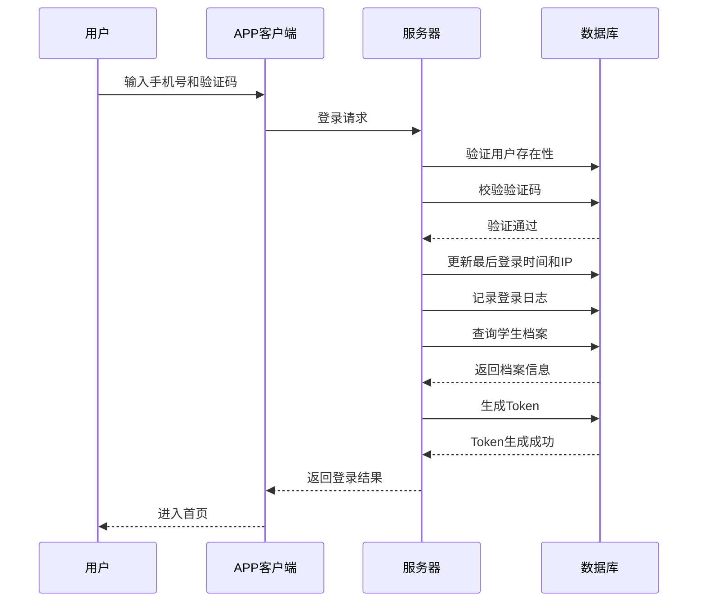
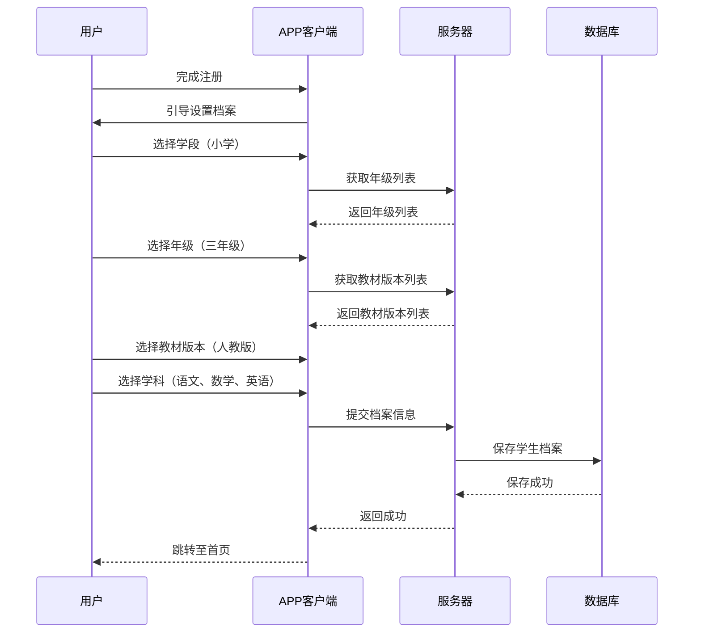
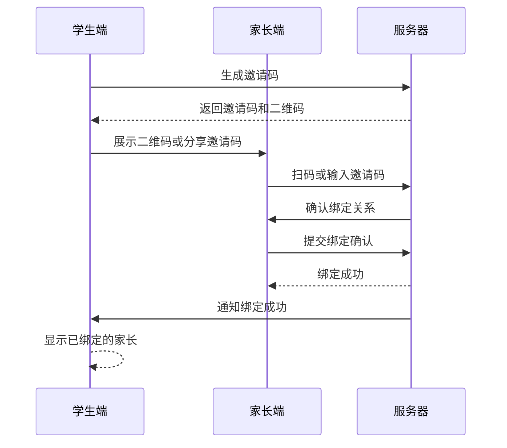
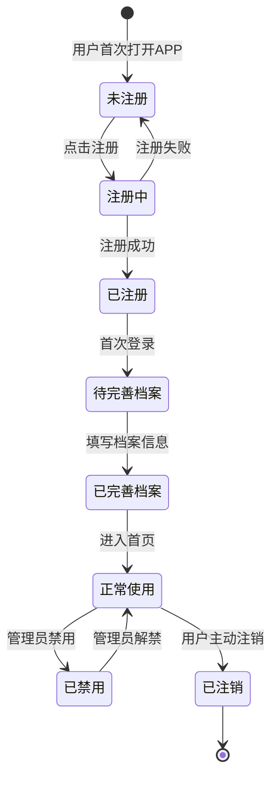
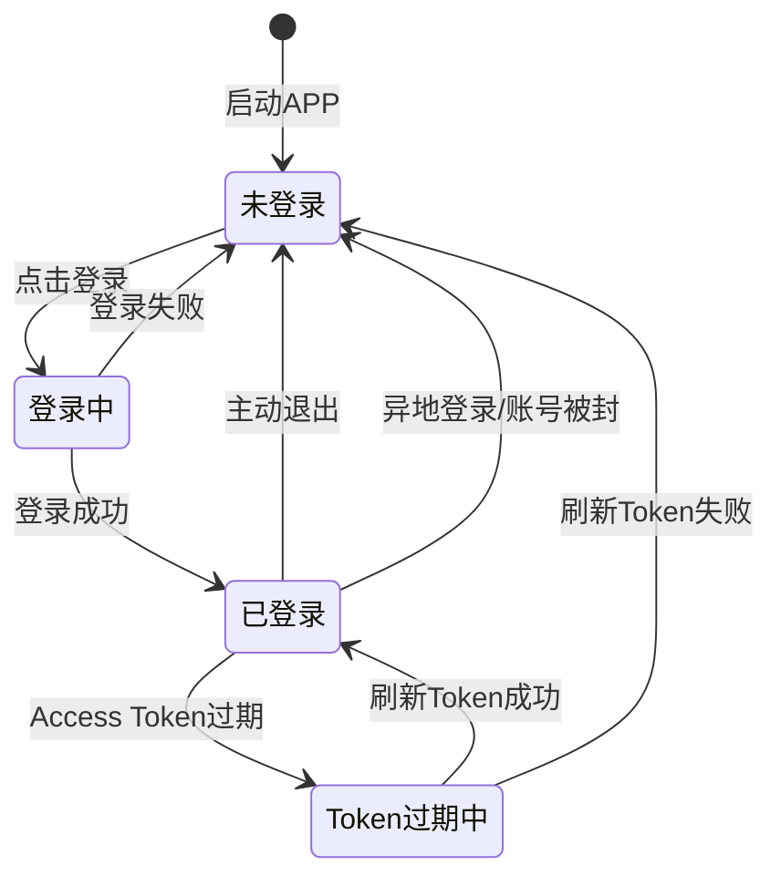
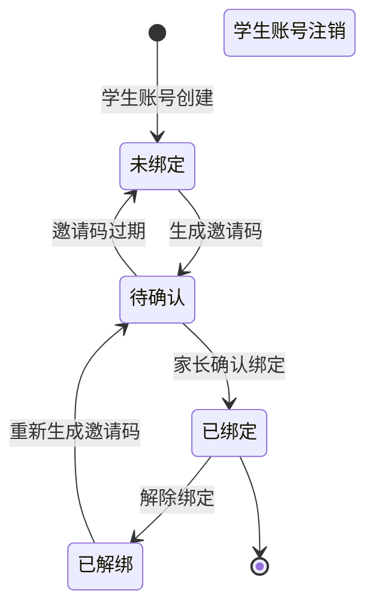

# 账号体系-详细设计

## 1. 模块概述

### 1.1 功能目标
构建安全、可靠的账号体系，支持学生和家长用户的注册、登录、身份验证，以及学生档案中年级、学段、教材版本等基础信息的管理。这是整个系统的基石，为后续所有学习功能提供用户身份和上下文支撑。

### 1.2 适用人群
- **学生用户**：主要使用账号进行学习活动
- **家长用户**：绑定学生账号，进行学情查看和管控
- **管理员**：通过后台管理系统进行用户管理

### 1.3 核心价值
- 确保用户身份的真实性和安全性
- 为个性化学习提供基础数据支撑（年级、学科、教材版本等）
- 支持家长管控和学生保护机制
- 为会员订阅和权益管理提供账号基础

## 2. 功能细分清单

### 2.1 注册登录功能
| 功能点 | 说明 | 优先级 |
|--------|------|--------|
| 手机号注册 | 手机号 + 验证码注册 | P0 |
| 第三方登录 | 微信、QQ、支付宝等第三方账号登录 | P1 |
| 密码登录 | 已注册用户密码登录 | P0 |
| 忘记密码 | 通过手机验证码重置密码 | P1 |
| 登录态保持 | Token 认证和刷新机制 | P0 |
| 退出登录 | 安全退出并清除本地缓存 | P0 |
| 账号注销 | 用户主动注销账号及数据清理 | P2 |

### 2.2 学生档案管理
| 功能点 | 说明 | 优先级 |
|--------|------|--------|
| 学段选择 | 幼儿、小学、初中、高中 | P0 |
| 年级选择 | 对应学段的具体年级 | P0 |
| 教材版本选择 | 人教版、苏教版、北师大版等 | P0 |
| 学科设置 | 选择学习的学科（语数英等） | P0 |
| 学习目标设定 | 中考、高考、日常学习等 | P1 |
| 档案修改 | 支持后续修改年级和教材版本 | P1 |
| 年级升迁 | 学段过渡时的年级自动升级引导 | P2 |

### 2.3 家长绑定功能
| 功能点 | 说明 | 优先级 |
|--------|------|--------|
| 学生邀请家长 | 学生端生成邀请码邀请家长 | P1 |
| 家长扫码绑定 | 家长扫码绑定学生账号 | P1 |
| 手机号绑定 | 通过手机号直接绑定 | P1 |
| 绑定关系管理 | 查看和管理已绑定的家长 | P1 |
| 解绑功能 | 支持解除家长绑定关系 | P1 |

### 2.4 账号安全功能
| 功能点 | 说明 | 优先级 |
|--------|------|--------|
| 手机号验证 | 验证手机号真实性 | P0 |
| 实名认证 | 未成年人身份核验 | P1 |
| 设备管理 | 多设备登录管理 | P1 |
| 登录日志 | 记录登录行为和设备信息 | P1 |
| 异常登录检测 | 检测异地登录等异常行为 | P2 |
| 账号锁定 | 防暴力破解机制 | P1 |

## 3. 数据结构设计

### 3.1 用户表（users）

```sql
CREATE TABLE users (
  id BIGINT PRIMARY KEY AUTO_INCREMENT,
  phone VARCHAR(20) UNIQUE NOT NULL COMMENT '手机号（唯一标识）',
  password_hash VARCHAR(255) COMMENT '密码哈希值，可为空（第三方登录）',
  nickname VARCHAR(50) COMMENT '昵称',
  avatar_url VARCHAR(500) COMMENT '头像URL',
  status TINYINT DEFAULT 1 COMMENT '状态：1=正常，0=禁用，2=已注销',
  user_type TINYINT DEFAULT 1 COMMENT '用户类型：1=学生，2=家长',
  register_source VARCHAR(50) COMMENT '注册来源：app、web、wechat等',
  last_login_at DATETIME COMMENT '最后登录时间',
  last_login_ip VARCHAR(50) COMMENT '最后登录IP',
  created_at DATETIME DEFAULT CURRENT_TIMESTAMP,
  updated_at DATETIME DEFAULT CURRENT_TIMESTAMP ON UPDATE CURRENT_TIMESTAMP,
  deleted_at DATETIME COMMENT '软删除时间',

  INDEX idx_phone (phone),
  INDEX idx_status (status),
  INDEX idx_user_type (user_type),
  INDEX idx_created_at (created_at)
) ENGINE=InnoDB DEFAULT CHARSET=utf8mb4 COMMENT='用户基础信息表';
```

### 3.2 学生档案表（student_profiles）

```sql
CREATE TABLE student_profiles (
  id BIGINT PRIMARY KEY AUTO_INCREMENT,
  user_id BIGINT NOT NULL COMMENT '关联用户ID',
  stage VARCHAR(20) NOT NULL COMMENT '学段：kindergarten、primary、junior、senior',
  grade VARCHAR(20) NOT NULL COMMENT '年级：grade_1 ~ grade_12',
  textbook_version_id BIGINT COMMENT '教材版本ID',
  selected_subjects JSON COMMENT '选择的学科列表：["chinese", "math", "english"]',
  learning_goal VARCHAR(50) COMMENT '学习目标：daily、zhongkao、gaokao',
  school_name VARCHAR(100) COMMENT '学校名称',
  region_code VARCHAR(20) COMMENT '地区编码',
  is_verified TINYINT DEFAULT 0 COMMENT '是否实名认证：0=未认证，1=已认证',
  real_name VARCHAR(50) COMMENT '真实姓名',
  id_card VARCHAR(20) COMMENT '身份证号',
  created_at DATETIME DEFAULT CURRENT_TIMESTAMP,
  updated_at DATETIME DEFAULT CURRENT_TIMESTAMP ON UPDATE CURRENT_TIMESTAMP,

  UNIQUE KEY uk_user_id (user_id),
  INDEX idx_stage_grade (stage, grade),
  INDEX idx_textbook_version (textbook_version_id),
  FOREIGN KEY (user_id) REFERENCES users(id) ON DELETE CASCADE
) ENGINE=InnoDB DEFAULT CHARSET=utf8mb4 COMMENT='学生档案表';
```

### 3.3 教材版本表（textbook_versions）

```sql
CREATE TABLE textbook_versions (
  id BIGINT PRIMARY KEY AUTO_INCREMENT,
  publisher VARCHAR(50) NOT NULL COMMENT '出版社：人教版、苏教版等',
  edition VARCHAR(50) NOT NULL COMMENT '版次',
  stage VARCHAR(20) NOT NULL COMMENT '适用学段',
  grade VARCHAR(20) NOT NULL COMMENT '适用年级',
  subject VARCHAR(20) NOT NULL COMMENT '适用学科',
  is_active TINYINT DEFAULT 1 COMMENT '是否启用',
  sort_order INT DEFAULT 0 COMMENT '排序',
  created_at DATETIME DEFAULT CURRENT_TIMESTAMP,

  INDEX idx_publisher (publisher),
  INDEX idx_stage_grade_subject (stage, grade, subject),
  INDEX idx_is_active (is_active)
) ENGINE=InnoDB DEFAULT CHARSET=utf8mb4 COMMENT='教材版本表';
```

### 3.4 家长绑定关系表（parent_bindings）

```sql
CREATE TABLE parent_bindings (
  id BIGINT PRIMARY KEY AUTO_INCREMENT,
  student_user_id BIGINT NOT NULL COMMENT '学生用户ID',
  parent_user_id BIGINT NOT NULL COMMENT '家长用户ID',
  relationship VARCHAR(20) COMMENT '关系：father、mother、guardian',
  binding_code VARCHAR(20) UNIQUE COMMENT '绑定码',
  binding_status TINYINT DEFAULT 1 COMMENT '绑定状态：1=待确认，2=已绑定，3=已解绑',
  permissions JSON COMMENT '家长权限配置',
  created_at DATETIME DEFAULT CURRENT_TIMESTAMP,
  updated_at DATETIME DEFAULT CURRENT_TIMESTAMP ON UPDATE CURRENT_TIMESTAMP,

  UNIQUE KEY uk_student_parent (student_user_id, parent_user_id),
  INDEX idx_binding_code (binding_code),
  INDEX idx_binding_status (binding_status),
  FOREIGN KEY (student_user_id) REFERENCES users(id) ON DELETE CASCADE,
  FOREIGN KEY (parent_user_id) REFERENCES users(id) ON DELETE CASCADE
) ENGINE=InnoDB DEFAULT CHARSET=utf8mb4 COMMENT='家长绑定关系表';
```

### 3.5 第三方登录表（social_accounts）

```sql
CREATE TABLE social_accounts (
  id BIGINT PRIMARY KEY AUTO_INCREMENT,
  user_id BIGINT NOT NULL COMMENT '关联用户ID',
  provider VARCHAR(20) NOT NULL COMMENT '第三方平台：wechat、qq、alipay',
  openid VARCHAR(100) NOT NULL COMMENT '第三方平台唯一标识',
  unionid VARCHAR(100) COMMENT '第三方平台统一标识（微信）',
  access_token TEXT COMMENT '访问令牌',
  refresh_token TEXT COMMENT '刷新令牌',
  expires_at DATETIME COMMENT '令牌过期时间',
  created_at DATETIME DEFAULT CURRENT_TIMESTAMP,
  updated_at DATETIME DEFAULT CURRENT_TIMESTAMP ON UPDATE CURRENT_TIMESTAMP,

  UNIQUE KEY uk_provider_openid (provider, openid),
  INDEX idx_user_id (user_id),
  FOREIGN KEY (user_id) REFERENCES users(id) ON DELETE CASCADE
) ENGINE=InnoDB DEFAULT CHARSET=utf8mb4 COMMENT='第三方登录表';
```

### 3.6 验证码表（verification_codes）

```sql
CREATE TABLE verification_codes (
  id BIGINT PRIMARY KEY AUTO_INCREMENT,
  phone VARCHAR(20) NOT NULL COMMENT '手机号',
  code VARCHAR(10) NOT NULL COMMENT '验证码',
  type VARCHAR(20) NOT NULL COMMENT '类型：register、login、reset_password',
  is_used TINYINT DEFAULT 0 COMMENT '是否已使用：0=未使用，1=已使用',
  expired_at DATETIME NOT NULL COMMENT '过期时间',
  created_at DATETIME DEFAULT CURRENT_TIMESTAMP,

  INDEX idx_phone_type (phone, type),
  INDEX idx_expired_at (expired_at)
) ENGINE=InnoDB DEFAULT CHARSET=utf8mb4 COMMENT='验证码表';
```

### 3.7 登录日志表（login_logs）

```sql
CREATE TABLE login_logs (
  id BIGINT PRIMARY KEY AUTO_INCREMENT,
  user_id BIGINT NOT NULL COMMENT '用户ID',
  login_type VARCHAR(20) NOT NULL COMMENT '登录方式：password、sms、social',
  device_id VARCHAR(100) COMMENT '设备ID',
  device_type VARCHAR(20) COMMENT '设备类型：ios、android、web',
  device_name VARCHAR(100) COMMENT '设备名称',
  ip VARCHAR(50) COMMENT '登录IP',
  location VARCHAR(100) COMMENT '登录地点',
  status TINYINT COMMENT '登录状态：1=成功，0=失败',
  failure_reason VARCHAR(200) COMMENT '失败原因',
  created_at DATETIME DEFAULT CURRENT_TIMESTAMP,

  INDEX idx_user_id (user_id),
  INDEX idx_created_at (created_at),
  INDEX idx_ip (ip)
) ENGINE=InnoDB DEFAULT CHARSET=utf8mb4 COMMENT='登录日志表';
```

### 3.8 设备管理表（user_devices）

```sql
CREATE TABLE user_devices (
  id BIGINT PRIMARY KEY AUTO_INCREMENT,
  user_id BIGINT NOT NULL COMMENT '用户ID',
  device_id VARCHAR(100) NOT NULL COMMENT '设备唯一标识',
  device_type VARCHAR(20) NOT NULL COMMENT '设备类型：ios、android、web',
  device_name VARCHAR(100) COMMENT '设备名称',
  device_info JSON COMMENT '设备详细信息',
  is_active TINYINT DEFAULT 1 COMMENT '是否活跃：1=活跃，0=已退出',
  last_active_at DATETIME COMMENT '最后活跃时间',
  created_at DATETIME DEFAULT CURRENT_TIMESTAMP,
  updated_at DATETIME DEFAULT CURRENT_TIMESTAMP ON UPDATE CURRENT_TIMESTAMP,

  UNIQUE KEY uk_user_device (user_id, device_id),
  INDEX idx_user_id (user_id),
  INDEX idx_is_active (is_active)
) ENGINE=InnoDB DEFAULT CHARSET=utf8mb4 COMMENT='用户设备管理表';
```

## 4. API 接口设计

### 4.1 发送验证码

```http
POST /api/v1/auth/send-code
Content-Type: application/json

{
  "phone": "13800138000",
  "type": "register"
}
```

**响应：**
```json
{
  "code": 0,
  "message": "验证码已发送",
  "data": {
    "expires_in": 300,
    "cooldown": 60
  }
}
```

### 4.2 手机号注册

```http
POST /api/v1/auth/register
Content-Type: application/json

{
  "phone": "13800138000",
  "code": "123456",
  "password": "password123",
  "nickname": "小明"
}
```

**响应：**
```json
{
  "code": 0,
  "message": "注册成功",
  "data": {
    "user_id": 123456,
    "phone": "13800138000",
    "nickname": "小明",
    "token": "eyJhbGciOiJIUzI1NiIsInR5cCI6IkpXVCJ9...",
    "refresh_token": "eyJhbGciOiJIUzI1NiIsInR5cCI6IkpXVCJ9...",
    "is_new_user": true,
    "need_profile_setup": true
  }
}
```

### 4.3 手机号登录

```http
POST /api/v1/auth/login
Content-Type: application/json

{
  "phone": "13800138000",
  "code": "123456"
}
```

或密码登录：
```json
{
  "phone": "13800138000",
  "password": "password123"
}
```

**响应：**
```json
{
  "code": 0,
  "message": "登录成功",
  "data": {
    "user_id": 123456,
    "phone": "13800138000",
    "nickname": "小明",
    "avatar_url": "https://cdn.example.com/avatar/123456.jpg",
    "user_type": 1,
    "token": "eyJhbGciOiJIUzI1NiIsInR5cCI6IkpXVCJ9...",
    "refresh_token": "eyJhbGciOiJIUzI1NiIsInR5cCI6IkpXVCJ9...",
    "has_profile": true,
    "profile": {
      "stage": "primary",
      "grade": "grade_3",
      "textbook_version": "人教版"
    }
  }
}
```

### 4.4 第三方登录

```http
POST /api/v1/auth/social-login
Content-Type: application/json

{
  "provider": "wechat",
  "code": "wx_auth_code",
  "state": "random_state"
}
```

**响应：**
```json
{
  "code": 0,
  "message": "登录成功",
  "data": {
    "user_id": 123456,
    "nickname": "小明",
    "avatar_url": "https://third-party.example.com/avatar/xxx.jpg",
    "token": "eyJhbGciOiJIUzI1NiIsInR5cCI6IkpXVCJ9...",
    "refresh_token": "eyJhbGciOiJIUzI1NiIsInR5cCI6IkpXVCJ9...",
    "is_bind_phone": false
  }
}
```

### 4.5 绑定手机号

```http
POST /api/v1/auth/bind-phone
Content-Type: application/json
Authorization: Bearer {token}

{
  "phone": "13800138000",
  "code": "123456"
}
```

**响应：**
```json
{
  "code": 0,
  "message": "绑定成功"
}
```

### 4.6 刷新Token

```http
POST /api/v1/auth/refresh-token
Content-Type: application/json

{
  "refresh_token": "eyJhbGciOiJIUzI1NiIsInR5cCI6IkpXVCJ9..."
}
```

**响应：**
```json
{
  "code": 0,
  "message": "刷新成功",
  "data": {
    "token": "eyJhbGciOiJIUzI1NiIsInR5cCI6IkpXVCJ9...",
    "refresh_token": "eyJhbGciOiJIUzI1NiIsInR5cCI6IkpXVCJ9..."
  }
}
```

### 4.7 退出登录

```http
POST /api/v1/auth/logout
Authorization: Bearer {token}
```

**响应：**
```json
{
  "code": 0,
  "message": "退出成功"
}
```

### 4.8 获取学生档案

```http
GET /api/v1/student/profile
Authorization: Bearer {token}
```

**响应：**
```json
{
  "code": 0,
  "message": "success",
  "data": {
    "id": 789,
    "user_id": 123456,
    "stage": "primary",
    "stage_name": "小学",
    "grade": "grade_3",
    "grade_name": "三年级",
    "textbook_version_id": 1,
    "textbook_version": {
      "id": 1,
      "publisher": "人教版",
      "edition": "2024版"
    },
    "selected_subjects": ["chinese", "math", "english"],
    "learning_goal": "daily",
    "school_name": "实验小学",
    "region_code": "310000",
    "is_verified": 0
  }
}
```

### 4.9 更新学生档案

```http
PUT /api/v1/student/profile
Authorization: Bearer {token}
Content-Type: application/json

{
  "stage": "primary",
  "grade": "grade_4",
  "textbook_version_id": 2,
  "selected_subjects": ["chinese", "math", "english", "science"],
  "learning_goal": "zhongkao",
  "school_name": "第二小学"
}
```

**响应：**
```json
{
  "code": 0,
  "message": "更新成功",
  "data": {
    "id": 789,
    "stage": "primary",
    "grade": "grade_4",
    "textbook_version_id": 2,
    "selected_subjects": ["chinese", "math", "english", "science"],
    "learning_goal": "zhongkao",
    "school_name": "第二小学"
  }
}
```

### 4.10 获取教材版本列表

```http
GET /api/v1/textbook/versions?stage=primary&grade=grade_4&subject=math
```

**响应：**
```json
{
  "code": 0,
  "message": "success",
  "data": {
    "versions": [
      {
        "id": 1,
        "publisher": "人教版",
        "edition": "2024版",
        "stage": "primary",
        "grade": "grade_4",
        "subject": "math"
      },
      {
        "id": 2,
        "publisher": "苏教版",
        "edition": "2024版",
        "stage": "primary",
        "grade": "grade_4",
        "subject": "math"
      }
    ]
  }
}
```

### 4.11 生成家长邀请码

```http
POST /api/v1/parent/generate-invite
Authorization: Bearer {token}
```

**响应：**
```json
{
  "code": 0,
  "message": "生成成功",
  "data": {
    "invite_code": "ABC123",
    "expires_at": "2024-07-08T10:09:00Z",
    "qrcode_url": "https://cdn.example.com/qrcode/ABC123.png"
  }
}
```

### 4.12 家长扫码绑定

```http
POST /api/v1/parent/bind
Authorization: Bearer {token}
Content-Type: application/json

{
  "invite_code": "ABC123",
  "relationship": "mother"
}
```

**响应：**
```json
{
  "code": 0,
  "message": "绑定成功",
  "data": {
    "student_user_id": 123456,
    "student_nickname": "小明",
    "binding_id": 999
  }
}
```

### 4.13 获取已绑定的家长列表

```http
GET /api/v1/parent/bindings
Authorization: Bearer {token}
```

**响应：**
```json
{
  "code": 0,
  "message": "success",
  "data": {
    "bindings": [
      {
        "id": 999,
        "parent_user_id": 789012,
        "parent_nickname": "妈妈",
        "parent_avatar_url": "https://cdn.example.com/avatar/789012.jpg",
        "relationship": "mother",
        "binding_status": 2,
        "permissions": {
          "view_report": true,
          "set_time_limit": true,
          "manage_membership": false
        },
        "created_at": "2024-07-01T10:00:00Z"
      }
    ]
  }
}
```

### 4.14 解绑家长

```http
DELETE /api/v1/parent/bindings/{binding_id}
Authorization: Bearer {token}
```

**响应：**
```json
{
  "code": 0,
  "message": "解绑成功"
}
```

### 4.15 获取登录设备列表

```http
GET /api/v1/user/devices
Authorization: Bearer {token}
```

**响应：**
```json
{
  "code": 0,
  "message": "success",
  "data": {
    "devices": [
      {
        "id": 1,
        "device_id": "device_abc123",
        "device_type": "ios",
        "device_name": "iPhone 15 Pro",
        "is_active": true,
        "is_current": true,
        "last_active_at": "2024-07-01T10:09:00Z",
        "location": "上海"
      },
      {
        "id": 2,
        "device_id": "device_def456",
        "device_type": "android",
        "device_name": "Xiaomi 14",
        "is_active": true,
        "is_current": false,
        "last_active_at": "2024-06-30T15:30:00Z",
        "location": "北京"
      }
    ]
  }
}
```

### 4.16 退出指定设备

```http
POST /api/v1/user/devices/{device_id}/logout
Authorization: Bearer {token}
```

**响应：**
```json
{
  "code": 0,
  "message": "退出成功"
}
```

### 4.17 获取当前用户信息

```http
GET /api/v1/user/info
Authorization: Bearer {token}
```

**响应：**
```json
{
  "code": 0,
  "message": "success",
  "data": {
    "user_id": 123456,
    "phone": "138****8000",
    "nickname": "小明",
    "avatar_url": "https://cdn.example.com/avatar/123456.jpg",
    "user_type": 1,
    "user_type_name": "学生",
    "status": 1,
    "has_profile": true,
    "created_at": "2024-01-01T10:00:00Z"
  }
}
```

## 5. 核心业务流程

### 5.1 注册流程



**关键实现要点：**

1. **验证码生成与校验：**
   - 验证码长度：6位数字
   - 有效期：5分钟
   - 同一手机号发送间隔：60秒
   - 每日发送上限：10次

2. **密码安全：**
   - 使用 bcrypt 哈希算法
   - 密码强度校验：至少8位，包含字母和数字
   - 密码修改时需验证旧密码或通过手机验证码

3. **Token生成：**
   - 使用 JWT（JSON Web Token）
   - Access Token 有效期：2小时
   - Refresh Token 有效期：30天
   - Token 包含用户ID、用户类型、过期时间等信息

### 5.2 登录流程



**关键实现要点：**

1. **登录安全：**
   - 同一IP失败5次后锁定30分钟
   - 异地登录时发送安全提醒
   - 记录每次登录的设备信息

2. **登录态管理：**
   - Token 存储在本地（使用 Flutter 的 secure_storage）
   - 每次请求携带 Token 在 Header 中
   - Token 过期前5分钟自动刷新
   - 401错误时自动尝试刷新Token

### 5.3 学生档案设置流程



**关键实现要点：**

1. **学段年级映射：**
   - Kindergarten: 幼儿园小班/中班/大班
   - Primary: 小学一年级至六年级
   - Junior: 初中一年级至三年级
   - Senior: 高中一年级至三年级

2. **教材版本管理：**
   - 支持按学段、年级、学科筛选
   - 教材版本内容可在后台动态更新
   - 首次设置后允许修改，但需提示可能影响学习内容

3. **学科选择：**
   - 小学：语文、数学、英语（可选）
   - 初中：语数英、物理、化学、生物、历史、地理、政治
   - 高中：语数英、物理、化学、生物、历史、地理、政治

### 5.4 家长绑定流程



**关键实现要点：**

1. **邀请码生成：**
   - 6位字母数字组合
   - 有效期：24小时
   - 一次只能生成一个有效邀请码

2. **绑定权限：**
   - 查看学情报告
   - 设置使用时长
   - 管理会员订阅
   - 可在绑定时或后续修改权限

3. **多家长支持：**
   - 一个学生可绑定多个家长
   - 每个家长独立管理自己的权限
   - 支持解绑操作

## 6. 状态流转

### 6.1 用户状态流转



### 6.2 登录状态流转



### 6.3 家长绑定状态流转



## 7. 错误处理

### 7.1 通用错误码

| 错误码 | 说明 | HTTP状态码 |
|--------|------|------------|
| 0 | 成功 | 200 |
| 1001 | 参数错误 | 400 |
| 1002 | 验证码错误 | 400 |
| 1003 | 验证码已过期 | 400 |
| 1004 | 验证码发送过于频繁 | 429 |
| 2001 | 用户不存在 | 404 |
| 2002 | 用户已存在 | 409 |
| 2003 | 密码错误 | 401 |
| 2004 | 账号已禁用 | 403 |
| 2005 | Token无效或已过期 | 401 |
| 3001 | 学生档案不存在 | 404 |
| 3002 | 教材版本不存在 | 404 |
| 4001 | 邀请码无效 | 400 |
| 4002 | 邀请码已过期 | 400 |
| 4003 | 绑定关系已存在 | 409 |
| 5001 | 服务器内部错误 | 500 |
| 5002 | 第三方服务异常 | 502 |

### 7.2 错误响应格式

```json
{
  "code": 2005,
  "message": "Token无效或已过期，请重新登录",
  "data": null,
  "request_id": "req_abc123",
  "timestamp": 1719821340
}
```

### 7.3 典型错误处理场景

#### 场景1：验证码发送过于频繁

```http
POST /api/v1/auth/send-code
Content-Type: application/json

{
  "phone": "13800138000",
  "type": "register"
}
```

**响应（429）：**
```json
{
  "code": 1004,
  "message": "验证码发送过于频繁，请60秒后再试",
  "data": {
    "cooldown": 45
  }
}
```

**客户端处理：**
1. 显示倒计时提示
2. 禁用发送验证码按钮
3. 倒计时结束后重新启用

#### 场景2：验证码错误

```http
POST /api/v1/auth/login
Content-Type: application/json

{
  "phone": "13800138000",
  "code": "999999"
}
```

**响应（400）：**
```json
{
  "code": 1002,
  "message": "验证码错误，请重新输入",
  "data": null
}
```

**客户端处理：**
1. 清空验证码输入框
2. 显示错误提示
3. 允许用户重新输入或重新获取验证码
4. 错误次数累加，超过限制时锁定

#### 场景3：Token过期

```http
GET /api/v1/user/info
Authorization: Bearer {expired_token}
```

**响应（401）：**
```json
{
  "code": 2005,
  "message": "Token已过期",
  "data": {
    "need_refresh": true
  }
}
```

**客户端处理：**
1. 检测到401错误
2. 使用 Refresh Token 自动刷新
3. 刷新成功后重试原请求
4. 刷新失败则跳转至登录页

#### 场景4：邀请码无效

```http
POST /api/v1/parent/bind
Authorization: Bearer {token}
Content-Type: application/json

{
  "invite_code": "INVALID",
  "relationship": "mother"
}
```

**响应（400）：**
```json
{
  "code": 4001,
  "message": "邀请码无效或已过期",
  "data": null
}
```

**客户端处理：**
1. 显示错误提示
2. 清空输入框
3. 引导家长重新扫描或输入

## 8. 安全机制

### 8.1 密码安全

1. **密码强度要求：**
   - 最小长度：8位
   - 必须包含：字母和数字
   - 推荐包含：特殊字符

2. **密码存储：**
   - 使用 bcrypt 算法哈希
   - 盐值自动生成并嵌入哈希值
   - 不可逆加密

3. **密码修改：**
   - 修改时需验证旧密码或通过手机验证码
   - 新密码不能与最近3次使用的密码相同

### 8.2 验证码安全

1. **验证码生成：**
   - 使用加密安全的随机数生成器
   - 长度6位数字
   - 避免易混淆数字（如 0 和 O）

2. **验证码存储：**
   - 哈希后存储，不存储明文
   - 一次性使用，使用后立即标记失效

3. **验证码发送限制：**
   - 同一手机号：60秒冷却
   - 同一IP：每小时最多20次
   - 同一手机号：每天最多10次

### 8.3 Token安全

1. **Token生成：**
   - 使用 HS256 或 RS256 算法
   - 密钥定期轮换
   - 包含用户ID、过期时间、签发时间

2. **Token存储：**
   - Access Token：内存或安全存储
   - Refresh Token：加密存储在本地
   - 不暴露在URL或日志中

3. **Token刷新：**
   - Access Token 过期前5分钟自动刷新
   - Refresh Token 可使用多次，但有过期时间
   - 检测到异常使用时立即失效

### 8.4 登录安全

1. **防暴力破解：**
   - 同一IP失败5次锁定30分钟
   - 同一手机号失败5次锁定1小时
   - 支持图形验证码辅助

2. **异地登录检测：**
   - 记录常用登录地点
   - 异地登录时发送安全提醒
   - 支持一键踢出异地登录

3. **设备管理：**
   - 记录所有登录设备
   - 支持远程退出指定设备
   - 新设备登录需二次验证

### 8.5 数据隐私

1. **敏感数据脱敏：**
   - 手机号：中间4位隐藏（138****8000）
   - 身份证号：只显示前3位和后4位

2. **数据加密：**
   - 传输层：HTTPS 加密
   - 存储层：敏感字段 AES 加密

3. **数据保留：**
   - 注销后保留必要数据30天（用于纠纷处理）
   - 30天后彻底删除或匿名化

## 9. 性能优化

### 9.1 缓存策略

1. **验证码缓存：**
   - Redis 存储，TTL 300秒
   - 防止数据库查询压力

2. **Token缓存：**
   - Redis 黑名单，记录已失效的 Token
   - TTL 等于 Token 过期时间

3. **教材版本缓存：**
   - Redis 缓存热门教材版本列表
   - TTL 1小时

4. **用户信息缓存：**
   - Redis 缓存用户基础信息
   - TTL 5分钟

### 9.2 数据库优化

1. **索引优化：**
   - phone 字段建立唯一索引
   - status、user_type 建立普通索引
   - created_at 建立时间索引

2. **分表策略：**
   - login_logs 按月分表
   - 避免单表数据过大

3. **读写分离：**
   - 查询操作走从库
   - 写入操作走主库

### 9.3 接口优化

1. **批量查询：**
   - 获取教材版本列表时支持批量查询
   - 减少网络往返次数

2. **数据压缩：**
   - Token 数据压缩
   - 减少传输大小

3. **异步处理：**
   - 登录日志异步写入
   - 不阻塞主流程

## 10. 测试用例

### 10.1 注册功能测试

| 测试用例 | 输入 | 预期结果 |
|---------|------|---------|
| 正常注册 | 手机号+正确验证码+密码 | 注册成功，返回Token |
| 手机号格式错误 | 12345 | 提示手机号格式错误 |
| 验证码错误 | 错误验证码 | 提示验证码错误 |
| 验证码过期 | 过期验证码 | 提示验证码已过期 |
| 密码太短 | 6位密码 | 提示密码长度不足 |
| 手机号已注册 | 已存在的手机号 | 提示手机号已注册 |
| 重复注册 | 同一手机号重复注册 | 返回错误，不重复创建 |

### 10.2 登录功能测试

| 测试用例 | 输入 | 预期结果 |
|---------|------|---------|
| 正常登录 | 手机号+正确验证码 | 登录成功，返回Token |
| 密码登录 | 手机号+正确密码 | 登录成功，返回Token |
| 密码错误 | 错误密码 | 提示密码错误 |
| 账号不存在 | 未注册的手机号 | 提示账号不存在 |
| 账号已禁用 | 被禁用的账号 | 提示账号已禁用 |
| Token过期 | 过期的Token | 提示Token已过期 |
| Token刷新 | 有效的RefreshToken | 返回新的Token |

### 10.3 学生档案测试

| 测试用例 | 输入 | 预期结果 |
|---------|------|---------|
| 正常创建 | 学段+年级+教材版本 | 创建成功 |
| 缺少必填字段 | 只填学段 | 提示缺少必填字段 |
| 无效学段 | 不存在的学段 | 提示学段无效 |
| 教材版本不匹配 | 选择不适配的教材版本 | 提示教材版本不匹配 |
| 修改档案 | 更新年级和教材版本 | 修改成功 |
| 跨学段修改 | 小学改高中 | 提示确认并说明影响 |

### 10.4 家长绑定测试

| 测试用例 | 输入 | 预期结果 |
|---------|------|---------|
| 正常绑定 | 有效邀请码 | 绑定成功 |
| 邀请码不存在 | 无效邀请码 | 提示邀请码无效 |
| 邀请码过期 | 过期邀请码 | 提示邀请码已过期 |
| 重复绑定 | 已绑定的邀请码 | 提示已绑定 |
| 自我绑定 | 学生自己绑定自己 | 提示不能绑定自己 |
| 解绑家长 | 已绑定的家长ID | 解绑成功 |

### 10.5 安全测试

| 测试用例 | 操作 | 预期结果 |
|---------|------|---------|
| 暴力破解 | 连续输入错误密码5次 | 账号锁定30分钟 |
| 验证码重放 | 使用已使用的验证码 | 提示验证码已失效 |
| SQL注入 | 输入SQL注入代码 | 参数校验拦截 |
| XSS攻击 | 输入XSS代码 | 输入过滤 |
| Token伪造 | 篡改Token内容 | 签名校验失败 |

## 11. 前端实现要点

### 11.1 Flutter 客户端实现

#### 1. Token 管理

```dart
class TokenManager {
  static const String _accessTokenKey = 'access_token';
  static const String _refreshTokenKey = 'refresh_token';

  // 保存 Token
  static Future<void> saveTokens(String accessToken, String refreshToken) async {
    final prefs = await SharedPreferences.getInstance();
    await prefs.setString(_accessTokenKey, accessToken);
    await prefs.setString(_refreshTokenKey, refreshToken);
  }

  // 获取 Access Token
  static Future<String?> getAccessToken() async {
    final prefs = await SharedPreferences.getInstance();
    return prefs.getString(_accessTokenKey);
  }

  // 获取 Refresh Token
  static Future<String?> getRefreshToken() async {
    final prefs = await SharedPreferences.getInstance();
    return prefs.getString(_refreshTokenKey);
  }

  // 清除 Token
  static Future<void> clearTokens() async {
    final prefs = await SharedPreferences.getInstance();
    await prefs.remove(_accessTokenKey);
    await prefs.remove(_refreshTokenKey);
  }

  // 检查 Token 是否即将过期（5分钟内）
  static bool isTokenExpiringSoon(String token) {
    try {
      final parts = token.split('.');
      if (parts.length != 3) return true;

      final payload = json.decode(
        utf8.decode(base64Url.decode(base64Url.normalize(parts[1])))
      );

      final exp = payload['exp'];
      if (exp == null) return true;

      final expiryTime = DateTime.fromMillisecondsSinceEpoch(exp * 1000);
      final now = DateTime.now();
      final difference = expiryTime.difference(now);

      return difference.inMinutes < 5;
    } catch (e) {
      return true;
    }
  }
}
```

#### 2. HTTP 拦截器（自动刷新 Token）

```dart
class AuthInterceptor extends Interceptor {
  @override
  Future<void> onRequest(
    RequestOptions options,
    RequestInterceptorHandler handler,
  ) async {
    // 添加 Token 到 Header
    final token = await TokenManager.getAccessToken();
    if (token != null) {
      options.headers['Authorization'] = 'Bearer $token';
    }

    handler.next(options);
  }

  @override
  Future<void> onError(
    DioException err,
    ErrorInterceptorHandler handler,
  ) async {
    // 401 错误时尝试刷新 Token
    if (err.response?.statusCode == 401) {
      try {
        final refreshToken = await TokenManager.getRefreshToken();
        if (refreshToken == null) {
          // 没有 Refresh Token，跳转登录页
          _navigateToLogin();
          return;
        }

        // 刷新 Token
        final response = await Dio().post(
          '/api/v1/auth/refresh-token',
          data: {'refresh_token': refreshToken},
        );

        if (response.statusCode == 200) {
          final newAccessToken = response.data['data']['token'];
          final newRefreshToken = response.data['data']['refresh_token'];

          // 保存新 Token
          await TokenManager.saveTokens(newAccessToken, newRefreshToken);

          // 重试原请求
          final opts = err.requestOptions;
          opts.headers['Authorization'] = 'Bearer $newAccessToken';

          final retryResponse = await Dio().fetch(opts);
          handler.resolve(retryResponse);
          return;
        }
      } catch (e) {
        // 刷新失败，跳转登录页
        _navigateToLogin();
        return;
      }
    }

    handler.next(err);
  }

  void _navigateToLogin() {
    // 跳转到登录页
    Navigator.of(Get.context!).pushNamedAndRemoveUntil(
      '/login',
      (route) => false,
    );
  }
}
```

#### 3. 注册页面状态管理

```dart
class RegisterController extends GetxController {
  final phoneController = TextEditingController();
  final codeController = TextEditingController();
  final passwordController = TextEditingController();
  final nicknameController = TextEditingController();

  final isSendingCode = false.obs;
  final countdown = 0.obs;
  final isRegistering = false.obs;

  Timer? _timer;

  @override
  void onClose() {
    _timer?.cancel();
    super.onClose();
  }

  // 发送验证码
  Future<void> sendCode() async {
    final phone = phoneController.text.trim();

    // 手机号格式校验
    if (!RegExp(r'^1[3-9]\d{9}$').hasMatch(phone)) {
      Get.snackbar('提示', '请输入正确的手机号');
      return;
    }

    try {
      isSendingCode.value = true;

      final response = await Dio().post(
        '/api/v1/auth/send-code',
        data: {'phone': phone, 'type': 'register'},
      );

      if (response.statusCode == 200) {
        Get.snackbar('成功', '验证码已发送');

        // 开始倒计时
        _startCountdown(60);
      } else {
        Get.snackbar('失败', response.data['message']);
      }
    } catch (e) {
      Get.snackbar('错误', '发送失败，请重试');
    } finally {
      isSendingCode.value = false;
    }
  }

  // 开始倒计时
  void _startCountdown(int seconds) {
    countdown.value = seconds;
    _timer = Timer.periodic(const Duration(seconds: 1), (timer) {
      if (countdown.value > 0) {
        countdown.value--;
      } else {
        timer.cancel();
      }
    });
  }

  // 注册
  Future<void> register() async {
    final phone = phoneController.text.trim();
    final code = codeController.text.trim();
    final password = passwordController.text.trim();
    final nickname = nicknameController.text.trim();

    // 参数校验
    if (phone.isEmpty || code.isEmpty || password.isEmpty) {
      Get.snackbar('提示', '请填写完整信息');
      return;
    }

    if (password.length < 8) {
      Get.snackbar('提示', '密码至少8位');
      return;
    }

    try {
      isRegistering.value = true;

      final response = await Dio().post(
        '/api/v1/auth/register',
        data: {
          'phone': phone,
          'code': code,
          'password': password,
          'nickname': nickname,
        },
      );

      if (response.statusCode == 200) {
        final data = response.data['data'];

        // 保存 Token
        await TokenManager.saveTokens(
          data['token'],
          data['refresh_token'],
        );

        Get.snackbar('成功', '注册成功');

        // 跳转到档案设置页
        Get.toNamed('/profile-setup');
      } else {
        Get.snackbar('失败', response.data['message']);
      }
    } catch (e) {
      Get.snackbar('错误', '注册失败，请重试');
    } finally {
      isRegistering.value = false;
    }
  }
}
```

#### 4. 学生档案设置页面

```dart
class ProfileSetupController extends GetxController {
  final selectedStage = 'primary'.obs;
  final selectedGrade = ''.obs;
  final selectedTextbookVersionId = 0.obs;
  final selectedSubjects = <String>[].obs;
  final learningGoal = 'daily'.obs;

  final isLoading = false.obs;
  final gradeList = <Grade>[].obs;
  final textbookVersionList = <TextbookVersion>[].obs;

  final subjectOptions = [
    {'code': 'chinese', 'name': '语文'},
    {'code': 'math', 'name': '数学'},
    {'code': 'english', 'name': '英语'},
  ];

  // 获取年级列表
  Future<void> fetchGradeList() async {
    try {
      final response = await Dio().get(
        '/api/v1/student/grades',
        queryParameters: {'stage': selectedStage.value},
      );

      if (response.statusCode == 200) {
        gradeList.value = (response.data['data']['grades'] as List)
            .map((e) => Grade.fromJson(e))
            .toList();

        // 默认选择第一个年级
        if (gradeList.isNotEmpty && selectedGrade.value.isEmpty) {
          selectedGrade.value = gradeList.first.code;
        }
      }
    } catch (e) {
      Get.snackbar('错误', '获取年级列表失败');
    }
  }

  // 获取教材版本列表
  Future<void> fetchTextbookVersions() async {
    if (selectedGrade.value.isEmpty) return;

    try {
      final response = await Dio().get(
        '/api/v1/textbook/versions',
        queryParameters: {
          'stage': selectedStage.value,
          'grade': selectedGrade.value,
        },
      );

      if (response.statusCode == 200) {
        textbookVersionList.value = (response.data['data']['versions'] as List)
            .map((e) => TextbookVersion.fromJson(e))
            .toList();

        // 默认选择第一个教材版本
        if (textbookVersionList.isNotEmpty &&
            selectedTextbookVersionId.value == 0) {
          selectedTextbookVersionId.value = textbookVersionList.first.id;
        }
      }
    } catch (e) {
      Get.snackbar('错误', '获取教材版本列表失败');
    }
  }

  // 切换学科选择
  void toggleSubject(String subjectCode) {
    if (selectedSubjects.contains(subjectCode)) {
      selectedSubjects.remove(subjectCode);
    } else {
      selectedSubjects.add(subjectCode);
    }
  }

  // 保存档案
  Future<void> saveProfile() async {
    if (selectedGrade.value.isEmpty ||
        selectedTextbookVersionId.value == 0 ||
        selectedSubjects.isEmpty) {
      Get.snackbar('提示', '请填写完整信息');
      return;
    }

    try {
      isLoading.value = true;

      final response = await Dio().put(
        '/api/v1/student/profile',
        data: {
          'stage': selectedStage.value,
          'grade': selectedGrade.value,
          'textbook_version_id': selectedTextbookVersionId.value,
          'selected_subjects': selectedSubjects.toList(),
          'learning_goal': learningGoal.value,
        },
      );

      if (response.statusCode == 200) {
        Get.snackbar('成功', '档案设置成功');

        // 跳转到首页
        Get.offAllNamed('/home');
      } else {
        Get.snackbar('失败', response.data['message']);
      }
    } catch (e) {
      Get.snackbar('错误', '保存失败，请重试');
    } finally {
      isLoading.value = false;
    }
  }

  @override
  void onInit() {
    super.onInit();
    fetchGradeList();

    // 监听年级变化，刷新教材版本列表
    ever(selectedGrade, (_) => fetchTextbookVersions());
  }
}
```

### 11.2 后端实现要点

#### 1. 验证码服务

```typescript
// src/services/verification-code.service.ts

import { Injectable } from '@nestjs/common';
import { InjectRepository } from '@nestjs/typeorm';
import { Repository } from 'typeorm';
import { VerificationCode } from '../entities/verification-code.entity';
import { RedisService } from './redis.service';
import { SmsService } from './sms.service';
import * as crypto from 'crypto';

@Injectable()
export class VerificationCodeService {
  constructor(
    @InjectRepository(VerificationCode)
    private readonly verificationCodeRepo: Repository<VerificationCode>,
    private readonly redisService: RedisService,
    private readonly smsService: SmsService,
  ) {}

  /**
   * 生成并发送验证码
   */
  async sendCode(phone: string, type: string): Promise<void> {
    // 检查冷却时间
    const cooldownKey = `sms:cooldown:${phone}`;
    const cooldown = await this.redisService.get(cooldownKey);

    if (cooldown) {
      throw new Error('验证码发送过于频繁，请稍后再试');
    }

    // 检查每日发送次数
    const dailyCountKey = `sms:daily:${phone}:${new Date().toISOString().slice(0, 10)}`;
    const dailyCount = await this.redisService.get(dailyCountKey);

    if (dailyCount && parseInt(dailyCount) >= 10) {
      throw new Error('今日发送次数已达上限');
    }

    // 生成验证码
    const code = this.generateCode();

    // 发送短信
    await this.smsService.sendSms(phone, code);

    // 保存验证码（数据库 + Redis）
    const expiredAt = new Date(Date.now() + 5 * 60 * 1000); // 5分钟后过期

    await this.verificationCodeRepo.save({
      phone,
      code: this.hashCode(code),
      type,
      expiredAt,
    });

    // 缓存验证码（Redis，用于快速校验）
    await this.redisService.set(
      `sms:code:${phone}:${type}`,
      this.hashCode(code),
      300, // 5秒 TTL
    );

    // 设置冷却时间
    await this.redisService.set(cooldownKey, '1', 60);

    // 增加每日计数
    await this.redisService.incr(dailyCountKey);
    await this.redisService.expire(dailyCountKey, 86400); // 24小时过期
  }

  /**
   * 验证验证码
   */
  async verifyCode(phone: string, code: string, type: string): Promise<boolean> {
    const hashedCode = this.hashCode(code);

    // 先从 Redis 检查
    const cachedCode = await this.redisService.get(`sms:code:${phone}:${type}`);

    if (!cachedCode || cachedCode !== hashedCode) {
      // Redis 未命中，从数据库检查
      const record = await this.verificationCodeRepo.findOne({
        where: { phone, type, isUsed: false },
        order: { createdAt: 'DESC' },
      });

      if (!record) {
        return false;
      }

      if (record.code !== hashedCode) {
        return false;
      }

      if (new Date() > record.expiredAt) {
        return false;
      }
    }

    // 标记为已使用
    await this.verificationCodeRepo.update(
      { phone, type, isUsed: false },
      { isUsed: true },
    );

    // 删除缓存
    await this.redisService.del(`sms:code:${phone}:${type}`);

    return true;
  }

  /**
   * 生成6位数字验证码
   */
  private generateCode(): string {
    return Math.floor(100000 + Math.random() * 900000).toString();
  }

  /**
   * 哈希验证码
   */
  private hashCode(code: string): string {
    return crypto.createHash('sha256').update(code).digest('hex');
  }
}
```

#### 2. JWT Token 服务

```typescript
// src/services/jwt.service.ts

import { Injectable } from '@nestjs/common';
import { JwtService as NestJwtService } from '@nestjs/jwt';

@Injectable()
export class JwtService {
  constructor(
    private readonly jwtService: NestJwtService,
  ) {}

  /**
   * 生成 Access Token
   */
  generateAccessToken(payload: any): string {
    return this.jwtService.sign(payload, {
      expiresIn: '2h',
    });
  }

  /**
   * 生成 Refresh Token
   */
  generateRefreshToken(payload: any): string {
    return this.jwtService.sign(payload, {
      expiresIn: '30d',
    });
  }

  /**
   * 验证 Token
   */
  verifyToken(token: string): any {
    try {
      return this.jwtService.verify(token);
    } catch (error) {
      return null;
    }
  }

  /**
   * 解码 Token（不验证签名）
   */
  decodeToken(token: string): any {
    return this.jwtService.decode(token);
  }
}
```

#### 3. 认证控制器

```typescript
// src/controllers/auth.controller.ts

import { Controller, Post, Body, Get, UseGuards } from '@nestjs/common';
import { AuthService } from '../services/auth.service';
import { JwtAuthGuard } from '../guards/jwt-auth.guard';
import { CurrentUser } from '../decorators/current-user.decorator';
import { User } from '../entities/user.entity';

@Controller('api/v1/auth')
export class AuthController {
  constructor(private readonly authService: AuthService) {}

  /**
   * 发送验证码
   */
  @Post('send-code')
  async sendCode(@Body() body: { phone: string; type: string }) {
    await this.authService.sendCode(body.phone, body.type);

    return {
      code: 0,
      message: '验证码已发送',
      data: {
        expires_in: 300,
        cooldown: 60,
      },
    };
  }

  /**
   * 注册
   */
  @Post('register')
  async register(@Body() body: {
    phone: string;
    code: string;
    password: string;
    nickname?: string;
  }) {
    const result = await this.authService.register(body);

    return {
      code: 0,
      message: '注册成功',
      data: result,
    };
  }

  /**
   * 登录
   */
  @Post('login')
  async login(@Body() body: {
    phone: string;
    code?: string;
    password?: string;
  }) {
    const result = await this.authService.login(body);

    return {
      code: 0,
      message: '登录成功',
      data: result,
    };
  }

  /**
   * 刷新 Token
   */
  @Post('refresh-token')
  async refreshToken(@Body() body: { refresh_token: string }) {
    const result = await this.authService.refreshToken(body.refresh_token);

    return {
      code: 0,
      message: '刷新成功',
      data: result,
    };
  }

  /**
   * 退出登录
   */
  @Post('logout')
  @UseGuards(JwtAuthGuard)
  async logout(@CurrentUser() user: User) {
    await this.authService.logout(user.id);

    return {
      code: 0,
      message: '退出成功',
    };
  }

  /**
   * 获取当前用户信息
   */
  @Get('user/info')
  @UseGuards(JwtAuthGuard)
  async getUserInfo(@CurrentUser() user: User) {
    return {
      code: 0,
      message: 'success',
      data: {
        user_id: user.id,
        phone: this.maskPhone(user.phone),
        nickname: user.nickname,
        avatar_url: user.avatarUrl,
        user_type: user.userType,
        user_type_name: user.userType === 1 ? '学生' : '家长',
        status: user.status,
        created_at: user.createdAt,
      },
    };
  }

  /**
   * 手机号脱敏
   */
  private maskPhone(phone: string): string {
    return phone.replace(/(\d{3})\d{4}(\d{4})/, '$1****$2');
  }
}
```

## 12. 监控与日志

### 12.1 关键指标监控

1. **注册相关指标：**
   - 注册成功率
   - 注册耗时 P50/P95/P99
   - 验证码发送成功率
   - 验证码校验通过率

2. **登录相关指标：**
   - 登录成功率
   - 登录耗时 P50/P95/P99
   - Token 刷新成功率
   - 异地登录率

3. **安全相关指标：**
   - 暴力破解拦截次数
   - 异常登录次数
   - 验证码重放攻击次数

### 12.2 日志记录

1. **操作日志：**
   - 用户注册、登录、退出
   - 密码修改、重置
   - 档案信息修改
   - 家长绑定、解绑

2. **安全日志：**
   - 登录失败记录
   - 异常登录提醒
   - 暴力破解拦截
   - 验证码异常使用

3. **错误日志：**
   - API 错误
   - 第三方服务异常
   - 数据库异常
   - Redis 异常

### 12.3 告警规则

| 指标 | 阈值 | 严重级别 |
|------|------|----------|
| 注册成功率 | < 95% | Warning |
| 登录成功率 | < 90% | Critical |
| Token 刷新失败率 | > 5% | Warning |
| 验证码发送失败率 | > 10% | Critical |
| 暴力破解拦截次数 | > 100次/小时 | Warning |

## 13. 附录

### 13.1 学段年级枚举值

```typescript
export enum Stage {
  KINDERGARTEN = 'kindergarten',
  PRIMARY = 'primary',
  JUNIOR = 'junior',
  SENIOR = 'senior',
}

export enum Grade {
  // 幼儿园
  KINDERGARTEN_SMALL = 'kindergarten_small',
  KINDERGARTEN_MIDDLE = 'kindergarten_middle',
  KINDERGARTEN_LARGE = 'kindergarten_large',

  // 小学
  GRADE_1 = 'grade_1',
  GRADE_2 = 'grade_2',
  GRADE_3 = 'grade_3',
  GRADE_4 = 'grade_4',
  GRADE_5 = 'grade_5',
  GRADE_6 = 'grade_6',

  // 初中
  GRADE_7 = 'grade_7',
  GRADE_8 = 'grade_8',
  GRADE_9 = 'grade_9',

  // 高中
  GRADE_10 = 'grade_10',
  GRADE_11 = 'grade_11',
  GRADE_12 = 'grade_12',
}
```

### 13.2 学科枚举值

```typescript
export enum Subject {
  CHINESE = 'chinese',
  MATH = 'math',
  ENGLISH = 'english',
  PHYSICS = 'physics',
  CHEMISTRY = 'chemistry',
  BIOLOGY = 'biology',
  HISTORY = 'history',
  GEOGRAPHY = 'geography',
  POLITICS = 'politics',
}
```

### 13.3 学习目标枚举值

```typescript
export enum LearningGoal {
  DAILY = 'daily', // 日常学习
  ZHONGKAO = 'zhongkao', // 中考
  GAOKAO = 'gaokao', // 高考
}
```

### 13.4 用户类型枚举值

```typescript
export enum UserType {
  STUDENT = 1, // 学生
  PARENT = 2, // 家长
}
```

---

## 文档版本

- **创建日期：** 2026-07-01
- **最后更新：** 2026-07-01
- **文档版本：** v1.0
- **作者：** PrimeTop 设计团队