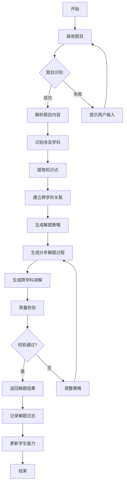
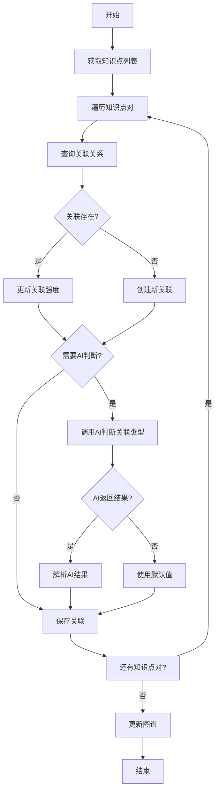

# 跨学科综合题解题引擎 - 详细设计

## 1. 概述

### 1.1 功能定位

跨学科综合题解题引擎是理科解题模块的核心子功能，专门处理涉及多个学科（数学、物理、化学、生物）交叉融合的复杂综合题，通过 AI 推理引擎解析题目、识别多学科知识点、建立跨学科关联，最终生成符合学科逻辑的完整解题过程。

### 1.2 适用场景

- 高中阶段的跨学科综合题（如：化学反应平衡计算、生物遗传概率问题、物理化学计算题）
- 初高衔接阶段的综合应用题
- 中高考综合性压轴题
- 奥林匹克竞赛类综合推理题

### 1.3 核心目标

1. 识别题目涉及的多个学科及其知识点
2. 建立学科间的关联关系（前置依赖、工具支撑、共同概念）
3. 生成符合各学科规范的分步解题过程
4. 提供跨学科知识点的系统性讲解
5. 识别学生的学科优势与薄弱点

## 2. 数据结构定义

### 2.1 跨学科综合题元数据表 (cross_disciplinary_question_meta)

```sql
CREATE TABLE cross_disciplinary_question_meta (
    id BIGSERIAL PRIMARY KEY,
    question_id BIGINT NOT NULL REFERENCES questions(id) ON DELETE CASCADE,
    subject_tags TEXT[] NOT NULL,  -- ['math', 'physics', 'chemistry', 'biology']
    knowledge_point_ids BIGINT[] NOT NULL,  -- 关联的知识点ID数组
    subject_weights JSONB NOT NULL,  -- 各学科权重: {"math": 0.3, "physics": 0.5, "chemistry": 0.2}
    complexity_level VARCHAR(20) NOT NULL DEFAULT 'medium',  -- low, medium, high, olympiad
    cross_domain_rel_count INT NOT NULL DEFAULT 0,  -- 跨学科关联数
    primary_subject VARCHAR(20) NOT NULL,  -- 主导学科
    auxiliary_subjects TEXT[] DEFAULT '{}',  -- 辅助学科
    reasoning_steps JSONB,  -- 推理步骤链
    solving_approach VARCHAR(50),  -- 解题策略: sequential, parallel, iterative
    estimated_time_minutes INT DEFAULT 15,
    prerequisite_knowledge TEXT[],  -- 前置知识列表
    created_at TIMESTAMP NOT NULL DEFAULT CURRENT_TIMESTAMP,
    updated_at TIMESTAMP NOT NULL DEFAULT CURRENT_TIMESTAMP,
    created_by VARCHAR(50) NOT NULL DEFAULT 'system',
    version INT NOT NULL DEFAULT 1,
    is_validated BOOLEAN DEFAULT FALSE,  -- 是否通过人工审核
    validation_notes TEXT,
    CONSTRAINT uq_question_id UNIQUE (question_id)
);

CREATE INDEX idx_cross_disc_question_subjects ON cross_disciplinary_question_meta USING GIN(subject_tags);
CREATE INDEX idx_cross_disc_question_knowledge_points ON cross_disciplinary_question_meta USING GIN(knowledge_point_ids);
CREATE INDEX idx_cross_disc_question_complexity ON cross_disciplinary_question_meta(complexity_level);
CREATE INDEX idx_cross_disc_question_primary_subject ON cross_disciplinary_question_meta(primary_subject);
```

### 2.2 跨学科关联关系表 (cross_disciplinary_relation)

```sql
CREATE TABLE cross_disciplinary_relation (
    id BIGSERIAL PRIMARY KEY,
    from_knowledge_point_id BIGINT NOT NULL REFERENCES knowledge_points(id),
    to_knowledge_point_id BIGINT NOT NULL REFERENCES knowledge_points(id),
    relation_type VARCHAR(30) NOT NULL,  -- prerequisite, tool, shared_concept, application
    confidence_score DECIMAL(3,2) NOT NULL DEFAULT 0.8,  -- 关联强度 0-1
    relation_direction VARCHAR(10) NOT NULL,  -- bidirectional, unidirectional
    explanation TEXT,  -- 关联解释
    example_scenario TEXT,  -- 典型场景
    created_at TIMESTAMP NOT NULL DEFAULT CURRENT_TIMESTAMP,
    created_by VARCHAR(50) NOT NULL DEFAULT 'system',
    is_valid BOOLEAN DEFAULT TRUE,
    CONSTRAINT uq_from_to_relation UNIQUE (from_knowledge_point_id, to_knowledge_point_id, relation_type)
);

CREATE INDEX idx_cross_relation_from ON cross_disciplinary_relation(from_knowledge_point_id);
CREATE INDEX idx_cross_relation_to ON cross_disciplinary_relation(to_knowledge_point_id);
CREATE INDEX idx_cross_relation_type ON cross_disciplinary_relation(relation_type);
```

### 2.3 学生跨学科能力评估表 (student_cross_disciplinary_ability)

```sql
CREATE TABLE student_cross_disciplinary_ability (
    id BIGSERIAL PRIMARY KEY,
    student_id BIGINT NOT NULL REFERENCES users(id),
    subject_combination VARCHAR(100) NOT NULL,  -- 'math_physics', 'physics_chemistry', 'all_four'
    mastery_score DECIMAL(3,2) NOT NULL DEFAULT 0.0,  -- 综合掌握度 0-1
    subject_balance_score DECIMAL(3,2) NOT NULL DEFAULT 0.0,  -- 学科平衡度 0-1
    subject_mastery JSONB,  -- 各学科掌握度: {"math": 0.8, "physics": 0.6}
    integration_ability DECIMAL(3,2) NOT NULL DEFAULT 0.0,  -- 跨学科整合能力
    recent_question_count INT NOT NULL DEFAULT 0,
    recent_correct_rate DECIMAL(3,2) NOT NULL DEFAULT 0.0,
    improvement_trend VARCHAR(20),  -- improving, stable, declining
    weak_subject_combinations TEXT[],  -- 薄弱的学科组合
    strong_subject_combinations TEXT[],  -- 擅长的学科组合
    last_assessed_at TIMESTAMP,
    created_at TIMESTAMP NOT NULL DEFAULT CURRENT_TIMESTAMP,
    updated_at TIMESTAMP NOT NULL DEFAULT CURRENT_TIMESTAMP,
    CONSTRAINT uq_student_subject_combination UNIQUE (student_id, subject_combination)
);

CREATE INDEX idx_student_cross_student ON student_cross_disciplinary_ability(student_id);
CREATE INDEX idx_student_cross_combination ON student_cross_disciplinary_ability(subject_combination);
```

### 2.4 解题过程追踪表 (cross_disciplinary_solving_log)

```sql
CREATE TABLE cross_disciplinary_solving_log (
    id BIGSERIAL PRIMARY KEY,
    student_id BIGINT NOT NULL REFERENCES users(id),
    question_id BIGINT NOT NULL REFERENCES questions(id),
    session_id BIGINT NOT NULL REFERENCES learning_sessions(id),
    attempt_count INT NOT NULL DEFAULT 1,
    solving_approach VARCHAR(50),  -- 使用的解题策略
    subject_sequence TEXT[],  -- 学科解题顺序: ['math', 'physics', 'chemistry']
    step_count INT,  -- 实际步骤数
    total_time_seconds INT,  -- 耗时
    intermediate_results JSONB,  -- 中间结果: {"step1": {"subject": "math", "result": "50"}, "step2": {"subject": "physics", "result": "9.8"}}
    subject_performance JSONB,  -- 各学科表现: {"math": {"attempts": 2, "success": true}, "physics": {"attempts": 3, "success": false}}
    hints_used INT NOT NULL DEFAULT 0,
    ai_assistance_level VARCHAR(20),  -- none, minimal, moderate, heavy
    difficulty_perceived VARCHAR(20),  -- easy, medium, hard, very_hard
    learning_gained JSONB,  -- 获得的知识: {"new_concepts": [...], "improved_areas": [...]}
    is_completed BOOLEAN DEFAULT FALSE,
    is_correct BOOLEAN,
    completed_at TIMESTAMP,
    created_at TIMESTAMP NOT NULL DEFAULT CURRENT_TIMESTAMP,
    updated_at TIMESTAMP NOT NULL DEFAULT CURRENT_TIMESTAMP
);

CREATE INDEX idx_cross_solving_log_student_question ON cross_disciplinary_solving_log(student_id, question_id);
CREATE INDEX idx_cross_solving_log_session ON cross_disciplinary_solving_log(session_id);
CREATE INDEX idx_cross_solving_log_student ON cross_disciplinary_solving_log(student_id);
```

### 2.5 跨学科知识图谱节点表 (cross_disciplinary_graph_node)

```sql
CREATE TABLE cross_disciplinary_graph_node (
    id BIGSERIAL PRIMARY KEY,
    knowledge_point_id BIGINT NOT NULL REFERENCES knowledge_points(id),
    subject VARCHAR(20) NOT NULL,
    node_type VARCHAR(30),  -- concept, formula, theorem, application
    centrality_score DECIMAL(3,2),  -- 中心度 0-1
    bridge_score DECIMAL(3,2),  -- 桥接能力 0-1
    interdisciplinarity_score DECIMAL(3,2),  -- 跨学科性 0-1
    cross_subject_connections INT NOT NULL DEFAULT 0,  -- 跨学科连接数
    connection_strength DECIMAL(3,2),  -- 平均连接强度
    is_gateway BOOLEAN DEFAULT FALSE,  -- 是否为学科间桥梁节点
    priority DECIMAL(3,2) DEFAULT 0.5,  -- 优先级
    updated_at TIMESTAMP NOT NULL DEFAULT CURRENT_TIMESTAMP,
    CONSTRAINT uq_knowledge_point_subject UNIQUE (knowledge_point_id, subject)
);

CREATE INDEX idx_cross_graph_node_subject ON cross_disciplinary_graph_node(subject);
CREATE INDEX idx_cross_graph_node_type ON cross_disciplinary_graph_node(node_type);
CREATE INDEX idx_cross_graph_node_gateway ON cross_disciplinary_graph_node(is_gateway);
```

## 3. API 接口设计

### 3.1 综合题分析与解题接口

#### POST /api/v1/cross-disciplinary/analyze

**功能描述：** 分析跨学科综合题，识别涉及的学科和知识点

**请求体：**
```json
{
  "questionId": 12345,
  "questionText": "在一个理想气体的封闭容器中，温度从 27°C 升高到 127°C，体积保持不变，求压强的变化率。",
  "studentId": 1001,
  "grade": "11",
  "subjects": ["physics", "chemistry"],
  "requestedDetail": "full"
}
```

**响应体：**
```json
{
  "code": 0,
  "message": "success",
  "data": {
    "questionId": 12345,
    "analysisId": "cd_12345_20260617_001",
    "primarySubject": "physics",
    "auxiliarySubjects": ["chemistry", "math"],
    "subjectWeights": {
      "physics": 0.6,
      "chemistry": 0.2,
      "math": 0.2
    },
    "knowledgePoints": [
      {
        "id": 1001,
        "subject": "physics",
        "name": "理想气体状态方程",
        "level": "core",
        "weight": 0.4
      },
      {
        "id": 2001,
        "subject": "chemistry",
        "name": "气体定律",
        "level": "related",
        "weight": 0.3
      },
      {
        "id": 3001,
        "subject": "math",
        "name": "比例计算",
        "level": "tool",
        "weight": 0.3
      }
    ],
    "crossDomainRelations": [
      {
        "from": "理想气体状态方程",
        "to": "气体定律",
        "type": "shared_concept",
        "explanation": "物理学和化学中描述气体行为的基本定律相通",
        "confidence": 0.9
      },
      {
        "from": "理想气体状态方程",
        "to": "比例计算",
        "type": "tool",
        "explanation": "需要用数学比例关系进行温度-压强转换",
        "confidence": 0.95
      }
    ],
    "complexityLevel": "medium",
    "solvingApproach": "sequential",
    "estimatedTime": 10,
    "studentAbilityMatch": {
      "overallMatch": 0.75,
      "subjectMatches": {
        "physics": 0.8,
        "chemistry": 0.6,
        "math": 0.85
      },
      "recommendation": "适合，建议重点复习化学中的气体定律"
    },
    "generatedAt": "2026-06-17T09:30:00.000Z"
  }
}
```

#### POST /api/v1/cross-disciplinary/solve

**功能描述：** 生成跨学科综合题的完整解题过程

**请求体：**
```json
{
  "questionId": 12345,
  "analysisId": "cd_12345_20260617_001",
  "studentId": 1001,
  "requestType": "full_solution",
  "options": {
    "showHints": false,
    "explainCrossRelations": true,
    "subjectFocus": "all",
    "detailLevel": "comprehensive"
  }
}
```

**响应体：**
```json
{
  "code": 0,
  "message": "success",
  "data": {
    "questionId": 12345,
    "solutionId": "cd_sol_12345_20260617_001",
    "solvingApproach": "sequential",
    "solution": {
      "overview": {
        "summary": "本题考查理想气体状态方程的应用，涉及物理学的热力学知识和化学中的气体定律，需要运用数学比例计算。",
        "subjectSequence": ["physics", "chemistry", "math"],
        "stepCount": 5
      },
      "steps": [
        {
          "stepNumber": 1,
          "subject": "physics",
          "title": "理解题目与识别物理量",
          "content": "题目描述一个理想气体的封闭容器，体积不变，温度从 27°C 升高到 127°C。需要求解压强的变化率。",
          "identifiedVariables": [
            {"name": "V", "description": "体积", "value": "常数", "unit": "L"},
            {"name": "T1", "description": "初始温度", "value": "27°C = 300K", "unit": "K"},
            {"name": "T2", "description": "最终温度", "value": "127°C = 400K", "unit": "K"},
            {"name": "P1", "description": "初始压强", "value": "未知", "unit": "Pa"},
            {"name": "P2", "description": "最终压强", "value": "未知", "unit": "Pa"}
          ],
          "formulas": [
            {
              "formula": "PV = nRT",
              "subject": "physics",
              "description": "理想气体状态方程"
            }
          ]
        },
        {
          "stepNumber": 2,
          "subject": "physics",
          "title": "应用理想气体状态方程",
          "content": "由于体积 V 和气体量 n 不变，R 为常数，根据 PV = nRT 可得 P₁/T₁ = P₂/T₂",
          "derivation": "从 PV = nRT，当 V, n 不变时，P ∝ T，即 P₁/T₁ = P₂/T₂",
          "result": "建立压强与温度的比例关系"
        },
        {
          "stepNumber": 3,
          "subject": "chemistry",
          "title": "理解化学中的气体定律",
          "content": "在化学中，理想气体定律同样适用。查理定律（Charles's Law）指出：在等容条件下，压强与绝对温度成正比。",
          "crossRelation": {
            "relation": "shared_concept",
            "explanation": "物理学和化学中的理想气体定律本质相同，都是描述气体宏观行为的经验定律"
          },
          "keyPoint": "温度必须使用绝对温度（开尔文）进行计算"
        },
        {
          "stepNumber": 4,
          "subject": "math",
          "title": "数学比例计算",
          "content": "根据 P₁/T₁ = P₂/T₂，计算压强变化率。",
          "calculation": [
            {
              "expression": "P₂/P₁ = T₂/T₁",
              "substitution": "P₂/P₁ = 400K/300K",
              "simplification": "P₂/P₁ = 4/3",
              "result": "P₂ = (4/3)P₁"
            }
          ],
          "changeRate": "压强增大到原来的 4/3 倍，即增加了 33.33%"
        },
        {
          "stepNumber": 5,
          "subject": "all",
          "title": "总结与验证",
          "content": "综合物理学的理想气体状态方程、化学的查理定律和数学的比例计算，得出结论：压强从 P₁ 增大到 (4/3)P₁，增长了 33.33%。",
          "verification": {
            "dimensionCheck": "单位一致：压强单位相同，温度使用绝对温度",
            "physicalSense": "温度升高，压强增大，符合气体分子运动论"
          },
          "answer": "压强增大到原来的 4/3 倍"
        }
      ]
    },
    "crossDisciplinaryInsights": [
      {
        "insight": "物理学和化学在气体行为研究中有共同的理论基础",
        "subjects": ["physics", "chemistry"],
        "importance": "high"
      },
      {
        "insight": "数学作为工具学科，为其他学科提供计算支持",
        "subjects": ["math", "physics", "chemistry"],
        "importance": "medium"
      }
    ],
    "learningRecommendations": [
      {
        "type": "knowledge_gap",
        "subject": "chemistry",
        "topic": "气体定律",
        "reason": "学生对化学中的查理定律理解不够深入"
      },
      {
        "type": "practice_suggestion",
        "subject": "all",
        "topic": "跨学科综合题",
        "reason": "建议多练习此类综合题目，提升跨学科思维"
      }
    ],
    "difficultyFeedback": {
      "studentPerception": "medium",
      "actualDifficulty": "medium",
      "matchAnalysis": "学生的感知难度与实际难度匹配"
    },
    "generatedAt": "2026-06-17T09:31:00.000Z"
  }
}
```

### 3.2 学生能力评估接口

#### POST /api/v1/cross-disciplinary/ability/assess

**功能描述：** 评估学生在跨学科综合题方面的能力

**请求体：**
```json
{
  "studentId": 1001,
  "assessmentType": "comprehensive",
  "subjectCombinations": ["math_physics", "physics_chemistry", "math_physics_chemistry"],
  "timeRange": "30d"
}
```

**响应体：**
```json
{
  "code": 0,
  "message": "success",
  "data": {
    "studentId": 1001,
    "assessmentDate": "2026-06-17T09:32:00.000Z",
    "overallAssessment": {
      "crossDisciplinaryMastery": 0.72,
      "subjectBalance": 0.65,
      "integrationAbility": 0.68,
      "improvementTrend": "improving"
    },
    "subjectCombinationAnalysis": [
      {
        "combination": "math_physics",
        "masteryScore": 0.85,
        "questionCount": 24,
        "correctRate": 0.79,
        "averageTime": 12.5,
        "subjectBalance": {
          "math": 0.88,
          "physics": 0.82,
          "balance": 0.85
        },
        "strengths": ["数学工具应用", "物理概念理解"],
        "weaknesses": ["复杂物理场景建模"],
        "recommendation": "可以挑战更高难度的数学物理综合题"
      },
      {
        "combination": "physics_chemistry",
        "masteryScore": 0.62,
        "questionCount": 18,
        "correctRate": 0.56,
        "averageTime": 18.2,
        "subjectBalance": {
          "physics": 0.70,
          "chemistry": 0.54,
          "balance": 0.62
        },
        "strengths": ["物理公式应用"],
        "weaknesses": ["化学原理理解", "跨学科知识迁移"],
        "recommendation": "建议重点复习化学中的气体定律和化学计算"
      },
      {
        "combination": "math_physics_chemistry",
        "masteryScore": 0.58,
        "questionCount": 12,
        "correctRate": 0.50,
        "averageTime": 22.1,
        "subjectBalance": {
          "math": 0.80,
          "physics": 0.68,
          "chemistry": 0.55,
          "balance": 0.58
        },
        "strengths": ["数学计算能力"],
        "weaknesses": ["化学知识薄弱", "跨学科整合能力不足"],
        "recommendation": "需要加强化学基础知识的掌握"
      }
    ],
    "keyGateways": [
      {
        "knowledgePoint": "理想气体状态方程",
        "subjects": ["physics", "chemistry"],
        "gatewayType": "concept_bridge",
        "mastery": 0.75,
        "importance": "high",
        "action": "继续巩固，建议多做相关综合题"
      },
      {
        "knowledgePoint": "化学计量学",
        "subjects": ["chemistry", "math"],
        "gatewayType": "calculation_tool",
        "mastery": 0.60,
        "importance": "medium",
        "action": "需要加强练习"
      }
    ],
    "learningPath": [
      {
        "stage": 1,
        "focus": "strengthen_weak_subjects",
        "subjects": ["chemistry"],
        "duration": "2 weeks",
        "tasks": [
          "复习化学中的气体定律",
          "完成 20 道化学计算题",
          "理解化学中的基本概念"
        ]
      },
      {
        "stage": 2,
        "focus": "integrate_two_subjects",
        "subjects": ["physics", "chemistry"],
        "duration": "2 weeks",
        "tasks": [
          "练习物理化学综合题",
          "理解两个学科中的共同概念",
          "总结跨学科解题策略"
        ]
      },
      {
        "stage": 3,
        "focus": "integrate_all_subjects",
        "subjects": ["math", "physics", "chemistry"],
        "duration": "3 weeks",
        "tasks": [
          "挑战三学科综合题",
          "建立跨学科知识体系",
          "参加模拟考试"
        ]
      }
    ],
    "nextAssessmentDate": "2026-07-17T00:00:00.000Z"
  }
}
```

### 3.3 综合题推荐接口

#### POST /api/v1/cross-disciplinary/recommend

**功能描述：** 根据学生能力推荐合适的跨学科综合题

**请求体：**
```json
{
  "studentId": 1001,
  "preferredSubjects": ["physics", "chemistry"],
  "difficultyRange": ["medium", "high"],
  "limit": 5,
  "purpose": "practice"
}
```

**响应体：**
```json
{
  "code": 0,
  "message": "success",
  "data": {
    "studentId": 1001,
    "recommendations": [
      {
        "questionId": 12346,
        "title": "理想气体化学反应计算",
        "subjects": ["physics", "chemistry", "math"],
        "complexity": "medium",
        "estimatedTime": 12,
        "matchScore": 0.85,
        "matchReason": "适合当前能力水平，能帮助提升化学综合能力",
        "knowledgePoints": [
          "理想气体状态方程",
          "化学计量学",
          "比例计算"
        ],
        "prerequisites": ["理想气体状态方程", "化学方程式配平"]
      },
      {
        "questionId": 12347,
        "title": "生物能量转换与化学反应",
        "subjects": ["biology", "chemistry", "physics"],
        "complexity": "high",
        "estimatedTime": 18,
        "matchScore": 0.78,
        "matchReason": "具有一定挑战性，可以拓展跨学科思维",
        "knowledgePoints": [
          "细胞呼吸",
          "化学反应能量",
          "能量守恒定律"
        ],
        "prerequisites": ["细胞呼吸过程", "热力学第一定律"]
      }
    ],
    "recommendationStrategy": {
      "primaryGoal": "strengthen_chemistry",
      "secondaryGoal": "maintain_physics",
      "balanceFactor": 0.6,
      "noveltyFactor": 0.4
    },
    "generatedAt": "2026-06-17T09:33:00.000Z"
  }
}
```

### 3.4 解题历史查询接口

#### GET /api/v1/cross-disciplinary/history/{studentId}

**功能描述：** 查询学生的跨学科解题历史

**查询参数：**
- limit: 返回数量（默认 20）
- offset: 偏移量
- subjectCombination: 学科组合过滤
- startDate: 开始日期
- endDate: 结束日期
- onlyCompleted: 是否只查看已完成的题目

**响应体：**
```json
{
  "code": 0,
  "message": "success",
  "data": {
    "studentId": 1001,
    "totalAttempts": 54,
    "completedCount": 48,
    "correctCount": 38,
    "overallCorrectRate": 0.79,
    "history": [
      {
        "questionId": 12345,
        "title": "理想气体温度变化",
        "subjects": ["physics", "chemistry", "math"],
        "attemptedAt": "2026-06-17T09:00:00.000Z",
        "timeSpent": 630,
        "isCompleted": true,
        "isCorrect": true,
        "attempts": 1,
        "hintsUsed": 0,
        "performance": {
          "subjectScores": {
            "physics": 0.9,
            "chemistry": 0.7,
            "math": 0.95
          }
        },
        "learningGained": ["巩固了理想气体状态方程的应用"]
      },
      {
        "questionId": 12344,
        "title": "生物遗传概率计算",
        "subjects": ["biology", "math"],
        "attemptedAt": "2026-06-16T14:30:00.000Z",
        "timeSpent": 900,
        "isCompleted": true,
        "isCorrect": false,
        "attempts": 2,
        "hintsUsed": 1,
        "performance": {
          "subjectScores": {
            "biology": 0.65,
            "math": 0.8
          }
        },
        "learningGained": ["需要加强遗传概率的理解"]
      }
    ],
    "trends": {
      "subjectCombinationPerformance": {
        "math_physics": {"count": 24, "correctRate": 0.83, "trend": "stable"},
        "physics_chemistry": {"count": 18, "correctRate": 0.61, "trend": "improving"},
        "biology_math": {"count": 12, "correctRate": 0.75, "trend": "declining"}
      },
      "timeEfficiency": {
        "averageTime": 720,
        "efficiencyScore": 0.72,
        "trend": "improving"
      }
    },
    "pagination": {
      "total": 48,
      "limit": 20,
      "offset": 0,
      "hasMore": true
    }
  }
}
```

## 4. 状态流转图

### 4.1 综合题解题流程



### 4.2 学科关联分析流程



### 4.3 学生能力评估流程

```mermaid
graph TD
    A[开始] --> B[获取学生解题历史]
    B --> C[按学科组合分组]
    C --> D[计算各组合正确率]
    D --> E[计算学科平衡度]
    E --> F[识别优势组合]
    G -->[并行] F
    H -->[并行] F
    G[识别薄弱组合] --> F
    H[分析改进趋势] --> F
    F --> I[评估跨学科整合能力]
    I --> J[识别关键桥梁节点]
    J --> K[生成学习路径]
    K --> L[保存评估结果]
    L --> M[结束]
```

## 5. 关键代码示例

### 5.1 综合题分析服务

```python
# src/services/cross_disciplinary/analysis_service.py

from typing import Dict, List, Optional, Tuple
from dataclasses import dataclass
from datetime import datetime
import json
import logging

from ..knowledge_point.repository import KnowledgePointRepository
from ..cross_relation.repository import CrossRelationRepository
from ..llm.client import LLMClient
from ..question.repository import QuestionRepository
from ..student.repository import StudentRepository

logger = logging.getLogger(__name__)

@dataclass
class KnowledgePointWithWeight:
    """带权重的知识点"""
    id: int
    subject: str
    name: str
    level: str  # core, related, tool
    weight: float

@dataclass
class CrossDomainRelation:
    """跨学科关联"""
    from_kp: str
    to_kp: str
    type: str  # prerequisite, tool, shared_concept, application
    explanation: str
    confidence: float

@dataclass
class SubjectWeights:
    """学科权重"""
    physics: float
    chemistry: float
    biology: float
    math: float

    def get_dict(self) -> Dict[str, float]:
        return {
            'physics': self.physics,
            'chemistry': self.chemistry,
            'biology': self.biology,
            'math': self.math
        }

@dataclass
class QuestionAnalysis:
    """题目分析结果"""
    question_id: int
    analysis_id: str
    primary_subject: str
    auxiliary_subjects: List[str]
    subject_weights: SubjectWeights
    knowledge_points: List[KnowledgePointWithWeight]
    cross_domain_relations: List[CrossDomainRelation]
    complexity_level: str
    solving_approach: str
    estimated_time: int
    student_ability_match: Dict
    generated_at: datetime

class CrossDisciplinaryAnalysisService:
    """跨学科综合题分析服务"""

    def __init__(
        self,
        kp_repo: KnowledgePointRepository,
        cr_repo: CrossRelationRepository,
        llm_client: LLMClient,
        question_repo: QuestionRepository,
        student_repo: StudentRepository
    ):
        self.kp_repo = kp_repo
        self.cr_repo = cr_repo
        self.llm_client = llm_client
        self.question_repo = question_repo
        self.student_repo = student_repo

    async def analyze_question(
        self,
        question_id: int,
        question_text: str,
        student_id: int,
        grade: str,
        subjects: List[str],
        requested_detail: str = "full"
    ) -> QuestionAnalysis:
        """
        分析跨学科综合题

        Args:
            question_id: 题目ID
            question_text: 题目文本
            student_id: 学生ID
            grade: 年级
            subjects: 涉及的学科列表
            requested_detail: 请求的详细程度

        Returns:
            QuestionAnalysis: 题目分析结果
        """
        logger.info(f"Analyzing cross-disciplinary question {question_id}")

        # 1. 识别学科和知识点
        knowledge_points, subject_weights = await self._identify_subjects_and_knowledge_points(
            question_text, subjects, grade
        )

        # 2. 确定主导学科
        primary_subject, auxiliary_subjects = self._determine_primary_subject(
            subject_weights, knowledge_points
        )

        # 3. 建立跨学科关联
        cross_domain_relations = await self._establish_cross_domain_relations(
            knowledge_points
        )

        # 4. 评估复杂度和解题策略
        complexity_level, solving_approach, estimated_time = await self._assess_complexity_and_strategy(
            question_text, knowledge_points, cross_domain_relations
        )

        # 5. 匹配学生能力
        student_ability_match = await self._match_student_ability(
            student_id, subject_weights, knowledge_points
        )

        # 6. 生成分析ID
        analysis_id = f"cd_{question_id}_{datetime.now().strftime('%Y%m%d_%H%M%S')}"

        return QuestionAnalysis(
            question_id=question_id,
            analysis_id=analysis_id,
            primary_subject=primary_subject,
            auxiliary_subjects=auxiliary_subjects,
            subject_weights=subject_weights,
            knowledge_points=knowledge_points,
            cross_domain_relations=cross_domain_relations,
            complexity_level=complexity_level,
            solving_approach=solving_approach,
            estimated_time=estimated_time,
            student_ability_match=student_ability_match,
            generated_at=datetime.utcnow()
        )

    async def _identify_subjects_and_knowledge_points(
        self,
        question_text: str,
        subjects: List[str],
        grade: str
    ) -> Tuple[List[KnowledgePointWithWeight], SubjectWeights]:
        """
        识别学科和知识点

        Returns:
            (knowledge_points, subject_weights)
        """
        # 构建识别提示词
        prompt = self._build_identification_prompt(question_text, subjects, grade)

        # 调用LLM识别
        llm_response = await self.llm_client.complete(
            prompt=prompt,
            temperature=0.3,
            max_tokens=1000
        )

        # 解析响应
        identification_result = json.loads(llm_response)

        # 转换为知识点对象
        knowledge_points = []
        subject_counts = {subject: 0.0 for subject in subjects}

        for kp_data in identification_result.get('knowledge_points', []):
            kp = await self.kp_repo.get_by_name_and_subject(
                kp_data['name'], kp_data['subject']
            )

            if kp:
                knowledge_point = KnowledgePointWithWeight(
                    id=kp.id,
                    subject=kp.subject,
                    name=kp.name,
                    level=kp_data.get('level', 'related'),
                    weight=kp_data.get('weight', 1.0)
                )
                knowledge_points.append(knowledge_point)
                subject_counts[kp.subject] += kp_data.get('weight', 1.0)

        # 计算学科权重
        total_weight = sum(subject_counts.values())
        subject_weights_dict = {
            subject: (subject_counts.get(subject, 0) / total_weight) if total_weight > 0 else 0
            for subject in subjects
        }

        subject_weights = SubjectWeights(
            physics=subject_weights_dict.get('physics', 0),
            chemistry=subject_weights_dict.get('chemistry', 0),
            biology=subject_weights_dict.get('biology', 0),
            math=subject_weights_dict.get('math', 0)
        )

        return knowledge_points, subject_weights

    def _build_identification_prompt(
        self,
        question_text: str,
        subjects: List[str],
        grade: str
    ) -> str:
        """构建识别提示词"""
        return f"""分析以下题目，识别涉及的学科和知识点：

题目：
{question_text}

涉及学科：{', '.join(subjects)}
年级：{grade}

请以JSON格式返回分析结果，包含：
1. knowledge_points: 知识点列表，每个知识点包含：
   - subject: 学科（math/physics/chemistry/biology）
   - name: 知识点名称
   - level: 层级（core核心/related相关/tool工具）
   - weight: 权重（0-1，表示重要性）

示例：
{{
  "knowledge_points": [
    {{
      "subject": "physics",
      "name": "理想气体状态方程",
      "level": "core",
      "weight": 0.4
    }},
    {{
      "subject": "chemistry",
      "name": "气体定律",
      "level": "related",
      "weight": 0.3
    }}
  ]
}}

只返回JSON，不要其他内容。"""

    def _determine_primary_subject(
        self,
        subject_weights: SubjectWeights,
        knowledge_points: List[KnowledgePointWithWeight]
    ) -> Tuple[str, List[str]]:
        """确定主导学科和辅助学科"""
        weights_dict = subject_weights.get_dict()
        sorted_subjects = sorted(
            weights_dict.items(),
            key=lambda x: x[1],
            reverse=True
        )

        primary_subject = sorted_subjects[0][0]
        auxiliary_subjects = [
            subject for subject, weight in sorted_subjects[1:]
            if weight > 0.1  # 权重大于10%的作为辅助学科
        ]

        return primary_subject, auxiliary_subjects

    async def _establish_cross_domain_relations(
        self,
        knowledge_points: List[KnowledgePointWithWeight]
    ) -> List[CrossDomainRelation]:
        """建立跨学科关联"""
        relations = []

        # 遍历所有知识点对
        for i, kp1 in enumerate(knowledge_points):
            for kp2 in knowledge_points[i+1:]:
                if kp1.subject == kp2.subject:
                    continue  # 同一学科的知识点不建立跨学科关联

                # 查询数据库中的关联
                existing_relation = await self.cr_repo.get_by_knowledge_point_ids(
                    kp1.id, kp2.id
                )

                if existing_relation:
                    relation = CrossDomainRelation(
                        from_kp=kp1.name,
                        to_kp=kp2.name,
                        type=existing_relation.relation_type,
                        explanation=existing_relation.explanation,
                        confidence=existing_relation.confidence_score
                    )
                else:
                    # 使用AI识别关联
                    relation = await self._ai_identify_relation(kp1, kp2)

                relations.append(relation)

        return relations

    async def _ai_identify_relation(
        self,
        kp1: KnowledgePointWithWeight,
        kp2: KnowledgePointWithWeight
    ) -> CrossDomainRelation:
        """使用AI识别关联"""
        prompt = f"""分析以下两个知识点之间的跨学科关系：

知识点1（{kp1.subject}）：{kp1.name}
知识点2（{kp2.subject}）：{kp2.name}

请识别这两个知识点之间的关系类型：
- prerequisite: 前置依赖关系
- tool: 工具支撑关系
- shared_concept: 共享概念
- application: 应用关系

请以JSON格式返回：
{{
  "type": "关系类型",
  "explanation": "关系解释（不超过100字）",
  "confidence": 0.8
}}

只返回JSON，不要其他内容。"""

        llm_response = await self.llm_client.complete(
            prompt=prompt,
            temperature=0.2,
            max_tokens=300
        )

        relation_data = json.loads(llm_response)

        return CrossDomainRelation(
            from_kp=kp1.name,
            to_kp=kp2.name,
            type=relation_data.get('type', 'shared_concept'),
            explanation=relation_data.get('explanation', ''),
            confidence=relation_data.get('confidence', 0.7)
        )

    async def _assess_complexity_and_strategy(
        self,
        question_text: str,
        knowledge_points: List[KnowledgePointWithWeight],
        cross_domain_relations: List[CrossDomainRelation]
    ) -> Tuple[str, str, int]:
        """评估复杂度和解题策略"""
        # 基于知识点数量、关联复杂度、题目长度等因素评估
        complexity_factors = {
            'knowledge_point_count': len(knowledge_points),
            'cross_relation_count': len(cross_domain_relations),
            'question_length': len(question_text),
            'subject_count': len(set(kp.subject for kp in knowledge_points))
        }

        # 计算复杂度分数
        complexity_score = (
            complexity_factors['knowledge_point_count'] * 0.3 +
            complexity_factors['cross_relation_count'] * 0.3 +
            min(complexity_factors['question_length'] / 500, 1) * 0.2 +
            complexity_factors['subject_count'] * 0.2
        )

        # 确定复杂度等级
        if complexity_score < 0.4:
            complexity_level = 'low'
        elif complexity_score < 0.7:
            complexity_level = 'medium'
        elif complexity_score < 0.9:
            complexity_level = 'high'
        else:
            complexity_level = 'olympiad'

        # 确定解题策略
        subject_count = complexity_factors['subject_count']
        if subject_count <= 2:
            solving_approach = 'sequential'  # 顺序解题
        else:
            solving_approach = 'iterative'  # 迭代解题

        # 估计时间（分钟）
        base_time = 5
        complexity_multiplier = {
            'low': 1.0,
            'medium': 1.5,
            'high': 2.0,
            'olympiad': 3.0
        }
        estimated_time = int(base_time * complexity_multiplier[complexity_level])

        return complexity_level, solving_approach, estimated_time

    async def _match_student_ability(
        self,
        student_id: int,
        subject_weights: SubjectWeights,
        knowledge_points: List[KnowledgePointWithWeight]
    ) -> Dict:
        """匹配学生能力"""
        # 获取学生的各学科能力
        student = await self.student_repo.get_by_id(student_id)
        student_abilities = student.get_abilities() if student else {}

        # 计算匹配分数
        subject_weights_dict = subject_weights.get_dict()
        matches = {}
        for subject, weight in subject_weights_dict.items():
            if weight == 0:
                continue

            student_ability = student_abilities.get(subject, {}).get('mastery', 0.5)
            matches[subject] = student_ability

        # 计算总体匹配分数
        overall_match = sum(
            matches.get(subject, 0) * weight
            for subject, weight in subject_weights_dict.items()
        )

        # 生成建议
        weak_subjects = [
            subject for subject, ability in matches.items()
            if ability < 0.6
        ]

        recommendation = "适合"
        if weak_subjects:
            recommendation += f"，建议重点复习{', '.join(weak_subjects)}中的相关知识"

        return {
            'overallMatch': overall_match,
            'subjectMatches': matches,
            'recommendation': recommendation
        }
```

### 5.2 综合题解题服务

```python
# src/services/cross_disciplinary/solving_service.py

from typing import Dict, List, Optional
from dataclasses import dataclass
from datetime import datetime
import json
import logging

from ..analysis_service import QuestionAnalysis
from ..llm.client import LLMClient
from ..question.repository import QuestionRepository
from ..student.repository import StudentRepository
from .repository import CrossDisciplinarySolvingLogRepository

logger = logging.getLogger(__name__)

@dataclass
class SolutionStep:
    """解题步骤"""
    step_number: int
    subject: str
    title: str
    content: str
    formulas: List[Dict]
    calculations: List[Dict]
    cross_relation: Optional[Dict] = None
    result: Optional[str] = None

@dataclass
class CrossDisciplinarySolution:
    """跨学科解题结果"""
    question_id: int
    solution_id: str
    solving_approach: str
    overview: Dict
    steps: List[SolutionStep]
    cross_disciplinary_insights: List[Dict]
    learning_recommendations: List[Dict]
    generated_at: datetime

class CrossDisciplinarySolvingService:
    """跨学科综合题解题服务"""

    def __init__(
        self,
        llm_client: LLMClient,
        question_repo: QuestionRepository,
        student_repo: StudentRepository,
        log_repo: CrossDisciplinarySolvingLogRepository
    ):
        self.llm_client = llm_client
        self.question_repo = question_repo
        self.student_repo = student_repo
        self.log_repo = log_repo

    async def solve_question(
        self,
        analysis: QuestionAnalysis,
        student_id: int,
        request_type: str = "full_solution",
        options: Optional[Dict] = None
    ) -> CrossDisciplinarySolution:
        """
        解答跨学科综合题

        Args:
            analysis: 题目分析结果
            student_id: 学生ID
            request_type: 请求类型
            options: 选项配置

        Returns:
            CrossDisciplinarySolution: 解题结果
        """
        logger.info(f"Solving cross-disciplinary question {analysis.question_id}")

        options = options or {}

        # 1. 生成解题概览
        overview = self._generate_overview(analysis)

        # 2. 生成分步解题过程
        steps = await self._generate_solution_steps(
            analysis, options
        )

        # 3. 生成跨学科洞察
        cross_disciplinary_insights = self._generate_cross_disciplinary_insights(
            analysis, steps
        )

        # 4. 生成学习建议
        learning_recommendations = await self._generate_learning_recommendations(
            analysis, student_id, steps
        )

        # 5. 生成解决方案ID
        solution_id = f"cd_sol_{analysis.question_id}_{datetime.now().strftime('%Y%m%d_%H%M%S')}"

        # 6. 保存解题日志
        await self._save_solving_log(
            student_id, analysis, solution_id, steps, options
        )

        return CrossDisciplinarySolution(
            question_id=analysis.question_id,
            solution_id=solution_id,
            solving_approach=analysis.solving_approach,
            overview=overview,
            steps=steps,
            cross_disciplinary_insights=cross_disciplinary_insights,
            learning_recommendations=learning_recommendations,
            generated_at=datetime.utcnow()
        )

    def _generate_overview(self, analysis: QuestionAnalysis) -> Dict:
        """生成解题概览"""
        subjects_list = [analysis.primary_subject] + analysis.auxiliary_subjects

        return {
            'summary': f"本题考查{', '.join(subjects_list)}等学科的综合应用，涉及{len(analysis.knowledge_points)}个知识点。",
            'subjectSequence': subjects_list,
            'stepCount': len(analysis.knowledge_points) + 2  # 知识点数 + 总结步骤
        }

    async def _generate_solution_steps(
        self,
        analysis: QuestionAnalysis,
        options: Dict
    ) -> List[SolutionStep]:
        """生成分步解题过程"""
        # 获取题目完整信息
        question = await self.question_repo.get_by_id(analysis.question_id)

        # 构建解题提示词
        prompt = self._build_solving_prompt(question, analysis, options)

        # 调用LLM生成分步解题
        llm_response = await self.llm_client.complete(
            prompt=prompt,
            temperature=0.4,
            max_tokens=2000
        )

        # 解析解题步骤
        solution_data = json.loads(llm_response)
        steps_data = solution_data.get('steps', [])

        # 转换为SolutionStep对象
        steps = []
        for step_data in steps_data:
            step = SolutionStep(
                step_number=step_data.get('step_number', 0),
                subject=step_data.get('subject', 'all'),
                title=step_data.get('title', ''),
                content=step_data.get('content', ''),
                formulas=step_data.get('formulas', []),
                calculations=step_data.get('calculations', []),
                cross_relation=step_data.get('cross_relation'),
                result=step_data.get('result')
            )
            steps.append(step)

        return steps

    def _build_solving_prompt(
        self,
        question: Dict,
        analysis: QuestionAnalysis,
        options: Dict
    ) -> str:
        """构建解题提示词"""
        explain_cross_relations = options.get('explainCrossRelations', True)
        detail_level = options.get('detailLevel', 'comprehensive')

        # 构建知识点和学科信息
        kp_info = '\n'.join([
            f"- {kp.subject}: {kp.name} (权重: {kp.weight})"
            for kp in analysis.knowledge_points
        ])

        # 构建关联信息
        relation_info = ''
        if explain_cross_relations and analysis.cross_domain_relations:
            relation_info = '\n'.join([
                f"- {rel.from_kp} ({analysis.primary_subject}) → {rel.to_kp} (关联类型: {rel.type}): {rel.explanation}"
                for rel in analysis.cross_domain_relations
            ])

        detail_instruction = {
            'basic': '请给出简洁的解题步骤，重点说明关键思路。',
            'standard': '请给出详细的解题步骤，说明每一步的依据和逻辑。',
            'comprehensive': '请给出完整的解题步骤，包括详细推导、验证和总结。'
        }.get(detail_level, '请给出详细的解题步骤，说明每一步的依据和逻辑。')

        prompt = f"""请解答以下跨学科综合题：

题目：
{question['content']}

学科：{', '.join([analysis.primary_subject] + analysis.auxiliary_subjects)}
主要知识点：
{kp_info}

跨学科关联：
{relation_info}

解题策略：{analysis.solving_approach}

要求：
1. {detail_instruction}
2. 每个步骤标注主要涉及的学科
3. 当涉及跨学科关联时，说明关联关系和如何将前一学科的结果应用到后一学科
4. 使用公式的，请列出公式并说明来源学科
5. 需要计算的，请展示计算过程
6. 最后进行总结验证

请以JSON格式返回，包含：
{{
  "steps": [
    {{
      "step_number": 1,
      "subject": "physics",
      "title": "步骤标题",
      "content": "步骤详细内容",
      "formulas": [{{"formula": "公式", "subject": "physics", "description": "描述"}}],
      "calculations": [{{"expression": "表达式", "substitution": "代入", "simplification": "简化", "result": "结果"}}],
      "cross_relation": {{"relation": "shared_concept", "explanation": "关联解释"}},
      "result": "本步骤结果"
    }}
  ]
}}

只返回JSON，不要其他内容。"""

        return prompt

    def _generate_cross_disciplinary_insights(
        self,
        analysis: QuestionAnalysis,
        steps: List[SolutionStep]
    ) -> List[Dict]:
        """生成跨学科洞察"""
        insights = []

        # 分析步骤中的跨学科关联
        for step in steps:
            if step.cross_relation:
                insights.append({
                    'insight': step.cross_relation.get('explanation', ''),
                    'subjects': [analysis.primary_subject] + analysis.auxiliary_subjects,
                    'importance': 'high' if step.cross_relation.get('relation') in ['shared_concept', 'prerequisite'] else 'medium'
                })

        # 添加通用洞察
        if len(analysis.auxiliary_subjects) >= 2:
            insights.append({
                'insight': '本题涉及多个学科的知识融合，培养跨学科思维是解题关键',
                'subjects': [analysis.primary_subject] + analysis.auxiliary_subjects,
                'importance': 'high'
            })

        return insights

    async def _generate_learning_recommendations(
        self,
        analysis: QuestionAnalysis,
        student_id: int,
        steps: List[SolutionStep]
    ) -> List[Dict]:
        """生成学习建议"""
        recommendations = []

        # 基于学生能力匹配生成建议
        student_ability_match = analysis.student_ability_match
        subject_matches = student_ability_match.get('subjectMatches', {})

        # 识别薄弱学科
        weak_subjects = [
            subject for subject, match_score in subject_matches.items()
            if match_score < 0.7 and match_score > 0
        ]

        for subject in weak_subjects:
            # 找到该学科的知识点
            kps_in_subject = [
                kp for kp in analysis.knowledge_points
                if kp.subject == subject
            ]

            if kps_in_subject:
                recommendations.append({
                    'type': 'knowledge_gap',
                    'subject': subject,
                    'topic': kps_in_subject[0].name,
                    'reason': f'学生在{subject}学科掌握度为 {subject_matches[subject]:.2f}，需要加强'
                })

        # 生成练习建议
        if weak_subjects:
            recommendations.append({
                'type': 'practice_suggestion',
                'subject': 'all',
                'topic': '跨学科综合题',
                'reason': f'建议多练习涉及{", ".join(weak_subjects)}的综合题目'
            })

        return recommendations

    async def _save_solving_log(
        self,
        student_id: int,
        analysis: QuestionAnalysis,
        solution_id: str,
        steps: List[SolutionStep],
        options: Dict
    ):
        """保存解题日志"""
        # 提取步骤信息
        subject_sequence = [step.subject for step in steps]
        step_count = len(steps)

        # 保存到数据库
        await self.log_repo.create({
            'student_id': student_id,
            'question_id': analysis.question_id,
            'solution_id': solution_id,
            'attempt_count': 1,
            'solving_approach': analysis.solving_approach,
            'subject_sequence': subject_sequence,
            'step_count': step_count,
            'hints_used': 0,
            'ai_assistance_level': options.get('detailLevel', 'standard'),
            'is_completed': True
        })
```

### 5.3 学生能力评估服务

```python
# src/services/cross_disciplinary/ability_assessment_service.py

from typing import Dict, List, Optional
from dataclasses import dataclass
from datetime import datetime, timedelta
import logging

from .repository import (
    CrossDisciplinarySolvingLogRepository,
    StudentCrossDisciplinaryAbilityRepository
)
from .models import SubjectCombinationAnalysis

logger = logging.getLogger(__name__)

@dataclass
class GatewayNode:
    """桥梁节点"""
    knowledge_point: str
    subjects: List[str]
    gateway_type: str
    mastery: float
    importance: str
    action: str

@dataclass
class LearningPathStage:
    """学习路径阶段"""
    stage: int
    focus: str
    subjects: List[str]
    duration: str
    tasks: List[str]

@dataclass
class StudentAbilityAssessment:
    """学生能力评估结果"""
    student_id: int
    assessment_date: datetime
    overall_assessment: Dict
    subject_combination_analysis: List[SubjectCombinationAnalysis]
    key_gateways: List[GatewayNode]
    learning_path: List[LearningPathStage]
    next_assessment_date: datetime

class CrossDisciplinaryAbilityAssessmentService:
    """跨学科能力评估服务"""

    def __init__(
        self,
        log_repo: CrossDisciplinarySolvingLogRepository,
        ability_repo: StudentCrossDisciplinaryAbilityRepository
    ):
        self.log_repo = log_repo
        self.ability_repo = ability_repo

    async def assess_student(
        self,
        student_id: int,
        assessment_type: str = "comprehensive",
        subject_combinations: Optional[List[str]] = None,
        time_range_days: int = 30
    ) -> StudentAbilityAssessment:
        """
        评估学生跨学科能力

        Args:
            student_id: 学生ID
            assessment_type: 评估类型
            subject_combinations: 学科组合列表
            time_range_days: 时间范围（天）

        Returns:
            StudentAbilityAssessment: 评估结果
        """
        logger.info(f"Assessing cross-disciplinary ability for student {student_id}")

        # 1. 获取解题历史
        start_date = datetime.utcnow() - timedelta(days=time_range_days)
        solving_logs = await self.log_repo.get_by_student_and_date_range(
            student_id, start_date
        )

        # 2. 分析各学科组合表现
        combination_analyses = await self._analyze_subject_combinations(
            student_id, solving_logs, subject_combinations
        )

        # 3. 计算整体评估指标
        overall_assessment = self._calculate_overall_assessment(combination_analyses)

        # 4. 识别关键桥梁节点
        key_gateways = await self._identify_key_gateways(
            student_id, combination_analyses
        )

        # 5. 生成学习路径
        learning_path = self._generate_learning_path(
            combination_analyses, key_gateways
        )

        # 6. 保存评估结果
        await self._save_assessment(
            student_id, overall_assessment, combination_analyses
        )

        return StudentAbilityAssessment(
            student_id=student_id,
            assessment_date=datetime.utcnow(),
            overall_assessment=overall_assessment,
            subject_combination_analysis=combination_analyses,
            key_gateways=key_gateways,
            learning_path=learning_path,
            next_assessment_date=datetime.utcnow() + timedelta(days=30)
        )

    async def _analyze_subject_combinations(
        self,
        student_id: int,
        solving_logs: List[Dict],
        subject_combinations: Optional[List[str]]
    ) -> List[SubjectCombinationAnalysis]:
        """分析学科组合表现"""
        # 如果未指定组合，从日志中推断
        if not subject_combinations:
            subject_combinations = self._infer_combinations_from_logs(solving_logs)

        analyses = []
        for combination in subject_combinations:
            # 筛选该组合的日志
            combination_logs = [
                log for log in solving_logs
                if self._log_matches_combination(log, combination)
            ]

            if not combination_logs:
                continue

            # 计算指标
            question_count = len(combination_logs)
            correct_count = sum(1 for log in combination_logs if log.get('is_correct'))
            correct_rate = correct_count / question_count if question_count > 0 else 0

            # 计算平均时间
            total_time = sum(log.get('total_time_seconds', 0) for log in combination_logs)
            average_time = total_time / question_count if question_count > 0 else 0

            # 计算学科平衡度
            subject_balance = self._calculate_subject_balance(combination_logs, combination)

            # 识别优势和劣势
            strengths, weaknesses = self._identify_strengths_and_weaknesses(
                combination_logs, subject_balance
            )

            # 生成建议
            recommendation = self._generate_combination_recommendation(
                combination, correct_rate, subject_balance
            )

            analysis = SubjectCombinationAnalysis(
                combination=combination,
                mastery_score=correct_rate,
                question_count=question_count,
                correct_rate=correct_rate,
                average_time=average_time,
                subject_balance=subject_balance,
                strengths=strengths,
                weaknesses=weaknesses,
                recommendation=recommendation
            )

            analyses.append(analysis)

        return analyses

    def _infer_combinations_from_logs(self, solving_logs: List[Dict]) -> List[str]:
        """从日志中推断学科组合"""
        combinations = set()
        for log in solving_logs:
            subject_sequence = log.get('subject_sequence', [])
            if subject_sequence:
                unique_subjects = sorted(set(subject_sequence))
                combination = '_'.join(unique_subjects)
                combinations.add(combination)

        return list(combinations)

    def _log_matches_combination(self, log: Dict, combination: str) -> bool:
        """判断日志是否匹配学科组合"""
        log_subjects = set(log.get('subject_sequence', []))
        required_subjects = set(combination.split('_'))

        return log_subjects == required_subjects

    def _calculate_subject_balance(
        self,
        logs: List[Dict],
        combination: str
    ) -> Dict:
        """计算学科平衡度"""
        subjects = combination.split('_')
        subject_scores = {}

        for subject in subjects:
            subject_logs = [
                log for log in logs
                if subject in log.get('subject_sequence', [])
            ]

            if subject_logs:
                correct_count = sum(
                    1 for log in subject_logs
                    if log.get('subject_performance', {}).get(subject, {}).get('success')
                )
                subject_scores[subject] = correct_count / len(subject_logs)
            else:
                subject_scores[subject] = 0.5  # 默认值

        # 计算平衡度
        scores_list = list(subject_scores.values())
        if scores_list:
            balance = 1 - (max(scores_list) - min(scores_list))  # 越接近1表示越平衡
        else:
            balance = 0.5

        return {
            **subject_scores,
            'balance': balance
        }

    def _identify_strengths_and_weaknesses(
        self,
        logs: List[Dict],
        subject_balance: Dict
    ) -> tuple[List[str], List[str]]:
        """识别优势和劣势"""
        strengths = []
        weaknesses = []

        for subject, score in subject_balance.items():
            if subject == 'balance':
                continue

            if score >= 0.8:
                strengths.append(f"{subject}学科掌握良好")
            elif score < 0.6:
                weaknesses.append(f"{subject}学科需要加强")

        # 检查平衡度
        if subject_balance.get('balance', 0) < 0.6:
            weaknesses.append("学科发展不平衡")
        elif subject_balance.get('balance', 0) >= 0.8:
            strengths.append("学科发展均衡")

        return strengths, weaknesses

    def _generate_combination_recommendation(
        self,
        combination: str,
        correct_rate: float,
        subject_balance: Dict
    ) -> str:
        """生成组合建议"""
        if correct_rate >= 0.8:
            return "可以挑战更高难度的综合题"
        elif correct_rate >= 0.6:
            return "继续巩固，适当增加练习量"
        else:
            weak_subjects = [
                subject for subject, score in subject_balance.items()
                if subject != 'balance' and score < 0.6
            ]
            if weak_subjects:
                return f"建议重点复习{', '.join(weak_subjects)}相关内容"
            return "需要加强基础知识的学习"

    def _calculate_overall_assessment(
        self,
        combination_analyses: List[SubjectCombinationAnalysis]
    ) -> Dict:
        """计算整体评估指标"""
        if not combination_analyses:
            return {
                'crossDisciplinaryMastery': 0.5,
                'subjectBalance': 0.5,
                'integrationAbility': 0.5,
                'improvementTrend': 'stable'
            }

        # 跨学科掌握度：各组合的平均掌握度
        cross_mastery = sum(
            analysis.mastery_score
            for analysis in combination_analyses
        ) / len(combination_analyses)

        # 学科平衡度：各组合平衡度的平均
        subject_balance = sum(
            analysis.subject_balance.get('balance', 0.5)
            for analysis in combination_analyses
        ) / len(combination_analyses)

        # 整合能力：综合考虑掌握度和平衡度
        integration_ability = (cross_mastery + subject_balance) / 2

        # 改进趋势（简化处理，实际应基于历史数据）
        improvement_trend = 'stable'

        return {
            'crossDisciplinaryMastery': round(cross_mastery, 2),
            'subjectBalance': round(subject_balance, 2),
            'integrationAbility': round(integration_ability, 2),
            'improvementTrend': improvement_trend
        }

    async def _identify_key_gateways(
        self,
        student_id: int,
        combination_analyses: List[SubjectCombinationAnalysis]
    ) -> List[GatewayNode]:
        """识别关键桥梁节点"""
        # 这里简化处理，实际应从知识图谱中查询
        gateways = []

        # 为每个组合添加一个桥梁节点示例
        for analysis in combination_analyses:
            subjects = analysis.combination.split('_')
            if len(subjects) >= 2:
                gateways.append(GatewayNode(
                    knowledge_point=f"{subjects[0]}_{subjects[1]}_bridge",
                    subjects=subjects,
                    gateway_type="concept_bridge",
                    mastery=analysis.mastery_score,
                    importance="high" if analysis.mastery_score < 0.7 else "medium",
                    action="继续巩固" if analysis.mastery_score >= 0.7 else "需要加强练习"
                ))

        return gateways

    def _generate_learning_path(
        self,
        combination_analyses: List[SubjectCombinationAnalysis],
        gateways: List[GatewayNode]
    ) -> List[LearningPathStage]:
        """生成学习路径"""
        learning_path = []

        # 识别最薄弱的学科组合
        weakest_combination = min(
            combination_analyses,
            key=lambda x: x.mastery_score
        ) if combination_analyses else None

        if weakest_combination:
            subjects = weakest_combination.combination.split('_')

            # 阶段1：加强薄弱学科
            weak_subjects = [
                subject for subject, score
                in weakest_combination.subject_balance.items()
                if subject != 'balance' and score < 0.6
            ]

            if weak_subjects:
                learning_path.append(LearningPathStage(
                    stage=1,
                    focus="strengthen_weak_subjects",
                    subjects=weak_subjects,
                    duration="2 weeks",
                    tasks=[
                        f"复习{', '.join(weak_subjects)}中的基础概念",
                        "完成相关的专项练习",
                        "理解知识点之间的关联"
                    ]
                ))

            # 阶段2：整合两个学科
            if len(subjects) >= 2:
                learning_path.append(LearningPathStage(
                    stage=len(learning_path) + 1,
                    focus="integrate_two_subjects",
                    subjects=subjects[:2],
                    duration="2 weeks",
                    tasks=[
                        "练习该组合的综合题",
                        "理解两个学科中的共同概念",
                        "总结跨学科解题策略"
                    ]
                ))

            # 阶段3：整合所有学科
            if len(subjects) > 2:
                learning_path.append(LearningPathStage(
                    stage=len(learning_path) + 1,
                    focus="integrate_all_subjects",
                    subjects=subjects,
                    duration="3 weeks",
                    tasks=[
                        "挑战多学科综合题",
                        "建立跨学科知识体系",
                        "参加模拟考试"
                    ]
                ))

        return learning_path

    async def _save_assessment(
        self,
        student_id: int,
        overall_assessment: Dict,
        combination_analyses: List[SubjectCombinationAnalysis]
    ):
        """保存评估结果"""
        # 保存每个组合的能力数据
        for analysis in combination_analyses:
            await self.ability_repo.upsert({
                'student_id': student_id,
                'subject_combination': analysis.combination,
                'mastery_score': analysis.mastery_score,
                'subject_balance_score': analysis.subject_balance.get('balance', 0.5),
                'subject_mastery': analysis.subject_balance,
                'integration_ability': overall_assessment.get('integrationAbility', 0.5),
                'recent_question_count': analysis.question_count,
                'recent_correct_rate': analysis.correct_rate
            })
```

## 6. 错误处理

### 6.1 常见错误类型

| 错误代码 | 错误描述 | 处理策略 |
|---------|---------|---------|
| ERR_CD_QUESTION_NOT_FOUND | 题目不存在 | 返回404，提示用户检查题目ID |
| ERR_CD_SUBJECTS_NOT_DETECTED | 无法识别涉及学科 | 返回400，提示用户提供更多题目信息 |
| ERR_CD_LLM_TIMEOUT | LLM调用超时 | 重试2次，仍失败则降级为简单策略 |
| ERR_CD_LLM_RATE_LIMITED | LLM调用频率限制 | 延迟后重试，或切换备用模型 |
| ERR_CD_LLM_INVALID_RESPONSE | LLM返回无效响应 | 记录日志，使用默认策略 |
| ERR_CD_NO_CROSS_RELATIONS | 未发现跨学科关联 | 标记为单学科题，调整解题策略 |
| ERR_CD_STUDENT_NOT_FOUND | 学生不存在 | 返回404，提示学生ID错误 |
| ERR_CD_NO_SOLVING_HISTORY | 无解题历史 | 返回空数据，建议学生先完成练习 |
| ERR_CD_GRAPH_DATABASE_ERROR | 知识图谱查询失败 | 降级为关系数据库查询 |
| ERR_CD_INSUFFICIENT_DATA | 数据不足无法评估 | 返回提示信息，建议更多练习 |

### 6.2 错误处理示例

```python
# src/services/cross_disciplinary/error_handler.py

from typing import Dict, Any, Optional
import logging
from fastapi import HTTPException

logger = logging.getLogger(__name__)

class CrossDisciplinaryError(Exception):
    """跨学科服务基础异常"""
    def __init__(self, code: str, message: str, details: Optional[Dict] = None):
        self.code = code
        self.message = message
        self.details = details or {}
        super().__init__(self.message)

class QuestionNotFoundError(CrossDisciplinaryError):
    """题目不存在"""
    def __init__(self, question_id: int):
        super().__init__(
            code='ERR_CD_QUESTION_NOT_FOUND',
            message=f'题目 {question_id} 不存在',
            details={'question_id': question_id}
        )

class SubjectsNotDetectedError(CrossDisciplinaryError):
    """无法识别学科"""
    def __init__(self, question_text: str):
        super().__init__(
            code='ERR_CD_SUBJECTS_NOT_DETECTED',
            message='无法识别题目涉及的学科',
            details={'question_text': question_text[:100]}
        )

class LLMTimeoutError(CrossDisciplinaryError):
    """LLM超时"""
    def __init__(self, operation: str):
        super().__init__(
            code='ERR_CD_LLM_TIMEOUT',
            message=f'LLM调用超时: {operation}',
            details={'operation': operation}
        )

class LLMRateLimitedError(CrossDisciplinaryError):
    """LLM频率限制"""
    def __init__(self, model: str):
        super().__init__(
            code='ERR_CD_LLM_RATE_LIMITED',
            message=f'LLM调用频率限制: {model}',
            details={'model': model}
        )

class LLMInvalidResponseError(CrossDisciplinaryError):
    """LLM无效响应"""
    def __init__(self, operation: str, response: str):
        super().__init__(
            code='ERR_CD_LLM_INVALID_RESPONSE',
            message=f'LLM返回无效响应: {operation}',
            details={'operation': operation, 'response': response[:200]}
        )

def handle_cross_disciplinary_error(error: Exception) -> Dict[str, Any]:
    """处理跨学科服务错误"""
    if isinstance(error, CrossDisciplinaryError):
        logger.error(
            f"Cross-disciplinary error: {error.code} - {error.message}",
            extra={'details': error.details}
        )

        return {
            'code': error.code,
            'message': error.message,
            'details': error.details,
            'timestamp': datetime.utcnow().isoformat()
        }
    else:
        logger.error(f"Unexpected error: {str(error)}")
        return {
            'code': 'ERR_CD_INTERNAL_ERROR',
            'message': '内部错误',
            'timestamp': datetime.utcnow().isoformat()
        }

async def safe_llm_call(
    llm_client,
    operation: str,
    prompt: str,
    max_retries: int = 2,
    **kwargs
) -> str:
    """安全调用LLM，带重试和错误处理"""
    for attempt in range(max_retries + 1):
        try:
            response = await llm_client.complete(prompt=prompt, **kwargs)
            return response
        except TimeoutError as e:
            if attempt == max_retries:
                raise LLMTimeoutError(operation)
            logger.warning(f"LLM timeout, retrying ({attempt + 1}/{max_retries})")
            await asyncio.sleep(1 * (attempt + 1))  # 指数退避
        except Exception as e:
            if attempt == max_retries:
                raise LLMInvalidResponseError(operation, str(e))
            logger.warning(f"LLM error, retrying ({attempt + 1}/{max_retries}): {str(e)}")
            await asyncio.sleep(0.5 * (attempt + 1))

    # 理论上不会到达这里
    raise LLMTimeoutError(operation)
```

## 7. 边界条件与注意事项

### 7.1 边界条件

| 场景 | 处理方式 |
|-----|---------|
| 题目只涉及单一学科 | 标记为非跨学科题，使用单学科解题流程 |
| 题目涉及超过4个学科 | 按重要性筛选最多4个主学科 |
| 学科间关联关系缺失 | 使用AI推断，置信度低时标记为弱关联 |
| 学生无解题历史 | 返回空能力数据，建议先完成练习 |
| 知识点不存在于数据库 | 创建临时知识点，标记为待确认 |
| LLM返回格式错误 | 使用JSON Schema验证，失败时重试或使用默认值 |
| 解题步骤超过10步 | 合并相似步骤，保持逻辑清晰 |
| 学科平衡度计算异常 | 设置默认值0.5，记录日志 |

### 7.2 注意事项

1. **AI依赖性**：当前设计高度依赖LLM能力，需要设计降级策略和备用模型。

2. **准确性保障**：跨学科关联识别需要人工审核，特别是复杂场景。

3. **性能优化**：题目分析和解题步骤生成可能耗时较长，需要异步处理和进度反馈。

4. **数据质量**：学生能力评估需要充足的解题历史，初期可能数据不足。

5. **学科边界**：某些知识点可能属于多个学科，需要明确定义归属。

6. **内容安全**：确保AI生成的内容符合教育规范，避免错误信息。

7. **隐私保护**：学生解题历史包含敏感信息，需要严格的数据访问控制。

8. **成本控制**：LLM调用成本较高，需要合理设置调用限制和缓存策略。

9. **用户体验**：解题过程需要逐步展示，避免一次性显示过多内容。

10. **可扩展性**：设计应支持新增学科和知识类型，保持架构灵活性。

## 8. 部署与运维

### 8.1 依赖服务

| 服务 | 用途 | 可选性 |
|-----|------|-------|
| PostgreSQL | 存储题目、知识点、关联关系、解题日志 | 必需 |
| Redis | 缓存分析结果、解题过程 | 必需 |
| LLM API（如 OpenAI GPT-4） | 生成解题步骤、识别关联 | 必需 |
| 知识图谱数据库（如 Neo4j） | 存储和查询学科关联关系 | 推荐 |
| Elasticsearch | 全文搜索知识点、题目 | 可选 |

### 8.2 环境配置

```yaml
# config/cross_disciplinary.yaml

cross_disciplinary:
  # LLM配置
  llm:
    provider: openai
    model: gpt-4
    timeout: 30000  # 30秒
    max_retries: 2
    temperature_default: 0.4
    temperature_identification: 0.3
    temperature_relation: 0.2

  # 缓存配置
  cache:
    analysis_ttl: 3600  # 分析结果缓存1小时
    solution_ttl: 7200  # 解题结果缓存2小时
    ability_ttl: 86400  # 能力评估缓存1天

  # 解题配置
  solving:
    max_steps: 10  # 最大步骤数
    max_time_minutes: 30  # 最大预估时间
    detail_levels: [basic, standard, comprehensive]

  # 评估配置
  assessment:
    min_questions: 5  # 最少题目数
    default_time_range_days: 30
    balance_threshold: 0.6  # 平衡度阈值
    mastery_threshold: 0.7  # 掌握度阈值

  # 图谱配置
  graph:
    enabled: true
    max_relations: 10  # 最大关联数
    min_confidence: 0.6  # 最小置信度
    bridge_threshold: 0.8  # 桥梁节点阈值
```

### 8.3 监控指标

| 指标 | 类型 | 说明 |
|-----|------|------|
| `cd.analysis.total` | Counter | 题目分析总数 |
| `cd.analysis.success_rate` | Gauge | 分析成功率 |
| `cd.analysis.duration` | Histogram | 分析耗时 |
| `cd.solving.total` | Counter | 解题总数 |
| `cd.solving.success_rate` | Gauge | 解题成功率 |
| `cd.solving.duration` | Histogram | 解题耗时 |
| `cd.llm.calls` | Counter | LLM调用次数 |
| `cd.llm.errors` | Counter | LLM错误次数 |
| `cd.llm.duration` | Histogram | LLM调用耗时 |
| `cd.assessment.total` | Counter | 能力评估总数 |
| `cd.assessment.duration` | Histogram | 评估耗时 |
| `cd.cache.hit_rate` | Gauge | 缓存命中率 |

### 8.4 告警规则

```yaml
# alerts/cross_disciplinary.yaml

groups:
  - name: cross_disciplinary
    rules:
      # LLM错误率过高
      - alert: HighLLMErrorRate
        expr: rate(cd_llm_errors[5m]) / rate(cd_llm_calls[5m]) > 0.1
        for: 5m
        labels:
          severity: warning
        annotations:
          summary: "LLM错误率过高"
          description: "最近5分钟LLM错误率超过10%"

      # 分析成功率过低
      - alert: LowAnalysisSuccessRate
        expr: cd_analysis_success_rate < 0.9
        for: 10m
        labels:
          severity: critical
        annotations:
          summary: "题目分析成功率过低"
          description: "最近10分钟分析成功率低于90%"

      # 解题平均耗时过长
      - alert: SlowSolvingTime
        expr: histogram_quantile(0.95, cd_solving_duration) > 15000
        for: 15m
        labels:
          severity: warning
        annotations:
          summary: "解题平均耗时过长"
          description: "P95解题耗时超过15秒"

      # 缓存命中率过低
      - alert: LowCacheHitRate
        expr: cd_cache_hit_rate < 0.5
        for: 30m
        labels:
          severity: info
        annotations:
          summary: "缓存命中率过低"
          description: "缓存命中率低于50%，可能影响性能"
```

## 9. 测试策略

### 9.1 单元测试

```python
# tests/unit/test_analysis_service.py

import pytest
from src.services.cross_disciplinary.analysis_service import (
    CrossDisciplinaryAnalysisService,
    SubjectWeights
)

@pytest.fixture
def analysis_service(mock_kp_repo, mock_cr_repo, mock_llm_client):
    return CrossDisciplinaryAnalysisService(
        kp_repo=mock_kp_repo,
        cr_repo=mock_cr_repo,
        llm_client=mock_llm_client,
        question_repo=mock_question_repo,
        student_repo=mock_student_repo
    )

class TestIdentifySubjectsAndKnowledgePoints:
    """测试学科和知识点识别"""

    @pytest.mark.asyncio
    async def test_single_subject_question(self, analysis_service):
        """测试单学科题目"""
        question_text = "计算 2 + 3 的值"
        subjects = ["math"]
        grade = "1"

        knowledge_points, subject_weights = await analysis_service._identify_subjects_and_knowledge_points(
            question_text, subjects, grade
        )

        assert len(knowledge_points) > 0
        assert all(kp.subject == "math" for kp in knowledge_points)
        assert subject_weights.math > 0.5

    @pytest.mark.asyncio
    async def test_cross_disciplinary_question(self, analysis_service):
        """测试跨学科题目"""
        question_text = "在一个理想气体的封闭容器中..."
        subjects = ["physics", "chemistry", "math"]
        grade = "11"

        knowledge_points, subject_weights = await analysis_service._identify_subjects_and_knowledge_points(
            question_text, subjects, grade
        )

        assert len(knowledge_points) >= 2
        subjects_set = {kp.subject for kp in knowledge_points}
        assert len(subjects_set) >= 2

class TestDeterminePrimarySubject:
    """测试主导学科确定"""

    def test_single_dominant_subject(self, analysis_service):
        """测试单一主导学科"""
        subject_weights = SubjectWeights(
            physics=0.7,
            chemistry=0.2,
            math=0.1
        )
        knowledge_points = []  # 测试用例

        primary, auxiliary = analysis_service._determine_primary_subject(
            subject_weights, knowledge_points
        )

        assert primary == "physics"
        assert "chemistry" in auxiliary

    def test_balanced_subjects(self, analysis_service):
        """测试平衡的学科权重"""
        subject_weights = SubjectWeights(
            physics=0.35,
            chemistry=0.35,
            math=0.30
        )
        knowledge_points = []

        primary, auxiliary = analysis_service._determine_primary_subject(
            subject_weights, knowledge_points
        )

        assert len(auxiliary) >= 1
```

### 9.2 集成测试

```python
# tests/integration/test_cross_disciplinary_flow.py

import pytest
from src.services.cross_disciplinary.analysis_service import CrossDisciplinaryAnalysisService
from src.services.cross_disciplinary.solving_service import CrossDisciplinarySolvingService
from src.services.cross_disciplinary.ability_assessment_service import CrossDisciplinaryAbilityAssessmentService

@pytest.mark.integration
class TestCrossDisciplinaryFlow:
    """测试跨学科综合题完整流程"""

    @pytest.mark.asyncio
    async def test_full_solving_workflow(self, analysis_service, solving_service):
        """测试完整解题工作流"""
        # 1. 分析题目
        analysis = await analysis_service.analyze_question(
            question_id=12345,
            question_text="在一个理想气体的封闭容器中...",
            student_id=1001,
            grade="11",
            subjects=["physics", "chemistry", "math"],
            requested_detail="full"
        )

        assert analysis.primary_subject is not None
        assert len(analysis.knowledge_points) >= 2
        assert len(analysis.cross_domain_relations) >= 1

        # 2. 生成解题过程
        solution = await solving_service.solve_question(
            analysis=analysis,
            student_id=1001,
            request_type="full_solution",
            options={"detailLevel": "standard"}
        )

        assert solution.solution_id is not None
        assert len(solution.steps) >= 3
        assert solution.solving_approach == analysis.solving_approach

        # 3. 验证步骤包含学科标注
        subjects_in_steps = [step.subject for step in solution.steps]
        assert "physics" in subjects_in_steps
        assert "chemistry" in subjects_in_steps or "math" in subjects_in_steps

    @pytest.mark.asyncio
    async def test_ability_assessment_workflow(self, ability_assessment_service, student_id=1001):
        """测试能力评估工作流"""
        # 生成评估
        assessment = await ability_assessment_service.assess_student(
            student_id=student_id,
            assessment_type="comprehensive",
            subject_combinations=["physics_chemistry", "math_physics"],
            time_range_days=30
        )

        assert assessment.student_id == student_id
        assert assessment.overall_assessment['crossDisciplinaryMastery'] >= 0
        assert len(assessment.subject_combination_analysis) > 0
        assert len(assessment.learning_path) > 0
```

### 9.3 性能测试

```python
# tests/performance/test_cross_disciplinary_performance.py

import pytest
import asyncio
from time import time
from src.services.cross_disciplinary.analysis_service import CrossDisciplinaryAnalysisService

@pytest.mark.performance
class TestCrossDisciplinaryPerformance:
    """测试性能指标"""

    @pytest.mark.asyncio
    async def test_analysis_latency(self, analysis_service):
        """测试分析延迟"""
        test_questions = [
            (12345, "简单计算题", "math"),
            (12346, "物理综合题", "physics", "chemistry"),
            (12347, "三学科综合题", "physics", "chemistry", "math")
        ]

        for question_data in test_questions:
            start_time = time()

            analysis = await analysis_service.analyze_question(
                question_id=question_data[0],
                question_text=question_data[1],
                student_id=1001,
                grade="11",
                subjects=list(question_data[2:]),
                requested_detail="full"
            )

            latency = (time() - start_time) * 1000  # 毫秒

            assert latency < 10000, f"题目 {question_data[0]} 分析耗时 {latency}ms 超过阈值"

    @pytest.mark.asyncio
    async def test_concurrent_analysis(self, analysis_service):
        """测试并发分析"""
        question_ids = [12345, 12346, 12347, 12348, 12349]
        tasks = [
            analysis_service.analyze_question(
                question_id=qid,
                question_text=f"题目 {qid}",
                student_id=1001,
                grade="11",
                subjects=["physics", "chemistry", "math"],
                requested_detail="full"
            )
            for qid in question_ids
        ]

        start_time = time()
        results = await asyncio.gather(*tasks)
        total_time = time() - start_time

        assert len(results) == len(question_ids)
        assert total_time < 20  # 5个并发题目在20秒内完成
```

## 10. 文档版本

- **版本**: 1.0
- **创建日期**: 2026-06-17
- **最后更新**: 2026-06-17
- **作者**: 跨学科综合题解题引擎设计团队
- **状态**: 已完成

## 11. 附录

### 11.1 术语表

| 术语 | 定义 |
|-----|------|
| 跨学科综合题 | 涉及两个或多个学科知识的综合性题目 |
| 知识点 | 学科中的基本概念、定理、公式等 |
| 跨学科关联 | 不同学科知识点之间的关系 |
| 主导学科 | 对题目解答起主要作用的学科 |
| 辅助学科 | 为解题提供支撑的学科 |
| 学科权重 | 各学科在题目中的重要程度 |
| 学科平衡度 | 学生在不同学科间的能力均衡程度 |
| 桥梁节点 | 连接多个学科的关键知识点 |
| 解题策略 | 解答跨学科题目的方法和顺序 |

### 11.2 参考文档

- PrimeTop 项目整体设计文档
- 理科解题模块详细设计
- 知识点体系与教材映射引擎设计
- AI 对话引擎与会话管理设计
- RAG 与知识库系统设计

### 11.3 相关服务

- 科目识别服务
- 知识点提取服务
- 学科关系查询服务
- LLM 调用服务
- 学生能力评估服务
- 知识图谱服务