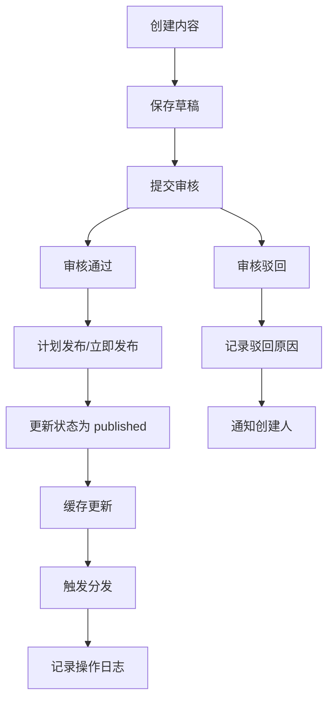
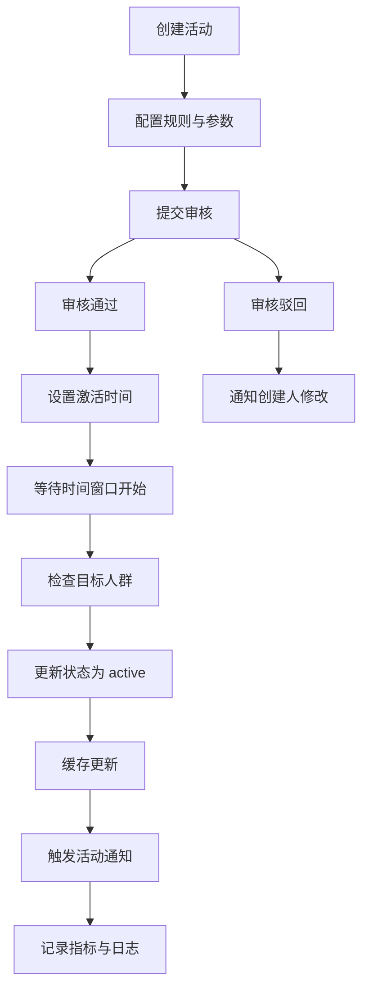
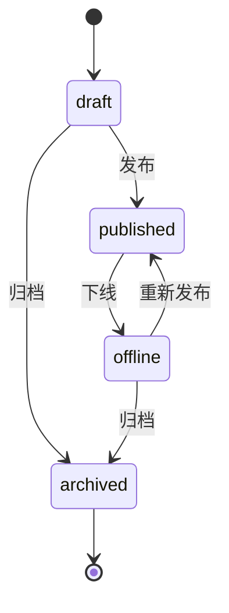
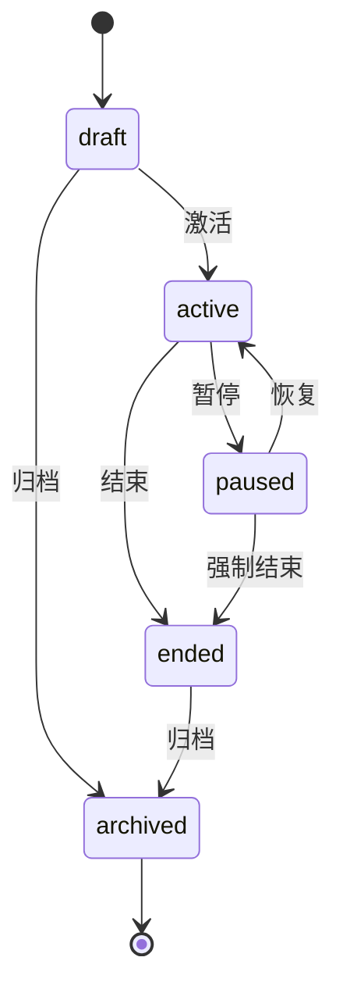

# 运营内容管理与活动配置引擎详细设计

## 1. 概述

### 1.1 模块定位

运营内容管理与活动配置引擎是 PrimeTop 平台的运营基础服务，负责管理平台级的内容发布、活动配置、规则管理与效果追踪，为运营后台提供可配置、可追溯、可分析的内容与活动管理能力。

### 1.2 核心职责

- **内容管理**：提供内容（如文案、图片、资源）的创建、审核、发布、下线与归档
- **活动配置**：支持运营活动的创建、配置、发布与终止，包括参数设置、时间窗口、目标人群与参与规则
- **规则管理**：对内容与活动相关规则进行版本化管理、灰度发布与条件触发
- **效果追踪**：记录内容与活动的触达、参与与转化数据，支持归因分析与效果度量
- **权限控制**：基于角色的内容与活动操作权限管理与审计

### 1.3 依赖关系

**依赖的模块：**
- 用户服务（获取用户信息、分群与画像）
- 权限服务（角色与权限校验）
- 消息服务（活动通知与内容分发）
- 统一埋点平台（行为数据采集与汇总）

**被依赖的模块：**
- 运营后台（管理与配置入口）
- 前端应用（内容与活动的呈现）
- 推荐引擎（基于活动策略分发）
- 数据分析平台（效果分析与报表）

### 1.4 设计目标

- **可配置性**：支持运营人员通过后台配置内容与活动，无需发版
- **可追溯性**：所有操作与状态变更均记录审计日志
- **高可用性**：核心接口不低于 99.5% 可用，支持灰度发布与快速回滚
- **可扩展性**：支持新的活动类型与内容类型的快速接入
- **安全性**：严格的权限校验与内容安全审核，符合合规要求

## 2. 数据模型

### 2.1 核心实体定义

#### 2.1.1 Content（内容）

```json
{
  "content_id": "string",
  "title": "string",
  "type": "string",
  "status": "string",
  "category": "string",
  "data": "object",
  "target_audience": "object",
  "scheduled_time": "datetime",
  "publish_time": "datetime",
  "offline_time": "datetime",
  "created_by": "string",
  "updated_by": "string",
  "audit_status": "string",
  "audit_by": "string",
  "audit_time": "datetime",
  "version": "int",
  "tags": ["string"],
  "metrics": "object"
}
```

#### 2.1.2 Campaign（活动）

```json
{
  "campaign_id": "string",
  "name": "string",
  "type": "string",
  "status": "string",
  "config": "object",
  "rules": "object",
  "time_window": {
    "start": "datetime",
    "end": "datetime"
  },
  "target_audience": "object",
  "created_by": "string",
  "updated_by": "string",
  "audit_status": "string",
  "audit_by": "string",
  "audit_time": "datetime",
  "version": "int",
  "tags": ["string"],
  "metrics": "object"
}
```

#### 2.1.3 ContentAuditLog（内容审核日志）

```json
{
  "audit_id": "string",
  "content_id": "string",
  "action": "string",
  "operator_id": "string",
  "operator_role": "string",
  "comment": "string",
  "old_status": "string",
  "new_status": "string",
  "create_time": "datetime"
}
```

#### 2.1.4 CampaignParticipant（活动参与记录）

```json
{
  "participant_id": "string",
  "campaign_id": "string",
  "user_id": "string",
  "join_time": "datetime",
  "status": "string",
  "data": "object",
  "result": "object"
}
```

#### 2.1.5 OperationLog（操作审计日志）

```json
{
  "log_id": "string",
  "operator_id": "string",
  "resource_type": "string",
  "resource_id": "string",
  "action": "string",
  "request_data": "object",
  "ip_address": "string",
  "user_agent": "string",
  "create_time": "datetime"
}
```

### 2.2 数据库表结构

#### 2.2.1 contents 表

```sql
CREATE TABLE contents (
    content_id VARCHAR(64) PRIMARY KEY,
    title VARCHAR(256) NOT NULL,
    type VARCHAR(32) NOT NULL COMMENT '类型：banner/announcement/article/popup等',
    status VARCHAR(16) NOT NULL COMMENT '状态：draft/published/offline/archived',
    category VARCHAR(64) COMMENT '分类',
    data JSON NOT NULL COMMENT '内容数据：标题、文案、素材、链接等',
    target_audience JSON COMMENT '目标人群：规则表达式或分群ID列表',
    scheduled_time DATETIME COMMENT '计划发布时间',
    publish_time DATETIME COMMENT '实际发布时间',
    offline_time DATETIME COMMENT '计划下线时间',
    created_by VARCHAR(64) NOT NULL COMMENT '创建人ID',
    updated_by VARCHAR(64) COMMENT '最后更新人ID',
    audit_status VARCHAR(16) DEFAULT 'pending' COMMENT '审核状态：pending/approved/rejected',
    audit_by VARCHAR(64) COMMENT '审核人ID',
    audit_time DATETIME COMMENT '审核时间',
    version INT NOT NULL DEFAULT 1 COMMENT '版本号',
    tags JSON COMMENT '标签数组',
    metrics JSON COMMENT '指标数据：曝光、点击、参与等',
    created_at DATETIME NOT NULL DEFAULT CURRENT_TIMESTAMP,
    updated_at DATETIME NOT NULL DEFAULT CURRENT_TIMESTAMP ON UPDATE CURRENT_TIMESTAMP,
    INDEX idx_type_status (type, status),
    INDEX idx_scheduled_time (scheduled_time),
    INDEX idx_publish_time (publish_time),
    INDEX idx_created_by (created_by)
) ENGINE=InnoDB DEFAULT CHARSET=utf8mb4 COLLATE=utf8mb4_unicode_ci COMMENT='内容表';
```

#### 2.2.2 campaigns 表

```sql
CREATE TABLE campaigns (
    campaign_id VARCHAR(64) PRIMARY KEY,
    name VARCHAR(256) NOT NULL,
    type VARCHAR(32) NOT NULL COMMENT '活动类型：task/contest/lottery/coupon等',
    status VARCHAR(16) NOT NULL COMMENT '状态：draft/active/paused/ended/archived',
    config JSON NOT NULL COMMENT '活动配置：参数、奖品、流程等',
    rules JSON COMMENT '规则配置：参与条件、限制、触发逻辑等',
    time_window JSON NOT NULL COMMENT '时间窗口：{start, end}',
    target_audience JSON COMMENT '目标人群：规则表达式或分群ID列表',
    created_by VARCHAR(64) NOT NULL COMMENT '创建人ID',
    updated_by VARCHAR(64) COMMENT '最后更新人ID',
    audit_status VARCHAR(16) DEFAULT 'pending' COMMENT '审核状态',
    audit_by VARCHAR(64) COMMENT '审核人ID',
    audit_time DATETIME COMMENT '审核时间',
    version INT NOT NULL DEFAULT 1 COMMENT '版本号',
    tags JSON COMMENT '标签数组',
    metrics JSON COMMENT '指标数据：曝光、参与、转化等',
    created_at DATETIME NOT NULL DEFAULT CURRENT_TIMESTAMP,
    updated_at DATETIME NOT NULL DEFAULT CURRENT_TIMESTAMP ON UPDATE CURRENT_TIMESTAMP,
    INDEX idx_type_status (type, status),
    INDEX idx_time_window (time_window->'$.start'),
    INDEX idx_created_by (created_by)
) ENGINE=InnoDB DEFAULT CHARSET=utf8mb4 COLLATE=utf8mb4_unicode_ci COMMENT='活动表';
```

#### 2.2.3 content_audit_logs 表

```sql
CREATE TABLE content_audit_logs (
    audit_id VARCHAR(64) PRIMARY KEY,
    content_id VARCHAR(64) NOT NULL,
    action VARCHAR(32) NOT NULL COMMENT '操作：create/update/publish/offline/audit_approve/audit_reject',
    operator_id VARCHAR(64) NOT NULL COMMENT '操作人ID',
    operator_role VARCHAR(32) COMMENT '操作人角色',
    comment VARCHAR(512) COMMENT '备注说明',
    old_status VARCHAR(16) COMMENT '原状态',
    new_status VARCHAR(16) COMMENT '新状态',
    create_time DATETIME NOT NULL DEFAULT CURRENT_TIMESTAMP,
    INDEX idx_content_id (content_id),
    INDEX idx_operator_id (operator_id),
    INDEX idx_create_time (create_time)
) ENGINE=InnoDB DEFAULT CHARSET=utf8mb4 COLLATE=utf8mb4_unicode_ci COMMENT='内容审核日志表';
```

#### 2.2.4 campaign_participants 表

```sql
CREATE TABLE campaign_participants (
    participant_id VARCHAR(64) PRIMARY KEY,
    campaign_id VARCHAR(64) NOT NULL,
    user_id VARCHAR(64) NOT NULL,
    join_time DATETIME NOT NULL DEFAULT CURRENT_TIMESTAMP,
    status VARCHAR(16) NOT NULL COMMENT '状态：active/completed/disqualified',
    data JSON COMMENT '参与数据：记录参数、中间状态等',
    result JSON COMMENT '结果数据：奖励、成绩等',
    created_at DATETIME NOT NULL DEFAULT CURRENT_TIMESTAMP,
    updated_at DATETIME NOT NULL DEFAULT CURRENT_TIMESTAMP ON UPDATE CURRENT_TIMESTAMP,
    INDEX idx_campaign_user (campaign_id, user_id),
    INDEX idx_campaign_status (campaign_id, status),
    INDEX idx_user_id (user_id)
) ENGINE=InnoDB DEFAULT CHARSET=utf8mb4 COLLATE=utf8mb4_unicode_ci COMMENT='活动参与记录表';
```

#### 2.2.5 operation_logs 表

```sql
CREATE TABLE operation_logs (
    log_id VARCHAR(64) PRIMARY KEY,
    operator_id VARCHAR(64) NOT NULL COMMENT '操作人ID',
    resource_type VARCHAR(32) NOT NULL COMMENT '资源类型：content/campaign/rule',
    resource_id VARCHAR(64) NOT NULL COMMENT '资源ID',
    action VARCHAR(32) NOT NULL COMMENT '动作：create/update/delete/publish/offline',
    request_data JSON COMMENT '请求数据（脱敏）',
    ip_address VARCHAR(64) COMMENT '操作来源IP',
    user_agent VARCHAR(512) COMMENT '客户端标识',
    create_time DATETIME NOT NULL DEFAULT CURRENT_TIMESTAMP,
    INDEX idx_operator_id (operator_id),
    INDEX idx_resource (resource_type, resource_id),
    INDEX idx_create_time (create_time)
) ENGINE=InnoDB DEFAULT CHARSET=utf8mb4 COLLATE=utf8mb4_unicode_ci COMMENT='操作审计日志表';
```

### 2.3 缓存策略

```python
# Redis 缓存键设计
CONTENT_KEY = "content:{content_id}"
CAMPAIGN_KEY = "campaign:{campaign_id}"
CONTENT_LIST_KEY = "content:list:{type}:{status}"
CAMPAIGN_LIST_KEY = "campaign:list:{type}:{status}"
AUDIENCE_CACHE_KEY = "audience:{resource_id}"

# 缓存过期时间
CONTENT_CACHE_TTL = 1800  # 30分钟
CAMPAIGN_CACHE_TTL = 1800  # 30分钟
LIST_CACHE_TTL = 300  # 5分钟
AUDIENCE_CACHE_TTL = 3600  # 1小时
```

## 3. API 接口设计

### 3.1 接口列表

| 接口路径 | 方法 | 描述 |
|---------|------|------|
| `/api/v1/contents` | POST | 创建内容 |
| `/api/v1/contents/{contentId}` | GET | 获取内容详情 |
| `/api/v1/contents/{contentId}` | PUT | 更新内容 |
| `/api/v1/contents/{contentId}/publish` | POST | 发布内容 |
| `/api/v1/contents/{contentId}/offline` | POST | 下线内容 |
| `/api/v1/contents` | GET | 查询内容列表 |
| `/api/v1/campaigns` | POST | 创建活动 |
| `/api/v1/campaigns/{campaignId}` | GET | 获取活动详情 |
| `/api/v1/campaigns/{campaignId}` | PUT | 更新活动 |
| `/api/v1/campaigns/{campaignId}/activate` | POST | 激活活动 |
| `/api/v1/campaigns/{campaignId}/pause` | POST | 暂停活动 |
| `/api/v1/campaigns/{campaignId}/participants` | GET | 获取活动参与列表 |
| `/api/v1/contents/{contentId}/audit` | POST | 审核内容 |
| `/api/v1/campaigns/{campaignId}/audit` | POST | 审核活动 |
| `/api/v1/contents/{contentId}/metrics` | GET | 获取内容指标 |
| `/api/v1/campaigns/{campaignId}/metrics` | GET | 获取活动指标 |

### 3.2 接口详细设计

#### 3.2.1 创建内容

```http
POST /api/v1/contents
```

**请求参数：**
```json
{
  "title": "2024暑期学习营活动公告",
  "type": "announcement",
  "category": "活动",
  "data": {
    "content": "2024年暑期学习营将于7月1日正式开始...",
    "cover_image": "https://cdn.example.com/summer-camp.jpg",
    "link": "https://example.com/summer-camp",
    "extra": {}
  },
  "target_audience": {
    "grade_levels": ["小学三年级", "小学四年级"],
    "subjects": ["数学", "英语"]
  },
  "scheduled_time": "2024-06-20T10:00:00Z",
  "offline_time": "2024-08-31T23:59:59Z",
  "tags": ["暑期活动", "学习营"]
}
```

**响应格式：**
```json
{
  "code": 200,
  "message": "success",
  "data": {
    "content_id": "cnt_20240620001",
    "status": "draft",
    "audit_status": "pending",
    "version": 1,
    "created_at": "2024-06-18T10:30:00Z"
  }
}
```

#### 3.2.2 发布内容

```http
POST /api/v1/contents/{contentId}/publish
```

**请求参数：**
```json
{
  "immediate": true
}
```

**响应格式：**
```json
{
  "code": 200,
  "message": "发布成功",
  "data": {
    "content_id": "cnt_20240620001",
    "status": "published",
    "publish_time": "2024-06-18T10:31:00Z"
  }
}
```

#### 3.2.3 创建活动

```http
POST /api/v1/campaigns
```

**请求参数：**
```json
{
  "name": "暑期学习打卡挑战",
  "type": "task",
  "config": {
    "task_description": "连续7天完成每日学习任务",
    "reward": {
      "type": "badge",
      "name": "暑期坚持者"
    },
    "participation_limit": 10000
  },
  "rules": {
    "min_study_duration_minutes": 30,
    "allow_skip_days": 1
  },
  "time_window": {
    "start": "2024-07-01T00:00:00Z",
    "end": "2024-07-31T23:59:59Z"
  },
  "target_audience": {
    "grade_levels": ["小学一年级", "小学二年级", "小学三年级"],
    "subjects": ["所有"]
  },
  "tags": ["暑期活动", "打卡挑战"]
}
```

**响应格式：**
```json
{
  "code": 200,
  "message": "success",
  "data": {
    "campaign_id": "cmp_20240618001",
    "status": "draft",
    "audit_status": "pending",
    "version": 1,
    "created_at": "2024-06-18T10:35:00Z"
  }
}
```

#### 3.2.4 激活活动

```http
POST /api/v1/campaigns/{campaignId}/activate
```

**响应格式：**
```json
{
  "code": 200,
  "message": "活动已激活",
  "data": {
    "campaign_id": "cmp_20240618001",
    "status": "active",
    "activated_at": "2024-06-20T09:00:00Z"
  }
}
```

#### 3.2.5 获取内容列表

```http
GET /api/v1/contents
```

**查询参数：**
```
?type=announcement&status=published&page=1&page_size=20
```

**响应格式：**
```json
{
  "code": 200,
  "message": "success",
  "data": {
    "total": 156,
    "page": 1,
    "page_size": 20,
    "items": [
      {
        "content_id": "cnt_20240620001",
        "title": "2024暑期学习营活动公告",
        "type": "announcement",
        "status": "published",
        "publish_time": "2024-06-18T10:31:00Z",
        "created_at": "2024-06-18T10:30:00Z"
      }
    ]
  }
}
```

### 3.3 错误码定义

| 错误码 | 描述 | HTTP 状态码 |
|-------|------|------------|
| 20001 | 内容不存在 | 404 |
| 20002 | 活动不存在 | 404 |
| 20003 | 权限不足 | 403 |
| 20004 | 参数校验失败 | 400 |
| 20005 | 内容状态不允许操作 | 409 |
| 20006 | 活动状态不允许操作 | 409 |
| 20007 | 审核已处理 | 409 |
| 20008 | 目标人群规则无效 | 400 |
| 20009 | 时间窗口无效 | 400 |

## 4. 业务逻辑

### 4.1 核心流程

#### 4.1.1 内容发布流程



#### 4.1.2 活动激活流程



### 4.2 状态机

#### 4.2.1 内容状态机



#### 4.2.2 活动状态机



### 4.3 关键算法

#### 4.3.1 目标人群匹配算法

```python
def match_target_audience(target_audience: Dict, user_profile: Dict) -> bool:
    """
    判断用户是否匹配目标人群规则
    """
    # 年级匹配
    if 'grade_levels' in target_audience:
        user_grade = user_profile.get('grade_level')
        if user_grade not in target_audience['grade_levels']:
            return False
    
    # 学科匹配
    if 'subjects' in target_audience:
        user_subjects = user_profile.get('subjects', [])
        if '所有' not in target_audience['subjects']:
            if not set(target_audience['subjects']).intersection(user_subjects):
                return False
    
    # 自定义规则表达式（示例）
    if 'rule_expression' in target_audience:
        rule = target_audience['rule_expression']
        if not evaluate_rule(rule, user_profile):
            return False
    
    return True
```

#### 4.3.2 内容与活动指标更新算法

```python
async def update_content_metrics(content_id: str, event_type: str, user_id: str):
    """
    更新内容指标（曝光、点击、参与等）
    """
    # 获取当前指标
    current_metrics = await db.get(f"SELECT metrics FROM contents WHERE content_id = %s", (content_id,))
    metrics = current_metrics.get('metrics', {})
    
    # 更新指标
    if event_type == 'impression':
        metrics['impressions'] = metrics.get('impressions', 0) + 1
    elif event_type == 'click':
        metrics['clicks'] = metrics.get('clicks', 0) + 1
    elif event_type == 'participate':
        metrics['participants'] = metrics.get('participants', 0) + 1
        if 'participant_ids' not in metrics:
            metrics['participant_ids'] = []
        metrics['participant_ids'].append(user_id)
    
    # 更新数据库
    await db.execute(
        "UPDATE contents SET metrics = %s WHERE content_id = %s",
        (json.dumps(metrics), content_id)
    )
    
    # 清除缓存
    await cache.delete(f"content:{content_id}")
```

## 5. 代码示例

### 5.1 核心类定义

```python
# content_service.py
from typing import Dict, List, Optional
from datetime import datetime
from dataclasses import dataclass
import uuid

@dataclass
class Content:
    content_id: str
    title: str
    type: str
    status: str
    category: Optional[str]
    data: Dict
    target_audience: Optional[Dict]
    scheduled_time: Optional[datetime]
    publish_time: Optional[datetime]
    offline_time: Optional[datetime]
    created_by: str
    updated_by: Optional[str]
    audit_status: str
    audit_by: Optional[str]
    audit_time: Optional[datetime]
    version: int
    tags: Optional[List[str]]
    metrics: Dict
    
    def to_dict(self) -> Dict:
        return {
            "content_id": self.content_id,
            "title": self.title,
            "type": self.type,
            "status": self.status,
            "category": self.category,
            "data": self.data,
            "target_audience": self.target_audience,
            "scheduled_time": self.scheduled_time.isoformat() if self.scheduled_time else None,
            "publish_time": self.publish_time.isoformat() if self.publish_time else None,
            "offline_time": self.offline_time.isoformat() if self.offline_time else None,
            "created_by": self.created_by,
            "updated_by": self.updated_by,
            "audit_status": self.audit_status,
            "audit_by": self.audit_by,
            "audit_time": self.audit_time.isoformat() if self.audit_time else None,
            "version": self.version,
            "tags": self.tags,
            "metrics": self.metrics
        }

class ContentService:
    def __init__(self, db_client, cache_client):
        self.db = db_client
        self.cache = cache_client
    
    async def create_content(self, content_data: Dict, operator_id: str) -> Dict:
        """
        创建内容
        """
        # 生成ID
        content_id = f"cnt_{datetime.now().strftime('%Y%m%d%H%M%S')}_{str(uuid.uuid4())[:8]}"
        
        # 构建实体
        content = Content(
            content_id=content_id,
            title=content_data.get('title'),
            type=content_data.get('type'),
            status='draft',
            category=content_data.get('category'),
            data=content_data.get('data'),
            target_audience=content_data.get('target_audience'),
            scheduled_time=content_data.get('scheduled_time'),
            publish_time=None,
            offline_time=content_data.get('offline_time'),
            created_by=operator_id,
            updated_by=operator_id,
            audit_status='pending',
            audit_by=None,
            audit_time=None,
            version=1,
            tags=content_data.get('tags'),
            metrics={}
        )
        
        # 保存到数据库
        await self.db.execute(
            """
            INSERT INTO contents (
                content_id, title, type, status, category, data, target_audience,
                scheduled_time, offline_time, created_by, updated_by, audit_status, version, tags, metrics
            ) VALUES (%s, %s, %s, %s, %s, %s, %s, %s, %s, %s, %s, %s, %s, %s, %s)
            """,
            (
                content.content_id, content.title, content.type, content.status,
                content.category, json.dumps(content.data), json.dumps(content.target_audience),
                content.scheduled_time, content.offline_time, content.created_by, content.updated_by,
                content.audit_status, content.version, json.dumps(content.tags), json.dumps(content.metrics)
            )
        )
        
        # 记录操作日志
        await self._log_operation('content', content_id, 'create', operator_id, content_data)
        
        return {"content_id": content_id, "status": content.status}
    
    async def publish_content(self, content_id: str, operator_id: str, immediate: bool = False) -> Dict:
        """
        发布内容
        """
        # 查询内容
        content_data = await self._get_content_by_id(content_id)
        if not content_data:
            raise ValueError("内容不存在")
        
        # 状态校验
        if content_data['status'] not in ['draft', 'offline']:
            raise ValueError("当前状态不允许发布")
        
        # 审核校验
        if content_data['audit_status'] != 'approved':
            raise ValueError("内容尚未通过审核")
        
        # 更新状态
        publish_time = datetime.now() if immediate else content_data.get('scheduled_time')
        
        await self.db.execute(
            """
            UPDATE contents SET status = %s, publish_time = %s, updated_by = %s, updated_at = NOW()
            WHERE content_id = %s
            """,
            ('published', publish_time, operator_id, content_id)
        )
        
        # 清除缓存
        await self.cache.delete(f"content:{content_id}")
        
        # 触发分发（异步）
        asyncio.create_task(self._trigger_content_distribution(content_id))
        
        # 记录操作日志
        await self._log_operation('content', content_id, 'publish', operator_id, {'immediate': immediate})
        
        return {"content_id": content_id, "status": "published", "publish_time": publish_time}
    
    async def _trigger_content_distribution(self, content_id: str):
        """
        触发内容分发
        """
        # 获取内容详情
        content = await self._get_content_by_id(content_id)
        
        # 匹配目标人群
        target_users = await self._match_target_users(content['target_audience'])
        
        # 推送通知
        for user_id in target_users:
            await self._send_content_notification(user_id, content)
    
    async def _log_operation(self, resource_type: str, resource_id: str, action: str, operator_id: str, request_data: Dict):
        """
        记录操作日志
        """
        log_id = str(uuid.uuid4())
        await self.db.execute(
            """
            INSERT INTO operation_logs (log_id, operator_id, resource_type, resource_id, action, request_data)
            VALUES (%s, %s, %s, %s, %s, %s)
            """,
            (log_id, operator_id, resource_type, resource_id, action, json.dumps(request_data))
        )
```

```python
# campaign_service.py
class CampaignService:
    def __init__(self, db_client, cache_client, message_service):
        self.db = db_client
        self.cache = cache_client
        self.msg = message_service
    
    async def create_campaign(self, campaign_data: Dict, operator_id: str) -> Dict:
        """
        创建活动
        """
        campaign_id = f"cmp_{datetime.now().strftime('%Y%m%d%H%M%S')}_{str(uuid.uuid4())[:8]}"
        
        await self.db.execute(
            """
            INSERT INTO campaigns (
                campaign_id, name, type, status, config, rules, time_window, target_audience,
                created_by, updated_by, audit_status, version, tags, metrics
            ) VALUES (%s, %s, %s, %s, %s, %s, %s, %s, %s, %s, %s, %s, %s, %s)
            """,
            (
                campaign_id,
                campaign_data.get('name'),
                campaign_data.get('type'),
                'draft',
                json.dumps(campaign_data.get('config')),
                json.dumps(campaign_data.get('rules')),
                json.dumps(campaign_data.get('time_window')),
                json.dumps(campaign_data.get('target_audience')),
                operator_id,
                operator_id,
                'pending',
                1,
                json.dumps(campaign_data.get('tags')),
                json.dumps({})
            )
        )
        
        return {"campaign_id": campaign_id, "status": "draft"}
    
    async def activate_campaign(self, campaign_id: str, operator_id: str) -> Dict:
        """
        激活活动
        """
        campaign_data = await self._get_campaign_by_id(campaign_id)
        if not campaign_data:
            raise ValueError("活动不存在")
        
        if campaign_data['status'] != 'draft':
            raise ValueError("当前状态不允许激活")
        
        if campaign_data['audit_status'] != 'approved':
            raise ValueError("活动尚未通过审核")
        
        # 检查时间窗口
        time_window = campaign_data['time_window']
        now = datetime.now()
        if now < time_window['start'] or now > time_window['end']:
            raise ValueError("不在活动时间窗口内")
        
        # 更新状态
        await self.db.execute(
            """
            UPDATE campaigns SET status = %s, updated_by = %s, updated_at = NOW()
            WHERE campaign_id = %s
            """,
            ('active', operator_id, campaign_id)
        )
        
        # 清除缓存
        await self.cache.delete(f"campaign:{campaign_id}")
        
        # 触发活动通知
        asyncio.create_task(self._notify_campaign_start(campaign_id))
        
        return {"campaign_id": campaign_id, "status": "active"}
```

### 5.2 配置示例

```yaml
# config/content_campaign_config.yaml
content:
  types:
    - banner
    - announcement
    - article
    - popup
  statuses:
    - draft
    - published
    - offline
    - archived
  max_title_length: 256
  max_tags: 10

campaign:
  types:
    - task
    - contest
    - lottery
    - coupon
  statuses:
    - draft
    - active
    - paused
    - ended
    - archived
  max_participants_per_campaign: 100000

audit:
  required_roles:
    - content_admin
    - campaign_admin
  auto_audit_for_test: true

cache:
  content_ttl: 1800
  campaign_ttl: 1800
  list_ttl: 300

distribution:
  batch_size: 1000
  concurrency: 10
  retry_times: 3
```

## 6. 错误处理

### 6.1 异常类型

```python
class ContentCampaignException(Exception):
    pass

class ContentNotFoundError(ContentCampaignException):
    pass

class CampaignNotFoundError(ContentCampaignException):
    pass

class InvalidStatusError(ContentCampaignException):
    pass

class PermissionDeniedError(ContentCampaignException):
    pass

class AuditAlreadyProcessedError(ContentCampaignException):
    pass
```

### 6.2 重试与降级

```python
from tenacity import retry, stop_after_attempt, wait_exponential

@retry(stop=stop_after_attempt(3), wait=wait_exponential(multiplier=1, min=2, max=10))
async def send_notification_with_retry(user_id: str, content: Dict):
    await message_service.send(user_id, content)
```

## 7. 性能优化

- 多级缓存：本地缓存 + Redis 缓存，减少数据库查询
- 批量查询：支持按类型、状态批量加载内容与活动
- 异步分发：内容与活动通知异步发送，提升接口响应速度
- 索引优化：关键字段建立索引，加速查询与过滤

## 8. 安全考虑

### 8.1 权限控制

- 基于角色的访问控制（RBAC）：区分运营人员、审核员、管理员
- 操作权限：内容与活动的创建、编辑、发布、删除、审核需对应权限
- 审计日志：记录所有操作，支持追溯

### 8.2 数据验证

- 输入校验：标题长度、类型枚举、时间格式、JSON结构
- 内容安全：对接内容安全审核服务，过滤违规内容
- 防注入：参数化SQL查询，避免SQL注入

### 8.3 审计日志

```python
async def log_operation(operator_id: str, resource_type: str, resource_id: str, action: str, request_data: Dict):
    log_id = str(uuid.uuid4())
    await db.execute(
        """
        INSERT INTO operation_logs (log_id, operator_id, resource_type, resource_id, action, request_data)
        VALUES (%s, %s, %s, %s, %s, %s)
        """,
        (log_id, operator_id, resource_type, resource_id, action, json.dumps(request_data))
    )
```

## 9. 测试策略

### 9.1 单元测试

测试内容与活动的创建、状态流转、目标人群匹配、指标更新等核心逻辑

### 9.2 集成测试

测试完整的发布流程、活动激活流程、通知分发与缓存更新

### 9.3 性能测试

测试大批量内容与活动的查询性能，并发发布与分发的吞吐量

## 10. 总结

运营内容管理与活动配置引擎通过结构化的数据模型、清晰的API接口与完善的状态机设计，为运营团队提供高效、可配置、可追踪的内容与活动管理能力。本设计文档涵盖了数据结构、业务逻辑、代码实现、错误处理、性能优化与安全考虑，确保开发团队能够直接编码实现，并在 MVP/V1.0 阶段支撑基础运营需求。